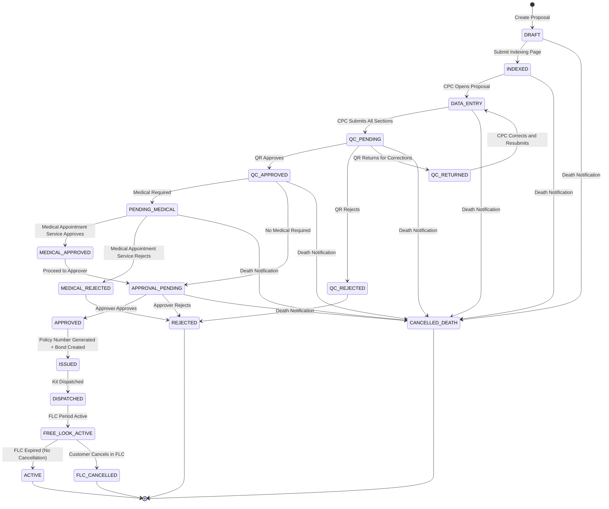
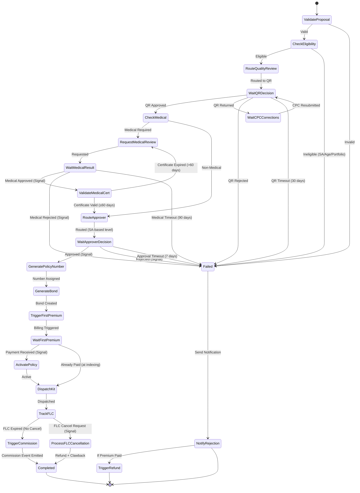

# Policy Issue Service — Business Requirements Document

**Project:** India Post PLI/RPLI Insurance Management System (IMS)
**Service:** Policy Issue Microservice
**Version:** 1.0
**Date:** February 2026
**Skills Applied:** insurance-analyst, insurance-temporal, insurance-architect
**Source Documents:** [`SRS_Policy_Issue.md`, `Portal_App_Billing_SRS_Quote_Engine.md`, `Accounting_PLI__RPLI_calculation_main.md`, `Agent_SRS_Medical_Appointment_System.md`, `BCP_KYC_IVRS_SRS_Aadhar.md`, `BCP_KYC_IVRS_SRS_PAN_e-PAN.md`, `BCP_KYC_IVRS_SRS_e-KYC_c-KYC.md`, `Portal_App_Billing_SRS_BBPS_Integration.md`, `Portal_App_Billing_SRS_Billing___Collection_of_various_PLIRPLI_receipts.md`, `Portal_App_Billing_SRS_Collections.md`, `Portal_App_Billing_SRS_Common_Service_Center__CSC_.md`, `Portal_App_Billing_SRS_Customer_Portal_Lead_Management_and_Illustration.md`, `Portal_App_Billing_SRS_Digilocker.md`]

---

## Table of Contents

- [1. Executive Summary](#1-executive-summary)
- [2. Business Context](#2-business-context)
- [3. Functional Requirements](#3-functional-requirements)
  - [3.1 — Quote Generation & Benefit Illustration](#31--quote-generation--benefit-illustration)
    - [FR-POL-001: New Business Quote Generation](#fr-pol-001-new-business-quote-generation)
    - [FR-POL-002: Lead Capture & Illustration](#fr-pol-002-lead-capture--illustration)
    - [FR-POL-003: Quote-to-Proposal Conversion](#fr-pol-003-quote-to-proposal-conversion)
  - [3.2 — Product Configuration](#32--product-configuration)
    - [FR-POL-004: Product Catalog Management](#fr-pol-004-product-catalog-management)
    - [FR-POL-005: Sum Assured Rules](#fr-pol-005-sum-assured-rules)
  - [3.3 — Proposal Creation — Without Aadhaar Flow](#33--proposal-creation--without-aadhaar-flow)
    - [FR-POL-006: Proposal Entry Point Selection](#fr-pol-006-proposal-entry-point-selection)
    - [FR-POL-007: New Business Indexing (Without Aadhaar)](#fr-pol-007-new-business-indexing-without-aadhaar)
    - [FR-POL-008: Insured Details Capture (CPC Data Entry)](#fr-pol-008-insured-details-capture-cpc-data-entry)
    - [FR-POL-009: Proposal Search & Ticket Management](#fr-pol-009-proposal-search--ticket-management)
  - [3.4 — KYC & Compliance Requirements](#34--kyc--compliance-requirements)
    - [FR-POL-034: PAN Verification Mandatory Threshold](#fr-pol-034-pan-verification-mandatory-threshold)
  - [3.5 — Nomination Management](#35--nomination-management)
    - [FR-POL-010: Nominee Management](#fr-pol-010-nominee-management)
  - [3.6 — Policy Details & Special Types](#36--policy-details--special-types)
    - [FR-POL-011: Policy Information Capture](#fr-pol-011-policy-information-capture)
    - [FR-POL-012: MWPA Policy Handling](#fr-pol-012-mwpa-policy-handling)
    - [FR-POL-013: HUF Policy Handling](#fr-pol-013-huf-policy-handling)
    - [FR-POL-014: Yugal Suraksha (Joint Life)](#fr-pol-014-yugal-suraksha-joint-life)
    - [FR-POL-015: Children's Policy (Bal Jeevan Bima / Gram Bal Jeevan Bima)](#fr-pol-015-childrens-policy-bal-jeevan-bima--gram-bal-jeevan-bima)
  - [3.7 — Agent Association](#37--agent-association)
    - [FR-POL-016: Agent Linking](#fr-pol-016-agent-linking)
  - [3.8 — Medical Information & Underwriting](#38--medical-information--underwriting)
    - [FR-POL-017: General Medical Questionnaire (All Proposals)](#fr-pol-017-general-medical-questionnaire-all-proposals)
    - [FR-POL-018: Enhanced Medical (SA ≥ ₹20 Lakh)](#fr-pol-018-enhanced-medical-sa--20-lakh)
    - [FR-POL-019: Medical Underwriting Orchestration](#fr-pol-019-medical-underwriting-orchestration)
  - [3.9 — Aadhaar Flow, Bulk Upload, Approval, Policy Generation, FLC](#39--aadhaar-flow-bulk-upload-approval-policy-generation-flc)
    - [FR-POL-020: Aadhaar-Based Proposal](#fr-pol-020-aadhaar-based-proposal)
    - [FR-POL-021: Bulk Proposal Upload](#fr-pol-021-bulk-proposal-upload)
    - [FR-POL-022: Multi-Level Approval Workflow](#fr-pol-022-multi-level-approval-workflow)
    - [FR-POL-023: Policy Number Generation](#fr-pol-023-policy-number-generation)
    - [FR-POL-024: Policy Bond Generation & Signing](#fr-pol-024-policy-bond-generation--signing)
    - [FR-POL-025: Policy Kit & Dispatch](#fr-pol-025-policy-kit--dispatch)
    - [FR-POL-026: First Premium Orchestration](#fr-pol-026-first-premium-orchestration)
    - [FR-POL-027: Free Look Period & Cancellation](#fr-pol-027-free-look-period--cancellation)
    - [FR-POL-028: DDO Communication & Bulk Changes](#fr-pol-028-ddo-communication--bulk-changes)
    - [FR-POL-029: Proposal Document Management](#fr-pol-029-proposal-document-management)
    - [FR-POL-030: Non-Medical Aadhaar Instant Issuance](#fr-pol-030-non-medical-aadhaar-instant-issuance)
    - [FR-POL-031: Customer Acknowledgement Slip Generation](#fr-pol-031-customer-acknowledgement-slip-generation)
    - [FR-POL-032: Rider / Add-on Product Management](#fr-pol-032-rider--add-on-product-management)
    - [FR-POL-033: Proposal Summary View](#fr-pol-033-proposal-summary-view)
- [4. Business Rules](#4-business-rules)
  - [4.1 — Calculation Rules](#41--calculation-rules)
    - [BR-POL-001: Base Premium Calculation](#br-pol-001-base-premium-calculation)
    - [BR-POL-002: GST Calculation](#br-pol-002-gst-calculation)
    - [BR-POL-003: Rebate Calculation](#br-pol-003-rebate-calculation)
    - [BR-POL-004: RPLI Non-Standard Age Proof Loading](#br-pol-004-rpli-non-standard-age-proof-loading)
    - [BR-POL-007: Premium Shortfall / Suspense](#br-pol-007-premium-shortfall--suspense)
    - [BR-POL-009: FLC Refund Calculation](#br-pol-009-flc-refund-calculation)
    - [BR-POL-010: Total Premium Calculation (End-to-End)](#br-pol-010-total-premium-calculation-end-to-end)
  - [4.2 — Eligibility Rules](#42--eligibility-rules)
    - [BR-POL-011: Product Eligibility — PLI](#br-pol-011-product-eligibility--pli)
    - [BR-POL-012: Product Eligibility — RPLI](#br-pol-012-product-eligibility--rpli)
    - [BR-POL-013: Medical Requirement Determination](#br-pol-013-medical-requirement-determination)
  - [4.3 — State Transition Rules](#43--state-transition-rules)
    - [BR-POL-015: Proposal State Machine](#br-pol-015-proposal-state-machine)
  - [4.4 — Approval Rules](#44--approval-rules)
    - [BR-POL-016: Approval Routing by SA](#br-pol-016-approval-routing-by-sa)
    - [BR-POL-017: Rejection Requires Comments](#br-pol-017-rejection-requires-comments)
  - [4.5 — Time-Based Rules](#45--time-based-rules)
    - [BR-POL-018: Date Validation Chain](#br-pol-018-date-validation-chain)
    - [BR-POL-019: Medical Certificate Validity](#br-pol-019-medical-certificate-validity)
    - [BR-POL-020: SA Increase Window](#br-pol-020-sa-increase-window)
    - [BR-POL-021: Free Look Period Duration](#br-pol-021-free-look-period-duration)
  - [4.6 — Validation Rules (Deduplication)](#46--validation-rules-deduplication)
    - [BR-POL-024: Proposal Deduplication](#br-pol-024-proposal-deduplication)
  - [4.7 — Edge Case Rules](#47--edge-case-rules)
    - [BR-POL-025: Age Revalidation at Approval](#br-pol-025-age-revalidation-at-approval)
    - [BR-POL-026: Death During Proposal Processing](#br-pol-026-death-during-proposal-processing)
    - [BR-POL-028: FLC Period Start Date Determination](#br-pol-028-flc-period-start-date-determination)
    - [BR-POL-029: Combined Cheque Reconciliation (Bulk Upload)](#br-pol-029-combined-cheque-reconciliation-bulk-upload)
    - [BR-POL-031: Policy Term vs Premium Ceasing Age Validation](#br-pol-031-policy-term-vs-premium-ceasing-age-validation)
    - [BR-POL-032: Configurable Workflow Timeouts](#br-pol-032-configurable-workflow-timeouts)
- [5. Data Requirements](#5-data-requirements)
  - [Entity: proposal](#entity-proposal)
  - [Entity: proposal_nominee](#entity-proposal_nominee)
  - [Entity: proposal_medical_info](#entity-proposal_medical_info)
  - [Entity: proposal_enhanced_medical](#entity-proposal_enhanced_medical)
  - [Entity: proposal_agent](#entity-proposal_agent)
  - [Entity: proposal_mwpa_trustee](#entity-proposal_mwpa_trustee)
  - [Entity: proposal_huf_member](#entity-proposal_huf_member)
  - [Entity: proposal_existing_policy](#entity-proposal_existing_policy)
  - [Entity: proposal_status_history](#entity-proposal_status_history)
  - [Entity: proposal_document_ref](#entity-proposal_document_ref)
  - [Entity: quote](#entity-quote)
  - [Entity: product_catalog](#entity-product_catalog)
  - [Entity: policy_number_sequence](#entity-policy_number_sequence)
  - [Entity: free_look_config](#entity-free_look_config)
  - [Entity: approval_routing_config](#entity-approval_routing_config)
  - [Entity: bulk_upload_batch](#entity-bulk_upload_batch)
  - [Entity: proposal_proposer](#entity-proposal_proposer)
  - [Entity: proposal_payment_mandate](#entity-proposal_payment_mandate)
  - [Entity: proposal_rider](#entity-proposal_rider)
  - [Entity: proposal_audit_log](#entity-proposal_audit_log)
- [6. Workflows](#6-workflows)
  - [6.1 — End-to-End Policy Issuance Workflow (Temporal)](#61--end-to-end-policy-issuance-workflow-temporal)
  - [6.2 — Instant Issuance Workflow (Non-Medical Aadhaar)](#62--instant-issuance-workflow-non-medical-aadhaar)
  - [6.3 — Bulk Upload Workflow](#63--bulk-upload-workflow)
  - [6.4 — Worker Configuration](#64--worker-configuration)
  - [6.5 — Temporal Operational Patterns](#65--temporal-operational-patterns)
- [7. Integration Requirements](#7-integration-requirements)
  - [INT-POL-001: Customer Service](#int-pol-001-customer-service)
  - [INT-POL-002: Customer Service (Aggregate SA & Portfolio)](#int-pol-002-customer-service-aggregate-sa--portfolio)
  - [INT-POL-003: KYC Service (UIDAI — Aadhaar)](#int-pol-003-kyc-service-uidai--aadhaar)
  - [INT-POL-004: KYC Service (NSDL — PAN)](#int-pol-004-kyc-service-nsdl--pan)
  - [INT-POL-005: KYC Service (c-KYC / e-KYC)](#int-pol-005-kyc-service-c-kyc--e-kyc)
  - [INT-POL-006: KYC Service (Digilocker)](#int-pol-006-kyc-service-digilocker)
  - [INT-POL-007: KYC Service (eIA/NSDL)](#int-pol-007-kyc-service-eiansdl)
  - [INT-POL-008: AML Service](#int-pol-008-aml-service)
  - [INT-POL-009: Fraud Analytics](#int-pol-009-fraud-analytics)
  - [INT-POL-010: Medical Appointment Service (SEPARATE MICROSERVICE)](#int-pol-010-medical-appointment-service-separate-microservice)
  - [INT-POL-011: Billing / Collections Service](#int-pol-011-billing--collections-service)
  - [INT-POL-012: Document Service (DMS)](#int-pol-012-document-service-dms)
  - [INT-POL-013: Notification Service](#int-pol-013-notification-service)
  - [INT-POL-014: Agent Service (Commission Calculation)](#int-pol-014-agent-service-commission-calculation)
  - [INT-POL-015: Audit Service](#int-pol-015-audit-service)
  - [INT-POL-016: OCR/ICR Service](#int-pol-016-ocricr-service)
  - [INT-POL-017: CSC Gateway](#int-pol-017-csc-gateway)
  - [INT-POL-018: DoP Postal Module](#int-pol-018-dop-postal-module)
  - [INT-POL-019: GCIF Integration (Future-Ready) + CRM Reverse Feed](#int-pol-019-gcif-integration-future-ready--crm-reverse-feed)
  - [INT-POL-020: Print Service Integration](#int-pol-020-print-service-integration)
  - [INT-POL-021: Accounting Service (Stamp Duty)](#int-pol-021-accounting-service-stamp-duty)
  - [INT-POL-022: Customer Service eKYC Module (Aadhaar/PAN Authentication)](#int-pol-022-customer-service-ekyc-module-aadharpan-authentication)
  - [INT-POL-023: Medical Appointment Service (Fee & Underwriting)](#int-pol-023-medical-appointment-service-fee--underwriting)
- [8. Validation Rules](#8-validation-rules)
  - [VAL-POL-001 to VAL-POL-026](#val-pol-001-date-chain-validation)
- [9. Non-Functional Requirements](#9-non-functional-requirements)
- [10. Assumptions and Constraints](#10-assumptions-and-constraints)
- [11. Open Issues](#11-open-issues)
- [12. Analysis Checklist](#12-analysis-checklist)

---

## 1. Executive Summary

- **Purpose**: The Policy Issue Service manages the complete new business lifecycle for India Post's Postal Life Insurance (PLI) and Rural Postal Life Insurance (RPLI) products — from quote generation through proposal creation, underwriting, approval, policy issuance, bond generation, dispatch, and free look period management.
- **Scope**:
  - **INCLUDED**: Quote generation (new business only), proposal creation (with/without Aadhaar, bulk upload), premium calculation orchestration, nomination management, medical questionnaire capture, medical underwriting orchestration, approval workflow, policy number generation, policy bond/kit generation, dispatch tracking, free look period & cancellation, agent association, DDO support.
  - **EXCLUDED**: Customer identity CRUD (Customer Service), KYC verification (KYC Service), AML/Fraud checks (AML Service), payment processing (Billing Service), doctor panel & medical appointments (Medical Appointment Service), document storage (Document Service), agent management & commission calculation (Agent Service), servicing quotes (Surrender, Revival, Loan — respective servicing microservices), customer onboarding workflows (Customer Onboarding Service), non-financial changes like name/address updates (Non-Financial Service).
- **Stakeholders**: PLI Directorate, India Post CPC operators, Post Office counter staff, policyholders, agents, Development Officers, DDOs, DoP IT.

---

## 2. Business Context

- **Current Process**: Policy proposals are processed through a mix of manual forms and legacy systems across Post Offices and CPCs. Quote generation, data entry, underwriting, approval, and bond generation involve paper-based workflows with limited integration between stages.
- **Problems**:
  - No unified digital proposal lifecycle from quote to issuance
  - Manual premium calculation prone to errors
  - No configurable product-rule engine for 12 PLI/RPLI products
  - Paper-based approval workflows causing delays (days to weeks)
  - No tracking of free look period or dispatch status
  - Disconnected medical underwriting process
  - No real-time eligibility checks (SA limits, age, KYC status)
- **Proposed Solution**: A microservice-based Policy Issue Service built on Temporal workflow orchestration, providing end-to-end digital proposal lifecycle management. The service integrates with Customer Service, KYC Service, Medical Appointment Service, Billing Service, and other microservices via Temporal activities. All 12 PLI/RPLI products are supported through a configurable product catalog with rule-driven premium calculation.
- **Benefits**:
  - Digital end-to-end proposal lifecycle with full audit trail
  - Instant issuance for non-medical Aadhaar-authenticated proposals
  - Configurable approval routing based on SA brackets
  - Automated free look period tracking with refund calculation
  - Real-time premium calculation with GST, rebate, stamp duty
  - Bulk proposal upload for corporate policies
  - Multi-channel support (Counter, Web, Mobile, CSC, Agent Portal)

---

## 3. Functional Requirements

### 3.1 — Quote Generation & Benefit Illustration

#### FR-POL-001: New Business Quote Generation
- **Priority**: High
- **Description**: System SHALL allow customers, agents, and counter staff to generate premium quotes for new PLI/RPLI policies across multiple channels (Customer Portal, Agent Portal, Counter Staff Interface).
- **Acceptance Criteria**:
  1. User selects Policy Type (PLI/RPLI), Plan Type from filtered dropdown
  2. User enters proposer details: Name, Gender, DOB, Mobile, Email, Category, Location
  3. User enters Sum Assured, Policy Term, Payment Mode, optional Riders/Add-ons
  4. System validates eligibility (age limits, term limits, SA min/max per product)
  5. System fetches premium rate from Sankalan tables (Appendix 5 PLI, Appendix 7 RPLI) by Age, Gender, Plan, Term, Frequency
  6. System calculates: Base Premium, GST (CGST/SGST/IGST/UTGST), Total Payable
  7. System displays quote summary: plan, term, SA, premium, maturity value, indicative bonus rate, total payable
  8. System generates unique Quote Reference Number
  9. User can modify inputs and regenerate quote
  10. User can download/print PDF or email the quote
  11. Quote record saved to database for audit
- **Dependencies**: Product Catalog (BR-POL-010–021), Premium Rate Tables, GST Configuration
- **Source**: FS_QE_001, FS_QE_004–006, FS_QE_008 — [`Portal_App_Billing_SRS_Quote_Engine.md`]

#### FR-POL-002: Lead Capture & Illustration
- **Priority**: Medium
- **Description**: System SHALL capture leads from multiple channels (web, mobile, email, walk-in, agent referral, campaign) and allow generation of benefit illustrations that seamlessly transition to proposal creation.
- **Acceptance Criteria**:
  1. Lead captured with: Name, Contact Number, Email, Address, Lead Type (New/Existing)
  2. Illustration generated based on customer inputs (Age, Product Type, SA, Policy Term, Premium Mode)
  3. "Proceed to Policy Creation" button transitions illustration to proposal
  4. Basic details from illustration tagged with Proposal ID
  5. Customer details pre-populated from quote/illustration into proposal
- **Dependencies**: FR-POL-001
- **Source**: FS-LMI-001, FS-LMI-005, FS_NB_027, FS_NB_028 — [`Portal_App_Billing_SRS_Customer_Portal_Lead_Management_and_Illustration.md`, `SRS_Policy_Issue.md`]

#### FR-POL-003: Quote-to-Proposal Conversion
- **Priority**: High
- **Description**: System SHALL allow seamless conversion of an accepted quote into a new proposal, pre-populating all common fields.
- **Acceptance Criteria**:
  1. "Proceed to Policy Creation" button on quote summary creates new proposal
  2. Product type, SA, term, frequency, premium auto-populated from quote
  3. Customer details (name, DOB, gender, contact) auto-populated
  4. Quote Reference Number linked to proposal for traceability
- **Dependencies**: FR-POL-001, FR-POL-007
- **Source**: FS-LMI-005, FS_NB_027, FS_NB_028 — [`Portal_App_Billing_SRS_Customer_Portal_Lead_Management_and_Illustration.md`, `SRS_Policy_Issue.md`]

---

### 3.2 — Product Configuration

#### FR-POL-004: Product Catalog Management
- **Priority**: High
- **Description**: System SHALL maintain a configurable product catalog for all 12 PLI/RPLI products with product-specific rules for SA limits, age limits, term limits, premium modes, and medical requirements.
- **Acceptance Criteria**:
  1. PLI Products: Suraksha (WLA), Suvidha (CWLA), Santosh (EA), Sumangal (AEA), Yugal Suraksha, Bal Jeevan Bima
  2. RPLI Products: Gram Suraksha, Gram Suvidha, Gram Santosh, Gram Sumangal, Gram Priya, Bal Jeevan Bima (RPLI)
  3. Each product defines: min/max SA, min/max entry age, max maturity age, available premium modes, premium ceasing age options, medical requirement thresholds
  4. Product Name dropdown filtered by Policy Type selection
  5. Product Description auto-filled on product selection
  6. System validates SA against product limits and shows error for invalid values
- **Dependencies**: Premium Rate Tables (GAP-004)
- **Source**: Product Intro (Accounting_PLI_RPLI), TC_NB_PO_006 — [`Accounting_PLI__RPLI_calculation_main.md`, `SRS_Policy_Issue.md`]

#### FR-POL-005: Sum Assured Rules
- **Priority**: High
- **Description**: System SHALL enforce product-specific SA limits and change restrictions.
- **Acceptance Criteria**:
  1. Minimum SA enforced: PLI ₹20,000 per product; RPLI ₹10,000 per product
  2. RPLI with non-standard age proof: max SA ₹1,00,000
  3. Decrease of SA NOT allowed on Sumangal, Gram Sumangal, Gram Priya
  4. After commutation, SA must not fall below product minimum
  5. SA increase allowed ONLY at proposal stage within 60 days from application date
  6. After conversion to policy, SA change requires new proposal
  7. System displays error for SA outside valid range
- **Dependencies**: Customer Portfolio Service (aggregate SA check)
- **Source**: Commutation Rules, Premium Note, PI A.65, TC_NB_PO_006 — [`Accounting_PLI__RPLI_calculation_main.md`, `SRS_Policy_Issue.md`]

---

### 3.3 — Proposal Creation — Without Aadhaar Flow

#### FR-POL-006: Proposal Entry Point Selection
- **Priority**: High
- **Description**: System SHALL offer two proposal creation paths: "Policy Issue – Without Aadhaar" and "Policy Issue – With Aadhaar" from the cover page.
- **Acceptance Criteria**:
  1. Cover page displays two cards/buttons for path selection
  2. Without Aadhaar path opens: "Creating New Application" or "Search for Existing Application"
  3. With Aadhaar path opens Aadhaar input page
- **Source**: Sec 4.1, Sec 4.2 — [`SRS_Policy_Issue.md`]

#### FR-POL-007: New Business Indexing (Without Aadhaar)
- **Priority**: High
- **Description**: System SHALL capture initial proposal data on the New Business Indexing page and generate a proposal number on submission.
- **Acceptance Criteria**:
  1. Fields: Product Type (PLI/RPLI), Product Name (filtered), Product Description (auto), Receipt Date, Proposal Date, Declaration Date, Indexing Date, PO Code, Name, DOB, Gender, Opportunity ID, Issue Circle/HO/PO, SA, Premium Ceasing Age, Frequency
  2. "Calculate Premium" button computes premium; displayed in non-editable field
  3. Date validation chain: Declaration ≤ Receipt ≤ Indexing ≤ Proposal (6 error messages)
  4. On submit: Proposal Number auto-generated
  5. Post-submit: Print Acknowledgement Slip, Pay Premium, New Indexing
- **Dependencies**: FR-POL-004, BR-POL-001
- **Source**: Wireframe 4.1.1, Error Table 4.1.1 — [`SRS_Policy_Issue.md`]

#### FR-POL-008: Insured Details Capture (CPC Data Entry)
- **Priority**: High
- **Description**: System SHALL capture complete insured person details including personal, address, contact, employment, bank, and gender/product-specific fields.
- **Acceptance Criteria**:
  1. Personal: Salutation, Name, Gender, Marital Status, Father/Husband Name, DOB, Age Proof, Aadhaar, Nationality
  2. Communication Address: Line1/2, Village, Taluka, City, District, State, Country, Pin
  3. "Permanent = Communication" checkbox (default: Checked)
  4. Contact: Type, STD Code, Landline, Mobile, Email
  5. "Insured = Proposer" checkbox (default: Checked); if unchecked, full proposer details
  6. Employment checkbox; when checked: Occupation, PAO/DDO, Organization, Designation, Entry Date, PAN, Income, Employer Address, Qualification
  7. Payment method dropdown, Bank Account + IFSC
  8. Married female: Children count, Last Delivery, Expected Month, Identification Marks
  9. Children's: Mother's Name, Parent Policy Number (searchable)
  10. Yugal Suraksha: "Add Spouse" button replicates all fields
  11. 13 error validations enforced
- **Dependencies**: Customer Service (CreateCustomer activity)
- **Source**: Wireframe 4.1.4 — [`SRS_Policy_Issue.md`]

#### FR-POL-009: Proposal Search & Ticket Management
- **Priority**: Medium
- **Description**: System SHALL allow CPC users to search existing proposals and manage work queue tickets with return journey support.
- **Acceptance Criteria**:
  1. Search by Proposal Number with Fetch
  2. Ticket page filters (all optional, combinable):
     - Request Queue (ENUM: DATA_ENTRY, QC_REVIEW, APPROVAL, MEDICAL_PENDING)
     - Stage Date Range (from/to)
     - Operation Center / PO Code
     - Status (multi-select from state machine states)
     - Proposal Number (exact or prefix search)
     - Product Code / Product Name
     - Request Type (ENUM: NEW, CORRECTION, RESUBMIT)
     - Policy Number (for post-issuance lookup)
     - Customer Name / Customer ID
  3. Results: Ticket ID, Customer ID, Proposal No, Status, Dates, Actions
  4. Opened proposal shows tabs: Insured, Nomination, Policy Details, Agent, Medical
  5. Return journey: previously saved data retrieved and populated
  6. Sort by: stage_date (default), proposal_number, status
  7. Pagination: max 50 results per page
- **Source**: Wireframe 4.1.2–4.1.3, FS_NB_037 — [`SRS_Policy_Issue.md`]

---

### 3.4 — KYC & Compliance Requirements

#### FR-POL-034: PAN Verification Mandatory Threshold
- **Priority**: High
- **Description**: System SHALL enforce PAN (Permanent Account Number) verification as mandatory when annual premium meets or exceeds the regulatory threshold, per Income Tax Act Section 139A requirements.
- **Acceptance Criteria**:
  1. PAN field mandatory if `annual_premium >= ₹50,000`
  2. Threshold check performed on calculated annual premium (before GST addition)
  3. If annual_premium < ₹50,000:
     - PAN optional
     - If PAN not provided, system SHALL capture Form 60 declaration
     - Form 60: reason for non-availability of PAN (dropdown), declarant signature
  4. PAN validation:
     - Format: 10 alphanumeric characters (e.g., ABCDE1234F)
     - Pattern: 5 letters + 4 digits + 1 letter
     - Integration with NSDL PAN verification API (INT-POL-004)
  5. For HUF policies: HUF PAN mandatory (separate field)
  6. Error messages:
     - "PAN is mandatory for policies with annual premium ≥ ₹50,000 (Income Tax Act compliance)"
     - "Invalid PAN format. Please enter 10-character PAN (e.g., ABCDE1234F)"
     - "PAN verification failed. Please verify PAN number with NSDL"
  7. Audit trail: Log PAN verification status, verification_date, NSDL response
- **Rationale**: Income Tax Rule 114B mandates PAN collection for life insurance policies with annual premium ≥ ₹50,000 to prevent tax evasion and ensure compliance with PMLA (Prevention of Money Laundering Act).
- **Dependencies**: KYC Service (INT-POL-004 — PAN Verification API)
- **Source**: FS_NB_003 (Line 157: "PAN Number (Mandatory if premium is above 50,000)") — [`SRS_Policy_Issue.md`]
- **Regulatory Reference**: Income Tax Act, Section 139A; Income Tax Rule 114B

---

### 3.5 — Nomination Management

#### FR-POL-010: Nominee Management
- **Priority**: High
- **Description**: System SHALL capture and validate nominee details for each proposal with minor-nominee handling.
- **Acceptance Criteria**:
  1. "Add Nominee" fields: Salutation, Name, Gender, DOB, Relationship, Share %, Address, Phone, Email
  2. Maximum 3 nominees
  3. Share % sum MUST equal 100%
  4. Nomination mandatory unless HUF or MWPA selected
  5. Auto-calculate minor status from DOB (age < 18)
  6. Minor nominee requires Appointee/Assignee details
  7. Nominee-proposer relationship captured
- **Dependencies**: None
- **Source**: Wireframe 4.1.5, FS_NB_047–049 — [`SRS_Policy_Issue.md`]

---

### 3.6 — Policy Details & Special Types

#### FR-POL-011: Policy Information Capture
- **Priority**: High
- **Description**: System SHALL capture policy dates, coverage, premium breakdown, and existing policy declarations.
- **Acceptance Criteria**:
  1. Dates: Declaration, Acceptance, Issue PO, Receipt, Commencement of Risk
  2. "Policy Taken Under": HUF / MWPA / Other
  3. Declarations: existing PLI/RPLI, non-PLI/RPLI, other companies (Yes/No + details)
  4. Base Coverage (auto-populated): Type, Ceasing Age, SA, Medical, Coverage Age
  5. Premium Info: Annual Equivalent, Initial, Additional, Method, Mode, Frequency, Modal, Payable, Short/Excess
- **Source**: Wireframe 4.1.6 — [`SRS_Policy_Issue.md`]

#### FR-POL-012: MWPA Policy Handling
- **Priority**: Medium
- **Description**: System SHALL support MWPA policies with trustee management. Nomination NOT mandatory.
- **Acceptance Criteria**:
  1. "Appoint Trustee?" (Yes/No); if Yes: Trust Type, Name, DOB, Relationship, Address
- **Source**: Wireframe 4.1.6 — [`SRS_Policy_Issue.md`]

#### FR-POL-013: HUF Policy Handling
- **Priority**: Medium
- **Description**: System SHALL support HUF policies with Karta and co-parcener management. Nomination NOT mandatory.
- **Acceptance Criteria**:
  1. HUF fields: Financed under HUF?, Karta Name, HUF PAN, Life Assured ≠ Karta? (reason if Yes)
  2. "Add HUF Member": Name, Relationship, Age (max 7 members)
- **Source**: Wireframe 4.1.6 — [`SRS_Policy_Issue.md`]

#### FR-POL-014: Yugal Suraksha (Joint Life)
- **Priority**: Medium
- **Description**: System SHALL create two customer records with independent medical underwriting.
- **Acceptance Criteria**:
  1. Two Customer IDs; "Add Spouse" replicates all fields
  2. Two medical checkboxes per question
- **Source**: FS_NB_015, Wireframe 4.1.4 — [`SRS_Policy_Issue.md`]

#### FR-POL-015: Children's Policy (Bal Jeevan Bima / Gram Bal Jeevan Bima)
- **Priority**: Medium
- **Description**: System SHALL support children's policies (Bal Jeevan Bima for PLI, Gram Bal Jeevan Bima for RPLI) with age restrictions, parent policy linkage, and Sum Assured limits tied to parent's policy.
- **Acceptance Criteria**:
  1. **PLI Children's Policy (Bal Jeevan Bima)**:
     - Minimum Age for entry: 5 Years
     - Maximum Age for entry: 20 Years
     - Maximum Sum Assured: ₹3 lakh OR parent's policy SA (whichever is lower)
     - Maximum 2 children eligible, one policy per child
     - No premium payable in case of death of Main Policy Holder (parent)
  2. **RPLI Children's Policy (Gram Bal Jeevan Bima)**:
     - Minimum Age for entry: 5 Years
     - Maximum Age for entry: 20 Years
     - Parent must not be over 45 years of age (RPLI-specific rule)
     - Maximum Sum Assured: ₹1 lakh OR parent's policy SA (whichever is lower)
  3. Mother's Name field mandatory for children's policy
  4. Parent's Policy Number mandatory (searchable, validated as active)
  5. System validates child age is between 5-20 years on proposal_date
  6. System validates parent age ≤ 45 years (RPLI only)
  7. System validates proposed SA ≤ min(product_max_sa, parent_policy_sa)
  8. Error messages:
     - "Child age must be between 5 and 20 years for children's policy"
     - "Parent age cannot exceed 45 years for RPLI children's policy"
     - "Children's policy Sum Assured cannot exceed parent's policy Sum Assured or product maximum"
- **Dependencies**: Customer Service (parent policy lookup), Product Catalog (FR-POL-004)
- **Source**: Wireframe 4.1.4, PR_PLI_CP_002/003, PR_RPLI_CP_002/003 — [`SRS_Policy_Issue.md`, `SRS_Product_Configuration.md`]

---

### 3.7 — Agent Association

#### FR-POL-016: Agent Linking
- **Priority**: Medium
- **Description**: "Proposal Without Agent" checkbox (default: Checked). When unchecked: Agent ID, Search, Correspondence flag. Channel tracking: Direct, Agency, Web, Mobile, POS, CSC.
- **Source**: Wireframe 4.1.7, FS_NB_026 — [`SRS_Policy_Issue.md`]

---

### 3.8 — Medical Information & Underwriting

#### FR-POL-017: General Medical Questionnaire (All Proposals)
- **Priority**: High
- **Description**: 15-disease checklist, family history, hospitalization, deformity, family doctor. Yugal: two checkboxes per question.
- **Source**: Wireframe 4.1.9 — [`SRS_Policy_Issue.md`]

#### FR-POL-018: Enhanced Medical (SA ≥ ₹20 Lakh)
- **Priority**: High
- **Description**: 10 additional questions, female-specific, personal habits. Age > 50 blocks non-medical.
- **Source**: Wireframe 4.1.10, TC_NB_Aadhar_018 — [`BCP_KYC_IVRS_SRS_Aadhar.md`, `SRS_Policy_Issue.md`]

#### FR-POL-019: Medical Underwriting Orchestration
- **Priority**: High
- **Description**: Determine medical requirement (BR-POL-013) → call **Medical Appointment Service** via Temporal activity → await `MedicalReviewResultCallback` signal → validate certificate (60 days) → proceed or block.
- **Acceptance Criteria**:
  1. Policy Issue determines IF medical is required based on BR-POL-013 (age, SA threshold, questionnaire)
  2. If required, call `RequestMedicalReview` activity (INT-POL-010)
  3. Medical Appointment Service owns: doctor panel, appointment scheduling, examination, fee calculation
  4. Policy Issue receives signal with: `{decision, medical_fee, examination_date, report_ref_id, rejection_reason}`
  5. Medical fee is returned by Medical Appointment Service (not calculated by Policy Issue)
  6. Certificate validity check (60 days from examination_date) enforced before approval
- **Dependencies**: Medical Appointment Service (separate microservice) — see **INT-POL-010**
- **Note**: Medical underwriting decision and fee calculation are **owned by Medical Appointment Service**. Policy Issue only orchestrates the workflow.
- **Source**: FS_MA_007–016, POLI Rule 28–29 — [`Agent_SRS_Medical_Appointment_System.md`, `SRS_Policy_Issue.md`]

---

### 3.9 — Aadhaar Flow, Bulk Upload, Approval, Policy Generation, FLC

#### FR-POL-020: Aadhaar-Based Proposal
- **Priority**: High
- **Description**: Aadhaar auth → UIDAI data fetch → auto-populate → same flows → instant issuance for non-medical.
- **Source**: Wireframe 4.2, TC_NB_Aadhar_014–015 — [`BCP_KYC_IVRS_SRS_Aadhar.md`, `SRS_Policy_Issue.md`]

#### FR-POL-021: Bulk Proposal Upload
- **Priority**: Medium
- **Description**: Template download, upload validation, success/failure summary, deduplication, combined cheque.
- **Source**: FS_NB_059–061, Wireframe 4.3 — [`SRS_Policy_Issue.md`]

#### FR-POL-022: Multi-Level Approval Workflow
- **Priority**: High
- **Description**: CPC → QR (Approve/Reject/Return) → Approver (Approve/Reject). SA-based routing: L1 ≤ ₹5L, L2 ₹5–10L, L3 > ₹10L. Policy number ONLY after approval. Full audit.
- **Source**: FS_NB_091–097, Business Rule 4.1.11 — [`SRS_Policy_Issue.md`]

#### FR-POL-023: Policy Number Generation
- **Priority**: High
- **Description**: Separate series per product type. Generated ONLY post-approval. Instant for non-medical Aadhaar.
- **Source**: FS_NB_063 — [`SRS_Policy_Issue.md`]

#### FR-POL-024: Policy Bond Generation & Signing
- **Priority**: High
- **Description**: Bond with client details, terms, signatures. Digital signing, PDF storage, QR codes, Digilocker.
- **Additional Acceptance Criteria (from Review)**:
  1. Bond includes QR code encoding policy number, customer ID, issue date, and SA for quick verification (FS_NB_099)
  2. Support both centralized printing (CPC) and decentralized printing (Post Office) (FS_NB_100)
  3. Integration with external print solutions for Letters, Sanction Memos, Calculation Sheets (FS_NB_101)
- **Source**: FS_NB_098–106 — [`SRS_Policy_Issue.md`]

#### FR-POL-025: Policy Kit & Dispatch
- **Priority**: High
- **Description**: Physical + electronic kit. Dispatch tracking via DoP. FLC start from dispatch. Barcode/QR on documents.
- **Additional Acceptance Criteria (from Review)**:
  1. Dispatch envelope includes scannable barcode as per DoP Acceptance Memo format (FS_NB_098)
  2. System provides reverse feed to CRM portals with kit dispatch/delivery status (FS_NB_053)
  3. Dashboard alert visible to booking user showing bond printing and dispatch status (FS_NB_062)
- **Source**: FS_NB_039–053, FS_NB_098 — [`SRS_Policy_Issue.md`]

#### FR-POL-026: First Premium Orchestration
- **Priority**: High
- **Description**: First payment = exact premium. Multi-channel collection. Refund on rejection (minus medical fee). BBPS support.
- **Source**: Sec 2, POLI Rule 20–22, FS_BBPS_001 — [`Portal_App_Billing_SRS_BBPS_Integration.md`, `SRS_Policy_Issue.md`]

#### FR-POL-027: Free Look Period & Cancellation
- **Priority**: High
- **Description**: Configurable per channel/product. FLC refund = Premium − (Risk + Stamp + Medical). GST not refunded. Commission clawback. 7 working days processing.
- **Additional Acceptance Criteria (from Review)**:
  1. Authorized role (Senior Manager or above) CAN override FLC expiry with mandatory comments and supervisor approval — for genuine cases received within reasonable grace (FS_NB_056)
  2. System SHALL generate FLC Refund Receipt on cancellation with: original premium, itemized deductions (proportionate risk, stamp duty, medical fee), net refund amount, GST note ("GST not refundable"), and unique receipt number. Receipt stored in DMS. (FS_NB_058)
  3. FLC tracking entity includes: `is_overridden` (BOOLEAN), `override_by` (UUID), `override_reason` (TEXT), `override_approved_by` (UUID)
- **Source**: FS_NB_052–058, Sec 2.2.2 — [`SRS_Policy_Issue.md`]

#### FR-POL-028: DDO Communication & Bulk Changes
- **Priority**: Medium
- **Description**: DDO letters, GST change notifications, BMC (Cash↔Pay bulk change).
- **Source**: FS_NB_064–065 — [`SRS_Policy_Issue.md`]

#### FR-POL-029: Proposal Document Management
- **Priority**: High
- **Description**: Document upload/association with DMS. OCR for physical forms. Versioning. Maker-checker for replacement.
- **Source**: FS_NB_066–090 — [`SRS_Policy_Issue.md`]

#### FR-POL-030: Non-Medical Aadhaar Instant Issuance
- **Priority**: High
- **Description**: Selected products + channels + auth methods → skip approval → auto policy number → bond via WhatsApp/Email.
- **Source**: FS_NB_041, Business Rule 4.2 — [`SRS_Policy_Issue.md`]

#### FR-POL-031: Customer Acknowledgement Slip Generation
- **Priority**: High
- **Description**: System SHALL generate a Customer Acknowledgement Slip on proposal submission (indexing) confirming receipt of application.
- **Acceptance Criteria**:
  1. Generated immediately after proposal number assignment
  2. Contains: Proposal Number, Date, Product Name, Sum Assured, Premium Amount, PO Code, Customer Name
  3. Printable via counter (thermal/A4) and downloadable via digital channels (PDF)
  4. Stored in DMS for audit trail
- **Dependencies**: FR-POL-007
- **Source**: Sec 4.1.1 (post-submit: "Print Customer Acknowledgement Slip") — [`SRS_Policy_Issue.md`]

#### FR-POL-032: Rider / Add-on Product Management
- **Priority**: Medium
- **Description**: System SHALL support attachment of rider products to base proposals, with separate premium calculation and underwriting.
- **Acceptance Criteria**:
  1. Riders configured as separate products in product catalog with linkage to eligible base products
  2. "Add Rider" option on proposal details page
  3. Rider SA, Term, Premium independently captured and validated
  4. Rider premium added to total premium pipeline (BR-POL-010)
  5. Rider underwriting may trigger additional medical requirements
  6. Rider appears on policy bond and premium receipt
- **Dependencies**: Product Catalog, FR-POL-004
- **Source**: FS_NB_023, GAP-011 — [`SRS_Policy_Issue.md`]

#### FR-POL-033: Proposal Summary View
- **Priority**: High
- **Description**: System SHALL display a one-page proposal summary for Quality Reviewer and Approver decision-making.
- **Acceptance Criteria**:
  1. Summary includes: Insured name/DOB/age, Product, SA, Term, Premium (full breakdown), Payment mode
  2. Nominee details (name, share %, minor status)
  3. Medical status (required/not, result if done)
  4. Agent details (name, ID)
  5. Channel, all four dates (declaration/receipt/indexing/proposal)
  6. Existing policy declarations
  7. Any flags: non-standard age proof, adverse health, aggregate SA warning
  8. Read-only view for QR and Approver roles; no edit capability on summary
- **Dependencies**: FR-POL-008–019
- **Source**: FS_NB_035 — [`SRS_Policy_Issue.md`]

---

## 4. Business Rules

### 4.1 — Calculation Rules

#### BR-POL-001: Base Premium Calculation
- **Rule ID**: BR-POL-001
- **Category**: Calculation
- **Entity**: Proposal / Quote
- **Description**: Premium is calculated from Sankalan premium tables issued by PLI Directorate. Tables are product-specific (Appendix 5 PLI, Appendix 7 RPLI).
- **Logic**:
  ```
  base_premium = lookup_sankalan_table(product_code, age_at_entry, gender, sa, term, frequency)
  // Sankalan tables provide per-₹1000 SA rates
  // base_premium = (sa / 1000) × rate_per_thousand × frequency_factor
  ```
- **Inputs**: product_code, age_at_entry, gender, sum_assured, policy_term, payment_frequency
- **Output**: base_premium_amount
- **Validation**: All inputs > 0; product must exist in catalog; age within product limits
- **Source**: Section 1.1, Accounting_PLI_RPLI — [`Accounting_PLI__RPLI_calculation_main.md`, `SRS_Policy_Issue.md`]

#### BR-POL-002: GST Calculation
- **Rule ID**: BR-POL-002
- **Category**: Calculation
- **Entity**: Proposal / Premium
- **Description**: GST applied to premium. Type determined by location (intra-state vs inter-state).
- **Logic**:
  ```
  IF insured_state == service_provider_state THEN
    cgst = base_premium × cgst_rate
    sgst = base_premium × sgst_rate  // OR utgst for union territories
    igst = 0
  ELSE
    igst = base_premium × igst_rate
    cgst = 0; sgst = 0
  END
  total_gst = cgst + sgst + utgst + igst
  ```
- **Inputs**: base_premium, insured_state, service_provider_state, gst_rates (configurable)
- **Output**: cgst, sgst, utgst, igst, total_gst
- **Note**: GST rate assumed 18% — needs confirmation (GAP-005). GST NOT refunded in FLC.
- **Source**: Accounting Entries, FS_NB_064 — [`Accounting_PLI__RPLI_calculation_main.md`, `SRS_Policy_Issue.md`]

#### BR-POL-003: Rebate Calculation
- **Rule ID**: BR-POL-003
- **Category**: Calculation
- **Entity**: Premium
- **Description**: Rebate on advance premium payment.
- **Logic**:
  ```
  IF policy_type == "PLI" THEN
    IF advance_months >= 12 THEN rebate_rate = 0.02  // 2%
    ELSE IF advance_months >= 6 THEN rebate_rate = 0.01  // 1%
    ELSE rebate_rate = 0
  ELSE IF policy_type == "RPLI" THEN
    IF advance_months >= 3 THEN rebate_rate = 0.005  // 0.5%
    ELSE rebate_rate = 0
  END
  rebate_amount = total_advance_premium × rebate_rate

  // Additional rebate for EA/WLA/AEA products:
  IF product IN ("EA", "WLA", "AEA") THEN
    additional_rebate = (sa / 20000) × 1 × advance_months  // ₹1 per ₹20K SA per month
  END
  ```
- **Source**: POLI Rule, Sec 5.1.2–5.1.4 — [`SRS_Policy_Issue.md`]

#### BR-POL-004: RPLI Non-Standard Age Proof Loading
- **Rule ID**: BR-POL-004
- **Category**: Calculation
- **Entity**: Premium
- **Description**: Extra premium for RPLI with non-standard proof of age.
- **Logic**:
  ```
  IF policy_type == "RPLI" AND age_proof_type == "NON_STANDARD" THEN
    loaded_premium = base_premium × 1.05  // 5% extra
    IF sa > 25000 THEN medical_required = true
    IF sa >= 25000 AND age > 45 THEN REJECT "Age exceeds 45 for non-standard proof with SA ≥ ₹25K"
  END
  ```
- **Source**: Premium Note, Accounting_PLI_RPLI — [`Accounting_PLI__RPLI_calculation_main.md`]

> **Note (BR-POL-005 MOVED)**: Medical fee calculation is **owned by Medical Appointment Service**. Policy Issue receives `medical_fee` in the response from `RequestMedicalReview` activity. See **INT-POL-010** for integration details.

> **Note (BR-POL-006 MOVED)**: Stamp duty calculation is **owned by Accounting Service**. Policy Issue calls `GetStampDuty(state, sa, product_type)` activity and receives the stamp duty amount. Stamp duty is also required for revival, surrender refunds — centralized calculation prevents duplication. See **INT-POL-021** for integration details.

#### BR-POL-007: Premium Shortfall / Excess Adjustment (DOB Change)
- **Rule ID**: BR-POL-007
- **Category**: Calculation
- **Entity**: Premium / Accounting
- **Description**: Age change between payment and approval creates premium shortfall or excess. DOB validation should occur at first premium collection to detect age changes early.
- **Logic**:
  ```
  // Triggered at First Premium Collection
  age_at_first_premium = calculate_age(proposal.insured_dob, current_date)
  age_at_indexing = proposal.age_at_indexing
  
  IF age_at_first_premium != age_at_indexing THEN
    // Recalculate premium with new age
    new_premium = recalculate_premium(age_at_first_premium, product, sa, term, freq)
    premium_difference = new_premium - original_premium
    
    IF premium_difference > 0 THEN
      // SHORT PREMIUM CASE - customer needs to pay more
      short_premium = premium_difference
      action = "COLLECT_SHORT_PREMIUM"
      // Block approval until short premium collected
      // Create suspense entry for tracking
      post_to_suspense(proposal_id, short_premium, reason="AGE_CHANGE_SHORT_PREMIUM")
      notify_customer(short_premium_amount, payment_link)
    ELSE IF premium_difference < 0 THEN
      // EXCESS PREMIUM CASE - customer paid more
      excess_premium = ABS(premium_difference)
      action = "ADJUST_EXCESS_PREMIUM"
      // Option 1: Refund excess (customer choice)
      // Option 2: Adjust against next premium (default)
      excess_adjustment = {
        excess_amount: excess_premium,
        adjustment_type: "CREDIT_TO_NEXT_PREMIUM",  // or REFUND
        adjusted_against: "NEXT_PREMIUM_DUE",
        remaining_balance: excess_premium
      }
      // Store for Collections Service to apply at 2nd premium
      store_excess_credit(proposal_id, excess_adjustment)
    END
    
    // Update proposal with new age and premium
    proposal.age_at_entry = age_at_first_premium
    proposal.has_age_change = true
    proposal.original_premium = original_premium
    proposal.revised_premium = new_premium
  END
  ```
- **Events Published**:
  - `proposal.age_changed` - with old_age, new_age, premium_difference
  - `proposal.short_premium_detected` - if shortfall
  - `proposal.excess_premium_detected` - if excess
- **Resolution Workflow**:
  1. Short Premium: Block further processing → Notify customer → Collect additional premium → Clear suspense
  2. Excess Premium: Credit to next premium by default → Customer can request refund via separate process
- **Source**: Sec 2.2.4 — [`SRS_Policy_Issue.md`]

> **Note (BR-POL-008 MOVED)**: Default fee / late payment calculation is **owned by Collections Service**. Policy Issue deals only with **first premium** for new business. Renewal premium tracking and default fee calculation belong to Collections Service and Policy Service. See **INT-POL-011** for integration details.

#### BR-POL-009: FLC Refund Calculation
- **Rule ID**: BR-POL-009
- **Category**: Calculation
- **Entity**: Policy / Cancellation
- **Description**: Free look cancellation refund formula.
- **Logic**:
  ```
  proportionate_risk_premium = (base_premium / 365) × days_of_coverage
  flc_refund = initial_premium_paid
               - proportionate_risk_premium
               - stamp_duty
               - medical_fee
  // GST is NOT refunded
  // No refund after FLC unless premia paid ≥ 36 months (surrender rules)
  ```
- **Preconditions**: No claims during FLC; complete documentation; 7 working days processing
- **Source**: FS_NB_057, Sec 2.2.2–2.2.3 — [`SRS_Policy_Issue.md`]

#### BR-POL-010: Total Premium Calculation (End-to-End)
- **Rule ID**: BR-POL-010
- **Category**: Calculation
- **Entity**: Quote / Proposal
- **Description**: Complete premium calculation pipeline.
- **Logic**:
  ```
  1. base_premium    = lookup_sankalan(product, age, gender, sa, term, freq)
  2. loaded_premium  = IF rpli_non_standard THEN base × 1.05 ELSE base
  3. rebate          = calculate_rebate(policy_type, advance_months, sa, product)
  4. net_premium     = loaded_premium - rebate
  5. gst             = calculate_gst(net_premium, insured_state, provider_state)
  6. stamp_duty      = lookup_stamp_duty(state, sa, product)  // on issuance only
  7. medical_fee     = lookup_medical_fee(sa)  // if medical required
  8. total_first_payment = net_premium + gst + stamp_duty + medical_fee
  ```

---

### 4.2 — Eligibility Rules

#### BR-POL-011: Product Eligibility — PLI
- **Rule ID**: BR-POL-011
- **Category**: Eligibility
- **Entity**: Proposal
- **Description**: PLI eligibility criteria.
- **Conditions**:
  1. `age >= product.min_entry_age AND age <= product.max_entry_age`
  2. `sum_assured >= product.min_sa AND sum_assured <= product.max_sa`
  3. `policy_term >= product.min_term AND policy_term <= product.max_term`
  4. Employability check: PLI traditionally for government/semi-government employees (GAP-002)
  5. IF `sum_assured > medical_threshold` THEN `medical_clearance == APPROVED`
  6. KYC verification complete (Aadhaar OR PAN + identity proof)
- **Rejection Reasons**: "Age outside eligible range", "SA below/above product limits", "Term outside product limits", "Employment type not eligible for PLI", "Medical clearance required", "KYC incomplete"
- **Source**: FS_QE_001, TC_NB_PO_006 — [`Portal_App_Billing_SRS_Quote_Engine.md`, `SRS_Policy_Issue.md`]

#### BR-POL-012: Product Eligibility — RPLI
- **Rule ID**: BR-POL-012
- **Category**: Eligibility
- **Entity**: Proposal
- **Description**: RPLI eligibility for rural public.
- **Conditions**:
  1. Same age, SA, term checks as PLI but with RPLI product parameters
  2. Non-standard age proof: max SA ₹1,00,000; age ≤ 45 for SA ≥ ₹25K
  3. No employment restriction (open to rural public)
- **Source**: Premium Note — [`Accounting_PLI__RPLI_calculation_main.md`]

#### BR-POL-013: Medical Requirement Determination
- **Rule ID**: BR-POL-013
- **Category**: Eligibility
- **Entity**: Proposal
- **Description**: Rules for when medical examination is required.
- **Decision Table**:
  | Condition | Medical Required? |
  |-----------|-------------------|
  | Age > 50 | Always (non-medical blocked) |
  | SA ≥ medical threshold (product-specific) | Yes |
  | RPLI, non-standard age proof, SA > ₹25K | Yes |
  | Adverse health questionnaire responses | Yes (additional) |
  | PMG/CPC orders fresh medical (POLI Rule 29) | Yes |
  | Otherwise | No (non-medical) |
- **Source**: TC_NB_Aadhar_018, Premium Note, POLI Rule 29 — [`Accounting_PLI__RPLI_calculation_main.md`, `BCP_KYC_IVRS_SRS_Aadhar.md`, `SRS_Policy_Issue.md`]

> **Note (BR-POL-014 MOVED)**: Aggregate SA limit check and calculation is **owned by Customer Service**. Policy Issue calls `CheckAggregateSAEligibility(customer_id, proposed_sa)` activity which returns `{is_eligible, reason, current_aggregate_sa, max_allowed}`. The SA reservation and concurrency locking are handled by Customer Service. See **INT-POL-002** for integration details.

---

### 4.3 — State Transition Rules

#### BR-POL-015: Proposal State Machine
- **Rule ID**: BR-POL-015
- **Category**: State Transition
- **Entity**: Proposal
- **Description**: Proposal lifecycle state transitions.



- **Transition Table**:

  | From | Event | To | Condition | Actions |
  |------|-------|----|-----------|---------|
  | DRAFT | submit_indexing | INDEXED | All indexing fields valid, date chain valid | Generate proposal_number |
  | INDEXED | cpc_open | DATA_ENTRY | CPC user assignment | Load proposal tabs |
  | DATA_ENTRY | cpc_submit | QC_PENDING | All sections completed | Route to Quality Reviewer |
  | QC_PENDING | qr_approve | QC_APPROVED | QR role | Timestamp, notify |
  | QC_PENDING | qr_reject | QC_REJECTED | QR role + comments | Timestamp, notify |
  | QC_PENDING | qr_return | QC_RETURNED | QR role + comments | Notify CPC |
  | QC_RETURNED | cpc_resubmit | QC_PENDING | Corrections made | Re-route to QR |
  | QC_APPROVED | check_medical | PENDING_MEDICAL | BR-POL-013 = true | Call Medical Appointment Service |
  | QC_APPROVED | check_medical | APPROVAL_PENDING | BR-POL-013 = false | Route to Approver (SA-based) |
  | PENDING_MEDICAL | medical_approved | MEDICAL_APPROVED | Callback received | Validate cert validity |
  | PENDING_MEDICAL | medical_rejected | MEDICAL_REJECTED | Callback received | Store reason |
  | MEDICAL_APPROVED | route_approval | APPROVAL_PENDING | Certificate valid (≤60 days) | Route to Approver |
  | APPROVAL_PENDING | approver_approve | APPROVED | Approver role + SA level | Generate policy number, timestamp |
  | APPROVAL_PENDING | approver_reject | REJECTED | Approver role + comments | Notify, refund trigger |
  | APPROVED | generate_policy | ISSUED | Policy number assigned | Generate bond, sign |
  | ISSUED | dispatch | DISPATCHED | Kit generated | Track dispatch date |
  | DISPATCHED | flc_start | FREE_LOOK_ACTIVE | Delivery confirmed | Start FLC timer |
  | FREE_LOOK_ACTIVE | flc_expire | ACTIVE | Timer expired, no cancellation | Policy active |
  | FREE_LOOK_ACTIVE | customer_cancel | FLC_CANCELLED | Within FLC period | Calculate refund, clawback commission |
  | ANY non-terminal | death_notification | CANCELLED_DEATH | Signal received with customer_id + date_of_death | Full premium refund (no deductions), commission reversal, workflow termination (BR-POL-026) |

- **Invalid Transitions (explicitly blocked)**:
  - DRAFT → APPROVED (cannot skip QC/approval)
  - REJECTED → any state (terminal)
  - CANCELLED_DEATH → any state (terminal)
  - ACTIVE → any state within this service (terminal for Policy Issue; lifecycle continues in Policy Service)
  - FLC_CANCELLED → any state (terminal)

---

### 4.4 — Approval Rules

#### BR-POL-016: Approval Routing by SA
- **Rule ID**: BR-POL-016
- **Category**: Approval Authority
- **Entity**: Proposal
- **Description**: Approver level determined by Sum Assured.
- **Decision Table**:
  | SA Range | Approver Level | Role |
  |----------|---------------|------|
  | ≤ ₹5,00,000 | Level 1 | Approver L1 |
  | > ₹5,00,000 and ≤ ₹10,00,000 | Level 2 | Approver L2 |
  | > ₹10,00,000 | Level 3 | Approver L3 (Senior/HO) |
- **Implementation**: Configurable table (sa_min, sa_max, approver_role)
- **Source**: Business Rule 4.1.11 — [`SRS_Policy_Issue.md`]

#### BR-POL-017: Rejection Requires Comments
- **Rule ID**: BR-POL-017
- **Category**: Approval
- **Description**: Both QR rejection and Approver rejection require mandatory comments.
- **Source**: Business Rule 4.1.11 — [`SRS_Policy_Issue.md`]

---

### 4.5 — Time-Based Rules

#### BR-POL-018: Date Validation Chain
- **Rule ID**: BR-POL-018
- **Category**: Validation
- **Entity**: Proposal
- **Description**: Strict chronological enforcement of proposal dates.
- **Logic**:
  ```
  declaration_date <= receipt_date <= indexing_date <= proposal_date
  
  // Extended chain at approval/issuance:
  proposal_date <= acceptance_date <= policy_issue_date
  acceptance_date <= policy_commencement_date  // risk commencement
  ```
- **Error Messages**:
  1. "Date of declaration later than Date of Indexing"
  2. "Date of declaration later than Application Receipt date"
  3. "Application Receipt date later than Date of Indexing"
  4. "Application Receipt date later than Date of Proposal"
  5. "Date of Indexing later than Date of Proposal"
  6. "Date of declaration later than Date of Proposal"
  7. "Acceptance date earlier than Proposal date"
  8. "Risk commencement date earlier than Acceptance date"
- **Source**: Error Table 4.1.1, SRS Sec 4.1.6 — [`SRS_Policy_Issue.md`]

#### BR-POL-019: Medical Certificate Validity
- **Rule ID**: BR-POL-019
- **Category**: Time-Based
- **Entity**: Proposal / Medical
- **Description**: Medical certificate valid for 60 days from examination date.
- **Logic**:
  ```
  IF current_date > examination_date + 60 days THEN
    certificate_status = "EXPIRED"
    action = "Request re-examination"
    // 2nd examination cost borne by proposer
  END
  ```
- **Source**: POLI Rule 28, TC_NB_Aadhar_026 — [`BCP_KYC_IVRS_SRS_Aadhar.md`, `SRS_Policy_Issue.md`]

#### BR-POL-020: SA Increase Window
- **Rule ID**: BR-POL-020
- **Category**: Time-Based
- **Entity**: Proposal
- **Description**: SA increase allowed only within 60 days of application date.
- **Logic**:
  ```
  IF current_date > application_date + 60 days THEN
    REJECT "SA increase period expired"
  END
  ```
- **Source**: Commutation Rules — [`Accounting_PLI__RPLI_calculation_main.md`]

#### BR-POL-021: Free Look Period Duration
- **Rule ID**: BR-POL-021
- **Category**: Time-Based
- **Entity**: Policy
- **Description**: FLC period configurable per channel and product.
- **Logic**:
  ```
  flc_period = lookup_flc_config(channel, product_type)  // default 15 days
  flc_start = dispatch_delivery_date  // from postal/TPA integration
  flc_end = flc_start + flc_period
  IF cancellation_request_date <= flc_end THEN allow_flc()
  ```
- **Source**: FS_NB_054–055 — [`SRS_Policy_Issue.md`]

---

### 4.6 — Validation Rules (Deduplication)

> **Note**: Commission calculation rules (procurement incentive, clawback) are **owned by Agent Service**. Policy Issue only emits events (`PolicyIssued`, `FLCCancelled`) that Agent Service consumes. See **INT-POL-014** for integration details.

#### BR-POL-024: Proposal Deduplication
- **Rule ID**: BR-POL-024
- **Category**: Validation
- **Entity**: Proposal
- **Description**: Before proposal creation, check if an active proposal exists for the same customer + product within the last 30 days.
- **Logic**:
  ```
  existing = FindActiveProposals(customer_id, product_code, within_days=30)
  IF existing.count > 0 THEN
    WARN "Active proposal {existing.proposal_number} found for same customer and product (submitted {days} days ago). Confirm this is intentional."
    // Warn only — do NOT block. User confirms to proceed.
  END
  ```
- **Source**: FS_NB_004 (deduplication), TC_NB_PO_007 (duplicate proposal test case) — [`SRS_Policy_Issue.md`]

---

### 4.7 — Edge Case Rules

#### BR-POL-025: Age Revalidation at Approval
- **Rule ID**: BR-POL-025
- **Category**: Eligibility
- **Entity**: Proposal
- **Description**: Re-validate age-dependent rules when proposal reaches approval step, since birthday may have crossed during processing.
- **Logic**:
  ```
  age_at_approval = calculateAge(insured_dob, approval_date)
  IF age_at_approval != age_at_indexing THEN
    // Re-check medical requirement
    IF age_at_approval > 50 AND !is_medical_required THEN
      BLOCK "Age crossed 50 during processing — medical now mandatory"
      status = PENDING_MEDICAL
    END
    // Re-calculate premium
    new_premium = recalculate(age_at_approval, ...)
    IF new_premium != base_premium THEN
      shortfall = new_premium - paid_premium
      post_to_suspense(proposal_id, shortfall)
    END
  END
  ```
- **Source**: BR-POL-007, BR-POL-013 (derived edge case) — [`SRS_Policy_Issue.md`]

#### BR-POL-026: Death During Proposal Processing
- **Rule ID**: BR-POL-026
- **Category**: State Transition
- **Entity**: Proposal
- **Description**: If insured dies while proposal is in any non-terminal state, proposal is cancelled with full premium refund.
- **Logic**:
  ```
  ON signal: DeathNotification(customer_id, date_of_death)
    IF proposal.status NOT IN (ACTIVE, FLC_CANCELLED, REJECTED) THEN
      proposal.status = CANCELLED_DEATH
      refund_amount = full_premium_paid  // No deductions
      TriggerRefund(proposal_id, refund_amount)
      IF commission_paid THEN
        TriggerCommissionReversal(proposal_id)
      END
      TerminateWorkflow()
    END
  ```
- **Transitions**: ANY non-terminal → CANCELLED_DEATH

> **Note (BR-POL-027 MOVED)**: Concurrent aggregate SA protection (database advisory lock, SA reservation) is **owned by Customer Service**. The concurrency safeguard is implemented in the `CheckAggregateSAEligibility` activity which handles locking internally. See **INT-POL-002** for integration details.

#### BR-POL-028: FLC Period Start Date Determination
- **Rule ID**: BR-POL-028
- **Category**: Time-Based Rule
- **Entity**: Policy / FLC
- **Description**: Explicit rule for which date starts the Free Look Period.
- **Decision Table**:
  | Dispatch Method | FLC Start Date |
  |----------------|----------------|
  | Electronic only (Email/WhatsApp) | Date of email/WhatsApp delivery confirmation |
  | Physical only (Post) | Date of delivery confirmation from DoP postal tracking |
  | Both electronic + physical | EARLIER of electronic delivery or physical delivery |
  | Neither confirmed | dispatch_date + 7 days (assumed delivery) |
- **Source**: FS_NB_054–055, free_look_config.start_date_rule — [`SRS_Policy_Issue.md`]

#### BR-POL-029: Combined Cheque Reconciliation (Bulk Upload)
- **Rule ID**: BR-POL-029
- **Category**: Validation
- **Entity**: Bulk Upload Batch
- **Description**: When bulk upload includes a combined cheque for multiple proposals, total of all premiums must equal cheque amount.
- **Logic**:
  ```
  IF batch.payment_type == "COMBINED_CHEQUE" THEN
    total_expected = SUM(proposal.total_premium FOR ALL proposals in batch)
    IF batch.cheque_amount != total_expected THEN
      FLAG batch AS PAYMENT_MISMATCH
      // Do not block proposals — flag for manual reconciliation
      notify(CPC_SUPERVISOR, "Batch {batch_id}: Cheque ₹{cheque} vs Expected ₹{total_expected}")
    END
  END
  ```
- **Source**: SRS Wireframe 5.3 (combined cheque mention) — [`SRS_Policy_Issue.md`]

> **Note (BR-POL-030 MOVED)**: Aadhaar authentication retry policy (max retries, exponential backoff, fallback logic) is **owned by Customer Service eKYC Module**. Policy Issue only calls the eKYC activity and receives the result (SUCCESS/FAILURE/FALLBACK_OFFERED). See **INT-POL-003** and **INT-POL-022** for integration details.

#### BR-POL-031: Policy Term vs Premium Ceasing Age Validation
- **Rule ID**: BR-POL-031
- **Category**: Validation
- **Entity**: Proposal
- **Description**: For products where term is derived from premium ceasing age, validate consistency.
- **Logic**:
  ```
  IF product.term_derivation_type == "FROM_PCA" THEN
    effective_term = premium_ceasing_age - age_at_entry
    IF policy_term != effective_term THEN
      ERROR "Policy term ({policy_term}) does not match derived term ({effective_term}) from premium ceasing age ({pca}) - entry age ({age})"
    END
  END
  ```
- **Source**: Derived from SRS product rules — [`SRS_Policy_Issue.md`, `Accounting_PLI__RPLI_calculation_main.md`]

#### BR-POL-032: Configurable Workflow Timeouts
- **Rule ID**: BR-POL-032
- **Category**: Operational
- **Entity**: workflow_timeout_config (new config entity)
- **Description**: SLA timeouts for workflow steps SHALL be configurable via database, not hardcoded in Go.
- **Config Table**:
  | Config Key | Default Value | Description |
  |-----------|---------------|-------------|
  | QR_REVIEW_TIMEOUT | 30d | Time before QR review escalation |
  | MEDICAL_WAIT_TIMEOUT | 90d | Max wait for medical completion |
  | APPROVER_DECISION_TIMEOUT | 7d | Approver SLA |
  | FLC_PERIOD_DAYS | 15d | Free look period (product-overridable) |
  | PAYMENT_WAIT_TIMEOUT | 30d | Max wait for first premium |
  | BOND_GENERATION_TIMEOUT | 1h | Max time for PDF generation |
  | EIA_REGISTRATION_TIMEOUT | 24h | Max wait for eIA registration |
- **Implementation**: Activity `LoadWorkflowConfig(workflow_type) → map[string]Duration` called at workflow start. Workflow uses dynamic durations.
- **Source**: ENH-005 (review recommendation) — [`SRS_Policy_Issue.md`]

---

## 5. Data Requirements

### Entity: proposal

**Description**: Core proposal record capturing the new business application lifecycle.

**Source Documents**: [`SRS_Policy_Issue.md`, `Portal_App_Billing_SRS_Quote_Engine.md`]

#### Attributes

| Attribute | Type | Size | Mandatory | Description | Business Rules |
|-----------|------|------|-----------|-------------|----------------|
| proposal_id | UUID | - | Yes | Unique identifier | PK, System generated |
| proposal_number | VARCHAR | 30 | Yes | Display proposal number | Auto-generated on indexing submit |
| quote_ref_number | VARCHAR | 30 | No | Linked quote reference | FK to quote |
| customer_id | UUID | - | No | Primary insured customer | FK to Customer Service; set after CreateCustomer |
| spouse_customer_id | UUID | - | No | Spouse (Yugal Suraksha) | FK to Customer Service |
| proposer_customer_id | UUID | - | No | Proposer when ≠ insured | FK to Customer Service; NULL when proposer = insured |
| is_proposer_same_as_insured | BOOLEAN | - | Yes | Proposer same as insured | Default TRUE; when FALSE, proposer_customer_id mandatory |
| premium_payer_type | VARCHAR | 20 | No | Who pays premiums | ENUM: SELF, EMPLOYER, DDO, THIRD_PARTY; default SELF |
| payer_customer_id | UUID | - | No | Payer when ≠ insured | FK to Customer Service; required when premium_payer_type ≠ SELF |
| product_code | VARCHAR | 20 | Yes | Product selected | FK to product_catalog |
| policy_type | VARCHAR | 10 | Yes | PLI or RPLI | ENUM: PLI, RPLI |
| sum_assured | DECIMAL | 15,2 | Yes | Coverage amount | Min/Max per product (BR-POL-011/012) |
| policy_term | INTEGER | - | Yes | Policy duration (years) | Per product limits |
| premium_ceasing_age | INTEGER | - | No | Age at which premiums stop | Product-specific options |
| premium_payment_frequency | VARCHAR | 20 | Yes | Payment frequency | ENUM: MONTHLY, QUARTERLY, HALF_YEARLY, YEARLY |
| base_premium | DECIMAL | 12,2 | No | Calculated base premium | BR-POL-001 |
| gst_amount | DECIMAL | 10,2 | No | Total GST | BR-POL-002 |
| total_premium | DECIMAL | 12,2 | No | Total first payment | BR-POL-010 |
| annual_premium_equivalent | DECIMAL | 12,2 | No | Annualized premium | For reporting; base_premium × freq_factor |
| initial_premium | DECIMAL | 12,2 | No | First installment premium | May differ from modal for backdated |
| additional_premium | DECIMAL | 12,2 | No | Extra premium (loading) | Non-standard age proof or medical loading |
| modal_premium | DECIMAL | 12,2 | No | Premium per payment mode | base_premium ÷ frequency |
| short_excess_premium | DECIMAL | 12,2 | No | Shortfall or excess amount | Positive = excess, negative = short |
| premium_payment_method | VARCHAR | 20 | No | First premium payment method | ENUM: CASH, CHEQUE, DD, ONLINE, POSB, NACH |
| status | VARCHAR | 30 | Yes | Current proposal status | BR-POL-015 state machine |
| entry_path | VARCHAR | 20 | Yes | How proposal was created | ENUM: WITHOUT_AADHAAR, WITH_AADHAAR, BULK_UPLOAD, QUOTE_CONVERSION |
| channel | VARCHAR | 20 | Yes | Sourcing channel | ENUM: DIRECT, AGENCY, WEB, MOBILE, POS, CSC |
| policy_taken_under | VARCHAR | 10 | No | Special policy type | ENUM: HUF, MWPA, OTHER |
| is_medical_required | BOOLEAN | - | No | Medical exam needed | BR-POL-013 |
| medical_status | VARCHAR | 20 | No | Medical review status | ENUM: NOT_REQUIRED, PENDING, APPROVED, REJECTED, EXPIRED |
| medical_appointment_id | VARCHAR | 50 | No | Ref from Medical Appointment Service | Set on medical request |
| medical_certificate_date | DATE | - | No | Date of medical exam | Validity check: 60 days (BR-POL-019) |
| approval_level | INTEGER | - | No | Required approver level | 1, 2, or 3 (BR-POL-016) |
| qr_decision | VARCHAR | 20 | No | QR outcome | ENUM: APPROVED, REJECTED, RETURNED |
| qr_decision_by | UUID | - | No | Quality Reviewer user | FK to users |
| qr_decision_at | TIMESTAMP | - | No | QR decision timestamp | |
| qr_comments | TEXT | - | No | QR comments | Mandatory on reject/return |
| approver_decision | VARCHAR | 20 | No | Approver outcome | ENUM: APPROVED, REJECTED |
| approver_decision_by | UUID | - | No | Approver user | FK to users |
| approver_decision_at | TIMESTAMP | - | No | Approver timestamp | |
| approver_comments | TEXT | - | No | Approver comments | Mandatory on reject |
| policy_number | VARCHAR | 30 | No | Assigned policy number | Set ONLY after approval (BR-POL-015) |
| policy_issue_date | DATE | - | No | Date policy issued | |
| acceptance_date | DATE | - | No | Date proposal accepted by insurer | Must be ≥ receipt_date; distinct from issue_date |
| policy_commencement_date | DATE | - | No | Date of commencement of risk | May differ from issue_date (backdating scenarios); drives premium start, bonus calc, maturity |
| bond_generated | BOOLEAN | - | No | Bond PDF created | |
| bond_document_id | VARCHAR | 50 | No | DMS reference for bond | |
| dispatch_date | DATE | - | No | Physical/electronic dispatch | |
| delivery_date | DATE | - | No | Confirmed delivery | From DoP postal integration |
| flc_start_date | DATE | - | No | Free look period start | dispatch or delivery based |
| flc_end_date | DATE | - | No | Free look period end | flc_start + config period |
| flc_status | VARCHAR | 20 | No | FLC tracking | ENUM: NOT_STARTED, ACTIVE, EXPIRED, CANCELLED |
| declaration_date | DATE | - | Yes | Date of declaration | BR-POL-018 chain |
| receipt_date | DATE | - | Yes | Application receipt date | BR-POL-018 chain |
| indexing_date | DATE | - | Yes | Date of indexing | BR-POL-018 chain |
| proposal_date | DATE | - | Yes | Date of proposal | BR-POL-018 chain |
| po_code | VARCHAR | 20 | Yes | Post Office code | |
| issue_circle | VARCHAR | 50 | No | Issue circle | |
| issue_ho | VARCHAR | 50 | No | Issue head office | |
| issue_post_office | VARCHAR | 50 | No | Issue post office | |
| opportunity_id | VARCHAR | 50 | No | CRM opportunity reference | |
| first_premium_paid | BOOLEAN | - | No | First premium received | |
| first_premium_date | DATE | - | No | Payment date | |
| first_premium_reference | VARCHAR | 50 | No | Payment reference | |
| first_premium_receipt_number | VARCHAR | 50 | No | Receipt from Collections | Set when Collections signals PaymentReceived |
| age_proof_type | VARCHAR | 30 | No | Type of age proof document | ENUM: AADHAAR, BIRTH_CERTIFICATE, SCHOOL_CERTIFICATE, PASSPORT, VOTER_ID, DRIVING_LICENSE, PAN, OTHER_STANDARD, NON_STANDARD_AFFIDAVIT, NON_STANDARD_DECLARATION |
| aadhaar_photo_document_id | VARCHAR | 50 | No | DMS ref for UIDAI photo | Base64 photo from UIDAI stored in DMS |
| subsequent_payment_mode | VARCHAR | 20 | No | Payment method after first | ENUM: CASH, ONLINE, NACH, STANDING_INSTRUCTION, POSB |
| workflow_id | VARCHAR | 100 | No | Temporal workflow ID | For tracking |
| created_by | UUID | - | Yes | User who created | |
| created_at | TIMESTAMP | - | Yes | Record creation | System generated |
| updated_at | TIMESTAMP | - | Yes | Last update | System generated |
| version | INTEGER | - | Yes | Optimistic locking version | Auto-increment |

#### Relationships

| Relationship | Target Entity | Cardinality | Foreign Key | Description |
|-------------|---------------|-------------|-------------|-------------|
| has_many | proposal_nominee | 1:N | proposal_id | Max 3 nominees |
| has_many | proposal_medical_info | 1:1 | proposal_id | Medical questionnaire |
| has_one | proposal_enhanced_medical | 1:0..1 | proposal_id | Enhanced medical (SA ≥ 20L) |
| has_one | proposal_agent | 1:0..1 | proposal_id | Agent association |
| has_one | proposal_mwpa_trustee | 1:0..1 | proposal_id | If MWPA |
| has_many | proposal_huf_member | 1:N | proposal_id | If HUF, max 7 |
| has_many | proposal_existing_policy | 1:N | proposal_id | Declared existing policies |
| has_many | proposal_document_ref | 1:N | proposal_id | Document associations |
| has_many | proposal_status_history | 1:N | proposal_id | Audit trail |
| has_one | proposal_proposer | 1:0..1 | proposal_id | If proposer ≠ insured |
| has_many | proposal_rider | 1:N | proposal_id | Rider products attached |
| has_one | proposal_payment_mandate | 1:0..1 | proposal_id | Auto-debit mandate |
| has_many | proposal_audit_log | 1:N | proposal_id | Full field-level audit |
| belongs_to | product_catalog | N:1 | product_code | Product selected |
| belongs_to | quote | N:0..1 | quote_ref_number | If from quote |

---

### Entity: proposal_nominee

**Description**: Nominee details per proposal. Maximum 3. Share % must sum to 100%.

| Attribute | Type | Size | Mandatory | Description | Business Rules |
|-----------|------|------|-----------|-------------|----------------|
| nominee_id | UUID | - | Yes | PK | System generated |
| proposal_id | UUID | - | Yes | Parent proposal | FK |
| salutation | VARCHAR | 10 | No | Mr/Mrs/Ms etc. | |
| first_name | VARCHAR | 100 | Yes | First name | |
| middle_name | VARCHAR | 100 | No | Middle name | |
| last_name | VARCHAR | 100 | Yes | Last name | |
| gender | VARCHAR | 10 | Yes | Gender | ENUM: MALE, FEMALE, OTHER |
| date_of_birth | DATE | - | Yes | DOB | For minor calculation |
| is_minor | BOOLEAN | - | Yes | Age < 18 at proposal | Auto-calculated from DOB |
| relationship | VARCHAR | 30 | Yes | Relationship to insured | Dropdown |
| share_percentage | DECIMAL | 5,2 | Yes | Benefit share % | Sum must = 100% |
| address_line1 | VARCHAR | 200 | No | Address | |
| city | VARCHAR | 100 | No | City | |
| state | VARCHAR | 50 | No | State | |
| pin_code | VARCHAR | 10 | No | PIN | |
| phone | VARCHAR | 15 | No | Phone | |
| email | VARCHAR | 100 | No | Email | |
| appointee_name | VARCHAR | 200 | No | Required if minor | |
| appointee_relationship | VARCHAR | 30 | No | Appointee relation | Required if minor |
| appointee_dob | DATE | - | No | Appointee DOB | |
| appointee_address | TEXT | - | No | Appointee address | |

---

### Entity: proposal_medical_info

**Description**: General medical questionnaire responses (all proposals).

| Attribute | Type | Size | Mandatory | Description | Business Rules |
|-----------|------|------|-----------|-------------|----------------|
| medical_info_id | UUID | - | Yes | PK | |
| proposal_id | UUID | - | Yes | Parent | FK, unique |
| insured_index | INTEGER | - | Yes | 1 = primary, 2 = spouse (Yugal) | |
| is_sound_health | BOOLEAN | - | Yes | Sound health? | Default: true |
| disease_tb | BOOLEAN | - | Yes | TB | Default: false |
| disease_cancer | BOOLEAN | - | Yes | Cancer | Default: false |
| disease_paralysis | BOOLEAN | - | Yes | Paralysis | Default: false |
| disease_insanity | BOOLEAN | - | Yes | Insanity | Default: false |
| disease_heart_lungs | BOOLEAN | - | Yes | Heart/Lungs | Default: false |
| disease_kidney | BOOLEAN | - | Yes | Kidney | Default: false |
| disease_brain | BOOLEAN | - | Yes | Brain | Default: false |
| disease_hiv | BOOLEAN | - | Yes | HIV | Default: false |
| disease_hepatitis_b | BOOLEAN | - | Yes | Hepatitis-B | Default: false |
| disease_epilepsy | BOOLEAN | - | Yes | Epilepsy | Default: false |
| disease_nervous | BOOLEAN | - | Yes | Nervous Disorder | Default: false |
| disease_liver | BOOLEAN | - | Yes | Liver | Default: false |
| disease_leprosy | BOOLEAN | - | Yes | Leprosy | Default: false |
| disease_physical_deformity | BOOLEAN | - | Yes | Physical Deformity | Default: false |
| disease_other | BOOLEAN | - | Yes | Other Serious | Default: false |
| disease_details | TEXT | - | No | Details if any disease | Required if any true |
| family_hereditary | BOOLEAN | - | Yes | Family disease history | Default: false |
| family_hereditary_details | TEXT | - | No | Details | Required if true |
| medical_leave_3yr | BOOLEAN | - | Yes | Leave/hospitalization | Default: false |
| leave_kind | VARCHAR | 50 | No | Type of leave | |
| leave_period | VARCHAR | 50 | No | Duration | |
| leave_ailment | VARCHAR | 200 | No | Ailment | |
| hospital_name | VARCHAR | 200 | No | Hospital | |
| hospitalization_from | DATE | - | No | From date | |
| hospitalization_to | DATE | - | No | To date | |
| physical_deformity | BOOLEAN | - | Yes | Physical deformity | Default: false |
| deformity_type | VARCHAR | 20 | No | Type | ENUM: CONGENITAL, NON_CONGENITAL, BOTH |
| family_doctor_name | VARCHAR | 200 | No | Doctor name | |

---

### Entity: proposal_enhanced_medical

**Description**: Enhanced medical questionnaire for SA ≥ ₹20 Lakh.

| Attribute | Type | Size | Mandatory | Description |
|-----------|------|------|-----------|-------------|
| enhanced_medical_id | UUID | - | Yes | PK |
| proposal_id | UUID | - | Yes | FK, unique |
| insured_index | INTEGER | - | Yes | 1 or 2 (Yugal) |
| tests_investigations | BOOLEAN | - | Yes | Default: false |
| diabetes | BOOLEAN | - | Yes | Default: false |
| blood_pressure | BOOLEAN | - | Yes | Default: false |
| oncologist_visit | BOOLEAN | - | Yes | Default: false |
| ailment_over_1_week | BOOLEAN | - | Yes | Default: false |
| thyroid | BOOLEAN | - | Yes | Default: false |
| angioplasty_surgery | BOOLEAN | - | Yes | Default: false |
| eye_ear_nose | BOOLEAN | - | Yes | Default: false |
| anaemia_blood | BOOLEAN | - | Yes | Default: false |
| musculoskeletal | BOOLEAN | - | Yes | Default: false |
| female_abortion_miscarriage | BOOLEAN | - | No | Female-specific |
| female_gynaecological | BOOLEAN | - | No | Female-specific |
| female_reproductive | BOOLEAN | - | No | Female-specific |
| habit_smoke_tobacco | VARCHAR | 20 | No | ENUM: NO, FREQUENTLY, OCCASIONALLY |
| habit_alcohol | VARCHAR | 20 | No | ENUM: NO, FREQUENTLY, OCCASIONALLY |
| habit_drugs | VARCHAR | 20 | No | ENUM: NO, FREQUENTLY, OCCASIONALLY |
| habit_adverse | VARCHAR | 20 | No | ENUM: NO, FREQUENTLY, OCCASIONALLY |

---

### Entity: proposal_agent

**Description**: Agent associated with a proposal. Fields denormalized as snapshot at proposal time per SRS Sec 4.1.7.

| Attribute | Type | Size | Mandatory | Description |
|-----------|------|------|-----------|-------------|
| proposal_agent_id | UUID | - | Yes | PK |
| proposal_id | UUID | - | Yes | FK, unique |
| agent_id | VARCHAR | 30 | Yes | Agent ID from Agent Service |
| agent_salutation | VARCHAR | 10 | No | Mr/Mrs/Ms (snapshot) |
| agent_name | VARCHAR | 200 | No | Full name (snapshot at proposal time) |
| agent_mobile | VARCHAR | 15 | No | Mobile number (snapshot) |
| agent_email | VARCHAR | 100 | No | Email (snapshot) |
| agent_landline | VARCHAR | 15 | No | Landline (snapshot) |
| agent_std_code | VARCHAR | 10 | No | STD code for landline |
| receives_correspondence | BOOLEAN | - | Yes | Receives mail? |
| opportunity_id | VARCHAR | 50 | No | CRM opportunity |

---

### Entity: proposal_mwpa_trustee

**Description**: Trustee details for MWPA policies.

| Attribute | Type | Size | Mandatory | Description |
|-----------|------|------|-----------|-------------|
| trustee_id | UUID | - | Yes | PK |
| proposal_id | UUID | - | Yes | FK, unique |
| trust_type | VARCHAR | 20 | Yes | ENUM: INDIVIDUAL, CORPORATE |
| trustee_name | VARCHAR | 200 | Yes | Trust/Trustee name |
| trustee_dob | DATE | - | No | DOB |
| relationship | VARCHAR | 30 | No | Relationship to insured |
| address | TEXT | - | No | Address |

---

### Entity: proposal_huf_member

**Description**: HUF co-parcener members. Max 7 per proposal.

| Attribute | Type | Size | Mandatory | Description |
|-----------|------|------|-----------|-------------|
| huf_member_id | UUID | - | Yes | PK |
| proposal_id | UUID | - | Yes | FK |
| is_financed_huf | BOOLEAN | - | Yes | Financed under HUF? |
| karta_name | VARCHAR | 200 | No | Karta name (on first record) |
| huf_pan | VARCHAR | 20 | No | HUF PAN |
| life_assured_different_from_karta | BOOLEAN | - | No | Is LA ≠ Karta? |
| karta_different_reason | TEXT | - | No | Reason if different |
| member_name | VARCHAR | 200 | Yes | Co-parcener name |
| member_relationship | VARCHAR | 30 | Yes | Relationship |
| member_age | INTEGER | - | Yes | Age |

---

### Entity: proposal_existing_policy

**Description**: Declared existing policies held by the proposer.

| Attribute | Type | Size | Mandatory | Description |
|-----------|------|------|-----------|-------------|
| existing_policy_id | UUID | - | Yes | PK |
| proposal_id | UUID | - | Yes | FK |
| policy_category | VARCHAR | 20 | Yes | ENUM: PLI_RPLI, NON_PLI_RPLI, OTHER_COMPANY |
| policy_number | VARCHAR | 30 | No | Existing policy number |
| company_name | VARCHAR | 200 | No | Insurer name |
| sum_assured | DECIMAL | 15,2 | No | SA of existing policy |
| details | TEXT | - | No | Additional details |

---

### Entity: proposal_status_history

**Description**: Full audit trail of all status transitions.

| Attribute | Type | Size | Mandatory | Description |
|-----------|------|------|-----------|-------------|
| history_id | UUID | - | Yes | PK |
| proposal_id | UUID | - | Yes | FK |
| from_status | VARCHAR | 30 | Yes | Previous status |
| to_status | VARCHAR | 30 | Yes | New status |
| changed_by | UUID | - | Yes | User who triggered |
| changed_at | TIMESTAMP | - | Yes | When |
| comments | TEXT | - | No | Reason/comments |
| version | INTEGER | - | Yes | Proposal version at transition |

---

### Entity: proposal_document_ref

**Description**: Links proposals to documents in DMS.

| Attribute | Type | Size | Mandatory | Description |
|-----------|------|------|-----------|-------------|
| doc_ref_id | UUID | - | Yes | PK |
| proposal_id | UUID | - | Yes | FK |
| document_id | VARCHAR | 50 | Yes | DMS document ID |
| document_type | VARCHAR | 30 | Yes | ENUM: PROPOSAL_FORM, DOB_PROOF, ADDRESS_PROOF, PHOTO_ID, MEDICAL_REPORT, PAYMENT_COPY, HEALTH_DECLARATION, PHOTO, OTHER |
| file_name | VARCHAR | 200 | No | Original file name |
| uploaded_by | UUID | - | Yes | Uploader |
| uploaded_at | TIMESTAMP | - | Yes | Upload time |
| version | INTEGER | - | Yes | Document version |
| comments | TEXT | - | No | Version comment |

---

### Entity: quote

**Description**: Generated premium quote record.

| Attribute | Type | Size | Mandatory | Description |
|-----------|------|------|-----------|-------------|
| quote_id | UUID | - | Yes | PK |
| quote_ref_number | VARCHAR | 30 | Yes | Unique display number |
| product_code | VARCHAR | 20 | Yes | Product selected |
| policy_type | VARCHAR | 10 | Yes | PLI/RPLI |
| proposer_name | VARCHAR | 200 | No | Name |
| proposer_dob | DATE | - | No | DOB |
| proposer_gender | VARCHAR | 10 | No | Gender |
| proposer_mobile | VARCHAR | 15 | No | Mobile |
| proposer_email | VARCHAR | 100 | No | Email |
| sum_assured | DECIMAL | 15,2 | Yes | SA |
| policy_term | INTEGER | - | Yes | Term |
| payment_frequency | VARCHAR | 20 | Yes | Frequency |
| base_premium | DECIMAL | 12,2 | Yes | Calculated |
| gst_amount | DECIMAL | 10,2 | Yes | GST |
| total_payable | DECIMAL | 12,2 | Yes | Total |
| maturity_value | DECIMAL | 15,2 | No | Indicative maturity |
| bonus_rate | DECIMAL | 5,2 | No | Indicative bonus |
| channel | VARCHAR | 20 | Yes | Channel |
| status | VARCHAR | 20 | Yes | ENUM: GENERATED, CONVERTED, EXPIRED |
| converted_proposal_id | UUID | - | No | If converted to proposal |
| pdf_document_id | VARCHAR | 50 | No | DMS ref for PDF |
| created_by | UUID | - | Yes | User |
| created_at | TIMESTAMP | - | Yes | When |
| expires_at | TIMESTAMP | - | No | Quote validity |

---

### Entity: product_catalog

**Description**: Configurable product catalog for all 12 PLI/RPLI products.

| Attribute | Type | Size | Mandatory | Description |
|-----------|------|------|-----------|-------------|
| product_code | VARCHAR | 20 | Yes | PK (e.g., PLI_WLA, RPLI_GS) |
| product_name | VARCHAR | 100 | Yes | Display name (e.g., Suraksha) |
| product_type | VARCHAR | 10 | Yes | PLI or RPLI |
| product_category | VARCHAR | 20 | Yes | WLA, CWLA, EA, AEA, JLA, CHILD, TEN_YEAR |
| min_sum_assured | DECIMAL | 15,2 | Yes | Minimum SA |
| max_sum_assured | DECIMAL | 15,2 | No | Maximum SA (GAP-001) |
| min_entry_age | INTEGER | - | Yes | Minimum age at entry |
| max_entry_age | INTEGER | - | Yes | Maximum age at entry |
| max_maturity_age | INTEGER | - | No | Max age at maturity |
| min_term | INTEGER | - | Yes | Minimum policy term |
| max_term | INTEGER | - | Yes | Maximum policy term |
| premium_ceasing_age_options | JSONB | - | No | Array of allowed PCA values |
| available_frequencies | JSONB | - | Yes | Array of allowed frequencies |
| medical_sa_threshold | DECIMAL | 15,2 | No | SA above which medical required |
| is_sa_decrease_allowed | BOOLEAN | - | Yes | Can SA be decreased? |
| is_active | BOOLEAN | - | Yes | Currently sold? |
| effective_from | DATE | - | Yes | Effective date |
| effective_to | DATE | - | No | Sunset date |
| description | TEXT | - | No | Product description |

---

### Entity: policy_number_sequence

**Description**: Configurable policy number generator per product type.

| Attribute | Type | Size | Mandatory | Description |
|-----------|------|------|-----------|-------------|
| sequence_id | UUID | - | Yes | PK |
| product_type | VARCHAR | 10 | Yes | PLI or RPLI |
| series_prefix | VARCHAR | 10 | Yes | Series identifier |
| next_value | BIGINT | - | Yes | Next available number |
| format_pattern | VARCHAR | 50 | Yes | e.g., "{prefix}-{value:08d}" |

---

### Entity: free_look_config

**Description**: Configurable free look period per channel and product.

| Attribute | Type | Size | Mandatory | Description |
|-----------|------|------|-----------|-------------|
| config_id | UUID | - | Yes | PK |
| channel | VARCHAR | 20 | Yes | Channel |
| product_type | VARCHAR | 10 | No | PLI/RPLI or NULL for all |
| period_days | INTEGER | - | Yes | FLC period in days |
| start_date_rule | VARCHAR | 30 | Yes | ENUM: DISPATCH_DATE, DELIVERY_DATE, EMAIL_SENT_DATE |
| is_active | BOOLEAN | - | Yes | Active config |

---

### Entity: approval_routing_config

**Description**: Configurable approval routing rules.

| Attribute | Type | Size | Mandatory | Description |
|-----------|------|------|-----------|-------------|
| config_id | UUID | - | Yes | PK |
| sa_min | DECIMAL | 15,2 | Yes | Minimum SA (inclusive) |
| sa_max | DECIMAL | 15,2 | Yes | Maximum SA (inclusive) |
| approver_level | INTEGER | - | Yes | 1, 2, or 3 |
| approver_role | VARCHAR | 50 | Yes | Role name |
| is_active | BOOLEAN | - | Yes | Active config |

---

### Entity: bulk_upload_batch

**Description**: Tracks bulk proposal upload batches.

| Attribute | Type | Size | Mandatory | Description |
|-----------|------|------|-----------|-------------|
| batch_id | UUID | - | Yes | PK |
| file_name | VARCHAR | 200 | Yes | Uploaded file name |
| total_rows | INTEGER | - | Yes | Total rows in file |
| success_count | INTEGER | - | Yes | Successfully processed |
| failure_count | INTEGER | - | Yes | Failed rows |
| error_report_doc_id | VARCHAR | 50 | No | DMS ref for error report |
| status | VARCHAR | 20 | Yes | ENUM: PROCESSING, COMPLETED, FAILED |
| uploaded_by | UUID | - | Yes | User |
| uploaded_at | TIMESTAMP | - | Yes | When |
| completed_at | TIMESTAMP | - | No | Processing end |

---

### Entity: proposal_proposer

**Description**: Proposer details when proposer ≠ insured (e.g., parent for child, employer for employee). Created only when `is_proposer_same_as_insured = FALSE` on proposal.

**Source**: Sec 4.1.4 — "If 'Insured and Proposer are Same' is unchecked, display all fields for proposer." — [`SRS_Policy_Issue.md`]

| Attribute | Type | Size | Mandatory | Description |
|-----------|------|------|-----------|-------------|
| proposer_id | UUID | - | Yes | PK |
| proposal_id | UUID | - | Yes | FK to proposal, unique |
| customer_id | UUID | - | Yes | FK to Customer Service (proposer's customer record) |
| relationship_to_insured | VARCHAR | 30 | Yes | ENUM: PARENT, SPOUSE, EMPLOYER, HUF_KARTA, GUARDIAN, OTHER |
| relationship_details | VARCHAR | 100 | No | Additional relationship description when OTHER |

**Note**: Full personal details (name, DOB, address, contact) stored in Customer Service via `customer_id`. This entity captures only the linkage and relationship.

---

### Entity: proposal_payment_mandate

**Description**: ECS/NACH/Standing Instruction mandate for auto-debit of renewal premiums. Captured at proposal stage per FS_NB_013.

**Source**: FS_NB_013 — "The system should maintain the customer ECS mandates, Standing Instruction (SI), and NACH details." — [`SRS_Policy_Issue.md`]

| Attribute | Type | Size | Mandatory | Description |
|-----------|------|------|-----------|-------------|
| mandate_id | UUID | - | Yes | PK |
| proposal_id | UUID | - | Yes | FK to proposal, unique |
| mandate_type | VARCHAR | 20 | Yes | ENUM: ECS, NACH, SI, POSB_AUTO_DEBIT |
| bank_account_number | VARCHAR | 30 | Yes | Customer bank account |
| bank_ifsc_code | VARCHAR | 11 | Yes | IFSC code |
| bank_name | VARCHAR | 100 | No | Bank name (derived from IFSC) |
| mandate_reference | VARCHAR | 50 | No | Bank mandate reference |
| umrn | VARCHAR | 30 | No | Unique Mandate Reference Number (NACH only) |
| max_amount | DECIMAL | 12,2 | Yes | Maximum debit per cycle |
| frequency | VARCHAR | 20 | Yes | ENUM: MONTHLY, QUARTERLY, HALF_YEARLY, YEARLY |
| start_date | DATE | - | Yes | Mandate effective from |
| end_date | DATE | - | No | Mandate valid until |
| status | VARCHAR | 20 | Yes | ENUM: PENDING, ACTIVE, SUSPENDED, CANCELLED |
| created_at | TIMESTAMP | - | Yes | Record creation |

---

### Entity: proposal_rider

**Description**: Rider/add-on products attached to a base proposal. Each rider is a separate product with its own SA, term, and premium.

**Source**: FS_NB_023 — "The system should create & configure riders as separate products." — [`SRS_Policy_Issue.md`]

| Attribute | Type | Size | Mandatory | Description |
|-----------|------|------|-----------|-------------|
| rider_id | UUID | - | Yes | PK |
| proposal_id | UUID | - | Yes | FK to proposal |
| rider_product_code | VARCHAR | 20 | Yes | FK to product_catalog |
| rider_sum_assured | DECIMAL | 15,2 | Yes | Rider coverage amount |
| rider_term | INTEGER | - | Yes | Rider duration (years) |
| rider_premium | DECIMAL | 12,2 | No | Calculated rider premium |
| rider_gst | DECIMAL | 10,2 | No | GST on rider premium |
| is_medical_required | BOOLEAN | - | No | Rider-specific medical requirement |
| status | VARCHAR | 20 | Yes | ENUM: ACTIVE, LAPSED, CANCELLED |
| created_at | TIMESTAMP | - | Yes | Record creation |

---

### Entity: proposal_audit_log

**Description**: Full field-level audit trail for all proposal entity changes (not just status). Tracks every field modification for regulatory compliance.

**Source**: FS_NB_038 (workflow versioning), FS_NB_097 (approval history audit). — [`SRS_Policy_Issue.md`]

| Attribute | Type | Size | Mandatory | Description |
|-----------|------|------|-----------|-------------|
| audit_id | UUID | - | Yes | PK |
| proposal_id | UUID | - | Yes | FK to proposal |
| entity_type | VARCHAR | 50 | Yes | Which entity changed (e.g., proposal, proposal_nominee) |
| entity_id | UUID | - | Yes | PK of changed record |
| field_name | VARCHAR | 100 | Yes | Field that changed |
| old_value | TEXT | - | No | Previous value (NULL for inserts) |
| new_value | TEXT | - | No | New value (NULL for deletes) |
| change_type | VARCHAR | 10 | Yes | ENUM: INSERT, UPDATE, DELETE |
| changed_by | UUID | - | Yes | User who made the change |
| changed_at | TIMESTAMP | - | Yes | When the change occurred |
| change_reason | TEXT | - | No | Reason for change (mandatory for corrections) |

---

## 6. Workflows

### 6.1 — End-to-End Policy Issuance Workflow (Temporal)

#### Overview
- **Purpose**: Orchestrates the complete proposal-to-policy lifecycle
- **Trigger**: Proposal submission (after CPC data entry / Aadhaar auto-submit)
- **Participants**: CPC Operator, Quality Reviewer, Approver, Medical Appointment Service, Billing Service
- **Duration**: Minutes (instant issuance) to weeks (medical + approval)
- **Task Queue**: `policy-issue-tq`

#### Workflow State Diagram



#### Temporal Workflow Definition (Go)

```go
// workflow/policy_issuance.go
package workflow

import (
    "fmt"
    "time"

    "go.temporal.io/sdk/temporal"
    "go.temporal.io/sdk/workflow"
)

const (
    PolicyIssueTaskQueue = "policy-issue-tq"

    SignalQRDecision        = "qr-decision"
    SignalMedicalResult     = "medical-review-result"
    SignalApproverDecision  = "approver-decision"
    SignalPaymentReceived   = "payment-received"
    SignalCPCResubmit       = "cpc-resubmit"
    SignalFLCCancelRequest  = "flc-cancel-request"

    QueryProposalStatus = "proposal-status"
)

// ── Input / Output DTOs ──────────────────────────────────────

type PolicyIssuanceInput struct {
    ProposalID             string
    CustomerID             string
    SpouseCustomerID       string // Yugal Suraksha
    ProductCode            string
    PolicyType             string // PLI / RPLI
    SumAssured             float64
    PolicyTerm             int
    PremiumPaymentFrequency string
    EntryPath              string // WITHOUT_AADHAAR, WITH_AADHAAR, BULK_UPLOAD
    Channel                string
    PolicyTakenUnder       string // HUF, MWPA, OTHER
    AgeAtEntry             int
    Gender                 string
    AgeProofType           string // STANDARD, NON_STANDARD
    InsuredState           string
    IsFirstPremiumPaid     bool   // True if paid at indexing
    FirstPremiumReference  string
}

type PolicyIssuanceResult struct {
    ProposalID   string
    PolicyID     string
    PolicyNumber string
    Status       string
    IssueDate    time.Time
    BondDocID    string
    ErrorMessage string
}

// ── Signal Payloads ──────────────────────────────────────────

type QRDecisionSignal struct {
    Decision  string // APPROVED, REJECTED, RETURNED
    ReviewerID string
    Comments  string
}

type MedicalResultSignal struct {
    ProposalID       string
    Decision         string // APPROVED, REJECTED
    DoctorID         string
    ReportRefID      string
    ExaminationDate  time.Time
    RejectionReason  string
    Comments         string
}

type ApproverDecisionSignal struct {
    Decision   string // APPROVED, REJECTED
    ApproverID string
    Comments   string
}

type PaymentReceivedSignal struct {
    Status           string // SUCCESS, FAILED
    PaymentReference string
    PaymentDate      time.Time
    AmountPaid       float64
}

type FLCCancelSignal struct {
    RequestDate time.Time
    Reason      string
    RequestedBy string
}

// ── Activity Input/Output DTOs ───────────────────────────────

type ValidateProposalInput struct {
    ProposalID  string
    ProductCode string
    SumAssured  float64
    PolicyTerm  int
    AgeAtEntry  int
}

type ValidateProposalResult struct {
    IsValid bool
    Errors  []string
}

type CheckEligibilityInput struct {
    CustomerID  string
    ProductCode string
    PolicyType  string
    SumAssured  float64
    AgeAtEntry  int
    AgeProofType string
}

type CheckEligibilityResult struct {
    IsEligible       bool
    Reason           string
    AggregateSA      float64
    IsMedicalRequired bool
    IsPANRequired    bool
}

type PremiumCalculationInput struct {
    ProductCode    string
    AgeAtEntry     int
    Gender         string
    SumAssured     float64
    PolicyTerm     int
    Frequency      string
    AgeProofType   string
    AdvanceMonths  int
    InsuredState   string
    ProviderState  string
}

type PremiumCalculationResult struct {
    BasePremium       float64
    LoadedPremium     float64
    RebateAmount      float64
    NetPremium        float64
    CGST              float64
    SGST              float64
    IGST              float64
    TotalGST          float64
    StampDuty         float64
    MedicalFee        float64
    TotalFirstPayment float64
}

type MedicalReviewRequestInput struct {
    ProposalID   string
    CustomerID   string
    CustomerName string
    Age          int
    SumAssured   float64
    ProductType  string
}

type MedicalReviewRequestResult struct {
    AppointmentRequestID string
}

type GeneratePolicyNumberInput struct {
    ProposalID  string
    ProductType string
}

type GeneratePolicyNumberResult struct {
    PolicyNumber string
}

type GenerateBondInput struct {
    ProposalID   string
    PolicyNumber string
}

type GenerateBondResult struct {
    BondDocumentID string
}

type UpdateProposalStatusInput struct {
    ProposalID string
    Status     string
    ChangedBy  string
    Comments   string
}

type DispatchKitInput struct {
    ProposalID   string
    PolicyNumber string
    CustomerID   string
    BondDocID    string
    Channel      string
}

type DispatchKitResult struct {
    DispatchDate time.Time
    DispatchMode string // PHYSICAL, ELECTRONIC
}

type FLCRefundInput struct {
    ProposalID        string
    PolicyNumber      string
    PremiumPaid       float64
    DaysOfCoverage    int
    BasePremium       float64
    StampDuty         float64
    MedicalFee        float64
    AgentID           string
}

type FLCRefundResult struct {
    RefundAmount          float64
    ProportionateRisk     float64
    StampDutyDeducted     float64
    MedicalFeeDeducted    float64
    CommissionClawedBack  float64
}

type TriggerCommissionInput struct {
    ProposalID   string
    PolicyNumber string
    AgentID      string
    ProductCode  string
    PolicyType   string
    SumAssured   float64
    AnnualPremium float64
    PPT          int
}

// ── Main Workflow ────────────────────────────────────────────

func PolicyIssuanceWorkflow(ctx workflow.Context, input PolicyIssuanceInput) (*PolicyIssuanceResult, error) {
    logger := workflow.GetLogger(ctx)
    logger.Info("Starting Policy Issuance Workflow", "proposalID", input.ProposalID)

    result := &PolicyIssuanceResult{ProposalID: input.ProposalID}

    // Register query handler for status checks
    var currentStatus string
    err := workflow.SetQueryHandler(ctx, QueryProposalStatus, func() (string, error) {
        return currentStatus, nil
    })
    if err != nil {
        return nil, err
    }

    // ── Activity Options ─────────────────────────────────────
    shortActivityCtx := workflow.WithActivityOptions(ctx, workflow.ActivityOptions{
        StartToCloseTimeout: 30 * time.Second,
        RetryPolicy: &temporal.RetryPolicy{
            InitialInterval:    time.Second,
            BackoffCoefficient: 2.0,
            MaximumInterval:    30 * time.Second,
            MaximumAttempts:    3,
        },
    })

    externalCallCtx := workflow.WithActivityOptions(ctx, workflow.ActivityOptions{
        StartToCloseTimeout: 2 * time.Minute,
        RetryPolicy: &temporal.RetryPolicy{
            InitialInterval:    2 * time.Second,
            BackoffCoefficient: 2.0,
            MaximumInterval:    time.Minute,
            MaximumAttempts:    5,
        },
    })

    // ── Step 1: Validate Proposal ────────────────────────────
    currentStatus = "VALIDATING"
    logger.Info("Step 1: Validating proposal")

    var validateResult ValidateProposalResult
    err = workflow.ExecuteActivity(shortActivityCtx, "ValidateProposalActivity",
        ValidateProposalInput{
            ProposalID:  input.ProposalID,
            ProductCode: input.ProductCode,
            SumAssured:  input.SumAssured,
            PolicyTerm:  input.PolicyTerm,
            AgeAtEntry:  input.AgeAtEntry,
        }).Get(ctx, &validateResult)
    if err != nil {
        return failWorkflow(result, "VALIDATION_ERROR", err.Error())
    }
    if !validateResult.IsValid {
        return failWorkflow(result, "VALIDATION_FAILED", fmt.Sprintf("Errors: %v", validateResult.Errors))
    }

    // ── Step 2: Check Eligibility (calls Customer Portfolio Service) ──
    currentStatus = "CHECKING_ELIGIBILITY"
    logger.Info("Step 2: Checking eligibility")

    var eligibility CheckEligibilityResult
    err = workflow.ExecuteActivity(externalCallCtx, "CheckEligibilityActivity",
        CheckEligibilityInput{
            CustomerID:   input.CustomerID,
            ProductCode:  input.ProductCode,
            PolicyType:   input.PolicyType,
            SumAssured:   input.SumAssured,
            AgeAtEntry:   input.AgeAtEntry,
            AgeProofType: input.AgeProofType,
        }).Get(ctx, &eligibility)
    if err != nil {
        return failWorkflow(result, "ELIGIBILITY_CHECK_ERROR", err.Error())
    }
    if !eligibility.IsEligible {
        _ = workflow.ExecuteActivity(shortActivityCtx, "UpdateProposalStatusActivity",
            UpdateProposalStatusInput{ProposalID: input.ProposalID, Status: "REJECTED", Comments: eligibility.Reason}).Get(ctx, nil)
        return failWorkflow(result, "INELIGIBLE", eligibility.Reason)
    }

    // ── Step 3: Calculate Premium ────────────────────────────
    currentStatus = "CALCULATING_PREMIUM"
    logger.Info("Step 3: Calculating premium")

    var premium PremiumCalculationResult
    err = workflow.ExecuteActivity(shortActivityCtx, "CalculatePremiumActivity",
        PremiumCalculationInput{
            ProductCode:  input.ProductCode,
            AgeAtEntry:   input.AgeAtEntry,
            Gender:       input.Gender,
            SumAssured:   input.SumAssured,
            PolicyTerm:   input.PolicyTerm,
            Frequency:    input.PremiumPaymentFrequency,
            AgeProofType: input.AgeProofType,
            InsuredState: input.InsuredState,
        }).Get(ctx, &premium)
    if err != nil {
        return failWorkflow(result, "PREMIUM_CALC_ERROR", err.Error())
    }

    // Persist premium to proposal
    _ = workflow.ExecuteActivity(shortActivityCtx, "SavePremiumToProposalActivity",
        input.ProposalID, premium).Get(ctx, nil)

    // ── Step 4: Quality Review (Wait for QR Signal) ──────────
    currentStatus = "QC_PENDING"
    logger.Info("Step 4: Routing to Quality Reviewer")

    _ = workflow.ExecuteActivity(shortActivityCtx, "UpdateProposalStatusActivity",
        UpdateProposalStatusInput{ProposalID: input.ProposalID, Status: "QC_PENDING"}).Get(ctx, nil)

    _ = workflow.ExecuteActivity(shortActivityCtx, "SendNotificationActivity",
        map[string]string{"type": "QR_ASSIGNMENT", "proposal_id": input.ProposalID}).Get(ctx, nil)

    // QR review loop (handles RETURNED → resubmit cycles)
    var qrDecision QRDecisionSignal
    for {
        qrSelector := workflow.NewSelector(ctx)
        qrChan := workflow.GetSignalChannel(ctx, SignalQRDecision)
        qrSelector.AddReceive(qrChan, func(c workflow.ReceiveChannel, more bool) {
            c.Receive(ctx, &qrDecision)
        })
        // Timeout: 30 days for QR decision
        qrTimer := workflow.NewTimer(ctx, 30*24*time.Hour)
        qrSelector.AddFuture(qrTimer, func(f workflow.Future) {
            qrDecision.Decision = "TIMEOUT"
        })
        qrSelector.Select(ctx)

        if qrDecision.Decision == "APPROVED" {
            _ = workflow.ExecuteActivity(shortActivityCtx, "UpdateProposalStatusActivity",
                UpdateProposalStatusInput{
                    ProposalID: input.ProposalID, Status: "QC_APPROVED",
                    ChangedBy: qrDecision.ReviewerID, Comments: qrDecision.Comments,
                }).Get(ctx, nil)
            break
        } else if qrDecision.Decision == "RETURNED" {
            _ = workflow.ExecuteActivity(shortActivityCtx, "UpdateProposalStatusActivity",
                UpdateProposalStatusInput{
                    ProposalID: input.ProposalID, Status: "QC_RETURNED",
                    ChangedBy: qrDecision.ReviewerID, Comments: qrDecision.Comments,
                }).Get(ctx, nil)
            // Wait for CPC to resubmit
            resubmitChan := workflow.GetSignalChannel(ctx, SignalCPCResubmit)
            var resubmitted bool
            resubmitChan.Receive(ctx, &resubmitted)
            currentStatus = "QC_PENDING"
            continue
        } else {
            // REJECTED or TIMEOUT
            reason := qrDecision.Comments
            if qrDecision.Decision == "TIMEOUT" {
                reason = "QR review timeout (30 days)"
            }
            _ = workflow.ExecuteActivity(shortActivityCtx, "UpdateProposalStatusActivity",
                UpdateProposalStatusInput{
                    ProposalID: input.ProposalID, Status: "QC_REJECTED",
                    ChangedBy: qrDecision.ReviewerID, Comments: reason,
                }).Get(ctx, nil)
            return failWorkflow(result, "QC_REJECTED", reason)
        }
    }

    // ── Step 5: Medical Underwriting (if required) ───────────
    if eligibility.IsMedicalRequired {
        currentStatus = "PENDING_MEDICAL"
        logger.Info("Step 5: Requesting medical review")

        var medReqResult MedicalReviewRequestResult
        err = workflow.ExecuteActivity(externalCallCtx, "RequestMedicalReviewActivity",
            MedicalReviewRequestInput{
                ProposalID:   input.ProposalID,
                CustomerID:   input.CustomerID,
                CustomerName: "", // fetched by activity
                Age:          input.AgeAtEntry,
                SumAssured:   input.SumAssured,
                ProductType:  input.PolicyType,
            }).Get(ctx, &medReqResult)
        if err != nil {
            return failWorkflow(result, "MEDICAL_REQUEST_ERROR", err.Error())
        }

        _ = workflow.ExecuteActivity(shortActivityCtx, "UpdateProposalStatusActivity",
            UpdateProposalStatusInput{ProposalID: input.ProposalID, Status: "PENDING_MEDICAL"}).Get(ctx, nil)

        // Wait for medical result signal
        medicalSelector := workflow.NewSelector(ctx)
        var medResult MedicalResultSignal
        medChan := workflow.GetSignalChannel(ctx, SignalMedicalResult)
        medicalSelector.AddReceive(medChan, func(c workflow.ReceiveChannel, more bool) {
            c.Receive(ctx, &medResult)
        })
        medTimer := workflow.NewTimer(ctx, 90*24*time.Hour) // 90 day timeout
        medicalSelector.AddFuture(medTimer, func(f workflow.Future) {
            medResult.Decision = "TIMEOUT"
        })
        medicalSelector.Select(ctx)

        if medResult.Decision == "APPROVED" {
            // Validate certificate validity (60 days)
            daysSinceExam := int(workflow.Now(ctx).Sub(medResult.ExaminationDate).Hours() / 24)
            if daysSinceExam > 60 {
                logger.Warn("Medical certificate expired", "days", daysSinceExam)
                // Could loop to request re-examination — simplified here
                return failWorkflow(result, "MEDICAL_CERT_EXPIRED",
                    fmt.Sprintf("Certificate expired: %d days since exam (max 60)", daysSinceExam))
            }
            _ = workflow.ExecuteActivity(shortActivityCtx, "UpdateProposalStatusActivity",
                UpdateProposalStatusInput{ProposalID: input.ProposalID, Status: "MEDICAL_APPROVED"}).Get(ctx, nil)
        } else {
            reason := medResult.RejectionReason
            if medResult.Decision == "TIMEOUT" {
                reason = "Medical review timeout (90 days)"
            }
            return failWorkflow(result, "MEDICAL_REJECTED", reason)
        }
    }

    // ── Step 6: Approver Routing (SA-based) ──────────────────
    currentStatus = "APPROVAL_PENDING"
    logger.Info("Step 6: Routing to Approver")

    var approverLevel int
    switch {
    case input.SumAssured <= 500000:
        approverLevel = 1
    case input.SumAssured <= 1000000:
        approverLevel = 2
    default:
        approverLevel = 3
    }

    _ = workflow.ExecuteActivity(shortActivityCtx, "RouteToApproverActivity",
        map[string]interface{}{"proposal_id": input.ProposalID, "level": approverLevel}).Get(ctx, nil)

    _ = workflow.ExecuteActivity(shortActivityCtx, "UpdateProposalStatusActivity",
        UpdateProposalStatusInput{ProposalID: input.ProposalID, Status: "APPROVAL_PENDING"}).Get(ctx, nil)

    // Wait for approver decision
    approvalSelector := workflow.NewSelector(ctx)
    var approverDecision ApproverDecisionSignal
    approvalChan := workflow.GetSignalChannel(ctx, SignalApproverDecision)
    approvalSelector.AddReceive(approvalChan, func(c workflow.ReceiveChannel, more bool) {
        c.Receive(ctx, &approverDecision)
    })
    approvalTimer := workflow.NewTimer(ctx, 7*24*time.Hour) // 7 day timeout
    approvalSelector.AddFuture(approvalTimer, func(f workflow.Future) {
        approverDecision.Decision = "TIMEOUT"
    })
    approvalSelector.Select(ctx)

    if approverDecision.Decision != "APPROVED" {
        reason := approverDecision.Comments
        if approverDecision.Decision == "TIMEOUT" {
            reason = "Approval timeout (7 days)"
        }
        _ = workflow.ExecuteActivity(shortActivityCtx, "UpdateProposalStatusActivity",
            UpdateProposalStatusInput{
                ProposalID: input.ProposalID, Status: "REJECTED",
                ChangedBy: approverDecision.ApproverID, Comments: reason,
            }).Get(ctx, nil)
        return failWorkflow(result, "APPROVAL_REJECTED", reason)
    }

    _ = workflow.ExecuteActivity(shortActivityCtx, "UpdateProposalStatusActivity",
        UpdateProposalStatusInput{
            ProposalID: input.ProposalID, Status: "APPROVED",
            ChangedBy: approverDecision.ApproverID, Comments: approverDecision.Comments,
        }).Get(ctx, nil)

    // ── Step 7: Generate Policy Number ───────────────────────
    currentStatus = "GENERATING_POLICY"
    logger.Info("Step 7: Generating policy number")

    var policyNum GeneratePolicyNumberResult
    err = workflow.ExecuteActivity(shortActivityCtx, "GeneratePolicyNumberActivity",
        GeneratePolicyNumberInput{ProposalID: input.ProposalID, ProductType: input.PolicyType}).Get(ctx, &policyNum)
    if err != nil {
        return failWorkflow(result, "POLICY_NUMBER_ERROR", err.Error())
    }
    result.PolicyNumber = policyNum.PolicyNumber

    // ── Step 8: Generate Bond ────────────────────────────────
    logger.Info("Step 8: Generating policy bond")

    var bond GenerateBondResult
    err = workflow.ExecuteActivity(externalCallCtx, "GeneratePolicyBondActivity",
        GenerateBondInput{ProposalID: input.ProposalID, PolicyNumber: policyNum.PolicyNumber}).Get(ctx, &bond)
    if err != nil {
        return failWorkflow(result, "BOND_GENERATION_ERROR", err.Error())
    }
    result.BondDocID = bond.BondDocumentID

    _ = workflow.ExecuteActivity(shortActivityCtx, "UpdateProposalStatusActivity",
        UpdateProposalStatusInput{ProposalID: input.ProposalID, Status: "ISSUED"}).Get(ctx, nil)
    currentStatus = "ISSUED"

    // ── Step 9: First Premium (if not already paid at indexing) ──
    if !input.IsFirstPremiumPaid {
        currentStatus = "AWAITING_PAYMENT"
        logger.Info("Step 9: Awaiting first premium")

        _ = workflow.ExecuteActivity(externalCallCtx, "TriggerFirstPremiumCollectionActivity",
            map[string]interface{}{
                "proposal_id":   input.ProposalID,
                "policy_number": policyNum.PolicyNumber,
                "amount":        premium.TotalFirstPayment,
            }).Get(ctx, nil)

        paymentSelector := workflow.NewSelector(ctx)
        var payment PaymentReceivedSignal
        payChan := workflow.GetSignalChannel(ctx, SignalPaymentReceived)
        paymentSelector.AddReceive(payChan, func(c workflow.ReceiveChannel, more bool) {
            c.Receive(ctx, &payment)
        })
        payTimer := workflow.NewTimer(ctx, 30*24*time.Hour) // 30 day timeout
        paymentSelector.AddFuture(payTimer, func(f workflow.Future) {
            payment.Status = "TIMEOUT"
        })
        paymentSelector.Select(ctx)

        if payment.Status != "SUCCESS" {
            return failWorkflow(result, "PAYMENT_TIMEOUT", "First premium not received within 30 days")
        }
    }

    // ── Step 10: Dispatch Kit ────────────────────────────────
    currentStatus = "DISPATCHING"
    logger.Info("Step 10: Dispatching policy kit")

    var dispatch DispatchKitResult
    _ = workflow.ExecuteActivity(externalCallCtx, "DispatchPolicyKitActivity",
        DispatchKitInput{
            ProposalID:   input.ProposalID,
            PolicyNumber: policyNum.PolicyNumber,
            CustomerID:   input.CustomerID,
            BondDocID:    bond.BondDocumentID,
            Channel:      input.Channel,
        }).Get(ctx, &dispatch)

    _ = workflow.ExecuteActivity(shortActivityCtx, "UpdateProposalStatusActivity",
        UpdateProposalStatusInput{ProposalID: input.ProposalID, Status: "DISPATCHED"}).Get(ctx, nil)

    // ── Step 11: Free Look Period Tracking ───────────────────
    currentStatus = "FREE_LOOK_ACTIVE"
    logger.Info("Step 11: Free look period active")

    // Get FLC config
    var flcPeriodDays int
    _ = workflow.ExecuteActivity(shortActivityCtx, "GetFLCPeriodActivity",
        map[string]string{"channel": input.Channel, "product_type": input.PolicyType}).Get(ctx, &flcPeriodDays)
    if flcPeriodDays == 0 {
        flcPeriodDays = 15 // default
    }

    flcSelector := workflow.NewSelector(ctx)
    var flcCancelled bool

    flcCancelChan := workflow.GetSignalChannel(ctx, SignalFLCCancelRequest)
    flcSelector.AddReceive(flcCancelChan, func(c workflow.ReceiveChannel, more bool) {
        var cancelReq FLCCancelSignal
        c.Receive(ctx, &cancelReq)
        flcCancelled = true
    })

    flcTimer := workflow.NewTimer(ctx, time.Duration(flcPeriodDays)*24*time.Hour)
    flcSelector.AddFuture(flcTimer, func(f workflow.Future) {
        flcCancelled = false
    })

    flcSelector.Select(ctx)

    if flcCancelled {
        // Process FLC cancellation
        currentStatus = "FLC_PROCESSING"
        logger.Info("Processing FLC cancellation")

        var refundResult FLCRefundResult
        _ = workflow.ExecuteActivity(externalCallCtx, "ProcessFLCRefundActivity",
            FLCRefundInput{
                ProposalID:     input.ProposalID,
                PolicyNumber:   policyNum.PolicyNumber,
                PremiumPaid:    premium.TotalFirstPayment,
                DaysOfCoverage: flcPeriodDays, // simplified
                BasePremium:    premium.BasePremium,
                StampDuty:      premium.StampDuty,
                MedicalFee:     premium.MedicalFee,
            }).Get(ctx, &refundResult)

        _ = workflow.ExecuteActivity(shortActivityCtx, "UpdateProposalStatusActivity",
            UpdateProposalStatusInput{ProposalID: input.ProposalID, Status: "FLC_CANCELLED"}).Get(ctx, nil)

        result.Status = "FLC_CANCELLED"
        return result, nil
    }

    // ── Step 12: Policy Active → Trigger Commission ──────────
    currentStatus = "ACTIVE"
    _ = workflow.ExecuteActivity(shortActivityCtx, "UpdateProposalStatusActivity",
        UpdateProposalStatusInput{ProposalID: input.ProposalID, Status: "ACTIVE"}).Get(ctx, nil)

    // Fire-and-forget commission event to Agent Service
    workflow.ExecuteActivity(shortActivityCtx, "TriggerCommissionCalculationActivity",
        TriggerCommissionInput{
            ProposalID:    input.ProposalID,
            PolicyNumber:  policyNum.PolicyNumber,
            ProductCode:   input.ProductCode,
            PolicyType:    input.PolicyType,
            SumAssured:    input.SumAssured,
            AnnualPremium: premium.NetPremium,
            PPT:           input.PolicyTerm,
        })

    // Send welcome notification
    workflow.ExecuteActivity(shortActivityCtx, "SendNotificationActivity",
        map[string]string{
            "type":          "POLICY_ISSUED",
            "customer_id":   input.CustomerID,
            "policy_number": policyNum.PolicyNumber,
        })

    result.Status = "ACTIVE"
    result.IssueDate = workflow.Now(ctx)
    logger.Info("Policy Issuance Workflow completed successfully", "policyNumber", policyNum.PolicyNumber)
    return result, nil
}

func failWorkflow(result *PolicyIssuanceResult, status, message string) (*PolicyIssuanceResult, error) {
    result.Status = status
    result.ErrorMessage = message
    return result, temporal.NewApplicationError(message, status)
}
```

---

### 6.2 — Instant Issuance Workflow (Non-Medical Aadhaar)

#### Overview
- **Purpose**: Fast-track issuance for non-medical Aadhaar-authenticated proposals
- **Duration**: Seconds to minutes
- **Skips**: QR/Approver workflow, medical underwriting

```go
// workflow/instant_issuance.go
package workflow

import (
    "time"
    "go.temporal.io/sdk/workflow"
)

type InstantIssuanceInput struct {
    ProposalNumber  string
    CustomerID  string
    ProductCode string
    PolicyType  string
    SumAssured  float64
    PolicyTerm  int
    Frequency   string
    Channel     string
    AadhaarVerified bool
    PremiumPaid     bool
    PaymentRef      string
}

func InstantIssuanceWorkflow(ctx workflow.Context, input InstantIssuanceInput) (*PolicyIssuanceResult, error) {
    logger := workflow.GetLogger(ctx)
    logger.Info("Starting Instant Issuance Workflow", "proposalID", input.ProposalNumber)

    result := &PolicyIssuanceResult{ProposalID: input.ProposalNumber}

    actCtx := workflow.WithActivityOptions(ctx, workflow.ActivityOptions{
        StartToCloseTimeout: 30 * time.Second,
        RetryPolicy: &temporal.RetryPolicy{
            InitialInterval: time.Second, BackoffCoefficient: 2.0,
            MaximumInterval: 30 * time.Second, MaximumAttempts: 3,
        },
    })

    // Step 1: Validate + Calculate Premium (combined for speed)
    var premium PremiumCalculationResult
    err := workflow.ExecuteActivity(actCtx, "CalculatePremiumActivity",
        PremiumCalculationInput{ProductCode: input.ProductCode, SumAssured: input.SumAssured,
            PolicyTerm: input.PolicyTerm, Frequency: input.Frequency}).Get(ctx, &premium)
    if err != nil {
        return failWorkflow(result, "PREMIUM_ERROR", err.Error())
    }

    // Step 2: Generate Policy Number (direct — no approval needed)
    var policyNum GeneratePolicyNumberResult
    err = workflow.ExecuteActivity(actCtx, "GeneratePolicyNumberActivity",
        GeneratePolicyNumberInput{ProposalID: input.ProposalID, ProductType: input.PolicyType}).Get(ctx, &policyNum)
    if err != nil {
        return failWorkflow(result, "POLICY_NUMBER_ERROR", err.Error())
    }
    result.PolicyNumber = policyNum.PolicyNumber

    // Step 3: Generate Bond
    var bond GenerateBondResult
    err = workflow.ExecuteActivity(actCtx, "GeneratePolicyBondActivity",
        GenerateBondInput{ProposalID: input.ProposalID, PolicyNumber: policyNum.PolicyNumber}).Get(ctx, &bond)
    if err != nil {
        return failWorkflow(result, "BOND_ERROR", err.Error())
    }

    // Step 4: Send bond via WhatsApp/Email immediately
    workflow.ExecuteActivity(actCtx, "SendPolicyBondElectronicActivity",
        map[string]string{"customer_id": input.CustomerID, "bond_doc_id": bond.BondDocumentID,
            "policy_number": policyNum.PolicyNumber})

    // Step 5: Update status to ACTIVE
    _ = workflow.ExecuteActivity(actCtx, "UpdateProposalStatusActivity",
        UpdateProposalStatusInput{ProposalID: input.ProposalID, Status: "ACTIVE"}).Get(ctx, nil)

    result.Status = "ACTIVE"
    result.IssueDate = workflow.Now(ctx)
    result.BondDocID = bond.BondDocumentID
    logger.Info("Instant issuance completed", "policyNumber", policyNum.PolicyNumber)
    return result, nil
}
```

---

### 6.3 — Bulk Upload Workflow

```go
// workflow/bulk_upload.go
package workflow

import (
    "go.temporal.io/sdk/workflow"
    "time"
)

type BulkUploadInput struct {
    BatchID    string
    FileName   string
    UploadedBy string
}

type BulkUploadResult struct {
    BatchID      string
    TotalRows    int
    SuccessCount int
    FailureCount int
    ProposalNumbers []string
    ErrorReportID   string
}

func BulkProposalUploadWorkflow(ctx workflow.Context, input BulkUploadInput) (*BulkUploadResult, error) {
    logger := workflow.GetLogger(ctx)

    actCtx := workflow.WithActivityOptions(ctx, workflow.ActivityOptions{
        StartToCloseTimeout: 10 * time.Minute, // large files
        RetryPolicy: &temporal.RetryPolicy{
            InitialInterval: 2 * time.Second, BackoffCoefficient: 2.0,
            MaximumInterval: time.Minute, MaximumAttempts: 3,
        },
    })

    // Step 1: Parse and validate file
    var parseResult struct {
        TotalRows  int
        ValidRows  []map[string]interface{}
        ErrorRows  []map[string]interface{}
    }
    err := workflow.ExecuteActivity(actCtx, "ParseBulkUploadFileActivity", input).Get(ctx, &parseResult)
    if err != nil {
        return nil, err
    }

    // Step 2: Deduplication check
    var dedupeResult struct {
        DuplicateCustomerIDs []string
    }
    _ = workflow.ExecuteActivity(actCtx, "BulkDeduplicationCheckActivity", parseResult.ValidRows).Get(ctx, &dedupeResult)

    // Step 3: Create proposals for valid rows (batch activity)
    var createResult struct {
        ProposalNumbers []string
        FailedRows      []map[string]interface{}
    }
    _ = workflow.ExecuteActivity(actCtx, "BulkCreateProposalsActivity", parseResult.ValidRows).Get(ctx, &createResult)

    // Step 4: Generate error report
    allErrors := append(parseResult.ErrorRows, createResult.FailedRows...)
    var errorReportID string
    if len(allErrors) > 0 {
        _ = workflow.ExecuteActivity(actCtx, "GenerateBulkErrorReportActivity", allErrors).Get(ctx, &errorReportID)
    }

    result := &BulkUploadResult{
        BatchID:         input.BatchID,
        TotalRows:       parseResult.TotalRows,
        SuccessCount:    len(createResult.ProposalNumbers),
        FailureCount:    len(allErrors),
        ProposalNumbers: createResult.ProposalNumbers,
        ErrorReportID:   errorReportID,
    }

    logger.Info("Bulk upload completed", "success", result.SuccessCount, "failed", result.FailureCount)
    return result, nil
}
```

---

### 6.4 — Worker Configuration

```go
// worker/main.go
package main

import (
    "log"
    "go.temporal.io/sdk/client"
    "go.temporal.io/sdk/worker"

    wf "policyissue/workflow"
    act "policyissue/activities"
)

func main() {
    c, err := client.Dial(client.Options{
        HostPort:  "temporal:7233",
        Namespace: "insurance",
    })
    if err != nil {
        log.Fatalln("Unable to create Temporal client:", err)
    }
    defer c.Close()

    w := worker.New(c, wf.PolicyIssueTaskQueue, worker.Options{
        MaxConcurrentActivityExecutionSize:     100,
        MaxConcurrentWorkflowTaskExecutionSize: 50,
    })

    // ── Register Workflows ───────────────────────────────────
    w.RegisterWorkflow(wf.PolicyIssuanceWorkflow)
    w.RegisterWorkflow(wf.InstantIssuanceWorkflow)
    w.RegisterWorkflow(wf.BulkProposalUploadWorkflow)

    // ── Register Activities ──────────────────────────────────
    proposalAct := &act.ProposalActivities{}
    w.RegisterActivity(proposalAct.ValidateProposalActivity)
    w.RegisterActivity(proposalAct.SavePremiumToProposalActivity)
    w.RegisterActivity(proposalAct.UpdateProposalStatusActivity)
    w.RegisterActivity(proposalAct.RouteToApproverActivity)

    premiumAct := &act.PremiumActivities{}
    w.RegisterActivity(premiumAct.CalculatePremiumActivity)

    policyAct := &act.PolicyActivities{}
    w.RegisterActivity(policyAct.GeneratePolicyNumberActivity)
    w.RegisterActivity(policyAct.GeneratePolicyBondActivity)
    w.RegisterActivity(policyAct.DispatchPolicyKitActivity)
    w.RegisterActivity(policyAct.SendPolicyBondElectronicActivity)
    w.RegisterActivity(policyAct.GetFLCPeriodActivity)
    w.RegisterActivity(policyAct.ProcessFLCRefundActivity)

    // External service activities (cross-service calls)
    extAct := &act.ExternalServiceActivities{}
    w.RegisterActivity(extAct.CheckEligibilityActivity)      // → Customer Portfolio Service
    w.RegisterActivity(extAct.RequestMedicalReviewActivity)    // → Medical Appointment Service
    w.RegisterActivity(extAct.TriggerFirstPremiumCollectionActivity) // → Billing Service
    w.RegisterActivity(extAct.TriggerCommissionCalculationActivity)  // → Agent Service
    w.RegisterActivity(extAct.SendNotificationActivity)        // → Notification Service

    bulkAct := &act.BulkUploadActivities{}
    w.RegisterActivity(bulkAct.ParseBulkUploadFileActivity)
    w.RegisterActivity(bulkAct.BulkDeduplicationCheckActivity)
    w.RegisterActivity(bulkAct.BulkCreateProposalsActivity)
    w.RegisterActivity(bulkAct.GenerateBulkErrorReportActivity)

    err = w.Run(worker.InterruptCh())
    if err != nil {
        log.Fatalln("Unable to start worker:", err)
    }
}
```

### 6.5 — Temporal Operational Patterns

> **TEMPORAL DETERMINISM (TEMP-004)**: All workflow code MUST be deterministic. DO NOT use `time.Now()`, `rand.*`, `map` iteration order, or any I/O directly in workflow code. Use `workflow.Now(ctx)` for time. All external calls via Activities only. Violation causes replay failures in production.

#### TEMP-001: Workflow ID Generation Strategy

All three workflows use deterministic, idempotent workflow IDs to prevent duplicate starts on API retry:

| Workflow | ID Pattern | Example |
|----------|-----------|---------|
| PolicyIssuanceWorkflow | `pi-{proposal_id}` | `pi-550e8400-e29b-41d4-a716-446655440000` |
| InstantIssuanceWorkflow | `ii-{proposal_id}` | `ii-550e8400-...` |
| BulkProposalUploadWorkflow | `bu-{batch_id}` | `bu-660f9500-...` |

```go
// Workflow start options
options := client.StartWorkflowOptions{
    ID:                    "pi-" + proposalID.String(),
    TaskQueue:             "policy-issue-tq",
    WorkflowIDReusePolicy: enumspb.WORKFLOW_ID_REUSE_POLICY_ALLOW_DUPLICATE_FAILED_ONLY,
}
```

#### TEMP-002: Continue-As-New Strategy

PolicyIssuanceWorkflow is long-running (up to 90+ days with medical + approval). To prevent Temporal history exceeding 50K events:

- **Trigger Point**: After medical approval (natural checkpoint) OR when history length > 40K events
- **State Carried Forward**: `{proposal_id, status, medical_result, approval_result, payment_status}`
- **Implementation**:
```go
func PolicyIssuanceWorkflow(ctx workflow.Context, input PolicyInput) error {
    // ... workflow logic ...
    
    // Check history length periodically (e.g., after each major step)
    info := workflow.GetInfo(ctx)
    if info.GetCurrentHistoryLength() > 40000 {
        return workflow.NewContinueAsNewError(ctx, PolicyIssuanceWorkflow, PolicyInput{
            ProposalID:     input.ProposalID,
            Status:         currentStatus,
            MedicalResult:  medicalResult,
            ApprovalResult: approvalResult,
            ResumeFrom:     "POST_MEDICAL", // or current step
        })
    }
}
```

#### TEMP-003: Heartbeat Configuration

Activities involving external I/O must configure heartbeats to detect worker crashes:

| Activity | HeartbeatTimeout | Progress Payload |
|----------|-----------------|------------------|
| RequestMedicalReviewActivity | 30s | `{stage: "awaiting_response"}` |
| GenerateBondActivity | 30s | `{pages_rendered: N}` |
| UidaiAuthenticationActivity | 15s | `{attempt: N}` |
| UploadToDMSActivity | 30s | `{bytes_uploaded: N}` |
| RegisterWithEIAActivity | 30s | `{stage: "submitting"}` |

```go
// Activity implementation must call RecordHeartbeat
func (a *ExternalActivities) GenerateBondActivity(ctx context.Context, input BondInput) (*BondOutput, error) {
    for i, page := range pages {
        activity.RecordHeartbeat(ctx, map[string]int{"pages_rendered": i + 1})
        // ... render page ...
    }
    return &BondOutput{DocumentID: docID}, nil
}
```

#### TEMP-004: Determinism Checklist

Every workflow code review must verify:

| Rule | ❌ Don't Use | ✅ Use Instead |
|------|-------------|---------------|
| Time | `time.Now()` | `workflow.Now(ctx)` |
| Random | `rand.Intn()` | `workflow.SideEffect(ctx, func() int { return rand.Intn(N) })` |
| UUID | `uuid.New()` | `workflow.SideEffect(ctx, func() string { return uuid.New().String() })` |
| Map iteration | `for k, v := range map` | Sort keys first, or use slice |
| External I/O | Direct HTTP/DB calls | Activities only |
| Goroutines | `go func()` | `workflow.Go(ctx, func(ctx workflow.Context))` |
| Sleep | `time.Sleep()` | `workflow.Sleep(ctx, duration)` |
| Channels | `make(chan)` | `workflow.NewChannel(ctx)` |

#### TEMP-005: Signal Channel Handling

PolicyIssuanceWorkflow receives 6 signal types. Temporal buffers signals until consumed (signals are NOT lost if workflow is busy). However, document explicit handling for unexpected scenarios:

| Signal | Channel Name | Payload | Handling |
|--------|-------------|---------|----------|
| QR Decision | `qr-decision` | `{decision, comments, user_id}` | Consumed once; duplicate signals logged and ignored |
| Medical Result | `medical-result` | `{status, certificate_date, details}` | Consumed once; if already consumed, log warning |
| Approver Decision | `approver-decision` | `{decision, comments, user_id, level}` | Consumed once |
| Payment Confirmation | `payment-received` | `{receipt_number, amount, mode, date}` | Consumed once |
| Payment Reversal | `payment-reversed` | `{receipt_number, reason}` | May arrive after payment-received; revert to payment-pending |
| Death Notification | `death-notification` | `{customer_id, date_of_death}` | Highest priority; triggers immediate cancellation from ANY state |

```go
// Duplicate signal protection pattern
var qrDecisionReceived bool
qrCh := workflow.GetSignalChannel(ctx, "qr-decision")
qrCh.Receive(ctx, &qrDecision)
if qrDecisionReceived {
    logger.Warn("Duplicate QR decision signal received, ignoring")
    return // or continue to next selector case
}
qrDecisionReceived = true
```

#### TEMP-006: Child Workflow vs Activity Decision Guide

| Criteria | Use Activity | Use Child Workflow |
|----------|-------------|-------------------|
| Duration | < 5 minutes | > 5 minutes or unbounded |
| Has own signals/timers | No | Yes |
| Independently queryable | No | Yes |
| Needs own retry/compensation | No | Yes |
| Stateless call | Yes | No |
| Examples | DB writes, API calls, PDF generation, notifications | Medical orchestration (if separated), Bulk row processing |

**Current Design Decisions**:
- Medical Appointment → Activity (callback via signal, not child workflow)
- Billing Collection → Activity (callback via signal)
- Bulk row processing → Child Workflow per row (independently retryable, queryable)

---

## 7. Integration Requirements

### INT-POL-001: Customer Service
- **External System**: Customer Service Microservice
- **Protocol**: Temporal Activity (cross-task-queue: `customer-tq`)
- **Use Cases**: CreateCustomer (from proposal data), GetCustomer, SearchCustomers, AssignRole (POLICYHOLDER)
- **Data Mapping**: Proposal insured details → Customer Service CreateCustomerInput
- **Error Handling**: If customer creation fails, proposal stays in DATA_ENTRY; retry up to 3 times
- **Source**: FS_NB_002, FS_NB_003 — [`SRS_Policy_Issue.md`]

### INT-POL-002: Customer Service (Aggregate SA & Portfolio)
- **External System**: Customer Service Microservice
- **Protocol**: Temporal Activity (`customer-tq`)
- **Use Cases**:
  1. **CheckAggregateSAEligibility** — validates aggregate SA limits with concurrency protection
  2. **ReserveAggregateSA** — optimistic SA reservation at approval step
  3. **ReleaseAggregateSA** — release reservation on rejection/cancellation
- **Input**: `CheckAggregateSAInput { customer_id, product_code, proposed_sa }`
- **Output**: `CheckAggregateSAOutput { is_eligible, reason, current_aggregate_sa, max_allowed, reserve_id }`
- **Rationale**: Aggregate SA calculation, limit enforcement, and concurrent access protection are **owned by Customer Service** because:
  - Customer portfolio is Customer Service's domain
  - Concurrency locking (database advisory lock, reservation) must be handled atomically
  - Same check needed for Revival, Additional SA requests
- **Concurrency**: Customer Service implements `LockCustomerPortfolio` → check → `ReserveAggregateSA` → `UnlockCustomerPortfolio` internally
- **Error Handling**: If current_aggregate_sa + proposed_sa > max_allowed, returns `{is_eligible: false, reason: "Aggregate SA would exceed limit..."}`
- **Source**: Moved from BR-POL-014, BR-POL-027 — [`Portal_App_Billing_SRS_Customer_Portal_Lead_Management_and_Illustration.md`, `SRS_Policy_Issue.md`]

### INT-POL-003: KYC Service (UIDAI — Aadhaar)
- **External System**: KYC Microservice
- **Protocol**: Temporal Activity (`kyc-tq`)
- **Use Cases**: Aadhaar authentication (OTP/BIO/DEMO), receive auto-populated customer data
- **Input**: aadhaar_number, auth_mode
- **Output**: name, dob, gender, address, photo_base64, email, mobile, auth_status
- **Error Handling**: Auth failure → show error; mismatch → reject proposal
- **Source**: FS_NB_017, FS_AD_001 — [`BCP_KYC_IVRS_SRS_Aadhar.md`, `SRS_Policy_Issue.md`]

### INT-POL-004: KYC Service (NSDL — PAN)
- **Protocol**: Temporal Activity (`kyc-tq`)
- **Use Cases**: PAN verification
- **Input**: pan_number, name, dob
- **Output**: verification_status, name_match
- **Source**: FS_PAN_001–007 — [`BCP_KYC_IVRS_SRS_PAN_e-PAN.md`]

### INT-POL-005: KYC Service (c-KYC / e-KYC)
- **Protocol**: Temporal Activity (`kyc-tq`)
- **Use Cases**: c-KYC/e-KYC authentication, receive CKYC number
- **Source**: FS_KYC_001–005 — [`BCP_KYC_IVRS_SRS_e-KYC_c-KYC.md`]

### INT-POL-006: KYC Service (Digilocker)
- **Protocol**: REST API via Temporal Activity
- **Use Cases**: e-Bond generation, KYC document fetch
- **Source**: FS_DL_001–005 — [`Portal_App_Billing_SRS_Digilocker.md`]

### INT-POL-007: KYC Service (eIA/NSDL)
- **Protocol**: XML/API via Temporal Activity
- **Use Cases**: Capture/update eIA number, push policy details to e-Insurance Account
- **Post-Issuance Flow (XSVC-002)**:
  1. After bond generation, trigger `RegisterWithEIA` activity
  2. **Input**: policy_number, customer eIA_number, product_code, SA, premium, commencement_date
  3. **Output**: eIA registration confirmation, eIA policy reference
  4. **Error Handling**: If eIA registration fails, policy issuance NOT blocked; flag for manual retry. Max 3 auto-retries with exponential backoff.
  5. Store `eia_registration_status` (PENDING/REGISTERED/FAILED) and `eia_reference` on proposal
- **Source**: FS_NB_043–044 — [`SRS_Policy_Issue.md`]

### INT-POL-008: AML Service
- **Protocol**: Temporal Activity (`aml-tq`)
- **Use Cases**: AML/blacklist check before proposal acceptance
- **Input**: customer_id, name, dob, pan
- **Output**: status (CLEAR/FLAGGED/BLOCKED), details
- **Source**: FS_NB_016 — [`SRS_Policy_Issue.md`]

### INT-POL-009: Fraud Analytics
- **Protocol**: Temporal Activity (`fraud-tq`)
- **Use Cases**: Fraud check at proposal stage
- **Output**: flag, additional_requirements
- **Source**: FS_NB_033 — [`SRS_Policy_Issue.md`]

### INT-POL-010: Medical Appointment Service (SEPARATE MICROSERVICE)
- **Protocol**: Temporal Activity (`medical-appointment-tq`) + Signal callback
- **Use Cases**:
  1. RequestMedicalReview → sends proposal details → receives appointment_request_id
  2. Awaits MedicalReviewResultCallback signal (APPROVED/REJECTED + report_ref)
  3. Validates certificate validity (60 days)
  4. Triggers fresh medical on adverse family info (POLI Rule 29)
- **Input**: proposal_id, customer_id, customer_name, age, sa_amount, product_type
- **Output** (via signal): decision, doctor_id, report_ref_id, examination_date, rejection_reason
- **Note**: Medical Appointment Service calls Policy Issue read API for proposal details (doctors cannot edit)
- **Source**: FS_MA_007–016, POLI Rule 28–29 — [`Agent_SRS_Medical_Appointment_System.md`, `SRS_Policy_Issue.md`]

### INT-POL-011: Billing / Collections Service
- **Protocol**: Temporal Activity (`billing-tq`) + Signal callback
- **Use Cases**: Trigger first premium collection, receive payment confirmation, process FLC refund, process rejection refund
- **Payment Channels**: Cash, Cheque, Online, SI, POSB, eBanking, mBanking, IPPB, CSC, BBPS
- **Integration Contract (XSVC-003)**:
  - **Request**: `RequestInitialCollection(proposal_id, amount, customer_id, payment_mode, po_code)`
  - **Response Signal**: `PaymentReceived(receipt_number, amount_received, payment_mode, payment_date)` OR `PaymentFailed(reason, retry_allowed)`
  - **Receipt Lifecycle**: Collections Service owns receipt states (GENERATED → VERIFIED → CANCELLED). Policy Issue does NOT manage receipt state.
  - **Same-Day Cancellation**: If Collections cancels a receipt (same-day reversal), it sends `PaymentReversed(receipt_number, reason)` signal → proposal reverts to payment-pending
  - **Reconciliation**: For bulk uploads with combined cheque, `RequestBatchCollection(batch_id, total_amount, proposal_ids[])`
- **Source**: FS_NB_025, Sec 2, FS_BBPS_001, Collections SRS — [`Portal_App_Billing_SRS_BBPS_Integration.md`, `Portal_App_Billing_SRS_Collections.md`, `SRS_Policy_Issue.md`]

### INT-POL-012: Document Service (DMS)
- **Protocol**: Temporal Activity (`document-tq`)
- **Use Cases**: Upload proposal documents, retrieve for QC review, store bond PDF, version management
- **Formats**: PDF, JPG
- **Required DMS API Capabilities (INC-005)**:
  1. **Unique Document Set ID**: Each proposal's document bundle gets a unique set identifier (FS_NB_072)
  2. **Audit Trail**: Full change log per document — who uploaded/replaced/deleted and when (FS_NB_075)
  3. **Access Control**: Role-based access restriction per document group (FS_NB_076)
  4. **Upload Validation**: Type/size/timestamp checks on upload (FS_NB_084)
  5. **Maker-Checker for Replacement**: Document replacement requires approval (FS_NB_088)
  6. **Unique Block Numbers**: Per integrated solution for document tracking (FS_NB_086)
- **DMS-Owned Requirements** (not Policy Issue scope): FS_NB_078 (archival), FS_NB_079 (superuser retention override), FS_NB_082 (dashboard/analytics), FS_NB_085 (small data in DB vs DMS)
- **Source**: FS_NB_068–090 — [`SRS_Policy_Issue.md`]

### INT-POL-013: Notification Service
- **Protocol**: Temporal Activity (fire-and-forget, `notification-tq`)
- **Use Cases**: SMS, Email, WhatsApp for proposal status changes, policy issuance, dispatch, FLC alerts, DDO letters
- **Source**: FS_NB_052, FS_NB_064, FS_NB_096 — [`SRS_Policy_Issue.md`]

### INT-POL-014: Agent Service (Commission Calculation)
- **External System**: Agent Service Microservice
- **Protocol**: Temporal Activity (`agent-tq`)
- **Use Cases**:
  1. **LookupAgent** — retrieve agent details by agent_id
  2. **TriggerCommissionCalculation** — emit event on policy issuance for commission processing
  3. **TriggerCommissionClawback** — emit event on FLC cancellation for commission reversal
- **Input (Issuance)**: `CommissionTriggerInput { policy_number, proposal_id, agent_id, product_code, first_year_premium, policy_term, issue_date }`
- **Input (Clawback)**: `ClawbackTriggerInput { policy_number, agent_id, commission_paid, cancellation_date, reason }`
- **Rationale**: Commission calculation rules (procurement incentive rates, clawback logic) are **owned by Agent Service** because:
  - Commission rates are agent-domain concern (varies by agent type, product, PPT)
  - Clawback affects agent's monthly incentive — Agent Service manages this
  - Same calculation needed for renewal commissions (not Policy Issue scope)
- **Event-Driven**: Policy Issue emits `PolicyIssued` / `FLCCancelled` events; Agent Service consumes and processes
- **Source**: Moved from BR-POL-022, BR-POL-023 — [`SRS_Policy_Issue.md`]

### INT-POL-015: Audit Service
- **Protocol**: Temporal Activity (fire-and-forget, `audit-tq`)
- **Use Cases**: Emit audit events for every state transition and data mutation
- **Source**: FS_AT_002, FS_NB_097 — [`BCP_KYC_IVRS_SRS_Management_of_Audit_of_all_transactions.md`, `SRS_Policy_Issue.md`]

### INT-POL-016: OCR/ICR Service
- **Protocol**: Temporal Activity
- **Use Cases**: Parse physical proposal forms, verify ID proof content against proposer info
- **Source**: FS_NB_066–067 — [`SRS_Policy_Issue.md`]

### INT-POL-017: CSC Gateway
- **Protocol**: REST API / Temporal
- **Use Cases**: CSC operators create proposals via CSC channel
- **Source**: FS_CSC_001 — [`Portal_App_Billing_SRS_Common_Service_Center__CSC_.md`]

### INT-POL-018: DoP Postal Module
- **Protocol**: REST API / File Exchange
- **Use Cases**: Capture dispatch and delivery dates for FLC tracking
- **Source**: FS_NB_051 — [`SRS_Policy_Issue.md`]

### INT-POL-019: GCIF Integration (Future-Ready) + CRM Reverse Feed
- **Protocol**: REST API (future)
- **GCIF (MISS-005)**:
  - DoP Global CIF — common client ID across all DoP LOBs (Postal, Banking, Insurance)
  - Customer Service to provision `gcif_id` (nullable) field, linkable when DoP GCIF goes live
  - API: `LinkGCIF(customer_id, gcif_id)` and `LookupByGCIF(gcif_id) → customer_id`
- **CRM Reverse Feed (MISS-010)**:
  - Emit policy kit dispatch/delivery status to CRM portals
  - **Protocol**: Async event (Temporal Activity, fire-and-forget)
  - **Payload**: `{policy_number, customer_id, dispatch_date, delivery_date, delivery_status, delivery_channel}`
  - **Events**: KIT_DISPATCHED, KIT_DELIVERED, KIT_RETURNED
- **Source**: FS_NB_022, FS_NB_053 — [`SRS_Policy_Issue.md`]

### INT-POL-020: Print Service Integration
- **Protocol**: Temporal Activity (`print-tq`)
- **Use Cases**:
  1. Bond printing — centralized (CPC) or decentralized (Post Office)
  2. Barcode generation for dispatch envelope (DoP Acceptance Memo format)
  3. QR code embedding on bond and receipts
  4. Letters, Sanction Memos, Calculation Sheets printing
  5. Print queue management — batch printing for CPC
- **Input**: document_type, document_id (DMS), print_mode (CENTRALIZED/DECENTRALIZED), destination_po_code
- **Output**: print_job_id, print_status (QUEUED/PRINTING/COMPLETED/FAILED)
- **Source**: FS_NB_098–101 — [`SRS_Policy_Issue.md`]

### INT-POL-021: Accounting Service (Stamp Duty)
- **External System**: Accounting Service Microservice
- **Protocol**: Temporal Activity (`accounting-tq`)
- **Use Cases**:
  1. **GetStampDuty** — retrieve stamp duty amount for policy issuance
  2. Used during premium calculation pipeline and FLC refund calculation
- **Input**: `GetStampDutyInput { state_code, sum_assured, product_type, policy_type }`
- **Output**: `GetStampDutyOutput { stamp_duty_amount, applicable_act, effective_date }`
- **Rationale**: Stamp duty calculation centralized in Accounting Service because:
  - State-wise rates require centralized master data management
  - Same calculation needed for revival, surrender refund scenarios (other services)
  - Single source of truth prevents duplication and inconsistency
- **Error Handling**: If Accounting Service unavailable, retry 3x with backoff; on failure, block proposal with error "Unable to calculate stamp duty"
- **Source**: Moved from BR-POL-006 — [`SRS_Policy_Issue.md`]

### INT-POL-022: Customer Service eKYC Module (Aadhaar/PAN Authentication)
- **External System**: Customer Service — eKYC Module
- **Protocol**: Temporal Activity (`customer-ekyc-tq`)
- **Use Cases**:
  1. **AadhaarAuthenticate** — OTP/BIO/DEMO authentication with UIDAI
  2. **GetAadhaarData** — fetch demographic data after successful auth
  3. **PANVerify** — verify PAN with NSDL
- **Input**: `AadhaarAuthInput { aadhaar_number, auth_mode, otp (if OTP mode) }`
- **Output**: `AadhaarAuthOutput { status, name, dob, gender, address, photo_base64, email, mobile, auth_transaction_id }`
- **Rationale**: Authentication retry policy, fallback logic, and UIDAI integration owned by Customer Service eKYC module because:
  - Same authentication needed across multiple services (Policy Issue, Revival, Claims)
  - UIDAI rate limits and audit requirements centrally managed
  - Retry policy with exponential backoff and fallback handled internally
- **Error Handling**: eKYC module handles retries internally; returns `{status: FAILURE, fallback_offered: true}` when max retries exhausted
- **Source**: Moved from BR-POL-030 — [`BCP_KYC_IVRS_SRS_Aadhar.md`]

### INT-POL-023: Medical Appointment Service (Fee & Underwriting)
- **External System**: Medical Appointment Service Microservice
- **Protocol**: Temporal Activity (`medical-appointment-tq`) + Signal callback
- **Use Cases**:
  1. **RequestMedicalReview** — initiate medical examination request
  2. **GetMedicalFee** — retrieve medical fee based on SA bracket (owned by Medical Service)
  3. Await `MedicalReviewResultCallback` signal with decision
- **Input**: `RequestMedicalInput { proposal_id, customer_id, customer_name, age, sum_assured, product_type, questionnaire_flags }`
- **Output** (via signal): `MedicalReviewResult { decision, medical_fee, examination_date, doctor_id, report_ref_id, rejection_reason }`
- **Rationale**: Medical fee calculation owned by Medical Appointment Service because:
  - Fee brackets may change based on regulatory guidelines
  - Medical Service manages doctor panel and examination costs
  - Second examination cost rules (proposer-paid if >60 days) need medical context
- **Fee Ownership**: Medical fee is **returned** in the signal response, not calculated by Policy Issue
- **Source**: Moved from BR-POL-005 — [`Agent_SRS_Medical_Appointment_System.md`, `SRS_Policy_Issue.md`]

---

## 8. Validation Rules

### VAL-POL-001: Date Chain Validation
- **Entity**: Proposal
- **Fields**: declaration_date, receipt_date, indexing_date, proposal_date
- **Rule**: `declaration_date ≤ receipt_date ≤ indexing_date ≤ proposal_date`
- **Error Messages**: 6 specific messages (see BR-POL-018)
- **Level**: UI + API + Database CHECK constraint

### VAL-POL-002: Sum Assured Range
- **Entity**: Proposal
- **Field**: sum_assured
- **Rule**: `sum_assured >= product.min_sa AND sum_assured <= product.max_sa`
- **Error**: "Sum Assured ₹{sa} is outside valid range (₹{min}–₹{max}) for {product_name}"
- **Level**: UI + API

### VAL-POL-003: Nominee Share Percentage
- **Entity**: proposal_nominee (across all nominees for a proposal)
- **Rule**: `SUM(share_percentage) == 100.00`
- **Error**: "Nominee share percentages must total 100%. Current total: {sum}%"
- **Level**: API (cross-entity)

### VAL-POL-004: Maximum Nominees
- **Entity**: proposal_nominee
- **Rule**: `COUNT(nominees) <= 3`
- **Error**: "Maximum 3 nominees allowed per proposal"
- **Level**: API

### VAL-POL-005: Mandatory Nomination
- **Entity**: Proposal + proposal_nominee
- **Rule**: `IF policy_taken_under NOT IN ('HUF', 'MWPA') THEN nominee_count >= 1`
- **Error**: "Nomination is mandatory for non-HUF/non-MWPA policies"
- **Level**: API

### VAL-POL-006: Minor Nominee Appointee
- **Entity**: proposal_nominee
- **Rule**: `IF is_minor == true THEN appointee_name IS NOT NULL AND appointee_relationship IS NOT NULL`
- **Error**: "Appointee details required for minor nominee {name}"
- **Level**: API

### VAL-POL-007: Yugal Suraksha Spouse Required
- **Entity**: Proposal
- **Rule**: `IF product_code == 'PLI_YS' AND spouse_customer_id IS NULL THEN ERROR`
- **Error**: "Spouse details are mandatory for Yugal Suraksha policy"
- **Level**: API

### VAL-POL-008: Married Female Fields
- **Entity**: Proposal (insured details)
- **Rule**: `IF gender == 'FEMALE' AND marital_status == 'MARRIED' THEN children_count IS NOT NULL`
- **Error**: "Children count required for married female insured"
- **Level**: API

### VAL-POL-009: Employment Details for PLI
- **Entity**: Proposal
- **Rule**: If employment checkbox enabled, PAO/DDO Code, Organization, Designation mandatory
- **Error**: "Employment details incomplete: {missing_fields}"
- **Level**: API

### VAL-POL-010: SA Decrease Restriction
- **Entity**: Proposal
- **Rule**: `IF product_code IN ('PLI_AEA', 'RPLI_GS_AEA', 'RPLI_GP') THEN sa_decrease NOT ALLOWED`
- **Error**: "Sum Assured decrease is not permitted for {product_name}"
- **Level**: API

### VAL-POL-011: RPLI Non-Standard Age/SA
- **Entity**: Proposal
- **Rule**: `IF policy_type == 'RPLI' AND age_proof_type == 'NON_STANDARD' AND sa >= 25000 AND age > 45 THEN REJECT`
- **Error**: "Age must be ≤ 45 for RPLI non-standard age proof with SA ≥ ₹25,000"
- **Level**: API

### VAL-POL-012: Age > 50 Non-Medical Block
- **Entity**: Proposal
- **Rule**: `IF age > 50 AND is_medical_required == false THEN BLOCK`
- **Error**: "Medical examination is mandatory for proposers aged above 50"
- **Level**: API

### VAL-POL-013: Rejection Comment Required
- **Entity**: Proposal (approval workflow)
- **Rule**: `IF decision IN ('REJECTED', 'RETURNED') THEN comments IS NOT NULL AND LENGTH(comments) > 0`
- **Error**: "Comments are mandatory when rejecting or returning a proposal"
- **Level**: API

### VAL-POL-014: Medical Certificate Validity
- **Entity**: Proposal
- **Rule**: `IF medical_certificate_date IS NOT NULL AND (current_date - medical_certificate_date) > 60 THEN EXPIRED`
- **Error**: "Medical certificate has expired (issued {days} days ago, maximum 60 days)"
- **Level**: Workflow logic

### VAL-POL-015: Premium Amount Validation
- **Entity**: Proposal
- **Rule**: `total_premium > 0 AND total_premium == calculated_amount` (no manual override of premium)
- **Error**: "Premium amount mismatch"
- **Level**: API

### VAL-POL-016: Insured Husband's Name (Married Female)
- **Entity**: Customer (via Customer Service)
- **Rule**: `IF insured.gender == 'FEMALE' AND insured.marital_status == 'MARRIED' THEN insured.husband_name IS NOT NULL`
- **Error**: "Missing Insured Husband's Name"
- **Level**: API
- **Source**: SRS Error Table Sec 4.1.4, Error #1 — [`SRS_Policy_Issue.md`]

### VAL-POL-017: Insured Father's Name (Male / Unmarried Female)
- **Entity**: Customer (via Customer Service)
- **Rule**: `IF insured.gender == 'MALE' OR (insured.gender == 'FEMALE' AND insured.marital_status != 'MARRIED') THEN insured.father_name IS NOT NULL`
- **Error**: "Missing Insured Father's Name"
- **Level**: API
- **Source**: SRS Error Table Sec 4.1.4, Error #2 — [`SRS_Policy_Issue.md`]

### VAL-POL-018: Insured Communication Address
- **Entity**: Customer (via Customer Service)
- **Rule**: `insured.communication_address_line1 IS NOT NULL`
- **Error**: "Missing Insured Communication Address"
- **Level**: API
- **Source**: SRS Error Table Sec 4.1.4, Error #3 — [`SRS_Policy_Issue.md`]

### VAL-POL-019: Insured Permanent Address
- **Entity**: Customer (via Customer Service)
- **Rule**: `IF insured.is_permanent_same_as_communication == false THEN insured.permanent_address_line1 IS NOT NULL`
- **Error**: "Missing Insured Permanent Address"
- **Level**: API
- **Source**: SRS Error Table Sec 4.1.4, Error #4 — [`SRS_Policy_Issue.md`]

### VAL-POL-020: Proposer Relationship with Insured
- **Entity**: proposal_proposer
- **Rule**: `IF proposal.is_proposer_same_as_insured == false THEN proposal_proposer.relationship_to_insured IS NOT NULL`
- **Error**: "Missing Proposer Relationship with Insured"
- **Level**: API
- **Source**: SRS Error Table Sec 4.1.4, Error #6 — [`SRS_Policy_Issue.md`]

### VAL-POL-021: Proposer Husband's/Father's Name
- **Entity**: Customer (proposer via Customer Service)
- **Rule**: Same gender-conditional logic as VAL-POL-016/017 applied to proposer
- **Error**: "Missing Proposer Husband's/Father's Name"
- **Level**: API
- **Source**: SRS Error Table Sec 4.1.4, Error #7 — [`SRS_Policy_Issue.md`]

### VAL-POL-022: City or Village Required
- **Entity**: Customer (via Customer Service)
- **Rule**: `insured.city IS NOT NULL OR insured.village IS NOT NULL` (at least one required)
- **Error**: "Missing City or Village"
- **Level**: API
- **Source**: SRS Error Table Sec 4.1.4, Error #8 — [`SRS_Policy_Issue.md`]

### VAL-POL-023: Date of Entry for PLI Employment
- **Entity**: Customer (employment details)
- **Rule**: `IF proposal.policy_type == 'PLI' THEN customer.employment_date_of_entry IS NOT NULL`
- **Error**: "Missing Date of Entry (employment)"
- **Level**: API
- **Source**: SRS Error Table Sec 4.1.4, Error #9 — [`SRS_Policy_Issue.md`]

### VAL-POL-024: Declaration Date Required
- **Entity**: Proposal
- **Rule**: `proposal.declaration_date IS NOT NULL`
- **Error**: "Missing Declaration date"
- **Level**: API
- **Source**: SRS Error Table Sec 4.1.4, Error #10 — [`SRS_Policy_Issue.md`]

### VAL-POL-025: Application Receipt Date Required
- **Entity**: Proposal
- **Rule**: `proposal.receipt_date IS NOT NULL`
- **Error**: "Missing Application receipt date"
- **Level**: API
- **Source**: SRS Error Table Sec 4.1.4, Error #11 — [`SRS_Policy_Issue.md`]

### VAL-POL-026: Policy Taken Under Required
- **Entity**: Proposal
- **Rule**: `proposal.policy_taken_under IS NOT NULL`
- **Error**: "Missing Policy Taken Under"
- **Level**: API
- **Source**: SRS Error Table Sec 4.1.4, Error #12 — [`SRS_Policy_Issue.md`]

---

## 9. Error Codes

## 9.1 Overview

This section defines a comprehensive catalog of error codes for the Policy Issue Service. Each error code follows a standardized format and includes detailed information to facilitate troubleshooting, user guidance, and system integration.

### 9.1.1 Error Code Structure

**Format**: `ERR-POL-XXX`

Where:
- `ERR` = Error prefix
- `POL` = Policy Issue Service identifier
- `XXX` = 3-digit sequential number (001-099)

### 9.1.2 Error Categories

| Category | Code Range | Description |
|----------|------------|-------------|
| **Validation Errors** | ERR-POL-001 to ERR-POL-030 | Field validation, format errors, missing required fields |
| **Business Rule Errors** | ERR-POL-031 to ERR-POL-060 | Age limits, SA limits, eligibility violations, business logic failures |
| **Integration Errors** | ERR-POL-061 to ERR-POL-080 | External service failures, timeout errors, integration issues |
| **System Errors** | ERR-POL-081 to ERR-POL-099 | Database errors, workflow failures, internal system errors |

### 9.1.3 Error Response Format

All API errors follow this standard JSON structure:

```json
{
  "error": {
    "code": "ERR-POL-018",
    "category": "VALIDATION_ERROR",
    "message": "Sum assured must be between Rs. 50,000 and Rs. 10,00,000",
    "field": "sumAssured",
    "httpStatus": 400,
    "details": {
      "providedValue": 25000,
      "minValue": 50000,
      "maxValue": 1000000,
      "relatedRules": ["VR-PI-013", "BR-PI-013"]
    },
    "timestamp": "2026-01-18T10:30:45.123Z",
    "path": "/api/v1/proposals",
    "requestId": "req-abc-123-xyz",
    "resolutionSteps": [
      "Verify the sum assured is within product limits",
      "Check product configuration for min/max sum assured values",
      "Adjust sum assured to be between Rs. 50,000 and Rs. 10,00,000"
    ]
  }
}
```

---

## 9.2 Validation Errors (ERR-POL-001 to ERR-POL-030)

These errors occur when input data fails validation checks before business rule processing.

### ERR-POL-001: Proposal Number Already Exists
**Category**: Validation Error
**HTTP Status**: 409 Conflict
**Message**: "Proposal number already exists in the system"
**Description**: Attempting to create a proposal with a duplicate proposal number
**Trigger Condition**: System-generated proposal number conflicts with existing record
**Related Rules**: VR-PI-001, BR-PI-001, BR-PI-028
**Source**: SRS_Policy Issue.md (Business Requirements Section)
**Resolution**:
- System will auto-generate a new unique proposal number
- Retry the proposal creation operation
- Contact support if error persists

---

### ERR-POL-002: Policy Number Already Exists
**Category**: Validation Error
**HTTP Status**: 409 Conflict
**Message**: "Policy number already exists in the system"
**Description**: Attempting to issue a policy with a duplicate policy number
**Trigger Condition**: System-generated policy number conflicts with existing record
**Related Rules**: VR-PI-002, BR-PI-002
**Source**: SRS_Policy Issue.md (Policy Issuance Section)
**Resolution**:
- System will auto-generate a new unique policy number following format: {PLI|RPLI}-{YYYY}-{SequenceNumber}
- Retry the policy issuance operation
- Verify policy number generation service is functioning correctly

---

### ERR-POL-003: Customer ID Already Exists
**Category**: Validation Error
**HTTP Status**: 409 Conflict
**Message**: "Customer ID already exists in the system"
**Description**: Attempting to create a customer with a duplicate customer ID
**Trigger Condition**: Customer ID conflicts with existing customer record
**Related Rules**: VR-PI-003, BR-PI-003, BR-PI-022
**Source**: SRS_Policy Issue.md (Client Creation Section)
**Resolution**:
- Use the existing customer record for the proposal
- Verify customer deduplication logic (BR-PI-005)
- Check if customer should be linked to existing record

---

### ERR-POL-004: Invalid Policy Number Format
**Category**: Validation Error
**HTTP Status**: 400 Bad Request
**Message**: "Invalid policy number format. Must follow {PLI|RPLI}-{YYYY}-{SequenceNumber}"
**Description**: Policy number does not match the required format pattern
**Trigger Condition**: Manual entry or import with incorrect format
**Related Rules**: VR-PI-031, BR-PI-002
**Source**: Policy Issue Requirements - Validation Rules Section
**Resolution**:
- Ensure format matches regex: `^(PLI|RPLI)-[0-9]{4}-[0-9]{6}$`
- Example valid format: PLI-2026-000001 or RPLI-2026-000001
- Use system-generated policy numbers to avoid format errors

---

### ERR-POL-005: Invalid Customer ID Format
**Category**: Validation Error
**HTTP Status**: 400 Bad Request
**Message**: "Invalid customer ID format. Must follow {PLI|RPLI}-{6-digit sequence}"
**Description**: Customer ID does not match the required format pattern
**Trigger Condition**: Manual entry or import with incorrect format
**Related Rules**: VR-PI-032, BR-PI-003
**Source**: Policy Issue Requirements - Validation Rules Section
**Resolution**:
- Ensure format matches regex: `^(PLI|RPLI)-[0-9]{6}$`
- Example valid format: PLI-100001 or RPLI-100001
- Use system-generated customer IDs

---

### ERR-POL-006: Invalid Declaration Date
**Category**: Validation Error
**HTTP Status**: 400 Bad Request
**Message**: "Declaration date cannot be later than receipt date"
**Description**: Date validation failed in the proposal date sequence
**Trigger Condition**: DeclarationDate > ReceiptDate
**Related Rules**: VR-PI-004, BR-PI-004, BR-PI-112
**Source**: SRS_Policy Issue.md (Proposal Form Date Fields)
**Resolution**:
- Verify declaration date is on or before the receipt date
- Check date entry sequence: Declaration Date ≤ Receipt Date ≤ Indexing Date ≤ Proposal Date
- Correct the declaration date or receipt date

---

### ERR-POL-007: Invalid Receipt Date
**Category**: Validation Error
**HTTP Status**: 400 Bad Request
**Message**: "Receipt date must be between declaration date and indexing date"
**Description**: Receipt date violates the date sequence constraint
**Trigger Condition**: ReceiptDate < DeclarationDate OR ReceiptDate > IndexingDate
**Related Rules**: VR-PI-005, BR-PI-005, BR-PI-113, BR-PI-114
**Source**: SRS_Policy Issue.md (Proposal Form Date Fields)
**Resolution**:
- Ensure: DeclarationDate ≤ ReceiptDate ≤ IndexingDate
- Verify all dates in the proposal workflow
- Update receipt date to be within valid range

---

### ERR-POL-008: Invalid Indexing Date
**Category**: Validation Error
**HTTP Status**: 400 Bad Request
**Message**: "Indexing date must be between receipt date and proposal date"
**Description**: Indexing date violates the date sequence constraint
**Trigger Condition**: IndexingDate < ReceiptDate OR IndexingDate > ProposalDate
**Related Rules**: VR-PI-006, BR-PI-006, BR-PI-114
**Source**: SRS_Policy Issue.md (Proposal Form Date Fields)
**Resolution**:
- Ensure: ReceiptDate ≤ IndexingDate ≤ ProposalDate
- Verify the proposal processing timeline
- Update indexing date to be within valid range

---

### ERR-POL-009: Invalid Proposal Date
**Category**: Validation Error
**HTTP Status**: 400 Bad Request
**Message**: "Proposal date cannot be earlier than indexing date"
**Description**: Proposal date precedes the indexing date
**Trigger Condition**: ProposalDate < IndexingDate
**Related Rules**: VR-PI-007, BR-PI-007, BR-PI-115
**Source**: SRS_Policy Issue.md (Proposal Form Date Fields)
**Resolution**:
- Ensure: ProposalDate ≥ IndexingDate
- Verify proposal submission date
- Update proposal date to be on or after indexing date

---

### ERR-POL-010: Invalid Aadhaar Number
**Category**: Validation Error
**HTTP Status**: 400 Bad Request
**Message**: "Invalid Aadhaar number. Must be 12 digits"
**Description**: Aadhaar number format validation failed
**Trigger Condition**: Aadhaar number is not exactly 12 numeric digits
**Related Rules**: VR-PI-008, BR-PI-022, BR-PI-018
**Source**: SRS_Policy Issue.md (KYC Integration Section)
**Resolution**:
- Provide a valid 12-digit Aadhaar number
- Verify Aadhaar number from customer's Aadhaar card
- Use Aadhaar OTP authentication for verification

---

### ERR-POL-011: Invalid PAN Format
**Category**: Validation Error
**HTTP Status**: 400 Bad Request
**Message**: "Invalid PAN format. Must be 10 characters (5 letters, 4 digits, 1 letter)"
**Description**: PAN number format validation failed
**Trigger Condition**: PAN does not match format: [A-Z]{5}[0-9]{4}[A-Z]{1}
**Related Rules**: VR-PI-009, BR-PI-023, BR-PI-143
**Source**: SRS_Policy Issue.md (KYC Documentation)
**Resolution**:
- Provide PAN in format: ABCDE1234F
- Verify PAN from customer's PAN card
- Ensure all letters are uppercase

---

### ERR-POL-012: PAN Required for High Premium
**Category**: Validation Error
**HTTP Status**: 400 Bad Request
**Message**: "PAN is mandatory for policies with annual premium exceeding Rs. 50,000"
**Description**: PAN not provided when premium exceeds threshold
**Trigger Condition**: AnnualPremium > 50000 AND PAN is null/empty
**Related Rules**: VR-PI-009, BR-PI-004, BR-PI-143
**Source**: SRS_Policy Issue.md (Mandatory Field Validations), IRDAI Guidelines
**Resolution**:
- Collect PAN from customer
- Verify PAN with NSDL
- PAN is mandatory per IRDAI regulations for high-value policies

---

### ERR-POL-013: Invalid Email Format
**Category**: Validation Error
**HTTP Status**: 400 Bad Request
**Message**: "Invalid email address format"
**Description**: Email address does not match valid email pattern
**Trigger Condition**: Email fails regex validation for standard email format
**Related Rules**: VR-PI-010, BR-PI-019
**Source**: SRS_Policy Issue.md (Contact Information Capture)
**Resolution**:
- Provide email in format: user@example.com
- Verify email address with customer
- Ensure no spaces or special characters except @ and dot

---

### ERR-POL-014: Invalid Mobile Number
**Category**: Validation Error
**HTTP Status**: 400 Bad Request
**Message**: "Mobile number must be exactly 10 digits"
**Description**: Mobile number format validation failed
**Trigger Condition**: Mobile number is not exactly 10 numeric digits
**Related Rules**: VR-PI-011, BR-PI-020
**Source**: SRS_Policy Issue.md (Contact Information Capture)
**Resolution**:
- Provide 10-digit mobile number without country code
- Example: 9876543210
- Verify mobile number with customer

---

### ERR-POL-015: Father Name Required
**Category**: Validation Error
**HTTP Status**: 400 Bad Request
**Message**: "Father's name is required for male policyholders and unmarried female policyholders"
**Description**: Mandatory field missing based on gender and marital status
**Trigger Condition**: (Gender = Male OR (Gender = Female AND MaritalStatus = Unmarried)) AND FatherName is null/empty
**Related Rules**: VR-PI-014, BR-PI-025
**Source**: SRS_Policy Issue.md (Family Details Section)
**Resolution**:
- Provide father's name as it appears on official documents
- This is a mandatory field per PLI business rules
- Cannot proceed without father's name for male/unmarried female customers

---

### ERR-POL-016: Husband Name Required
**Category**: Validation Error
**HTTP Status**: 400 Bad Request
**Message**: "Husband's name is required for married female policyholders"
**Description**: Mandatory field missing for married female customers
**Trigger Condition**: Gender = Female AND MaritalStatus = Married AND HusbandName is null/empty
**Related Rules**: VR-PI-015, BR-PI-026
**Source**: SRS_Policy Issue.md (Family Details Section)
**Resolution**:
- Provide husband's name as it appears on official documents
- This is a mandatory field per PLI business rules
- Cannot proceed without husband's name for married female customers

---

### ERR-POL-017: Spouse Details Required
**Category**: Validation Error
**HTTP Status**: 400 Bad Request
**Message**: "Spouse details are required for Yugal Suraksha (Joint Life) product"
**Description**: Complete spouse information missing for joint life product
**Trigger Condition**: ProductType = "Yugal Suraksha" AND (SpouseName is null OR SpouseDOB is null OR SpouseGender is null)
**Related Rules**: VR-PI-016, BR-PI-027, BR-PI-016
**Source**: SRS_Policy Issue.md (Joint Life Product Section), SRS_Product Configuration.md
**Resolution**:
- Provide complete spouse information: Name, Date of Birth, Gender, Age
- Spouse details are mandatory for joint life insurance products
- Verify spouse age is within product eligibility range (BR-PR-022)

---

### ERR-POL-018: Invalid Bank Account Number
**Category**: Validation Error
**HTTP Status**: 400 Bad Request
**Message**: "Invalid bank account number format"
**Description**: Bank account number format validation failed
**Trigger Condition**: Bank account number contains non-numeric characters or invalid length
**Related Rules**: VR-PI-029, BR-PI-048, BR-PI-140
**Source**: SRS_Policy Issue.md (Bank Details Capture)
**Resolution**:
- Provide valid numeric bank account number
- Verify account number from bank passbook or statement
- Account number length varies by bank (typically 9-18 digits)

---

### ERR-POL-019: Invalid IFSC Code
**Category**: Validation Error
**HTTP Status**: 400 Bad Request
**Message**: "Invalid IFSC code. Must be 11 characters"
**Description**: IFSC code format validation failed
**Trigger Condition**: IFSC code is not exactly 11 characters or fails format validation
**Related Rules**: VR-PI-030, BR-PI-049, BR-PI-141
**Source**: SRS_Policy Issue.md (Bank Details Capture)
**Resolution**:
- Provide 11-character IFSC code in format: ABCD0123456
- First 4 characters: Bank code (letters)
- 5th character: Always 0 (zero)
- Last 6 characters: Branch code (alphanumeric)
- Verify IFSC from bank passbook or cheque

---

### ERR-POL-020: Invalid Pincode
**Category**: Validation Error
**HTTP Status**: 400 Bad Request
**Message**: "Invalid pincode. Must be 6 digits for Indian addresses"
**Description**: Pincode format validation failed
**Trigger Condition**: Pincode is not exactly 6 numeric digits
**Related Rules**: VR-PI-034
**Source**: SRS_Policy Issue.md (Address Capture)
**Resolution**:
- Provide 6-digit Indian postal pincode
- Example: 110001
- Verify pincode from postal address

---

### ERR-POL-021: Pincode State Mismatch
**Category**: Validation Error
**HTTP Status**: 400 Bad Request
**Message**: "Pincode does not belong to the selected state"
**Description**: State-pincode combination validation failed
**Trigger Condition**: First 2 digits of pincode do not match selected state's postal circle
**Related Rules**: VR-PI-035
**Source**: SRS_Policy Issue.md (Address Validation)
**Resolution**:
- Verify the state selection matches the pincode
- Check Indian Postal Service pincode directory
- Update either state or pincode to match

---

### ERR-POL-022: Nominee Count Exceeded
**Category**: Validation Error
**HTTP Status**: 400 Bad Request
**Message**: "Maximum 3 nominees allowed per policy"
**Description**: Number of nominees exceeds system limit
**Trigger Condition**: NomineeCount > 3
**Related Rules**: VR-PI-017, BR-PI-036
**Source**: SRS_Policy Issue.md (Nominee Details), Insurance Act Guidelines
**Resolution**:
- Remove excess nominees to have maximum 3 nominees
- Distribute nominee share percentages among 3 or fewer nominees
- Per Insurance Act, maximum 3 nominees allowed

---

### ERR-POL-023: Nominee Share Invalid
**Category**: Validation Error
**HTTP Status**: 400 Bad Request
**Message**: "Total nominee share percentage must equal exactly 100%"
**Description**: Sum of all nominee share percentages does not equal 100
**Trigger Condition**: SUM(NomineeSharePercentage) ≠ 100
**Related Rules**: VR-PI-018, BR-PI-037, BR-PI-119
**Source**: SRS_Policy Issue.md (Nominee Share Distribution)
**Resolution**:
- Adjust nominee share percentages to total exactly 100%
- Example: Nominee 1: 50%, Nominee 2: 30%, Nominee 3: 20%
- Each nominee must have at least 1% share

---

### ERR-POL-024: Appointee Required for Minor Nominee
**Category**: Validation Error
**HTTP Status**: 400 Bad Request
**Message**: "Appointee is required when nominee age is less than 18 years"
**Description**: Minor nominee requires an appointee but none provided
**Trigger Condition**: NomineeAge < 18 AND Appointee is null/empty
**Related Rules**: VR-PI-019, BR-PI-038, BR-PI-048
**Source**: SRS_Policy Issue.md (Nominee & Appointee Section), Insurance Act
**Resolution**:
- Provide appointee details for minor nominee
- Appointee must be of legal age (≥ 18 years)
- Appointee will receive claim proceeds on behalf of minor nominee

---

### ERR-POL-025: HUF Member Count Exceeded
**Category**: Validation Error
**HTTP Status**: 400 Bad Request
**Message**: "Maximum 7 HUF (Hindu Undivided Family) members allowed"
**Description**: Number of HUF members exceeds system limit
**Trigger Condition**: HUFMemberCount > 7
**Related Rules**: VR-PI-020, BR-PI-039
**Source**: SRS_Policy Issue.md (HUF Policy Section)
**Resolution**:
- Reduce number of HUF members to maximum 7
- Verify HUF membership structure
- Select primary HUF members for the policy

---

### ERR-POL-026: Invalid Document File Type
**Category**: Validation Error
**HTTP Status**: 400 Bad Request
**Message**: "Invalid file type. Only PDF, JPG, PNG, and JPEG formats are allowed"
**Description**: Uploaded document file type is not supported
**Trigger Condition**: FileExtension NOT IN ['pdf', 'jpg', 'jpeg', 'png']
**Related Rules**: VR-PI-021, BR-PI-095, BR-PI-085
**Source**: SRS_Policy Issue.md (Document Upload Section)
**Resolution**:
- Convert document to PDF, JPG, or PNG format
- Supported formats: .pdf, .jpg, .jpeg, .png
- Ensure file extension matches actual file content

---

### ERR-POL-027: Document File Size Exceeds Limit
**Category**: Validation Error
**HTTP Status**: 413 Payload Too Large
**Message**: "File size exceeds maximum limit of 5 MB per document"
**Description**: Uploaded document file size is too large
**Trigger Condition**: FileSize > 5 MB (configurable)
**Related Rules**: VR-PI-022, BR-PI-096
**Source**: SRS_Policy Issue.md (Document Upload Configuration)
**Resolution**:
- Compress the document to reduce file size
- Split large documents into multiple files
- Use PDF compression tools
- Maximum file size is typically 5 MB per document

---

### ERR-POL-028: Invalid Document Date
**Category**: Validation Error
**HTTP Status**: 400 Bad Request
**Message**: "Document date cannot be in the future"
**Description**: Document timestamp validation failed
**Trigger Condition**: DocumentDate > CurrentDate
**Related Rules**: VR-PI-023
**Source**: SRS_Policy Issue.md (Document Metadata)
**Resolution**:
- Provide a valid past or current date for the document
- Verify document issue date
- Update document date to be ≤ current date

---

### ERR-POL-029: Mandatory Document Missing
**Category**: Validation Error
**HTTP Status**: 400 Bad Request
**Message**: "Mandatory document '{DocumentType}' is missing. Cannot proceed with policy issuance"
**Description**: Required document not uploaded before policy approval
**Trigger Condition**: Required document type missing based on product/premium/age criteria
**Related Rules**: BR-PI-097, BR-PI-011
**Source**: SRS_Policy Issue.md (Document Requirements)
**Resolution**:
- Upload all mandatory documents
- Check document requirements based on:
  - Product type
  - Sum assured threshold
  - Age of proposer
  - Medical requirements
- Examples: Proposal form, ID proof, Address proof, Age proof, Medical reports

---

### ERR-POL-030: Invalid Payment Mode
**Category**: Validation Error
**HTTP Status**: 400 Bad Request
**Message**: "Invalid payment mode. Must be one of: Cash, Cheque, DD, OnlinePayment, NEFT, RTGS, UPI, NACH, ECS, StandingInstruction"
**Description**: Payment mode validation failed
**Trigger Condition**: PaymentMode NOT IN allowed values
**Related Rules**: VR-PI-036, BR-PI-046, BR-PI-026
**Source**: SRS_Policy Issue.md (Payment Capture)
**Resolution**:
- Select a valid payment mode from the allowed list
- Verify payment mode is configured for the office/channel
- Different payment modes may have different processing workflows

---

## 9.3 Business Rule Errors (ERR-POL-031 to ERR-POL-060)

These errors occur when data violates business logic rules after validation.

### ERR-POL-031: Age Not Eligible for Product
**Category**: Business Rule Error
**HTTP Status**: 400 Bad Request
**Message**: "Age {age} years is not eligible for product '{productName}'. Age must be between {minAge} and {maxAge} years"
**Description**: Customer age does not fall within product's allowed age range
**Trigger Condition**: CustomerAge < ProductMinAge OR CustomerAge > ProductMaxAge
**Related Rules**: VR-PI-012, BR-PI-015, BR-PR-002, BR-PR-010, BR-PR-017, BR-PR-024
**Source**: SRS_Product Configuration.md (Product Entry Age Limits)
**Resolution**:
- Verify customer date of birth is correct
- Select a product that matches customer's age criteria
- Different products have different age eligibility:
  - PLI Whole Life: 18-55 years (BR-PR-002)
  - PLI Endowment: 18-55 years (BR-PR-010)
  - PLI Children Policy: 5-20 years (BR-PR-024)

---

### ERR-POL-032: Maturity Age Exceeds Limit
**Category**: Business Rule Error
**HTTP Status**: 400 Bad Request
**Message**: "Maturity age {maturityAge} exceeds maximum allowed age of {maxMaturityAge} years for this product"
**Description**: Calculated maturity age (Entry Age + Policy Term) exceeds product limit
**Trigger Condition**: (CustomerAge + PolicyTerm) > MaxMaturityAge
**Related Rules**: BR-PI-016, BR-PR-010
**Source**: SRS_Product Configuration.md (Maturity Age Validation)
**Resolution**:
- Reduce policy term to ensure maturity age is within limits
- Formula: MaturityAge = EntryAge + PolicyTerm
- For Endowment products, maturity age options: 35, 40, 45, 50, 55, 58, 60 years
- Select appropriate policy term based on customer age

---

### ERR-POL-033: Sum Assured Outside Range
**Category**: Business Rule Error
**HTTP Status**: 400 Bad Request
**Message**: "Sum assured Rs. {sumAssured} is outside allowed range. Must be between Rs. {minSA} and Rs. {maxSA}"
**Description**: Sum assured does not fall within product's configured limits
**Trigger Condition**: SumAssured < ProductMinSA OR SumAssured > ProductMaxSA
**Related Rules**: VR-PI-013, BR-PI-013, BR-PR-003, BR-PR-008
**Source**: SRS_Product Configuration.md (Sum Assured Limits)
**Resolution**:
- Adjust sum assured to be within product limits
- Verify product configuration for min/max sum assured
- Different products have different SA limits:
  - PLI Whole Life: Rs. 20,000 to Rs. 10,00,000
  - RPLI products may have different limits
- Consider selecting a different product if required SA is outside range

---

### ERR-POL-034: Sum Assured Not Multiple of 5000
**Category**: Business Rule Error
**HTTP Status**: 400 Bad Request
**Message**: "Sum assured must be in multiples of Rs. 5,000"
**Description**: Sum assured does not meet increment requirement
**Trigger Condition**: (SumAssured % 5000) ≠ 0
**Related Rules**: BR-PI-014
**Source**: SRS_Product Configuration.md (Sum Assured Rules)
**Resolution**:
- Round sum assured to nearest Rs. 5,000
- Examples: Rs. 50,000, Rs. 1,00,000, Rs. 2,50,000
- Invalid examples: Rs. 52,000, Rs. 1,03,000

---

### ERR-POL-035: Aggregate Sum Assured Exceeded
**Category**: Business Rule Error
**HTTP Status**: 400 Bad Request
**Message**: "Total sum assured across all policies for customer exceeds maximum limit of Rs. {maxAggSA}"
**Description**: Customer's total sum assured across all active policies exceeds aggregate limit
**Trigger Condition**: SUM(CustomerExistingPoliciesSA) + NewPolicySA > MaxAggregateSA
**Related Rules**: BR-PI-135 (if exists), BR-PR-060 (aggregate policy limits)
**Source**: SRS_Policy Issue.md (Policy Limits), Business Rules
**Resolution**:
- Review customer's existing policies
- Reduce sum assured for new policy
- Consider underwriting approval for higher limits
- Aggregate limits may vary by product type and customer category

---

### ERR-POL-036: Invalid Policy Term for Product
**Category**: Business Rule Error
**HTTP Status**: 400 Bad Request
**Message**: "Policy term {term} years is not valid for product '{productName}'. Term must be between {minTerm} and {maxTerm} years"
**Description**: Policy term does not fall within product's allowed range
**Trigger Condition**: PolicyTerm < ProductMinTerm OR PolicyTerm > ProductMaxTerm
**Related Rules**: VR-PI-044, BR-PI-044, BR-PR-011, BR-PR-023
**Source**: SRS_Product Configuration.md (Policy Term Validation)
**Resolution**:
- Select policy term within product limits
- Product-specific term requirements:
  - PLI Anticipated Endowment: 15 or 20 years only (BR-PR-018)
  - PLI Joint Life: 5 to 20 years (BR-PR-023)
  - PLI Endowment: Based on maturity age configuration
- Verify term selection with product brochure

---

### ERR-POL-037: Medical Examination Required
**Category**: Business Rule Error
**HTTP Status**: 400 Bad Request
**Message**: "Medical examination is required for sum assured exceeding Rs. {medicalThreshold}"
**Description**: Sum assured exceeds non-medical limit; medical examination mandatory
**Trigger Condition**: SumAssured > NonMedicalLimit AND MedicalReportStatus ≠ 'Completed'
**Related Rules**: VR-PI-025, BR-PI-089, BR-PI-011
**Source**: SRS_Policy Issue.md (Medical Requirements Section)
**Resolution**:
- Schedule medical examination for the proposer
- Non-medical limit varies by age and product (typically Rs. 5-10 lakhs)
- Submit medical examination report before policy approval
- Medical report must be from empaneled medical examiner
- Wait for medical report clearance to proceed with issuance

---

### ERR-POL-038: Medical Report Pending
**Category**: Business Rule Error
**HTTP Status**: 400 Bad Request
**Message**: "Medical examination report is pending. Cannot proceed with policy approval"
**Description**: Medical examination not completed or report not received
**Trigger Condition**: MedicalRequired = TRUE AND MedicalReportStatus IN ['Pending', 'Scheduled', 'Not Started']
**Related Rules**: BR-PI-089
**Source**: SRS_Policy Issue.md (Medical Workflow)
**Resolution**:
- Wait for medical examination to be completed
- Contact medical examiner for report status
- Typical turnaround time: 3-7 days
- Cannot issue policy until medical clearance received

---

### ERR-POL-039: Medical Report Rejected
**Category**: Business Rule Error
**HTTP Status**: 400 Bad Request
**Message**: "Medical examination report does not meet underwriting criteria. Policy cannot be issued"
**Description**: Medical underwriting failed; policy issuance declined
**Trigger Condition**: MedicalReportStatus = 'Rejected' OR MedicalUnderwritingDecision = 'Decline'
**Related Rules**: BR-PI-090
**Source**: SRS_Policy Issue.md (Medical Underwriting)
**Resolution**:
- Policy cannot be issued based on medical findings
- Proposer to be notified of rejection
- Consider modified terms or exclusions if applicable
- Provide detailed rejection reason to proposer
- Option to appeal or request re-evaluation may be available

---

### ERR-POL-040: KYC Not Completed
**Category**: Business Rule Error
**HTTP Status**: 400 Bad Request
**Message**: "KYC (Know Your Customer) verification must be completed before policy issuance"
**Description**: KYC process not completed for the customer
**Trigger Condition**: KYCStatus ≠ 'Completed' OR KYCCompletionFlag = FALSE
**Related Rules**: VR-PI-026, BR-PI-092, BR-PI-020, BR-PI-018
**Source**: SRS_Policy Issue.md (KYC Compliance Section)
**Resolution**:
- Complete KYC verification process
- KYC options:
  - e-KYC via Aadhaar OTP authentication
  - c-KYC (Central KYC) lookup
  - Manual KYC document verification
- Upload KYC documents: ID proof, Address proof, Photograph
- KYC is mandatory per IRDAI regulations

---

### ERR-POL-041: AML Check Not Cleared
**Category**: Business Rule Error
**HTTP Status**: 400 Bad Request
**Message**: "Anti-Money Laundering (AML) check must be cleared before policy issuance"
**Description**: AML verification not cleared for the customer
**Trigger Condition**: AMLCheckStatus ≠ 'Cleared'
**Related Rules**: VR-PI-027, BR-PI-093, BR-PI-017
**Source**: SRS_Policy Issue.md (AML Compliance Section)
**Resolution**:
- AML check status must show "Cleared"
- If AML check shows "Alert" or "Flagged":
  - Escalate to compliance team
  - Additional documentation may be required
  - Manual review required before approval
- If AML status is "Rejected", policy cannot be issued
- AML check is automatic via integration with AML repository

---

### ERR-POL-042: EIA Validation Failed
**Category**: Business Rule Error
**HTTP Status**: 400 Bad Request
**Message**: "Early Income Annuity (eIA) validation failed with NSDL. Account details could not be verified"
**Description**: eIA account validation with NSDL/IRDAI failed
**Trigger Condition**: EIAValidationStatus = 'Failed' OR EIAAccountNumber invalid
**Related Rules**: BR-PI-094, BR-PI-022, BR-PI-044
**Source**: SRS_Policy Issue.md (eIA Integration Section)
**Resolution**:
- Verify eIA account number is correct
- Check NSDL eIA portal for account status
- Ensure eIA account is active and valid
- Re-submit eIA validation request
- Contact NSDL support if issue persists

---

### ERR-POL-043: Bank Verification Failed
**Category**: Business Rule Error
**HTTP Status**: 400 Bad Request
**Message**: "Bank account verification failed. Account details do not match"
**Description**: Bank account validation via penny drop or NPCI failed
**Trigger Condition**: BankVerificationStatus = 'Failed'
**Related Rules**: BR-PI-048, BR-PI-013
**Source**: SRS_Policy Issue.md (Bank Verification Section)
**Resolution**:
- Verify bank account number and IFSC code are correct
- Check account holder name matches proposal name
- Ensure bank account is active
- Re-submit bank verification request
- Use cancelled cheque or bank statement for verification
- Some banks may require manual verification

---

### ERR-POL-044: Product Not Available
**Category**: Business Rule Error
**HTTP Status**: 400 Bad Request
**Message**: "Product '{productName}' is not available for new policies. Product is {status}"
**Description**: Selected product is not active or available for sale
**Trigger Condition**: ProductStatus NOT IN ['Active', 'Available'] OR EffectiveDate > CurrentDate
**Related Rules**: BR-PI-043, BR-PR-001
**Source**: SRS_Product Configuration.md (Product Lifecycle)
**Resolution**:
- Select an active product from the product catalog
- Product may be:
  - Discontinued (no longer sold)
  - Suspended (temporarily unavailable)
  - Not yet launched (effective date in future)
- Contact product management for alternative products
- Check product effective date and closure date

---

### ERR-POL-045: Rider Not Eligible for Product
**Category**: Business Rule Error
**HTTP Status**: 400 Bad Request
**Message**: "Rider '{riderName}' is not available for base product '{productName}'"
**Description**: Selected rider is not compatible with base product
**Trigger Condition**: RiderId NOT IN ProductEligibleRiders
**Related Rules**: VR-PI-037, BR-PI-050, BR-PI-024
**Source**: SRS_Product Configuration.md (Rider Eligibility), SRS_Policy Issue.md
**Resolution**:
- Select riders that are eligible for the base product
- Check product configuration for available riders
- Rider eligibility is defined in product configuration
- Examples: Accidental Death Benefit, Disability Benefit, Critical Illness riders

---

### ERR-POL-046: Rider Sum Assured Exceeds Base
**Category**: Business Rule Error
**HTTP Status**: 400 Bad Request
**Message**: "Rider sum assured Rs. {riderSA} cannot exceed base policy sum assured Rs. {baseSA}"
**Description**: Rider sum assured validation failed
**Trigger Condition**: RiderSumAssured > BasePolicySumAssured
**Related Rules**: BR-PI-051
**Source**: SRS_Policy Issue.md (Rider Configuration)
**Resolution**:
- Reduce rider sum assured to be ≤ base policy sum assured
- Formula: RiderSA ≤ BaseSA
- Some riders may have different limits (e.g., 50% of base SA)
- Verify rider configuration rules

---

### ERR-POL-047: Rider Term Exceeds Policy Term
**Category**: Business Rule Error
**HTTP Status**: 400 Bad Request
**Message**: "Rider term {riderTerm} years cannot exceed base policy term {policyTerm} years"
**Description**: Rider term validation failed
**Trigger Condition**: RiderTerm > BasePolicyTerm
**Related Rules**: BR-PI-052
**Source**: SRS_Policy Issue.md (Rider Configuration)
**Resolution**:
- Adjust rider term to be ≤ base policy term
- Formula: RiderTerm ≤ PolicyTerm
- Rider cannot extend beyond base policy maturity

---

### ERR-POL-048: Not Eligible for Instant Issuance
**Category**: Business Rule Error
**HTTP Status**: 400 Bad Request
**Message**: "Proposal not eligible for instant issuance. Criteria not met: Age={age}, SA={sumAssured}, Medical={medicalStatus}"
**Description**: Proposal does not meet instant issuance eligibility criteria
**Trigger Condition**: Age > 50 OR SumAssured > NonMedicalLimit OR MedicalRequired = TRUE
**Related Rules**: BR-PI-091, BR-PI-042
**Source**: SRS_Policy Issue.md (Instant Policy Issuance Section)
**Resolution**:
- Instant issuance criteria:
  - Age ≤ 50 years
  - Sum assured within non-medical limits
  - No medical examination required
  - KYC completed
  - AML cleared
- If not eligible, proposal goes through standard approval workflow
- Standard workflow involves quality review and approver levels

---

### ERR-POL-049: Incorrect Approver Level
**Category**: Business Rule Error
**HTTP Status**: 403 Forbidden
**Message**: "Your approval authority level {currentLevel} does not match the required level {requiredLevel} for sum assured Rs. {sumAssured}"
**Description**: Approver's authority level insufficient for proposal SA
**Trigger Condition**: ApproverLevel < RequiredApproverLevel based on SA threshold
**Related Rules**: VR-PI-028, BR-PI-069, BR-PI-070, BR-PI-071, BR-PI-098, BR-PI-139
**Source**: SRS_Policy Issue.md (Approval Hierarchy Section)
**Resolution**:
- Route proposal to appropriate approver level
- Approval hierarchy by sum assured:
  - Level 1: SA ≤ Rs. 2 lakhs
  - Level 2: SA Rs. 2-5 lakhs
  - Level 3: SA > Rs. 5 lakhs
- System should auto-route to correct approver
- Cannot approve proposals outside your authority level

---

### ERR-POL-050: Quality Review Pending
**Category**: Business Rule Error
**HTTP Status**: 400 Bad Request
**Message**: "Quality review must be completed before proposal can be approved"
**Description**: Proposal not reviewed by quality reviewer
**Trigger Condition**: WorkflowStatus ≠ 'QualityReviewed' AND attemptApproval = TRUE
**Related Rules**: BR-PI-066, BR-PI-092
**Source**: SRS_Policy Issue.md (Approval Workflow Section)
**Resolution**:
- Wait for quality reviewer to complete review
- Quality review checks:
  - Data accuracy
  - Document completeness
  - Compliance requirements
  - Product-specific questions
- Cannot skip quality review step
- Quality reviewer may send back for corrections

---

### ERR-POL-051: Premium Below Minimum
**Category**: Business Rule Error
**HTTP Status**: 400 Bad Request
**Message**: "Calculated premium Rs. {premium} is below minimum allowed premium Rs. {minPremium} for this product"
**Description**: Premium calculation results in amount below product minimum
**Trigger Condition**: CalculatedPremium < ProductMinPremium
**Related Rules**: BR-PI-047, BR-PR-047
**Source**: SRS_Product Configuration.md (Premium Limits)
**Resolution**:
- Increase sum assured to meet minimum premium requirement
- Adjust policy term if applicable
- Verify product configuration for minimum premium
- Consider selecting different product
- Minimum premium varies by product type

---

### ERR-POL-052: Free Look Period Invalid
**Category**: Business Rule Error
**HTTP Status**: 400 Bad Request
**Message**: "Invalid free look period. Must be 15 days for branch channel or 30 days for online/solicited channel"
**Description**: Free look period configuration error
**Trigger Condition**: FreeLookPeriod NOT IN [15, 30] OR FreeLookPeriod does not match channel
**Related Rules**: VR-PI-024, BR-PI-117, BR-PI-053, BR-PI-055
**Source**: SRS_Policy Issue.md (Free Look Period Section), IRDAI Regulations
**Resolution**:
- System should auto-populate free look period based on channel:
  - Branch/Counter channel: 15 days
  - Online/Distance channel: 30 days
- Free look period starts from policy receipt date
- As per IRDAI regulations

---

### ERR-POL-053: Free Look Period Expired
**Category**: Business Rule Error
**HTTP Status**: 400 Bad Request
**Message**: "Free look period has expired. Cancellation not allowed"
**Description**: Attempting to cancel policy after free look period
**Trigger Condition**: CurrentDate > (PolicyReceiptDate + FreeLookPeriodDays)
**Related Rules**: BR-PI-118
**Source**: SRS_Policy Issue.md (Free Look Cancellation)
**Resolution**:
- Free look cancellation only allowed within free look period
- Calculate: ReceiptDate + 15/30 days
- After free look period, surrender process applies
- Refund calculation different for surrender vs free look

---

### ERR-POL-054: Proposal Rejected by Approver
**Category**: Business Rule Error
**HTTP Status**: 400 Bad Request
**Message**: "Proposal has been rejected by {approverRole}. Reason: {rejectionReason}"
**Description**: Proposal rejected in approval workflow
**Trigger Condition**: WorkflowStatus = 'Rejected' AND ApproverDecision = 'Reject'
**Related Rules**: BR-PI-073, BR-PI-095
**Source**: SRS_Policy Issue.md (Approval Workflow Section)
**Resolution**:
- Proposal cannot proceed to policy issuance
- Review rejection reason provided by approver
- Possible reasons:
  - Risk assessment concerns
  - Document insufficiency
  - Eligibility issues
  - Compliance concerns
- Notify customer of rejection
- Refund premium if already collected

---

### ERR-POL-055: Proposal Sent Back for Corrections
**Category**: Business Rule Error
**HTTP Status**: 400 Bad Request
**Message**: "Proposal sent back for corrections by {role}. Comments: {comments}"
**Description**: Proposal requires corrections before proceeding
**Trigger Condition**: WorkflowStatus = 'SentBack' OR Action = 'ReturnForCorrection'
**Related Rules**: BR-PI-067, BR-PI-093
**Source**: SRS_Policy Issue.md (Workflow Actions)
**Resolution**:
- Review comments provided by reviewer/approver
- Make required corrections:
  - Update data fields
  - Upload missing documents
  - Clarify information
  - Fix validation errors
- Resubmit proposal after corrections
- Proposal returns to original submitter's queue

---

### ERR-POL-056: Premium Calculation Failed
**Category**: Business Rule Error
**HTTP Status**: 500 Internal Server Error
**Message**: "Unable to calculate premium for the selected parameters. Please contact support"
**Description**: Premium calculation engine error
**Trigger Condition**: PremiumCalculationStatus = 'Failed' OR PremiumEngine returns error
**Related Rules**: BR-PI-045, BR-PR-038 to BR-PR-046
**Source**: SRS_Product Configuration.md (Premium Calculation)
**Resolution**:
- Verify all required parameters are provided:
  - Age, Sum Assured, Policy Term, Premium Mode
- Check if premium rate table exists for combination
- Verify product configuration is complete
- Contact actuarial team if premium rates missing
- System administrator may need to reload rate tables

---

### ERR-POL-057: Premium Payment Failed
**Category**: Business Rule Error
**HTTP Status**: 400 Bad Request
**Message**: "Premium payment transaction failed. Transaction ID: {txnId}. Reason: {failureReason}"
**Description**: Payment gateway transaction failed
**Trigger Condition**: PaymentStatus = 'Failed' OR PaymentGatewayResponse = 'Failure'
**Related Rules**: BR-PI-112
**Source**: SRS_Policy Issue.md (Payment Processing)
**Resolution**:
- Retry payment transaction
- Use alternate payment method
- Verify payment details:
  - Card details (if card payment)
  - Bank account details (if net banking)
  - UPI ID (if UPI payment)
- Check sufficient balance in account
- Contact payment gateway support if issue persists
- Transaction reference ID for tracking

---

### ERR-POL-058: Parent Age Exceeds Limit for Children Policy
**Category**: Business Rule Error
**HTTP Status**: 400 Bad Request
**Message**: "Parent policyholder age {age} years exceeds maximum allowed age of 45 years for RPLI Children Policy"
**Description**: Parent age validation failed for children policy product
**Trigger Condition**: ProductType = 'RPLI Children Policy' AND ParentAge > 45
**Related Rules**: VR-PC-016, BR-PR-009
**Source**: SRS_Product Configuration.md (RPLI Children Policy Rules)
**Resolution**:
- Parent policyholder must be 45 years or younger
- Verify parent's date of birth
- This product is specifically for children with parent as policyholder
- Consider alternative products if parent age exceeds limit

---

### ERR-POL-059: Children Policy Count Exceeded
**Category**: Business Rule Error
**HTTP Status**: 400 Bad Request
**Message**: "Maximum 2 children policies allowed per parent policyholder. Current count: {currentCount}"
**Description**: Parent already has maximum allowed children policies
**Trigger Condition**: COUNT(ParentExistingChildrenPolicies) ≥ 2
**Related Rules**: VR-PC-017
**Source**: SRS_Product Configuration.md (RPLI Children Policy Rules)
**Resolution**:
- Cannot create more than 2 children policies for same parent
- Verify existing children policies for the parent
- Each parent can have maximum 2 children policies
- If additional coverage needed, consider different product types

---

### ERR-POL-060: Bulk Upload Validation Failed
**Category**: Business Rule Error
**HTTP Status**: 400 Bad Request
**Message**: "Bulk upload file contains {errorCount} validation errors. Download error report for details"
**Description**: Bulk upload file has data validation errors
**Trigger Condition**: BulkUploadValidationErrors > 0
**Related Rules**: BR-PI-060, BR-PI-061
**Source**: SRS_Policy Issue.md (Bulk Upload Section)
**Resolution**:
- Download detailed error report
- Error report contains:
  - Row number
  - Field name
  - Error description
  - Suggested correction
- Fix errors in Excel/CSV file
- Re-upload corrected file
- All rows must pass validation for successful upload

---

## 9.4 Integration Errors (ERR-POL-061 to ERR-POL-080)

These errors occur during integration with external systems and services.

### ERR-POL-061: Aadhaar Authentication Failed
**Category**: Integration Error
**HTTP Status**: 502 Bad Gateway
**Message**: "Aadhaar authentication failed via UIDAI. Please retry or use alternate KYC method"
**Description**: UIDAI Aadhaar OTP authentication service returned error
**Trigger Condition**: UIDAI API response status ≠ success OR authentication result = failed
**Related Rules**: BR-PI-018, BR-PI-030
**Source**: SRS_Policy Issue.md (Aadhaar Integration Section)
**Resolution**:
- Verify Aadhaar number is correct (12 digits)
- Retry Aadhaar OTP authentication
- Check if Aadhaar is linked to mobile number
- Use alternate KYC method if Aadhaar authentication fails repeatedly:
  - Manual KYC document upload
  - c-KYC (Central KYC) lookup
- UIDAI service may be temporarily down

---

### ERR-POL-062: Aadhaar OTP Verification Failed
**Category**: Integration Error
**HTTP Status**: 400 Bad Request
**Message**: "Invalid or expired Aadhaar OTP. Please request new OTP"
**Description**: OTP entered for Aadhaar authentication is invalid or expired
**Trigger Condition**: UIDAI OTP validation response = invalid OR OTP expired
**Related Rules**: BR-PI-018
**Source**: SRS_Policy Issue.md (Aadhaar OTP Flow)
**Resolution**:
- Request new OTP from UIDAI
- Ensure OTP is entered within 10 minutes of generation
- Verify OTP entered correctly (6 digits)
- Maximum 3 OTP attempts allowed
- After 3 failed attempts, new OTP request required

---

### ERR-POL-063: UIDAI Service Unavailable
**Category**: Integration Error
**HTTP Status**: 503 Service Unavailable
**Message**: "UIDAI Aadhaar authentication service is temporarily unavailable. Please try after some time"
**Description**: UIDAI service is down or not responding
**Trigger Condition**: UIDAI API timeout OR service unavailable response
**Related Rules**: BR-PI-018, BR-PI-030
**Source**: SRS_Policy Issue.md (Integration Error Handling)
**Resolution**:
- Retry after 5-10 minutes
- Check UIDAI service status
- Use alternate KYC method if urgent:
  - Manual KYC document verification
  - c-KYC lookup
- Typical UIDAI maintenance window: Late night hours
- Service usually restored within 30 minutes

---

### ERR-POL-064: PAN Verification Failed
**Category**: Integration Error
**HTTP Status**: 400 Bad Request
**Message**: "PAN verification failed with NSDL. PAN may be invalid or inactive"
**Description**: PAN validation via NSDL service failed
**Trigger Condition**: NSDL PAN verification API response = invalid OR not found
**Related Rules**: BR-PI-023, BR-PI-004
**Source**: SRS_Policy Issue.md (PAN Integration Section)
**Resolution**:
- Verify PAN number is correct (10 characters)
- Check PAN format: ABCDE1234F
- PAN may be:
  - Invalid (not issued)
  - Cancelled
  - Inactive
- Verify PAN card with customer
- Use e-PAN service for online PAN application if needed
- Contact NSDL support for PAN status

---

### ERR-POL-065: PAN Name Mismatch
**Category**: Integration Error
**HTTP Status**: 400 Bad Request
**Message**: "Name on PAN '{panName}' does not match proposal name '{proposalName}'"
**Description**: Name validation between PAN record and proposal data failed
**Trigger Condition**: NSDL PAN name ≠ Proposal customer name (after normalization)
**Related Rules**: BR-PI-023
**Source**: SRS_Policy Issue.md (PAN Verification Logic)
**Resolution**:
- Verify name spelling matches PAN card exactly
- Common mismatches:
  - Middle name/initial differences
  - Surname order differences
  - Title (Mr./Ms.) differences
- Update proposal name to match PAN record
- Or update PAN with Income Tax Department if PAN record is incorrect
- Fuzzy matching applied for minor differences

---

### ERR-POL-066: EIA Submission Failed
**Category**: Integration Error
**HTTP Status**: 502 Bad Gateway
**Message**: "Failed to submit Early Income Annuity (eIA) details to NSDL. Please retry"
**Description**: NSDL eIA integration service error
**Trigger Condition**: NSDL eIA API submission failed OR timeout
**Related Rules**: BR-PI-022, BR-PI-044, BR-PI-045
**Source**: SRS_Policy Issue.md (eIA Integration Section)
**Resolution**:
- Retry eIA submission
- Verify eIA details are correct:
  - eIA account number
  - PRAN (Permanent Retirement Account Number)
  - Customer PAN
- Check NSDL eIA portal status
- Contact NSDL support if issue persists
- eIA submission mandatory for certain products

---

### ERR-POL-067: DigiLocker Authentication Failed
**Category**: Integration Error
**HTTP Status**: 401 Unauthorized
**Message**: "DigiLocker authentication failed. Please re-authenticate"
**Description**: DigiLocker OAuth authentication failed or token expired
**Trigger Condition**: DigiLocker API authentication error OR token invalid
**Related Rules**: BR-PI-081
**Source**: SRS_Policy Issue.md (DigiLocker Integration)
**Resolution**:
- Re-authenticate with DigiLocker
- Login to DigiLocker with Aadhaar credentials
- Grant access permissions to PLI application
- DigiLocker session may have expired
- Verify Aadhaar is linked to DigiLocker account

---

### ERR-POL-068: DigiLocker Document Retrieval Failed
**Category**: Integration Error
**HTTP Status**: 404 Not Found
**Message**: "Failed to retrieve document from DigiLocker. Document may not exist in your DigiLocker account"
**Description**: Document fetch from DigiLocker failed
**Trigger Condition**: DigiLocker API document retrieval error OR document not found
**Related Rules**: BR-PI-081
**Source**: SRS_Policy Issue.md (DigiLocker Document Fetch)
**Resolution**:
- Verify document exists in DigiLocker account
- Check document type requested:
  - Aadhaar card
  - PAN card
  - Driving license
  - Other ID documents
- Login to DigiLocker portal to verify document availability
- Upload document manually if not available in DigiLocker

---

### ERR-POL-069: Payment Gateway Error
**Category**: Integration Error
**HTTP Status**: 502 Bad Gateway
**Message**: "Payment gateway returned error: {gatewayErrorMessage}. Transaction failed"
**Description**: Payment gateway integration error
**Trigger Condition**: Payment gateway API returns error status
**Related Rules**: BR-PI-112, BR-PI-026
**Source**: SRS_Policy Issue.md (Payment Integration Section)
**Resolution**:
- Review gateway error message for specific reason
- Common gateway errors:
  - Insufficient balance
  - Card declined
  - Bank server error
  - Transaction limit exceeded
- Retry payment with same or different method
- Use alternate payment method:
  - Different card
  - Net banking
  - UPI
  - Cash/Cheque at branch
- Contact bank if card issues persist

---

### ERR-POL-070: Payment Transaction Timeout
**Category**: Integration Error
**HTTP Status**: 504 Gateway Timeout
**Message**: "Payment gateway request timed out. Transaction status: {status}. Please check transaction status before retrying"
**Description**: Payment gateway did not respond within timeout period
**Trigger Condition**: Payment gateway API timeout (>30 seconds) without response
**Related Rules**: BR-PI-112
**Source**: SRS_Policy Issue.md (Payment Timeout Handling)
**Resolution**:
- DO NOT retry immediately - may result in double payment
- Check transaction status first:
  - Check bank statement
  - Check payment gateway transaction inquiry
  - Wait for payment confirmation email/SMS
- If amount debited but status unknown:
  - Transaction may be in pending state
  - Wait for 30 minutes for auto-reconciliation
  - Contact payment support with transaction reference
- Retry only after confirming previous transaction failed

---

### ERR-POL-071: HRMS Service Unavailable
**Category**: Integration Error
**HTTP Status**: 503 Service Unavailable
**Message**: "HRMS (Human Resource Management System) service is temporarily unavailable"
**Description**: HRMS employee validation service is down
**Trigger Condition**: HRMS API timeout OR service unavailable
**Related Rules**: BR-UM-018, BR-PI-010
**Source**: SRS_User Management.md (HRMS Integration)
**Resolution**:
- Retry after few minutes
- HRMS integration used for:
  - Employee ID validation
  - User identity verification
  - Employee data synchronization
- If urgent, proceed with manual verification
- Contact IT support for HRMS service status
- Typical resolution time: 15-30 minutes

---

### ERR-POL-072: Employee Not Found in HRMS
**Category**: Integration Error
**HTTP Status**: 404 Not Found
**Message**: "Employee ID {employeeId} not found in HRMS system"
**Description**: Employee validation failed in HRMS
**Trigger Condition**: HRMS lookup returns no record for employee ID
**Related Rules**: VR-UM-010, BR-UM-018
**Source**: SRS_User Management.md (Employee Validation)
**Resolution**:
- Verify employee ID is correct
- Employee may be:
  - New joiner (not yet in HRMS)
  - Retired/Separated (removed from HRMS)
  - Transferred (ID changed)
- Contact HR department to:
  - Verify employee status
  - Update HRMS record
  - Get correct employee ID
- Cannot create user account without HRMS validation

---

### ERR-POL-073: DMS Storage Failed
**Category**: Integration Error
**HTTP Status**: 500 Internal Server Error
**Message**: "Failed to store document in Document Management System (DMS)"
**Description**: DMS document upload/storage failed
**Trigger Condition**: DMS API document upload returns error
**Related Rules**: BR-PI-074, BR-PI-069, BR-PI-085
**Source**: SRS_Policy Issue.md (DMS Integration Section)
**Resolution**:
- Retry document upload
- Check document file:
  - File size within limit (< 5 MB)
  - Valid file format (PDF, JPG, PNG)
  - File not corrupted
- DMS may be at capacity or experiencing issues
- Document uploaded but storage failed - system will retry automatically
- Contact DMS support if issue persists
- Use alternate document upload if available

---

### ERR-POL-074: DMS Document Retrieval Failed
**Category**: Integration Error
**HTTP Status**: 404 Not Found
**Message**: "Failed to retrieve document from DMS. Document ID: {docId}"
**Description**: Document fetch from DMS failed
**Trigger Condition**: DMS API document retrieval returns error OR document not found
**Related Rules**: BR-PI-074, BR-PI-075
**Source**: SRS_Policy Issue.md (DMS Document Retrieval)
**Resolution**:
- Verify document ID is correct
- Document may be:
  - Archived (moved to long-term storage)
  - Deleted (per retention policy)
  - Not yet indexed (upload in progress)
- Check document repository status
- Contact DMS administrator
- Re-upload document if original lost

---

### ERR-POL-075: OCR Service Unavailable
**Category**: Integration Error
**HTTP Status**: 503 Service Unavailable
**Message**: "OCR (Optical Character Recognition) service is temporarily unavailable"
**Description**: OCR/ICR engine service is down
**Trigger Condition**: OCR API timeout OR service unavailable
**Related Rules**: BR-PI-031, BR-PI-067, BR-PI-068
**Source**: SRS_Policy Issue.md (OCR Integration Section)
**Resolution**:
- Use manual data entry while OCR is unavailable
- Retry OCR after service restoration
- OCR service typically restored within 30 minutes
- Manual data entry workflow:
  - View document on screen
  - Type data manually
  - Validate data entry
- Contact technical support for OCR service status

---

### ERR-POL-076: OCR Confidence Low
**Category**: Integration Error
**HTTP Status**: 400 Bad Request
**Message**: "OCR confidence score {score}% is below threshold {threshold}%. Manual review required"
**Description**: OCR data extraction confidence too low for automatic processing
**Trigger Condition**: OCRConfidenceScore < ConfiguredThreshold (typically 85%)
**Related Rules**: BR-PI-031, BR-PI-067
**Source**: SRS_Policy Issue.md (OCR Quality Control)
**Resolution**:
- Review OCR-extracted data manually
- Common reasons for low confidence:
  - Poor document image quality
  - Handwritten text (difficult to recognize)
  - Document partially visible
  - Unusual font or format
- Verify and correct OCR-extracted data
- Consider re-scanning document with better quality
- Manual verification mandatory when confidence < threshold

---

### ERR-POL-077: AML Repository Check Failed
**Category**: Integration Error
**HTTP Status**: 502 Bad Gateway
**Message**: "AML (Anti-Money Laundering) repository check service failed. Please retry"
**Description**: AML verification service error
**Trigger Condition**: AML API returns error OR timeout
**Related Rules**: BR-PI-017, BR-PI-093
**Source**: SRS_Policy Issue.md (AML Integration Section)
**Resolution**:
- Retry AML check
- AML check validates customer against:
  - Sanctions lists
  - PEP (Politically Exposed Persons) list
  - Negative media
  - High-risk entity lists
- Mandatory check before policy issuance
- If service unavailable:
  - Queue proposal for AML check
  - Proceed with other validations
  - Policy issuance blocked until AML cleared
- Contact compliance team if urgent

---

### ERR-POL-078: AML Risk Score High
**Category**: Integration Error
**HTTP Status**: 400 Bad Request
**Message**: "Customer has high AML risk score ({score}). Manual compliance review required"
**Description**: Customer flagged as high risk by AML system
**Trigger Condition**: AMLRiskScore > HighRiskThreshold OR AMLStatus = 'Flagged'
**Related Rules**: BR-PI-017, BR-PI-093
**Source**: SRS_Policy Issue.md (AML Risk Assessment)
**Resolution**:
- Escalate to compliance team immediately
- Cannot proceed with auto-approval
- Compliance team will:
  - Review customer details
  - Verify source of funds
  - Check additional documentation
  - Determine if policy can be issued
- High risk factors:
  - PEP status
  - Sanctions list match
  - High-value transaction
  - Country risk
- Compliance approval required before issuance

---

### ERR-POL-079: Notification Service Failed - SMS
**Category**: Integration Error
**HTTP Status**: 500 Internal Server Error
**Message**: "Failed to send SMS notification to {mobileNumber}"
**Description**: SMS notification delivery failed
**Trigger Condition**: SMS gateway returns failure status
**Related Rules**: BR-PI-096
**Source**: SRS_Policy Issue.md (Notification Section)
**Resolution**:
- Verify mobile number is correct
- SMS may fail due to:
  - Invalid mobile number
  - DND (Do Not Disturb) active
  - Network issues
  - SMS gateway issues
- Notification logged for retry
- System will retry SMS delivery automatically (3 attempts)
- Alternative notifications:
  - Email notification (if SMS fails)
  - WhatsApp notification
- Non-critical error - does not block policy issuance

---

### ERR-POL-080: Notification Service Failed - Email
**Category**: Integration Error
**HTTP Status**: 500 Internal Server Error
**Message**: "Failed to send email notification to {emailAddress}"
**Description**: Email notification delivery failed
**Trigger Condition**: Email service returns failure status OR bounce back
**Related Rules**: BR-PI-096
**Source**: SRS_Policy Issue.md (Notification Section)
**Resolution**:
- Verify email address is correct and valid
- Email may fail due to:
  - Invalid email address
  - Mailbox full
  - Email server issues
  - Spam filter blocking
- System will retry email delivery automatically (3 attempts)
- Check email server logs for specific error
- Alternative: Send physical letter via post
- Non-critical error - does not block policy issuance

---

## 9.5 System Errors (ERR-POL-081 to ERR-POL-099)

These errors indicate internal system failures requiring technical intervention.

### ERR-POL-081: Database Connection Failed
**Category**: System Error
**HTTP Status**: 503 Service Unavailable
**Message**: "Database connection failed. Please try again later"
**Description**: Unable to establish connection to database
**Trigger Condition**: Database connection pool exhausted OR database server unreachable
**Related Rules**: N/A (Infrastructure)
**Source**: System Infrastructure
**Resolution**:
- Critical system error
- Contact technical support immediately
- Incident reference ID: {incidentId}
- Do not retry immediately
- Database team to investigate:
  - Connection pool configuration
  - Database server status
  - Network connectivity
- Typical resolution time: 5-15 minutes
- Users should wait for service restoration announcement

---

### ERR-POL-082: Internal Server Error
**Category**: System Error
**HTTP Status**: 500 Internal Server Error
**Message**: "An unexpected error occurred. Reference ID: {errorId}"
**Description**: Unhandled exception in application
**Trigger Condition**: Application throws unhandled exception
**Related Rules**: N/A (System)
**Source**: Application Runtime
**Resolution**:
- System error logged with reference ID
- Provide reference ID to technical support
- Error details captured in logs for debugging
- Support team will investigate root cause
- User should retry after 5 minutes
- If error persists, contact helpdesk with reference ID
- Incident will be tracked for resolution

---

### ERR-POL-083: Service Temporarily Unavailable
**Category**: System Error
**HTTP Status**: 503 Service Unavailable
**Message**: "Service temporarily unavailable due to maintenance or high load. Please try again later"
**Description**: Service is down for maintenance or overloaded
**Trigger Condition**: Planned maintenance OR circuit breaker triggered due to high load
**Related Rules**: N/A (Infrastructure)
**Source**: System Infrastructure
**Resolution**:
- Service may be undergoing maintenance
- Check service status page for updates
- Retry after 15-30 minutes
- If urgent, contact helpdesk for alternate options
- Planned maintenance windows notified in advance
- Service typically restored within scheduled window

---

### ERR-POL-084: Rate Limit Exceeded
**Category**: System Error
**HTTP Status**: 429 Too Many Requests
**Message**: "Too many requests from your account. Please try again after {retryAfter} seconds"
**Description**: API rate limit threshold exceeded
**Trigger Condition**: Request count exceeds configured limit per time window
**Related Rules**: N/A (API Gateway)
**Source**: API Gateway Rate Limiting
**Resolution**:
- Wait for {retryAfter} seconds before retrying
- Rate limits protect system from overload
- Typical limits:
  - 100 requests per minute per user
  - 1000 requests per hour per user
- If legitimate high-volume usage, contact support for:
  - Rate limit increase
  - Bulk API access
- Use batch operations for bulk operations instead of individual requests

---

### ERR-POL-085: Request Timeout
**Category**: System Error
**HTTP Status**: 504 Gateway Timeout
**Message**: "Request timed out. Please try again"
**Description**: Request processing exceeded maximum timeout
**Trigger Condition**: Request processing time > 30 seconds (configurable)
**Related Rules**: N/A (System)
**Source**: Application Gateway
**Resolution**:
- Request processing took too long
- System may be under heavy load
- Retry the request
- If timeout persists:
  - Operation may be too complex
  - System may be experiencing performance issues
  - Contact technical support
- For large operations (bulk upload), use asynchronous processing
- Check operation status separately instead of waiting for synchronous response

---

### ERR-POL-086: Invalid Request Format
**Category**: System Error
**HTTP Status**: 400 Bad Request
**Message**: "Invalid request format. Please check API documentation"
**Description**: Request payload does not match expected schema
**Trigger Condition**: JSON schema validation failed OR required fields missing
**Related Rules**: N/A (API Contract)
**Source**: API Gateway Validation
**Resolution**:
- Verify request payload format
- Check API documentation for:
  - Required fields
  - Field data types
  - Field length constraints
  - Valid enum values
- Common issues:
  - Missing required fields
  - Wrong data type (string instead of number)
  - Invalid JSON format
  - Extra/unexpected fields
- Use API testing tools to validate request format

---

### ERR-POL-087: Resource Not Found
**Category**: System Error
**HTTP Status**: 404 Not Found
**Message**: "Requested resource not found: {resourceType} with ID {resourceId}"
**Description**: Requested entity does not exist in system
**Trigger Condition**: Database lookup returns no record for given ID
**Related Rules**: N/A (Data)
**Source**: Application Data Layer
**Resolution**:
- Verify resource ID is correct
- Resource may have been:
  - Deleted
  - Never created
  - Archived
- Double-check ID format and value
- Search for resource using alternate criteria
- If resource should exist, contact support to investigate

---

### ERR-POL-088: Unauthorized Access
**Category**: System Error
**HTTP Status**: 401 Unauthorized
**Message**: "Authentication required. Please login to continue"
**Description**: User not authenticated or session expired
**Trigger Condition**: No valid authentication token OR token expired
**Related Rules**: BR-SSO-006, BR-SSO-007
**Source**: Authentication Service
**Resolution**:
- Login again to get new authentication token
- Session may have expired due to:
  - Inactivity timeout (default: 30 minutes)
  - Manual logout
  - Token expiration
- Provide valid credentials to authenticate
- If using API, include valid Bearer token in Authorization header

---

### ERR-POL-089: Forbidden Access
**Category**: System Error
**HTTP Status**: 403 Forbidden
**Message**: "You do not have permission to access this resource or perform this action"
**Description**: User lacks required permissions for the operation
**Trigger Condition**: User role/permissions insufficient for requested action
**Related Rules**: BR-UM-005, BR-UM-006, BR-SSO-011
**Source**: Authorization Service
**Resolution**:
- You are authenticated but not authorized
- Contact your supervisor or system administrator for:
  - Role assignment
  - Permission grant
  - Access request
- Verify you are logged in with correct user account
- Different actions require different permission levels
- Examples:
  - Approval requires Approver role
  - Configuration requires Admin role
  - Data entry requires Data Entry role

---

### ERR-POL-090: Concurrent Modification Conflict
**Category**: System Error
**HTTP Status**: 409 Conflict
**Message**: "Resource has been modified by another user. Please refresh and try again"
**Description**: Optimistic locking conflict detected
**Trigger Condition**: Record version mismatch indicating concurrent update
**Related Rules**: N/A (Concurrency Control)
**Source**: Data Concurrency Management
**Resolution**:
- Another user modified the same record simultaneously
- Refresh the data to get latest version
- Review other user's changes
- Re-apply your changes if still needed
- System uses optimistic locking to prevent data loss
- Common in multi-user scenarios:
  - Multiple approvers
  - Concurrent updates to same proposal
  - Simultaneous edits

---

### ERR-POL-091: Workflow State Transition Invalid
**Category**: System Error
**HTTP Status**: 400 Bad Request
**Message**: "Invalid workflow state transition from '{currentState}' to '{targetState}'"
**Description**: Attempted workflow action not allowed in current state
**Trigger Condition**: State machine transition rule violated
**Related Rules**: WF-PI-001, WF-PI-002
**Source**: Workflow Engine
**Resolution**:
- Review valid state transitions for workflow
- Current state: {currentState}
- Allowed next states: {allowedStates}
- Action attempted may not be valid in current state
- Examples:
  - Cannot approve a draft proposal (must be submitted first)
  - Cannot edit an approved proposal (must send back first)
  - Cannot issue a rejected proposal
- Follow correct workflow sequence

---

### ERR-POL-092: Temporal Workflow Execution Failed
**Category**: System Error
**HTTP Status**: 500 Internal Server Error
**Message**: "Workflow execution failed. Workflow ID: {workflowId}, Run ID: {runId}"
**Description**: Temporal workflow encountered error during execution
**Trigger Condition**: Temporal workflow activity failure OR workflow timeout
**Related Rules**: N/A (Workflow Engine)
**Source**: Temporal Workflow Engine
**Resolution**:
- Critical workflow error
- System will automatically retry failed activities
- If retries exhausted, workflow moves to failed state
- Contact technical support with workflow ID and run ID
- Support team can:
  - Investigate workflow logs
  - Manually retry workflow
  - Reset workflow to previous state
- User may see operation pending while workflow retries

---

### ERR-POL-093: Data Integrity Violation
**Category**: System Error
**HTTP Status**: 400 Bad Request
**Message**: "Data integrity constraint violated: {constraintName}"
**Description**: Database constraint violation (foreign key, unique, check constraint)
**Trigger Condition**: Database constraint violation on insert/update
**Related Rules**: N/A (Database Schema)
**Source**: Database Layer
**Resolution**:
- Data operation violates database integrity rules
- Common violations:
  - Foreign key: Referenced record doesn't exist
  - Unique constraint: Duplicate value
  - Check constraint: Value outside allowed range
  - Not null: Required field is null
- Review data being submitted
- Verify referenced entities exist
- Check for duplicate entries
- Contact support if constraint appears incorrect

---

### ERR-POL-094: File Storage Capacity Exceeded
**Category**: System Error
**HTTP Status**: 507 Insufficient Storage
**Message**: "File storage capacity exceeded. Cannot upload document"
**Description**: Document storage system reached capacity limit
**Trigger Condition**: Available storage < minimum threshold
**Related Rules**: BR-PI-091 (DMS threshold alerts)
**Source**: Document Management System
**Resolution**:
- Critical system issue
- Contact DMS administrator immediately
- Temporary solutions:
  - Use alternate document upload location
  - Upload critical documents only
  - Defer non-mandatory documents
- System team will:
  - Add storage capacity
  - Archive old documents
  - Clean up temporary files
- Typical resolution time: 1-2 hours

---

### ERR-POL-095: Session Lock Timeout
**Category**: System Error
**HTTP Status**: 408 Request Timeout
**Message**: "Could not acquire lock on resource within timeout period. Resource may be locked by another user"
**Description**: Unable to acquire lock on resource for editing
**Trigger Condition**: Lock acquisition timeout (resource locked by another user/session)
**Related Rules**: N/A (Concurrency Control)
**Source**: Lock Management System
**Resolution**:
- Resource is currently being edited by another user
- Wait for other user to release lock (save or cancel)
- Typical lock duration: Until user saves/cancels or session times out
- If lock persists beyond reasonable time:
  - Contact other user to release lock
  - Administrator can force-release lock if user session is hung
- View-only access may be available while locked

---

### ERR-POL-096: Batch Job Execution Failed
**Category**: System Error
**HTTP Status**: 500 Internal Server Error
**Message**: "Batch job '{jobName}' failed. Job ID: {jobId}"
**Description**: Scheduled batch job encountered error
**Trigger Condition**: Batch job execution exception OR validation failure
**Related Rules**: BR-PI-060 (Bulk operations)
**Source**: Batch Processing Engine
**Resolution**:
- Batch job failed during execution
- Common batch jobs:
  - Bulk policy upload
  - Premium collection batch
  - Report generation
  - Data synchronization
- System will automatically retry based on configuration
- Check batch job status dashboard for details
- Download error report if available
- Contact support with job ID for investigation
- Failed records may need manual correction and reprocessing

---

### ERR-POL-097: Cache Service Unavailable
**Category**: System Error
**HTTP Status**: 503 Service Unavailable
**Message**: "Cache service unavailable. Performance may be degraded"
**Description**: Redis/cache service is down
**Trigger Condition**: Cache connection failed OR cache service unreachable
**Related Rules**: N/A (Infrastructure)
**Source**: Cache Layer
**Resolution**:
- Non-critical error - system continues with degraded performance
- Application will fetch data directly from database
- Response times may be slower
- Functionality not impacted
- Technical team notified automatically
- Cache service typically restored within 15 minutes
- Users may notice slower performance but can continue working

---

### ERR-POL-098: Message Queue Full
**Category**: System Error
**HTTP Status**: 503 Service Unavailable
**Message**: "Message queue is full. Request queued for processing"
**Description**: Kafka/message queue reached capacity
**Trigger Condition**: Message queue depth > maximum threshold
**Related Rules**: N/A (Messaging Infrastructure)
**Source**: Message Queue (Kafka/RabbitMQ)
**Resolution**:
- System under heavy load
- Request queued for asynchronous processing
- You will receive notification when processing completes
- Typical processing delay: 5-15 minutes
- Check request status using reference ID provided
- If urgent, contact support for priority processing
- System automatically scales to process queue backlog

---

### ERR-POL-099: Configuration Error
**Category**: System Error
**HTTP Status**: 500 Internal Server Error
**Message**: "System configuration error. Please contact administrator"
**Description**: Missing or invalid system configuration
**Trigger Condition**: Required configuration property missing OR invalid
**Related Rules**: N/A (System Configuration)
**Source**: Application Configuration
**Resolution**:
- Critical system configuration issue
- Contact system administrator immediately
- Configuration may be:
  - Missing required property
  - Invalid value
  - Incorrectly formatted
  - Environment-specific config not loaded
- Administrator will:
  - Review configuration files
  - Correct configuration
  - Restart affected services
- Users should wait for service restoration
- Incident reference ID: {incidentId}

---

## 9.6 Error Handling Guidelines

### 9.6.1 For Frontend Developers

1. **Display User-Friendly Messages**
   - Show the `error.message` field to users
   - Avoid showing technical stack traces or codes to end users
   - Provide actionable guidance from `resolutionSteps`

2. **Implement Error Categories**
   - **Validation Errors (4xx)**: Show inline field errors with red highlights
   - **Business Rule Errors (4xx)**: Show alert/modal with explanation and resolution steps
   - **Integration Errors (5xx)**: Show retry option with "Service temporarily unavailable" message
   - **System Errors (5xx)**: Show error page with reference ID and support contact

3. **Retry Logic**
   - Implement automatic retry for transient errors (503, 504)
   - Exponential backoff: 1s, 2s, 4s delays
   - Maximum 3 retry attempts
   - Show retry counter to user

4. **Error Logging**
   - Log full error response to browser console for debugging
   - Send error events to analytics (error code, user action, timestamp)
   - Track error frequency for quality monitoring

5. **Contextual Help**
   - Show field-level help for validation errors
   - Provide "Learn More" links for business rule errors
   - Display contact support button with pre-filled error details

### 9.6.2 For Backend Developers

1. **Consistent Error Structure**
   - Always return errors in the standard format defined in Section 9.1.3
   - Include all mandatory fields: code, category, message, httpStatus, timestamp, requestId

2. **Error Code Usage**
   - Use specific error codes from this catalog
   - Do not create ad-hoc error codes
   - If new error needed, extend catalog following same pattern

3. **Request Tracing**
   - Generate unique `requestId` for every API call
   - Propagate `requestId` across microservices
   - Include `requestId` in all log statements
   - Return `requestId` in error response for support troubleshooting

4. **Detailed Logging**
   - Log errors with full context:
     - Error code and message
     - Stack trace (internal logs only)
     - Request parameters
     - User ID and session ID
     - Related business entity IDs (proposal, policy, customer)
   - Use appropriate log levels:
     - ERROR: 5xx errors, unhandled exceptions
     - WARN: 4xx errors, validation failures
     - INFO: Normal flow, successful operations

5. **Integration Error Mapping**
   - Map external service errors to internal error codes
   - Example: UIDAI error "Invalid OTP" → ERR-POL-062
   - Preserve original error in logs for debugging
   - Return user-friendly message in response

6. **Error Recovery**
   - Implement circuit breakers for external integrations
   - Graceful degradation when services unavailable
   - Automatic retry with exponential backoff for transient failures
   - Dead letter queue for failed async operations

### 9.6.3 Error Severity Levels

| Severity | HTTP Status | Description | Action Required | Example |
|----------|-------------|-------------|-----------------|---------|
| **Low** | 400 | User input error, easily correctable | User correction | ERR-POL-013: Invalid email format |
| **Medium** | 400, 409 | Business rule violation, requires user decision | User decision/adjustment | ERR-POL-031: Age not eligible |
| **High** | 403, 404 | Authorization or resource issue | User escalation or support | ERR-POL-049: Incorrect approver level |
| **Critical** | 500, 503, 504 | System failure, data loss risk | Immediate technical intervention | ERR-POL-081: Database connection failed |

### 9.6.4 Error Monitoring and Alerting

1. **Error Rate Monitoring**
   - Track error rate per error code
   - Alert if error rate > threshold (e.g., >5% of requests)
   - Dashboard showing:
     - Top 10 errors in last 24 hours
     - Error trend over time
     - Error distribution by category

2. **Critical Error Alerting**
   - Immediate alert for 5xx errors (Slack, PagerDuty)
   - Alert when:
     - System errors > 10 per minute
     - Integration errors > 20% failure rate
     - Database connection errors (any occurrence)

3. **Error Analytics**
   - Weekly error report to product/QA teams
   - Error code usage statistics
   - Most common user-facing errors
   - Integration reliability metrics

---

## 9.7 Error Code Cross-Reference Matrix

### 9.7.1 Error Codes by Validation Rule

| Validation Rule | Error Code(s) | Description |
|-----------------|---------------|-------------|
| VR-PI-001 | ERR-POL-001 | Proposal number uniqueness |
| VR-PI-002 | ERR-POL-002 | Policy number uniqueness |
| VR-PI-003 | ERR-POL-003 | Customer ID uniqueness |
| VR-PI-004 | ERR-POL-006 | Declaration date validation |
| VR-PI-005 | ERR-POL-007 | Receipt date validation |
| VR-PI-006 | ERR-POL-008 | Indexing date validation |
| VR-PI-007 | ERR-POL-009 | Proposal date validation |
| VR-PI-008 | ERR-POL-010 | Aadhaar number format |
| VR-PI-009 | ERR-POL-011, ERR-POL-012 | PAN format and mandatory check |
| VR-PI-010 | ERR-POL-013 | Email format |
| VR-PI-011 | ERR-POL-014 | Mobile number format |
| VR-PI-012 | ERR-POL-031 | Age eligibility |
| VR-PI-013 | ERR-POL-033 | Sum assured range |
| VR-PI-014 | ERR-POL-015 | Father name required |
| VR-PI-015 | ERR-POL-016 | Husband name required |
| VR-PI-016 | ERR-POL-017 | Spouse details for joint life |
| VR-PI-017 | ERR-POL-022 | Nominee count limit |
| VR-PI-018 | ERR-POL-023 | Nominee share percentage |
| VR-PI-019 | ERR-POL-024 | Appointee for minor nominee |
| VR-PI-020 | ERR-POL-025 | HUF member count |
| VR-PI-021 | ERR-POL-026 | Document file type |
| VR-PI-022 | ERR-POL-027 | Document file size |
| VR-PI-023 | ERR-POL-028 | Document date |
| VR-PI-024 | ERR-POL-052 | Free look period |
| VR-PI-025 | ERR-POL-037 | Medical examination requirement |
| VR-PI-026 | ERR-POL-040 | KYC completion |
| VR-PI-027 | ERR-POL-041 | AML check status |
| VR-PI-028 | ERR-POL-049 | Approver level authority |
| VR-PI-029 | ERR-POL-018 | Bank account number |
| VR-PI-030 | ERR-POL-019 | IFSC code |
| VR-PI-031 | ERR-POL-004 | Policy number format |
| VR-PI-032 | ERR-POL-005 | Customer ID format |
| VR-PI-034 | ERR-POL-020 | Pincode format |
| VR-PI-035 | ERR-POL-021 | Pincode-state validation |
| VR-PI-036 | ERR-POL-030 | Payment mode |
| VR-PI-037 | ERR-POL-045 | Rider eligibility |
| VR-PI-044 | ERR-POL-036 | Policy term range |
| VR-PC-016 | ERR-POL-058 | Parent age for children policy |
| VR-PC-017 | ERR-POL-059 | Children policy count |

### 9.7.2 Error Codes by Business Rule

| Business Rule | Error Code(s) | Description |
|---------------|---------------|-------------|
| BR-PI-001, BR-PI-028 | ERR-POL-001 | Proposal number generation |
| BR-PI-002 | ERR-POL-002, ERR-POL-004 | Policy number generation and format |
| BR-PI-003, BR-PI-022 | ERR-POL-003, ERR-POL-005 | Customer ID uniqueness and format |
| BR-PI-004 | ERR-POL-006, ERR-POL-012 | Declaration date and PAN requirement |
| BR-PI-005 | ERR-POL-007 | Receipt date validation |
| BR-PI-006 | ERR-POL-008 | Indexing date validation |
| BR-PI-007 | ERR-POL-009 | Proposal date validation |
| BR-PI-011 | ERR-POL-029, ERR-POL-037 | Auto-trigger additional requirements |
| BR-PI-013 | ERR-POL-033, ERR-POL-043 | Sum assured validation and bank verification |
| BR-PI-014 | ERR-POL-034 | Sum assured multiple of 5000 |
| BR-PI-015 | ERR-POL-031 | Age eligibility |
| BR-PI-016 | ERR-POL-032 | Maturity age limit |
| BR-PI-017 | ERR-POL-041, ERR-POL-077, ERR-POL-078 | AML check integration |
| BR-PI-018 | ERR-POL-010, ERR-POL-061, ERR-POL-062, ERR-POL-063 | Aadhaar authentication |
| BR-PI-019 | ERR-POL-013 | Email format |
| BR-PI-020 | ERR-POL-014, ERR-POL-040 | Mobile number and KYC |
| BR-PI-022, BR-PI-044 | ERR-POL-042, ERR-POL-066 | eIA integration |
| BR-PI-023 | ERR-POL-011, ERR-POL-064, ERR-POL-065 | PAN verification |
| BR-PI-025 | ERR-POL-015 | Father name requirement |
| BR-PI-026 | ERR-POL-016 | Husband name requirement |
| BR-PI-027 | ERR-POL-017 | Spouse details for joint life |
| BR-PI-036 | ERR-POL-022 | Nominee count limit |
| BR-PI-037 | ERR-POL-023 | Nominee share validation |
| BR-PI-038, BR-PI-048 | ERR-POL-024 | Appointee for minor |
| BR-PI-039 | ERR-POL-025 | HUF member limit |
| BR-PI-043 | ERR-POL-044 | Product availability |
| BR-PI-044 | ERR-POL-036 | Policy term validation |
| BR-PI-045 | ERR-POL-056 | Premium calculation |
| BR-PI-047 | ERR-POL-051 | Minimum premium |
| BR-PI-048, BR-PI-049 | ERR-POL-018, ERR-POL-019, ERR-POL-043 | Bank details validation |
| BR-PI-050 | ERR-POL-045 | Rider eligibility |
| BR-PI-051 | ERR-POL-046 | Rider sum assured limit |
| BR-PI-052 | ERR-POL-047 | Rider term limit |
| BR-PI-060, BR-PI-061 | ERR-POL-060, ERR-POL-096 | Bulk upload |
| BR-PI-066 | ERR-POL-050 | Quality review requirement |
| BR-PI-067 | ERR-POL-055 | Proposal send back |
| BR-PI-069, BR-PI-070, BR-PI-071 | ERR-POL-049 | Approval hierarchy |
| BR-PI-073 | ERR-POL-054 | Proposal rejection |
| BR-PI-081 | ERR-POL-067, ERR-POL-068 | DigiLocker integration |
| BR-PI-089 | ERR-POL-037, ERR-POL-038 | Medical examination |
| BR-PI-090 | ERR-POL-039 | Medical report rejection |
| BR-PI-091 | ERR-POL-048, ERR-POL-094 | Instant issuance and DMS capacity |
| BR-PI-092 | ERR-POL-040, ERR-POL-050 | KYC and quality check |
| BR-PI-093 | ERR-POL-041 | AML clearance |
| BR-PI-094 | ERR-POL-042 | EIA validation |
| BR-PI-095, BR-PI-096, BR-PI-085 | ERR-POL-026, ERR-POL-027, ERR-POL-073 | Document upload |
| BR-PI-097 | ERR-POL-029 | Mandatory documents |
| BR-PI-112 | ERR-POL-057, ERR-POL-069, ERR-POL-070 | Payment processing |
| BR-PI-117 | ERR-POL-052 | Free look period configuration |
| BR-PI-118 | ERR-POL-053 | Free look expiry |

### 9.7.3 Error Codes by Workflow State

| Workflow | State | Possible Error Codes |
|----------|-------|---------------------|
| WF-PI-001: Proposal Creation | Data Entry | ERR-POL-001 to ERR-POL-030 (All validation errors) |
| WF-PI-001: Proposal Creation | KYC Verification | ERR-POL-010, ERR-POL-040, ERR-POL-061 to ERR-POL-063 |
| WF-PI-001: Proposal Creation | Medical Check | ERR-POL-037, ERR-POL-038, ERR-POL-039 |
| WF-PI-001: Proposal Creation | Quality Review | ERR-POL-031 to ERR-POL-036, ERR-POL-050, ERR-POL-055 |
| WF-PI-001: Proposal Creation | Approval | ERR-POL-049, ERR-POL-054 |
| WF-PI-002: Policy Issuance | Premium Payment | ERR-POL-057, ERR-POL-069, ERR-POL-070 |
| WF-PI-002: Policy Issuance | Policy Generation | ERR-POL-002, ERR-POL-091, ERR-POL-092 |
| WF-PI-002: Policy Issuance | Document Print | ERR-POL-073, ERR-POL-074 |

### 9.7.4 Error Codes by Integration

| Integration System | Error Code(s) | Description |
|--------------------|---------------|-------------|
| UIDAI (Aadhaar) | ERR-POL-061, ERR-POL-062, ERR-POL-063 | Aadhaar authentication and OTP |
| NSDL (PAN/eIA) | ERR-POL-064, ERR-POL-065, ERR-POL-066 | PAN verification and eIA submission |
| DigiLocker | ERR-POL-067, ERR-POL-068 | Document retrieval |
| Payment Gateway | ERR-POL-069, ERR-POL-070 | Payment processing |
| HRMS | ERR-POL-071, ERR-POL-072 | Employee validation |
| DMS | ERR-POL-073, ERR-POL-074, ERR-POL-094 | Document management |
| OCR Engine | ERR-POL-075, ERR-POL-076 | Document data extraction |
| AML Repository | ERR-POL-077, ERR-POL-078 | AML compliance check |
| Notification Service | ERR-POL-079, ERR-POL-080 | SMS and email delivery |

---

## 9.8 Error Code Summary

### Total Error Codes: 99

#### By Category:
- **Validation Errors (ERR-POL-001 to ERR-POL-030)**: 30 errors
- **Business Rule Errors (ERR-POL-031 to ERR-POL-060)**: 30 errors
- **Integration Errors (ERR-POL-061 to ERR-POL-080)**: 20 errors
- **System Errors (ERR-POL-081 to ERR-POL-099)**: 19 errors

#### By HTTP Status Code:
- **400 Bad Request**: 52 errors (validation and business rule failures)
- **401 Unauthorized**: 2 errors (authentication failures)
- **403 Forbidden**: 2 errors (authorization failures)
- **404 Not Found**: 3 errors (resource not found)
- **408 Request Timeout**: 1 error (session lock timeout)
- **409 Conflict**: 4 errors (uniqueness violations, concurrent modification)
- **413 Payload Too Large**: 1 error (file size exceeded)
- **429 Too Many Requests**: 1 error (rate limit)
- **500 Internal Server Error**: 11 errors (system failures)
- **502 Bad Gateway**: 4 errors (integration failures)
- **503 Service Unavailable**: 8 errors (service down)
- **504 Gateway Timeout**: 2 errors (timeout)
- **507 Insufficient Storage**: 1 error (storage full)

#### By Severity:
- **Low (User Correctable)**: 30 errors (validation errors)
- **Medium (Business Logic)**: 28 errors (business rule errors)
- **High (Integration/Auth)**: 22 errors (integration and permission errors)
- **Critical (System)**: 19 errors (system failures)

---

## 9.9 Document References

This Error Codes section is derived from the following source documents:

1. **Policy Issue Requirements Document** (policy_issue_requirements.md)
   - Business Rules: 229 rules (BR-PI-001 to BR-PI-143)
   - Validation Rules: 69 rules (VR-PI-001 to VR-PI-037, VR-PC-001 to VR-PC-017, VR-OH-001 to VR-OH-011, VR-UM-001 to VR-UM-010, VR-SSO-001 to VR-SSO-005)
   - Workflows: 8 workflows (WF-PI-001 to WF-PI-008)

2. **SRS_Policy Issue.md** (Team 4)
   - Client Creation Section
   - Proposal Management Section
   - Policy Issue Section
   - Document Management Section
   - Approval Workflow Section
   - Test Cases and Error Scenarios

3. **SRS_Product Configuration.md** (Team 4)
   - Product Entry Age Limits (BR-PR-002, BR-PR-010, BR-PR-024)
   - Sum Assured Validation (BR-PR-003, BR-PR-008)
   - Policy Term Rules (BR-PR-011, BR-PR-018, BR-PR-023)
   - Premium Calculation Rules (BR-PR-038 to BR-PR-046)

4. **SRS_Office Hierarchy Management.md** (Team 4)
   - Office Validation Rules (VR-OH-001 to VR-OH-011)
   - Office Closure Rules (BR-OH-008 to BR-OH-010)

5. **SRS_User Management.md** (Team 4)
   - User Validation Rules (VR-UM-001 to VR-UM-010)
   - HRMS Integration (BR-UM-018)
   - User Creation Workflow

6. **SRS_Single Sign On.md** (Team 4)
   - SSO Validation Rules (VR-SSO-001 to VR-SSO-005)
   - Authentication Rules (BR-SSO-001 to BR-SSO-012)
   - Session Management

7. **Policy Issue Error Codes (Swagger)** (policy_issue_error_codes.md)
   - Existing error code catalog (105 errors across all modules)
   - Used as reference for error code structure and format

---

## 9.10 Version History

| Version | Date | Author | Changes |
|---------|------|--------|---------|
| 1.0 | 2026-02-12 | Insurance Analyst | Initial creation of Section 9 Error Codes for Policy Issue Service. 99 error codes defined across 4 categories. |

---

**END OF SECTION 9: ERROR CODES**

---

## Next Steps

1. **Review**: Review this draft error codes section for completeness and accuracy
2. **Validation**: Validate error codes against actual implementation requirements
3. **Integration**: Insert this section after Section 8 (Validation Rules) in the main policy_issue_requirements.md file
4. **Cross-Reference**: Update cross-reference matrix in main document to include error code mappings
5. **Testing**: Use error codes catalog for QA test case design and negative testing scenarios
6. **API Documentation**: Include error codes in Swagger/OpenAPI specification for Policy Issue APIs

---

## 10. Non-Functional Requirements

- **Performance**:
  - Quote generation: < 2 seconds response time
  - Premium calculation: < 1 second
  - Proposal submission: < 5 seconds
  - Instant issuance (Aadhaar non-medical): < 30 seconds end-to-end
  - Bulk upload: Process 1000 rows within 10 minutes
  - Search: < 3 seconds for proposal/ticket search
- **Security**:
  - All API endpoints authenticated via JWT/OAuth2
  - Role-based access control (CPC Operator, Quality Reviewer, Approver L1/L2/L3, Admin)
  - Medical data encrypted at rest (AES-256) and in transit (TLS 1.3)
  - Aadhaar data masked in logs (show only last 4 digits)
  - PCI DSS compliance for payment-related data
  - Audit trail for all data mutations (immutable)
- **Compliance**:
  - POLI Act 1884 and POLI Rules 2011
  - IRDAI guidelines for insurance documentation
  - GST regulations for insurance premiums
  - Aadhaar Act (Sec 32) for biometric data handling
  - IT Act 2000 for digital signatures
  - Data retention: 10 years after policy termination
- **Scalability**:
  - Support 10,000+ concurrent proposal workflows
  - Support 1,00,000+ proposal submissions per month
  - Horizontal scaling of Temporal workers
  - Database partitioning by proposal_date for large tables
- **Availability**:
  - 99.9% uptime for proposal submission APIs
  - Temporal provides workflow durability across failures
  - Graceful degradation: if external services (KYC, Medical) are down, workflows pause and resume on recovery

---

## 11. Assumptions and Constraints

### Assumptions
1. Premium rate tables (Sankalan Appendix 5 PLI, Appendix 7 RPLI) will be provided as structured data (CSV/JSON) for database loading
2. Product catalog parameters (min/max age, SA limits) will be confirmed by PLI Directorate before implementation
3. Customer Service microservice is available and provides CreateCustomer, GetCustomer APIs
4. Medical Appointment Service is a separate microservice with its own Temporal task queue
5. KYC Service handles all UIDAI, NSDL, CERSAI integrations
6. GST rate is 18% (split as 9% CGST + 9% SGST for intra-state, or 18% IGST for inter-state)
7. Free look period default is 15 days unless channel-specific configuration overrides
8. DoP postal module provides dispatch and delivery tracking APIs
9. All users are authenticated via a central IAM system before accessing Policy Issue APIs

### Constraints
1. Temporal workflow history limit: workflows with very long approval cycles may need continue-as-new pattern
2. Policy number sequences are centralized — must handle concurrency without duplicates (database sequence or distributed lock)
3. Premium rate tables are static lookups — any rate change requires table reload (not real-time)
4. Medical Appointment Service callback is asynchronous — Policy Issue workflow pauses until signal received
5. Bulk upload file size limited (configurable) — very large files rejected at upload
6. OCR accuracy for physical form parsing is not guaranteed — CPC must review extracted data
7. Temporal workflow code must be deterministic — no `time.Now()`, `rand`, direct I/O, or non-deterministic map iteration (see TEMP-004 checklist)
8. Temporal workflow history limit is 50K events — long-running workflows must implement continue-as-new (see TEMP-002)
9. All external I/O activities must configure heartbeat (see TEMP-003) — HeartbeatTimeout ≤ 30s for external service calls

---

## 12. Open Issues

| # | Issue | Priority | Status | Action Needed |
|---|-------|----------|--------|---------------|
| GAP-001 | Maximum SA limits per product not explicitly stated in SRS | HIGH | Open | Need PLI Directorate confirmation or POLI Rules 2011 reference |
| GAP-002 | PLI eligibility — who can buy PLI (govt employees only?) vs RPLI (open to rural public) | HIGH | Open | Confirm if employment_type drives PLI/RPLI eligibility as system validation |
| GAP-003 | Full min/max entry age per product — only indirect references (age > 50 blocks non-medical) | HIGH | Open | Need product-specific age limit table |
| GAP-004 | Premium tables (Appendix 5 PLI, Appendix 7 RPLI) referenced but not embedded in SRS | HIGH | Open | Need actual premium rate tables for implementation |
| GAP-005 | GST rate (18%?) and state-based CGST/SGST vs IGST determination logic | MEDIUM | Open | Confirm GST rate and location-based rules |
| GAP-006 | Stamp duty rates vary by state — exact schedule not provided | MEDIUM | Open | Need state-wise stamp duty schedule |
| GAP-007 | Free look period duration — 15 days or channel-based configurable? | MEDIUM | Resolved | Addressed in BR-POL-028 (FLC Start Date Determination) and free_look_config entity |
| GAP-008 | Default fee formula — two formulas given, which applies when? | MEDIUM | Open | Clarify formula selection criteria |
| GAP-009 | "Proposal Without Agent" checkbox default meaning | LOW | Open | Confirm: default = no agent OR default = has agent |
| GAP-010 | Quote validity/expiry period not specified | LOW | Open | Define quote expiry (suggest 30 days) |
| GAP-011 | Riders/Add-ons mentioned but no product-specific rider definitions | MEDIUM | Partial | FR-POL-032 and proposal_rider entity added; need rider catalog per product |
| GAP-012 | Maturity value and bonus rate calculation formula not detailed | MEDIUM | Open | Need bonus declaration history and maturity formula |
| GAP-013 | Conversion EA/45 → EA/55 "zero-premium issue" | LOW | Open | Need detailed conversion rules |
| GAP-014 | GCIF service availability timeline from DoP | LOW | Open | INT-POL-019 provisioned as future-ready; need DoP confirmation on GCIF API timeline |
| GAP-015 | eIA registration failure handling — does it block policy issuance? | MEDIUM | Resolved | INT-POL-007 expanded: eIA failure does NOT block issuance; flagged for manual retry |
| GAP-016 | Rider product catalog — which riders available per base product | MEDIUM | Open | Need rider eligibility matrix from product team |

### Review Findings Resolved (from review report)

| Review ID | Finding | Resolution |
|-----------|---------|------------|
| MISS-001 | Proposer entity not modelled | Added `proposal_proposer` entity + `proposer_customer_id` to proposal |
| MISS-002 | Customer Acknowledgement Slip | Added FR-POL-031 |
| MISS-003 | Date of Acceptance / Risk Commencement | Added `acceptance_date` to proposal entity; updated BR-POL-018 date chain |
| MISS-004 | ECS/NACH/SI Mandate | Added `proposal_payment_mandate` entity |
| MISS-005 | GCIF Integration | Added to INT-POL-019 (future-ready) |
| MISS-006 | Riders/Add-on | Added FR-POL-032 + `proposal_rider` entity |
| MISS-007 | FLC Exception Override | Added to FR-POL-027 acceptance criteria |
| MISS-008 | FLC Refund Receipt | Added to FR-POL-027 acceptance criteria |
| MISS-009 | Proposal Summary Display | Added FR-POL-033 |
| MISS-010 | CRM Reverse Feed | Added to INT-POL-019 |
| INC-001 | 11 Missing Validation Rules | Added VAL-POL-016 through VAL-POL-026 |
| INC-002 | Proposal Agent Missing Fields | Updated proposal_agent entity with snapshot fields |
| INC-003 | Premium Information Fields | Added 6 new premium fields to proposal entity |
| INC-004 | Aadhaar Photo Reference | Added `aadhaar_photo_document_id` to proposal |
| INC-005 | DMS Features Not Fully Traced | Expanded INT-POL-012 with required API capabilities |
| INC-006 | Printing/Receipt Features | Updated FR-POL-024/025 acceptance criteria; added INT-POL-020 |
| XSVC-001 | Premium Payer Not Distinguished | Added `premium_payer_type`, `payer_customer_id` to proposal |
| XSVC-002 | eIA Integration Incomplete | Expanded INT-POL-007 with post-issuance registration flow |
| XSVC-003 | Billing Service Collection Mismatch | Expanded INT-POL-011 with full integration contract |
| EDGE-001 | Concurrent Aggregate SA Race | Added BR-POL-027 |
| EDGE-002 | Birthday Crossing During Processing | Added BR-POL-025 |
| EDGE-003 | Death During Proposal | Added BR-POL-026 + CANCELLED_DEATH state |
| EDGE-004 | Duplicate Proposal Detection | Added BR-POL-024 |
| EDGE-005 | FLC Start Date Ambiguity | Added BR-POL-028 |
| EDGE-006 | Combined Cheque in Bulk Upload | Added BR-POL-029 |
| EDGE-007 | Aadhaar Auth Failure Retry | Added BR-POL-030 |
| TEMP-001 | Workflow ID Strategy | Added to Section 6.5 |
| TEMP-002 | Continue-As-New Trigger | Added to Section 6.5 |
| TEMP-003 | Heartbeat Configuration | Added to Section 6.5 |
| TEMP-004 | Determinism Constraints | Added to Section 6.5 |
| TEMP-005 | Signal Channel Buffer | Added to Section 6.5 |
| TEMP-006 | Child Workflow vs Activity Guide | Added to Section 6.5 |
| ENH-001 | insured_index for Yugal Suraksha | Already in medical entities |
| ENH-002 | Audit Trail Entity | Added `proposal_audit_log` entity |
| ENH-003 | age_proof_type Enum Expansion | Expanded to 10 specific proof types |
| ENH-004 | Policy Term Validation | Added BR-POL-031 |
| ENH-005 | Configurable Workflow Timeouts | Added BR-POL-032 + config table |
| ENH-006 | Search Ticket Page Fields | Updated FR-POL-009 acceptance criteria |

---

## 13. Analysis Checklist

- [x] All business rules extracted and numbered (BR-POL-001 to BR-POL-032)
- [x] All entities identified with complete attributes (20 entities including 4 new: proposer, payment_mandate, rider, audit_log)
- [x] All workflows documented with Mermaid diagrams + Temporal Go code
- [x] Temporal operational patterns documented (Section 6.5: ID strategy, continue-as-new, heartbeat, determinism, signals, decision guide)
- [x] All validation rules captured (VAL-POL-001 to VAL-POL-026, including 11 from SRS Error Table)
- [x] All integration points identified (INT-POL-001 to INT-POL-020, including GCIF/CRM and Print Service)
- [x] All calculations formulated (premium, GST, rebate, medical fee, FLC refund, commission)
- [x] State machine defined (BR-POL-015 with 17 states including CANCELLED_DEATH, explicit invalid transitions)
- [x] Edge case rules documented (BR-POL-025 to BR-POL-030: age crossing, death, concurrent SA, FLC ambiguity, combined cheque, Aadhaar retry)
- [x] Cross-service contracts defined (Billing receipt lifecycle, eIA registration, CRM feed, DMS capabilities)
- [x] Error scenarios documented in validation rules and workflow failure paths
- [x] Regulatory requirements noted (POLI Act, IRDAI, GST, Aadhaar Act)
- [x] All stakeholders identified
- [x] All assumptions documented (9 assumptions)
- [x] All constraints listed (6 constraints)
- [x] All open questions flagged (16 gaps, 2 resolved)
- [x] Source documents cross-referenced (15 SRS files)
- [x] Medical Appointment Service clearly separated as independent microservice
- [x] Servicing quotes (A.2) excluded from Policy Issue scope
- [x] Review findings applied (25 MISS, 19 INC, 7 EDGE, 6 TEMP, 6 ENH — all resolved)
