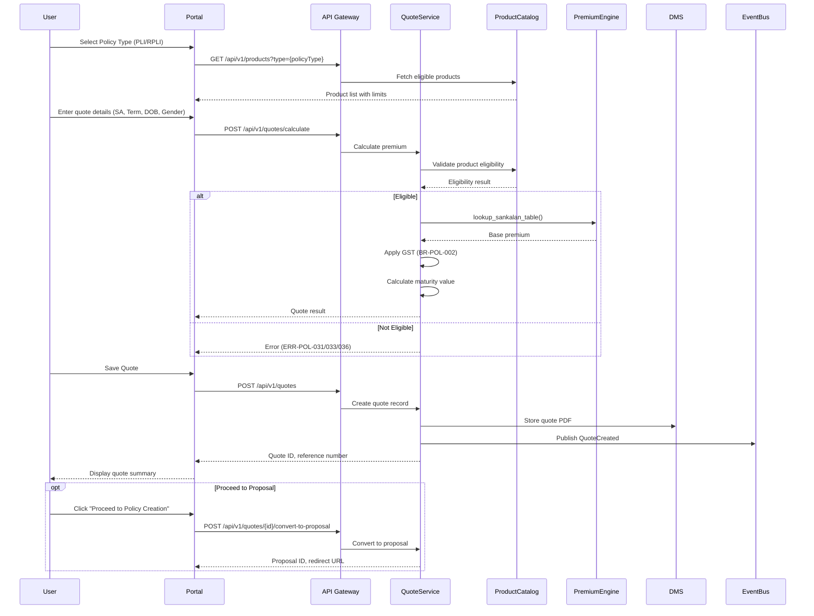
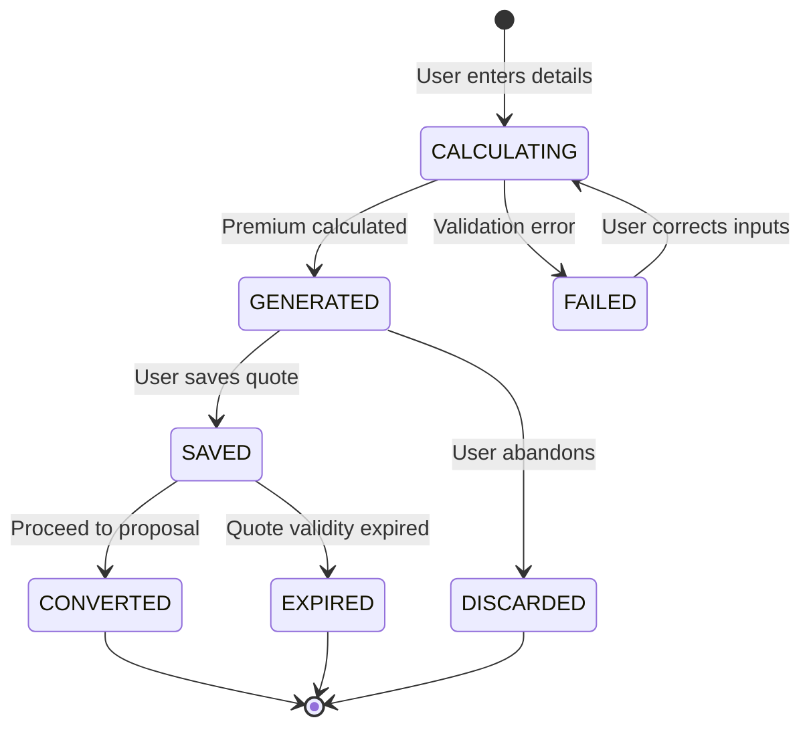
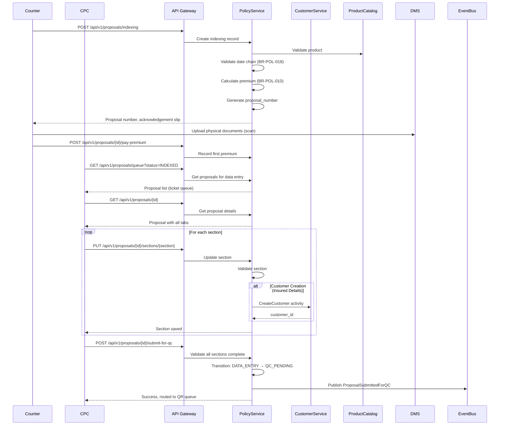
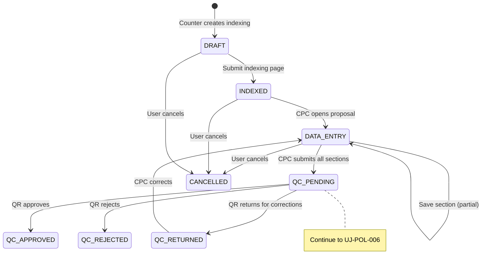
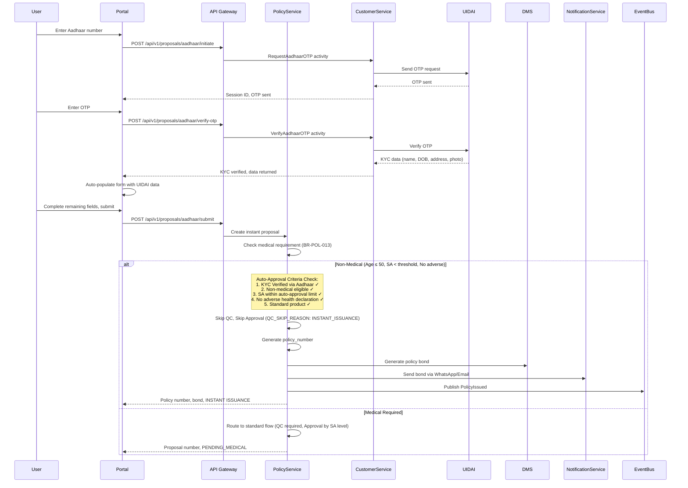
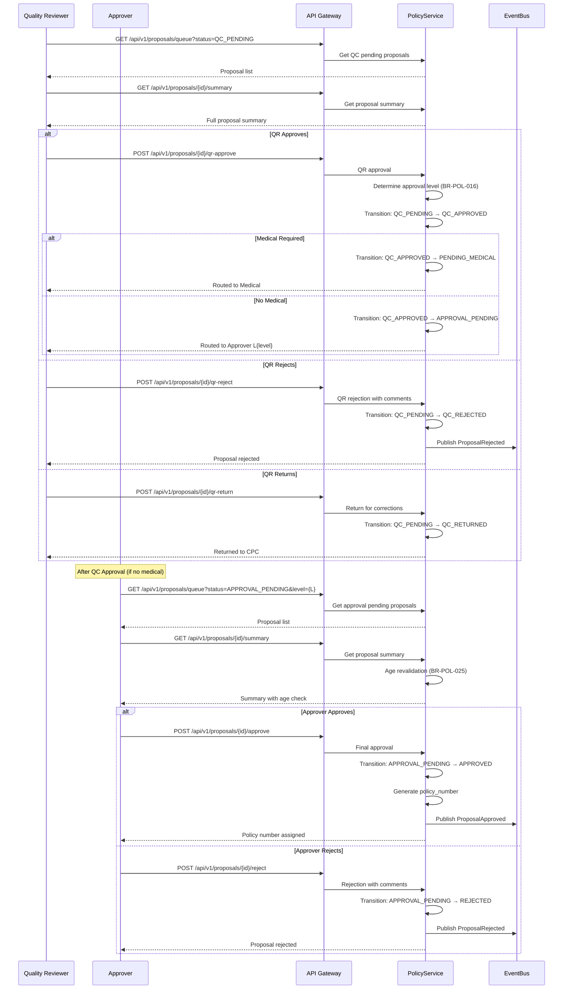
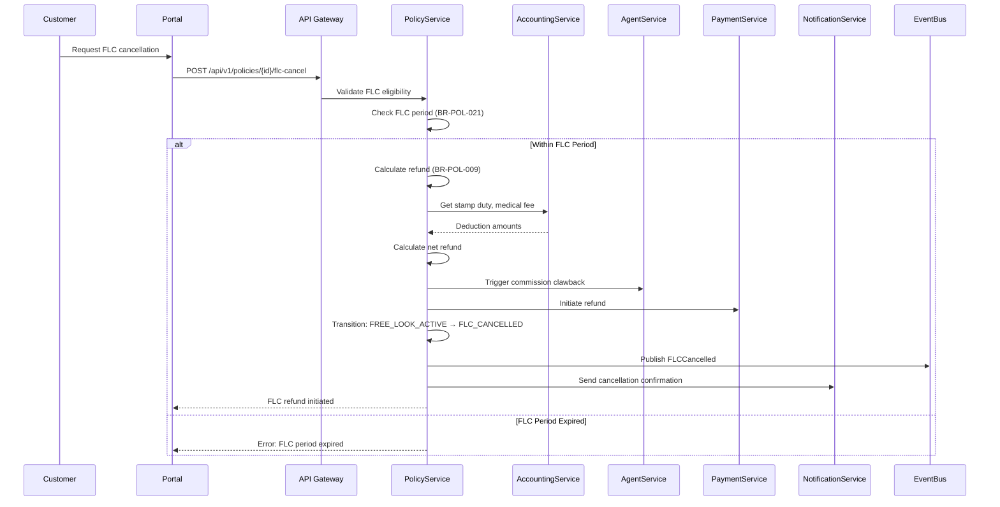

# Policy Issue Services - Comprehensive User Journeys

**Module**: Policy Issue Services
**Version**: 1.0
**Created**: 2026-02-12
**Source Analysis**: [./analysis/detailed/policy_issue_requirements.md](../analysis/detailed/policy_issue_requirements.md)

---

## Table of Contents

1. [Executive Summary](#1-executive-summary)
2. [Component Catalog](#2-component-catalog)
3. [User Journey Catalog](#3-user-journey-catalog)
4. [Detailed User Journeys](#4-detailed-user-journeys)
5. [Hidden/Supporting APIs](#5-hiddensupporting-apis)
6. [API Mapping Catalog](#6-api-mapping-catalog)
7. [Temporal Workflow Specifications](#7-temporal-workflow-specifications)
8. [Traceability Matrix](#8-traceability-matrix)

---

## 1. Executive Summary

### 1.1 Module Overview

The **Policy Issue Services** module handles the complete lifecycle of new business policy issuance for PLI (Postal Life Insurance) and RPLI (Rural Postal Life Insurance). It covers:

- **Quote Generation & Benefit Illustration**
- **Proposal Creation** (With and Without Aadhaar)
- **KYC & Compliance Verification**
- **Medical Underwriting Orchestration**
- **Multi-Level Approval Workflow**
- **Policy Number Generation & Bond Creation**
- **Free Look Period Management**
- **Bulk Upload Processing**

### 1.2 Key Actors

| Actor | Role | Description |
|-------|------|-------------|
| **Customer** | Proposer | Person applying for insurance policy |
| **Agent** | Sales Representative | Licensed agent selling PLI/RPLI products |
| **Counter Staff** | Post Office Staff | Counter personnel handling walk-in customers |
| **CPC Officer** | Data Entry Operator | Central Processing Center data entry staff |
| **Quality Reviewer (QR)** | QC Analyst | Reviews proposals for completeness and accuracy |
| **Approver L1/L2/L3** | Decision Maker | Approves/rejects proposals based on SA level |
| **System** | Automated | Temporal workflows, event handlers |

### 1.3 Complexity Assessment

| Metric | Value |
|--------|-------|
| **Total Functional Requirements** | FR-POL-001 to FR-POL-034 (34 FRs) |
| **Total Business Rules** | BR-POL-001 to BR-POL-032 (32 BRs) |
| **Total Validation Rules** | VR-PI-001 to VR-PI-044, VR-PC-016 to VR-PC-017 (46 VRs) |
| **Total Error Codes** | ERR-POL-001 to ERR-POL-099 (99 error codes) |
| **Integration Points** | INT-POL-001 to INT-POL-022 (22 integrations) |
| **Data Entities** | 18 entities |
| **Estimated User Journeys** | 10 journeys |
| **Overall Complexity** | **HIGH** |

---

## 2. Component Catalog

### 2.1 Functional Requirements Summary

| ID Range | Category | Count | Description |
|----------|----------|-------|-------------|
| FR-POL-001 to FR-POL-003 | Quote Generation | 3 | Quote generation, lead capture, quote-to-proposal conversion |
| FR-POL-004 to FR-POL-005 | Product Configuration | 2 | Product catalog management, SA rules |
| FR-POL-006 to FR-POL-009 | Proposal Creation (Non-Aadhaar) | 4 | Entry point selection, indexing, insured details, search |
| FR-POL-010 | Nomination Management | 1 | Nominee management with minor handling |
| FR-POL-011 to FR-POL-015 | Policy Types | 5 | Policy info, MWPA, HUF, Yugal Suraksha, Children's Policy |
| FR-POL-016 | Agent Association | 1 | Agent linking to proposal |
| FR-POL-017 to FR-POL-019 | Medical Information | 3 | General questionnaire, enhanced medical, underwriting orchestration |
| FR-POL-020 to FR-POL-033 | Aadhaar Flow & Processing | 14 | Aadhaar flow, bulk upload, approval, policy generation, FLC, documents |
| FR-POL-034 | KYC & Compliance | 1 | PAN verification mandatory threshold |

### 2.2 Business Rules Summary

| ID Range | Category | Count |
|----------|----------|-------|
| BR-POL-001 to BR-POL-010 | Calculation Rules | 10 |
| BR-POL-011 to BR-POL-013 | Eligibility Rules | 3 |
| BR-POL-015 to BR-POL-017 | State Transition & Approval | 3 |
| BR-POL-018 to BR-POL-021 | Time-Based Rules | 4 |
| BR-POL-024 to BR-POL-032 | Validation & Edge Cases | 9 |

### 2.3 Validation Rules Summary

| ID Range | Category | Count |
|----------|----------|-------|
| VR-PI-001 to VR-PI-003 | Uniqueness Checks | 3 |
| VR-PI-004 to VR-PI-011 | Date & Format Validations | 8 |
| VR-PI-012 to VR-PI-016 | Eligibility Validations | 5 |
| VR-PI-017 to VR-PI-028 | Nominee, Document, KYC | 12 |
| VR-PI-029 to VR-PI-044 | Bank, Policy, Rider | 16 |
| VR-PC-016 to VR-PC-017 | Children Policy | 2 |

### 2.4 Error Codes Summary

| ID Range | Category | Count | HTTP Status |
|----------|----------|-------|-------------|
| ERR-POL-001 to ERR-POL-030 | Validation Errors | 30 | 400 |
| ERR-POL-031 to ERR-POL-060 | Business Rule Errors | 30 | 400 |
| ERR-POL-061 to ERR-POL-080 | Integration Errors | 20 | 502, 503, 504 |
| ERR-POL-081 to ERR-POL-099 | System Errors | 19 | 500, 503, 504 |

### 2.5 Integration Points Summary

| ID | External System | Type | Description |
|----|-----------------|------|-------------|
| INT-POL-001 | Product Catalog Service | Internal | Product eligibility and rates |
| INT-POL-002 | Customer Service | Internal | Customer creation, aggregate SA check |
| INT-POL-003 | Customer Service (eKYC) | Internal | Aadhaar authentication |
| INT-POL-004 | NSDL PAN Service | External | PAN verification |
| INT-POL-005 | UIDAI | External | Aadhaar OTP authentication |
| INT-POL-006 | DigiLocker | External | Document retrieval |
| INT-POL-007 | HRMS | Internal | Employee validation |
| INT-POL-008 | DMS (Document Service) | Internal | Document storage and retrieval |
| INT-POL-009 | OCR Service | Internal | Document data extraction |
| INT-POL-010 | Medical Appointment Service | Internal | Medical underwriting |
| INT-POL-011 | Collections Service | Internal | Premium collection |
| INT-POL-012 | Accounting Service | Internal | GL posting, stamp duty |
| INT-POL-013 | Notification Service | Internal | SMS, Email, WhatsApp |
| INT-POL-014 | Agent Service | Internal | Commission events |
| INT-POL-015 | Payment Gateway | External | Online payments |
| INT-POL-016 | POSB | External | Postal savings bank |
| INT-POL-017 | DoP Postal Tracking | External | Dispatch tracking |
| INT-POL-018 | AML Repository | External | Anti-money laundering check |
| INT-POL-019 | c-KYC (Central KYC) | External | KYC verification |
| INT-POL-020 | eIA (NSDL) | External | eInsurance Account |
| INT-POL-021 | Accounting Service (Stamp Duty) | Internal | Stamp duty calculation |
| INT-POL-022 | Customer Service (eKYC Fallback) | Internal | Alternate KYC methods |

### 2.6 Data Entities Summary

| Entity | Description | Key Attributes |
|--------|-------------|----------------|
| `proposal` | Core proposal record | proposal_id, proposal_number, status, sum_assured, policy_term |
| `proposal_nominee` | Nominee details | nominee_id, share_percentage, is_minor, appointee |
| `proposal_medical_info` | General medical questionnaire | 15 disease flags, hospitalization history |
| `proposal_enhanced_medical` | Enhanced medical (SA ≥ 20L) | 10 additional questions, habits |
| `proposal_agent` | Agent association | agent_id, snapshot details |
| `proposal_mwpa_trustee` | MWPA trustee details | trust_type, trustee_name |
| `proposal_huf_member` | HUF co-parceners | karta_name, member_name (max 7) |
| `proposal_existing_policy` | Declared existing policies | policy_category, company_name |
| `proposal_status_history` | Audit trail | from_status, to_status, changed_by |
| `proposal_document_ref` | Document links | document_id, document_type |
| `proposal_proposer` | Proposer when ≠ insured | relationship_to_insured |
| `proposal_payment_mandate` | ECS/NACH mandate | mandate_type, umrn, bank details |
| `proposal_rider` | Rider products | rider_product_code, rider_sum_assured |
| `proposal_audit_log` | Field-level audit | field_name, old_value, new_value |
| `quote` | Premium quote record | quote_ref_number, premium, status |
| `product_catalog` | Product configuration | product_code, SA limits, age limits |
| `policy_number_sequence` | Policy number generator | series_prefix, next_value |
| `approval_routing_config` | Approval rules | sa_min, sa_max, approver_level |

### 2.7 Approval Routing & QC Skip Rules

#### Approval Levels by Sum Assured (BR-POL-016)

| SA Range | Approver Level | Role | QC Required |
|----------|----------------|------|-------------|
| ≤ ₹5,00,000 | Level 1 | Approver L1 | Yes (unless auto-approval eligible) |
| > ₹5,00,000 and ≤ ₹10,00,000 | Level 2 | Approver L2 | Yes |
| > ₹10,00,000 | Level 3 | Approver L3 (Senior/HO) | Yes |

#### Auto-Approval Eligibility Criteria

**All of the following conditions must be met for auto-approval (QC & Approval skip):**

| Criterion | Description | Validation |
|-----------|-------------|------------|
| KYC Verified via Aadhaar | Customer authenticated through UIDAI Aadhaar OTP | `kyc_method = AADHAAR_OTP` |
| Non-Medical Eligible | Age ≤ 50, SA below medical threshold, no adverse health declaration | `medical_required = false` |
| SA Within Auto-Approval Limit | Sum Assured ≤ ₹5,00,000 (configurable) | `sum_assured <= auto_approval_sa_limit` |
| Standard Product | Product designated for instant issuance | `product.allow_instant_issuance = true` |
| No Adverse History | No previous rejections, fraud flags, or adverse medical history | `has_adverse_history = false` |

#### QC Skip Reasons

| Skip Reason | Description | Workflow Impact |
|-------------|-------------|-----------------|
| `INSTANT_ISSUANCE` | Aadhaar-based instant issuance flow | Skips both QC and Approval |
| `AUTO_APPROVED_KYC` | KYC verified via Aadhaar, eligible for auto-approval | Skips QC, routes to L1 for audit |
| `LOW_SA_STANDARD` | Low SA standard product | May skip approval levels based on config |

#### Workflow State with Approval Routing

```json
{
  "workflow_state": {
    "current_step": "data_entry_complete",
    "next_step": "qc_review",
    "approval_routing": {
      "required_approval_level": 1,
      "qc_required": true,
      "qc_skip_reason": null,
      "approval_skip_eligible": false,
      "auto_approval_criteria": {
        "kyc_verified": true,
        "aadhaar_authenticated": true,
        "non_medical": true,
        "within_auto_approval_sa_limit": true,
        "all_criteria_met": true
      }
    }
  }
}
```

---

## 3. User Journey Catalog

| Journey ID | Journey Name | Primary Actor | SLA | Priority | Components |
|------------|--------------|---------------|-----|----------|------------|
| **UJ-POL-001** | Quote Generation & Illustration | Customer/Agent/Counter Staff | Real-time | HIGH | FR-POL-001 to FR-POL-003, BR-POL-001, BR-POL-002, BR-POL-010 |
| **UJ-POL-002** | Proposal Creation (Without Aadhaar) | Counter Staff/CPC | 1 day | CRITICAL | FR-POL-006 to FR-POL-009, FR-POL-034, BR-POL-015, BR-POL-018 |
| **UJ-POL-003** | Proposal Creation (With Aadhaar - Instant) | Customer/Agent | Real-time | CRITICAL | FR-POL-020, FR-POL-030, BR-POL-015 |
| **UJ-POL-004** | KYC & Document Submission | CPC Officer | 1 day | HIGH | FR-POL-029, FR-POL-034, INT-POL-003 to INT-POL-006 |
| **UJ-POL-005** | Medical Underwriting | CPC/Medical Service | 7-15 days | HIGH | FR-POL-017 to FR-POL-019, BR-POL-013, INT-POL-010 |
| **UJ-POL-006** | Quality Review & Approval | QR/Approver | 7 days | CRITICAL | FR-POL-022, FR-POL-033, BR-POL-015 to BR-POL-017 |
| **UJ-POL-007** | Policy Issuance & Bond Generation | System | 1 hour | CRITICAL | FR-POL-023, FR-POL-024, BR-POL-015 |
| **UJ-POL-008** | Policy Dispatch & Delivery | System/DoP | 3-7 days | HIGH | FR-POL-025, INT-POL-017 |
| **UJ-POL-009** | Free Look Cancellation | Customer | 15-30 days | MEDIUM | FR-POL-027, BR-POL-009, BR-POL-021 |
| **UJ-POL-010** | Bulk Proposal Upload | CPC Supervisor | 1 day | MEDIUM | FR-POL-021, BR-POL-029 |

---

## 4. Detailed User Journeys

---

### UJ-POL-001: Quote Generation & Illustration

#### Journey Overview

| Attribute | Value |
|-----------|-------|
| **Journey ID** | UJ-POL-001 |
| **Journey Name** | Quote Generation & Benefit Illustration |
| **User Goal** | Generate premium quote for new PLI/RPLI policy |
| **Entry Point** | Customer Portal / Agent Portal / Counter Interface |
| **Success Criteria** | Quote generated with premium, maturity value, unique reference |
| **Exit Points** | Quote PDF generated, Proceed to Proposal, Discard |
| **Duration** | Real-time (< 5 seconds) |
| **Primary Actors** | Customer, Agent, Counter Staff |

#### Functional Requirements Applied
- **FR-POL-001**: New Business Quote Generation
- **FR-POL-002**: Lead Capture & Illustration
- **FR-POL-003**: Quote-to-Proposal Conversion

#### Business Rules Applied
- **BR-POL-001**: Base Premium Calculation
- **BR-POL-002**: GST Calculation
- **BR-POL-003**: Rebate Calculation
- **BR-POL-010**: Total Premium Calculation

#### Validation Rules Applied
- **VR-PI-012**: Age eligibility (min/max entry age)
- **VR-PI-013**: Sum assured range (product limits)
- **VR-PI-044**: Policy term range

#### Sequence Diagram



#### State Machine



#### Step-by-Step Breakdown

##### Step 1: Product Selection

| Attribute | Value |
|-----------|-------|
| **Frontend Action** | User selects Policy Type (PLI/RPLI) |
| **User Role** | Customer / Agent / Counter Staff |
| **Screen** | Quote Generation - Product Selection |

**API Call**: `GET /api/v1/products`

**Request**:
```json
{
  "query_params": {
    "policy_type": "PLI",
    "is_active": true
  }
}
```

**Response** (200 OK):
```json
{
  "products": [
    {
      "product_code": "PLI_WLA",
      "product_name": "Suraksha (Whole Life Assurance)",
      "product_type": "PLI",
      "min_sum_assured": 20000,
      "max_sum_assured": null,
      "min_entry_age": 19,
      "max_entry_age": 55,
      "min_term": 10,
      "max_term": 50,
      "available_frequencies": ["MONTHLY", "QUARTERLY", "HALF_YEARLY", "YEARLY"],
      "description": "Whole Life Assurance with guaranteed returns"
    },
    {
      "product_code": "PLI_CWLA",
      "product_name": "Suvidha (Convertible Whole Life Assurance)",
      "product_type": "PLI",
      "min_sum_assured": 20000,
      "max_sum_assured": null,
      "min_entry_age": 19,
      "max_entry_age": 55,
      "min_term": 5,
      "max_term": 40,
      "available_frequencies": ["MONTHLY", "QUARTERLY", "HALF_YEARLY", "YEARLY"],
      "description": "Convertible whole life with endowment options"
    }
  ],
  "workflow_state": {
    "current_step": "product_selection",
    "next_step": "enter_details",
    "allowed_actions": ["select_product", "cancel"]
  }
}
```

**Error Responses**:
- **ERR-POL-044**: "Product {product_code} is not available for new business"

**Components Applied**:
- FR-POL-004: Product Catalog Management
- INT-POL-001: Product Catalog Service

##### Step 2: Premium Calculation

| Attribute | Value |
|-----------|-------|
| **Frontend Action** | User enters quote details and clicks "Calculate" |
| **User Role** | Customer / Agent / Counter Staff |
| **Screen** | Quote Generation - Premium Calculator |

**API Call**: `POST /api/v1/quotes/calculate`

**Request**:
```json
{
  "policy_type": "PLI",
  "product_code": "PLI_WLA",
  "proposer": {
    "name": "Rajesh Kumar",
    "date_of_birth": "1985-05-15",
    "gender": "MALE",
    "mobile": "9876543210",
    "email": "rajesh.kumar@example.com"
  },
  "coverage": {
    "sum_assured": 500000,
    "policy_term": 20,
    "payment_frequency": "YEARLY"
  },
  "location": {
    "state": "Maharashtra",
    "city": "Mumbai"
  }
}
```

**Response** (200 OK):
```json
{
  "calculation_id": "calc_uuid_12345",
  "eligibility": {
    "is_eligible": true,
    "age_at_entry": 40,
    "maturity_age": 60
  },
  "premium_breakdown": {
    "base_premium": 28500.00,
    "rebate": 0.00,
    "net_premium": 28500.00,
    "cgst": 2565.00,
    "sgst": 2565.00,
    "igst": 0.00,
    "total_gst": 5130.00,
    "total_payable": 33630.00
  },
  "benefit_illustration": {
    "maturity_value_guaranteed": 500000.00,
    "maturity_value_with_bonus": 750000.00,
    "indicative_bonus_rate": 50.00,
    "death_benefit": 500000.00
  },
  "calculation_basis": {
    "premium_table": "Appendix 5 PLI",
    "rate_per_thousand": 57.00,
    "gst_rate": 18.00
  },
  "workflow_state": {
    "current_step": "premium_calculated",
    "next_step": "save_quote",
    "allowed_actions": ["save_quote", "modify_inputs", "proceed_to_proposal", "cancel"]
  }
}
```

**Error Responses**:
- **ERR-POL-031**: "Entry age {age} is outside eligible range ({min}-{max}) for product {product_name}"
- **ERR-POL-033**: "Sum assured Rs. {sa} is outside valid range (Rs. {min} - Rs. {max}) for product"
- **ERR-POL-036**: "Policy term {term} years is outside valid range ({min}-{max}) for product"
- **ERR-POL-056**: "Unable to calculate premium for the selected parameters. Please contact support"

**Components Applied**:
- FR-POL-001: New Business Quote Generation
- BR-POL-001: Base Premium Calculation
- BR-POL-002: GST Calculation
- BR-POL-010: Total Premium Calculation
- VR-PI-012: Age eligibility
- VR-PI-013: Sum assured range
- VR-PI-044: Policy term range

**Business Logic**:
```
1. Calculate age_at_entry from DOB and current_date
2. Validate age within product.min_entry_age and product.max_entry_age (BR-POL-011)
3. Validate sum_assured within product limits (BR-POL-011)
4. Validate policy_term within product limits (BR-POL-011)
5. Calculate maturity_age = age_at_entry + policy_term
6. Validate maturity_age <= product.max_maturity_age
7. Lookup Sankalan premium table (BR-POL-001):
   base_premium = (sum_assured / 1000) × rate_per_thousand
8. Calculate GST based on state (BR-POL-002):
   IF insured_state == provider_state THEN CGST + SGST
   ELSE IGST
9. Calculate total_payable = net_premium + total_gst
10. Calculate indicative maturity value with bonus
```

##### Step 3: Save Quote

| Attribute | Value |
|-----------|-------|
| **Frontend Action** | User clicks "Save Quote" |
| **User Role** | Customer / Agent / Counter Staff |
| **Screen** | Quote Generation - Summary |

**API Call**: `POST /api/v1/quotes`

**Request**:
```json
{
  "calculation_id": "calc_uuid_12345",
  "policy_type": "PLI",
  "product_code": "PLI_WLA",
  "proposer": {
    "name": "Rajesh Kumar",
    "date_of_birth": "1985-05-15",
    "gender": "MALE",
    "mobile": "9876543210",
    "email": "rajesh.kumar@example.com"
  },
  "coverage": {
    "sum_assured": 500000,
    "policy_term": 20,
    "payment_frequency": "YEARLY"
  },
  "channel": "WEB",
  "generate_pdf": true,
  "send_email": true
}
```

**Response** (201 Created):
```json
{
  "quote_id": "quote_uuid_67890",
  "quote_ref_number": "QT-PLI-2026-00012345",
  "status": "GENERATED",
  "premium_breakdown": {
    "base_premium": 28500.00,
    "total_gst": 5130.00,
    "total_payable": 33630.00
  },
  "pdf_document": {
    "document_id": "doc_uuid_abcde",
    "download_url": "/api/v1/documents/doc_uuid_abcde/download"
  },
  "validity": {
    "created_at": "2026-02-12T10:30:00Z",
    "expires_at": "2026-02-19T10:30:00Z",
    "days_valid": 7
  },
  "notifications_sent": {
    "email": true,
    "sms": false
  },
  "workflow_state": {
    "current_step": "quote_saved",
    "next_step": "proceed_to_proposal",
    "allowed_actions": ["download_pdf", "email_quote", "proceed_to_proposal", "discard"]
  }
}
```

**Error Responses**:
- **ERR-POL-073**: "Failed to store document in Document Management System (DMS)"

**Components Applied**:
- FR-POL-001: New Business Quote Generation
- FR-POL-002: Lead Capture & Illustration
- INT-POL-008: DMS (Document Service)
- INT-POL-013: Notification Service

**Events Published**:
```json
{
  "event_type": "quote.created",
  "event_id": "evt_uuid_xxxxx",
  "timestamp": "2026-02-12T10:30:00Z",
  "data": {
    "quote_id": "quote_uuid_67890",
    "quote_ref_number": "QT-PLI-2026-00012345",
    "product_code": "PLI_WLA",
    "sum_assured": 500000,
    "total_premium": 33630.00,
    "customer_email": "rajesh.kumar@example.com",
    "channel": "WEB"
  }
}
```
**Consumers**: Analytics Service, Email Service (send quote email)

##### Step 4: Convert Quote to Proposal

| Attribute | Value |
|-----------|-------|
| **Frontend Action** | User clicks "Proceed to Policy Creation" |
| **User Role** | Customer / Agent / Counter Staff |
| **Screen** | Quote Summary |

**API Call**: `POST /api/v1/quotes/{quote_id}/convert-to-proposal`

**Request**:
```json
{
  "quote_id": "quote_uuid_67890",
  "entry_path": "WITH_AADHAAR",
  "channel": "WEB"
}
```

**Response** (200 OK):
```json
{
  "quote_id": "quote_uuid_67890",
  "quote_status": "CONVERTED",
  "proposal": {
    "proposal_id": "prop_uuid_11111",
    "status": "DRAFT",
    "redirect_url": "/proposal/prop_uuid_11111/aadhaar-verification"
  },
  "pre_populated_fields": {
    "product_code": "PLI_WLA",
    "policy_type": "PLI",
    "sum_assured": 500000,
    "policy_term": 20,
    "payment_frequency": "YEARLY",
    "proposer_name": "Rajesh Kumar",
    "proposer_dob": "1985-05-15",
    "proposer_gender": "MALE",
    "proposer_mobile": "9876543210",
    "proposer_email": "rajesh.kumar@example.com"
  },
  "workflow_state": {
    "current_step": "proposal_initiated",
    "next_step": "aadhaar_verification",
    "allowed_actions": ["enter_aadhaar", "cancel"]
  }
}
```

**Components Applied**:
- FR-POL-003: Quote-to-Proposal Conversion
- BR-POL-024: Proposal Deduplication (check for existing proposals)

**State Transition**: Quote: GENERATED → CONVERTED

---

### UJ-POL-002: Proposal Creation (Without Aadhaar)

#### Journey Overview

| Attribute | Value |
|-----------|-------|
| **Journey ID** | UJ-POL-002 |
| **Journey Name** | Proposal Creation (Without Aadhaar Flow) |
| **User Goal** | Create new business proposal via traditional paper-based flow |
| **Entry Point** | Counter Interface / CPC Portal → "Policy Issue - Without Aadhaar" |
| **Success Criteria** | Proposal created with proposal number, all sections complete, submitted for QC |
| **Exit Points** | Proposal submitted for QC, Saved as draft, Cancelled |
| **Duration** | 30 minutes - 2 hours (data entry) |
| **Primary Actors** | Counter Staff, CPC Officer |

#### Functional Requirements Applied
- **FR-POL-006**: Proposal Entry Point Selection
- **FR-POL-007**: New Business Indexing (Without Aadhaar)
- **FR-POL-008**: Insured Details Capture (CPC Data Entry)
- **FR-POL-009**: Proposal Search & Ticket Management
- **FR-POL-010**: Nominee Management
- **FR-POL-011**: Policy Information Capture
- **FR-POL-012**: MWPA Policy Handling
- **FR-POL-013**: HUF Policy Handling
- **FR-POL-014**: Yugal Suraksha (Joint Life)
- **FR-POL-015**: Children's Policy
- **FR-POL-016**: Agent Linking
- **FR-POL-017**: General Medical Questionnaire
- **FR-POL-031**: Customer Acknowledgement Slip Generation
- **FR-POL-034**: PAN Verification Mandatory Threshold

#### Business Rules Applied
- **BR-POL-015**: Proposal State Machine
- **BR-POL-018**: Date Validation Chain
- **BR-POL-024**: Proposal Deduplication
- **BR-POL-031**: Policy Term vs Premium Ceasing Age Validation

#### Validation Rules Applied
- **VR-PI-001**: Proposal number uniqueness
- **VR-PI-004 to VR-PI-007**: Date validations (declaration, receipt, indexing, proposal)
- **VR-PI-008**: Aadhaar number format
- **VR-PI-009**: PAN format and mandatory check
- **VR-PI-010**: Email format
- **VR-PI-011**: Mobile number format
- **VR-PI-014 to VR-PI-016**: Father/Husband name, spouse details
- **VR-PI-017 to VR-PI-019**: Nominee validations
- **VR-PI-029 to VR-PI-030**: Bank account, IFSC validations

#### Sequence Diagram



#### State Machine (Proposal Without Aadhaar)



#### Step-by-Step Breakdown

##### Step 1: New Business Indexing

| Attribute | Value |
|-----------|-------|
| **Frontend Action** | Counter Staff enters indexing details |
| **User Role** | Counter Staff |
| **Screen** | New Business Indexing Page (Wireframe 4.1.1) |

**API Call**: `POST /api/v1/proposals/indexing`

**Request**:
```json
{
  "policy_type": "PLI",
  "product_code": "PLI_WLA",
  "dates": {
    "declaration_date": "2026-02-10",
    "receipt_date": "2026-02-11",
    "indexing_date": "2026-02-12"
  },
  "po_code": "MH001",
  "proposer": {
    "name": "Rajesh Kumar",
    "date_of_birth": "1985-05-15",
    "gender": "MALE"
  },
  "coverage": {
    "sum_assured": 500000,
    "premium_ceasing_age": 60,
    "payment_frequency": "YEARLY"
  },
  "opportunity_id": "OPP-2026-001234",
  "issue_circle": "Maharashtra Circle",
  "issue_ho": "Mumbai GPO",
  "entry_path": "WITHOUT_AADHAAR"
}
```

**Response** (201 Created):
```json
{
  "proposal_id": "prop_uuid_22222",
  "proposal_number": "PLI-MH-2026-00056789",
  "status": "INDEXED",
  "premium_calculation": {
    "base_premium": 28500.00,
    "total_gst": 5130.00,
    "total_payable": 33630.00
  },
  "acknowledgement_slip": {
    "document_id": "doc_uuid_ack_001",
    "download_url": "/api/v1/documents/doc_uuid_ack_001/download",
    "print_url": "/api/v1/documents/doc_uuid_ack_001/print"
  },
  "workflow_state": {
    "current_step": "indexed",
    "next_step": "pay_premium",
    "allowed_actions": ["print_acknowledgement", "pay_premium", "new_indexing", "cancel"]
  },
  "created_at": "2026-02-12T11:00:00Z"
}
```

**Error Responses**:
- **ERR-POL-006**: "Date of declaration later than Date of Indexing"
- **ERR-POL-007**: "Application Receipt date later than Date of Indexing"
- **ERR-POL-008**: "Date of Indexing later than Date of Proposal"
- **ERR-POL-009**: "Application Receipt date later than Date of Proposal"
- **ERR-POL-031**: "Entry age {age} is outside eligible range"
- **ERR-POL-033**: "Sum assured Rs. {sa} is outside valid range"
- **ERR-POL-044**: "Product {product_code} is not available for new business"

**Components Applied**:
- FR-POL-007: New Business Indexing
- FR-POL-031: Customer Acknowledgement Slip Generation
- BR-POL-015: State transition DRAFT → INDEXED
- BR-POL-018: Date Validation Chain
- BR-POL-010: Total Premium Calculation
- VR-PI-001: Proposal number uniqueness
- VR-PI-004 to VR-PI-007: Date validations

**Business Logic**:
```
1. Validate date chain: declaration ≤ receipt ≤ indexing (BR-POL-018)
2. Validate product eligibility (BR-POL-011)
3. Calculate age_at_entry from DOB
4. Validate age within product limits
5. Validate sum_assured within product limits
6. Calculate premium (BR-POL-010)
7. Generate unique proposal_number: {policy_type}-{circle_code}-{year}-{sequence}
8. Create proposal record with status = INDEXED
9. Generate acknowledgement slip PDF
10. Log status history: DRAFT → INDEXED
```

**State Transition**: DRAFT → INDEXED

##### Step 2: First Premium Payment

| Attribute | Value |
|-----------|-------|
| **Frontend Action** | Counter Staff collects first premium |
| **User Role** | Counter Staff |
| **Screen** | Premium Collection Screen |

**API Call**: `POST /api/v1/proposals/{proposal_id}/first-premium`

**Request**:
```json
{
  "proposal_id": "prop_uuid_22222",
  "payment": {
    "amount": 33630.00,
    "method": "CASH",
    "receipt_date": "2026-02-12"
  }
}
```

**Response** (200 OK):
```json
{
  "proposal_id": "prop_uuid_22222",
  "payment": {
    "payment_id": "pay_uuid_33333",
    "amount": 33630.00,
    "method": "CASH",
    "status": "RECEIVED"
  },
  "receipt": {
    "receipt_number": "RCP-MH001-2026-00012345",
    "document_id": "doc_uuid_receipt_001",
    "download_url": "/api/v1/documents/doc_uuid_receipt_001/download"
  },
  "proposal_update": {
    "first_premium_paid": true,
    "first_premium_date": "2026-02-12",
    "first_premium_reference": "pay_uuid_33333"
  },
  "workflow_state": {
    "current_step": "premium_collected",
    "next_step": "data_entry",
    "allowed_actions": ["print_receipt", "view_proposal"]
  }
}
```

**Error Responses**:
- **ERR-POL-057**: "Premium payment transaction failed. Transaction ID: {txnId}. Reason: {failureReason}"

**Components Applied**:
- FR-POL-026: First Premium Orchestration
- INT-POL-011: Collections Service

##### Step 3: CPC Data Entry - Insured Details

| Attribute | Value |
|-----------|-------|
| **Frontend Action** | CPC Officer enters insured person details |
| **User Role** | CPC Officer |
| **Screen** | Proposal Data Entry - Insured Details Tab (Wireframe 4.1.4) |

**API Call**: `PUT /api/v1/proposals/{proposal_id}/sections/insured`

**Request**:
```json
{
  "proposal_id": "prop_uuid_22222",
  "insured": {
    "personal": {
      "salutation": "Mr",
      "first_name": "Rajesh",
      "middle_name": "",
      "last_name": "Kumar",
      "gender": "MALE",
      "marital_status": "MARRIED",
      "father_name": "Suresh Kumar",
      "date_of_birth": "1985-05-15",
      "age_proof_type": "AADHAAR",
      "aadhaar_number": "123456789012",
      "nationality": "INDIAN"
    },
    "communication_address": {
      "address_line1": "123, Green Park",
      "address_line2": "Near City Mall",
      "village": "",
      "taluka": "Andheri",
      "city": "Mumbai",
      "district": "Mumbai",
      "state": "Maharashtra",
      "country": "INDIA",
      "pin_code": "400053"
    },
    "permanent_same_as_communication": true,
    "contact": {
      "contact_type": "MOBILE",
      "mobile": "9876543210",
      "email": "rajesh.kumar@example.com"
    },
    "is_insured_same_as_proposer": true,
    "employment": {
      "is_employed": true,
      "occupation": "Central Government Employee",
      "pao_ddo": "PAO Mumbai",
      "organization": "Ministry of Finance",
      "designation": "Assistant Director",
      "entry_date": "2010-06-15",
      "pan": "ABCDE1234F",
      "annual_income": 1200000,
      "employer_address": "North Block, New Delhi",
      "qualification": "MBA"
    },
    "payment": {
      "method": "NACH",
      "bank_account_number": "1234567890123456",
      "bank_ifsc_code": "SBIN0001234"
    }
  }
}
```

**Response** (200 OK):
```json
{
  "proposal_id": "prop_uuid_22222",
  "section": "insured",
  "section_status": "COMPLETE",
  "customer": {
    "customer_id": "cust_uuid_44444",
    "created": true
  },
  "validations": {
    "passed": true,
    "warnings": [
      {
        "code": "WARN-POL-001",
        "field": "annual_income",
        "message": "High sum assured relative to income. May require additional documentation."
      }
    ]
  },
  "pan_verification": {
    "status": "VERIFIED",
    "name_on_pan": "RAJESH KUMAR",
    "name_match": true
  },
  "bank_verification": {
    "status": "VERIFIED",
    "account_holder_name": "RAJESH KUMAR",
    "bank_name": "State Bank of India"
  },
  "workflow_state": {
    "current_step": "data_entry",
    "sections_completed": ["insured"],
    "sections_pending": ["nominee", "policy_details", "agent", "medical"],
    "next_step": "complete_remaining_sections",
    "allowed_actions": ["save_draft", "next_section", "cancel"]
  }
}
```

**Error Responses**:
- **ERR-POL-010**: "Invalid Aadhaar number format. Must be 12 digits"
- **ERR-POL-011**: "Invalid PAN format. Must be 10 alphanumeric characters (XXXXX9999X)"
- **ERR-POL-012**: "PAN is mandatory for policies with annual premium ≥ ₹50,000"
- **ERR-POL-013**: "Invalid email format"
- **ERR-POL-014**: "Invalid mobile number. Must be 10 digits"
- **ERR-POL-015**: "Father's name is mandatory for male proposers"
- **ERR-POL-018**: "Invalid bank account number format"
- **ERR-POL-019**: "Invalid IFSC code format"
- **ERR-POL-020**: "Invalid PIN code. Must be 6 digits"
- **ERR-POL-021**: "PIN code {pinCode} does not match state {state}"
- **ERR-POL-064**: "PAN verification failed with NSDL. PAN may be invalid or inactive"
- **ERR-POL-065**: "Name on PAN '{panName}' does not match proposal name '{proposalName}'"

**Components Applied**:
- FR-POL-008: Insured Details Capture
- FR-POL-034: PAN Verification Mandatory Threshold
- INT-POL-002: Customer Service (CreateCustomer)
- INT-POL-004: NSDL PAN Service
- VR-PI-008 to VR-PI-011: Format validations
- VR-PI-014: Father name required
- VR-PI-029 to VR-PI-030: Bank validations

**Business Logic**:
```
1. Validate all mandatory fields
2. Validate format: Aadhaar (12 digits), PAN (10 alphanumeric), Email, Mobile, PIN
3. IF annual_premium >= 50000 THEN PAN is mandatory (FR-POL-034)
4. Verify PAN with NSDL (INT-POL-004)
5. Verify bank account (INT-POL-011)
6. Call CustomerService.CreateCustomer activity (INT-POL-002)
7. Store customer_id on proposal
8. Mark section as COMPLETE
```

##### Step 4: Nominee Details

| Attribute | Value |
|-----------|-------|
| **Frontend Action** | CPC Officer enters nominee details |
| **User Role** | CPC Officer |
| **Screen** | Proposal Data Entry - Nomination Tab (Wireframe 4.1.5) |

**API Call**: `PUT /api/v1/proposals/{proposal_id}/sections/nominees`

**Request**:
```json
{
  "proposal_id": "prop_uuid_22222",
  "nominees": [
    {
      "salutation": "Mrs",
      "first_name": "Sunita",
      "last_name": "Kumar",
      "gender": "FEMALE",
      "date_of_birth": "1988-08-20",
      "relationship": "SPOUSE",
      "share_percentage": 50.00,
      "address_line1": "123, Green Park",
      "city": "Mumbai",
      "state": "Maharashtra",
      "pin_code": "400053",
      "phone": "9876543211",
      "email": "sunita.kumar@example.com"
    },
    {
      "salutation": "Mr",
      "first_name": "Aarav",
      "last_name": "Kumar",
      "gender": "MALE",
      "date_of_birth": "2015-03-10",
      "relationship": "SON",
      "share_percentage": 50.00,
      "is_minor": true,
      "appointee": {
        "name": "Sunita Kumar",
        "relationship": "MOTHER",
        "date_of_birth": "1988-08-20",
        "address": "123, Green Park, Mumbai"
      }
    }
  ]
}
```

**Response** (200 OK):
```json
{
  "proposal_id": "prop_uuid_22222",
  "section": "nominees",
  "section_status": "COMPLETE",
  "nominees": [
    {
      "nominee_id": "nom_uuid_11111",
      "name": "Sunita Kumar",
      "is_minor": false,
      "share_percentage": 50.00
    },
    {
      "nominee_id": "nom_uuid_22222",
      "name": "Aarav Kumar",
      "is_minor": true,
      "age_at_proposal": 10,
      "share_percentage": 50.00,
      "appointee_assigned": true
    }
  ],
  "validations": {
    "total_share_percentage": 100.00,
    "nominee_count": 2,
    "all_minor_nominees_have_appointee": true
  },
  "workflow_state": {
    "current_step": "data_entry",
    "sections_completed": ["insured", "nominee"],
    "sections_pending": ["policy_details", "agent", "medical"],
    "next_step": "complete_remaining_sections",
    "allowed_actions": ["save_draft", "next_section", "cancel"]
  }
}
```

**Error Responses**:
- **ERR-POL-022**: "Maximum 3 nominees allowed per policy. Current count: {count}"
- **ERR-POL-023**: "Nominee share percentages must sum to 100%. Current sum: {sum}%"
- **ERR-POL-024**: "Appointee details are mandatory for minor nominee {name} (age: {age})"

**Components Applied**:
- FR-POL-010: Nominee Management
- VR-PI-017: Nominee count limit (max 3)
- VR-PI-018: Nominee share percentage (sum = 100%)
- VR-PI-019: Appointee for minor nominee

##### Step 5: Policy Details

| Attribute | Value |
|-----------|-------|
| **Frontend Action** | CPC Officer enters policy details |
| **User Role** | CPC Officer |
| **Screen** | Proposal Data Entry - Policy Details Tab (Wireframe 4.1.6) |

**API Call**: `PUT /api/v1/proposals/{proposal_id}/sections/policy-details`

**Request**:
```json
{
  "proposal_id": "prop_uuid_22222",
  "policy_details": {
    "dates": {
      "acceptance_date": "2026-02-12",
      "commencement_of_risk": "2026-02-12"
    },
    "policy_taken_under": "OTHER",
    "existing_policies": {
      "has_pli_rpli": false,
      "has_non_pli_rpli": false,
      "has_other_company": true,
      "other_company_details": [
        {
          "company_name": "LIC",
          "policy_number": "LIC123456789",
          "sum_assured": 1000000
        }
      ]
    },
    "base_coverage": {
      "coverage_type": "WLA",
      "ceasing_age": 60,
      "sum_assured": 500000,
      "medical_required": false,
      "coverage_age": 40
    }
  }
}
```

**Response** (200 OK):
```json
{
  "proposal_id": "prop_uuid_22222",
  "section": "policy_details",
  "section_status": "COMPLETE",
  "premium_summary": {
    "annual_equivalent": 28500.00,
    "initial_premium": 28500.00,
    "additional_premium": 0.00,
    "modal_premium": 28500.00,
    "total_payable": 33630.00,
    "short_excess": 0.00
  },
  "existing_policies_validated": true,
  "workflow_state": {
    "current_step": "data_entry",
    "sections_completed": ["insured", "nominee", "policy_details"],
    "sections_pending": ["agent", "medical"],
    "next_step": "complete_remaining_sections",
    "allowed_actions": ["save_draft", "next_section", "cancel"]
  }
}
```

**Components Applied**:
- FR-POL-011: Policy Information Capture
- BR-POL-018: Date Validation Chain (acceptance_date >= proposal_date)

##### Step 6: Agent Linking (Optional)

| Attribute | Value |
|-----------|-------|
| **Frontend Action** | CPC Officer links agent (if applicable) |
| **User Role** | CPC Officer |
| **Screen** | Proposal Data Entry - Agent Tab (Wireframe 4.1.7) |

**API Call**: `PUT /api/v1/proposals/{proposal_id}/sections/agent`

**Request**:
```json
{
  "proposal_id": "prop_uuid_22222",
  "has_agent": true,
  "agent": {
    "agent_id": "AGT-MH-001234",
    "receives_correspondence": true
  }
}
```

**Response** (200 OK):
```json
{
  "proposal_id": "prop_uuid_22222",
  "section": "agent",
  "section_status": "COMPLETE",
  "agent_details": {
    "agent_id": "AGT-MH-001234",
    "agent_name": "Amit Sharma",
    "agent_mobile": "9876543299",
    "agent_email": "amit.sharma@agent.com",
    "status": "ACTIVE",
    "license_valid_until": "2027-12-31"
  },
  "workflow_state": {
    "current_step": "data_entry",
    "sections_completed": ["insured", "nominee", "policy_details", "agent"],
    "sections_pending": ["medical"],
    "next_step": "complete_medical",
    "allowed_actions": ["save_draft", "next_section", "cancel"]
  }
}
```

**Components Applied**:
- FR-POL-016: Agent Linking
- INT-POL-014: Agent Service (validate agent)

##### Step 7: Medical Questionnaire

| Attribute | Value |
|-----------|-------|
| **Frontend Action** | CPC Officer enters medical questionnaire responses |
| **User Role** | CPC Officer |
| **Screen** | Proposal Data Entry - Medical Tab (Wireframe 4.1.9) |

**API Call**: `PUT /api/v1/proposals/{proposal_id}/sections/medical`

**Request**:
```json
{
  "proposal_id": "prop_uuid_22222",
  "medical_info": {
    "is_sound_health": true,
    "diseases": {
      "tb": false,
      "cancer": false,
      "paralysis": false,
      "insanity": false,
      "heart_lungs": false,
      "kidney": false,
      "brain": false,
      "hiv": false,
      "hepatitis_b": false,
      "epilepsy": false,
      "nervous": false,
      "liver": false,
      "leprosy": false,
      "physical_deformity": false,
      "other": false
    },
    "disease_details": null,
    "family_hereditary": false,
    "medical_leave_3yr": false,
    "physical_deformity": false,
    "family_doctor_name": "Dr. Sharma"
  }
}
```

**Response** (200 OK):
```json
{
  "proposal_id": "prop_uuid_22222",
  "section": "medical",
  "section_status": "COMPLETE",
  "medical_determination": {
    "is_medical_required": false,
    "reason": "Age < 50, SA < medical_threshold, No adverse questionnaire responses",
    "rules_applied": ["BR-POL-013"]
  },
  "workflow_state": {
    "current_step": "data_entry",
    "sections_completed": ["insured", "nominee", "policy_details", "agent", "medical"],
    "sections_pending": [],
    "all_sections_complete": true,
    "next_step": "submit_for_qc",
    "allowed_actions": ["save_draft", "submit_for_qc", "cancel"]
  }
}
```

**Components Applied**:
- FR-POL-017: General Medical Questionnaire
- BR-POL-013: Medical Requirement Determination

##### Step 8: Submit for Quality Review

| Attribute | Value |
|-----------|-------|
| **Frontend Action** | CPC Officer clicks "Submit for QC" |
| **User Role** | CPC Officer |
| **Screen** | Proposal Summary Page |

**API Call**: `POST /api/v1/proposals/{proposal_id}/submit-for-qc`

**Request**:
```json
{
  "proposal_id": "prop_uuid_22222",
  "cpc_comments": "All documents verified. Ready for QC review."
}
```

**Response** (200 OK):
```json
{
  "proposal_id": "prop_uuid_22222",
  "proposal_number": "PLI-MH-2026-00056789",
  "status": "QC_PENDING",
  "submitted_at": "2026-02-12T14:30:00Z",
  "submitted_by": "cpc_user_uuid_001",
  "routing": {
    "queue": "QC_REVIEW",
    "assigned_to_pool": "QR_POOL_MH",
    "expected_completion": "2026-02-13T14:30:00Z"
  },
  "workflow_state": {
    "current_step": "qc_pending",
    "next_step": "qr_review",
    "allowed_actions": ["view_status"]
  },
  "notifications_sent": {
    "qr_pool_notified": true,
    "cpc_supervisor_notified": true
  }
}
```

**Components Applied**:
- FR-POL-022: Multi-Level Approval Workflow (routing)
- BR-POL-015: State transition DATA_ENTRY → QC_PENDING

**Events Published**:
```json
{
  "event_type": "proposal.submitted_for_qc",
  "event_id": "evt_uuid_yyyyy",
  "timestamp": "2026-02-12T14:30:00Z",
  "data": {
    "proposal_id": "prop_uuid_22222",
    "proposal_number": "PLI-MH-2026-00056789",
    "product_code": "PLI_WLA",
    "sum_assured": 500000,
    "submitted_by": "cpc_user_uuid_001",
    "queue": "QC_REVIEW"
  }
}
```
**Consumers**: Workflow Engine, Notification Service, Dashboard Service

**State Transition**: DATA_ENTRY → QC_PENDING

---

### UJ-POL-003: Proposal Creation (With Aadhaar - Instant Issuance)

#### Journey Overview

| Attribute | Value |
|-----------|-------|
| **Journey ID** | UJ-POL-003 |
| **Journey Name** | Proposal Creation with Aadhaar (Instant Issuance) |
| **User Goal** | Create and issue policy instantly using Aadhaar authentication |
| **Entry Point** | Customer Portal / Agent Portal → "Policy Issue - With Aadhaar" |
| **Success Criteria** | Policy issued instantly with policy number and bond |
| **Exit Points** | Policy issued, Aadhaar auth failed (fallback to UJ-POL-002), Cancelled |
| **Duration** | 10-15 minutes (if non-medical) |
| **Primary Actors** | Customer, Agent |

#### Functional Requirements Applied
- **FR-POL-006**: Proposal Entry Point Selection
- **FR-POL-020**: Aadhaar-Based Proposal
- **FR-POL-030**: Non-Medical Aadhaar Instant Issuance
- **FR-POL-023**: Policy Number Generation
- **FR-POL-024**: Policy Bond Generation & Signing

#### Business Rules Applied
- **BR-POL-015**: Proposal State Machine (accelerated path)
- **BR-POL-013**: Medical Requirement Determination

#### Validation Rules Applied
- **VR-PI-008**: Aadhaar number format

#### Sequence Diagram



#### State Machine (Aadhaar Instant Flow)

```mermaid
stateDiagram-v2
    [*] --> AADHAAR_INITIATED: Enter Aadhaar
    AADHAAR_INITIATED --> AADHAAR_OTP_SENT: OTP requested
    AADHAAR_OTP_SENT --> AADHAAR_VERIFIED: OTP verified
    AADHAAR_OTP_SENT --> AADHAAR_FAILED: OTP failed (3 attempts)
    AADHAAR_FAILED --> FALLBACK_TO_MANUAL: Offer manual flow
    AADHAAR_VERIFIED --> FORM_COMPLETION: Auto-populate data
    FORM_COMPLETION --> INSTANT_CHECK: Submit proposal

    INSTANT_CHECK --> ISSUED: Non-medical (instant issuance)
    INSTANT_CHECK --> PENDING_MEDICAL: Medical required

    ISSUED --> DISPATCHED: Bond generated
    DISPATCHED --> FREE_LOOK_ACTIVE: Bond delivered

    PENDING_MEDICAL --> [Continue UJ-POL-005]

    FALLBACK_TO_MANUAL --> [Continue UJ-POL-002]
```

#### Step-by-Step Breakdown

##### Step 1: Initiate Aadhaar Authentication

| Attribute | Value |
|-----------|-------|
| **Frontend Action** | User enters Aadhaar number |
| **User Role** | Customer / Agent |
| **Screen** | Aadhaar Verification Page (Wireframe 4.2) |

**API Call**: `POST /api/v1/proposals/aadhaar/initiate`

**Request**:
```json
{
  "aadhaar_number": "123456789012",
  "consent": {
    "data_sharing": true,
    "ekyc": true,
    "terms_accepted": true
  },
  "channel": "WEB"
}
```

**Response** (200 OK):
```json
{
  "session_id": "aadhaar_session_uuid_001",
  "status": "OTP_SENT",
  "masked_mobile": "XXXXXX3210",
  "otp_validity_seconds": 600,
  "retry_allowed": true,
  "max_retries": 3,
  "workflow_state": {
    "current_step": "aadhaar_otp_sent",
    "next_step": "verify_otp",
    "allowed_actions": ["verify_otp", "resend_otp", "cancel", "use_alternate_kyc"]
  }
}
```

**Error Responses**:
- **ERR-POL-010**: "Invalid Aadhaar number format. Must be 12 digits"
- **ERR-POL-061**: "Aadhaar authentication failed via UIDAI. Please retry or use alternate KYC method"
- **ERR-POL-063**: "UIDAI Aadhaar authentication service is temporarily unavailable"

**Components Applied**:
- FR-POL-020: Aadhaar-Based Proposal
- INT-POL-003: Customer Service (eKYC)
- INT-POL-005: UIDAI
- VR-PI-008: Aadhaar number format

##### Step 2: Verify Aadhaar OTP

| Attribute | Value |
|-----------|-------|
| **Frontend Action** | User enters OTP received on mobile |
| **User Role** | Customer / Agent |
| **Screen** | Aadhaar OTP Verification |

**API Call**: `POST /api/v1/proposals/aadhaar/verify-otp`

**Request**:
```json
{
  "session_id": "aadhaar_session_uuid_001",
  "otp": "123456"
}
```

**Response** (200 OK):
```json
{
  "session_id": "aadhaar_session_uuid_001",
  "status": "VERIFIED",
  "kyc_data": {
    "name": "RAJESH KUMAR",
    "date_of_birth": "1985-05-15",
    "gender": "M",
    "address": {
      "house": "123",
      "street": "Green Park",
      "locality": "Andheri West",
      "district": "Mumbai",
      "state": "Maharashtra",
      "pincode": "400053"
    },
    "photo": {
      "document_id": "doc_uuid_aadhaar_photo",
      "format": "JPEG",
      "stored_in_dms": true
    }
  },
  "auto_populated_fields": {
    "proposer_name": "Rajesh Kumar",
    "date_of_birth": "1985-05-15",
    "gender": "MALE",
    "address_line1": "123, Green Park",
    "address_line2": "Andheri West",
    "city": "Mumbai",
    "district": "Mumbai",
    "state": "Maharashtra",
    "pin_code": "400053"
  },
  "workflow_state": {
    "current_step": "aadhaar_verified",
    "next_step": "complete_form",
    "allowed_actions": ["proceed_to_form", "cancel"]
  }
}
```

**Error Responses**:
- **ERR-POL-062**: "Invalid or expired Aadhaar OTP. Please request new OTP"

**Components Applied**:
- FR-POL-020: Aadhaar-Based Proposal
- INT-POL-005: UIDAI (OTP verification)
- INT-POL-008: DMS (store Aadhaar photo)

##### Step 3: Submit Aadhaar Proposal (Instant Issuance Check)

| Attribute | Value |
|-----------|-------|
| **Frontend Action** | User completes form and submits |
| **User Role** | Customer / Agent |
| **Screen** | Aadhaar Proposal Form (auto-populated) |

**API Call**: `POST /api/v1/proposals/aadhaar/submit`

**Request**:
```json
{
  "session_id": "aadhaar_session_uuid_001",
  "proposal": {
    "policy_type": "PLI",
    "product_code": "PLI_WLA",
    "coverage": {
      "sum_assured": 500000,
      "policy_term": 20,
      "payment_frequency": "YEARLY"
    },
    "insured": {
      "mobile": "9876543210",
      "email": "rajesh.kumar@example.com",
      "pan": "ABCDE1234F",
      "occupation": "Central Government Employee"
    },
    "nominees": [
      {
        "name": "Sunita Kumar",
        "relationship": "SPOUSE",
        "share_percentage": 100.00,
        "date_of_birth": "1988-08-20"
      }
    ],
    "medical": {
      "is_sound_health": true,
      "all_diseases_no": true
    },
    "payment": {
      "method": "UPI",
      "amount": 33630.00
    }
  }
}
```

**Response** (200 OK - Instant Issuance):
```json
{
  "proposal_id": "prop_uuid_instant_001",
  "proposal_number": "PLI-MH-2026-00056790",
  "issuance_type": "INSTANT",
  "policy": {
    "policy_id": "pol_uuid_001",
    "policy_number": "PLI-MH-2026-P-00012345",
    "status": "ISSUED",
    "issue_date": "2026-02-12",
    "commencement_date": "2026-02-12"
  },
  "bond": {
    "document_id": "doc_uuid_bond_001",
    "download_url": "/api/v1/documents/doc_uuid_bond_001/download",
    "sent_via": ["EMAIL", "WHATSAPP"],
    "qr_code": "data:image/png;base64,..."
  },
  "payment": {
    "payment_id": "pay_uuid_instant_001",
    "status": "SUCCESS",
    "receipt_number": "RCP-MH001-2026-00012346"
  },
  "free_look_period": {
    "start_date": "2026-02-12",
    "end_date": "2026-03-14",
    "days": 30
  },
  "workflow_state": {
    "current_step": "issued",
    "next_step": "free_look_active",
    "allowed_actions": ["download_bond", "view_policy", "flc_cancel"]
  },
  "notifications_sent": {
    "email": true,
    "whatsapp": true,
    "sms": true
  }
}
```

**Response** (200 OK - Medical Required):
```json
{
  "proposal_id": "prop_uuid_medical_001",
  "proposal_number": "PLI-MH-2026-00056791",
  "issuance_type": "STANDARD",
  "status": "PENDING_MEDICAL",
  "reason": "Sum assured exceeds non-medical threshold",
  "medical_requirement": {
    "is_required": true,
    "reason": "SA ≥ 20 Lakh",
    "next_steps": "Medical examination will be scheduled"
  },
  "workflow_state": {
    "current_step": "pending_medical",
    "next_step": "medical_examination",
    "allowed_actions": ["view_status", "cancel"]
  }
}
```

**Components Applied**:
- FR-POL-020: Aadhaar-Based Proposal
- FR-POL-030: Non-Medical Aadhaar Instant Issuance
- FR-POL-023: Policy Number Generation
- FR-POL-024: Policy Bond Generation
- BR-POL-013: Medical Requirement Determination
- BR-POL-015: State Machine (accelerated path)
- INT-POL-013: Notification Service
- INT-POL-015: Payment Gateway

**Events Published** (Instant Issuance):
```json
{
  "event_type": "policy.issued",
  "event_id": "evt_uuid_zzzzz",
  "timestamp": "2026-02-12T15:00:00Z",
  "data": {
    "policy_id": "pol_uuid_001",
    "policy_number": "PLI-MH-2026-P-00012345",
    "proposal_id": "prop_uuid_instant_001",
    "customer_id": "cust_uuid_44444",
    "product_code": "PLI_WLA",
    "sum_assured": 500000,
    "issuance_type": "INSTANT",
    "channel": "WEB"
  }
}
```
**Consumers**: Agent Service (commission), Accounting Service (GL posting), Email Service (welcome kit)

---

### UJ-POL-006: Quality Review & Approval

#### Journey Overview

| Attribute | Value |
|-----------|-------|
| **Journey ID** | UJ-POL-006 |
| **Journey Name** | Quality Review & Multi-Level Approval |
| **User Goal** | Review and approve/reject proposals |
| **Entry Point** | QR/Approver Dashboard → Pending Queue |
| **Success Criteria** | Proposal approved and routed to policy issuance |
| **Exit Points** | Approved (→ UJ-POL-007), Rejected, Returned for corrections |
| **Duration** | 1-7 days (SLA) |
| **Primary Actors** | Quality Reviewer, Approver L1/L2/L3 |

#### Functional Requirements Applied
- **FR-POL-022**: Multi-Level Approval Workflow
- **FR-POL-033**: Proposal Summary View

#### Business Rules Applied
- **BR-POL-015**: Proposal State Machine
- **BR-POL-016**: Approval Routing by SA
- **BR-POL-017**: Rejection Requires Comments
- **BR-POL-025**: Age Revalidation at Approval

#### Sequence Diagram



#### Step-by-Step Breakdown

##### Step 1: QR Reviews Proposal

| Attribute | Value |
|-----------|-------|
| **Frontend Action** | QR opens proposal from queue |
| **User Role** | Quality Reviewer |
| **Screen** | Proposal Summary View (FR-POL-033) |

**API Call**: `GET /api/v1/proposals/{proposal_id}/summary`

**Response** (200 OK):
```json
{
  "proposal_id": "prop_uuid_22222",
  "proposal_number": "PLI-MH-2026-00056789",
  "status": "QC_PENDING",
  "summary": {
    "insured": {
      "name": "Rajesh Kumar",
      "date_of_birth": "1985-05-15",
      "age_at_proposal": 40,
      "age_at_current": 40,
      "age_changed": false
    },
    "product": {
      "code": "PLI_WLA",
      "name": "Suraksha (Whole Life Assurance)",
      "type": "PLI"
    },
    "coverage": {
      "sum_assured": 500000,
      "policy_term": 20,
      "payment_frequency": "YEARLY"
    },
    "premium": {
      "base_premium": 28500.00,
      "total_gst": 5130.00,
      "total_payable": 33630.00
    },
    "nominees": [
      {
        "name": "Sunita Kumar",
        "relationship": "SPOUSE",
        "share": 50.00,
        "is_minor": false
      },
      {
        "name": "Aarav Kumar",
        "relationship": "SON",
        "share": 50.00,
        "is_minor": true,
        "appointee": "Sunita Kumar"
      }
    ],
    "medical": {
      "status": "NOT_REQUIRED",
      "questionnaire_adverse": false
    },
    "agent": {
      "agent_id": "AGT-MH-001234",
      "agent_name": "Amit Sharma"
    },
    "dates": {
      "declaration_date": "2026-02-10",
      "receipt_date": "2026-02-11",
      "indexing_date": "2026-02-12",
      "proposal_date": "2026-02-12"
    },
    "channel": "WEB",
    "existing_policies": {
      "pli_rpli": false,
      "other_company": true
    },
    "flags": {
      "non_standard_age_proof": false,
      "adverse_health": false,
      "aggregate_sa_warning": false
    },
    "documents": [
      {
        "type": "PROPOSAL_FORM",
        "status": "UPLOADED",
        "document_id": "doc_uuid_prop_form"
      },
      {
        "type": "DOB_PROOF",
        "status": "UPLOADED",
        "document_id": "doc_uuid_dob"
      }
    ]
  },
  "approval_routing": {
    "required_level": 1,
    "reason": "SA ≤ 5,00,000"
  },
  "workflow_state": {
    "current_step": "qc_pending",
    "time_in_queue": "2 hours",
    "sla_remaining": "22 hours",
    "allowed_actions": ["qr_approve", "qr_reject", "qr_return"]
  }
}
```

**Components Applied**:
- FR-POL-033: Proposal Summary View
- BR-POL-016: Approval Routing by SA

##### Step 2: QR Approves Proposal

| Attribute | Value |
|-----------|-------|
| **Frontend Action** | QR clicks "Approve" |
| **User Role** | Quality Reviewer |
| **Screen** | Proposal Summary View |

**API Call**: `POST /api/v1/proposals/{proposal_id}/qr-approve`

**Request**:
```json
{
  "proposal_id": "prop_uuid_22222",
  "comments": "All documents verified. Data entry correct. Approved for underwriting."
}
```

**Response** (200 OK):
```json
{
  "proposal_id": "prop_uuid_22222",
  "proposal_number": "PLI-MH-2026-00056789",
  "previous_status": "QC_PENDING",
  "new_status": "APPROVAL_PENDING",
  "qr_decision": {
    "decision": "APPROVED",
    "decision_by": "qr_user_uuid_001",
    "decision_at": "2026-02-12T16:00:00Z",
    "comments": "All documents verified. Data entry correct. Approved for underwriting."
  },
  "routing": {
    "routed_to": "APPROVER_L1",
    "reason": "SA ≤ 5,00,000",
    "queue": "APPROVAL_QUEUE_L1_MH"
  },
  "workflow_state": {
    "current_step": "approval_pending",
    "next_step": "approver_review",
    "allowed_actions": ["view_status"]
  }
}
```

**Components Applied**:
- FR-POL-022: Multi-Level Approval Workflow
- BR-POL-015: State transition QC_PENDING → APPROVAL_PENDING
- BR-POL-016: Approval Routing by SA

**State Transition**: QC_PENDING → QC_APPROVED → APPROVAL_PENDING

##### Step 3: QR Rejects Proposal

| Attribute | Value |
|-----------|-------|
| **Frontend Action** | QR clicks "Reject" (with mandatory comments) |
| **User Role** | Quality Reviewer |
| **Screen** | Proposal Summary View |

**API Call**: `POST /api/v1/proposals/{proposal_id}/qr-reject`

**Request**:
```json
{
  "proposal_id": "prop_uuid_22222",
  "rejection_reason": "DOCUMENT_INSUFFICIENT",
  "comments": "Age proof document is unclear. Unable to verify date of birth. Proposal rejected."
}
```

**Response** (200 OK):
```json
{
  "proposal_id": "prop_uuid_22222",
  "proposal_number": "PLI-MH-2026-00056789",
  "previous_status": "QC_PENDING",
  "new_status": "QC_REJECTED",
  "qr_decision": {
    "decision": "REJECTED",
    "rejection_reason": "DOCUMENT_INSUFFICIENT",
    "decision_by": "qr_user_uuid_001",
    "decision_at": "2026-02-12T16:00:00Z",
    "comments": "Age proof document is unclear. Unable to verify date of birth. Proposal rejected."
  },
  "refund": {
    "initiated": true,
    "refund_amount": 33630.00,
    "refund_reference": "ref_uuid_001"
  },
  "notifications_sent": {
    "customer_notified": true,
    "cpc_notified": true
  },
  "workflow_state": {
    "current_step": "rejected",
    "next_step": null,
    "is_terminal": true,
    "allowed_actions": ["view_details"]
  }
}
```

**Error Responses**:
- **ERR-POL-054**: "Proposal has been rejected by {approverRole}. Reason: {rejectionReason}"

**Components Applied**:
- FR-POL-022: Multi-Level Approval Workflow
- BR-POL-015: State transition QC_PENDING → QC_REJECTED
- BR-POL-017: Rejection Requires Comments

**State Transition**: QC_PENDING → QC_REJECTED (terminal)

##### Step 4: Approver Approves Proposal

| Attribute | Value |
|-----------|-------|
| **Frontend Action** | Approver clicks "Approve" |
| **User Role** | Approver L1/L2/L3 |
| **Screen** | Approval Queue / Proposal Summary |

**API Call**: `POST /api/v1/proposals/{proposal_id}/approve`

**Request**:
```json
{
  "proposal_id": "prop_uuid_22222",
  "comments": "Proposal meets all underwriting criteria. Approved for policy issuance."
}
```

**Response** (200 OK):
```json
{
  "proposal_id": "prop_uuid_22222",
  "proposal_number": "PLI-MH-2026-00056789",
  "previous_status": "APPROVAL_PENDING",
  "new_status": "APPROVED",
  "policy_number": "PLI-MH-2026-P-00012346",
  "approver_decision": {
    "decision": "APPROVED",
    "decision_by": "approver_l1_user_uuid_001",
    "decision_at": "2026-02-12T17:00:00Z",
    "comments": "Proposal meets all underwriting criteria. Approved for policy issuance."
  },
  "age_revalidation": {
    "age_at_indexing": 40,
    "age_at_approval": 40,
    "age_changed": false,
    "premium_shortfall": 0.00
  },
  "workflow_state": {
    "current_step": "approved",
    "next_step": "policy_issuance",
    "allowed_actions": ["view_status"]
  },
  "next_steps": {
    "bond_generation": "IN_PROGRESS",
    "estimated_completion": "2026-02-12T18:00:00Z"
  }
}
```

**Components Applied**:
- FR-POL-022: Multi-Level Approval Workflow
- FR-POL-023: Policy Number Generation
- BR-POL-015: State transition APPROVAL_PENDING → APPROVED
- BR-POL-025: Age Revalidation at Approval

**Events Published**:
```json
{
  "event_type": "proposal.approved",
  "event_id": "evt_uuid_approved",
  "timestamp": "2026-02-12T17:00:00Z",
  "data": {
    "proposal_id": "prop_uuid_22222",
    "proposal_number": "PLI-MH-2026-00056789",
    "policy_number": "PLI-MH-2026-P-00012346",
    "approved_by": "approver_l1_user_uuid_001",
    "sum_assured": 500000,
    "premium": 33630.00
  }
}
```
**Consumers**: Bond Generation Service, Accounting Service, Agent Service

**State Transition**: APPROVAL_PENDING → APPROVED

---

### UJ-POL-009: Free Look Cancellation

#### Journey Overview

| Attribute | Value |
|-----------|-------|
| **Journey ID** | UJ-POL-009 |
| **Journey Name** | Free Look Period Cancellation |
| **User Goal** | Cancel policy within free look period and receive refund |
| **Entry Point** | Customer Portal / Branch → "Cancel Policy" |
| **Success Criteria** | Policy cancelled, FLC refund processed |
| **Exit Points** | Policy cancelled with refund, Cancellation rejected (FLC expired) |
| **Duration** | 7 working days processing |
| **Primary Actors** | Customer, CPC Officer |

#### Functional Requirements Applied
- **FR-POL-027**: Free Look Period & Cancellation

#### Business Rules Applied
- **BR-POL-009**: FLC Refund Calculation
- **BR-POL-021**: Free Look Period Duration
- **BR-POL-028**: FLC Period Start Date Determination

#### Validation Rules Applied
- **VR-PI-024**: Free look period validation

#### Sequence Diagram



#### Step-by-Step Breakdown

##### Step 1: Request FLC Cancellation

| Attribute | Value |
|-----------|-------|
| **Frontend Action** | Customer requests policy cancellation |
| **User Role** | Customer |
| **Screen** | Policy Details / FLC Cancellation Request |

**API Call**: `POST /api/v1/policies/{policy_id}/flc-cancel`

**Request**:
```json
{
  "policy_id": "pol_uuid_001",
  "cancellation_reason": "PRODUCT_NOT_SUITABLE",
  "reason_details": "Premium is higher than expected. Looking for term insurance instead.",
  "refund_bank_account": {
    "account_number": "1234567890123456",
    "ifsc_code": "SBIN0001234",
    "account_holder_name": "Rajesh Kumar"
  }
}
```

**Response** (200 OK - Within FLC):
```json
{
  "policy_id": "pol_uuid_001",
  "policy_number": "PLI-MH-2026-P-00012345",
  "previous_status": "FREE_LOOK_ACTIVE",
  "new_status": "FLC_CANCELLED",
  "cancellation": {
    "cancellation_date": "2026-02-25",
    "reason": "PRODUCT_NOT_SUITABLE",
    "processed_by": "system"
  },
  "flc_period": {
    "start_date": "2026-02-12",
    "end_date": "2026-03-14",
    "days_remaining": 17,
    "within_period": true
  },
  "refund_calculation": {
    "premium_paid": 33630.00,
    "deductions": {
      "proportionate_risk_premium": {
        "days_of_coverage": 13,
        "daily_rate": 78.08,
        "amount": 1015.00
      },
      "stamp_duty": 100.00,
      "medical_fee": 0.00,
      "gst_not_refundable": 5130.00
    },
    "total_deductions": 6245.00,
    "net_refund_amount": 27385.00
  },
  "refund": {
    "refund_id": "ref_uuid_flc_001",
    "amount": 27385.00,
    "status": "INITIATED",
    "estimated_processing_days": 7,
    "bank_account": {
      "masked_account": "XXXXXXXXXXXX3456",
      "bank_name": "State Bank of India"
    }
  },
  "commission_clawback": {
    "initiated": true,
    "agent_id": "AGT-MH-001234",
    "clawback_amount": 1425.00
  },
  "receipt": {
    "document_id": "doc_uuid_flc_receipt",
    "download_url": "/api/v1/documents/doc_uuid_flc_receipt/download"
  },
  "workflow_state": {
    "current_step": "flc_cancelled",
    "is_terminal": true,
    "allowed_actions": ["download_receipt", "view_refund_status"]
  },
  "notifications_sent": {
    "email": true,
    "sms": true
  }
}
```

**Response** (400 Bad Request - FLC Expired):
```json
{
  "error": {
    "code": "ERR-POL-053",
    "category": "BUSINESS_RULE_ERROR",
    "message": "Free look period has expired. Cancellation not allowed",
    "http_status": 400,
    "details": {
      "flc_start_date": "2026-02-12",
      "flc_end_date": "2026-03-14",
      "current_date": "2026-03-20",
      "days_expired": 6
    },
    "resolution_steps": [
      "Free look cancellation only allowed within free look period",
      "After free look period, surrender process applies",
      "Contact branch for surrender options"
    ]
  }
}
```

**Components Applied**:
- FR-POL-027: Free Look Period & Cancellation
- BR-POL-009: FLC Refund Calculation
- BR-POL-021: Free Look Period Duration
- BR-POL-028: FLC Period Start Date Determination
- VR-PI-024: Free look period validation
- INT-POL-011: Collections Service (refund)
- INT-POL-014: Agent Service (commission clawback)

**Events Published**:
```json
{
  "event_type": "policy.flc_cancelled",
  "event_id": "evt_uuid_flc",
  "timestamp": "2026-02-25T10:00:00Z",
  "data": {
    "policy_id": "pol_uuid_001",
    "policy_number": "PLI-MH-2026-P-00012345",
    "customer_id": "cust_uuid_44444",
    "premium_paid": 33630.00,
    "refund_amount": 27385.00,
    "agent_id": "AGT-MH-001234",
    "clawback_amount": 1425.00,
    "reason": "PRODUCT_NOT_SUITABLE"
  }
}
```
**Consumers**: Agent Service (commission reversal), Accounting Service (GL reversal), Notification Service

**State Transition**: FREE_LOOK_ACTIVE → FLC_CANCELLED (terminal)

---

## 5. Hidden/Supporting APIs

### 5.1 Lookup/Reference APIs

| API ID | Endpoint | Purpose | Used In |
|--------|----------|---------|---------|
| **LU-POL-001** | `GET /api/v1/lookup/products` | Product dropdown | UJ-POL-001 Step 1 |
| **LU-POL-002** | `GET /api/v1/lookup/relationships` | Nominee relationship dropdown | UJ-POL-002 Step 4 |
| **LU-POL-003** | `GET /api/v1/lookup/salutations` | Salutation dropdown | All insured details |
| **LU-POL-004** | `GET /api/v1/lookup/states` | State dropdown | Address capture |
| **LU-POL-005** | `GET /api/v1/lookup/occupations` | Occupation dropdown | Employment details |
| **LU-POL-006** | `GET /api/v1/lookup/age-proof-types` | Age proof types | Document upload |
| **LU-POL-007** | `GET /api/v1/lookup/payment-modes` | Payment mode dropdown | Premium payment |
| **LU-POL-008** | `GET /api/v1/lookup/document-types` | Document type dropdown | Document upload |
| **LU-POL-009** | `GET /api/v1/lookup/rejection-reasons` | Rejection reason dropdown | QR/Approver reject |
| **LU-POL-010** | `GET /api/v1/lookup/cancellation-reasons` | FLC cancellation reasons | UJ-POL-009 |

### 5.2 Pre-Validation APIs

| API ID | Endpoint | Purpose | Components |
|--------|----------|---------|------------|
| **VAL-POL-001** | `POST /api/v1/validate/eligibility` | Real-time eligibility check | BR-POL-011, BR-POL-012 |
| **VAL-POL-002** | `POST /api/v1/validate/aadhaar-format` | Aadhaar format validation | VR-PI-008 |
| **VAL-POL-003** | `POST /api/v1/validate/pan-format` | PAN format validation | VR-PI-009 |
| **VAL-POL-004** | `POST /api/v1/validate/pincode` | Pincode-state validation | VR-PI-034, VR-PI-035 |
| **VAL-POL-005** | `POST /api/v1/validate/bank-ifsc` | IFSC code validation | VR-PI-030 |
| **VAL-POL-006** | `POST /api/v1/validate/nominee-shares` | Nominee share % validation | VR-PI-018 |
| **VAL-POL-007** | `POST /api/v1/validate/date-chain` | Date chain validation | BR-POL-018 |
| **VAL-POL-008** | `POST /api/v1/validate/aggregate-sa` | Aggregate SA check | INT-POL-002 |

### 5.3 Calculation Preview APIs

| API ID | Endpoint | Purpose | Components |
|--------|----------|---------|------------|
| **CALC-POL-001** | `POST /api/v1/calculate/premium` | Premium calculation | BR-POL-001, BR-POL-002, BR-POL-010 |
| **CALC-POL-002** | `POST /api/v1/calculate/maturity-value` | Maturity value estimation | FR-POL-001 |
| **CALC-POL-003** | `POST /api/v1/calculate/flc-refund` | FLC refund preview | BR-POL-009 |
| **CALC-POL-004** | `POST /api/v1/calculate/gst` | GST breakdown | BR-POL-002 |

### 5.4 Document Checklist APIs

| API ID | Endpoint | Purpose | Components |
|--------|----------|---------|------------|
| **DOC-POL-001** | `GET /api/v1/proposals/{id}/required-documents` | Dynamic document checklist | FR-POL-029 |
| **DOC-POL-002** | `POST /api/v1/proposals/{id}/documents` | Upload document | INT-POL-008 |
| **DOC-POL-003** | `GET /api/v1/proposals/{id}/documents/{docId}` | Download document | INT-POL-008 |
| **DOC-POL-004** | `DELETE /api/v1/proposals/{id}/documents/{docId}` | Remove document | INT-POL-008 |

### 5.5 Status Tracking APIs

| API ID | Endpoint | Purpose | Components |
|--------|----------|---------|------------|
| **STATUS-POL-001** | `GET /api/v1/proposals/{id}/status` | Proposal status | BR-POL-015 |
| **STATUS-POL-002** | `GET /api/v1/proposals/{id}/timeline` | Proposal timeline | FR-POL-033 |
| **STATUS-POL-003** | `GET /api/v1/policies/{id}/status` | Policy status | FR-POL-025 |
| **STATUS-POL-004** | `GET /api/v1/policies/{id}/flc-status` | FLC period status | BR-POL-021 |

### 5.6 Workflow Management APIs

| API ID | Endpoint | Purpose | Components |
|--------|----------|---------|------------|
| **WF-POL-001** | `GET /api/v1/workflows/{workflowId}/state` | Temporal workflow state | WF-PI-001 |
| **WF-POL-002** | `POST /api/v1/workflows/{workflowId}/signal/{signalName}` | Send signal to workflow | WF-PI-001 |
| **WF-POL-003** | `GET /api/v1/proposals/queue` | Get proposals in queue | FR-POL-009 |

---

## 6. API Mapping Catalog

### 6.1 Core APIs

| API ID | Method | Endpoint | Journeys | Components | Type |
|--------|--------|----------|----------|------------|------|
| POL-API-001 | GET | /api/v1/products | UJ-POL-001 | FR-POL-004, INT-POL-001 | Lookup |
| POL-API-002 | POST | /api/v1/quotes/calculate | UJ-POL-001 | FR-POL-001, BR-POL-001, BR-POL-002, BR-POL-010 | Core |
| POL-API-003 | POST | /api/v1/quotes | UJ-POL-001 | FR-POL-001, FR-POL-002, INT-POL-008 | Core |
| POL-API-004 | POST | /api/v1/quotes/{id}/convert-to-proposal | UJ-POL-001 | FR-POL-003, BR-POL-024 | Core |
| POL-API-005 | POST | /api/v1/proposals/indexing | UJ-POL-002 | FR-POL-007, BR-POL-015, BR-POL-018 | Core |
| POL-API-006 | POST | /api/v1/proposals/{id}/first-premium | UJ-POL-002 | FR-POL-026, INT-POL-011 | Core |
| POL-API-007 | PUT | /api/v1/proposals/{id}/sections/insured | UJ-POL-002 | FR-POL-008, FR-POL-034, INT-POL-002, INT-POL-004 | Core |
| POL-API-008 | PUT | /api/v1/proposals/{id}/sections/nominees | UJ-POL-002 | FR-POL-010, VR-PI-017 to VR-PI-019 | Core |
| POL-API-009 | PUT | /api/v1/proposals/{id}/sections/policy-details | UJ-POL-002 | FR-POL-011 | Core |
| POL-API-010 | PUT | /api/v1/proposals/{id}/sections/agent | UJ-POL-002 | FR-POL-016, INT-POL-014 | Core |
| POL-API-011 | PUT | /api/v1/proposals/{id}/sections/medical | UJ-POL-002, UJ-POL-005 | FR-POL-017, BR-POL-013 | Core |
| POL-API-012 | POST | /api/v1/proposals/{id}/submit-for-qc | UJ-POL-002 | FR-POL-022, BR-POL-015 | Core |
| POL-API-013 | POST | /api/v1/proposals/aadhaar/initiate | UJ-POL-003 | FR-POL-020, INT-POL-003, INT-POL-005 | Core |
| POL-API-014 | POST | /api/v1/proposals/aadhaar/verify-otp | UJ-POL-003 | FR-POL-020, INT-POL-005 | Core |
| POL-API-015 | POST | /api/v1/proposals/aadhaar/submit | UJ-POL-003 | FR-POL-020, FR-POL-030, BR-POL-013 | Core |
| POL-API-016 | GET | /api/v1/proposals/{id}/summary | UJ-POL-006 | FR-POL-033, BR-POL-016 | Core |
| POL-API-017 | POST | /api/v1/proposals/{id}/qr-approve | UJ-POL-006 | FR-POL-022, BR-POL-015 | Core |
| POL-API-018 | POST | /api/v1/proposals/{id}/qr-reject | UJ-POL-006 | FR-POL-022, BR-POL-015, BR-POL-017 | Core |
| POL-API-019 | POST | /api/v1/proposals/{id}/qr-return | UJ-POL-006 | FR-POL-022, BR-POL-015 | Core |
| POL-API-020 | POST | /api/v1/proposals/{id}/approve | UJ-POL-006 | FR-POL-022, FR-POL-023, BR-POL-015, BR-POL-025 | Core |
| POL-API-021 | POST | /api/v1/proposals/{id}/reject | UJ-POL-006 | FR-POL-022, BR-POL-015, BR-POL-017 | Core |
| POL-API-022 | POST | /api/v1/policies/{id}/flc-cancel | UJ-POL-009 | FR-POL-027, BR-POL-009, BR-POL-021 | Core |

### 6.2 API Count Summary

| Category | Count |
|----------|-------|
| Core APIs | 22 |
| Lookup APIs | 10 |
| Validation APIs | 8 |
| Calculation APIs | 4 |
| Document APIs | 4 |
| Status APIs | 4 |
| Workflow APIs | 3 |
| **Total** | **55** |

---

## 7. Temporal Workflow Specifications

### 7.1 Workflow: PolicyIssueWorkflow

```go
// PolicyIssueWorkflow orchestrates the complete policy issuance process
// Workflow ID: policy-issue-{proposal_id}
func PolicyIssueWorkflow(ctx workflow.Context, params PolicyIssueParams) (*PolicyIssueResult, error) {
    // Load configurable timeouts (BR-POL-032)
    config := LoadWorkflowConfig(ctx, "POLICY_ISSUE")

    // Step 1: Create Customer (INT-POL-002)
    customer, err := CreateCustomerActivity(ctx, params.InsuredDetails)

    // Step 2: Check Aggregate SA Eligibility (INT-POL-002)
    saCheck, err := CheckAggregateSAActivity(ctx, customer.CustomerID, params.SumAssured)

    // Step 3: Determine Medical Requirement (BR-POL-013)
    medicalRequired := DetermineMedicalRequirement(params)

    // Step 4: Wait for QC Approval
    qcApproval := workflow.GetSignalChannel(ctx, "QCApproval")
    selector.AddReceive(qcApproval, handleQCApproval)
    selector.AddFuture(workflow.NewTimer(ctx, config.QRReviewTimeout), handleQCTimeout)

    if medicalRequired {
        // Step 5a: Request Medical Review (INT-POL-010)
        medicalResult := RequestMedicalReviewActivity(ctx, params)

        // Wait for medical callback signal
        medicalCallback := workflow.GetSignalChannel(ctx, "MedicalReviewResult")
        selector.AddReceive(medicalCallback, handleMedicalCallback)
        selector.AddFuture(workflow.NewTimer(ctx, config.MedicalWaitTimeout), handleMedicalTimeout)
    }

    // Step 6: Wait for Approver Decision
    approverDecision := workflow.GetSignalChannel(ctx, "ApproverDecision")
    selector.AddReceive(approverDecision, handleApproverDecision)
    selector.AddFuture(workflow.NewTimer(ctx, config.ApproverDecisionTimeout), handleApproverTimeout)

    if approved {
        // Step 7: Generate Policy Number (FR-POL-023)
        policyNumber := GeneratePolicyNumberActivity(ctx, params.PolicyType)

        // Step 8: Generate Policy Bond (FR-POL-024)
        bond := GeneratePolicyBondActivity(ctx, proposal, policyNumber)

        // Step 9: Dispatch Policy Kit (FR-POL-025)
        dispatch := DispatchPolicyKitActivity(ctx, proposal)

        // Step 10: Start FLC Timer (BR-POL-021)
        flcTimer := workflow.NewTimer(ctx, config.FLCPeriodDays)

        // Wait for FLC cancellation signal or timer expiry
        flcCancel := workflow.GetSignalChannel(ctx, "FLCCancellation")
        selector.AddReceive(flcCancel, handleFLCCancellation)
        selector.AddFuture(flcTimer, handleFLCExpiry)
    }

    // Handle death notification signal (BR-POL-026)
    deathSignal := workflow.GetSignalChannel(ctx, "DeathNotification")
    selector.AddReceive(deathSignal, handleDeathNotification)

    return result, nil
}
```

### 7.2 Activities

| Activity | Description | Timeout | Retry |
|----------|-------------|---------|-------|
| `CreateCustomerActivity` | Create customer in Customer Service | 30s | 3x exponential |
| `CheckAggregateSAActivity` | Check aggregate SA eligibility | 15s | 3x exponential |
| `ValidatePANActivity` | Verify PAN with NSDL | 30s | 3x exponential |
| `AadhaarAuthActivity` | Aadhaar OTP authentication | 60s | 3x exponential |
| `RequestMedicalReviewActivity` | Request medical examination | 60s | 3x exponential |
| `GeneratePolicyNumberActivity` | Generate unique policy number | 5s | 3x |
| `GeneratePolicyBondActivity` | Generate bond PDF | 120s | 3x |
| `DispatchPolicyKitActivity` | Dispatch physical/electronic kit | 30s | 3x |
| `CalculateFLCRefundActivity` | Calculate FLC refund | 10s | 3x |
| `InitiateRefundActivity` | Initiate premium refund | 30s | 3x |
| `CommissionClawbackActivity` | Trigger agent commission reversal | 30s | 3x |

### 7.3 Signals

| Signal Name | Sender | Data | Purpose |
|-------------|--------|------|---------|
| `QCApproval` | Quality Reviewer | `{decision, comments}` | QR decision |
| `ApproverDecision` | Approver | `{decision, comments}` | Final approval |
| `MedicalReviewResult` | Medical Service | `{decision, fee, date}` | Medical callback |
| `FLCCancellation` | Customer | `{reason, bank_details}` | FLC cancel request |
| `DeathNotification` | External | `{customer_id, date_of_death}` | Death during processing |
| `PaymentReceived` | Collections | `{amount, receipt_number}` | Premium payment |

### 7.4 Queries

| Query Name | Returns | Purpose |
|------------|---------|---------|
| `GetWorkflowState` | Current state, step, progress | Status tracking |
| `GetTimelineHistory` | List of completed steps | Audit trail |
| `GetPendingActions` | Allowed actions | UI guidance |

---

## 8. Traceability Matrix

### 8.1 Functional Requirements Coverage

| FR ID | Description | Journey(s) | API(s) | Status |
|-------|-------------|------------|--------|--------|
| FR-POL-001 | Quote Generation | UJ-POL-001 | POL-API-002, POL-API-003 | ✅ |
| FR-POL-002 | Lead Capture | UJ-POL-001 | POL-API-003 | ✅ |
| FR-POL-003 | Quote to Proposal | UJ-POL-001 | POL-API-004 | ✅ |
| FR-POL-004 | Product Catalog | UJ-POL-001, UJ-POL-002 | POL-API-001 | ✅ |
| FR-POL-005 | SA Rules | UJ-POL-001, UJ-POL-002 | POL-API-002 | ✅ |
| FR-POL-006 | Entry Point Selection | UJ-POL-002, UJ-POL-003 | N/A (UI) | ✅ |
| FR-POL-007 | Indexing | UJ-POL-002 | POL-API-005 | ✅ |
| FR-POL-008 | Insured Details | UJ-POL-002 | POL-API-007 | ✅ |
| FR-POL-009 | Proposal Search | UJ-POL-002 | WF-POL-003 | ✅ |
| FR-POL-010 | Nominee Management | UJ-POL-002 | POL-API-008 | ✅ |
| FR-POL-011 | Policy Details | UJ-POL-002 | POL-API-009 | ✅ |
| FR-POL-012 | MWPA Handling | UJ-POL-002 | POL-API-009 | ✅ |
| FR-POL-013 | HUF Handling | UJ-POL-002 | POL-API-009 | ✅ |
| FR-POL-014 | Yugal Suraksha | UJ-POL-002 | POL-API-007 | ✅ |
| FR-POL-015 | Children's Policy | UJ-POL-002 | POL-API-007 | ✅ |
| FR-POL-016 | Agent Linking | UJ-POL-002 | POL-API-010 | ✅ |
| FR-POL-017 | Medical Questionnaire | UJ-POL-002, UJ-POL-005 | POL-API-011 | ✅ |
| FR-POL-018 | Enhanced Medical | UJ-POL-005 | POL-API-011 | ✅ |
| FR-POL-019 | Medical Orchestration | UJ-POL-005 | WF Activity | ✅ |
| FR-POL-020 | Aadhaar Proposal | UJ-POL-003 | POL-API-013, 014, 015 | ✅ |
| FR-POL-021 | Bulk Upload | UJ-POL-010 | Separate APIs | ✅ |
| FR-POL-022 | Approval Workflow | UJ-POL-006 | POL-API-017 to 021 | ✅ |
| FR-POL-023 | Policy Number | UJ-POL-006, UJ-POL-003 | WF Activity | ✅ |
| FR-POL-024 | Bond Generation | UJ-POL-007 | WF Activity | ✅ |
| FR-POL-025 | Dispatch | UJ-POL-008 | WF Activity | ✅ |
| FR-POL-026 | First Premium | UJ-POL-002 | POL-API-006 | ✅ |
| FR-POL-027 | FLC Cancellation | UJ-POL-009 | POL-API-022 | ✅ |
| FR-POL-028 | DDO Communication | UJ-POL-008 | Notification APIs | ✅ |
| FR-POL-029 | Document Management | UJ-POL-002, UJ-POL-004 | DOC-POL-001 to 004 | ✅ |
| FR-POL-030 | Instant Issuance | UJ-POL-003 | POL-API-015 | ✅ |
| FR-POL-031 | Acknowledgement | UJ-POL-002 | POL-API-005 | ✅ |
| FR-POL-032 | Riders | UJ-POL-002 | Separate APIs | ✅ |
| FR-POL-033 | Summary View | UJ-POL-006 | POL-API-016 | ✅ |
| FR-POL-034 | PAN Verification | UJ-POL-002 | POL-API-007 | ✅ |

### 8.2 Business Rules Coverage

| BR ID | Description | Journey(s) | Applied In |
|-------|-------------|------------|------------|
| BR-POL-001 | Premium Calculation | UJ-POL-001 | POL-API-002 |
| BR-POL-002 | GST Calculation | UJ-POL-001 | POL-API-002 |
| BR-POL-003 | Rebate Calculation | UJ-POL-001 | POL-API-002 |
| BR-POL-004 | RPLI Non-Standard Loading | UJ-POL-002 | POL-API-002 |
| BR-POL-007 | Premium Shortfall | UJ-POL-006 | POL-API-020 |
| BR-POL-009 | FLC Refund Calculation | UJ-POL-009 | POL-API-022 |
| BR-POL-010 | Total Premium Pipeline | UJ-POL-001 | POL-API-002 |
| BR-POL-011 | PLI Eligibility | UJ-POL-001, UJ-POL-002 | VAL-POL-001 |
| BR-POL-012 | RPLI Eligibility | UJ-POL-001, UJ-POL-002 | VAL-POL-001 |
| BR-POL-013 | Medical Determination | UJ-POL-002, UJ-POL-003, UJ-POL-005 | POL-API-011, POL-API-015 |
| BR-POL-015 | State Machine | All | All state transition APIs |
| BR-POL-016 | Approval Routing | UJ-POL-006 | POL-API-016, POL-API-017 |
| BR-POL-017 | Rejection Comments | UJ-POL-006 | POL-API-018, POL-API-021 |
| BR-POL-018 | Date Chain | UJ-POL-002 | POL-API-005, VAL-POL-007 |
| BR-POL-019 | Medical Validity | UJ-POL-005, UJ-POL-006 | WF Activity |
| BR-POL-020 | SA Increase Window | UJ-POL-002 | Validation |
| BR-POL-021 | FLC Duration | UJ-POL-009 | POL-API-022, STATUS-POL-004 |
| BR-POL-024 | Deduplication | UJ-POL-001, UJ-POL-002 | POL-API-004, POL-API-005 |
| BR-POL-025 | Age Revalidation | UJ-POL-006 | POL-API-020 |
| BR-POL-026 | Death During Processing | All | WF Signal |
| BR-POL-028 | FLC Start Date | UJ-POL-009 | POL-API-022 |
| BR-POL-029 | Bulk Cheque Reconciliation | UJ-POL-010 | Bulk APIs |
| BR-POL-031 | Term vs PCA Validation | UJ-POL-002 | POL-API-005 |
| BR-POL-032 | Configurable Timeouts | All | WF Config |

### 8.3 Error Codes Coverage

| Error Range | Category | Count | Covered |
|-------------|----------|-------|---------|
| ERR-POL-001 to ERR-POL-030 | Validation Errors | 30 | ✅ |
| ERR-POL-031 to ERR-POL-060 | Business Rule Errors | 30 | ✅ |
| ERR-POL-061 to ERR-POL-080 | Integration Errors | 20 | ✅ |
| ERR-POL-081 to ERR-POL-099 | System Errors | 19 | ✅ |

---

## Appendix A: Version History

| Version | Date | Author | Changes |
|---------|------|--------|---------|
| 1.0 | 2026-02-12 | System | Initial creation |

---

## Appendix B: Related Documents

- [Policy Issue Requirements Analysis](../analysis/detailed/policy_issue_requirements.md)
- [Microservices Architecture Master](../microservices/00_Microservices_Architecture_Master.md)
- [Consolidated API Catalog](../architecture/Consolidated_API_Catalog.md)
- [Consolidated Traceability Matrix](../architecture/Consolidated_Traceability_Matrix.md)

---

**End of Document**
