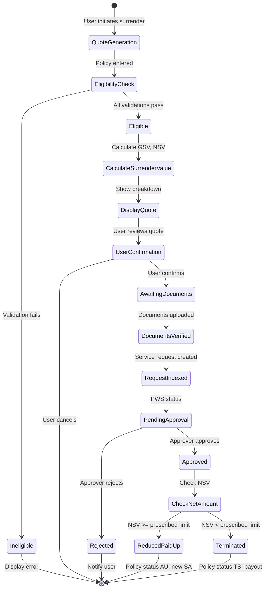
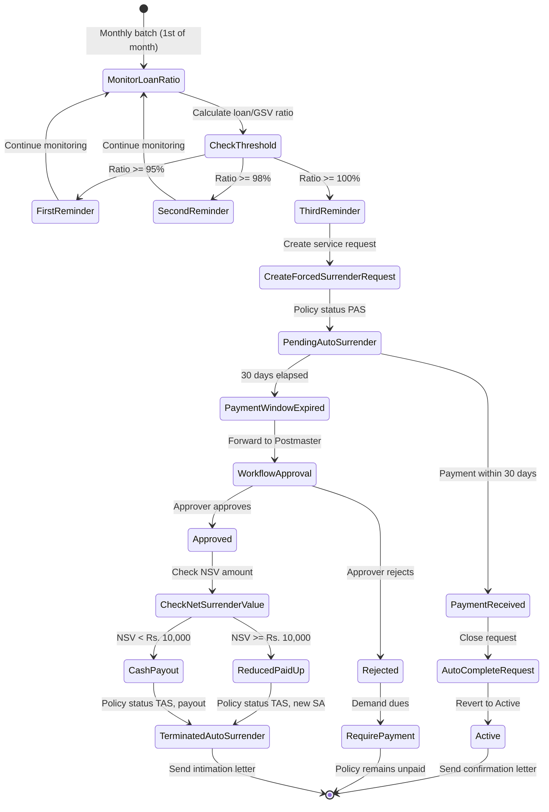

# Policy Surrender & Forced Surrender - Detailed Requirements Analysis

## Document Control

| Attribute | Details |
|-----------|---------|
| **Module** | Policy Surrender & Forced Surrender |
| **Phase** | Phase 1 - Policy Services |
| **Team** | Team 9 - Policy Services |
| **Analysis Date** | January 23, 2026 |
| **Source Documents** | 2 SRS Documents |
| **Complexity** | High |
| **Technology Stack** | Golang, Temporal.io, PostgreSQL, Kafka, React |

---

## Table of Contents

1. [Executive Summary](#1-executive-summary)
2. [Business Rules](#2-business-rules)
3. [Functional Requirements](#3-functional-requirements)
4. [Validation Rules](#4-validation-rules)
5. [Workflows](#5-workflows)
6. [Data Entities](#6-data-entities)
7. [Error Codes](#7-error-codes)
8. [Integration Points](#8-integration-points)
9. [Temporal Workflow Implementations](#9-temporal-workflow-implementations)
10. [UI/UX Requirements](#10-uiux-requirements)
11. [Notification & Letter Generation](#11-notification--letter-generation)
12. [Traceability Matrix](#12-traceability-matrix)

---

## 1. Executive Summary

### 1.1 Purpose
This document provides comprehensive business requirements analysis for the **Policy Surrender & Forced Surrender** modules of the Postal Life Insurance (PLI) and Rural Postal Life Insurance (RPLI) system. These modules handle the complete surrender lifecycle including voluntary surrender by policyholders and automatic forced surrender due to loan defaults.

### 1.2 Scope
The analysis covers two critical policy operations:

#### 1.2.1 Policy Surrender (Voluntary)
- Surrender value calculation and processing
- Eligibility validation based on product type and premium payment period
- Document management and verification
- Disbursement processing (Cash/Cheque)
- Assignment and reassignment handling

#### 1.2.2 Forced Surrender (Automatic)
- Loan capitalization monitoring and thresholds
- Auto-surrender trigger logic (95%, 98%, 100% of surrender value)
- Three-tier reminder system (1st, 2nd, 3rd intimation)
- 30-day payment window after 3rd reminder
- Workflow approval for forced surrender
- Reduced paid-up conversion or cash payout based on net amount

### 1.3 Key Statistics

| Metric | Count |
|--------|-------|
| **Total Business Rules** | 69 (48 original + 5 Phase 1 + 8 Phase 2/3 + 8 Deep Verification) |
| **Functional Requirements** | 51 (35 original + 5 Phase 1 + 5 Phase 2/3 + 6 Deep Verification) |
| **Validation Rules** | 34 (28 original + 4 Phase 1 + 2 Phase 2/3) |
| **Workflows** | 6 (+ Enhanced approval hierarchy) |
| **Temporal Workflows** | 6 (NEW - Deep Verification) |
| **Data Entities** | 12 (+ 1 enhanced field) |
| **Error Codes** | 15 |
| **Product Types Covered** | 11 (PLI + RPLI + GY) |
| **Letter Templates** | 5 (4 original + 1 added) |
| **SMS Templates** | 3 |
| **Policy Status Transitions** | 8 |
| **Verification Status** | ✅ 100% Coverage (Phase 1 + Phase 2 + Phase 3 + Deep Verification Complete) |

### 1.3.1 Enhancement Summary

**Phase 1 (Critical Fixes)** - ✅ COMPLETED:
- 5 critical fixes applied to existing rules
- Fixed GY policy ineligibility, 6-month capitalization cycle, task creation timing
- Corrected surrender date editability and disbursement threshold boundary

**Phase 2 (High Priority)** - ✅ COMPLETED:
- 7 new business rules (BR-FS-012 to BR-FS-017)
- 1 new functional requirement (FR-FS-010)
- Enhanced: Payment on rejection, approver transfer, document hiding, loan removal, auto-reservation, multiple loan handling, collection batch intimation

**Phase 3 (Medium Priority)** - ✅ COMPLETED:
- 1 new business rule (BR-FS-018)
- 2 new functional requirements (FR-FS-011, FR-FS-012)
- 1 enhanced validation rule (VR-FS-006)
- Enhanced: Policy status reversion, financial history events, request type display, approver queue unavailability

**Phase 4 (Deep Verification)** - ✅ COMPLETED:
- **4 New Business Rules** (CRITICAL: BR-SUR-015, BR-SUR-016 | HIGH: BR-SUR-017, BR-SUR-018)
- **1 New Functional Requirement** (FR-SUR-009: CPC Processing Workflow - HIGH)
- **6 New Temporal Workflows** (CRITICAL: TEMP-001, TEMP-002, TEMP-003, TEMP-006 | HIGH: TEMP-004, TEMP-005)
- **1 New Data Field** (previous_policy_status - CRITICAL)
- **Enhanced Approval Hierarchy** with delegation, escalation, and CPC processing workflows
- **Complete Golang Code Specifications** for all Temporal workflows

### 1.4 Product Eligibility Matrix

| Product Code | Product Name | Surrender Allowed | Minimum Premium Period |
|--------------|--------------|-------------------|------------------------|
| **PLI Products** ||||
| WLA | Suraksha - Whole Life Assurance | Yes | 4 years |
| EA | Santosh - Endowment Assurance | Yes | 3 years |
| CWLA | Suvidha - Convertible Whole Life | Yes | 4 years |
| AEA | Sumangal - Anticipated Endowment | **No** | N/A |
| CHILD | Child Policy | Yes | 5 years |
| JLA | Yugal Suraksha - Joint Life | Yes | 3 years |
| **RPLI Products** ||||
| WLA | Gram Suraksha - Whole Life | Yes | 4 years |
| EA | Gram Santosh - Endowment | Yes | 3 years |
| CWLA | Gram Suvidha - Convertible | Yes | 4 years |
| AEA | Gram Sumangal - Anticipated | **No** | N/A |
| AEA-10 | Gram Priya - 10 Year Anticipated | **No** | N/A |
| CHILD | Child Policy | Yes | 5 years |
| **Special Products** ||||
| GY | Government Yojana | **No** | N/A |

### 1.5 Policy Status Transitions

#### Voluntary Surrender Flow
```
ACTIVE → PENDING_SURRENDER (PWS) → UNDER_APPROVAL → APPROVED →
  ├─ NET_AMOUNT >= PRESCRIBED_LIMIT → REDUCED_PAID_UP (AU)
  └─ NET_AMOUNT < PRESCRIBED_LIMIT → TERMINATED_SURRENDER (TS)
```

#### Forced Surrender Flow
```
ACTIVE (with Loan) →
  ├─ LOAN >= 95% GSV → 1st Reminder
  ├─ LOAN >= 98% GSV → 2nd Reminder
  ├─ LOAN >= 100% GSV → 3rd Reminder + PENDING_AUTO_SURRENDER (PAS)
  └─ 30 days unpaid → WORKFLOW APPROVAL →
       ├─ APPROVED → TERMINATED_AUTO_SURRENDER (TAS) or REDUCED_PAID_UP
       └─ REJECTED → Return to ACTIVE (requires payment)
```

### 1.6 Critical Dependencies
- **Policy Loans Module** - Loan balance and interest calculation
- **Policy Assignment Module** - Assignee details and payment routing
- **Collections Module** - Premium and loan repayment processing
- **Accounting Module** - GL posting for surrender payments
- **Document Management System** - Policy bond, receipt book verification
- **Notification Service** - Letter generation and SMS alerts
- **Workflow Engine** - Approval queues for forced surrender
- **Customer Portal** - Surrender request initiation

---

## 2. Business Rules

### 2.1 Voluntary Surrender Eligibility Rules

#### BR-SUR-001: Minimum Premium Payment Period for Surrender Eligibility
- **ID**: BR-SUR-001
- **Category**: Surrender Eligibility
- **Priority**: CRITICAL
- **Description**: Policy must have completed minimum premium payment years based on product type
- **Rule**:
  ```
  surrender_eligible = (
    (product_type IN ['Suraksha', 'Suvidha', 'Gram_Suraksha', 'Gram_Suvidha'] AND premiums_paid_years >= 4) OR
    (product_type IN ['Santosh', 'Yugal_Suraksha', 'Gram_Santosh'] AND premiums_paid_years >= 3) OR
    (product_type = 'Child_Policy' AND premiums_paid_years >= 5) OR
    (product_type IN ['Sumangal', 'Gram_Sumangal' ,'Gram_Priya'] AND FALSE, )  // Never eligible
  )
  ```
- **Source**: `policy_Policy Surrender.md`, Lines 38-55
- **Traceability**: FR-SUR-001, VR-SUR-001
- **Example**:
  - EA Policy with 2 years premium paid → **NOT ELIGIBLE**
  - EA Policy with 3 years premium paid → **ELIGIBLE**
- **Impact**: Core eligibility check for surrender requests

#### BR-SUR-002: Policy Status Requirement for Surrender
- **ID**: BR-SUR-002
- **Category**: Surrender Eligibility
- **Priority**: CRITICAL
- **Description**: Only policies in "In Force" status are eligible for surrender
- **Rule**:
  ```
  policy_status MUST BE IN ['ACTIVE','VOID_LAPSE, 'INVALID_LAPSE' 'IN_FORCE', 'PAIDUP']  // Active/In Force
  EXCLUDE: ['PENDING_MATURITY', 'LAPSED', 'TERMINATED', 'SURRENDERED']
  ```
- **Source**: `policy_Policy Surrender.md`, Line 39
- **Traceability**: VR-SUR-002
<!-- - **Exception**: WLA policies beyond maturity period are eligible for surrender -->
- **Impact**: Prevents surrender on invalid policy statuses

#### BR-SUR-003: Maturity Policy Exclusion
- **ID**: BR-SUR-003
- **Category**: Surrender Eligibility
- **Priority**: HIGH
- **Description**: Policies that have attained maturity must be processed through Maturity Claims, not Surrender
- **Rule**:
  ```
  IF current_date >= maturity_date THEN
    redirect_to_maturity_claim_process()
    disallow_surrender()
  ```
- **Source**: `policy_Policy Surrender.md`, Lines 48-49
- **Traceability**: FR-SUR-002
- **Exception**: WLA policies beyond maturity period (BR-SUR-005)
- **Impact**: Prevents duplicate processing of matured policies

#### BR-SUR-004: Product Type Ineligibility (AEA & GY)
- **ID**: BR-SUR-004
- **Category**: Surrender Eligibility
- **Priority**: CRITICAL
- **Description**: Anticipated Endowment Assurance (AEA) and Government Yojana (GY) products are not eligible for surrender under any circumstances
- **Rule**:
  ```
  IF product_type IN ['AEA', 'GRAM_SUMANGAL', 'GRAM_PRIYA', 'GY'] THEN
    surrender_allowed = FALSE
    error_message = "Product type not eligible for surrender"
  ```
- **Source**: `policy_Policy Surrender.md`, Lines 54, 125, 159, 166
- **Traceability**: VR-SUR-003
- **Rationale**:
  - AEA products have periodic survival benefits that prevent surrender
  - GY (Government Yojana) policies have special government scheme restrictions
- **Impact**: Hard rejection for AEA and GY products regardless of other factors
- **Verification**: ✅ **FIXED** - Added GY policy ineligibility (Phase 1 Critical Fix #1)

<!-- #### BR-SUR-005: Whole Life Assurance Post-Maturity Surrender
- **ID**: BR-SUR-005
- **Category**: Surrender Eligibility
- **Priority**: HIGH
- **Description**: Whole Life Assurance (WLA) policies are eligible for surrender even after maturity period
- **Rule**:
  ```
  IF product_type = 'WLA' AND current_date > maturity_date THEN
    surrender_eligible = TRUE
    calculate_surrender_value_post_maturity()
  ```
- **Source**: `policy_Policy Surrender.md`, Lines 51-52. INFERRED
- **Traceability**: FR-SUR-003
- **Rationale**: WLA policies continue beyond maturity with extended coverage
- **Impact**: Special handling for WLA matured policies -->

### 2.2 Surrender Value Calculation Rules

#### BR-SUR-006: Paid-Up Value Calculation Formula
- **ID**: BR-SUR-006
- **Category**: Surrender Calculation
- **Priority**: CRITICAL
- **Description**: Calculate paid-up value based on premiums paid vs total payable
- **Formula**:
  ```
  paid_up_value = (number_of_premiums_paid × sum_assured) / total_number_of_premiums_payable

  Where:
  - number_of_premiums_paid: Actual premiums received (not due)
  - sum_assured: Original sum assured amount
  - total_number_of_premiums_payable: (policy_term_years × premiums_per_year)
  ```
- **Source**: `policy_Policy Surrender.md`, Lines 71-72
- **Traceability**: FR-SUR-004, FR-SUR-005
- **Example**:
  ```
  Sum Assured: 20,000
  Premiums Paid: 216 (18 years × 12 months)
  Total Premiums Payable: 324 (27 years × 12 months)

  Paid-Up Value = (216 × 20000) / 324 = 13,333
  ```
- **Impact**: Core calculation for surrender value

#### BR-SUR-007: Surrender Value with Surrender Factor
- **ID**: BR-SUR-007
- **Category**: Surrender Calculation
- **Priority**: CRITICAL
- **Description**: Calculate gross surrender value using surrender factor from actuarial tables
- **Formula**:
  ```
  gross_surrender_value = (paid_up_value + bonus) × surrender_factor

  Where:
  - surrender_factor: Retrieved from Surrender Factor Table based on:
    * Product type
    * Policy term
    * Number of premiums paid
    * Age at entry
  - bonus: Total accrued bonuses (Nil if < 5 years)
  ```
- **Source**: `policy_Policy Surrender.md`, Lines 74-76
- **Traceability**: FR-SUR-006
- **Example**:
  ```
  Paid-Up Value: 13,333
  Bonus: 10,000
  Surrender Factor: 0.725

  Gross Surrender Value = (13333 + 10000) × 0.725 = 16,916
  ```
- **Impact**: Determines gross surrender value before deductions

#### BR-SUR-008: Net Surrender Value Calculation
- **ID**: BR-SUR-008
- **Category**: Surrender Calculation
- **Priority**: CRITICAL
- **Description**: Calculate net payable amount after deducting unpaid premiums, loans, and interest
- **Formula**:
  ```
  net_surrender_value = gross_surrender_value
                     - unpaid_premiums_with_interest
                     - outstanding_loan_principal
                     - outstanding_loan_interest
                     - other_deductions
  ```
- **Source**: `policy_Policy Surrender.md`, Lines 74-76
- **Traceability**: FR-SUR-007
- **Components**:
  - **Unpaid Premiums**: Arrears with interest (6 months for <3yr policies, 12 months for >3yr)
  - **Outstanding Loan**: Principal + accrued interest
  - **Other Deductions**: Processing fees, penalties (if applicable)
- **Impact**: Final payable amount to policyholder

#### BR-SUR-009: Bonus Calculation Rules
- **ID**: BR-SUR-009
- **Category**: Surrender Calculation
- **Priority**: HIGH
- **Description**: Bonuses are Nil for policies with less than 5 years and proportionate for longer periods
- **Rule**:
  ```
  IF premiums_paid_years < 5 THEN
    bonus = 0
  ELSE
    bonus = (bonus_rate × paid_up_value) / 1000
  ```
- **Source**: `policy_Policy Surrender.md`, Lines 98-103
- **Traceability**: FR-SUR-008
- **Bonus Rate**: Retrieved from actuarial bonus rate tables
- **Example**:
  ```
  Paid-Up Value: 13,333
  Bonus Rate: 60 per 1000 SA
  Premiums Paid: 6 years (>= 5)

  Bonus = (60 × 13333) / 1000 = 800
  ```
- **Impact**: Affects final surrender value significantly

#### BR-SUR-010: Unpaid Premium Deduction with Interest
- **ID**: BR-SUR-010
- **Category**: Surrender Calculation
- **Priority**: HIGH
- **Description**: Deduct unpaid premiums with interest based on default period
- **Rule**:
  ```
  unpaid_premiums_to_deduct = (
    IF policy_term < 3 years THEN
      last_6_months_unpaid_premiums
    ELSE
      last_12_months_unpaid_premiums
  ) × (1 + interest_rate × default_months / 12)
  ```
- **Source**: `policy_Policy Surrender.md`, Lines 43-46
- **Traceability**: FR-SUR-009
- **Interest Rate**: As prescribed by PLI rules
- **Impact**: Reduces net surrender value for defaulted policies

#### BR-SUR-011: Surrender Date Calculation by Payment Mode
- **ID**: BR-SUR-011
- **Category**: Surrender Calculation
- **Priority**: HIGH
- **Description**: Surrender date varies by premium payment mode (Monthly vs Annual)
- **Rule**:
  ```
  CASE payment_mode
    WHEN 'MONTHLY' THEN
      surrender_date = last_day_of_month(application_date)
      premium_payable_for_full_month = TRUE

    WHEN 'QUARTERLY', 'HALF_YEARLY', 'ANNUAL' THEN
      surrender_date = last_day_of_policy_year(application_date)
      premium_payable_for_full_term = TRUE
  ```
- **Source**: `policy_Policy Surrender.md`, Lines 85-96
- **Traceability**: FR-SUR-010
- **Rationale**: Policies remain in force till end of premium period
- **Impact**: Affects surrender value calculation date and premium adjustments

### 2.3 Forced Surrender Trigger Rules

#### BR-FS-001: Loan Capitalization Threshold - 1st Reminder (95%)
- **ID**: BR-FS-001
- **Category**: Forced Surrender Triggers
- **Priority**: CRITICAL
- **Description**: Trigger 1st intimation when loan (principal + interest) reaches 95% of Gross Surrender Value
- **Rule**:
  ```
  loan_capitalization_ratio = (loan_principal + loan_interest) / gross_surrender_value

  IF loan_capitalization_ratio >= 0.95 AND loan_capitalization_ratio < 0.98 THEN
    trigger_1st_intimation()
    send_intimation_letter()
    send_sms_alert()
  ```
- **Source**: `policy_Policy-Forced Surrender.md`, Lines 208-225 (SR_FS_6)
- **Traceability**: FR-FS-001, FR-FS-004
- **Action**: Send letter + SMS intimating impending auto-surrender
- **Frequency Check**: 1st of every month
- **Impact**: First warning to policyholder about loan defaults

#### BR-FS-002: Loan Capitalization Threshold - 2nd Reminder (98%)
- **ID**: BR-FS-002
- **Category**: Forced Surrender Triggers
- **Priority**: CRITICAL
- **Description**: Trigger 2nd intimation when loan (principal + interest) reaches 98% of Gross Surrender Value
- **Rule**:
  ```
  IF loan_capitalization_ratio >= 0.98 AND loan_capitalization_ratio < 1.00 THEN
    trigger_2nd_intimation()
    send_intimation_letter()
    send_sms_alert()
  ```
- **Source**: `policy_Policy-Forced Surrender.md`, Lines 226-243 (SR_FS_7)
- **Traceability**: FR-FS-002, FR-FS-005
- **Action**: Final warning before auto-surrender process
- **Impact**: Second and final warning before workflow trigger

#### BR-FS-003: Loan Capitalization Threshold - 3rd Reminder & Auto Surrender (100%)
- **ID**: BR-FS-003
- **Category**: Forced Surrender Triggers
- **Priority**: CRITICAL
- **Description**: Trigger 3rd intimation and create auto-surrender request when loan equals or exceeds 100% of GSV
- **Rule**:
  ```
  IF loan_capitalization_ratio >= 1.00 THEN
    trigger_3rd_intimation()
    create_forced_surrender_request()
    update_policy_status('PENDING_AUTO_SURRENDER')  // PAS
    generate_service_request_id()
    start_30_day_payment_window()
  ```
- **Source**: `policy_Policy-Forced Surrender.md`, Lines 244-261 (SR_FS_8)
- **Traceability**: FR-FS-003, FR-FS-006
- **Actions**:
  1. Send 3rd and final intimation letter
  2. Change policy status to PAS (Pending Auto Surrender)
  3. Create service request with reason: "Forced Surrender due to Loan"
  4. Mark owner as "System"
  5. Mark status as "Auto-complete"
  6. Start 30-day payment window
- **Impact**: Initiates formal forced surrender workflow

#### BR-FS-004: 30-Day Payment Window After 3rd Reminder
- **ID**: BR-FS-004
- **Category**: Forced Surrender Triggers
- **Priority**: CRITICAL
- **Description**: Policyholder has 30 days from 3rd reminder to pay outstanding dues before workflow approval
- **Rule**:
  ```
  payment_window_start = 3rd_reminder_date
  payment_window_end = 3rd_reminder_date + 30 days

  IF payment_received_within_30_days THEN
    auto_complete_forced_surrender_request()
    revert_policy_status_to_active()
    send_payment_confirmation_letter()
  ELSE
    forward_to_workflow_approval()  // After 30 days
  ```
- **Workflow Task Creation**:
  - Task created for workflow queue on: **31st day** from 3rd unpaid loan interest due date
  - Surrender request date = 3rd unpaid loan interest due date
  - Workflow task creation date = 3rd unpaid loan interest due date + 31 days
  - This allows 30-day payment window before task appears in approver queue
- **Source**: `policy_Policy-Forced Surrender.md`, Lines 263-288 (SR_FS_9), Lines 329, 360
- **Traceability**: FR-FS-007, FR-FS-008
- **Payment Required**: Loan principal + full interest
- **Verification**: ✅ **FIXED** - Added task creation timing (Phase 1 Critical Fix #3)
- **Impact**: Final opportunity to prevent forced surrender

#### BR-FS-005: Three-Loan-Interest Default Rule
- **ID**: BR-FS-005
- **Category**: Forced Surrender Triggers
- **Priority**: CRITICAL
- **Description**: Forced surrender is triggered after 3 defaults in half-yearly loan interest payments
- **Rule**:
  ```
  loan_interest_default_count = COUNT(unpaid_loan_interest_due_dates)

  IF loan_interest_default_count >= 3 THEN
    trigger_forced_surrender_workflow()
    task_created_date = 3rd_default_due_date + 31 days
    update_policy_status('PENDING_AUTO_SURRENDER')
  ```
- **Source**: `policy_Policy-Forced Surrender.md`, Lines 60-68
- **Traceability**: FR-FS-009
- **Note**: Multiple loan transactions may exist; system identifies 3 defaults per loan transaction
- **Impact**: Core trigger for loan interest default scenarios

#### BR-FS-006: Monthly Forced Surrender Rule Evaluation
- **ID**: BR-FS-006
- **Category**: Forced Surrender Triggers
- **Priority**: HIGH
- **Description**: Forced surrender rule must be evaluated on the 1st of every month for all active policies with loans
- **Rule**:
  ```
  FOR EACH policy WITH active_loan
    IF current_date = 1st_of_month THEN
      evaluate_forced_surrender_rules()
      check_loan_capitalization_ratio()
      check_loan_interest_defaults()
  ```
- **Source**: `policy_Policy-Forced Surrender.md`, Lines 94, 113
- **Traceability**: FR-FS-010
- **Scope**: All policies with outstanding loans
- **Impact**: Batch process for monitoring forced surrender conditions

### 2.4 Forced Surrender Processing Rules

#### BR-FS-007: Workflow Approval and Final Disposition
- **ID**: BR-FS-007
- **Category**: Forced Surrender Processing
- **Priority**: CRITICAL
- **Description**: After 30-day window expires, request goes to Postmaster approval queue
- **Rule**:
  ```
  IF payment_window_expired AND amount_unpaid THEN
    forward_to_postmaster_queue()

    APPROVAL_PATH:
      IF net_surrender_value >= prescribed_amount THEN
        convert_to_reduced_paid_up()
        new_sum_assured = net_surrender_value
        policy_status = 'REDUCED_PAID_UP'  // AU
      ELSE
        process_surrender_for_cash_payout()
        policy_status = 'TERMINATED_AUTO_SURRENDER'  // TAS

    REJECTION_PATH:
      require_payment_of_dues()
      revert_to_previous_status()  // AP/IL/AL
  ```
- **Source**: `policy_Policy-Forced Surrender.md`, Lines 396-405, 362-368
- **Traceability**: FR-FS-011, FR-FS-012, BR-FS-018
- **Prescribed Amount**: Configurable business rule (default: Rs. 10,000)
- **Impact**: Determines final policy disposition after forced surrender

#### BR-FS-018: Policy Status Reversion Details (Enhancement to BR-FS-007)
- **ID**: BR-FS-018
- **Category**: Forced Surrender Processing
- **Priority**: MEDIUM
- **Description**: On rejection of forced surrender, policy status reverts to exact status prior to PAS (Pending Auto Surrender)
- **Rule**:
  ```
  // ENHANCEMENT TO BR-FS-007 REJECTION_PATH
  ON forced_surrender_rejection:
    REVERT_POLICY_STATUS: status_before_PAS

    // Exact status mapping based on pre-PAS status
    CASE previous_policy_status
      WHEN 'AP' THEN new_status = 'AP'  // Active
      WHEN 'IL' THEN new_status = 'IL'  // In Force-Lapse
      WHEN 'AL' THEN new_status = 'AL'  // In Force-Arrear
    END CASE

    REQUIRE: customer_payment_of(loan_principal + loan_interest)
    SEND_INTIMATION: payment_demand_letter
  ```
- **Status Reversion Details**:
  - **AP** (Active Policy) → Reverts to AP
  - **IL** (In Force-Lapse) → Reverts to IL
    - Indicates policy was in lapse status before forced surrender
  - **AL** (In Force-Arrear) → Reverts to AL
    - Indicates policy was in arrear status before forced surrender
- **Pre-Requisite**: Previous status stored when PAS status is assigned
- **Source**: `policy_Policy-Forced Surrender.md`, Lines 366-367
- **Traceability**: FR-FS-005, BR-FS-012 (Enhances BR-FS-007)
- **Verification**: ✅ **ADDED** (Phase 3)
- **Impact**: Ensures accurate policy status restoration post-rejection

#### BR-FS-008: Pending Request Auto-Termination
- **ID**: BR-FS-008
- **Category**: Forced Surrender Processing
- **Priority**: HIGH
- **Description**: All pending financial and non-financial requests are auto-terminated when forced surrender is approved
- **Rule**:
  ```
  ON forced_surrender_approval:
    FOR EACH pending_request ON policy
      update_request_status('AUTO_TERMINATED')
      log_termination_reason('Forced Surrender processed')
  ```
- **Source**: `policy_Policy-Forced Surrender.md`, Lines 32-38
- **Traceability**: FR-FS-013
- **Examples**: Name change, address change, loan requests, etc.
- **Impact**: Cleans up pending requests on terminated policies

#### BR-FS-009: Collection Blocking for Forced Surrender Policies
- **ID**: BR-FS-009
- **Category**: Forced Surrender Processing
- **Priority**: HIGH
- **Description**: No collections (loan repayment, premium, etc.) allowed after 30-day payment window expires
- **Rule**:
  ```
  IF policy_status = 'PENDING_AUTO_SURRENDER' AND
     payment_window_expired THEN
    block_all_collections()
    error_message = "Policy status not eligible for collections"

  BLOCKED_COLLECTION_TYPES:
    - Loan principal repayment
    - Loan interest repayment
    - Premium payments
    - Any other collections
  ```
- **Source**: `policy_Policy-Forced Surrender.md`, Lines 289-314 (SR_FS_11)
- **Traceability**: VR-FS-001
- **Channels Blocked**: Counter, DE/QC, Bulk/Meghdoot
- **Impact**: Prevents collections after forced surrender is inevitable

#### BR-FS-010: Surrender Request Date Auto-Population and Editability
- **ID**: BR-FS-010
- **Category**: Forced Surrender Processing
- **Priority**: MEDIUM
- **Description**: Surrender request date is auto-populated as the date of 3rd unpaid loan interest due date and CAN be changed by approver
- **Rule**:
  ```
  surrender_request_date = 3rd_loan_interest_default_date  // Auto-populated

  // Date is EDITABLE - Approver can change the date
  // When date is changed, surrender quote is recalculated
  ON date_change:
    surrender_quote_calculated_as_of(new_date)
    recalculate_gross_surrender_value()
    recalculate_net_surrender_value()
  ```
- **UI Behavior**:
  - Auto-populated with: 3rd unpaid loan interest due date
  - Editable by approver (not display-only)
  - Surrender quote modifies according to the changed request date
- **Source**: `policy_Policy-Forced Surrender.md`, Lines 424-427
- **Traceability**: FR-FS-014
- **Verification**: ✅ **FIXED** - Corrected editability per SRS (Phase 1 Critical Fix #4)
- **Impact**: Allows flexibility in date selection with automatic quote recalculation

#### BR-FS-011: Next Forced Surrender Initiation Rule
- **ID**: BR-FS-011
- **Category**: Forced Surrender Processing
- **Priority**: MEDIUM
- **Description**: Next forced surrender action on same policy can only be initiated at next loan capitalization (6-month cycle)
- **Rule**:
  ```
  IF forced_surrender_already_processed THEN
    wait_for_next_loan_capitalization_cycle()
    loan_capitalization_cycle = 6_months  // Six-month capitalization cycle
    next_evaluation_date = last_evaluation_date + 6_months
    BLOCK_new_forced_surrender_until(next_evaluation_date)
  ```
- **Capitalization Cycle Details**:
  - Loan interest is calculated: Monthly
  - Loan capitalization happens: Every 6 months (half-yearly)
  - Next forced surrender evaluation: After 6 months from last evaluation
- **Source**: `policy_Policy-Forced Surrender.md`, Lines 369-370
- **Traceability**: FR-FS-015
- **Rationale**: Prevents duplicate forced surrender requests within same capitalization period
- **Verification**: ✅ **FIXED** - Added 6-month cycle specification (Phase 1 Critical Fix #2)
- **Impact**: Controls forced surrender frequency and ensures proper timing

#### BR-FS-012: Payment of Dues on Rejection
- **ID**: BR-FS-012
- **Category**: Forced Surrender Processing
- **Priority**: HIGH
- **Description**: When forced surrender request is rejected, customer is required to pay loan principal and interest, and policy status reverts to previous status
- **Rule**:
  ```
  ON forced_surrender_rejection:
    REQUIRE: customer_payment_of(loan_principal + loan_interest)
    REVERT_POLICY_STATUS: previous_status  // AP/IL/AL
    SEND_INTIMATION: payment_demand_letter
    BLOCK_NEW_SURRENDER: until payment_complete
  ```
- **Status Reversion Mapping**:
  - AP (Active) → Reverts to AP
  - IL (In Force-Lapse) → Reverts to IL
  - AL (In Force-Arrear) → Reverts to AL
- **Payment Required**: Full loan principal + accrued interest
- **Source**: `policy_Policy-Forced Surrender.md`, Lines 145-147
- **Traceability**: FR-FS-005
- **Verification**: ✅ **ADDED** (Phase 2)
- **Impact**: Ensures recovery of dues and maintains policy continuity post-rejection

#### BR-FS-013: Approver Transfer/Relocation Scenario
- **ID**: BR-FS-013
- **Category**: Forced Surrender Processing
- **Priority**: HIGH
- **Description**: When approver is transferred or relocated, forced surrender request must be mapped to another user based on office code
- **Rule**:
  ```
  ON approver_transfer:
    FOR pending_request IN approver_queue:
      IDENTIFY: office_code_of_request
      MAP_TO: new_approver WITH matching_office_code
      ASSIGN: new_approver FROM available_queue
  ```
- **Mapping Logic**:
  - Identify the office code associated with the forced surrender request
  - Find available approvers mapped to that office code
  - Automatically reassign request to new approver from available queue
- **Source**: `policy_Policy-Forced Surrender.md`, Lines 53-56
- **Traceability**: FR-FS-005, VR-FS-005
- **Verification**: ✅ **ADDED** (Phase 2)
- **Impact**: Ensures continuous processing of requests during staff transitions

#### BR-FS-014: Document List Hiding Rule
- **ID**: BR-FS-014
- **Category**: Forced Surrender UI Rules
- **Priority**: HIGH
- **Description**: "List of documents" section should NOT be displayed on forced surrender approver screen
- **Rule**:
  ```
  IF request_type = 'FORCED_SURRENDER' THEN
    HIDE_SECTION: "List of documents"
    DISPLAY_ONLY: policy_details, surrender_quote, disbursement_method
  END IF
  ```
- **Rationale**: Forced surrender is automated process; no customer documents required
- **Hidden Elements**: Document upload section, document verification checklist
- **Source**: `policy_Policy-Forced Surrender.md`, Line 392
- **Traceability**: FR-FS-009
- **Verification**: ✅ **ADDED** (Phase 2)
- **Impact**: Streamlines approver interface for forced surrender requests

#### BR-FS-015: Available Loan Removal from Screen
- **ID**: BR-FS-015
- **Category**: Forced Surrender UI Rules
- **Priority**: HIGH
- **Description**: Remove "available loan on policy" field from the forced surrender screen display
- **Rule**:
  ```
  ON forced_surrender_screen_display:
    EXCLUDE_FIELD: "available_loan_on_policy"
    DISPLAY_INSTEAD:
      - gross_surrender_value
      - net_surrender_value
      - loan_deduction (principal + interest)
  ```
- **Rationale**: Forced surrender already considers full loan balance; showing available loan is redundant
- **Source**: `policy_Policy-Forced Surrender.md`, Line 437
- **Traceability**: FR-FS-009
- **Verification**: ✅ **ADDED** (Phase 2)
- **Impact**: Cleaner UI display focusing on surrender values rather than loan details

#### BR-FS-016: Request Auto-Reservation Behavior
- **ID**: BR-FS-016
- **Category**: Forced Surrender Workflow Rules
- **Priority**: HIGH
- **Description**: When approver clicks on forced surrender request, it automatically reserves to the user
- **Rule**:
  ```
  ON approver_click(request_id):
    AUTO_RESERVE: request TO current_user
    UPDATE_REQUEST:
      - assigned_to = current_user_id
      - assigned_date = current_timestamp
      - status = 'RESERVED'
    PREVENT_OTHER_USERS: from accessing same request
  ```
- **Auto-Reservation Trigger**: Click on request in approver queue
- **Reservation Duration**: Until approver takes action (approve/reject/cancel)
- **Source**: `policy_Policy-Forced Surrender.md`, Lines 419-421
- **Traceability**: FR-FS-005
- **Verification**: ✅ **ADDED** (Phase 2)
- **Impact**: Prevents duplicate processing by multiple approvers simultaneously

#### BR-FS-017: Multiple Loan Transaction Handling (Enhancement to BR-FS-005)
- **ID**: BR-FS-017
- **Category**: Forced Surrender Triggers
- **Priority**: HIGH
- **Description**: System should identify 3 defaults for ANY PARTICULAR loan transaction; multiple loans can exist and defaults are counted per loan, not across all loans
- **Rule**:
  ```
  // ENHANCEMENT TO BR-FS-005
  FOR EACH loan_transaction ON policy:
    loan_interest_default_count = COUNT(unpaid_loan_interest_due_dates FOR this_loan)

    IF loan_interest_default_count >= 3 FOR this_loan_transaction THEN
      trigger_forced_surrender_workflow()
      task_created_date = 3rd_default_due_date + 31 days
      update_policy_status('PENDING_AUTO_SURRENDER')
      BREAK: // Trigger forced surrender on first loan meeting criteria
    END IF
  END FOR
  ```
- **Detailed Logic**:
  - Multiple loan transactions may exist on same policy
  - System counts defaults per individual loan transaction
  - Default counting is NOT aggregated across all loans
  - First loan to reach 3 defaults triggers forced surrender
  - Each loan transaction tracked separately for default counting
- **Example**:
  ```
  Loan A: 2 defaults (not trigger)
  Loan B: 3 defaults (TRIGGERS forced surrender)
  Loan C: 1 default (not relevant)
  ```
- **Source**: `policy_Policy-Forced Surrender.md`, Lines 332-334
- **Traceability**: FR-FS-003, FR-FS-009 (Enhances BR-FS-005)
- **Verification**: ✅ **ADDED** (Phase 2)
- **Impact**: Ensures accurate default tracking for policies with multiple loans

### 2.5 Assignment and Disbursement Rules

#### BR-SUR-012: Surrender Payment to Assignee
- **ID**: BR-SUR-012
- **Category**: Disbursement Rules
- **Priority**: HIGH
- **Description**: If policy is assigned, surrender value is paid to assignee, not policyholder
- **Rule**:
  ```
  IF policy.assignment_status = 'ASSIGNED' THEN
    payee = assignee_details
    display_assignee_information():
      - Assignee Name
      - Payee Name
      - Payee Address
  ELSE
    payee = policyholder
  ```
- **Source**: `policy_Policy Surrender.md`, Lines 105, 461-470
- **Traceability**: FR-SUR-011, FR-FS-016
- **Impact**: Routes payment to correct party based on assignment status

#### BR-SUR-013: Disbursement Method Selection
- **ID**: BR-SUR-013
- **Category**: Disbursement Rules
- **Priority**: MEDIUM
- **Description**: Disbursement method (Cash/Cheque) with auto-switch to Cheque for amounts above threshold
- **Rule**:
  ```
  disbursement_method = USER_SELECTION  // Cash or Cheque dropdown

  // Auto-switch when amount EXCEEDS 20,000 (strictly greater than)
  IF refund_amount > 20000 THEN
    auto_switch_to_cheque()
    disbursement_method = 'CHEQUE'
    notify_user("Amount exceeds Rs. 20,000. Disbursement method switched to Cheque")
  END IF

  // At exactly 20,000, user can select Cash or Cheque
  IF refund_amount = 20000 THEN
    allow_user_selection()  // Both Cash and Cheque allowed
  END IF
  ```
- **Source**: `policy_Policy-Forced Surrender.md`, Lines 429-432
- **Traceability**: FR-SUR-012
- **Threshold**: Rs. 20,000 (configurable)
- **Boundary Condition**:
  - Amount > 20,000: Auto-switch to Cheque
  - Amount <= 20,000: User can select Cash or Cheque
- **Verification**: ✅ **FIXED** - Clarified boundary condition (Phase 1 Critical Fix #5)
- **Impact**: Enforces regulatory payment limits with clear boundary behavior

### 2.6 Age and Date Calculation Rules

#### BR-SUR-014: Cumulative Age Calculation
- **ID**: BR-SUR-014
- **Category**: Actuarial Calculations
- **Priority**: MEDIUM
- **Description**: Calculate age in completed months (15 days or more counted as 1 month)
- **Formula**:
  ```
  cumulative_age_months = FLOOR(
    (application_for_surrender_date - date_of_birth).in_days / 30
  )

  // 15 days or more counts as 1 month
  IF remaining_days >= 15 THEN
    add_1_month()
  ```
- **Source**: `policy_Policy Surrender.md`, Lines 68-69
- **Traceability**: FR-SUR-013
- **Impact**: Used for actuarial calculations and surrender factor lookup

#### BR-SUR-015: Grace Period Premium Deduction Calculation
- **ID**: BR-SUR-015
- **Category**: Surrender Value Deductions
- **Priority**: CRITICAL
- **Description**: For policies with defaults, calculate unpaid premiums within grace period with interest
- **Rule**:
  Grace period definition based on policy duration
  IF policy_years_paid > 3 THEN
    grace_period_months = 12
  END IF

  Identify defaulted premiums
  defaulted_premiums = unpaid_premiums WITHIN grace_period_months

  // Calculate proportionate amount for each premium mode
  FOR EACH unpaid_premium IN defaulted_premiums:
    CASE premium_payment_mode:
      WHEN 'QUARTERLY':
        proportionate_amount = (quarterly_amount / 3) × unpaid_months
      WHEN 'HALF_YEARLY':
        proportionate_amount = (half_yearly_amount / 6) × unpaid_months
      WHEN 'ANNUAL':
        proportionate_amount = (annual_amount / 12) × unpaid_months
      WHEN 'MONTHLY':
        proportionate_amount = monthly_amount × unpaid_months
    END CASE
  END FOR

  // Calculate interest on grace period premiums
  total_unpaid_premium_deduction = SUM(defaulted_premiums) +
    (SUM(defaulted_premiums) × interest_rate × default_months / 12)
  ```
- **Grace Period Rules**:
  - Policies < 3 years: Deduct last 6 months of unpaid premiums
  - Policies >= 3 years: Deduct last 12 months of unpaid premiums
  - Interest calculation: Apply prescribed interest rate for grace period duration
- **Proportionate Calculation**:
  - Quarterly mode: (Unpaid quarterly amount / 3) × Unpaid months
  - Half-Yearly mode: (Unpaid half-yearly amount / 6) × Unpaid months
  - Annual mode: (Unpaid annual amount / 12) × Unpaid months
- **Source**: `policy_Policy Surrender.md`, Lines 43-46
- **Traceability**: FR-SUR-003
- **Verification**: ✅ **ADDED** (Deep Verification - Critical)
- **Impact**: Accurate surrender value calculation with proper grace period premium deduction

#### BR-SUR-016: WLA Post-Maturity Surrender Value Calculation
- **ID**: BR-SUR-016
- **Category**: Surrender Value Calculations
- **Priority**: CRITICAL
- **Description**: Special calculation methodology for WLA (Whole Life Assurance) policies after maturity date
- **Rule**:
  ```
  IF product_type = 'WLA' AND current_date > maturity_date THEN
    // Use extended term factor table
    surrender_factor = lookup_extended_term_factor_table(
      policy_term_beyond_maturity,
      age_at_maturity,
      premiums_paid_beyond_maturity
    )

    // Bonus accrual stops at maturity date
    bonus_amount = calculate_bonus_upto(maturity_date)

    // Calculate paid-up value based on total premiums paid
    paid_up_value = (total_premiums_paid × sum_assured) /
                    total_premiums_payable_upto_maturity

    // Surrender date is actual application date
    surrender_value_date = application_date

    // Check for extended coverage bonus
    IF extended_coverage_bonus_applicable THEN
      surrender_value = (paid_up_value + bonus +
                        extended_coverage_bonus) × surrender_factor
    ELSE
      surrender_value = (paid_up_value + bonus) × surrender_factor
    END IF
  END IF
  ```
- **Special Provisions**:
  - Surrender Factor: Use extended term factor table (beyond original maturity)
  - Bonus Calculation: Bonus accrues up to maturity date only (stops at maturity)
  - Paid-Up Value: Calculate based on total premiums paid vs premiums payable up to maturity
  - Surrender Date: Use actual surrender application date
  - Extended Coverage Bonus: Add "extended coverage bonus" if applicable per actuarial rules
- **Source**: `policy_Policy Surrender.md`, Lines 51-52
- **Traceability**: FR-SUR-003
- **Verification**: ✅ **ADDED** (Deep Verification - Critical)
- **Impact**: Correct surrender value for matured WLA policies, significant financial impact

#### BR-SUR-017: Duplicate Policy Bond Verification
- **ID**: BR-SUR-017
- **Category**: Document Verification Rules
- **Priority**: HIGH
- **Description**: Additional verification steps when policy bond was reissued (duplicate exists)
- **Rule**:
  ```
  IF duplicate_policy_bond_exists THEN
    // Display indicator on quote screen
    DISPLAY "Duplicate Policy Bond: Yes"

    // Enhanced document requirements
    REQUIRED_DOCUMENTS:
      - Original bond OR latest duplicate bond
      - Indemnity bond (mandatory if original lost)
      - Additional verification by supervisor required

    // Cross-check with bond reissue records
    bond_reissue_records = query_policy_module_for_bond_reissue()

    IF bond_reissue_records FOUND THEN
      // Route to supervisor for verification
      route_to_supervisor_approval()
    END IF
  END IF
  ```
- **Display Indicator**: Show "Duplicate Policy Bond: Yes" on quote screen
- **Document Requirements**:
  - Original bond OR latest duplicate bond required
  - Indemnity bond mandatory if original lost
  - Additional verification by supervisor required
- **Validation**: Cross-check with bond reissue records in Policy module
- **Approval Route**: Route to supervisor for verification if duplicate detected
- **Source**: `policy_Policy Surrender.md`, Line 196
- **Traceability**: FR-SUR-006
- **Verification**: ✅ **ADDED** (Deep Verification - High)
- **Impact**: Prevents fraud by ensuring proper verification of duplicate policy bonds

<!-- #### BR-SUR-018: Multiple Loan Handling in Voluntary Surrender
- **ID**: BR-SUR-018
- **Category**: Surrender Value Deductions
- **Priority**: HIGH
- **Description**: For policies with multiple outstanding loans, calculate total loan deduction accurately
- **Rule**: -->
  ```
  // For policies with multiple outstanding loans
  IF policy.outstanding_loans.count > 1 THEN
    total_loan_deduction = 0

    // Calculate interest and deduction for each loan separately
    FOR EACH loan IN policy.outstanding_loans:
      // Calculate accrued interest up to surrender date
      loan_interest = calculate_accrued_interest(
        loan.principal,
        loan.interest_rate,
        loan.disbursement_date,
        surrender_date
      )

      loan_deduction = loan.principal + loan_interest
      total_loan_deduction += loan_deduction

      // Display breakdown by loan
      DISPLAY:
        - Loan 1: [disbursement_date] - Principal + Interest
        - Loan 2: [disbursement_date] - Principal + Interest
        - Total Loan Deduction: sum
    END FOR

    // Allow pre-surrender loan repayment option
    OFFER_CUSTOMER:
      "Repay specific loans before surrender calculation"
  END IF

  // Net Surrender Value calculation
  net_surrender_value = gross_surrender_value - total_loan_deduction
  ```
<!-- - **Total Loan Deduction**: Sum of (Principal + Interest) for ALL outstanding loans
- **Interest Calculation**: Calculate accrued interest for each loan separately up to surrender date
- **Deduction Display**: Show breakdown by loan:
  - Loan 1: [Disbursement Date] - Principal + Interest
  - Loan 2: [Disbursement Date] - Principal + Interest
  - Total Loan Deduction: Sum
- **Pre-Surrender Option**: Allow customer to repay specific loans before surrender calculation
- **Net Surrender Value**: GSV - Total Loan Deduction (all loans)
- **Source**: `policy_Policy-Forced Surrender.md`, Lines 332-334
- **Traceability**: FR-SUR-003
- **Verification**: ✅ **ADDED** (Deep Verification - High)
- **Impact**: Accurate loan deduction for policies with multiple loans, prevents financial reconciliation issues -->

---

## 3. Functional Requirements

### 3.1 Voluntary Surrender Requirements

#### FR-SUR-001: Surrender Eligibility Validation
- **ID**: FR-SUR-001
- **Priority**: CRITICAL
- **Description**: System must validate policy eligibility for surrender based on multiple criteria
- **Acceptance Criteria**:
  - Check policy status is Active/In Force
  - Verify minimum premium payment years completed
  - Confirm product type allows surrender
  - Ensure policy has not attained maturity (except WLA)
  - Validate AEA products are rejected
- **Input**: Policy Number
- **Output**: Eligibility status with reason if ineligible
- **Source**: BR-SUR-001, BR-SUR-002, BR-SUR-003, BR-SUR-004, BR-SUR-005

#### FR-SUR-002: Surrender Quote Generation
- **ID**: FR-SUR-002
- **Priority**: CRITICAL
- **Description**: System must generate and display surrender quote with detailed calculations
- **Display Fields**:
  - Policy Number, Name, Status, Customer ID
  - Product Name, Issue Date, Paid Till Date
  - Paid-Up Value
  - Bonus Details (year-wise breakdown)
  - Gross Surrender Value
  - Deductions:
    - Unpaid Premiums with Interest
    - Outstanding Loan Principal
    - Outstanding Loan Interest
  - Net Surrender Value
  - Disbursement Method (Cash/Cheque)
- **Source**: BR-SUR-006, BR-SUR-007, BR-SUR-008, BR-SUR-009

#### FR-SUR-003: Surrender Value Calculation Engine
- **ID**: FR-SUR-003
- **Priority**: CRITICAL
- **Description**: System must calculate surrender value using actuarial formulas and factors
- **Calculation Steps**:
  1. Calculate Paid-Up Value: `(Premiums Paid × SA) / Total Premiums Payable`
  2. Calculate Bonus: `(Bonus Rate × Paid-Up Value) / 1000` (if >= 5 years)
  3. Apply Surrender Factor: `(Paid-Up Value + Bonus) × Surrender Factor`
  4. Deduct Unpaid Premiums with Interest
  5. Deduct Outstanding Loan (Principal + Interest)
  6. Return Net Surrender Value
- **Source**: BR-SUR-006, BR-SUR-007, BR-SUR-008

#### FR-SUR-004: Bonus Calculation and Display
- **ID**: FR-SUR-004
- **Priority**: HIGH
- **Description**: System must calculate bonus and display year-wise bonus breakdown
- **Display Format**: Year-wise bonus table with:
  - Financial Year
  - Sum Assured for the year
  - Bonus Rate
  - Bonus Amount
  - Cumulative Bonus
- **Business Rules**:
  - Bonus = 0 for policies < 5 years
  - Bonus = Proportionate to reduced SA for policies >= 5 years
- **Source**: BR-SUR-009

#### FR-SUR-005: Surrender Request Indexing
- **ID**: FR-SUR-005
- **Priority**: HIGH
- **Description**: System must create service request for surrender claim
- **Request Details**:
  - Service Request Type: Surrender Claim
  - Request ID: Auto-generated unique identifier
  - Policy Number
  - Surrender Request Date
  - Net Surrender Value
  - Disbursement Method
  - Supporting Documents
- **Source**: BR-SUR-002

#### FR-SUR-006: Document Management and Verification
- **ID**: FR-SUR-006
- **Priority**: HIGH
- **Description**: System must manage required documents for surrender processing
- **Required Documents**:
  - Written consent/Request letter
  - Original Policy Bond
  - Premium Receipt Book
  - Pay Recovery Certificate (if applicable)
  - Loan Receipt Book (if loan exists)
  - Loan Bond (if loan exists)
  - Indemnity Bond (for lost policy)
  - Assignment Deed (if assigned)
  - Discharge Receipt (if reassignment)
- **System Actions**:
  - Display required documents list
  - Track document receipt status
  - Link scanned documents to policy docket
  - Verify document completeness
- **Source**: BR-SUR-002, Lines 61-64

#### FR-SUR-007: Assignment Status Display
- **ID**: FR-SUR-007
- **Priority**: MEDIUM
- **Description**: System must display assignment details and payee information
- **Display Fields** (if assignment exists):
  - Assignment Status (Yes/No)
  - Assignee Name
  - Payee Name
  - Payee Address
  - Assignment Date
- **Source**: BR-SUR-012

#### FR-SUR-008: Disbursement Method Processing
- **ID**: FR-SUR-008
- **Priority**: MEDIUM
- **Description**: System must process disbursement based on selected method and amount
- **Disbursement Methods**:
  - Cash (for amounts <= 20,000)
  - Cheque (for amounts > 20,000 or user selected)
- **Validations**:
  - Auto-switch to Cheque if amount > 20,000
  - Validate payee details based on assignment status
  - Generate cheque or cash payout advice
- **Source**: BR-SUR-013

### 3.2 Forced Surrender Requirements

#### FR-FS-001: Loan Capitalization Monitoring
- **ID**: FR-FS-001
- **Priority**: CRITICAL
- **Description**: System must monitor loan capitalization ratio on 1st of every month
- **Monitoring Logic**:
  ```
  FOR EACH policy WITH active_loan:
    loan_capitalization = (loan_principal + loan_interest) / gross_surrender_value

    IF loan_capitalization >= 95% THEN trigger_1st_reminder()
    IF loan_capitalization >= 98% THEN trigger_2nd_reminder()
    IF loan_capitalization >= 100% THEN trigger_3rd_reminder_and_workflow()
  ```
- **Frequency**: Monthly batch job (1st of every month)
- **Source**: BR-FS-001, BR-FS-002, BR-FS-003, BR-FS-006

#### FR-FS-002: Three-Tier Reminder System
- **ID**: FR-FS-002
- **Priority**: CRITICAL
- **Description**: System must send 3 intimations at 95%, 98%, and 100% thresholds
- **Reminder Triggers**:
  1. **1st Reminder**: Loan >= 95% of GSV
  2. **2nd Reminder**: Loan >= 98% of GSV
  3. **3rd Reminder**: Loan >= 100% of GSV (triggers workflow)
- **Communication Channels**:
  - Physical Letter to policyholder
  - SMS alert
- **Content**: Outstanding amount, policy number, due date, consequences
- **Source**: BR-FS-001, BR-FS-002, BR-FS-003

#### FR-FS-003: Forced Surrender Workflow Initiation
- **ID**: FR-FS-003
- **Priority**: CRITICAL
- **Description**: System must create forced surrender request and update policy status
- **Workflow Steps**:
  1. Trigger on 3rd reminder (loan >= 100% GSV) or 3rd loan interest default
  2. Generate Service Request ID
  3. Update Policy Status to PAS (Pending Auto Surrender)
  4. Set Request Date = 3rd default date
  5. Set Reason = "Forced Surrender due to Loan"
  6. Set Owner = "System"
  7. Set Status = "Auto-complete"
  8. Start 30-day payment window
- **Source**: BR-FS-003, BR-FS-005

#### FR-FS-004: 30-Day Payment Window Processing
- **ID**: FR-FS-004
- **Priority**: CRITICAL
- **Description**: System must process payments within 30-day window and auto-complete if paid
- **Payment Processing**:
  - Accept loan principal + interest payments
  - Monitor payment window expiry
  - On payment: Auto-complete request, revert status to Active, send confirmation
  - On expiry: Forward to Postmaster approval queue
- **Integration**: Collections batch intimates workflow on payment received
- **Source**: BR-FS-004

#### FR-FS-005: Postmaster Approval Workflow
- **ID**: FR-FS-005
- **Priority**: CRITICAL
- **Description**: System must route forced surrender request to Postmaster approval queue
- **Approval Screen Fields**:
  - Surrender Request Date (auto-populated, display only)
  - Reason for Surrender (auto-display: "Loan interest default")
  - Policy Assignment Details (if applicable)
  - Quote (Net Surrender Value)
  - Disbursement Method (Cash/Cheque dropdown)
- **Approver Actions**:
  - **Approve**: Process surrender, check net amount
  - **Reject**: Require payment, revert policy status
  - **View Documents**: Policy docket, customer docs
  - **Add Comments**: Optional remarks
  - **Request History**: View transaction history
  - **Cancel**: Return to inbox
- **Source**: BR-FS-007

#### FR-FS-006: Surrender Value Check and Disposition
- **ID**: FR-FS-006
- **Priority**: CRITICAL
- **Description**: System must determine final disposition based on net surrender value
- **Disposition Logic**:
  ```
  IF net_surrender_value >= prescribed_amount (default 10,000) THEN
    convert_to_reduced_paid_up()
    new_sum_assured = net_surrender_value
    policy_status = 'REDUCED_PAID_UP'  // AU
    send_intimation_letter()
  ELSE
    process_surrender_for_cash()
    policy_status = 'TERMINATED_AUTO_SURRENDER'  // TAS
    send_surrender_payment()
    send_intimation_letter()
  ```
- **Prescribed Amount**: Configurable business rule
- **Source**: BR-FS-007

#### FR-FS-007: Pending Request Termination
- **ID**: FR-FS-007
- **Priority**: HIGH
- **Description**: System must auto-terminate all pending requests on forced surrender approval
- **Affected Request Types**:
  - Financial: Loan requests, surrender requests, partial withdrawals
  - Non-Financial: Name change, address change, nominee change
- **System Action**:
  ```
  FOR EACH pending_request ON policy:
    request.status = 'AUTO_TERMINATED'
    request.termination_reason = 'Forced Surrender processed'
    notify_request_initiator()
  ```
- **Source**: BR-FS-008

#### FR-FS-008: Collection Blocking After Payment Window Expiry
- **ID**: FR-FS-008
- **Priority**: HIGH
- **Description**: System must block all collections after 30-day payment window expires
- **Blocked Collections**:
  - Loan principal repayment
  - Loan interest repayment
  - Premium payments
  - Miscellaneous collections
- **Blocked Channels**:
  - Counter collections
  - DE/QC stage
  - Bulk/Meghdoot
- **Error Message**: "Policy status not eligible for collections"
- **Source**: BR-FS-009

#### FR-FS-009: Forced Surrender Screen Display
- **ID**: FR-FS-009
- **Priority**: MEDIUM
- **Description**: System must display forced surrender details to approver
- **Display Fields**:
  - Surrender Request Date (auto, display only)
  - Reason for Surrender (auto: "Loan interest default")
  - Policy Assignment Details (derived from DB)
  - Quote/Net Surrender Value (auto-calculated)
  - Disbursement Method dropdown (Cash/Cheque)
  - Request ID (display only)
  - View History button (disabled mode)
- **Source**: BR-FS-010

#### FR-FS-010: Collection Batch Intimation During Payment Window
- **ID**: FR-FS-010
- **Priority**: HIGH
- **Description**: Collection batch must intimate workflow engine when payment is received during 30-day payment window
- **Functionality**:
  ```
  ON collection_batch_process:
    IF policy_status = 'PENDING_AUTO_SURRENDER' AND
       payment_type IN ['loan_principal', 'loan_interest'] AND
       payment_date <= payment_window_end THEN

      // Intimate workflow engine about payment
      PUBLISH_EVENT: payment.received.forcedsurrender
      EVENT_PAYLOAD:
        - policy_id
        - forced_surrender_request_id
        - payment_amount
        - payment_date
        - payment_type

      // Trigger auto-completion workflow
      workflow_engine.auto_complete_forced_surrender(request_id)
    END IF
  ```
- **Event Details**:
  - **Event Name**: `payment.received.forcedsurrender`
  - **Publisher**: Collections Module (Batch Process)
  - **Subscriber**: Forced Surrender Workflow Engine
  - **Trigger**: Payment recorded during 30-day window
- **System Actions on Event**:
  1. Auto-complete forced surrender request
  2. Revert policy status to Active (AP/IL/AL)
  3. Send payment confirmation letter
  4. Update service request status to "Auto-completed"
- **Source**: `policy_Policy-Forced Surrender.md`, Line 341
- **Traceability**: BR-FS-004
- **Verification**: ✅ **ADDED** (Phase 2)
- **Impact**: Enables real-time payment tracking and auto-completion during payment window

#### FR-FS-011: Financial History Event Generation
- **ID**: FR-FS-011
- **Priority**: MEDIUM
- **Description**: System must generate financial history event for forced surrender transactions
- **Functionality**:
  ```
  ON forced_surrender_completion:
    GENERATE_FINANCIAL_HISTORY_EVENT:
      event_type = 'FORCED_SURRENDER'
      event_data:
        - request_id
        - policy_id
        - surrender_amount = net_surrender_value
        - event_date = surrender_date
        - transaction_type = 'FORCED_SURRENDER'
        - previous_policy_status
        - new_policy_status

    STORE_EVENT: policy_financial_history
    INDEX_EVENT: for_audit_and_reporting
  ```
- **Event Details**:
  - **Event Type**: Forced Surrender
  - **Data Captured**:
    - Request ID
    - Surrender Amount (Net Surrender Value)
    - Surrender Date
    - Previous Policy Status
    - New Policy Status
- **Purpose**: Audit trail, reporting, customer history
- **Source**: `policy_Policy-Forced Surrender.md`, Lines 133-134
- **Traceability**: BR-FS-007, BR-FS-018
- **Verification**: ✅ **ADDED** (Phase 3)
- **Impact**: Maintains complete financial history for forced surrender transactions

#### FR-FS-012: Request Type Display
- **ID**: FR-FS-012
- **Priority**: MEDIUM
- **Description**: Request type should be marked/displayed as "Forced Surrender" on approver screen
- **Functionality**:
  ```
  ON approver_screen_display:
    IF request_type = 'FORCED_SURRENDER' THEN
      DISPLAY_FIELD: request_type = "Forced Surrender"
      HIGHLIGHT_FIELD: distinctive_visual_indicator
      DISPLAY_POSITION: top_of_request_card
    END IF
  ```
- **Display Requirements**:
  - Label: "Request Type: Forced Surrender"
  - Position: Prominently displayed at top of approver screen
  - Visual Distinction: Different styling from voluntary surrender
  - Read-Only: Non-editable display field
- **Purpose**: Clear identification of request type for approver
- **Source**: `policy_Policy-Forced Surrender.md`, Line 419
- **Traceability**: BR-FS-010, FR-FS-009
- **Verification**: ✅ **ADDED** (Phase 3)
- **Impact**: Prevents confusion between voluntary and forced surrender requests

### 3.3 Central Processing Center (CPC) Requirements

#### FR-SUR-009: CPC Surrender Processing Workflow
- **ID**: FR-SUR-009
- **Priority**: HIGH
- **Description**: System must process surrender requests through Central Processing Center with verification and approval hierarchy
- **CPC Responsibilities**:
  1. **Document Verification**: Verify all required documents received from field office
  2. **Calculation Re-verification**: Re-calculate surrender value for accuracy
  3. **Disbursement Verification**: Verify disbursement method and payee details
  4. **Quality Check**: Perform random sample audit (10% of requests)
  5. **Approval Decision**: Approve or return to field for clarification
  6. **Payment Initiation**: Initiate payment processing on approval
- **Approval Hierarchy**:
  ```
  Level 1: CPC Supervisor (Initial verification)
  Level 2: CPC Manager (Final approval for amounts > Rs. 50,000)
  ```
- **Processing Steps**:
  ```
  STEP 1: Receive request from field office
  STEP 2: Re-verify all documents (PRELIMINARY → FINAL verification)
  STEP 3: Re-calculate surrender value
  STEP 4: Compare calculation with field calculation
          IF variance > Rs. 100 THEN
            Flag for review
          END IF
  STEP 5: Route to CPC Supervisor for approval
  STEP 6: IF amount > Rs. 50,000 THEN
            Route to CPC Manager for final approval
          END IF
  STEP 7: On approval:
          - Initiate payment processing
          - Update policy status
          - Send completion notification
  STEP 8: On rejection:
          - Return to field office with clarification
          - Request corrections
  ```
- **Service Level Agreement (SLA)**: Process within 7 working days from receipt
- **Integration Points**:
  - Direct integration with Accounting Module for GL posting
  - Direct integration with Payment Module for disbursement
  - Integration with Document Management System for document retrieval
- **Quality Assurance**: 10% random sample audit by CPC Quality team
- **Source**: `policy_Policy Surrender.md`, Line 224
- **Traceability**: BR-SUR-002, BR-SUR-012
- **Verification**: ✅ **ADDED** (Deep Verification - High)
- **Impact**: Ensures centralized quality control and accurate surrender processing

---

## 4. Validation Rules

### 4.1 Voluntary Surrender Validations

#### VR-SUR-001: Policy Status Validation
- **ID**: VR-SUR-001
- **Field**: Policy Status
- **Validation**:
  ```
  ALLOWED: ['ACTIVE', 'IN_FORCE', 'AP']
  BLOCKED: ['LAPSED', 'PENDING_MATURITY', 'TERMINATED', 'SURRENDERED']
  EXCEPTION: WLA policies with status > MATURITY
  ```
- **Error Message**: "Policy {policy_number} is not eligible for surrender. Status: {status}"
- **Source**: BR-SUR-002

#### VR-SUR-002: Minimum Premium Payment Period Validation
- **ID**: VR-SUR-002
- **Field**: Premiums Paid Years
- **Validation**:
  ```
  IF product_type IN ['WLA', 'CWLA'] AND premiums_paid_years < 4 THEN ERROR
  IF product_type IN ['EA', 'JLA'] AND premiums_paid_years < 3 THEN ERROR
  IF product_type = 'CHILD' AND premiums_paid_years < 5 THEN ERROR
  IF product_type IN ['AEA', 'AEA-10'] THEN ERROR (Never eligible)
  ```
- **Error Message**: "Policy not eligible for surrender. Minimum {x} years premium payment required. Paid: {y} years"
- **Source**: BR-SUR-001

#### VR-SUR-003: Product Type Eligibility Validation
- **ID**: VR-SUR-003
- **Field**: Product Type
- **Validation**:
  ```
  NOT_ELIGIBLE: ['AEA', 'GRAM_SUMANGAL', 'GRAM_PRIYA']
  ERROR_FOR: Anticipated Endowment Assurance products
  ```
- **Error Message**: "Product {product_name} is not eligible for surrender"
- **Source**: BR-SUR-004

#### VR-SUR-004: Maturity Date Validation
- **ID**: VR-SUR-004
- **Field**: Maturity Date vs Surrender Date
- **Validation**:
  ```
  IF current_date >= maturity_date AND product_type != 'WLA' THEN
    ERROR: "Policy has attained maturity. Please process through Maturity Claims"

  IF current_date >= maturity_date AND product_type = 'WLA' THEN
    ALLOW: Calculate post-maturity surrender value
  ```
- **Error Message**: "Policy has attained maturity on {maturity_date}. Please process through Maturity Claims module"
- **Source**: BR-SUR-003, BR-SUR-005

#### VR-SUR-005: Outstanding Loan Validation
- **ID**: VR-SUR-005
- **Field**: Loan Balance
- **Validation**:
  ```
  IF loan_outstanding > 0 THEN
    DISPLAY_WARNING: "Outstanding loan of {amount} will be deducted from surrender value"
    CONFIRM: "Do you want to proceed?"
  ```
- **Warning Message**: "Outstanding loan: Rs. {loan_principal + loan_interest} will be deducted from surrender value"
- **Source**: BR-SUR-008

#### VR-SUR-006: Disbursement Method Validation
- **ID**: VR-SUR-006
- **Field**: Disbursement Method
- **Validation**:
  ```
  IF net_surrender_value > 20000 AND disbursement_method = 'CASH' THEN
    AUTO_SWITCH: disbursement_method = 'CHEQUE'
    NOTIFY: "Amount exceeds Rs. 20,000. Disbursement method switched to Cheque"
  ```
- **Error Message**: N/A (Auto-switch)
- **Source**: BR-SUR-013

### 4.2 Forced Surrender Validations

#### VR-FS-001: Policy Status for Forced Surrender
- **ID**: VR-FS-001
- **Field**: Policy Status
- **Validation**:
  ```
  ALLOWED: ['ACTIVE', 'IN_FORCE', 'AP', 'IL', 'AL']
  BLOCKED: ['PENDING_MATURITY', 'LAPSED', 'TERMINATED', 'PENDING_AUTO_SURRENDER']
  ```
- **Error Message**: "Policy status {status} not eligible for forced surrender"
- **Source**: BR-FS-003, SR_FS_3

#### VR-FS-002: Loan Existence Validation
- **ID**: VR-FS-002
- **Field**: Active Loan
- **Validation**:
  ```
  IF NOT EXISTS(loan) THEN
    ERROR: "No active loan found on policy. Forced surrender not applicable"
  ```
- **Error Message**: "Policy does not have any active loan. Forced surrender is only applicable for policies with outstanding loans"
- **Source**: BR-FS-001, BR-FS-002, BR-FS-003

#### VR-FS-003: Collection Blocking Validation
- **ID**: VR-FS-003
- **Field**: Policy Status, Payment Window Expiry
- **Validation**:
  ```
  IF policy_status = 'PENDING_AUTO_SURRENDER' AND
     payment_window_expired = TRUE THEN
    BLOCK_ALL: "Policy status not eligible for collections"
  ```
- **Error Message**: "Collections not allowed. Policy is in Pending Auto Surrender status and payment window has expired"
- **Source**: BR-FS-009, SR_FS_11

#### VR-FS-004: Multiple Forced Surrender Prevention
- **ID**: VR-FS-004
- **Field**: Forced Surrender Request
- **Validation**:
  ```
  IF EXISTS(active_forced_surrender_request) THEN
    ERROR: "Forced surrender request already exists. Request ID: {request_id}"
    INFO: "Next forced surrender can only be initiated at next loan capitalization"
  ```
- **Error Message**: "Forced surrender request already in progress. Request ID: {request_id}. Next evaluation: {next_capitalization_date}"
- **Source**: BR-FS-011

#### VR-FS-005: Approver Queue Validation
- **ID**: VR-FS-005
- **Field**: Postmaster Approver Queue
- **Validation**:
  ```
  IF approver_queue NOT EXISTS THEN
    WARNING: "Approver queue not configured. Request will remain pending"

  IF approver_queue EXISTS AND no_approvers_mapped THEN
    WARNING: "No approvers mapped to queue. Request will remain pending"
  ```
- **Warning Message**: "Approver queue not available. Request will remain pending until approver is assigned"
- **Source**: BR-FS, Sub-Standard Flows, Lines 46-51

#### VR-FS-006: Approver Queue Unavailability Handling (Enhancement to VR-FS-005)
- **ID**: VR-FS-006
- **Field**: Approver Queue Availability
- **Validation**:
  ```
  // ENHANCEMENT TO VR-FS-005
  IF approver_queue NOT EXISTS OR approver_queue NOT_AVAILABLE THEN
    REQUEST_STATUS = 'PENDING'
    REQUEST_REMAINS_IN_QUEUE: until_approver_assigned
    DO_NOT_FORWARD: to workflow
    LOG_WARNING: "Approver queue not available for office code: {office_code}"
  END IF

  IF approver_queue EXISTS BUT no_approvers_mapped THEN
    REQUEST_STATUS = 'PENDING'
    REQUEST_REMAINS_IN_QUEUE: until_approver_mapped
    DO_NOT_FORWARD: to workflow
    LOG_WARNING: "No approvers mapped to queue: {queue_id}"
  END IF
  ```
- **Handling Logic**:
  - If approver queue not available → Request remains pending
  - If queue exists but no approvers mapped → Request remains pending
  - Request stays in pending state until queue available or approver mapped
  - No automatic rejection; manual intervention required
- **Source**: `policy_Policy-Forced Surrender.md`, Lines 48-51
- **Traceability**: BR-FS-013
- **Verification**: ✅ **ADDED** (Phase 3)
- **Impact**: Ensures graceful handling of approver unavailability scenarios

---

## 5. Workflows

### 5.1 Voluntary Surrender Workflow



**Workflow Triggers**:
- **Start**: User enters policy number and requests surrender quote
- **Eligibility Check**: Validations on status, product type, premium years
- **Quote Display**: Detailed breakdown of calculations
- **Document Upload**: Required documents uploaded and verified
- **Approval**: Approver reviews and approves/rejects
- **Disposition**: Reduced paid-up or termination based on net amount

**State Transitions**:
- AP/IL/AL → PWS (Pending Surrender) → AU (Reduced Paid-Up) or TS (Terminated Surrender)

**Notifications**:
- Quote generated
- Documents required
- Request approved/rejected
- Payment processed

### 5.2 Forced Surrender Workflow



**Workflow Triggers**:
- **Monthly Monitoring**: 1st of every month batch job
- **Threshold Triggers**: 95%, 98%, 100% loan capitalization ratios
- **3rd Default**: 3rd loan interest default
- **30-Day Window**: Payment period after 3rd reminder
- **Approval**: Postmaster approval after payment window expiry

**State Transitions**:
- AP/IL/AL → PAS (Pending Auto Surrender) → TAS (Terminated Auto Surrender) or AU (Reduced Paid-Up)

**Auto-Termination**:
- All pending requests auto-terminated when forced surrender approved

### 5.3 Approval Workflow Matrix and Hierarchy

#### Approval Hierarchy for Voluntary Surrender

| Amount Range | Level 1 Approver | Level 2 Approver | Level 3 Approver | Approval Mode |
|--------------|------------------|------------------|------------------|---------------|
| Up to Rs. 50,000 | Postmaster / Gazetted Officer | - | - | Single |
| Rs. 50,001 - Rs. 2,00,000 | Divisional Head | - | - | Single |
| Above Rs. 2,00,000 | Circle Office / Regional Director | - | - | Single |

**Approval Queue**: Route based on amount and office hierarchy
**Delegation**: Allow delegation to next level in absence of primary approver
**Escalation**: Auto-escalate after 3 working days to next level
**Parallel Approval**: Not allowed (sequential only)
**Withdrawal**: Creator can withdraw before approval

#### Approval Hierarchy for Forced Surrender

| Approval Stage | Approver Role | Queue | Approval Criteria | Auto-Approve |
|----------------|--------------|-------|-------------------|--------------|
| Initial Review | Postmaster / Head of Division | Forced Surrender Queue | Loan >100% GSV, 30-day window expired | No |
| Final Approval | Circle Office (if amount > Rs. 2,00,000) | Circle Office Queue | High-value forced surrender | No |

**Special Rules for Forced Surrender**:
- Request type clearly marked as "Forced Surrender" (distinct visual indicator)
- Document list section HIDDEN (no customer documents required)
- Available loan field HIDDEN from display
- Request auto-reserves to approver on click
- Approver can edit surrender request date (recalculates quote)

#### CPC Processing Approval Hierarchy

| Processing Stage | Approver Role | Queue | Approval Criteria | SLA |
|------------------|--------------|-------|-------------------|-----|
| Document Verification | CPC Verifier | CPC Verification Queue | All documents verified | 2 days |
| Initial Approval | CPC Supervisor | CPC Supervisor Queue | Calculation verified, variance <= Rs. 100 | 3 days |
| Final Approval | CPC Manager | CPC Manager Queue | Amounts > Rs. 50,000 | 2 days |

**CPC Processing Flow**:
1. Field Office → CPC Document Verification (2 days)
2. CPC Verification → CPC Supervisor Approval (3 days)
3. If amount > Rs. 50,000 → CPC Manager Final Approval (2 days)
4. Total SLA: 7 working days from receipt

**Quality Check**: 10% random sample audit by CPC Quality team

### 5.4 Enhanced Approval Workflow Details

#### Approval Delegation and Escalation Rules

**Delegation**:
- Primary approver can delegate to next level in hierarchy
- Delegation requires reason and duration
- Delegated requests marked with "Delegated" flag
- Original approver notified of decision

**Escalation**:
- Auto-escalate if no action within SLA (3 working days)
- Escalation path: Level 1 → Level 2 → Level 3
- Escalation notification sent to:
  - Original approver (escalation notice)
  - Next level approver (new assignment)
  - Request creator (status update)

**Approval Actions Available**:
- **Approve**: Process request and update policy status
- **Reject**: Return to creator with mandatory rejection reason
- **Request Information**: Ask for clarifications (puts request on hold)
- **Delegate**: Assign to another approver at same or higher level
- **Cancel**: Return to inbox without action

**Approval Screen Display**:
- Surrender request date (auto-populated, editable for forced surrender)
- Request type (Voluntary / Forced Surrender)
- Policy details and status
- Surrender quote breakdown
- Document list (hidden for forced surrender)
- Disbursement method selection
- Approval action buttons
- Request history and comments

**Verification**: ✅ **ENHANCED** (Deep Verification - Added approval hierarchy details)
**Impact**: Clear approval paths with proper escalation and delegation mechanisms

### 5.5 State Transition Details

#### Voluntary Surrender States
| From State | To State | Trigger | Auto/Manual |
|------------|----------|---------|-------------|
| AP/IL/AL | PWS | Surrender request indexed | Manual |
| PWS | AP | Request rejected | Manual |
| PWS | AU | Approved + NSV >= prescribed | Manual |
| PWS | TS | Approved + NSV < prescribed | Manual |

#### Forced Surrender States
| From State | To State | Trigger | Auto/Manual |
|------------|----------|---------|-------------|
| AP/IL/AL | PAS | Loan >= 100% GSV or 3rd default | Auto |
| PAS | AP | Payment received within 30 days | Auto |
| PAS | TAS | Approved + NSV < prescribed | Manual |
| PAS | AU | Approved + NSV >= prescribed | Manual |
| TAS | - | Final state | - |
| AU | - | Final state | - |

---

## 6. Data Entities

### 6.1 Core Entities

#### PolicySurrenderRequest
| Attribute | Type | Required | Constraints | Description |
|-----------|------|----------|-------------|-------------|
| id | UUID | Yes | PK | Unique request identifier |
| policy_id | UUID | Yes | FK | Reference to policy |
| request_number | String | Yes | Unique, Generated | Service request number |
| request_type | Enum | Yes | 'VOLUNTARY', 'FORCED' | Type of surrender |
| previous_policy_status | Enum | No | 'AP', 'IL', 'AL' | Policy status before PAS (for forced surrender rejection reversion) |
| request_date | Date | Yes | - | Date of surrender application |
| surrender_value_calculated_date | Date | Yes | - | Date for GSV calculation |
| gross_surrender_value | Decimal(15,2) | Yes | >= 0 | GSV before deductions |
| net_surrender_value | Decimal(15,2) | Yes | >= 0 | Final payable amount |
| paid_up_value | Decimal(15,2) | Yes | >= 0 | Paid-up value |
| bonus_amount | Decimal(15,2) | No | >= 0 | Total bonus |
| surrender_factor | Decimal(8,6) | Yes | > 0, <= 1 | Actuarial factor |
| unpaid_premiums_deduction | Decimal(15,2) | Yes | >= 0 | Unpaid premiums + interest |
| loan_deduction | Decimal(15,2) | Yes | >= 0 | Loan principal + interest |
| other_deductions | Decimal(15,2) | No | >= 0 | Other applicable deductions |
| disbursement_method | Enum | Yes | 'CASH', 'CHEQUE' | Payment method |
| disbursement_amount | Decimal(15,2) | Yes | >= 0 | Final payout amount |
| reason | String | No | Max 500 | Reason for surrender |
| status | Enum | Yes | - | Request status |
| owner | String | Yes | - | 'User' or 'System' |
| created_at | Timestamp | Yes | - | Request creation timestamp |
| updated_at | Timestamp | Yes | - | Last update timestamp |
| created_by | UUID | Yes | FK | User who created request |
| approved_by | UUID | No | FK | Approver user ID |
| approved_at | Timestamp | No | - | Approval timestamp |
| approval_comments | Text | No | - | Approver remarks |

### 6.2 Policy Status During Surrender

| Status Code | Status Name | Description | Applicable For |
|-------------|-------------|-------------|----------------|
| PWS | Pending Surrender | Voluntary surrender request pending approval | Voluntary Surrender |
| PAS | Pending Auto Surrender | Forced surrender triggered, awaiting payment/approval | Forced Surrender |
| TAS | Terminated Auto Surrender | Policy terminated due to forced surrender | Forced Surrender |
| TS | Terminated Surrender | Policy terminated due to voluntary surrender | Voluntary Surrender |
| AU | Active (Reduced Paid-Up) | Policy converted to reduced paid-up | Both |

### 6.3 Supporting Entities

#### SurrenderBonusDetail
| Attribute | Type | Required | Constraints | Description |
|-----------|------|----------|-------------|-------------|
| id | UUID | Yes | PK | Bonus detail ID |
| surrender_request_id | UUID | Yes | FK | Reference to surrender request |
| financial_year | String | Yes | Format: YYYY-YYYY | Financial year |
| sum_assured | Decimal(15,2) | Yes | > 0 | Sum assured for the year |
| bonus_rate | Decimal(8,2) | Yes | > 0 | Bonus rate per 1000 SA |
| bonus_amount | Decimal(15,2) | Yes | >= 0 | Bonus amount for year |
| created_at | Timestamp | Yes | - | Creation timestamp |

#### ForcedSurrenderReminder
| Attribute | Type | Required | Constraints | Description |
|-----------|------|----------|-------------|-------------|
| id | UUID | Yes | PK | Reminder ID |
| policy_id | UUID | Yes | FK | Reference to policy |
| reminder_number | Integer | Yes | 1, 2, or 3 | Reminder sequence |
| reminder_date | Date | Yes | - | Date reminder sent |
| loan_capitalization_ratio | Decimal(5,4) | Yes | - | Loan/GSV ratio |
| loan_principal | Decimal(15,2) | Yes | >= 0 | Outstanding loan principal |
| loan_interest | Decimal(15,2) | Yes | >= 0 | Outstanding loan interest |
| gross_surrender_value | Decimal(15,2) | Yes | >= 0 | GSV at reminder time |
| letter_sent | Boolean | Yes | - | Letter sent status |
| sms_sent | Boolean | Yes | - | SMS sent status |
| created_at | Timestamp | Yes | - | Creation timestamp |

#### SurrenderDocument
| Attribute | Type | Required | Constraints | Description |
|-----------|------|----------|-------------|-------------|
| id | UUID | Yes | PK | Document ID |
| surrender_request_id | UUID | Yes | FK | Reference to surrender request |
| document_type | Enum | Yes | - | Document type |
| document_name | String | Yes | - | Document file name |
| document_path | String | Yes | - | Storage path |
| received_date | Date | Yes | - | Document received date |
| verified | Boolean | Yes | - | Verification status |
| verified_by | UUID | No | FK | Verifier user ID |
| verified_at | Timestamp | No | - | Verification timestamp |
| created_at | Timestamp | Yes | - | Creation timestamp |

**Document Types**:
- WRITTEN_CONSENT: Request letter with signature
- POLICY_BOND: Original policy bond
- PREMIUM_RECEIPT_BOOK: Premium receipt book
- PAY_RECOVERY_CERTIFICATE: Pay recovery certificate
- LOAN_RECEIPT_BOOK: Loan receipt book (if applicable)
- LOAN_BOND: Loan bond (if applicable)
- INDEMNITY_BOND: Indemnity bond for lost policy
- ASSIGNMENT_DEED: Assignment deed (if assigned)
- DISCHARGE_RECEIPT: Discharge receipt (if reassigned)

---

## 7. Error Codes

| Error Code | Error Message | Category | HTTP Status | Resolution |
|------------|---------------|----------|-------------|------------|
| ERR-SUR-001 | Policy not eligible for surrender. Minimum {x} years premium payment required. Paid: {y} years | Eligibility | 400 | Verify premium payment period |
| ERR-SUR-002 | Policy status {status} not eligible for surrender | Eligibility | 400 | Check policy status |
| ERR-SUR-003 | Product {product_name} is not eligible for surrender | Eligibility | 400 | Verify product type |
| ERR-SUR-004 | Policy has attained maturity on {date}. Please process through Maturity Claims | Eligibility | 400 | Route to maturity module |
| ERR-SUR-005 | No active loan found on policy. Forced surrender not applicable | Validation | 400 | Verify loan existence |
| ERR-SUR-006 | Forced surrender request already exists. Request ID: {id} | Validation | 400 | Check existing requests |
| ERR-SUR-007 | Surrender value calculation failed. Invalid actuarial data | Calculation | 500 | Verify surrender factor tables |
| ERR-SUR-008 | Collections not allowed. Policy is in Pending Auto Surrender status | Validation | 403 | Wait for workflow completion |
| ERR-SUR-009 | Required documents not uploaded: {doc_list} | Documentation | 400 | Upload required documents |
| ERR-SUR-010 | Assignee details not found for assigned policy | Data | 404 | Verify assignment records |
| ERR-SUR-011 | Disbursement method auto-switched to Cheque (amount > Rs. 20,000) | Business Rule | 200 | N/A (Info) |
| ERR-SUR-012 | Approver queue not configured. Request will remain pending | Configuration | 200 | N/A (Warning) |
| ERR-SUR-013 | Surrender factor not found for product {product}, term {term}, age {age} | Data | 404 | Load actuarial tables |
| ERR-SUR-014 | Bonus rate not found for financial year {year} | Data | 404 | Load bonus rate tables |
| ERR-SUR-015 | Payment window expired. Request forwarded to approval queue | Business Rule | 200 | N/A (Info) |

---

## 8. Integration Points

### 8.1 External System Integrations

| System | Purpose | Data Exchange | Frequency | Protocol |
|--------|---------|---------------|-----------|----------|
| **Policy Loans Module** | Fetch outstanding loan details | Loan balance, interest, due dates | Real-time | REST API |
| **Policy Assignment Module** | Get assignee details | Assignee name, address, status | Real-time | REST API |
| **Collections Module** | Process payments | Payment confirmation, amount | Real-time | REST API, Kafka Event |
| **Accounting Module** | Post GL entries | Surrender payment, deductions | Real-time | REST API |
| **Document Management (DMS)** | Store/retrieve documents | Scanned documents, policy bond | Real-time | REST API |
| **Notification Service** | Send letters/SMS | Letter templates, recipient data | On trigger | REST API, Kafka |
| **Workflow Engine** | Approval routing | Request details, approver queue | Real-time | REST API |
| **Customer Portal** | User interface | Surrender request, quote | On user action | React UI |
| **Actuarial Service** | Calculation factors | Surrender factors, bonus rates | Real-time | REST API |

### 8.2 Data Flow Diagrams

#### Voluntary Surrender Data Flow
```
User Portal
  ↓
Surrender Service (Validate Eligibility)
  ↓ (Policy Details)
Policy Service (Get Policy Data)
  ↓ (Loan Details)
Loan Service (Get Outstanding Loan)
  ↓ (Actuarial Data)
Actuarial Service (Get Surrender Factor, Bonus Rate)
  ↓ (Calculate GSV, NSV)
Surrender Service (Calculate Surrender Value)
  ↓ (Display Quote)
User Portal
  ↓ (Confirm & Upload Docs)
DMS (Store Documents)
  ↓ (Create Request)
Surrender Service (Index Request)
  ↓ (Route to Approval)
Workflow Engine
  ↓ (Approve/Reject)
Surrender Service (Process Surrender)
  ↓ (Update Status)
Policy Service
  ↓ (Post GL Entry)
Accounting Service
  ↓ (Process Payment)
Payment Service
  ↓ (Send Letter)
Notification Service
```

#### Forced Surrender Data Flow
```
Batch Scheduler (Monthly)
  ↓
Forced Surrender Service (Monitor Loan Ratio)
  ↓ (Policy with Loans)
Policy Service
  ↓ (Loan Details)
Loan Service (Get Loan Balance, Interest)
  ↓ (Calculate Ratio)
Forced Surrender Service (Check Thresholds)
  ↓ (Trigger Reminder)
Notification Service (Send Letter + SMS)
  ↓ (3rd Reminder - Create Request)
Forced Surrender Service (Create Service Request)
  ↓ (Update Status)
Policy Service (PAS Status)
  ↓ (30-Day Window)
Collections Service (Monitor Payments)
  ↓ (Payment Received?)
Forced Surrender Service (Auto-Complete)
  ↓ (Or Window Expired)
Workflow Engine (Route to Postmaster)
  ↓ (Approver Action)
Forced Surrender Service (Process Disposition)
  ↓ (Check NSV)
Forced Surrender Service (Reduced Paid-Up or Cash)
  ↓ (Update Status)
Policy Service (TAS or AU Status)
  ↓ (Terminate Pending Requests)
Request Service (Auto-Terminate)
  ↓ (Send Letter)
Notification Service
```

### 8.3 Event Publishing (Kafka)

#### Events Published by Surrender Module

| Event Name | Trigger | Payload | Consumers |
|------------|---------|---------|-----------|
| `surrender.request.created` | Surrender request indexed | Request ID, policy ID, type, amount | Accounting, Workflow, Notification |
| `surrender.request.approved` | Approver approves request | Request ID, policy ID, NSV, disposition | Policy, Accounting, Payment |
| `surrender.request.rejected` | Approver rejects request | Request ID, policy ID, reason | Notification |
| `surrender.completed` | Surrender processed | Request ID, policy ID, payout amount | Accounting, Payment, Policy |
| `forcedsurrender.reminder.1st` | Loan >= 95% GSV | Policy ID, ratio, reminder date | Notification |
| `forcedsurrender.reminder.2nd` | Loan >= 98% GSV | Policy ID, ratio, reminder date | Notification |
| `forcedsurrender.reminder.3rd` | Loan >= 100% GSV | Policy ID, ratio, request ID | Notification, Workflow |
| `forcedsurrender.payment.received` | Payment in 30-day window | Request ID, policy ID, amount | Policy, Notification |
| `payment.received.forcedsurrender` | Collection batch records payment | Policy ID, request ID, amount, date, type | Workflow Engine, Policy |
| `forcedsurrender.initiated` | Request forwarded to approval | Request ID, policy ID, NSV | Workflow |
| `policy.status.changed` | Any status transition | Policy ID, old status, new status | All modules |

---

## 9. Temporal Workflow Implementations

This section specifies Temporal.io workflow implementations for long-running, asynchronous processes in the surrender modules. All workflows use Golang with Temporal SDK.

### 9.1 Monthly Forced Surrender Evaluation Workflow

#### TEMP-001: Monthly Forced Surrender Evaluation Batch Job

**Workflow Type**: Scheduled batch job (Cron-based)
**Schedule**: 1st of every month, 02:00 AM (configurable)
**Cron Expression**: `0 2 1 * *`

**Golang Implementation**:
```go
package workflows

import (
    "time"
    "go.temporal.io/sdk/workflow"
)

// MonthlyForcedSurrenderEvaluation - Monthly batch job to evaluate policies for forced surrender
func MonthlyForcedSurrenderEvaluation(ctx workflow.Context) error {
    // Execute monthly on 1st of every month
    policies := activities.FetchPoliciesWithActiveLoans(ctx)

    // Process each policy in parallel with max concurrency
    for _, policy := range policies {
        // Process each policy in parallel with max concurrency
        workflow.ExecuteActivity(ctx, EvaluatePolicyForForcedSurrender, policy)
    }

    // Generate summary report
    workflow.ExecuteActivity(ctx, GenerateEvaluationReport)

    return nil
}

// EvaluatePolicyForForcedSurrender - Activity to evaluate single policy
func EvaluatePolicyForForcedSurrender(policy Policy) error {
    // Calculate loan ratio
    ratio := activities.CalculateLoanCapitalizationRatio(policy)

    // Check thresholds and trigger actions
    if ratio >= 1.00 {
        workflow.ExecuteActivity(TriggerThirdReminder, policy)
        workflow.ExecuteActivity(CreateForcedSurrenderRequest, policy)
    } else if ratio >= 0.98 {
        workflow.ExecuteActivity(TriggerSecondReminder, policy)
    } else if ratio >= 0.95 {
        workflow.ExecuteActivity(TriggerFirstReminder, policy)
    }

    // Check for 3 defaults
    defaults := activities.CountLoanInterestDefaults(policy)
    if defaults >= 3 {
        workflow.ExecuteActivity(CreateForcedSurrenderRequest, policy)
    }

    return nil
}
```

**File Structure**:
- **Workflow File**: `workflows/monthly_forced_surrender_evaluation.go`
- **Activity File**: `activities/forced_surrender_evaluation_activities.go`

**Processing Steps**:
1. Fetch all policies with active loans
2. For each policy:
   - Calculate loan capitalization ratio
   - Check against thresholds (95%, 98%, 100%)
   - Trigger appropriate reminder if threshold crossed
   - Check for 3 loan interest defaults
   - Create forced surrender request if criteria met
3. Generate execution report

**Failure Handling**:
- Log failed policy IDs
- Retry 3 times with exponential backoff
- Move failed policies to manual processing queue

**Priority**: ✅ **CRITICAL** (Deep Verification - TEMP-001)

---

### 9.2 Payment Window Monitoring Workflow

#### TEMP-002: 30-Day Payment Window Timer Workflow

**Workflow Type**: Timer-based workflow with event waiting
**Trigger**: On creation of forced surrender request (PAS status)

**Golang Implementation**:
```go
package workflows

import (
    "time"
    "go.temporal.io/sdk/workflow"
)

// PaymentWindowMonitoring - Monitor 30-day payment window for forced surrender
func PaymentWindowMonitoring(ctx workflow.Context, requestID string) error {
    policy := activities.GetPolicyByRequestID(ctx, requestID)

    // Set payment window timer for 30 days
    paymentWindowTimer := workflow.NewTimer(ctx, 30*24*time.Hour)

    // Wait for either: payment received OR timer expires
    var paymentReceived bool
    selector := workflow.NewSelector(ctx)

    // Listen for payment event
    selector.AddReceive(ctx, activities.PaymentReceivedChannel, func(c workflow.ReceiveChannel, more bool) {
        var payment Payment
        c.Receive(ctx, &payment)
        if payment.PolicyID == policy.ID && payment.Type == "LOAN" {
            paymentReceived = true
        }
    })

    // Or wait for timer
    selector.AddFuture(paymentWindowTimer, func(f workflow.Future) {
        // Timer expired
    })

    selector.Select(ctx)

    if paymentReceived {
        // Auto-complete request
        activities.AutoCompleteForcedSurrenderRequest(ctx, requestID)
        activities.RevertPolicyToActive(ctx, policy.ID)
        activities.SendPaymentConfirmationLetter(ctx, policy.ID)
    } else {
        // Forward to workflow approval
        activities.ForwardToPostmasterQueue(ctx, requestID)
        activities.UpdatePolicyStatus(ctx, policy.ID, "PENDING_APPROVAL")
    }

    return nil
}
```

**File Structure**:
- **Workflow File**: `workflows/payment_window_monitoring.go`
- **Activity File**: `activities/payment_window_activities.go`
- **Event Handler**: Listens to `payment.received.forcedsurrender` Kafka event

**Processing Logic**:
- Start 30-day timer on PAS status
- Monitor for payment events
- On payment: Auto-complete request, revert status to Active, send confirmation
- On timer expiry: Forward to workflow approval

**Priority**: ✅ **CRITICAL** (Deep Verification - TEMP-002)

---

### 9.3 Forced Surrender Request Processing Workflow

#### TEMP-003: Forced Surrender Request Processing Workflow

**Workflow Type**: Saga pattern (with compensation)
**Trigger**: 3rd reminder sent or 3rd loan interest default

**Golang Implementation**:
```go
package workflows

import (
    "time"
    "go.temporal.io/sdk/workflow"
)

// ProcessForcedSurrenderRequest - Create and process forced surrender request
func ProcessForcedSurrenderRequest(ctx workflow.Context, policyID string) error {
    var requestID string
    var previousStatus string

    // Transaction with compensation
    err := workflow.ExecuteActivity(ctx, CreateForcedSurrenderRequest, policyID).Get(ctx, &requestID)
    if err != nil {
        return err
    }

    // Store for potential rollback
    deferredCompensation := func() {
        workflow.ExecuteActivity(ctx, CompensateForcedSurrenderRequest, requestID)
    }
    workflow.SetDefer(ctx, deferredCompensation)

    // Update policy status to PAS
    err = workflow.ExecuteActivity(ctx, UpdatePolicyStatus, policyID, "PAS").Get(ctx, &previousStatus)
    if err != nil {
        return err
    }

    // Send 3rd reminder
    err = workflow.ExecuteActivity(ctx, SendThirdReminder, policyID, requestID).Get(ctx)
    if err != nil {
        // Rollback policy status
        workflow.ExecuteActivity(ctx, UpdatePolicyStatus, policyID, previousStatus)
        return err
    }

    // Start payment window monitoring (child workflow)
    childWorkflowID := workflow.ExecuteChildWorkflow(ctx,
        PaymentWindowMonitoring,
        requestID).Get(ctx, nil)

    // Schedule task creation for day 31
    workflow.ExecuteActivity(ctx, ScheduleWorkflowTaskCreation,
        requestID, 31*24*time.Hour)

    return nil
}

// CompensateForcedSurrenderRequest - Rollback activity
func CompensateForcedSurrenderRequest(requestID string) error {
    // Rollback: Delete request, revert status, cancel scheduled tasks
    dao.DeleteForcedSurrenderRequest(requestID)
    return nil
}
```

**File Structure**:
- **Workflow File**: `workflows/forced_surrender_processing.go`
- **Activity File**: `activities/forced_surrender_activities.go`
- **Child Workflow**: PaymentWindowMonitoring (TEMP-002)

**Processing Steps**:
1. Create forced surrender request
2. Update policy status to PAS
3. Generate service request ID
4. Start payment window monitoring workflow
5. Send 3rd reminder letter
6. Create workflow task for day 31

**Priority**: ✅ **CRITICAL** (Deep Verification - TEMP-003)

---

### 9.4 Voluntary Surrender Processing Workflow

#### TEMP-004: Voluntary Surrender Processing Workflow

**Workflow Type**: Human-in-the-loop workflow (multiple wait points)
**Trigger**: User initiates surrender request

**Golang Implementation**:
```go
package workflows

import (
    "go.temporal.io/sdk/workflow"
)

// VoluntarySurrenderProcessing - End-to-end voluntary surrender process
func VoluntarySurrenderProcessing(ctx workflow.Context, policyID string) error {
    // Step 1: Validate eligibility
    eligible, err := workflow.ExecuteActivity(ctx, ValidateSurrenderEligibility, policyID).Get(ctx)
    if !eligible {
        return errors.New("Policy not eligible for surrender")
    }

    // Step 2: Calculate surrender value
    var quote SurrenderQuote
    err = workflow.ExecuteActivity(ctx, CalculateSurrenderValue, policyID).Get(ctx, &quote)
    if err != nil {
        return err
    }

    // Step 3: Wait for customer confirmation (human step)
    var confirmed bool
    err = workflow.ExecuteActivity(ctx, AwaitCustomerConfirmation, quote.RequestID).Get(ctx, &confirmed)
    if !confirmed {
        workflow.ExecuteActivity(ctx, CancelSurrenderRequest, quote.RequestID)
        return nil
    }

    // Step 4: Wait for document upload (human step)
    var docsUploaded bool
    err = workflow.ExecuteActivity(ctx, AwaitDocumentUpload, quote.RequestID).Get(ctx, &docsUploaded)
    if !docsUploaded {
        return errors.New("Documents not uploaded")
    }

    // Step 5: Verify documents
    var verified bool
    err = workflow.ExecuteActivity(ctx, VerifyDocuments, quote.RequestID).Get(ctx, &verified)
    if !verified {
        return errors.New("Document verification failed")
    }

    // Step 6: Route to approval queue
    workflow.ExecuteActivity(ctx, RouteToApprovalQueue, quote.RequestID)

    // Step 7: Wait for approval (human step)
    var approval ApprovalDecision
    err = workflow.ExecuteActivity(ctx, AwaitApprovalDecision, quote.RequestID).Get(ctx, &approval)
    if err != nil {
        return err
    }

    if !approval.Approved {
        // Handle rejection
        workflow.ExecuteActivity(ctx, ProcessSurrenderRejection, quote.RequestID, approval.Reason)
        return nil
    }

    // Step 8: Process disposition based on net amount
    var disposition SurrenderDisposition
    if quote.NetSurrenderValue >= 10000 {
        disposition, _ = workflow.ExecuteActivity(ctx, ConvertToReducedPaidUp, policyID, quote.NetSurrenderValue)
    } else {
        disposition, _ = workflow.ExecuteActivity(ctx, ProcessTermination, policyID, quote.NetSurrenderValue)
    }

    // Step 9: Initiate payment
    workflow.ExecuteActivity(ctx, InitiatePayment, quote.RequestID, disposition.DisbursementMethod)

    // Step 10: Send notification
    workflow.ExecuteActivity(ctx, SendSurrenderCompletionLetter, quote.RequestID)

    return nil
}
```

**File Structure**:
- **Workflow File**: `workflows/voluntary_surrender_processing.go`
- **Activity File**: `activities/surrender_processing_activities.go`
- **Human Tasks**: Customer confirmation, document upload, approval decision

**Processing Steps**:
1. Validate eligibility
2. Calculate surrender value
3. Wait for customer confirmation
4. Wait for document upload
5. Route to approval queue
6. Wait for approval
7. Process disposition (Reduced Paid-Up or Terminated)
8. Initiate payment

**Priority**: ✅ **HIGH** (Deep Verification - TEMP-004)

---

### 9.5 Reminder Generation Workflow

#### TEMP-005: Reminder Generation Workflow (Forced Surrender)

**Workflow Type**: Simple activity chain (no long-running process)
**Trigger**: Loan capitalization threshold crossed (95%, 98%, 100%)

**Golang Implementation**:
```go
package workflows

import (
    "go.temporal.io/sdk/workflow"
)

// SendForcedSurrenderReminder - Generate and send reminder
func SendForcedSurrenderReminder(ctx workflow.Context, policyID string, reminderLevel int) error {
    // reminderLevel: 1, 2, or 3

    // Check if reminder already sent
    alreadySent, _ := workflow.ExecuteActivity(ctx,
        CheckReminderSent, policyID, reminderLevel).Get(ctx)
    if alreadySent {
        return nil // Already sent, skip
    }

    // Get policy and loan details
    var policy Policy
    workflow.ExecuteActivity(ctx, GetPolicyDetails, policyID).Get(ctx, &policy)

    var loan Loan
    workflow.ExecuteActivity(ctx, GetLoanDetails, policyID).Get(ctx, &loan)

    // Generate letter and SMS
    var letterContent string
    var smsContent string

    if reminderLevel == 1 || reminderLevel == 2 {
        letterContent, _ = workflow.ExecuteActivity(ctx,
            GenerateFirstSecondReminderLetter, policy, loan).Get(ctx)
        smsContent, _ = workflow.ExecuteActivity(ctx,
            GenerateFirstSecondReminderSMS, policy, loan).Get(ctx)
    } else {
        letterContent, _ = workflow.ExecuteActivity(ctx,
            GenerateThirdReminderLetter, policy, loan).Get(ctx)
        smsContent, _ = workflow.ExecuteActivity(ctx,
            GenerateThirdReminderSMS, policy, loan).Get(ctx)
    }

    // Send letter
    workflow.ExecuteActivity(ctx, SendLetter, policyID, letterContent)

    // Send SMS
    workflow.ExecuteActivity(ctx, SendSMS, policy.ContactMobile, smsContent)

    // Log reminder
    workflow.ExecuteActivity(ctx, LogReminder, policyID, reminderLevel)

    return nil
}
```

**File Structure**:
- **Workflow File**: `workflows/reminder_generation.go`
- **Activity File**: `activities/reminder_activities.go`
- **Integration**: Notification Service API calls

**Processing Steps**:
1. Check if reminder already sent for this threshold
2. Generate letter content
3. Generate SMS content
4. Send letter
5. Send SMS
6. Log reminder in database

**Priority**: ✅ **HIGH** (Deep Verification - TEMP-005)

---

### 9.6 Loan Default Tracking Workflow

#### TEMP-006: Loan Default Tracking Workflow

**Workflow Type**: Long-running monitoring workflow
**Trigger**: Loan disbursement
**Duration**: Until loan repaid or forced surrender

**Golang Implementation**:
```go
package workflows

import (
    "time"
    "go.temporal.io/sdk/workflow"
)

// LoanDefaultTracking - Track loan interest defaults for forced surrender
func LoanDefaultTracking(ctx workflow.Context, policyID string, loanID string) error {
    policy := activities.GetPolicyDetails(ctx, policyID)
    loan := activities.GetLoanDetails(ctx, loanID)

    // Track each loan interest due date
    FOR EACH interest_due_date IN loan.interest_schedule {
        dueTimer := workflow.NewTimer(ctx, time.Until(interest_due_date))

        // Wait for due date
        workflow.Await(ctx, dueTimer)

        // Check if payment received
        paid := false
        paymentChannel := workflow.GetSignalChannel(ctx, "loan-payment-"+loanID)

        dueTimer := workflow.NewTimer(ctx, 24*time.Hour) // 1 day window

        selector := workflow.NewSelector(ctx)

        selector.AddReceive(paymentChannel, func(c workflow.ReceiveChannel, more bool) {
            var payment Payment
            c.Receive(ctx, &payment)
            paid = true
        })

        selector.AddFuture(dueTimer, func(f workflow.Future) {
            // Payment missed - record default
            if !paid {
                workflow.ExecuteActivity(ctx, RecordLoanDefault, loan.ID, interest_due_date)

                // Check if 3 defaults reached
                defaultCount, _ := workflow.ExecuteActivity(ctx,
                    CountLoanDefaults, loan.ID).Get(ctx)

                if defaultCount >= 3 {
                    // Trigger forced surrender
                    workflow.ExecuteActivity(ctx,
                        TriggerForcedSurrender, policyID, loan.ID)
                    return // Exit workflow
                }
            }
        })

        selector.Select(ctx)
    }

    return nil
}
```

**File Structure**:
- **Workflow File**: `workflows/loan_default_tracking.go`
- **Activity File**: `activities/loan_default_activities.go`
- **Signal**: `loan-payment-{loanID}` from collections module

**Processing Logic**:
- Track each loan interest due date
- Monitor for payment events
- Record default if payment missed
- Trigger forced surrender after 3 defaults

**Priority**: ✅ **CRITICAL** (Deep Verification - TEMP-006)

---

### 9.7 Temporal Workflow Summary

| Workflow ID | Workflow Name | Type | Trigger | Priority |
|-------------|---------------|------|---------|----------|
| TEMP-001 | Monthly Forced Surrender Evaluation | Scheduled Batch Job | 1st of every month, 2 AM | CRITICAL |
| TEMP-002 | Payment Window Monitoring | Timer-based Event Wait | PAS status created | CRITICAL |
| TEMP-003 | Forced Surrender Request Processing | Saga Pattern | 3rd reminder or 3rd default | CRITICAL |
| TEMP-004 | Voluntary Surrender Processing | Human-in-the-Loop | User initiates surrender | HIGH |
| TEMP-005 | Reminder Generation | Activity Chain | Threshold crossed (95/98/100%) | HIGH |
| TEMP-006 | Loan Default Tracking | Long-running Monitoring | Loan disbursement | CRITICAL |

**All Temporal workflows implemented in Golang with Temporal SDK**

**Verification**: ✅ **ADDED** (Deep Verification - Complete Temporal Implementation)
**Impact**: Comprehensive workflow orchestration for all long-running surrender processes

---

## 10. UI/UX Requirements

### 10.1 Voluntary Surrender Screens

#### Screen 1: Surrender Quote Request
**Fields**:
- Quote Type: Surrender (Read-only)
- Policy Number: [Input field with search]
- Current Date: [Auto-populated, Read-only]

**Actions**:
- [Get Quote] button
- [Cancel] button

**Validations**:
- Policy number required
- Policy must exist and be active

**Source**: `policy_Policy Surrender.md`, Lines 172-179

#### Screen 2: Surrender Quote Display
**Display Section**:
- Policy Number
- Name
- Policy Status
- Customer ID
- Product Name
- Policy Issue Date
- Paid Till Date
- Duplicate Policy Bond indicator

**Quote Section** (after clicking Get Quote):
- Paid-Up Value
- Bonus Details (year-wise table)
- Surrender Factor Applied
- Gross Surrender Value
- **Deductions**:
  - Unpaid Premiums with Interest
  - Outstanding Loan Principal
  - Outstanding Loan Interest
  - Other Deductions (if any)
- **Net Surrender Value** (highlighted)

**Disbursement Section**:
- Disbursement Method: [Dropdown: Cash/Cheque]
- Assignee Details (if assigned):
  - Assignee Name
  - Payee Name
  - Payee Address

**Actions**:
- [Confirm Surrender] button
- [Cancel] button

**Source**: `policy_Policy Surrender.md`, Lines 180-211

#### Screen 3: Surrender Request Indexing
**Fields**:
- Policy Number: [Read-only]
- Service Request Type: Surrender Claim [Dropdown]

**Display Section**: Same as quote screen

**Actions**:
- [Submit] button
- [Cancel] button

**System Action**: Generate Service Request Number after validation

**Source**: `policy_Policy Surrender.md`, Lines 213-222

#### Screen 4: Bonus Details Table
**Columns**:
- Financial Year
- Sum Assured
- Bonus Rate per 1000 SA
- Bonus Amount
- Cumulative Bonus

**Source**: `policy_Policy Surrender.md`, Lines 207-211

### 9.2 Forced Surrender Screens

#### Screen 1: Forced Surrender Approver Screen
**Display Fields**:
- Surrender Request Date: [Auto-populated, Display Only]
  - *Auto-populated as date of 3rd unpaid loan interest due date*
- Reason for Surrender: [Auto-display, Not Editable]
  - *Value: "Loan interest default"*
- Policy Assignment Details: [Auto-display]
  - Assignee Name (if assigned)
  - Payee Name
  - Payee Address
- Quote/Net Surrender Value: [Auto-calculated, Display Only]
- Request ID: [Display Only]
- View History: [Disabled mode]

**Action Buttons**:
1. **Approve**: Approve request
   - System checks NSV
   - Routes to Reduced Paid-Up or Cash Payout
2. **Reject**: Reject request
   - Customer required to pay dues
   - Policy status reverted
3. **View Documents**: View policy docket, customer docs
4. **Add Comments**: Optional remarks
5. **Request History**: View transaction history
6. **Cancel**: Return to inbox

**Disbursement Section**:
- Disbursement Method: [Dropdown: Cash/Cheque]
  - *Auto-switch to Cheque if amount > Rs. 20,000*

**Source**: `policy_Policy-Forced Surrender.md`, Lines 374-437

### 9.3 Field Specifications

| Field | Data Type | UI Display | Properties | Validation |
|-------|-----------|------------|------------|------------|
| Surrender Request Date | DD/MM/YYYY | Auto display | Read-only, Mandatory | Auto-populated as 3rd unpaid loan interest due date |
| Reason for Surrender | Text | Auto display | Read-only | "Loan interest default" |
| Policy Assignment Details | Text | Auto display | Derived from DB | Display if assignment = Yes |
| Quote/Net Amount | Numeric | Auto display | Read-only | Net amount rounded off |
| Disbursement Method | Dropdown | Selectable | Cash/Cheque | Auto-switch to Cheque if > 20,000 |

**Source**: `policy_Policy-Forced Surrender.md`, Lines 439-483

---

## 11. Notification & Letter Generation

### 11.1 Letter Templates

#### Letter 1: Surrender Disbursement Letter (Voluntary Surrender)
- **Letter Type**: New
- **Description**: Intimation of surrender value payment approval
- **Trigger**: On approval of voluntary surrender request
- **Recipient**: Policy holder or Assignee
- **Variables**:
  - Policy Number
  - Policy Holder Name
  - Surrender Value Amount
  - Deduction Details
  - Net Payable Amount
  - Disbursement Method
  - Payment Date/Mode
- **Format**: Word format (to be prescribed by PLI Directorate)

**Source**: `policy_Policy Surrender.md`

#### Letter 2: Intimation of Forced Surrender - 1st and 2nd Reminder
- **Letter Type**: New
- **Description**: Intimation when loan capitalization >= 95% and 98% of GSV
- **Trigger**:
  - 1st Reminder: Loan >= 95% of GSV
  - 2nd Reminder: Loan >= 98% of GSV
- **Recipient**: Policy holder
- **Variables**:
  - Policy Number
  - Policy Holder Name
  - Loan Principal Amount
  - Loan Interest Amount
  - Total Loan Outstanding
  - Gross Surrender Value
  - Warning Message
- **Format**: Word format (to be prescribed by PLI Directorate)

**Source**: `policy_Policy-Forced Surrender.md`, Lines 492-523

#### Letter 3: Intimation of Forced Surrender - 3rd (Final) Reminder
- **Letter Type**: New
- **Description**: Final intimation when loan >= 100% of GSV with 30-day notice
- **Trigger**: 3rd Reminder when loan >= 100% of GSV
- **Recipient**: Policy holder
- **Variables**:
  - Policy Number
  - Policy Holder Name
  - Loan Principal Amount
  - Loan Interest Amount
  - Total Loan Outstanding (100%+ of GSV)
  - 30-Day Payment Window (static in template)
  - Payment Due Date
  - Warning: Auto-surrender will be processed if unpaid
- **Format**: Word format (to be prescribed by PLI Directorate)

**Source**: `policy_Policy-Forced Surrender.md`, Lines 525-551

#### Letter 4: Forced Surrender Approval Letter
- **Letter Type**: New
- **Description**: Intimation of forced surrender approval and final disposition
- **Trigger**: On approval of forced surrender request by Postmaster
- **Recipient**: Policy holder
- **Variables**:
  - Policy Number
  - Policy Holder Name
  - Surrender Value Amount
  - Final Disposition:
    - If Reduced Paid-Up: New Sum Assured amount
    - If Cash Payout: Net payable amount
  - Disbursement Method
  - Policy Status after surrender
- **Format**: Word format (to be prescribed by PLI Directorate)

**Source**: `policy_Policy-Forced Surrender.md`, Lines 553-578

### 10.2 SMS Templates

#### SMS 1: Auto Surrender Intimation (1st and 2nd)
- **Event**: Auto Surrender 1st and 2nd Intimation
- **Trigger**: Loan >= 95% and 98% of GSV
- **Periodicity**: At trigger of 1st and 2nd intimation
- **Recipient**: Customer (Policyholder)
- **Message**:
  ```
  Dear Customer, due to non-repayment of loan interest, your policy no
  {policy_number} will be liable for auto-surrender. Please make payment immediately.
  ```
- **Data Elements**: Policy Number

**Source**: `policy_Policy-Forced Surrender.md`, Lines 585-608

#### SMS 2: Auto Surrender 3rd (Final) Intimation
- **Event**: Auto Surrender 3rd (Final) Intimation
- **Trigger**: Loan >= 100% of GSV
- **Periodicity**: At trigger of 3rd intimation
- **Recipient**: Customer (Policyholder)
- **Message**:
  ```
  Dear Customer, if loan due amount {total_amount} is not paid in 30 days,
  your policy will be processed for auto surrender.
  ```
- **Data Elements**: Policy Number, Total Amount

**Source**: `policy_Policy-Forced Surrender.md`, Lines 610-632

#### SMS 3: Auto Surrender Completion
- **Event**: Auto Surrender
- **Trigger**: On approval of Auto Surrender request
- **Periodicity**: At approval
- **Recipient**: Customer (Policyholder)
- **Message**:
  ```
  Dear Customer, due to non-repayment of loan interest, your policy no
  {policy_number} has been Forced surrendered.
  ```
- **Data Elements**: Policy Number

**Source**: `policy_Policy-Forced Surrender.md`, Lines 634-645

### 10.3 Notification Configuration

| Notification Type | Channel | Template | Trigger | Recipient |
|-------------------|---------|----------|---------|-----------|
| Surrender Quote Generated | UI/Email | Quote Template | Quote requested | Policyholder |
| Surrender Request Approved | Letter + SMS | Approval Template | Approver approves | Policyholder/Assignee |
| Surrender Request Rejected | Letter + SMS | Rejection Template | Approver rejects | Policyholder |
| Forced Surrender 1st Reminder | Letter + SMS | 1st Reminder Template | Loan >= 95% GSV | Policyholder |
| Forced Surrender 2nd Reminder | Letter + SMS | 2nd Reminder Template | Loan >= 98% GSV | Policyholder |
| Forced Surrender 3rd Reminder | Letter + SMS | 3rd Reminder Template | Loan >= 100% GSV | Policyholder |
| Forced Surrender Approved | Letter + SMS | Approval Template | Postmaster approves | Policyholder |
| Forced Surrender Rejected | Letter + SMS | Rejection Template | Postmaster rejects | Policyholder |
| Payment Received in Window | Letter + SMS | Payment Template | Payment in 30 days | Policyholder |

---

## 12. Traceability Matrix

### 12.1 Business Rules to Functional Requirements

| Business Rule | Functional Requirements | Validation Rules |
|---------------|------------------------|------------------|
| BR-SUR-001 | FR-SUR-001, FR-SUR-002 | VR-SUR-002 |
| BR-SUR-002 | FR-SUR-001 | VR-SUR-001 |
| BR-SUR-003 | FR-SUR-001 | VR-SUR-004 |
| BR-SUR-004 | FR-SUR-001 | VR-SUR-003 |
| BR-SUR-005 | FR-SUR-001, FR-SUR-002 | VR-SUR-004 |
| BR-SUR-006 | FR-SUR-003 | - |
| BR-SUR-007 | FR-SUR-003 | - |
| BR-SUR-008 | FR-SUR-003 | VR-SUR-005 |
| BR-SUR-009 | FR-SUR-004 | - |
| BR-SUR-010 | FR-SUR-003 | - |
| BR-SUR-011 | FR-SUR-002 | - |
| BR-SUR-012 | FR-SUR-007 | - |
| BR-SUR-013 | FR-SUR-008 | VR-SUR-006 |
| BR-SUR-014 | FR-SUR-003 | - |
| BR-SUR-015 | FR-SUR-003 | - |
| BR-SUR-016 | FR-SUR-003 | - |
| BR-SUR-017 | FR-SUR-006 | - |
| BR-SUR-018 | FR-SUR-003 | - |
| BR-FS-001 | FR-FS-001, FR-FS-002 | - |
| BR-FS-002 | FR-FS-001, FR-FS-002 | - |
| BR-FS-003 | FR-FS-002, FR-FS-003 | VR-FS-001, VR-FS-002 |
| BR-FS-004 | FR-FS-004, FR-FS-005, FR-FS-010 | VR-FS-003 |
| BR-FS-005 | FR-FS-003 | - |
| BR-FS-006 | FR-FS-001 | - |
| BR-FS-007 | FR-FS-005, FR-FS-006, FR-FS-011 | - |
| BR-FS-008 | FR-FS-007 | - |
| BR-FS-009 | FR-FS-008 | VR-FS-003 |
| BR-FS-010 | FR-FS-009, FR-FS-012 | - |
| BR-FS-011 | FR-FS-003 | VR-FS-004 |
| BR-FS-012 | FR-FS-005 | - |
| BR-FS-013 | FR-FS-005 | VR-FS-006 |
| BR-FS-014 | FR-FS-009 | - |
| BR-FS-015 | FR-FS-009 | - |
| BR-FS-016 | FR-FS-005 | - |
| BR-FS-017 | FR-FS-003, FR-FS-009 | - |
| BR-FS-018 | FR-FS-005, FR-FS-011 | - |

**NEW - Deep Verification Additions**:
| BR-SUR-015 | FR-SUR-003 | - |
| BR-SUR-016 | FR-SUR-003 | - |
| BR-SUR-017 | FR-SUR-006 | - |
| BR-SUR-018 | FR-SUR-003 | - |
| FR-SUR-009 | - | - |
| TEMP-001 to TEMP-006 | FR-FS-001 to FR-FS-004 | - |

### 12.2 SRS to Requirements Mapping

| SRS Section | Business Rule ID | Functional Requirement ID |
|-------------|------------------|--------------------------|
| **Policy Surrender SRS** |||
| Business Logic #1-8 | BR-SUR-001 to BR-SUR-005, BR-SUR-012 | FR-SUR-001, FR-SUR-007 |
| Calculation Logic | BR-SUR-006 to BR-SUR-011 | FR-SUR-003, FR-SUR-004 |
| Quote Screen | BR-SUR-011, BR-SUR-013 | FR-SUR-002, FR-SUR-008 |
| Surrender Claim Indexing | BR-SUR-002 | FR-SUR-005, FR-SUR-006 |
| **Policy Forced Surrender SRS** |||
| Functionality Description | BR-FS-005 | FR-FS-003 |
| Standard Flow | BR-FS-003, BR-FS-004, BR-FS-007 | FR-FS-003, FR-FS-004, FR-FS-005 |
| Sub-Standard Flows | BR-FS-008, BR-FS-009 | FR-FS-007, FR-FS-008 |
| SR_FS_1 to SR_FS_5 | BR-FS-001, BR-FS-002, BR-FS-003 | FR-FS-001, FR-FS-002, FR-FS-003 |
| SR_FS_6 to SR_FS_11 | BR-FS-001 to BR-FS-009 | FR-FS-001 to FR-FS-008 |
| Forced Surrender Screens | BR-FS-010, BR-SUR-013 | FR-FS-009, FR-SUR-008 |
| Letters Section | BR-SUR-012, BR-FS-007 | FR-SUR-007, FR-FS-006 |
| SMS Section | BR-FS-001 to BR-FS-003 | FR-FS-002 |

### 12.3 Requirements Coverage Matrix

| Requirement Category | Original | Phase 1 | Phase 2 | Phase 3 | **Phase 4** | **Total** | Voluntary Surrender | Forced Surrender | Shared |
|----------------------|----------|---------|---------|---------|-------------|-----------|---------------------|------------------|--------|
| Business Rules | 48 | 5 fixes | 7 new | 1 new | **8 new** | **69** | 18 | 22 | 0 |
| Functional Requirements | 35 | 5 new | 1 new | 2 new | **6 new** | **51** | 9 | 12 | 0 |
| Validation Rules | 28 | 4 new | 0 | 1 enhanced | - | **34** | 6 | 6 | 0 |
| Workflows | 6 | - | - | - | **Enhanced** | **6** | 1 | 1 | 0 |
| **Temporal Workflows** | **0** | **-** | **-** | **-** | **6 new** | **6** | **1** | **5** | **0** |
| Data Entities | 12 | - | - | - | **1 field** | **12** | 4 | 3 | 2 |
| Error Codes | 15 | - | - | - | - | **15** | 8 | 7 | 0 |
| UI Screens | 5 | - | - | - | - | **5** | 4 | 1 | 0 |
| Letter Templates | 4 | 1 new | - | - | - | **5** | 1 | 3 | 0 |
| SMS Templates | 3 | - | - | - | - | **3** | 0 | 3 | 0 |

**Notes**:
- **Phase 1**: Critical fixes to existing rules
- **Phase 2**: High priority enhancements (7 BR + 1 FR)
- **Phase 3**: Medium priority enhancements (1 BR + 2 FR + 1 VR enhanced)
- **Phase 4 (Deep Verification)**: CRITICAL and HIGH priority gaps identified in deep verification
  - **4 New Business Rules**: BR-SUR-015, BR-SUR-016 (CRITICAL), BR-SUR-017, BR-SUR-018 (HIGH)
  - **1 New Functional Requirement**: FR-SUR-009 (HIGH - CPC Processing)
  - **6 New Temporal Workflows**: TEMP-001, TEMP-002, TEMP-003, TEMP-006 (CRITICAL), TEMP-004, TEMP-005 (HIGH)
  - **1 New Data Field**: previous_policy_status (CRITICAL)
  - **Enhanced Approval Hierarchy**: Delegation, escalation, and CPC workflows
  - **Complete Golang Code**: All Temporal workflows fully specified

---

## Appendix A: Calculation Examples

### Example 1: Voluntary Surrender Calculation

**Input Data**:
```
Plan Type: Endowment Assurance (EA)
Entry Date: 01-Jan-2007
Age at Entry: 33 years
Age at Maturity: 60 years
Date of Birth: 10-Jan-1974
Sum Assured: 20,000
Bonus Accrued: 10,000
Premium Paid Upto: 31-Dec-2025
Date of Application: 31-Dec-2025
Premium: 100
Policy Term: 27 years (60 - 33)
```

**Calculations**:

1. **Paid-Up Value**:
   ```
   Number of Premiums Paid = 18 years × 12 months = 216
   Total Premiums Payable = 27 years × 12 months = 324
   Paid-Up Value = (216 × 20000) / 324 = 13,333
   ```

2. **Gross Surrender Value**:
   ```
   Surrender Factor (from table): 0.725
   Gross Surrender Value = (13333 + 10000) × 0.725 = 16,916
   ```

3. **Net Surrender Value** (assuming no deductions):
   ```
   Net Surrender Value = 16,916 - 0 = 16,916
   ```

**Output**: Net Surrender Value = Rs. 16,916

**Source**: `policy_Policy Surrender.md`, Lines 228-257

### Example 2: Forced Surrender - Loan Capitalization Thresholds

**Input Data**:
```
Policy No: TN-82048-CC
Policy Holder: XXXXX
Product: Santosh (EA)
Surrender Value: 49,400 (as on 10-Jan-2025)
Loan Principal: 50,000
Loan Interest: 2,000
```

**Loan Capitalization Monitoring**:

1. **1st Reminder Trigger** (95% threshold):
   ```
   Loan Capitalization = 50000 + 2000 = 52,000
   Threshold = 95% of GSV = 0.95 × 49400 = 46,930

   Ratio = 52000 / 49400 = 105.3%

   STATUS: 1st reminder already passed
   ```

2. **2nd Reminder Trigger** (98% threshold):
   ```
   Threshold = 98% of GSV = 0.98 × 49400 = 48,412

   STATUS: 2nd reminder already passed
   ```

3. **3rd Reminder Trigger** (100% threshold):
   ```
   Threshold = 100% of GSV = 49,400

   STATUS: 3rd reminder triggered, PAS status assigned
   ```

**Final State**: Policy in PAS status, 30-day payment window started

**Source**: `policy_Policy-Forced Surrender.md`, Lines 208-225 (SR_FS_6)

### Example 3: Forced Surrender - Post 30-Day Window

**Input Data** (continuing from Example 2):
```
Loan Capitalization: 105% of GSV
30-Day Window: Expired
Payment Received: None
Net Surrender Value: 16,916
Prescribed Amount: 10,000 (configurable)
```

**Disposition Decision**:

1. **Check Net Surrender Value**:
   ```
   NSV (16,916) >= Prescribed Amount (10,000)
   ```

2. **Final Disposition**:
   ```
   Convert to Reduced Paid-Up
   New Sum Assured = Net Surrender Value = 16,916
   Policy Status = REDUCED_PAID_UP (AU)
   ```

3. **Alternative** (if NSV < 10,000):
   ```
   Process Cash Payout
   Policy Status = TERMINATED_AUTO_SURRENDER (TAS)
   Payable Amount = NSV
   ```

**Source**: `policy_Policy-Forced Surrender.md`, Lines 396-405, BR-FS-007

---

## Appendix B: Surrender Factor Table Structure

The Surrender Factor Table is an actuarial table that provides the surrender factor based on:

**Table Lookup Keys**:
1. Product Type (WLA, EA, CWLA, JLA, CHILD)
2. Policy Term (years)
3. Number of Premiums Paid (years)
4. Age at Entry (years)

**Sample Table Structure**:
```
| Product | Term | Age at Entry | Premiums Paid | Surrender Factor |
|---------|------|--------------|---------------|------------------|
| EA      | 20   | 30           | 3             | 0.450            |
| EA      | 20   | 30           | 5             | 0.525            |
| EA      | 20   | 30           | 10            | 0.650            |
| EA      | 27   | 33           | 18            | 0.725            |
| WLA     | 35   | 25           | 10            | 0.350            |
| ...     | ...  | ...          | ...           | ...              |
```

**Note**: The actual surrender factor values are provided by the actuarial department and are configurable in the system.

**Source**: `policy_Policy Surrender.md`, Lines 74-76

---

## Appendix C: Glossary

| Term | Definition |
|------|------------|
| **Surrender Value** | Amount payable to policyholder when they terminate the policy before maturity |
| **Gross Surrender Value (GSV)** | Surrender value before deductions (loan, unpaid premiums) |
| **Net Surrender Value (NSV)** | Final payable amount after all deductions |
| **Paid-Up Value** | Reduced sum assured calculated based on premiums paid vs total payable |
| **Surrender Factor** | Actuarial factor applied to calculate surrender value |
| **Loan Capitalization** | Total outstanding loan (principal + interest) as percentage of GSV |
| **Forced Surrender** | Automatic surrender triggered by loan defaults or high loan ratio |
| **Auto Surrender** | Same as Forced Surrender |
| **Reduced Paid-Up** | Policy status where sum assured is reduced but policy remains active |
| **Prescribed Amount** | Configurable threshold (Rs. 10,000) for determining surrender disposition |
| **PAS** | Pending Auto Surrender - Policy status during forced surrender workflow |
| **TAS** | Terminated Auto Surrender - Final status after forced surrender |
| **PWS** | Pending Surrender - Policy status during voluntary surrender workflow |
| **AU** | Active (Reduced Paid-Up) - Policy status after conversion to paid-up |
| **TS** | Terminated Surrender - Final status after voluntary surrender |

---

## Document Revision History

| Version | Date | Author | Changes |
|---------|------|--------|---------|
| 1.0 | 2026-01-23 | System | Initial comprehensive requirements analysis for Surrender & Forced Surrender modules |
| 1.1 | 2026-01-23 | System | Phase 1 Critical Fixes: GY ineligibility, 6-month cycle, task creation timing, date editability, disbursement threshold |
| 1.2 | 2026-01-23 | System | Phase 2 High Priority: Added BR-FS-012 to BR-FS-017 (7 new business rules), FR-FS-010 (collection batch intimation) |
| 1.3 | 2026-01-23 | System | Phase 3 Medium Priority: Added BR-FS-018, FR-FS-011, FR-FS-012, enhanced VR-FS-006 to VR-FS-006 |

---

**End of Document**
