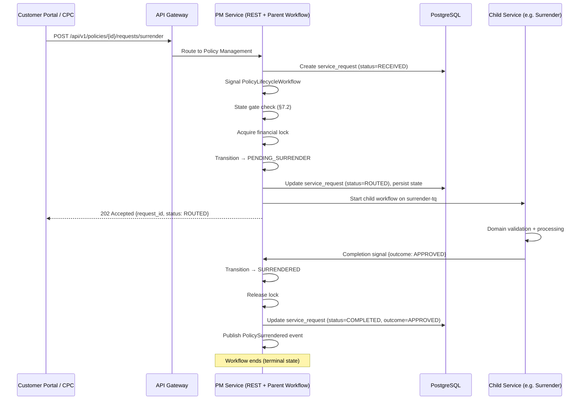

# Policy Management Orchestrator Service — Comprehensive Business Requirements Document

**Project:** India Post PLI/RPLI Insurance Management System (IMS PLI 2.0)
**Service:** Policy Management Orchestrator Microservice
**Version:** 4.1 (Corrections Patch — Lapse States, Grace Period, Configurable Timeouts, State Gate, API Centralization, Central Request Registry)
**Date:** March 2026
**Status:** All requirements clarifications closed. Ready for team sign-off and coding.
**Source Documents:** All 15 `req_*` peer microservice requirement files + 28 `srs_*` source SRS files + `req_Policy_Management_Service.md` (cross-validation) + POLI Rules clauses (i)/(ii) + domain expert confirmations

**Cross-Referenced req Files (15):**
- `req_policy_issue_requirements.md` — Policy Issue Service
- `req_Policy_Surrender_Forced_Surrender_Requirements.md` — Surrender Service
- `req_Policy_Loans_Comprehensive_Analysis_updated.md` — Policy Loans Service
- `req_installment_revival_requirements.md` — Revival Service
- `req_Death_Claim_Requirements_Analysis.md` — Death Claims Service
- `req_Maturity_Claims_Complete_Analysis.md` — Maturity Claims Service
- `req_Survival_Benefit_Requirement_Analysis.md` — Survival Benefit Service
- `req_Policy_Commutation_Analysis.md` — Commutation Service
- `req_policy-conversion-analysis.md` — Conversion Service
- `req_feelook-claims.md` — Freelook Cancellation Service
- `req_customer_service_requirements_v2.md` — Customer Service
- `req_Agent_Incentive_Commission_Producer_Management_Analysis.md` — Agent/Commission Service
- `req_Agent_Profile_Management_Requirements.md` — Agent Profile Service
- `req_Medical_Examination_Appointment_Complete_Analysis.md` — Medical Appointment Service
- `req_Policy_Product_Configuration_Office_Hierarchy_Complete_Analysis.md` — Product Config Service

**Additional SRS Files Analyzed Directly (not covered by any req file):**
- `srs_policy_PLI_Paid_Up.md` — Auto paid-up criteria, formula, product eligibility
- `srs_Accounting_PLI__RPLI_calculation_main.md` — Remission periods, void rules, minimum Rs.10,000
- `srs_policy_SRS_Collections.md` — Grace period rules, advance premium, lapse-renewal
- `srs_Non-Financial_Service_SRS_Withdrawal_of_Request.md` — SR withdrawal workflow
- `srs_policy_Policy_Assignment.md` — Assignment/Reassignment rules
- `srs_policy_Billing_Method_Change_301025rv__1_.md` — Billing method change routing
- `srs_policy_Nomination_011125rv.md` — Nomination change request
- `srs_Non-Financial_Service_SRS_NFR_Refund_of_Premium.md` — Premium refund
- `srs_policy_Customer_ID_Merging.md` — Customer ID merge/unmerge
- `srs_Claim_SRS_AML_triggers___alerts.md` — AML event enrichment
- `srs_Claim_SRS_AlertsTriggers_to_FinnetFingate.md` — FINnet/FINGate compliance
- `srs_Accounting_SRS_-_IMS_-_Enterprise_DOP_Accounting_Module_and_Suspense_Management.txt` — GL posting
---

## Table of Contents

- [1. Executive Summary](#1-executive-summary)
- [2. Business Context](#2-business-context)
- [3. Architecture Role & Bounded Context](#3-architecture-role--bounded-context)
- [4. Cross-Service State Analysis](#4-cross-service-state-analysis)
- [5. Policy State Machine (Definitive)](#5-policy-state-machine-definitive)
- [6. Functional Requirements](#6-functional-requirements)
- [7. Business Rules](#7-business-rules)
- [8. Data Requirements](#8-data-requirements)
- [9. Temporal Workflow Design](#9-temporal-workflow-design)
- [10. Integration Requirements — Signal & Response Contracts](#10-integration-requirements--signal--response-contracts)
- [11. Validation Rules](#11-validation-rules)
- [12. Non-Functional Requirements](#12-non-functional-requirements)
- [13. Assumptions and Constraints](#13-assumptions-and-constraints)
- [14. Resolved Issues (All Gaps Closed)](#14-resolved-issues-all-gaps-closed)
- [15. PM-Owned State Transitions — Lapsation, Paid-Up, Void](#15-pm-owned-state-transitions)
  - [15.5 Request Flow Architecture & API Migration](#155-request-flow-architecture--api-migration)
- [16. SRS Coverage Gap Analysis](#16-srs-coverage-gap-analysis)
- [17. Consolidated State Gate Matrix](#17-consolidated-state-gate-matrix)
- [18. Source Traceability Matrix](#18-source-traceability-matrix)
- [19. Error Code Catalog](#19-error-code-catalog)
- [20. REST API Response Schemas](#20-rest-api-response-schemas)
- [21. Activity Catalog](#21-activity-catalog)
- [22. Architecture Decision Records](#22-architecture-decision-records)
- [23. Continue-As-New Reference](#23-continue-as-new-reference)

---

## 1. Executive Summary

### 1.1 Purpose

The **Policy Management Orchestrator** is the central coordination layer for the entire PLI/RPLI IMS. It owns the **policy entity** — its canonical lifecycle state, its request queue, and the orchestration of all operations touching a policy.

Every policy gets exactly **one long-running Temporal parent workflow** (`PolicyLifecycleWorkflow`) that persists for the full policy lifetime (20–40+ years). All requests from any microservice — surrender, loan, claim, revival, commutation, conversion, freelook — are routed through this parent workflow as Temporal signals. The parent validates eligibility, acquires locks, dispatches to downstream service workflows, and reconciles state on completion.

### 1.2 Changelog

**v2** — Cross-Service Analysis (15 req files):
1. **Reconcile status codes** — Canonical mapping from each service's vocabulary.
2. **Refine state transitions** — 52 transitions from req file business rules.
3. **Detail signal payloads** — Exact signal contracts between services.
4. **Implement Temporal workflows** — Complete Go code with insurance-temporal patterns.
5. **Add eligibility matrices** — Per-operation eligibility from each req file.

**v3** — Gap Resolution + SRS Analysis (28 additional SRS files):
6. **Resolve all 12 open issues** — Every gap from v2 now has a concrete design decision.
7. **PM-owned state transitions** — Lapsation engine (remission periods), auto paid-up engine, void/forfeiture engine fully specified from POLI Rules via SRS.
8. **New state transitions** — 6 new transitions (ACTIVE_LAPSE→VOID remission, INACTIVE_LAPSE→VOID min-threshold, RPU surrender/maturity, admin void) + 2 corrected (voluntary paid-up signal source). Total: **58 transitions**.
9. **New signal channels** — 5 new (withdrawal, voluntary-paidup, conversion-reversed, admin-void, customer-id-merge). Total: **21 channels**.
10. **23 new business rules** — From SRS files not covered by any req file (remission periods, paid-up formula, pay-recovery extensions, assignment rules, SR withdrawal, AML enrichment).
11. **SRS coverage analysis** — All 28 uncovered SRS files analyzed for PM impact.

**v4** — Hybrid State Model + Cross-Validation (req_Policy_Management_Service.md):
12. **Hybrid state model** — Lifecycle states (22) + encumbrance flags (loan, assignment, AML hold, dispute). ATP removed as lifecycle state, replaced by `has_active_loan` + `assignment_type` flags. `display_status` computed field for UI dashboards.
13. **Compliance states** — SUSPENDED (AML freeze) and UNDER_INVESTIGATION (death claim investigation) added as lifecycle states.
14. **Per-service completion signals** — `operation-completed` split into typed per-service signals (`surrender-completed`, `revival-completed`, `claim-settled`, etc.) for compile-time type safety in Go.
15. **Payment dishonored signal** — New `payment-dishonored` signal handles cheque bounce / ECS failure / NACH failure with suspense accounting.
16. **Error code catalog** — 15 structured error codes with HTTP status mapping (§19).
17. **REST API response schemas** — JSON response shapes for all 8 endpoints (§20).
18. **Activity catalog** — Formal table of all Temporal activities with I/O types and timeouts (§21).
19. **Saga/compensation formalization** — Explicit saga pattern for multi-step financial operations (§6.10).
20. **Signal audit entity** — `policy_signal_log` table logging every inbound signal including rejected/duplicate (§8.9).
21. **Architecture Decision Records** — 5 ADRs documenting key design choices (§22).
22. **Continue-As-New reference** — Detailed CAN guide (what's preserved, what's reset, size-based trigger) (§23).
23. **Sequence diagram** — Mermaid sequence diagram for end-to-end orchestration flow.
24. **Acceptance criteria** — Added to all critical functional requirements.

**v4.1** — Corrections Patch (Team Review + SRS Cross-Verification):
25. **Lapse state correction (CRITICAL)** — ACTIVE_LAPSE/INACTIVE_LAPSE definitions interchanged in v4. Corrected to 3-state model: VOID_LAPSE (VL, <3yrs in remission), INACTIVE_LAPSE (IL, ≥3yrs in remission), ACTIVE_LAPSE (AL, beyond remission/terminal lapse). State machine, transitions, batch jobs, eligibility updated.
26. **Grace period correction** — Fixed from fixed days (15/30) to month-end rule for ALL premium modes. SRS evidence from domain expert note.
27. **Remission slabs retained** — All 4 SRS remission slabs confirmed with line-number evidence (srs_Accounting lines 1141-1152, 1430-1440). Remission calculation updated to use month-end grace.
28. **Configurable routing timeouts** — All downstream routing timeouts moved from hardcoded values to policy_state_config table with config key references.
29. **Lifecycle state count** — 22 → 23 (VOID_LAPSE added). Transition count — 66 → ~72.
30. **State gate separation (ARCHITECTURAL)** — PM eligibility rules (BR-PM-011 to BR-PM-023) stripped of all domain-specific business logic (product exclusions, premium year minimums, conversion windows, medical requirements, amount thresholds). PM now acts purely as a state gatekeeper. Domain validation delegated to downstream microservices, which reject via completion signal if rules fail. `checkEligibility()` renamed to `isStateEligible()`. Consolidated Eligibility Matrix (§17) restructured to show PM State Gate vs Domain Eligibility columns with clear ownership. Error codes ERR-PM-006/007/008 updated. Validation rules VR-PM-009 to VR-PM-012 simplified.
31. **API centralization (ARCHITECTURAL)** — All policy operation endpoints shifted from downstream services to PM. PM is now the **single entry point** for portals/CPC. REST endpoints expanded from 8 to 31 (17 request submission, 3 quote proxy, 5 request lifecycle, 6 policy query). Sequence diagram corrected to show Portal→PM→Downstream flow. Per-service migration map added (§15.5.2).
32. **Central request registry** — `policy_request` entity replaced with enhanced `service_request` registry (§8.3). PM generates `request_id` for all requests. Downstream services use this as FK. Status lifecycle: RECEIVED→ROUTED→IN_PROGRESS→COMPLETED. CPC inbox query served from this table. Downstream FK pattern documented.
33. **Request lifecycle endpoints** — Added GET `.../requests/{id}` (detail), PUT `.../requests/{id}/withdraw` (cancel), GET `/requests/pending` (CPC inbox), GET `/requests/pending/summary` (dashboard). Response schemas added (§20.5-20.7).
34. **Eligibility endpoint renamed** — `GET .../eligibility/{type}` renamed to `GET .../state-gate/{type}`. Response now shows state gate result only, no domain rules. Schema updated (§20.4).
35. **Pay recovery 12-month active protection (DOMAIN EXPERT CONFIRMED)** — SRS EXCEPT clause (lines 1134-1137) applies to all pay recovery policies, not just suspended employees. Rule: pay recovery policies remain ACTIVE for 12 months from first unpaid premium date even without payment. `employee_suspension_flag` replaced with `pay_recovery_protection_expiry` date field. BR-PM-074 rewritten. PAY_RECOVERY MAX(remission, 11 months) extensions removed from FR-PM-012, FR-PM-012B, BR-PM-070 — the 12-month active protection is separate from and precedes remission. SR-Paid up-7 (11-month rule) inherently satisfied by the 12-month protection. DDO integration requirement removed.
36. **POLI Rules clause (ii) evidence added** — Original POLI Rules source confirms cash policy exclusion: "Provided further that the provisions of (i) above shall not be applicable to the insurants who pay their premium/premia in cash." Added to BR-PM-074 as explicit evidence for pay recovery vs cash policy split. **All clarifications on Policy Management requirements are now closed.**
37. **Production operations section (§9.5)** — Added comprehensive §9.5 covering: terminal cooling with configurable per-state durations (30-180 days), database-first batch signaling pattern (bulk DB write → rate-limited lightweight signals → zero per-workflow DB writes), Cassandra persistence notes (ES required for advanced visibility, custom search attributes), worker fleet sizing for 3M workflows, task queue isolation, and 50M legacy policy migration strategy.
38. **Temporal workflow specifications for code generation (§10.1-10.1C)** — Complete Temporal specifications added for three critical workflow-to-workflow integrations: (a) §10.1 Parent workflow creation via `SignalWithStart` — caller code (Policy Issue), receiver code (PM), initial state construction, workflow options, search attributes, FLC timer, and migration variant. (b) §10.1B Child workflow start — `ChildWorkflowInput` standard struct, PM routing code, `ParentClosePolicy`, configurable timeouts from `policy_state_config`, routing configuration table. (c) §10.1C Completion signals — `OperationCompletedSignal` standard struct, downstream caller code using `SignalExternalWorkflow`, PM receiver code with state resolution, lock release, service_request update, and event publication. (d) §10.1C.5 Inter-service non-completion signals — Billing (premium-paid, dishonored), Compliance (AML), Loans (balance update, forced surrender trigger), Conversion (reversal), Customer Service (dispute). All use `SignalExternalWorkflow` targeting `plw-{policy_number}` with empty RunID for CAN transparency.

### 1.3 Key Statistics

| Metric | Count |
|--------|-------|
| Lifecycle States | 23 (canonical) |
| Encumbrance Flags | 4 (loan, assignment, AML hold, dispute) |
| Valid State Transitions | 72 |
| Signal Channels | 30 (typed per-service) |
| REST API Endpoints | 31 (17 request submission + 3 quote proxy + 5 request lifecycle + 6 policy query) |
| Query Handlers | 8 |
| Downstream Services | 12 |
| Functional Requirements | 51 |
| Business Rules | 95 |
| Validation Rules | 36 |
| Batch Jobs | 6 |
| Data Entities | 9 (including central `service_request` registry) |
| Error Codes | 15 |
| Request Types | 21 |
| Open Issues | 0 (all resolved) |
| SRS Files Analyzed | 15 req + 28 SRS + 1 cross-validation |

---

## 2. Business Context

### 2.1 Problem Statement

Without a central orchestrator, each microservice would need to independently validate policy state, manage concurrency, and coordinate with other services. This leads to:

- **Inconsistent state**: Surrender service thinks policy is ACTIVE while Loan service just assigned it to President of India
- **Race conditions**: Two financial requests (loan + surrender) processed simultaneously on the same policy
- **No preemption**: Death notification arrives while a surrender is in-flight; no mechanism to cancel the surrender
- **No audit**: Policy state changes scattered across 12 databases with no single source of truth

### 2.2 Proposed Solution

A dedicated Policy Management Orchestrator that:

1. Maintains the **single source of truth** for policy status via one Temporal workflow per policy
2. Implements **financial request mutual exclusion** — only one financial operation at a time per policy
3. Provides **death notification preemption** — cancels all in-flight operations immediately
4. Runs **batch state transition jobs** — daily lapsation, monthly paid-up conversion, maturity scanning, forced surrender monitoring
5. Publishes **state change events via Temporal signals** consumed by Notification, Accounting, Audit, and Agent services (no Kafka/message bus — Temporal is the sole communication backbone)

---

## 3. Architecture Role & Bounded Context

### 3.1 Service Position in Architecture

```
                    ┌──────────────────────────────────────────┐
                    │         API Gateway / Portals             │
                    └──────────────┬───────────────────────────┘
                                   │ REST
                    ┌──────────────▼───────────────────────────┐
                    │    POLICY MANAGEMENT ORCHESTRATOR         │
                    │    ┌───────────────────────────────┐     │
                    │    │  PolicyLifecycleWorkflow       │     │
                    │    │  (one per policy, Temporal)    │     │
                    │    │  ┌─────────┐ ┌────────────┐   │     │
                    │    │  │ State   │ │ Request    │   │     │
                    │    │  │ Machine │ │ Queue      │   │     │
                    │    │  └─────────┘ └────────────┘   │     │
                    │    └───────────────────────────────┘     │
                    └──┬──┬──┬──┬──┬──┬──┬──┬──┬──┬──┬────────┘
                       │  │  │  │  │  │  │  │  │  │  │
           ┌───────────┘  │  │  │  │  │  │  │  │  │  └──────────┐
           ▼              ▼  ▼  ▼  ▼  ▼  ▼  ▼  ▼  ▼             ▼
       ┌──────┐   ┌────┐ ┌──┐ ┌───┐ ┌───┐ ┌───┐ ┌────┐ ┌────┐ ┌──────┐
       │Policy│   │Sur-│ │Lo│ │Rev│ │Dea│ │Mat│ │Com- │ │Conv│ │Free- │
       │Issue │   │ren-│ │an│ │iva│ │th │ │ur-│ │muta-│ │er- │ │look  │
       │Svc   │   │der │ │  │ │l  │ │Clm│ │ity│ │tion │ │sion│ │Svc   │
       └──────┘   └────┘ └──┘ └───┘ └───┘ └───┘ └────┘ └────┘ └──────┘
                                                    ▲         ▲
                                                    │         │
                                              ┌─────┴──┐ ┌───┴──────┐
                                              │Survival│ │Non-Fin   │
                                              │Benefit │ │Service   │
                                              └────────┘ └──────────┘
```

### 3.2 Bounded Context

**OWNED by Policy Management:**
- Canonical policy status (single source of truth)
- Policy status history (append-only audit trail)
- Financial request lock (mutual exclusion)
- Request routing and eligibility validation
- Batch state transition jobs
- State change event publication

**NOT owned (owned by other services):**
- Policy creation/proposal processing → Policy Issue Service
- Surrender value calculation → Surrender Service
- Loan sanction/disbursement → Policy Loans Service
- Revival installment collection → Revival Service
- Claim adjudication/payment → Claims Service
- Premium collection/billing → Billing Service
- Commutation calculation → Commutation Service
- Conversion processing → Conversion Service
- Freelook cancellation → Freelook Service
- Customer data → Customer Service
- Agent data → Agent Service
- KYC verification → KYC Service
- Notification delivery → Notification Service
- GL posting → Accounting Service

### 3.2A Scope Definition

| In Scope | Out of Scope |
|----------|--------------|
| Policy lifecycle state management (22 states) | Customer identity CRUD (Customer Service) |
| Parent Temporal workflow orchestration per policy | KYC verification execution (KYC Service) |
| State transition validation & enforcement | Payment processing & receipt generation (Billing Service) |
| Signal aggregation from all child services | Agent commission calculation (Agent Service) |
| Cross-service saga coordination & compensation | Medical appointment scheduling (Medical Service) |
| Query handler exposure for policy state | Document storage & retrieval (Document Service) |
| Continue-As-New for long-running workflows | Claim adjudication & settlement logic (Claims Service) |
| Batch state transition engine (6 daily/monthly jobs) | Loan disbursement & interest calculation (Loans Service) |
| Financial request mutual exclusion (locking) | Surrender value calculation (Surrender Service) |
| AML/compliance state overlay (SUSPENDED) | Pre-issue proposal/underwriting workflow (Policy Issue Service) |
| Encumbrance tracking (loan, assignment flags) | Notification delivery (Notification Service) |
| Signal audit logging | GL posting & suspense management (Accounting Service) |

### 3.2B Critical Dependencies

| Dependency | Service Owner | Team | Purpose | Signal Direction |
|------------|---------------|------|---------|------------------|
| Policy Issue Service | Policy Issue | Team 4 | Initial policy creation → triggers PM workflow | PI → PM |
| Claims Service | Death/Maturity/SB | Team 3 | Claim initiation, settlement, rejection | Claims ↔ PM |
| Billing Service | Billing & Collections | Team 8 | Premium collection, grace period, payment dishonor | Billing → PM |
| Loans Service | Policy Loans | Team 9 | Loan sanction, repayment, forced surrender trigger | Loans ↔ PM |
| Surrender Service | Surrender | Team 9 | Voluntary/forced surrender processing | Surrender ↔ PM |
| Revival Service | Revival | Team 9 | Installment revival processing | Revival ↔ PM |
| Compliance Service | AML/KYC | Team 7 | AML flag raise/clear, compliance hold | Compliance → PM |
| Assignment Service | Assignment | Team 9 | Policy assignment/reassignment | Assignment ↔ PM |
| Conversion Service | Conversion | Team 9 | Product conversion execution/reversal | Conversion ↔ PM |
| Agent Service | Agent/Commission | Team 1 | Commission clawback on FLC, lapse | PM → Agent |
| Notification Service | Notifications | Team 6 | SMS/Email/WhatsApp on state changes | PM → Notification |
| Accounting Service | GL Posting | Team 5 | GL entries on financial state changes | PM → Accounting |

### 3.2C End-to-End Orchestration Sequence



### 3.3 Communication Patterns

| Pattern | Used For |
|---------|----------|
| REST API (inbound) | All policy requests from Portals/CPC routed to PM as single entry point |
| Temporal Signal (inbound) | Billing events (premium-paid, premium-missed), system events |
| Temporal Child Workflow | PM routing requests to downstream services |
| Temporal Signal (completion) | Downstream services reporting outcomes back to PM |
| Temporal Query | State inspection without side effects |
| Temporal Activity | DB operations, notifications, accounting |
| REST API | External read-only queries (portals, reports) |

---

## 4. Cross-Service State Analysis

This section documents how each req file's status codes map to Policy Management's canonical status.

### 4.1 Status Code Reconciliation Matrix

Each downstream service uses its own status vocabulary. Policy Management defines the **canonical** mapping.

| Canonical PM Status | SRS Code | Policy Issue | Surrender | Loans | Revival | Claims | Commutation | Conversion | Freelook |
|---|---|---|---|---|---|---|---|---|---|
| `FREE_LOOK_ACTIVE` | FLA | FREE_LOOK_ACTIVE | — | — | — | — | — | — | Active (freelook) |
| `ACTIVE` | AP | ACTIVE (terminal for PI) | ACTIVE | ACTIVE, IN_FORCE | AP | ACTIVE, IN_FORCE | AP (Paid) | AP | Active |
| `ACTIVE_LAPSE` | AL | — | — | — | AL (eligible) | — | — | AL (push-back) | — |
| `INACTIVE_LAPSE` | IL / VL | — | VOID_LAPSE, INVALID_LAPSE | — | — | — | — | IL, VL | — |
| `PAID_UP` | AU / PU | — | PAIDUP | — | — | — | — | — | — |
| `ASSIGNED_TO_PRESIDENT` | ATP | — | — | ASSIGNED_TO_PRESIDENT | — | — | — | — | — |
| `PENDING_AUTO_SURRENDER` | PAS | — | PENDING_AUTO_SURRENDER | — | — | — | — | — | — |
| `PENDING_SURRENDER` | PWS | — | PENDING_SURRENDER | — | — | — | — | — | — |
| `PENDING_MATURITY` | PM | — | — | — | — | — | — | — | — |
| `REVIVAL_PENDING` | RP | — | — | — | REVIVAL_PENDING | — | — | — | — |
| `DEATH_CLAIM_INTIMATED` | DCI | — | — | — | — | REGISTERED | — | — | — |
| `DEATH_CLAIM_SETTLED` | DCS | — | — | — | — | PAID | — | — | — |
| `SURRENDERED` | TS | — | TERMINATED_SURRENDER | — | — | — | — | — | — |
| `TERMINATED_AUTO_SURRENDER` | TAS | — | TERMINATED_AUTO_SURRENDER | — | — | — | — | — | — |
| `MATURED` | MT | — | — | — | — | PAID (maturity) | — | — | — |
| `FLC_CANCELLED` | FLC | FLC_CANCELLED | — | — | — | — | — | — | Cancelled-Freelook |
| `CANCELLED_DEATH` | CD | CANCELLED_DEATH | — | — | Terminated | — | — | — | — |
| `VOID` | VD | — | — | — | — | — | — | — | — |
| `CONVERTED` | CVT | — | — | — | — | — | — | Terminated due to Conversion | — |
| `REDUCED_PAID_UP` | RPU | — | REDUCED_PAID_UP (AU) | — | — | — | — | — | — |

### 4.2 Cross-Service State Transition Triggers

Compiled from all 15 req files — these are the events that each downstream service communicates back to Policy Management.

| Source Service | Event / Completion Signal | PM State Before | PM State After | Source req File | Key Business Rule |
|---|---|---|---|---|---|
| **Policy Issue** | PolicyCreated (FLC started) | — | `FREE_LOOK_ACTIVE` | req_policy_issue (line 884) | BR-POL-015 |
| **Policy Issue** | FLC Expired (no cancellation) | `FREE_LOOK_ACTIVE` | `ACTIVE` | req_policy_issue (line 884) | BR-POL-015 |
| **Policy Issue** | FLC Cancelled | `FREE_LOOK_ACTIVE` | `FLC_CANCELLED` | req_policy_issue (line 885) | BR-POL-015 |
| **Policy Issue** | Death during proposal | any pre-issue | `CANCELLED_DEATH` | req_policy_issue (line 886) | BR-POL-026 |
| **Billing Service** | Premium paid (within remission) | `VOID_LAPSE` | `ACTIVE` | srs_Accounting, srs_Collections | v4.1 corrected |
| **Billing Service** | Premium paid (within remission) | `INACTIVE_LAPSE` | `ACTIVE` | srs_Accounting, srs_Collections | v4.1 corrected |
| **Billing Service** | Grace period expired (policy <3yrs) | `ACTIVE` | `VOID_LAPSE` | srs_Accounting, grace rules | v4.1 corrected |
| **Billing Service** | Grace period expired (policy ≥3yrs) | `ACTIVE` | `INACTIVE_LAPSE` | srs_Accounting, grace rules | v4.1 corrected |
| **Billing Service** | Grace expired (policy <6mo) | `ACTIVE` | `VOID` | srs_Accounting line 1144 | No remission |
| **Batch: Remission Expiry** | Remission expired (<36mo policy) | `VOID_LAPSE` | `VOID` | srs_Accounting line 1131 | v4.1 corrected |
| **Batch: Remission Expiry** | Remission expired (≥36mo policy) | `INACTIVE_LAPSE` | `ACTIVE_LAPSE` | srs_Accounting line 1158 | v4.1 corrected |
| **Batch: Auto Paid-Up** | PU value ≥ Rs.10K, ≥36mo premiums | `ACTIVE_LAPSE` | `PAID_UP` | srs_PLI_Paid_Up | v4.1 corrected |
| **Batch: Auto Paid-Up** | PU value < Rs.10K | `ACTIVE_LAPSE` | `VOID` | srs_Accounting line 1456 | v4.1 corrected |
| **Batch: Maturity** | 90 days before maturity | `ACTIVE` | `PENDING_MATURITY` | req_Maturity_Claims (line 194) | BR-CLM-MC-005 |
| **Maturity Claims** | Claim settled | `PENDING_MATURITY` | `MATURED` | req_Maturity_Claims (line 43) | FR-CLM-MC-008 |
| **Surrender** | Voluntary surrender approved | `ACTIVE`/`ACTIVE_LAPSE`/`INACTIVE_LAPSE`/`PAID_UP` | `SURRENDERED` | req_Surrender (line 127) | BR-SUR-001 |
| **Surrender** | Forced surrender approved (net < limit) | `PENDING_AUTO_SURRENDER` | `TERMINATED_AUTO_SURRENDER` | req_Surrender (line 535) | BR-FS-006 |
| **Surrender** | Forced surrender approved (net ≥ limit) | `PENDING_AUTO_SURRENDER` | `REDUCED_PAID_UP` | req_Surrender (line 532) | BR-FS-006 |
| **Surrender** | Forced surrender rejected | `PENDING_AUTO_SURRENDER` | `previous_status` (AP/IL/AL) | req_Surrender (line 558) | BR-FS-018 |
| **Surrender** | Payment in PAS window | `PENDING_AUTO_SURRENDER` | `ACTIVE` | req_Surrender (line 603) | BR-FS-009 |
| **Policy Loans** | Loan sanctioned | `ACTIVE` | `ASSIGNED_TO_PRESIDENT` | req_Loans (line 293) | BR-POL-LOAN-015 |
| **Policy Loans** | Loan fully repaid | `ASSIGNED_TO_PRESIDENT` | `ACTIVE` | req_Loans (line 1491) | BR-POL-LOAN-020 |
| **Policy Loans** | 3 consecutive defaults | `ASSIGNED_TO_PRESIDENT` | `PENDING_AUTO_SURRENDER` | req_Loans (line 353) | BR-POL-LOAN-020 |
| **Revival** | Revival approved, first installment paid | `VL/IL/AL` | `ACTIVE` | req_revival (status table) | BR-IR-002 (v4.1) |
| **Revival** | Revival installment default | `ACTIVE` | `previous_lapse_status` | req_revival (status table) | BR-IR (v4.1 revert) |
| **Revival** | Receipt cancelled (first installment) | `ACTIVE` | `previous_lapse_status` | req_revival (status table) | BR-IR (v4.1 revert) |
| **Revival** | Death claim indexed during revival | any | `CANCELLED_DEATH` | req_revival (status table) | BR-IR status transitions |
| **Death Claims** | Death notification received | any non-terminal | `DEATH_CLAIM_INTIMATED` | req_Death_Claim (line 1168) | WF-CLM-DC-001 |
| **Death Claims** | Claim settled | `DEATH_CLAIM_INTIMATED` | `DEATH_CLAIM_SETTLED` | req_Death_Claim (line 1178) | WF-CLM-DC-001 |
| **Death Claims** | Claim rejected | `DEATH_CLAIM_INTIMATED` | `previous_status` | req_Death_Claim (line 1176) | Rejection handling |
| **Survival Benefit** | SB paid (not final) | `ACTIVE` | `ACTIVE` (metadata update) | req_Survival_Benefit (line 380) | BR-SB-012 |
| **Commutation** | Commutation approved | `ACTIVE` | `ACTIVE` (metadata: SA/premium reduced) | req_Commutation (line 594) | BR-COM-018 |
| **Conversion** | Conversion executed | `ACTIVE` | `CONVERTED` (old), new policy `ACTIVE` | req_Conversion (line 102) | BR-JLA-007 |
| **Conversion** | Cheque bounce reversal | `CONVERTED` | `INACTIVE` (old), `CANCELLED` (new) | req_Conversion (line 168) | BR-CHQ-001 |
| **Freelook** | FLC expiry | `FREE_LOOK_ACTIVE` | `ACTIVE` | req_feelook (line 254) | BR-PS-001 |
| **Freelook** | FLC cancellation approved | `FREE_LOOK_ACTIVE` | `FLC_CANCELLED` | req_feelook (line 254) | BR-PS-001 |
| **Batch: Forced Surrender** | Loan ratio ≥ 95% GSV | `ASSIGNED_TO_PRESIDENT` | `PENDING_AUTO_SURRENDER` | req_Surrender (line 436) | BR-FS-003 |
| **Batch: Remission Expiry** | Remission period exhausted (<36mo) | `VOID_LAPSE` | `VOID` | srs_Accounting (line 1131) | BR-PM-071 (v4.1) |
| **Batch: Remission Expiry** | Remission period exhausted (≥36mo) | `INACTIVE_LAPSE` | `ACTIVE_LAPSE` | srs_Accounting (line 1158) | BR-PM-070 (v4.1) |
| **Batch: Auto Paid-Up** | PU value < Rs.10,000 threshold | `ACTIVE_LAPSE` | `VOID` | srs_Accounting (line 1456) | BR-PM-061 (v4.1) |
| **Customer Request** | Voluntary paid-up request | `ACTIVE` / `ACTIVE_LAPSE` | `PAID_UP` | srs_PLI_Paid_Up SR-3 | BR-PM-060 |
| **Admin** | Administrative void | Any non-terminal | `VOID` | srs_Accounting | BR-PM-073 |
| **Conversion Service** | Cheque bounce reversal (old policy) | `CONVERTED` | `INACTIVE_LAPSE` | req_Conversion (line 168) | BR-CHQ-001 |

---

## 5. Policy State Machine (Definitive)

### 5.1 Complete State Diagram

Derived from cross-referencing all 15 req files + 28 SRS files:

```mermaid
stateDiagram-v2
    [*] --> FREE_LOOK_ACTIVE: Policy issued (signal from Policy Issue)

    %% === FREE LOOK PHASE ===
    FREE_LOOK_ACTIVE --> ACTIVE: FLC expired (timer)
    FREE_LOOK_ACTIVE --> FLC_CANCELLED: Freelook cancellation
    FREE_LOOK_ACTIVE --> CANCELLED_DEATH: Death during FLC

    %% === ACTIVE PREMIUM PHASE ===
    ACTIVE --> VOID_LAPSE: Grace expired (policy age <3yrs)
    ACTIVE --> INACTIVE_LAPSE: Grace expired (policy age ≥3yrs)
    ACTIVE --> VOID: Grace expired (policy age <6mo, no remission)
    ACTIVE --> PENDING_SURRENDER: Surrender accepted
    ACTIVE --> PENDING_MATURITY: Maturity approaching (batch, 90d)
    ACTIVE --> PENDING_AUTO_SURRENDER: Forced surrender trigger (loan ratio)
    ACTIVE --> DEATH_CLAIM_INTIMATED: Death notification
    ACTIVE --> PAID_UP: Voluntary paid-up
    ACTIVE --> CONVERTED: Conversion executed (old policy)
    ACTIVE --> SUSPENDED: AML flag raised

    %% === VOID LAPSE PHASE (policy <3yrs, in remission) ===
    VOID_LAPSE --> ACTIVE: Premium paid within remission
    VOID_LAPSE --> VOID: Remission expired (all money forfeited)
    VOID_LAPSE --> DEATH_CLAIM_INTIMATED: Death notification
    VOID_LAPSE --> PENDING_SURRENDER: Surrender accepted
    VOID_LAPSE --> SUSPENDED: AML flag raised

    %% === INACTIVE LAPSE PHASE (policy ≥3yrs, within 12-month remission) ===
    INACTIVE_LAPSE --> ACTIVE: Premium paid within remission
    INACTIVE_LAPSE --> ACTIVE_LAPSE: Remission expired (12 months from first unpaid)
    INACTIVE_LAPSE --> DEATH_CLAIM_INTIMATED: Death notification
    INACTIVE_LAPSE --> PENDING_SURRENDER: Surrender accepted
    INACTIVE_LAPSE --> REVIVAL_PENDING: Revival accepted
    INACTIVE_LAPSE --> SUSPENDED: AML flag raised

    %% === ACTIVE LAPSE PHASE (beyond remission, permanent lapse) ===
    ACTIVE_LAPSE --> PAID_UP: Auto paid-up batch (PU value ≥ Rs.10K, ≥36mo premiums)
    ACTIVE_LAPSE --> VOID: Auto paid-up batch (PU value < Rs.10K)
    ACTIVE_LAPSE --> REVIVAL_PENDING: Revival accepted
    ACTIVE_LAPSE --> PENDING_SURRENDER: Surrender accepted
    ACTIVE_LAPSE --> DEATH_CLAIM_INTIMATED: Death notification
    ACTIVE_LAPSE --> PAID_UP: Voluntary paid-up (≥36mo premiums)
    ACTIVE_LAPSE --> SUSPENDED: AML flag raised

    %% === REDUCED/PAID-UP PHASE ===
    PAID_UP --> PENDING_SURRENDER: Surrender accepted
    PAID_UP --> DEATH_CLAIM_INTIMATED: Death notification
    PAID_UP --> SUSPENDED: AML flag raised
    REDUCED_PAID_UP --> PENDING_SURRENDER: Surrender accepted
    REDUCED_PAID_UP --> PENDING_MATURITY: Maturity approaching (batch)
    REDUCED_PAID_UP --> DEATH_CLAIM_INTIMATED: Death notification
    REDUCED_PAID_UP --> SUSPENDED: AML flag raised

    %% === REVIVAL PHASE ===
    REVIVAL_PENDING --> ACTIVE: Revival completed
    REVIVAL_PENDING --> ACTIVE_LAPSE: Revival default/cancelled
    REVIVAL_PENDING --> DEATH_CLAIM_INTIMATED: Death notification
    REVIVAL_PENDING --> SUSPENDED: AML flag raised

    %% === FORCED SURRENDER PHASE ===
    PENDING_AUTO_SURRENDER --> TERMINATED_AUTO_SURRENDER: FS approved (net < limit)
    PENDING_AUTO_SURRENDER --> REDUCED_PAID_UP: FS approved (net ≥ limit)
    PENDING_AUTO_SURRENDER --> previous_status: FS rejected (revert)
    PENDING_AUTO_SURRENDER --> ACTIVE: Payment in 30-day window
    PENDING_AUTO_SURRENDER --> DEATH_CLAIM_INTIMATED: Death notification

    %% === VOLUNTARY SURRENDER PHASE ===
    PENDING_SURRENDER --> SURRENDERED: Surrender approved
    PENDING_SURRENDER --> previous_status: Surrender rejected/withdrawn
    PENDING_SURRENDER --> DEATH_CLAIM_INTIMATED: Death overrides

    %% === MATURITY PHASE ===
    PENDING_MATURITY --> MATURED: Maturity settled
    PENDING_MATURITY --> DEATH_CLAIM_INTIMATED: Death before maturity

    %% === DEATH CLAIM PHASE ===
    DEATH_CLAIM_INTIMATED --> DEATH_CLAIM_SETTLED: Claim settled
    DEATH_CLAIM_INTIMATED --> DEATH_UNDER_INVESTIGATION: Investigation started
    DEATH_CLAIM_INTIMATED --> previous_status: Claim rejected (revert with context)
    DEATH_UNDER_INVESTIGATION --> DEATH_CLAIM_SETTLED: Investigation concluded (approved)
    DEATH_UNDER_INVESTIGATION --> previous_status: Investigation concluded (rejected)

    %% === COMPLIANCE OVERLAY ===
    SUSPENDED --> previous_status: AML flag cleared (revert)
    SUSPENDED --> DEATH_CLAIM_INTIMATED: Death overrides AML suspension

    %% === TERMINAL STATES ===
    FLC_CANCELLED --> [*]
    SURRENDERED --> [*]
    MATURED --> [*]
    DEATH_CLAIM_SETTLED --> [*]
    TERMINATED_AUTO_SURRENDER --> [*]
    VOID --> [*]
    CANCELLED_DEATH --> [*]
    CONVERTED --> [*]
```



### 5.2 Hybrid State Model — Lifecycle States + Encumbrance Flags

Policy state is modeled as TWO tiers:

**Tier 1: Lifecycle State** (mutually exclusive, single value — drives the state machine)
**Tier 2: Encumbrance Flags** (can coexist, orthogonal to lifecycle — tracked as metadata)

This avoids state explosion from compound states (e.g., AP_LOAN, AP_LIEN, AP_LOAN_LIEN × each lifecycle phase) while providing full visibility via `display_status`.

#### 5.2.1 Tier 1 — Lifecycle States (23 canonical)

| Code | Canonical Name | SRS Alias | Category | Description | req Source |
|------|----------------|-----------|----------|-------------|-----------|
| FLA | `FREE_LOOK_ACTIVE` | FLA | Active | Policy in free look period, can be cancelled | req_policy_issue, req_feelook |
| AP | `ACTIVE` | AP, In-Force | Active | Policy in force, premiums current | All req files |
| VL | `VOID_LAPSE` | VL | Lapsed | Policy age <3yrs, premium unpaid beyond grace, within remission window. Payment restores ACTIVE, expiry → VOID. | srs_Accounting (v4.1 correction) |
| IL | `INACTIVE_LAPSE` | IL | Lapsed | Policy age ≥3yrs, within 12-month remission from first unpaid date. Payment restores ACTIVE, expiry → AL. | srs_Accounting (v4.1 correction) |
| AL | `ACTIVE_LAPSE` | AL, In Force-Arrear | Lapsed | Beyond remission (either age bracket). Eligible for paid-up, surrender, revival. Permanent lapse state. | req_revival, req_surrender, srs_Accounting |
| PU | `PAID_UP` | AU, PAIDUP | Reduced | Premiums stopped, reduced SA applies | req_surrender |
| RPU | `REDUCED_PAID_UP` | AU (forced) | Reduced | Converted from forced surrender (net ≥ limit) | req_surrender (line 532) |
| PAS | `PENDING_AUTO_SURRENDER` | PAS | Pending | Forced surrender triggered, 30-day payment window | req_surrender (line 436) |
| PWS | `PENDING_SURRENDER` | PWS | Pending | Voluntary surrender request in progress | req_surrender (line 125) |
| PM | `PENDING_MATURITY` | PM | Pending | Maturity approaching, claim initiated | req_maturity (line 194) |
| RP | `REVIVAL_PENDING` | RP | Pending | Revival request accepted, installments in progress | req_revival |
| DCI | `DEATH_CLAIM_INTIMATED` | DCI | Claim | Death reported, claim under processing | req_death_claim (line 1168) |
| DUI | `DEATH_UNDER_INVESTIGATION` | DUI | Claim | Death claim under investigation (suspicious, murder clause, high SA, policy < 3yr) | req_death_claim, gap analysis |
| SUS | `SUSPENDED` | SUS | Compliance | AML/CFT flag raised — ALL financial operations frozen until cleared | PMLA, IRDAI AML guidelines |
| DCS | `DEATH_CLAIM_SETTLED` | DCS | Terminal | Death claim paid | req_death_claim (line 1178) |
| TS | `SURRENDERED` | TS | Terminal | Voluntarily surrendered | req_surrender (line 127) |
| TAS | `TERMINATED_AUTO_SURRENDER` | TAS | Terminal | Forced surrender completed | req_surrender (line 535) |
| MT | `MATURED` | MT | Terminal | Maturity claim settled | req_maturity |
| FLC | `FLC_CANCELLED` | FLC | Terminal | Freelook cancellation | req_policy_issue, req_feelook |
| CD | `CANCELLED_DEATH` | CD | Terminal | Death during proposal/pre-issue | req_policy_issue (line 886) |
| VD | `VOID` | VD | Terminal | Administrative voiding | System admin |
| CVT | `CONVERTED` | CVT | Terminal | Old policy terminated due to conversion | req_conversion (line 102) |

> **Note**: ATP (ASSIGNED_TO_PRESIDENT) is removed as a lifecycle state. Loan and assignment are now encumbrance flags (Tier 2). See ADR-002 in §22.

#### 5.2.2 Tier 2 — Encumbrance Flags (tracked on policy entity)

| Flag | Type | Description | Set By | Cleared By |
|------|------|-------------|--------|------------|
| `has_active_loan` | BOOLEAN | Policy has an active loan; assigned to President of India | Loans Service (loan-sanctioned signal) | Loans Service (loan-repaid-full signal) |
| `assignment_type` | ENUM (NONE/ABSOLUTE/CONDITIONAL) | Policy assignment status | Assignment Service | Assignment revocation |
| `aml_hold` | BOOLEAN | AML alert active; advisory hold on financial transactions | Compliance Service (aml-flag-raised) | Compliance Service (aml-flag-cleared) |
| `dispute_flag` | BOOLEAN | Policyholder dispute registered; informational | CPC / Ombudsman | Dispute resolution |

#### 5.2.3 Display Status (computed)

The `display_status` is a computed field for UI/dashboard presentation. It combines lifecycle state with active encumbrances:

```
func computeDisplayStatus(lifecycle string, loan bool, assignment string, amlHold bool) string {
    base := lifecycle
    if loan {
        base += "_LOAN"
    }
    if assignment != "NONE" && assignment != "" {
        base += "_LIEN"
    }
    if amlHold {
        base += "_AML_HOLD"
    }
    return base
}

// Examples:
// ACTIVE + loan=true + assignment=ABSOLUTE → "ACTIVE_LOAN_LIEN"
// ACTIVE_LAPSE + loan=true               → "ACTIVE_LAPSE_LOAN"
// ACTIVE + aml_hold=true                  → "ACTIVE_AML_HOLD"
// PAID_UP + loan=false + assignment=NONE  → "PAID_UP"
```

#### 5.2.4 SUSPENDED State — Compliance Overlay

SUSPENDED is a lifecycle state (not an encumbrance) because it fundamentally blocks ALL workflow processing:

```
ON aml-flag-raised signal:
  IF current_status NOT IN TERMINAL_STATES:
    store previous_status_before_suspension = current_status
    transition → SUSPENDED
    set aml_hold = true
    block ALL financial AND non-financial operations
    only allow: get-policy-status query, death-notification (death overrides everything)

ON aml-flag-cleared signal:
  IF current_status == SUSPENDED:
    transition → previous_status_before_suspension
    set aml_hold = false
    resume normal signal processing
```

> **Design Decision**: SUSPENDED is a STATE (not just a flag) because it must block the workflow event loop. An `aml_hold` flag alone cannot prevent new signals from being processed. When SUSPENDED, the workflow only accepts `aml-flag-cleared` and `death-notification` signals.

> **DISPUTE is a FLAG (not a state)** because disputes run parallel to normal operations. A policyholder disputing a premium calculation doesn't freeze the policy — premiums are still due, claims still payable. The `dispute_flag` is advisory for CPC operators and ombudsman integration.

### 5.3 Terminal States

Terminal states reject all new financial and non-financial requests:

```
TERMINAL_STATES = {SURRENDERED, TERMINATED_AUTO_SURRENDER, MATURED, 
                   DEATH_CLAIM_SETTLED, FLC_CANCELLED, CANCELLED_DEATH, 
                   VOID, CONVERTED}

BLOCKED_STATES = TERMINAL_STATES ∪ {SUSPENDED}
// SUSPENDED blocks everything except aml-flag-cleared and death-notification
```

### 5.4 Complete Transition Table (66 Transitions)

| # | From | Event | To | Condition | Triggered By | req Source |
|---|------|-------|----|-----------|-------------|-----------|
| 1 | — | policy-created | FREE_LOOK_ACTIVE | Policy Issue workflow completes | Policy Issue | req_policy_issue:884 |
| 2 | FREE_LOOK_ACTIVE | flc-expired | ACTIVE | Timer expired, no cancellation | Freelook Service | req_feelook:254 |
| 3 | FREE_LOOK_ACTIVE | flc-approved | FLC_CANCELLED | Cancellation processed | Freelook Service | req_feelook:254 |
| 4 | FREE_LOOK_ACTIVE | death-notification | CANCELLED_DEATH | Death signal with customer match | Any / External | req_policy_issue:886 |
| 5 | ACTIVE | grace-expired (<3yrs) | VOID_LAPSE | Batch: last_day_of_month(due_date) < today, policy_life <36mo | Batch: Lapsation | srs_Accounting (v4.1) |
| 5a | ACTIVE | grace-expired (≥3yrs) | INACTIVE_LAPSE | Batch: last_day_of_month(due_date) < today, policy_life ≥36mo | Batch: Lapsation | srs_Accounting (v4.1) |
| 5b | ACTIVE | grace-expired (<6mo) | VOID | Batch: policy_life <6mo AND has_unpaid_premium | Batch: Lapsation | srs_Accounting:1144 (v4.1) |
| 6 | ACTIVE | loan-sanctioned | ASSIGNED_TO_PRESIDENT | Loan workflow approved | Policy Loans | req_loans:293 |
| 7 | ACTIVE | maturity-approaching | PENDING_MATURITY | Batch: maturity_date - 90 days | Batch: Maturity | req_maturity:194 |
| 8 | ACTIVE | surrender-accepted | PENDING_SURRENDER | Surrender eligibility passed | Surrender Service | req_surrender:125 |
| 9 | ACTIVE | death-notification | DEATH_CLAIM_INTIMATED | Death signal received | Death Claims | req_death_claim:1168 |
| 10 | ACTIVE | conversion-executed | CONVERTED | Conversion effective (old policy) | Conversion Service | req_conversion:102 |
| 11 | ACTIVE | commutation-approved | ACTIVE | SA/premium metadata updated | Commutation Service | req_commutation:594 |
| 12 | ACTIVE | sb-paid | ACTIVE | SB metadata updated (not final) | Survival Benefit | req_survival:380 |
| 13 | VOID_LAPSE | premium-paid | ACTIVE | Payment received within remission (policy <3yrs) | Billing Service | srs_Accounting (v4.1) |
| 13a | INACTIVE_LAPSE | premium-paid | ACTIVE | Payment received within remission (policy ≥3yrs) | Billing Service | srs_Accounting (v4.1) |
| 14 | VOID_LAPSE | remission-expired | VOID | Remission period exhausted (<36mo policy) | **Batch: Remission (PM)** | srs_Accounting:1131 (v4.1) |
| 14a | INACTIVE_LAPSE | remission-expired | ACTIVE_LAPSE | Remission period exhausted (≥36mo, 12 months from first unpaid) | **Batch: Remission (PM)** | srs_Accounting:1158 (v4.1) |
| 15 | VOID_LAPSE | surrender-accepted | PENDING_SURRENDER | Surrender eligibility passed | Surrender Service | req_surrender:185 |
| 15a | INACTIVE_LAPSE | surrender-accepted | PENDING_SURRENDER | Surrender eligibility passed | Surrender Service | req_surrender:185 |
| 15b | ACTIVE_LAPSE | surrender-accepted | PENDING_SURRENDER | Surrender from permanent lapse | Surrender Service | req_surrender:185 |
| 16 | INACTIVE_LAPSE | revival-accepted | REVIVAL_PENDING | Revival request approved (within remission) | Revival Service | req_revival:62 |
| 16a | ACTIVE_LAPSE | revival-accepted | REVIVAL_PENDING | Revival from permanent lapse (within 5yr window) | Revival Service | req_revival:62 |
| 17 | VOID_LAPSE | death-notification | DEATH_CLAIM_INTIMATED | Death signal received | Death Claims | req_death_claim:1168 |
| 17a | INACTIVE_LAPSE | death-notification | DEATH_CLAIM_INTIMATED | Death signal received | Death Claims | req_death_claim:1168 |
| 17b | ACTIVE_LAPSE | death-notification | DEATH_CLAIM_INTIMATED | Death signal received | Death Claims | req_death_claim:1168 |
| 18 | ACTIVE_LAPSE | paid-up-conversion | PAID_UP | Batch: ≥36mo premiums paid, PU value ≥ Rs.10K | Batch: Paid-Up | srs_PLI_Paid_Up (v4.1) |
| 18a | ACTIVE_LAPSE | paid-up-below-threshold | VOID | Batch: PU value < Rs.10K | Batch: Paid-Up | srs_Accounting:1456 (v4.1) |
| 19 | ACTIVE_LAPSE | voluntary-paidup | PAID_UP | Voluntary paid-up request (≥36mo premiums, ≥3yr life) | Customer/CPC | srs_PLI_Paid_Up (v4.1) |
| 22 | REVIVAL_PENDING | revival-completed | ACTIVE | All installments paid | Revival Service | req_revival:status |
| 23 | REVIVAL_PENDING | revival-default | ACTIVE_LAPSE | Installment default | Revival Service | req_revival:status |
| 24 | REVIVAL_PENDING | revival-first-cancelled | ACTIVE_LAPSE | First receipt cancelled | Revival Service | req_revival:status |
| 25 | REVIVAL_PENDING | death-notification | DEATH_CLAIM_INTIMATED | Death during revival | Revival Service | req_revival:status |
| 26 | ASSIGNED_TO_PRESIDENT | loan-repaid | ACTIVE | Full loan repayment | Policy Loans | req_loans:1491 |
| 27 | ASSIGNED_TO_PRESIDENT | forced-surrender-trigger | PENDING_AUTO_SURRENDER | Loan ratio ≥ threshold | Batch / Loans | req_loans:353 |
| 28 | ASSIGNED_TO_PRESIDENT | surrender-accepted | PENDING_SURRENDER | Voluntary surrender | Surrender Service | req_surrender:185 |
| 29 | ASSIGNED_TO_PRESIDENT | death-notification | DEATH_CLAIM_INTIMATED | Death signal | Death Claims | req_death_claim |
| 30 | PENDING_AUTO_SURRENDER | fs-approved-terminate | TERMINATED_AUTO_SURRENDER | Net amount < prescribed limit | Surrender Service | req_surrender:535 |
| 31 | PENDING_AUTO_SURRENDER | fs-approved-paidup | REDUCED_PAID_UP | Net amount ≥ prescribed limit | Surrender Service | req_surrender:532 |
| 32 | PENDING_AUTO_SURRENDER | fs-rejected | previous_status | Revert to AP/IL/AL | Surrender Service | req_surrender:558 |
| 33 | PENDING_AUTO_SURRENDER | payment-in-window | ACTIVE | Payment within 30-day PAS window | Billing Service | req_surrender:603 |
| 34 | PENDING_AUTO_SURRENDER | death-notification | DEATH_CLAIM_INTIMATED | Death signal | Death Claims | req_death_claim |
| 35 | PENDING_SURRENDER | surrender-approved | SURRENDERED | Surrender processed | Surrender Service | req_surrender:127 |
| 36 | PENDING_SURRENDER | surrender-rejected | ACTIVE | Surrender rejected/withdrawn | Surrender Service | req_surrender |
| 37 | PENDING_SURRENDER | death-notification | DEATH_CLAIM_INTIMATED | Death overrides surrender | Death Claims | req_death_claim |
| 38 | PENDING_MATURITY | maturity-settled | MATURED | Maturity claim paid | Maturity Claims | req_maturity:43 |
| 39 | PENDING_MATURITY | death-notification | DEATH_CLAIM_INTIMATED | Death before maturity | Death Claims | req_death_claim |
| 40 | PAID_UP | surrender-accepted | PENDING_SURRENDER | Surrender on paid-up | Surrender Service | req_surrender:185 |
| 41 | PAID_UP | death-notification | DEATH_CLAIM_INTIMATED | Death signal | Death Claims | req_death_claim |
| 42 | REDUCED_PAID_UP | death-notification | DEATH_CLAIM_INTIMATED | Death signal | Death Claims | req_death_claim |
| 43 | DEATH_CLAIM_INTIMATED | claim-settled | DEATH_CLAIM_SETTLED | Claim paid | Death Claims | req_death_claim:1178 |
| 44 | DEATH_CLAIM_INTIMATED | claim-rejected | previous_status | Claim rejected, revert | Death Claims | req_death_claim:1176 |
| 45 | ACTIVE | billing-freq-changed | ACTIVE | Metadata: premium_mode updated | Billing Service | SRS |
| 46 | ACTIVE | dob-corrected | ACTIVE | Metadata: DOB, age, premium updated | NFR Service | SRS |
| 47 | ACTIVE | nomination-updated | ACTIVE | Metadata: nominee details | NFR Service | SRS |
| 48 | ACTIVE | address-changed | ACTIVE | Metadata: address | NFR Service | SRS |
| 49 | ACTIVE | agent-changed | ACTIVE | Metadata: agent_id | NFR Service | SRS |
| 50 | ACTIVE | voluntary-paidup | PAID_UP | Voluntary paid-up: 36+ premiums, 3+ years | **Customer Signal (PM)** | srs_PLI_Paid_Up:SR-3 |
| 51 | ACTIVE_LAPSE | voluntary-paidup | PAID_UP | Voluntary paid-up from lapse: 36+ premiums, 3+ years | **Customer Signal (PM)** | srs_PLI_Paid_Up:SR-3 |
| 52 | CONVERTED | cheque-bounce-reversal | INACTIVE_LAPSE | Conversion reversed | Conversion Service | req_conversion:168 |
| 53 | ACTIVE_LAPSE | remission-expired | VOID | Policy life < 36 months, remission exhausted | **Batch: Remission (PM)** | srs_Accounting:1131 |
| 54 | ACTIVE_LAPSE | remission-expired-immediate | VOID | Policy life < 6 months, no remission | **Batch: Remission (PM)** | srs_Accounting:1144 |
| 55 | INACTIVE_LAPSE | auto-paidup-below-min | VOID | Auto paid-up value < Rs. 10,000 | **Batch: Auto-PU (PM)** | srs_Accounting:1456 |
| 56 | REDUCED_PAID_UP | surrender-accepted | PENDING_SURRENDER | Voluntary surrender on RPU | Surrender Service | Logical (RPU surrenderable) |
| 57 | REDUCED_PAID_UP | maturity-approaching | PENDING_MATURITY | 90 days before maturity (RPU) | **Batch: Maturity (PM)** | Logical (RPU matures) |
| 58 | Any non-terminal | admin-void | VOID | Administrative voiding (authorized) | **Admin Signal** | srs_Accounting |
| 59 | Any non-terminal (excl. SUSPENDED) | aml-flag-raised | SUSPENDED | AML/CFT alert on policy or customer | Compliance Service | PMLA, IRDAI AML guidelines |
| 60 | SUSPENDED | aml-flag-cleared | previous_status_before_suspension | AML alert resolved/cleared | Compliance Service | PMLA, IRDAI AML guidelines |
| 61 | SUSPENDED | death-notification | DEATH_CLAIM_INTIMATED | Death overrides even AML suspension | Death Claims | Regulatory: death claim always payable |
| 62 | DEATH_CLAIM_INTIMATED | investigation-started | DEATH_UNDER_INVESTIGATION | Suspicious death, murder clause, high SA, policy < 3yr | Death Claims Service | req_death_claim |
| 63 | DEATH_UNDER_INVESTIGATION | investigation-concluded-settled | DEATH_CLAIM_SETTLED | Investigation complete, claim approved | Death Claims Service | req_death_claim |
| 64 | DEATH_UNDER_INVESTIGATION | investigation-concluded-rejected | previous_status | Investigation concludes claim invalid, revert | Death Claims Service | req_death_claim |
| 65 | ACTIVE | payment-dishonored (<3yrs) | VOID_LAPSE | Payment bounced (cheque return, ECS/NACH failure), policy <3yrs | Billing Service | srs_Collections (v4.1) |
| 65a | ACTIVE | payment-dishonored (≥3yrs) | INACTIVE_LAPSE | Payment bounced (cheque return, ECS/NACH failure), policy ≥3yrs | Billing Service | srs_Collections (v4.1) |
| 66 | ACTIVE (encumbrance update) | loan-sanctioned | ACTIVE (set has_active_loan=true) | Loan approved, policy assigned to President | Loans Service | req_loans:293 |

> **Hybrid Model Note (v4)**: Transitions 6, 26-29 reference `ASSIGNED_TO_PRESIDENT` from v3. In v4's hybrid model, these are now **encumbrance flag changes** rather than lifecycle state transitions:
> - Row 6: `loan-sanctioned` → lifecycle stays `ACTIVE`, sets `has_active_loan=true` (equivalent to row 66)
> - Row 26: `loan-repaid` → lifecycle stays `ACTIVE`, clears `has_active_loan=false`
> - Row 27: `forced-surrender-trigger` → lifecycle `ACTIVE` → `PENDING_AUTO_SURRENDER` (requires `has_active_loan=true`)
> - Row 28: `surrender-accepted` from loan state → lifecycle `ACTIVE` → `PENDING_SURRENDER` (same as row 8)
> - Row 29: `death-notification` from loan state → lifecycle `ACTIVE` → `DEATH_CLAIM_INTIMATED` (same as row 9)
> Rows 6, 26, 28, 29 are retained for traceability but are logically deduplicated via the encumbrance model.

---

## 6. Functional Requirements

### 6.1 — Parent Policy Workflow Lifecycle

#### FR-PM-001: Policy Workflow Creation
- **Trigger**: `policy-created` signal from Policy Issue Service
- **Action**: Start `PolicyLifecycleWorkflow` with Workflow ID = `plw-{policy_number}`
- **Initial Status**: `FREE_LOOK_ACTIVE`
- **Lifetime**: Indefinite (20–40+ years via Continue-As-New)
- **Source**: req_policy_issue (line 892: "ACTIVE → terminal for Policy Issue; lifecycle continues in Policy Service")
- **Acceptance Criteria**:
  1. On `policy-created` signal, start PolicyLifecycleWorkflow with correct workflow ID
  2. Initialize lifecycle state as `FREE_LOOK_ACTIVE`
  3. Initialize all encumbrance flags to defaults (loan=false, assignment=NONE, aml_hold=false, dispute=false)
  4. Register all signal channels (30 channels)
  5. Register all query handlers (8 handlers)
  6. Persist initial state to PostgreSQL
  7. Return workflow execution reference to caller

#### FR-PM-002: Workflow Durability and Continue-As-New
- **Trigger**: Every 30 days OR event history reaches 40,000 events OR history size exceeds 50MB
- **State Preserved**: policy_number, current_status, previous_status, previous_status_before_suspension, encumbrance_flags, metadata, pending_requests[], active_locks[], processed_signal_ids, version
- **Source**: Temporal best practices for long-running workflows
- **Acceptance Criteria**:
  1. Check both event count (>40,000) and history size (>50MB) thresholds
  2. All state fields preserved across CAN boundary with zero data loss
  3. Workflow ID unchanged after CAN (same `plw-{policy_number}`)
  4. Run ID changes but all signal channels and query handlers re-registered
  5. CAN transition completes within 5 seconds

#### FR-PM-003: Workflow Recovery and Idempotency
- Every inbound signal carries a `request_id` for deduplication
- `processed_signal_ids` set maintained with 90-day TTL eviction
- Duplicate signals silently discarded but logged to `policy_signal_log` (§8.9)
- **Acceptance Criteria**:
  1. Duplicate signals with same `request_id` do not cause state change
  2. All received signals (including rejected/duplicate) logged to `policy_signal_log`
  3. Signal dedup TTL eviction runs on each CAN boundary
  4. After Temporal worker restart, workflow replays without duplicate processing

### 6.2 — Policy State Management

#### FR-PM-004: Policy Status Codes (20 canonical)
See Section 5.2 for complete list. The 20 canonical codes are the single source of truth for policy status across the entire system.

#### FR-PM-005: Policy Status History
- Append-only `policy_status_history` table
- Captures: from_status, to_status, transition_reason, triggered_by_service, triggered_by_user_id, request_id, effective_date
- Retention: 10 years per regulatory requirement

#### FR-PM-006: Status Metadata Tracking
- Metadata updated alongside state transitions:
  - `paid_to_date` — updated by Billing, Revival
  - `loan_outstanding` — updated by Loans
  - `assignment_status` — updated by Loans (auto-assign to President)
  - `current_sum_assured` / `current_premium` — updated by Commutation, Conversion
  - `previous_status` — stored on PAS/DCI transitions for possible reversion (req_surrender:558, req_death_claim:1176)
  - `nominee_details` — updated by NFR Service
  - `agent_id` — updated by NFR Service

### 6.3 — Request Routing & Orchestration

#### FR-PM-007: Signal Channels (21 channels)

| # | Signal Channel | Payload Source | Purpose |
|---|----------------|----------------|---------|
| 1 | `policy-created` | Policy Issue Service | Spawn parent workflow |
| 2 | `surrender-request` | Customer Portal / CPC | Initiate voluntary surrender |
| 3 | `loan-request` | Customer Portal / CPC | Initiate loan processing |
| 4 | `revival-request` | Customer Portal / CPC | Initiate installment revival |
| 5 | `death-notification` | External / CPC | Death intimation — preemptive |
| 6 | `maturity-claim-request` | Batch / CPC | Maturity claim initiation |
| 7 | `survival-benefit-request` | Batch / CPC | SB claim initiation |
| 8 | `commutation-request` | Customer Portal / CPC | Commutation initiation |
| 9 | `conversion-request` | Customer Portal / CPC | Conversion initiation |
| 10 | `flc-request` | Customer / Freelook Service | Freelook cancellation |
| 11 | `premium-paid` | Billing Service | Premium payment received |
| 12 | `premium-missed` | Billing Service | Grace period expired |
| 13 | `surrender-completed` | Surrender Service | Surrender processing result (APPROVED/REJECTED/WITHDRAWN) |
| 13a | `forced-surrender-completed` | Surrender Service | Forced surrender result (APPROVED/REJECTED/PAYMENT_RECEIVED) |
| 13b | `loan-completed` | Loans Service | Loan sanction result (APPROVED/REJECTED) |
| 13c | `loan-repayment-completed` | Loans Service | Loan repayment result (FULL/PARTIAL) |
| 13d | `revival-completed` | Revival Service | Revival result (COMPLETED/DEFAULT/FIRST_CANCELLED) |
| 13e | `claim-settled` | Claims Service | Claim settlement result (SETTLED/REJECTED) — Death, Maturity, SB |
| 13f | `commutation-completed` | Commutation Service | Commutation result (APPROVED/REJECTED) |
| 13g | `conversion-completed` | Conversion Service | Conversion result (EXECUTED/REVERSED) |
| 13h | `flc-completed` | Freelook Service | FLC result (APPROVED/REJECTED) |
| 13i | `nfr-completed` | NFS Service | NFR result (COMPLETED/REJECTED) |
| 14 | `forced-surrender-trigger` | Batch / Loans Service | Forced surrender initiation |
| 15 | `nfr-request` | CPC / Customer Portal | Non-financial request (address, name, agent change) |
| 16 | `loan-repayment` | Billing / Loans Service | Loan repayment received |
| 17 | `withdrawal-request` | Customer / CPC | Withdraw any pending service request (srs_Withdrawal_of_Request) |
| 18 | `voluntary-paidup-request` | Customer / CPC | Request voluntary paid-up status (srs_PLI_Paid_Up) |
| 19 | `conversion-reversed` | Conversion Service | Cheque bounce reversal of conversion (req_conversion BR-CHQ-001) |
| 20 | `admin-void` | Admin / PLI Directorate | Administrative voiding of policy (srs_Accounting) |
| 21 | `customer-id-merge` | Customer Service | CID merge/unmerge notification (srs_Customer_ID_Merging) |
| 22 | `aml-flag-raised` | Compliance Service | AML/CFT alert — freeze policy to SUSPENDED | PMLA |
| 23 | `aml-flag-cleared` | Compliance Service | AML alert resolved — unfreeze from SUSPENDED | PMLA |
| 24 | `investigation-started` | Death Claims Service | Death claim under investigation | req_death_claim |
| 25 | `investigation-concluded` | Death Claims Service | Investigation result (SETTLED/REJECTED) | req_death_claim |
| 26 | `payment-dishonored` | Billing Service | Cheque bounce / ECS / NACH failure — reversal | srs_Collections |
| 27 | `loan-balance-updated` | Loans Service | Periodic loan balance heartbeat (for query handlers) | req_loans |
| 28 | `dispute-registered` | CPC / Ombudsman | Dispute flag raised (advisory, non-blocking) | srs_Ombudsman |
| 29 | `dispute-resolved` | CPC / Ombudsman | Dispute flag cleared | srs_Ombudsman |
| 30 | `premium-missed` | Billing Service | Grace period expired (renamed from signal 12) | srs_Collections |

#### FR-PM-008: Request State Gate Validation
Before routing any request to a downstream service, Policy Management performs **state-level checks only**:
1. **State gate** — current lifecycle status in allowed set for request type (see BR-PM-011 to BR-PM-023)
2. **Lock check** — no conflicting financial request already active (see BR-PM-030)
3. **Terminal state check** — not in a terminal state (see BR-PM-003)
4. **Duplicate check** — request_id not already processed (see FR-PM-003)
5. **Encumbrance check** — loan/assignment flags where applicable (e.g., loan requires no existing loan)

> **NOT in PM scope**: Domain-specific business rules (product eligibility, minimum premium years, conversion
> windows, medical requirements, amount thresholds, etc.) are validated by the downstream service. If domain
> validation fails, the downstream service returns a rejection via the completion signal, and PM reverts to
> the previous state.

#### FR-PM-009: Downstream Routing Table

> **v4.1**: All timeouts are now configurable via `policy_state_config` table (§8.7). Values below are team-agreed defaults.

| Request Type | Category | Downstream Task Queue | Workflow Started | Timeout (default) | Config Key | Source req |
|---|---|---|---|---|---|---|
| Voluntary Surrender | Financial | `surrender-tq` | `SurrenderProcessingWorkflow` | 30 days | `routing_timeout_surrender` | req_surrender |
| Forced Surrender | Financial | `surrender-tq` | `ForcedSurrenderWorkflow` | 60 days | `routing_timeout_forced_surrender` | req_surrender |
| Policy Loan | Financial | `loan-tq` | `LoanProcessingWorkflow` | 14 days | `routing_timeout_loan` | req_loans |
| Loan Repayment | Financial | `loan-tq` | `LoanRepaymentWorkflow` | 7 days | `routing_timeout_loan_repayment` | req_loans |
| Installment Revival | Financial | `revival-tq` | `InstallmentRevivalWorkflow` | 365 days | `routing_timeout_revival` | req_revival |
| Death Claim | Financial | `claims-tq` | `DeathClaimSettlementWorkflow` | 90 days | `routing_timeout_death_claim` | req_death_claim |
| Maturity Claim | Financial | `claims-tq` | `MaturityClaimWorkflow` | 30 days | `routing_timeout_maturity_claim` | req_maturity |
| Survival Benefit | Financial | `claims-tq` | `SurvivalBenefitClaimWorkflow` | 30 days | `routing_timeout_survival_benefit` | req_survival |
| Commutation | Financial | `commutation-tq` | `CommutationRequestWorkflow` | 30 days | `routing_timeout_commutation` | req_commutation |
| Conversion | Financial | `conversion-tq` | `ConversionMainWorkflow` | 90 days | `routing_timeout_conversion` | req_conversion |
| FLC | Financial | `freelook-tq` | `FreelookCancellationWorkflow` | 15 days | `routing_timeout_flc` | req_feelook |
| Non-Financial | Non-Financial | `nfs-tq` | `NFRProcessingWorkflow` | 14 days | `routing_timeout_nfr` | SRS NFR |
| Premium Refund | Financial | `billing-tq` | `PremiumRefundWorkflow` | 14 days | `routing_timeout_premium_refund` | srs_NFR_Refund_of_Premium |
| Billing Method Change | Non-Financial | `nfs-tq` | `NFRProcessingWorkflow(BMC)` | 7 days | `routing_timeout_nfr` | srs_Billing_Method_Change |
| Policy Assignment | Non-Financial | `nfs-tq` | `AssignmentProcessingWorkflow` | 14 days | `routing_timeout_nfr` | srs_Policy_Assignment |
| Nomination Change | Non-Financial | `nfs-tq` | `NFRProcessingWorkflow(NOM)` | 7 days | `routing_timeout_nfr` | srs_Nomination |
| Voluntary Paid-Up | Financial | `policy-mgmt-tq` | Internal PM processing | 1 day | — (internal) | srs_PLI_Paid_Up |

#### FR-PM-010: Multi-Request Orchestration
- **Financial requests**: Mutually exclusive — only one at a time per policy (lock acquired)
- **Non-financial requests**: Can run concurrently with financial requests and with each other
- **Death notification**: Preempts ALL — cancels running financial workflows, blocks new requests

### 6.3A — Saga Coordination & Compensation

#### FR-PM-010A: Saga Pattern for Multi-Step Financial Operations

Operations that span multiple services use the saga pattern with explicit compensation:

| Saga | Steps | Compensation on Failure |
|------|-------|------------------------|
| **Voluntary Surrender** | 1. Lock → 2. Status→PWS → 3. Route to Surrender Svc → 4. Await result | Cancel downstream WF → Release lock → Revert status |
| **Forced Surrender** | 1. Lock → 2. Status→PAS → 3. Start 30-day timer → 4. Route to Surrender Svc → 5. Await result | Cancel downstream WF → Release lock → Revert to previous_status |
| **Installment Revival** | 1. Lock → 2. Status→RP → 3. Route to Revival Svc → 4. Await installments (up to 365d) | On default: Revert to AL → Release lock |
| **Death Claim** | 1. Preempt all → 2. Cancel active WFs → 3. Status→DCI → 4. Route to Claims → 5. Await result | On rejection: Revert to previous_status → Release lock |
| **Conversion** | 1. Lock → 2. Route to Conversion Svc → 3. Await result | On cheque bounce: CONVERTED → INACTIVE_LAPSE (reversal) |
| **Policy Loan** | 1. Lock → 2. Route to Loans Svc → 3. Await result → 4. Set encumbrance flags | On rejection: Release lock |

- **Saga state** is tracked in `policy_request` entity (§8.3) — status field captures saga progress
- **Compensation timeout**: If downstream service doesn't respond within operation timeout, PM auto-cancels and reverts
- **Acceptance Criteria**:
  1. Every saga step has explicit compensation logic
  2. Partial failures never leave policy in inconsistent state
  3. Timeout triggers automatic compensation
  4. All saga events logged to signal audit

### 6.4 — Batch State Transition Engine

#### FR-PM-011: Grace Period Expiry & Lapsation (Daily, 00:30 IST)
```
Scan all ACTIVE policies WHERE:
  last_day_of_month(due_date) < current_date   -- v4.1: grace = month end
  AND no premium_paid signal received

  PAY RECOVERY PROTECTION (domain expert confirmed):
    IF billing_method == 'PAY_RECOVERY':
      Policy remains ACTIVE for 12 months from first_unpaid_premium_date
      even if no premium is paid. Do NOT lapse until 12-month protection expires.
      IF months_since_first_unpaid < 12:
        SKIP lapsation entirely
        Set pay_recovery_protection_expiry = first_unpaid_date + 12 months
        Log: "Pay recovery protection active, expires {date}"
      ELSE (12 months elapsed, protection expired):
        Proceed with normal lapsation rules below

  IF policy_life < 6 months AND has_unpaid_premium:
    → VOID immediately (no remission per POLI Rules, srs_Accounting line 1144)
    All money forfeited
  ELIF policy_life < 36 months:
    → VOID_LAPSE  (v4.1: was incorrectly ACTIVE_LAPSE in v4)
    Set first_unpaid_premium_date
    Set remission_expiry_date per slab table (see BR-PM-070)
  ELSE (policy_life ≥ 36 months):
    → INACTIVE_LAPSE  (v4.1: was incorrectly ACTIVE_LAPSE→INACTIVE_LAPSE in v4)
    Set first_unpaid_premium_date
    Set remission_expiry_date = first_unpaid_premium_date + 12 months
```
Source: SRS Collections, req_revival (BR-IR-002), srs_Accounting (lines 1125-1160), domain expert confirmation on pay recovery 12-month protection
#### FR-PM-012: Remission Period Expiry — Short Duration (<36mo) (Daily, 00:35 IST)
```
Scan VOID_LAPSE policies WHERE:   -- v4.1: was ACTIVE_LAPSE
  remission_expiry_date < current_date

v4.1 NOTE: Remission expiry date already computed at lapse time per slab table:
  policy_life 6-12mo:  last_day_of_month(due_date) + 30 days
  policy_life 12-24mo: last_day_of_month(due_date) + 60 days
  policy_life 24-36mo: last_day_of_month(due_date) + 90 days
  (policies <6mo already VOID, no VOID_LAPSE state)

NOTE: Pay recovery policies would not normally reach VOID_LAPSE during first
  12 months due to pay recovery protection (FR-PM-011). They only enter VL
  after the 12-month protection expires, then standard remission slabs apply.

Action: Transition VOID_LAPSE → VOID
  All claims cease, all money forfeited (srs_Accounting line 1131)
  
Exception: IF death_occurred during remission period:
  Death claim IS payable (unpaid premiums deducted from amount)
```
Source: srs_Accounting_PLI__RPLI_calculation_main.md (lines 1125-1160, 1410-1457), v4.1 corrections

#### FR-PM-012B: Remission Period Expiry — Long Duration (≥36mo) (Daily, 00:40 IST)
```
Scan INACTIVE_LAPSE policies WHERE:   -- v4.1: was ACTIVE_LAPSE
  remission_expiry_date < current_date
  (remission_expiry_date = first_unpaid_premium_date + 12 months)

NOTE: For pay recovery policies with ≥36mo policy life, the 12-month pay recovery
  protection period and the 12-month remission period effectively overlap.
  After both expire, the policy transitions to ACTIVE_LAPSE.

Action: Transition INACTIVE_LAPSE → ACTIVE_LAPSE   -- v4.1: was AL→IL, now IL→AL
  Policy permanently lapsed. Eligible for auto paid-up, surrender, revival.
```
Source: srs_Accounting (line 1158), v4.1 corrections

#### FR-PM-013: Paid-Up Conversion (Monthly, 1st, 01:00 IST)
```
Scan ACTIVE_LAPSE policies WHERE:   -- v4.1: was INACTIVE_LAPSE (AL is now permanent lapse)
  premiums_paid_months >= 36  -- minimum in-force period (SR-Paid up-3)
  AND policy_life >= 3 years  -- minimum policy duration (SR-Paid up-3)
  AND months_since_first_unpaid >= 12
  AND no pending surrender/revival application within 12-month period

NOTE: Pay recovery policies would have had 12 months of active protection before
  reaching lapse. The months_since_first_unpaid >= 12 check applies uniformly.
  Per SR-Paid up-7, no policy is treated as paid up until 11 months from first
  unpaid — this is inherently satisfied by the 12-month check above.

Calculate: paid_up_value = sum_assured × (premiums_paid_months / total_premiums_months)

IF paid_up_value < Rs. 10,000:
  Action: Transition ACTIVE_LAPSE → VOID (below minimum threshold)
  Source: srs_Accounting line 1456
ELSE:
  Action: Transition ACTIVE_LAPSE → PAID_UP
  Update metadata: 
    current_sum_assured = paid_up_value
    paid_up_date = current_date
    paid_up_type = 'AUTO'
  
  Notifications: SMS + Email + WhatsApp (SR-Paid up-8)
  
All products eligible (srs_PLI_Paid_Up lines 107-139):
  PLI: WLA, EA, CWLA, AEA, CP, JEA
  RPLI: RWLA, REA, RCWLA, RAEA, RCP, GP
```
Source: srs_policy_PLI_Paid_Up.md, srs_Accounting, req_surrender BR-SUR-006

#### FR-PM-014: Maturity Processing (Daily, 02:00 IST)
```
Scan ACTIVE policies WHERE:
  maturity_date BETWEEN current_date AND current_date + 90 days
  AND status != PENDING_MATURITY

Action: Transition ACTIVE → PENDING_MATURITY
  Trigger maturity claim initiation signal
```
Source: req_maturity BR-CLM-MC-005

#### FR-PM-015: Forced Surrender Monitoring (Monthly, 1st, 03:00 IST)
```
Scan ACTIVE policies WHERE has_active_loan = true AND:
  loan_outstanding >= surrender_value × threshold_percentage

Thresholds (from req_surrender):
  95% GSV → 1st Reminder
  98% GSV → 2nd Reminder
  100% GSV → 3rd Reminder + PENDING_AUTO_SURRENDER

Action: At 100%: Transition ACTIVE → PENDING_AUTO_SURRENDER (requires has_active_loan=true)
  Store previous_status = current_status
  Start 30-day payment window timer
```
Source: req_surrender BR-FS-003, req_loans BR-POL-LOAN-020

### 6.5 — Policy Locking & Concurrency

#### FR-PM-016: Financial Request Lock
- Single `active_lock` per policy
- Lock acquired before routing any financial request
- Lock released on operation completion/timeout/cancellation
- Lock contains: request_id, request_type, locked_at, timeout_at

#### FR-PM-017: Non-Financial Request Handling
- NFRs do NOT acquire financial lock
- Multiple NFRs can run concurrently
- NFRs blocked only on terminal states

#### FR-PM-018: Death Notification Preemption
```
ON death-notification signal:
  1. IF current_status IN TERMINAL_STATES → reject (already terminal)
  2. IF active_lock exists:
     a. Cancel downstream workflow (ChildWorkflow.Cancel())
     b. Release lock
     c. Log preemption event
  3. Store previous_status = current_status
  4. Transition → DEATH_CLAIM_INTIMATED
  5. Start DeathClaimSettlementWorkflow as child
  6. Block all new requests except death claim queries
```
Source: req_death_claim, req_policy_issue (BR-POL-026)

### 6.6 — Response Handling & State Reconciliation

#### FR-PM-019: Operation Completion Handling

When any downstream service sends `operation-completed` signal:

| Operation | Outcome | State Transition | Metadata Updates | Source |
|---|---|---|---|---|
| Surrender | APPROVED | → SURRENDERED | Clear all | req_surrender:127 |
| Surrender | REJECTED/WITHDRAWN | → revert to pre-PENDING_SURRENDER | Release lock | req_surrender |
| Forced Surrender | APPROVED (net < limit) | → TERMINATED_AUTO_SURRENDER | Clear all, cancel pending | req_surrender:535 |
| Forced Surrender | APPROVED (net ≥ limit) | → REDUCED_PAID_UP | SA = net value, clear loan | req_surrender:532 |
| Forced Surrender | REJECTED | → previous_status (AP/IL/AL) | Release lock | req_surrender:558 |
| Forced Surrender | PAYMENT_RECEIVED | → ACTIVE | Clear PAS, release | req_surrender:603 |
| Loan Sanction | APPROVED | → ACTIVE (set has_active_loan=true) | loan_outstanding, has_active_loan=true | req_loans:293 |
| Loan Repayment | FULL | → ACTIVE (clear has_active_loan=false) | Clear loan, clear assignment | req_loans:1491 |
| Loan Repayment | PARTIAL | → ACTIVE (has_active_loan remains true) | Update loan_outstanding | req_loans |
| Revival | COMPLETED | → ACTIVE | paid_to_date, last_revival_date | req_revival:status |
| Revival | DEFAULT | → ACTIVE_LAPSE | Revert PTD | req_revival:status |
| Death Claim | SETTLED | → DEATH_CLAIM_SETTLED | settlement_amount, date | req_death_claim:1178 |
| Death Claim | REJECTED | → previous_status | Restore pre-DCI state | req_death_claim:1176 |
| Maturity Claim | SETTLED | → MATURED | settlement_amount, date | req_maturity |
| Survival Benefit | PAID | → ACTIVE (no change) | sb_installments_paid++ | req_survival:380 |
| Commutation | APPROVED | → ACTIVE (no change) | current_sum_assured ↓, current_premium ↓ | req_commutation:594 |
| Conversion | EXECUTED | → CONVERTED (old policy) | conversion_new_policy_number | req_conversion:102 |
| Conversion | CHEQUE_BOUNCED | → INACTIVE_LAPSE | Reversal | req_conversion:168 |
| FLC | APPROVED | → FLC_CANCELLED | refund_amount | req_feelook:254 |
| NFR | COMPLETED | → same status | Metadata updated per request type | SRS NFR |
| Voluntary Paid-Up | APPROVED | → PAID_UP | current_sum_assured = paid_up_value, paid_up_type = VOLUNTARY | srs_PLI_Paid_Up |
| Assignment | COMPLETED | → same status (ACTIVE) | assignment_type, assignee_id, assignment_effective_date; IF absolute: nomination cancelled (ASG-BR010) | srs_Assignment |
| BMC | APPROVED | → same status (ACTIVE) | billing_method = new_value; lapsation timers recalculated | srs_BMC |
| Premium Refund | DISBURSED | → same status | Refund amount recorded; no PM status change | srs_NFR_Refund |
| SR Withdrawal | WITHDRAWN | → previous_status (if changed) | Target SR cancelled, lock released, downstream workflow cancelled | srs_Withdrawal |

### 6.7 — Policy Query & Projection

#### FR-PM-020: Temporal Query Handlers (7)

| Query | Returns | Used By |
|-------|---------|---------|
| `get-policy-status` | Current status, effective date, metadata | All services, portals |
| `get-pending-requests` | List of in-flight requests with types and timestamps | CPC dashboards |
| `get-status-history` | Last N transitions with full audit fields | Audit, compliance |
| `is-request-eligible` | Boolean + reason for specific request type | Pre-validation by portals |
| `get-policy-summary` | Status + key metadata (SA, premium, PTD, loan) | Customer portal |
| `get-active-lock` | Current financial lock details or null | Concurrency debugging |
| `get-workflow-health` | Event count, last CAN date, pending signal count | Operations monitoring |

#### FR-PM-021: REST API Endpoints (31)

> **v4.1 ARCHITECTURAL CHANGE**: Policy Management is the **single entry point** for all policy operations.
> Request submission endpoints previously owned by individual microservices are now centralized here.
> PM generates the `request_id`, records the request in the central `service_request` registry (§8.3),
> performs the state gate check, and routes to the downstream service via Temporal child workflow.

##### A. Request Submission Endpoints (shifted from downstream services)

| # | Method | Path | Shifted From | Purpose |
|---|--------|------|-------------|---------|
| 1 | POST | `/api/v1/policies/{pn}/requests/surrender` | Surrender Service | Voluntary surrender request |
| 2 | POST | `/api/v1/policies/{pn}/requests/loan` | Loans Service (`POST .../loans`) | Policy loan request |
| 3 | POST | `/api/v1/policies/{pn}/requests/loan-repayment` | Loans Service (`POST .../repayments`) | Loan repayment |
| 4 | POST | `/api/v1/policies/{pn}/requests/revival` | Revival Service (workflow trigger) | Installment revival request |
| 5 | POST | `/api/v1/policies/{pn}/requests/death-claim` | Death Claims Service (`FR-CLM-DC-001`) | Death claim intimation |
| 6 | POST | `/api/v1/policies/{pn}/requests/maturity-claim` | Maturity Claims Service (`FR-CLM-MC-003`) | Maturity claim submission |
| 7 | POST | `/api/v1/policies/{pn}/requests/survival-benefit` | Survival Benefit Service (`FR-SB-03`) | Survival benefit claim |
| 8 | POST | `/api/v1/policies/{pn}/requests/commutation` | Commutation Service (indexing entry) | Commutation request |
| 9 | POST | `/api/v1/policies/{pn}/requests/conversion` | Conversion Service (`POST /api/conversion/request`) | Policy conversion |
| 10 | POST | `/api/v1/policies/{pn}/requests/freelook` | Freelook Service (cancellation request) | Free look cancellation |
| 11 | POST | `/api/v1/policies/{pn}/requests/paid-up` | New (PM-internal processing) | Voluntary paid-up request |
| 12 | POST | `/api/v1/policies/{pn}/requests/nomination-change` | NFS Service (srs_Nomination) | Nomination change |
| 13 | POST | `/api/v1/policies/{pn}/requests/billing-method-change` | NFS Service (srs_BMC) | Billing method change |
| 14 | POST | `/api/v1/policies/{pn}/requests/assignment` | NFS Service (srs_Assignment) | Policy assignment |
| 15 | POST | `/api/v1/policies/{pn}/requests/address-change` | NFS Service (srs_NFR_Address) | Address/name change |
| 16 | POST | `/api/v1/policies/{pn}/requests/premium-refund` | NFS Service (srs_NFR_Refund) | Premium refund |
| 17 | POST | `/api/v1/policies/{pn}/requests/duplicate-bond` | NFS Service (srs_NFR_Duplicate) | Duplicate policy bond |

> `{pn}` = `{policy_number}`. Each POST returns `202 Accepted` with `{request_id, status, tracking_url}`.
> The `request_id` is PM-generated and must be used by the downstream service as FK for its domain records.

##### B. Quote / Pre-flight Endpoints (proxied to downstream services)

| # | Method | Path | Proxied To | Purpose |
|---|--------|------|-----------|---------|
| 18 | POST | `/api/v1/policies/{pn}/quotes/surrender` | Surrender Service (`FR-SUR-002`) | Surrender value quote |
| 19 | POST | `/api/v1/policies/{pn}/quotes/loan` | Loans Service (`FR-POL-LOAN-001`) | Loan eligibility + amount |
| 20 | POST | `/api/v1/policies/{pn}/quotes/conversion` | Conversion Service (`POST /api/conversion/quote`) | Conversion quote |

> **Quote endpoints**: PM does a state gate check, then proxies to the downstream service for domain
> calculation. No `service_request` record is created for quotes — only for actual requests.

##### C. Request Lifecycle Endpoints (Central Request Registry)

| # | Method | Path | Purpose |
|---|--------|------|---------|
| 21 | GET | `/api/v1/policies/{pn}/requests` | All requests for a policy (active + historical) |
| 22 | GET | `/api/v1/policies/{pn}/requests/{request_id}` | Single request detail with current status |
| 23 | PUT | `/api/v1/policies/{pn}/requests/{request_id}/withdraw` | Withdraw pending request (cancel downstream) |
| 24 | GET | `/api/v1/requests/pending` | CPC inbox — pending requests across policies (paginated) |
| 25 | GET | `/api/v1/requests/pending/summary` | CPC dashboard — counts by request_type and status |

##### D. Policy Query Endpoints (PM-owned, unchanged)

| # | Method | Path | Purpose |
|---|--------|------|---------|
| 26 | GET | `/api/v1/policies/{pn}/status` | Current lifecycle status + encumbrances |
| 27 | GET | `/api/v1/policies/{pn}/summary` | Full policy summary |
| 28 | GET | `/api/v1/policies/{pn}/history` | Status change history |
| 29 | GET | `/api/v1/policies/{pn}/state-gate/{request_type}` | State gate check (pre-flight, no record created) |
| 30 | GET | `/api/v1/policies/batch-status` | Bulk status lookup |
| 31 | GET | `/api/v1/policies/dashboard/metrics` | Aggregate metrics |

### 6.8 — Event Publication

#### FR-PM-022: State Change Events (Temporal Signal-Based)

Every state transition publishes an event **via Temporal signals** to subscribed services (no Kafka/message bus — Temporal is the sole communication backbone). Events are also persisted to `policy_event` table for audit replay.

Events consumed by:
- **Notification Service** → Customer SMS/Email/WhatsApp
- **Accounting Service** → GL posting triggers
- **Audit Service** → Compliance logging
- **Agent Service** → Commission events (req_agent_incentive: policy_status_changed_to)

| Event | Published When | Consumers |
|-------|---------------|-----------|
| `PolicyActivated` | FLC expired → ACTIVE | Notification, Agent, Billing |
| `PolicyLapsedVoid` | ACTIVE → VOID_LAPSE (v4.1, <3yrs) | Notification, Agent |
| `PolicyLapsedInactive` | ACTIVE → INACTIVE_LAPSE (v4.1, ≥3yrs) | Notification, Agent |
| `PolicyLapsedPermanent` | VL/IL → ACTIVE_LAPSE (v4.1, remission expired) | Notification, Agent |
| `PolicyRevived` | REVIVAL_PENDING → ACTIVE | Notification, Billing, Agent |
| `PolicySurrendered` | → SURRENDERED | Notification, Accounting, Agent |
| `PolicyMatured` | → MATURED | Notification, Accounting |
| `DeathClaimIntimated` | → DEATH_CLAIM_INTIMATED | Notification, Agent |
| `DeathClaimSettled` | → DEATH_CLAIM_SETTLED | Notification, Accounting, Agent |
| `PolicyPaidUp` | → PAID_UP | Notification |
| `PolicyFLCCancelled` | → FLC_CANCELLED | Notification, Agent (clawback), Accounting |
| `PolicyAssignedToPresident` | → ASSIGNED_TO_PRESIDENT | Notification |
| `ForcedSurrenderInitiated` | → PENDING_AUTO_SURRENDER | Notification |
| `PolicyConverted` | → CONVERTED | Notification, Agent, new Policy spawn |
| `PolicyMetadataUpdated` | SA/premium/PTD changed | Billing, Agent |
| `ForcedSurrenderTerminated` | → TERMINATED_AUTO_SURRENDER | Notification, Accounting, Agent |
| `SurvivalBenefitPaid` | SB installment paid | Accounting |
| `PolicySuspended` | → SUSPENDED (AML flag) | Notification, Compliance, Agent |
| `PolicyUnsuspended` | SUSPENDED → previous_status | Notification, Compliance |
| `DeathClaimUnderInvestigation` | DCI → DEATH_UNDER_INVESTIGATION | Notification, Compliance |
| `PaymentDishonored` | Payment bounced → VL (<3yrs) or IL (≥3yrs) (v4.1) | Notification, Billing, Accounting |

---

## 7. Business Rules

### 7.1 — State Transition Rules

#### BR-PM-001: Complete State Machine
See Section 5 — 66 validated transitions derived from all 15 req files + cross-validation + SRS analysis.

#### BR-PM-002: State Transition Validation
Every transition validated against the state machine. Invalid transitions rejected with error code and logged to audit.

#### BR-PM-003: Terminal State Enforcement
```
TERMINAL_STATES = {SURRENDERED, TERMINATED_AUTO_SURRENDER, MATURED,
                   DEATH_CLAIM_SETTLED, FLC_CANCELLED, CANCELLED_DEATH,
                   VOID, CONVERTED}

IF current_status IN TERMINAL_STATES:
  REJECT all new signals except queries
  LOG rejection with request details
```

#### BR-PM-004: Previous Status Preservation
```
When transitioning to PENDING_AUTO_SURRENDER:
  previous_status = current_status  // AP, IL, or AL per req_surrender:558

When transitioning to DEATH_CLAIM_INTIMATED:
  previous_status = current_status  // For claim rejection reversion

When transitioning to PENDING_SURRENDER:
  previous_status = current_status  // For surrender rejection reversion
```
Source: req_surrender BR-FS-018 (new data field: previous_policy_status — CRITICAL)

### 7.2 — State Gate Rules (by Request Type)

> **v4.1 ARCHITECTURAL PRINCIPLE**: Policy Management acts as a **state gatekeeper only**. It checks whether the
> current policy lifecycle state permits routing the request to the downstream service. It does **NOT** enforce
> domain-specific business rules (e.g., minimum premium years for surrender, product-specific conversion windows,
> medical exam requirements for revival). Those rules are owned and enforced by the respective downstream
> microservice. If domain validation fails, the downstream service returns a rejection via the completion signal,
> and PM reverts state accordingly.
>
> This separation ensures PM does not become a monolithic dependency bottleneck that must be updated every time
> a downstream service's business rules change.

#### BR-PM-011: Surrender — State Gate
```
ALLOWED_STATUSES = {ACTIVE, VOID_LAPSE, INACTIVE_LAPSE, ACTIVE_LAPSE, PAID_UP}
BLOCKED_IF: terminal state OR has_pending_financial_lock (BR-PM-030)
```
Domain eligibility (min premium years, product exclusions, maturity check) → **Surrender Service**
Source: req_surrender BR-SUR-001 to BR-SUR-005

#### BR-PM-012: Loan — State Gate
```
ALLOWED_STATUSES = {ACTIVE}
BLOCKED_IF: terminal state OR has_pending_financial_lock
ENCUMBRANCE_CHECK: has_active_loan must be false (encumbrance flag, not domain logic)
```
Domain eligibility (product eligibility, min SV, assignment check) → **Loans Service**
Source: req_loans BR-POL-LOAN-001 to BR-POL-LOAN-006

#### BR-PM-013: Revival — State Gate
```
ALLOWED_STATUSES = {VOID_LAPSE, INACTIVE_LAPSE, ACTIVE_LAPSE}
BLOCKED_IF: terminal state OR has_pending_financial_lock
```
Domain eligibility (5-year window, medical requirements, product rules) → **Revival Service**
Source: req_revival BR-IR-001, BR-IR-002

#### BR-PM-014: Death Claim — State Gate
```
ALLOWED_STATUSES = {ALL non-terminal including SUSPENDED}
BLOCKED_IF: terminal state only (death preempts all other operations)
SPECIAL: If financial lock held → cancel downstream workflow, then route death claim
```
Domain eligibility (customer ID match, investigation triggers, claim calculation) → **Death Claims Service**
Source: req_death_claim

#### BR-PM-015: Maturity Claim — State Gate
```
ALLOWED_STATUSES = {ACTIVE, PENDING_MATURITY}
BLOCKED_IF: terminal state OR has_pending_financial_lock
```
Domain eligibility (maturity date check, WLA age-80 rule, paid-up value calc) → **Maturity Claims Service**
Source: req_maturity BR-CLM-MC-005, BR-CLM-MC-007

#### BR-PM-016: Survival Benefit — State Gate
```
ALLOWED_STATUSES = {ACTIVE}
BLOCKED_IF: terminal state OR has_pending_financial_lock
```
Domain eligibility (SB due date, installment tracking, submission window) → **Survival Benefit Service**
Source: req_survival BR-SB-012, VR-SB-002, VR-SB-003

#### BR-PM-017: Commutation — State Gate
```
ALLOWED_STATUSES = {ACTIVE}
BLOCKED_IF: terminal state OR has_pending_financial_lock
```
Domain eligibility (arrears check, pending requests, duplicate commutation) → **Commutation Service**
Source: req_commutation BR-001, BR-004, BR-018, BR-019

#### BR-PM-018: Conversion — State Gate
```
ALLOWED_STATUSES = {ACTIVE}
BLOCKED_IF: terminal state OR has_pending_financial_lock
```
Domain eligibility (product-specific windows, anniversary rules, arrears check) → **Conversion Service**
Source: req_conversion BR-WLA-001, BR-CWLA-001, BR-EA-002

#### BR-PM-019: FLC — State Gate
```
ALLOWED_STATUSES = {FREE_LOOK_ACTIVE}
BLOCKED_IF: status != FREE_LOOK_ACTIVE (no other state permits FLC)
```
Domain eligibility (FLC period validation, bond surrender check) → **Freelook Service**
Source: req_feelook BR-PS-001

#### BR-PM-020: Loan Repayment — State Gate
```
ALLOWED_STATUSES = {ACTIVE, ASSIGNED_TO_PRESIDENT, PENDING_AUTO_SURRENDER}
ENCUMBRANCE_CHECK: has_active_loan must be true
BLOCKED_IF: terminal state
```
Domain eligibility (repayment amount validation, interest calculation) → **Loans Service**
Source: req_loans

#### BR-PM-021: Forced Surrender — State Gate
```
ALLOWED_STATUSES = {ASSIGNED_TO_PRESIDENT, PENDING_AUTO_SURRENDER}
TRIGGER: Batch process or Loans service signal (not customer-initiated)
BLOCKED_IF: terminal state
```
Domain eligibility (GSV ratio threshold, 30-day window rules) → **Surrender Service**
Source: req_surrender BR-FS-003

#### BR-PM-022: Voluntary Paid-Up — State Gate (PM-Internal)
```
ALLOWED_STATUSES = {ACTIVE, ACTIVE_LAPSE}
BLOCKED_IF: terminal state OR has_pending_financial_lock
NOTE: This is processed internally by PM (no child workflow), but PM only checks state.
      PU value calculation and min-threshold check are PM-owned since no downstream service exists.
```
Source: srs_PLI_Paid_Up

#### BR-PM-023: Non-Financial Requests — State Gate
```
ALLOWED_STATUSES = {ALL non-terminal}
BLOCKED_IF: terminal state only
NOTE: NFRs run concurrently with financial requests (no lock required)
```
Domain eligibility (per-NFR rules) → **NFS Service**
Source: srs_NFR, srs_Assignment, srs_Nomination, srs_BMC


### 7.3 — Conflict Detection Rules

#### BR-PM-030: Financial Request Mutual Exclusion
```
FINANCIAL_REQUESTS = {
  Loan, Surrender, Forced_Surrender, Revival, Death_Claim, Maturity_Claim,
  Commutation, Conversion, FLC, Billing_Frequency_Change, DOB_Change,
  Reduced_Paid_Up
}

IF active_lock exists AND new_request IN FINANCIAL_REQUESTS:
  REJECT new_request
  RETURN error: "Financial request {active_lock.request_type} already in progress"
```
Source: req_commutation BR-022 (lists all 12 blocking request types)

#### BR-PM-031: Death Notification Overrides All
```
ON death-notification:
  CANCEL active_lock.downstream_workflow (if exists)
  RELEASE active_lock
  CANCEL all pending NFR workflows
  TRANSITION → DEATH_CLAIM_INTIMATED
  BLOCK all new requests except death claim queries
```
Source: req_policy_issue BR-POL-026, req_death_claim, req_revival (death_claim_indexed → Terminated)

#### BR-PM-032: Forced Surrender Pending Request Auto-Termination
```
ON forced_surrender APPROVED:
  FOR EACH pending_request ON policy:
    UPDATE request.status = 'AUTO_TERMINATED'
    LOG reason = 'Forced Surrender processed'
```
Source: req_surrender BR-FS-008

#### BR-PM-033: Collection Blocking for PAS Status
```
IF policy_status = PENDING_AUTO_SURRENDER:
  IF payment_window_expired:
    BLOCK: loan_repayment, premium_payment, interest_payment
    ALLOW: Only within 30-day payment window
```
Source: req_surrender BR-FS-009

### 7.4 — Time-Based Rules

#### BR-PM-040: Grace Period Calculation (v4.1 CORRECTED)
```
v4.1 CORRECTION: Grace period is till month-end, not fixed days.
Premium is due on the 1st of the due month.
Grace period extends to the last day of that same month.
Applies uniformly to ALL premium modes.

grace_period_end = last_day_of_month(premium_due_date)

Examples:
  Monthly premium due 1st Jan → Grace till 31st Jan
  Quarterly premium due 1st Apr → Grace till 30th Apr
  Half-yearly premium due 1st Jul → Grace till 31st Jul
  Yearly premium due 1st Jan → Grace till 31st Jan

Go implementation:
  func lastDayOfMonth(dueDate time.Time) time.Time {
    return time.Date(dueDate.Year(), dueDate.Month()+1, 0, 23, 59, 59, 0, dueDate.Location())
  }
  func isGraceExpired(dueDate time.Time, today time.Time) bool {
    return today.After(lastDayOfMonth(dueDate))
  }
```
Source: req_Policy_Loans domain expert note, team confirmation (v4.1)

#### BR-PM-041: Paid-Up Conversion Threshold
```
eligible_for_paid_up = (
  premiums_paid_months >= 36 AND
  months_in_lapse >= 12
)
```
Source: SRS Policy Paid-Up, req_surrender BR-SUR-006

#### BR-PM-042: Maturity Notification Window
```
maturity_notification_days = 90  // days before maturity date
maturity_intimation_days = 60   // from req_maturity FR-CLM-MC-001
```

#### BR-PM-043: Forced Surrender Window
```
payment_window_days = 30  // days to make payment after PAS
```
Source: req_surrender BR-FS-009

#### BR-PM-044: Revival First Installment SLA
```
first_installment_deadline_days = 60  // days after approval
```
Source: req_revival (FirstInstallmentSLAWorkflow)

#### BR-PM-045: FLC Period
```
flc_period_days = CASE channel
  WHEN 'DISTANCE_MARKETING' THEN 30
  ELSE 15
END
```
Source: req_feelook, req_policy_issue

### 7.5 — Priority & Preemption Rules

#### BR-PM-050: Signal Priority Order
```
Priority (high to low):
  1. death-notification → PREEMPTIVE (cancels everything)
  2. forced-surrender-trigger
  3. premium-paid / premium-missed
  4. operation-completed (from any downstream)
  5. Financial requests (loan, surrender, claim, etc.)
  6. NFR requests (address, name, agent change)
```

#### BR-PM-051: Duplicate Signal Detection
```
Dedup via processed_signal_ids set:
  - Key: request_id
  - TTL: 90 days
  - On duplicate: silently discard, log info
```

### 7.6 — PM-Owned Lapsation Rules (from SRS)

#### BR-PM-060: Voluntary Paid-Up Eligibility
```
Eligible IF:
  premiums_paid_months >= 36 AND policy_life >= 3 years
  AND current_status IN (ACTIVE, ACTIVE_LAPSE)
  AND no pending financial requests
Action: Transition to PAID_UP with calculated paid_up_value
```
Source: srs_policy_PLI_Paid_Up.md SR-Paid up-3

#### BR-PM-061: Paid-Up Value Calculation & Minimum Threshold
```
paid_up_value = sum_assured × (premiums_paid_months / total_premiums_months)
IF paid_up_value < Rs. 10,000:
  → VOID (not PAID_UP) — below POLI Rules minimum
ELSE:
  → PAID_UP with current_sum_assured = paid_up_value
```
Source: srs_PLI_Paid_Up (line 154-157), srs_Accounting (line 1456)

#### BR-PM-062: Pay-Recovery Paid-Up Timing
```
Per SR-Paid up-7: "No policy treated as paid up until 11 months from first unpaid premium"

With the 12-month active protection (BR-PM-074), pay recovery policies remain ACTIVE
for 12 months from first unpaid date. Since 12 > 11, the SR-Paid up-7 rule is
inherently satisfied — by the time a pay recovery policy reaches ACTIVE_LAPSE
(eligible for auto paid-up), it has already exceeded the 11-month threshold.

The months_since_first_unpaid >= 12 check in FR-PM-013 covers both rules.
```
Source: srs_PLI_Paid_Up SR-Paid up-7, BR-PM-074 (12-month protection)

#### BR-PM-063: Revival Default Paid-Up Handling
```
IF revival_in_progress AND revival_installments_defaulted:
  Flag last_instalment_before_revival
  Calculate paid_up_value based on installments up to that date (not revival installments)
```
Source: srs_PLI_Paid_Up SR-Paid up-9

#### BR-PM-064: All Products Eligible for Paid-Up
```
PLI:  WLA (Suraksha), EA (Santosh), CWLA (Suvidha), AEA (Sumangal), CP, JEA (Yugal Suraksha)
RPLI: RWLA (Gram Suraksha), REA (Gram Santosh), RCWLA (Gram Suvidha), RAEA (Gram Sumangal), RCP, GP (Gram Priya)
```
Source: srs_PLI_Paid_Up lines 107-139

#### BR-PM-065: Paid-Up Notification
```
ON auto_paid_up OR voluntary_paid_up:
  Send SMS + Email + WhatsApp: "Your policy has been declared paid-up"
  Publish event: PolicyPaidUpConverted { policy_id, paid_up_value, paid_up_type }
```
Source: srs_PLI_Paid_Up SR-Paid up-8

### 7.7 — Remission & Void Rules (from SRS)

#### BR-PM-070: Remission Period Calculation (v4.1 CORRECTED)
```
remission_expiry_date = CASE policy_life
  WHEN < 6 months:
    → No remission. VOID immediately after grace period.
    (Condition: has_unpaid_premium beyond grace confirmed)
  
  WHEN ≥6 months AND <12 months:
    → last_day_of_month(due_date) + 30 days
    (v4.1: grace is now month-end, so remission = grace_end + 30 days)
  
  WHEN ≥12 months AND <24 months:
    → last_day_of_month(due_date) + 60 days
  
  WHEN ≥24 months AND <36 months:
    → last_day_of_month(due_date) + 90 days
  
  WHEN ≥36 months:
    → first_unpaid_premium_date + 12 months
END

NOTE ON PAY RECOVERY POLICIES:
  Pay recovery policies stay ACTIVE for 12 months from first unpaid date
  (BR-PM-074). They do NOT enter VOID_LAPSE/INACTIVE_LAPSE during this
  12-month window. Remission slabs above apply ONLY AFTER the 12-month
  active protection expires and the policy then lapses normally.
  
  Timeline for pay recovery: first_unpaid → 12mo ACTIVE → grace → lapse → remission → VOID/AL
  Timeline for cash policy:  first_unpaid → grace → lapse → remission → VOID/AL
```
Source: srs_Accounting_PLI__RPLI_calculation_main.md (lines 1141-1152, 1430-1440), v4.1 corrections
Domain expert confirmed: pay recovery 12-month protection is separate from remission

#### BR-PM-071: Short-Duration Policy Forfeiture
```
IF policy_life < 36 months AND premiums_missed_beyond_remission:
  Transition → VOID
  ALL money forfeited (no paid-up value, no surrender value)
  EXCEPT: pay recovery policies within 12-month active protection (BR-PM-074)
```
Source: srs_Accounting (lines 1131-1137)

#### BR-PM-072: Death Claim During Lapse
```
IF death_occurs during lapse AND within_remission_period:
  Death claim IS payable (premiums in arrears deducted from claim amount)
  
IF death_occurs during lapse AND beyond_remission_period:
  IF policy_life < 36 months: VOID — no claim payable (all money forfeited)
  IF policy_life >= 36 months: Claim payable on paid_up_value + accumulated bonus
```
Source: srs_Accounting (lines 1410-1457)

#### BR-PM-073: Administrative Void
```
Trigger: admin-void signal from PLI Directorate / authorized admin
Condition: Any non-terminal status (with proper authorization)
Action: → VOID
Required: reason_code, approver_id, authorization_reference
Audit: Full audit trail with approver credentials
```

#### BR-PM-074: Pay Recovery — 12-Month Active Protection
```
DOMAIN EXPERT CONFIRMED:
For ALL pay recovery policies (billing_method == 'PAY_RECOVERY'),
the policy remains ACTIVE for 12 months from the first unpaid premium date,
even if no premium is paid during that period.

This is NOT the same as remission. This is a pre-lapse protection that keeps
the policy in ACTIVE state. Remission slabs (30/60/90 days, 12 months) apply
AFTER the 12-month protection expires if the policy then lapses.

CASH POLICIES EXPLICITLY EXCLUDED:
POLI Rules clause (ii) states: "Provided further that the provisions of (i)
above shall not be applicable to the insurants who pay their premium/premia
in cash." Cash policies receive NO 12-month protection and follow normal
lapsation rules immediately after grace period expiry.

Implementation:
  IF billing_method == 'PAY_RECOVERY' AND has_unpaid_premium:
    pay_recovery_protection_expiry = first_unpaid_premium_date + 12 months
    IF current_date < pay_recovery_protection_expiry:
      Policy stays ACTIVE — SKIP lapsation batch (FR-PM-011)
    ELSE:
      Protection expired — proceed with normal lapsation rules
  ELIF billing_method == 'CASH':
    No protection — proceed with normal lapsation immediately after grace

SRS source: srs_Accounting lines 1134-1137 (EXCEPT clause = POLI Rules clause (i))
POLI Rules clause (ii): Cash policies explicitly excluded from clause (i) protection
Confirmed: srs_PLI_Paid_Up SR-Paid up-7 (no policy treated as paid up until 11 months)
Domain expert confirmation: March 2026
```
Source: srs_Accounting_PLI__RPLI_calculation_main.md, srs_PLI_Paid_Up, POLI Rules clauses (i)/(ii), domain expert confirmation

### 7.8 — Survival Benefit Restrictions

#### BR-PM-075: SB Blocked for Paid-Up Policies
```
IF current_status IN (PAID_UP, REDUCED_PAID_UP):
  REJECT survival benefit request
  Reason: "No further periodical payments on account of survival benefit 
           will be paid for reduced paid-up policies"
```
Source: srs_Accounting_PLI__RPLI_calculation_main.md (lines 1026-1030)

### 7.9 — Request Withdrawal Rules (from SRS)

#### BR-PM-090: Service Request Withdrawal
```
ON withdrawal-request signal:
  target_request = lookup(withdrawal_target_request_id)
  
  Eligibility:
    target_request.status IN (PENDING, IN_PROGRESS)
    AND no payment_disbursed on target_request
    AND no payment_received on target_request
  
  Actions:
    1. Cancel downstream workflow: ChildWorkflow.Cancel(target_workflow_id)
    2. Release financial lock if held by this request
    3. Update request status: WITHDRAWN_BY_CUSTOMER
    4. Reverse any associated transactions
    5. Revert policy status to pre-request state (if status changed)
    6. Publish event: ServiceRequestWithdrawn
    7. Notify customer via SMS/Email
```
Source: srs_Non-Financial_Service_SRS_Withdrawal_of_Request.md (FS_WSR_001-006)

### 7.10 — Assignment & Nomination Rules (from SRS)

#### BR-PM-091: Assignment Routing
```
Policy Assignment/Reassignment routes through PM as Non-Financial Request.
Workflow: AssignmentProcessingWorkflow on nfs-tq

PM Validations:
  - Policy must NOT be in terminal state
  - Only one active assignment per policy (ASG-BR015)
  
PM Metadata Updates on completion:
  - assignment_type: ABSOLUTE / CONDITIONAL / UNASSIGNED
  - assignee_name, assignee_id
  - assignment_effective_date
```
Source: srs_policy_Policy_Assignment.md (ASG-BR001-BR015)

#### BR-PM-092: Assignment Cancels Nomination
```
ON assignment_completed:
  IF assignment_type == ABSOLUTE:
    Nomination automatically cancelled (Insurance Act Section 38/39, ASG-BR010)
    PM publishes event: NominationCancelledDueToAssignment
```
Source: srs_Policy_Assignment ASG-BR010

#### BR-PM-093: Murder Clause
```
IF legal_heir_charged_with_murder:
  Block ALL claim payments to that heir (ASG-BR09)
  PM flags: murder_clause_active = true
  Only release when "honourably acquitted by competent court"
```
Source: srs_Policy_Assignment ASG-BR09

### 7.11 — CID Merge, BMC & Refund Rules (from SRS)

#### BR-PM-094: Billing Method Change Routing
```
BMC (Cash ↔ Pay Recovery) routes through PM as Non-Financial Request.
PM Validates: Status == ACTIVE, no pending financial requests, no pending premium payments (SR-BMC-1, SR-BMC-6, SR-BMC-7)
On completion: Update billing_method metadata; recalculate lapsation timers
Side-effect: Pay-recovery → Cash removes 12-month active protection (BR-PM-074). Policy subject to normal lapse rules.
```
Source: srs_policy_Billing_Method_Change_301025rv__1_.md (SR-BMC-1 to SR-BMC-13)

#### BR-PM-096: Premium Refund as Financial Request
```
Premium refund (erroneous payment) requires financial lock acquisition.
Routes to Billing Service for computation and disbursement.
PM validates: receipt_number valid, no other financial request pending
Exception: Refund for VOID/terminal policy does NOT change PM status — purely financial reversal.
```
Source: srs_Non-Financial_Service_SRS_NFR_Refund_of_Premium.md (FS_ROP_001-005)

#### BR-PM-097: CID Merge Eligibility
```
ON customer_id_merge_request:
  For EACH policy under secondary CIDs:
    - Policy must be in non-terminal status
    - No pending financial requests (no active lock)
    - No HUF/MWPA policies
  IF all eligible:
    PM updates customer_id on each policy to primary_CID
    PM publishes: PolicyCustomerIDMerged for each policy
```
Source: srs_policy_Customer_ID_Merging.md

### 7.12 — AML & Accounting Event Enrichment (from SRS)

#### BR-PM-100: AML-Enriched Events
```
ALL state-change events published by PM must include:
  - transaction_amount (if financial)
  - product_code
  - customer_id
  - policy_age (inception to current)
  - transaction_type_code (for FIU mapping)
These fields enable AML Triggers module to detect suspicious patterns and generate STR/CTR reports.
```
Source: srs_Claim_SRS_AML_triggers___alerts.md

#### BR-PM-102: Accounting Event Enrichment
```
All PM events must include product_type for GL account code resolution.
Accounting Service maps: product_type + transaction_type → GL account codes
```
Source: srs_Accounting_SRS Enterprise DOP module

### 7.13 — Compliance State Rules (from Cross-Validation)

#### BR-PM-110: AML Suspension
```
ON aml-flag-raised signal:
  IF current_status NOT IN TERMINAL_STATES AND current_status != SUSPENDED:
    previous_status_before_suspension = current_status
    transition → SUSPENDED
    set encumbrance: aml_hold = true
    BLOCK all signals except: aml-flag-cleared, death-notification, queries
    
    IF active_lock exists:
      Do NOT cancel downstream workflow (let it complete naturally)
      But BLOCK any new state transition from completion signal
      Downstream service informed via signal: "policy-suspended-aml"
```
Source: PMLA 2002, IRDAI AML/CFT Guidelines, srs_Claim_SRS_AML_triggers___alerts.md

#### BR-PM-111: AML Clearance
```
ON aml-flag-cleared signal:
  IF current_status == SUSPENDED:
    transition → previous_status_before_suspension
    set encumbrance: aml_hold = false
    Resume normal signal processing
    Process any queued signals that arrived during suspension
```

#### BR-PM-112: Death Overrides AML Suspension
```
Death notification is the ONLY signal that overrides SUSPENDED state.
ON death-notification AND current_status == SUSPENDED:
  transition SUSPENDED → DEATH_CLAIM_INTIMATED
  set aml_hold remains true (claim processing includes AML check)
```

#### BR-PM-113: Dispute Flag (Advisory)
```
ON dispute-registered signal:
  set encumbrance: dispute_flag = true
  NO lifecycle state change
  Add to policy metadata for CPC operator visibility
  
ON dispute-resolved signal:
  set encumbrance: dispute_flag = false
```
Note: Disputes are informational. They do not block operations. See ADR-003 in §22.

### 7.14 — Death Claim Investigation Rules (from Cross-Validation)

#### BR-PM-120: Investigation Trigger Criteria
```
Death Claims Service may start investigation when:
  - Policy age < 3 years (early death)
  - Sum assured > Rs. 25 lakhs (high value)
  - Circumstances reported as suspicious
  - Murder clause suspected (BR-PM-093 active)
  - Nominee has criminal record flagged

ON investigation-started signal:
  IF current_status == DEATH_CLAIM_INTIMATED:
    transition → DEATH_UNDER_INVESTIGATION
    Continue blocking all new requests (same as DCI)
```
Source: req_death_claim (investigation workflow), gap analysis from req_Policy_Management_Service.md

#### BR-PM-121: Investigation Conclusion
```
ON investigation-concluded signal:
  IF outcome == SETTLED:
    transition DEATH_UNDER_INVESTIGATION → DEATH_CLAIM_SETTLED (terminal)
  IF outcome == REJECTED:
    transition DEATH_UNDER_INVESTIGATION → previous_status (revert to pre-DCI state)
    Release lock, resume normal operations
```

### 7.15 — Payment Dishonor Rules (from Cross-Validation)

#### BR-PM-130: Payment Dishonored Handling
```
ON payment-dishonored signal:
  IF current_status == ACTIVE:
    Rollback paid_to_date to previous value
    transition ACTIVE → ACTIVE_LAPSE
    Send to suspense account (suspense_account_id in signal payload)
    Publish: PaymentDishonored event
    
  IF current_status == ACTIVE AND was previously ACTIVE_LAPSE:
    (Payment that cleared lapse has bounced)
    transition ACTIVE → ACTIVE_LAPSE
    paid_to_date reverted
    Recalculate remission_expiry_date
```
Source: srs_Accounting_SRS Enterprise DOP (Suspense Management), gap analysis from req_Policy_Management_Service.md

---

## 8. Data Requirements

### 8.1 Entity: `policy`

| Column | Type | Nullable | Description | Updated By |
|--------|------|----------|-------------|-----------|
| policy_id | UUID | No | PK | System |
| policy_number | VARCHAR(20) | No | Unique, display number | Policy Issue |
| customer_id | UUID | No | FK to customer service | Policy Issue |
| product_code | VARCHAR(20) | No | Product type | Policy Issue / Conversion |
| product_type | ENUM | No | PLI / RPLI | Policy Issue |
| current_status | ENUM(20) | No | Canonical status | Policy Management |
| previous_status | ENUM(20) | Yes | For PAS/DCI reversion | Policy Management |
| effective_from | TIMESTAMP | No | Status effective date | Policy Management |
| sum_assured | DECIMAL(15,2) | No | Current SA | Issue / Commutation / Conversion |
| current_premium | DECIMAL(12,2) | No | Current premium amount | Issue / Commutation / Conversion |
| premium_mode | ENUM | No | MONTHLY/QUARTERLY/HALF_YEARLY/YEARLY | Issue / NFR |
| issue_date | DATE | No | Policy issue date | Policy Issue |
| maturity_date | DATE | Yes | NULL for WLA | Policy Issue |
| paid_to_date | DATE | No | Last premium paid up to | Billing / Revival |
| agent_id | UUID | Yes | Current agent | Issue / NFR |
| loan_outstanding | DECIMAL(15,2) | No | Default 0 | Loans |
| assignment_status | ENUM | No | UNASSIGNED / ASSIGNED_TO_PRESIDENT | Loans |
| workflow_id | VARCHAR(100) | No | Temporal workflow ID | System |
| nomination_status | ENUM | No | PRESENT / ABSENT | NFR |
| created_at | TIMESTAMP | No | Record creation | System |
| updated_at | TIMESTAMP | No | Last update | System |
| billing_method | VARCHAR(20) | No | CASH or PAY_RECOVERY | BMC completion (srs_BMC) |
| pay_recovery_protection_expiry | DATE | Yes | first_unpaid_date + 12 months (pay-recovery only) | Computed at first missed premium detection |
| policy_inception_date | DATE | No | Policy start date (for policy_life calc) | Policy Issue |
| first_unpaid_premium_date | DATE | Yes | Date of first unpaid premium | Lapsation batch (FR-PM-011) |
| remission_expiry_date | DATE | Yes | Computed remission end date | Lapsation batch (FR-PM-012) |
| sb_installments_paid | INTEGER | Yes | SB installments paid count | SB completion |
| sb_total_amount_paid | DECIMAL(15,2) | Yes | Total SB amount paid | SB completion |
| paid_up_value | DECIMAL(15,2) | Yes | Calculated PU value (SA × paid/total) | Auto/Voluntary PU batch |
| paid_up_type | VARCHAR(10) | Yes | AUTO, VOLUNTARY, or REDUCED | PU/RPU conversion |
| paid_up_date | DATE | Yes | Date paid-up conversion happened | PU batch |
| murder_clause_active | BOOLEAN | Yes | Claim payment blocked (ASG-BR09) | Assignment (srs_Assignment) |
| policyholder_dob | DATE | No | DOB for WLA maturity (age 80) | Policy Issue |
| assignment_type | VARCHAR(20) | Yes | ABSOLUTE, CONDITIONAL, or UNASSIGNED | Assignment (srs_Assignment) |
| has_active_loan | BOOLEAN | No | Default false. Encumbrance flag for active loan | Loans (loan-sanctioned / loan-repaid) |
| aml_hold | BOOLEAN | No | Default false. AML/CFT hold active | Compliance (aml-flag-raised / cleared) |
| dispute_flag | BOOLEAN | No | Default false. Policyholder dispute registered | CPC / Ombudsman |
| previous_status_before_suspension | ENUM(22) | Yes | Status stored before SUSPENDED overlay | PM (on SUSPENDED entry) |
| display_status | VARCHAR(50) | No | Computed: lifecycle + encumbrances | System (computed on every state change) |
| version | BIGINT | No | Optimistic locking version, incremented on every update | System |
| temporal_run_id | VARCHAR(100) | Yes | Current Temporal run ID (changes on CAN) | System |

### 8.2 Entity: `policy_status_history`

| Column | Type | Nullable | Description |
|--------|------|----------|-------------|
| id | UUID | No | PK |
| policy_id | UUID | No | FK to policy |
| from_status | ENUM(20) | Yes | NULL for initial creation |
| to_status | ENUM(20) | No | New status |
| transition_reason | VARCHAR(200) | No | Human-readable reason |
| triggered_by_service | VARCHAR(50) | No | Source microservice |
| triggered_by_user_id | VARCHAR(50) | Yes | User who initiated |
| request_id | UUID | No | Originating request |
| effective_date | TIMESTAMP | No | When transition took effect |
| metadata_snapshot | JSONB | Yes | Policy metadata at transition time |
| created_at | TIMESTAMP | No | Record creation |

**Retention**: 10 years. **Index**: (policy_id, effective_date DESC)

### 8.3 Entity: `service_request` (Central Request Registry)

> **v4.1 ARCHITECTURAL CHANGE**: This is the **single source of truth** for all policy operation requests.
> Every request — surrender, loan, revival, claim, NFR — is registered here before routing to any downstream
> service. The PM-generated `request_id` is passed to downstream services as a foreign key. Downstream
> services use this ID to link their domain-specific records (e.g., `revival_request.request_id` FK → `service_request.request_id`).
>
> Previously each microservice maintained its own request table with independent ID generation. This entity
> replaces that pattern with a centralized registry while allowing downstream services to retain their
> domain-specific detail tables.

| Column | Type | Nullable | Description |
|--------|------|----------|-------------|
| request_id | UUID | No | PK — PM-generated, shared with downstream as FK |
| policy_id | UUID | No | FK to policy |
| policy_number | VARCHAR(30) | No | Denormalized for CPC inbox queries |
| request_type | ENUM | No | SURRENDER / FORCED_SURRENDER / LOAN / LOAN_REPAYMENT / REVIVAL / DEATH_CLAIM / MATURITY_CLAIM / SURVIVAL_BENEFIT / COMMUTATION / CONVERSION / FLC / PAID_UP / NOMINATION_CHANGE / BMC / ASSIGNMENT / ADDRESS_CHANGE / PREMIUM_REFUND / DUPLICATE_BOND |
| request_category | ENUM | No | FINANCIAL / NON_FINANCIAL |
| status | ENUM | No | RECEIVED / STATE_GATE_REJECTED / ROUTED / IN_PROGRESS / COMPLETED / CANCELLED / WITHDRAWN / TIMED_OUT / AUTO_TERMINATED |
| source_channel | ENUM | No | CUSTOMER_PORTAL / CPC / MOBILE_APP / AGENT_PORTAL / BATCH / SYSTEM |
| submitted_by | UUID | Yes | User ID of submitter (null for batch/system) |
| submitted_at | TIMESTAMP | No | When PM received the request |
| state_gate_status | VARCHAR(30) | Yes | Policy status at time of state gate check |
| routed_at | TIMESTAMP | Yes | When child workflow was started |
| downstream_service | VARCHAR(50) | Yes | Target service (e.g., 'surrender', 'revival', 'claims') |
| downstream_workflow_id | VARCHAR(100) | Yes | Temporal child workflow ID |
| downstream_task_queue | VARCHAR(50) | Yes | Temporal task queue used |
| completed_at | TIMESTAMP | Yes | When completion signal received |
| outcome | ENUM | Yes | APPROVED / REJECTED / WITHDRAWN / TIMEOUT / PREEMPTED / DOMAIN_REJECTED |
| outcome_reason | VARCHAR(500) | Yes | Rejection reason or completion note from downstream |
| outcome_payload | JSONB | Yes | Full response data from downstream |
| request_payload | JSONB | No | Original request body (for audit and replay) |
| timeout_at | TIMESTAMP | Yes | Configurable deadline from policy_state_config |
| created_at | TIMESTAMP | No | Record creation |
| updated_at | TIMESTAMP | No | Last status change |

**Status Lifecycle:**
```
RECEIVED → STATE_GATE_REJECTED (state check failed, terminal)
RECEIVED → ROUTED → IN_PROGRESS → COMPLETED (happy path)
RECEIVED → ROUTED → IN_PROGRESS → CANCELLED (downstream rejection)
RECEIVED → ROUTED → WITHDRAWN (customer withdrawal via PUT .../withdraw)
RECEIVED → ROUTED → TIMED_OUT (configurable timeout exceeded)
RECEIVED → ROUTED → AUTO_TERMINATED (preempted by death claim or forced surrender)
```

**Indexes:**
```sql
CREATE INDEX idx_sr_policy_id ON service_request(policy_id);
CREATE INDEX idx_sr_policy_number ON service_request(policy_number);
CREATE INDEX idx_sr_status ON service_request(status) WHERE status NOT IN ('COMPLETED', 'STATE_GATE_REJECTED');
CREATE INDEX idx_sr_type_status ON service_request(request_type, status);
CREATE INDEX idx_sr_submitted ON service_request(submitted_at DESC);
CREATE INDEX idx_sr_pending_cpc ON service_request(status, request_type, submitted_at DESC)
    WHERE status IN ('RECEIVED', 'ROUTED', 'IN_PROGRESS');  -- CPC inbox query
```

**Downstream FK Pattern:**
```
service_request (PM)                    revival_detail (Revival Service)
┌────────────────────┐                  ┌──────────────────────────────────┐
│ request_id (PK)    │◄── FK ──────────│ request_id (FK to PM)            │
│ policy_id          │                  │ number_of_installments           │
│ request_type       │                  │ installment_amount               │
│ status             │                  │ total_revival_amount             │
│ outcome            │                  │ interest_rate                    │
│ ...                │                  │ ...domain-specific fields...     │
└────────────────────┘                  └──────────────────────────────────┘

service_request (PM)                    surrender_detail (Surrender Service)
┌────────────────────┐                  ┌──────────────────────────────────┐
│ request_id (PK)    │◄── FK ──────────│ request_id (FK to PM)            │
│ policy_id          │                  │ gross_surrender_value            │
│ request_type       │                  │ net_surrender_value              │
│ status             │                  │ loan_deduction                   │
│ outcome            │                  │ disbursement_method              │
│ ...                │                  │ ...domain-specific fields...     │
└────────────────────┘                  └──────────────────────────────────┘
```

> **Key principle**: PM tracks the request lifecycle (received → routed → completed).
> Downstream services track domain-specific processing details. Both share `request_id` as the join key.

### 8.4 Entity: `policy_lock`

| Column | Type | Nullable | Description |
|--------|------|----------|-------------|
| policy_id | UUID | No | PK (single lock per policy) |
| request_id | UUID | No | Which request holds the lock |
| request_type | ENUM | No | Type of financial request |
| locked_at | TIMESTAMP | No | Lock acquisition time |
| timeout_at | TIMESTAMP | No | Auto-release if not completed |

### 8.5 Entity: `policy_event`

| Column | Type | Nullable | Description |
|--------|------|----------|-------------|
| event_id | UUID | No | PK |
| policy_id | UUID | No | FK to policy |
| event_type | VARCHAR(50) | No | PolicyActivated, PolicyLapsed, etc. |
| event_payload | JSONB | No | Full event data |
| published_at | TIMESTAMP | No | When published |
| consumed_by | VARCHAR[] | Yes | Which services consumed |

### 8.6 Entity: `batch_scan_state`

| Column | Type | Nullable | Description |
|--------|------|----------|-------------|
| scan_id | UUID | No | PK |
| scan_type | ENUM | No | LAPSATION/PAID_UP/MATURITY/FORCED_SURRENDER/EXTENDED_LAPSE |
| scheduled_date | DATE | No | Scan date |
| started_at | TIMESTAMP | Yes | Execution start |
| completed_at | TIMESTAMP | Yes | Execution end |
| policies_scanned | INTEGER | No | Total scanned |
| transitions_applied | INTEGER | No | Transitions executed |
| errors | INTEGER | No | Error count |
| status | ENUM | No | PENDING/RUNNING/COMPLETED/FAILED |

### 8.7 Entity: `policy_state_config`

| Column | Type | Nullable | Description |
|--------|------|----------|-------------|
| config_key | VARCHAR(100) | No | PK |
| config_value | VARCHAR(200) | No | Value |
| description | VARCHAR(500) | Yes | Human-readable description |
| updated_at | TIMESTAMP | No | Last update |

Default configs:
```
# v4.1: Grace period rule (was grace_period_monthly=15, grace_period_other=30)
grace_period_rule = MONTH_END   # Grace till last day of month for ALL premium modes

paid_up_min_inforce_months = 36
paid_up_min_lapse_months = 12
maturity_notification_days = 90
forced_surrender_window_days = 30
revival_first_installment_sla_days = 60
flc_period_days = 15
flc_period_distance_marketing_days = 30
signal_dedup_ttl_days = 90
continue_as_new_max_events = 40000
continue_as_new_max_days = 30

# v4.1: Configurable routing timeouts (was hardcoded in routing table)
routing_timeout_surrender = 30d
routing_timeout_forced_surrender = 60d
routing_timeout_loan = 14d
routing_timeout_loan_repayment = 7d
routing_timeout_revival = 365d
routing_timeout_death_claim = 90d
routing_timeout_maturity_claim = 30d
routing_timeout_survival_benefit = 30d
routing_timeout_commutation = 30d
routing_timeout_conversion = 90d
routing_timeout_flc = 15d
routing_timeout_nfr = 14d
routing_timeout_premium_refund = 14d
```
```

### 8.8 Entity: `processed_signal_registry`

| Column | Type | Nullable | Description |
|--------|------|----------|-------------|
| request_id | UUID | No | PK |
| signal_type | VARCHAR(50) | No | Signal channel name |
| policy_id | UUID | No | FK to policy |
| received_at | TIMESTAMP | No | When received |
| expires_at | TIMESTAMP | No | received_at + 90 days |

**Eviction**: Daily job removes expired entries.

### 8.9 Entity: `policy_signal_log`

| Column | Type | Nullable | Description |
|--------|------|----------|-------------|
| id | UUID | No | PK |
| policy_id | UUID | No | FK to policy, IDX |
| signal_channel | VARCHAR(50) | No | Signal channel name |
| signal_payload | JSONB | No | Full signal content (redacted for PII) |
| source_service | VARCHAR(50) | No | Which service sent the signal |
| source_workflow_id | VARCHAR(100) | Yes | Source Temporal workflow ID |
| request_id | VARCHAR(50) | No | Signal request_id for dedup tracking |
| received_at | TIMESTAMP | No | When signal was received by PM workflow |
| processed_at | TIMESTAMP | Yes | When processing completed |
| status | ENUM | No | PROCESSED / REJECTED / DUPLICATE / FAILED |
| rejection_reason | VARCHAR(200) | Yes | Why signal was rejected (invalid status, lock conflict, duplicate, etc.) |
| state_before | VARCHAR(30) | Yes | Lifecycle state before processing |
| state_after | VARCHAR(30) | Yes | Lifecycle state after processing |

**Retention**: 3 years (compliance audit). **Index**: (policy_id, received_at DESC), (signal_channel, received_at DESC), (status, received_at DESC)

> This entity captures EVERY signal received by PM, including rejected, duplicate, and failed signals. Essential for production debugging, compliance auditing, and signal replay.

---

## 9. Temporal Workflow Design

### 9.1 — PolicyLifecycleWorkflow (Parent)

This is the core of the entire system — one workflow per policy, running for 20-40+ years.

```go
package workflow

import (
    "fmt"
    "time"

    "go.temporal.io/sdk/temporal"
    "go.temporal.io/sdk/workflow"
)

const (
    TaskQueue = "policy-management-tq"

    // Signal Channels
    SignalPolicyCreated          = "policy-created"
    SignalSurrenderRequest       = "surrender-request"
    SignalLoanRequest            = "loan-request"
    SignalRevivalRequest         = "revival-request"
    SignalDeathNotification      = "death-notification"
    SignalMaturityClaimRequest   = "maturity-claim-request"
    SignalSurvivalBenefitRequest = "survival-benefit-request"
    SignalCommutationRequest     = "commutation-request"
    SignalConversionRequest      = "conversion-request"
    SignalFLCRequest             = "flc-request"
    SignalPremiumPaid            = "premium-paid"
    SignalPremiumMissed          = "premium-missed"
    SignalOperationCompleted     = "operation-completed"
    SignalForcedSurrenderTrigger = "forced-surrender-trigger"
    SignalNFRRequest             = "nfr-request"
    SignalLoanRepayment          = "loan-repayment"
    // v3 additions — from SRS gap analysis
    SignalWithdrawalRequest      = "withdrawal-request"           // srs_Withdrawal_of_Request
    SignalVoluntaryPaidUp        = "voluntary-paidup-request"     // srs_PLI_Paid_Up
    SignalConversionReversed     = "conversion-reversed"          // req_conversion BR-CHQ-001
    SignalAdminVoid              = "admin-void"                   // srs_Accounting
    SignalCustomerIDMerge        = "customer-id-merge"            // srs_Customer_ID_Merging
    // v4 additions — compliance, investigation, per-service completions, dishonor
    SignalAMLFlagRaised          = "aml-flag-raised"              // PMLA compliance
    SignalAMLFlagCleared         = "aml-flag-cleared"             // PMLA compliance
    SignalInvestigationStarted   = "investigation-started"        // Death claim investigation
    SignalInvestigationConcluded = "investigation-concluded"      // Investigation result
    SignalPaymentDishonored      = "payment-dishonored"           // Cheque bounce / ECS failure
    SignalDisputeRegistered      = "dispute-registered"           // Advisory flag
    SignalDisputeResolved        = "dispute-resolved"             // Advisory flag cleared
    SignalLoanBalanceUpdated     = "loan-balance-updated"         // Periodic heartbeat from Loans
    // Per-service completion signals (replacing generic operation-completed)
    SignalSurrenderCompleted     = "surrender-completed"
    SignalFSCompleted            = "forced-surrender-completed"
    SignalLoanCompleted          = "loan-completed"
    SignalLoanRepaymentCompleted = "loan-repayment-completed"
    SignalRevivalCompleted       = "revival-completed"
    SignalClaimSettled           = "claim-settled"
    SignalCommutationCompleted   = "commutation-completed"
    SignalConversionCompleted    = "conversion-completed"
    SignalFLCCompleted           = "flc-completed"
    SignalNFRCompleted           = "nfr-completed"

    // Timeouts & Thresholds
    ContinueAsNewMaxEvents = 40000
    ContinueAsNewMaxBytes  = 50 * 1024 * 1024 // 50MB history size limit
    ContinueAsNewMaxDays   = 30
    SignalDedupTTLDays     = 90
)

// ─── Workflow State ───────────────────────────────────────────────

type PolicyLifecycleState struct {
    PolicyNumber                  string                 `json:"policy_number"`
    PolicyID                      string                 `json:"policy_id"`
    CurrentStatus                 string                 `json:"current_status"`
    PreviousStatus                string                 `json:"previous_status"`
    PreviousStatusBeforeSuspension string                `json:"previous_status_before_suspension"` // v4: for SUSPENDED revert
    // v4: Encumbrance Flags (Tier 2 of hybrid state model)
    HasActiveLoan                 bool                   `json:"has_active_loan"`
    AssignmentType                string                 `json:"assignment_type"`   // NONE, ABSOLUTE, CONDITIONAL
    AMLHold                       bool                   `json:"aml_hold"`
    DisputeFlag                   bool                   `json:"dispute_flag"`
    DisplayStatus                 string                 `json:"display_status"`    // Computed: lifecycle + encumbrances
    Version                       int64                  `json:"version"`           // Optimistic locking
    Metadata                      PolicyMetadata         `json:"metadata"`
    PendingRequests               []PendingRequest       `json:"pending_requests"`
    ActiveLock                    *FinancialLock         `json:"active_lock"`
    ProcessedSignalIDs            map[string]time.Time   `json:"processed_signal_ids"`
    EventCount                    int                    `json:"event_count"`
    LastCANTime                   time.Time              `json:"last_can_time"`
}

type PolicyMetadata struct {
    CustomerID       string    `json:"customer_id"`
    ProductCode      string    `json:"product_code"`
    ProductType      string    `json:"product_type"`
    SumAssured       float64   `json:"sum_assured"`
    CurrentPremium   float64   `json:"current_premium"`
    PremiumMode      string    `json:"premium_mode"`
    IssueDate        time.Time `json:"issue_date"`
    MaturityDate     time.Time `json:"maturity_date"`
    PaidToDate       time.Time `json:"paid_to_date"`
    AgentID          string    `json:"agent_id"`
    LoanOutstanding  float64   `json:"loan_outstanding"`
    AssignmentStatus string    `json:"assignment_status"`
}

type PendingRequest struct {
    RequestID          string    `json:"request_id"`
    RequestType        string    `json:"request_type"`
    Category           string    `json:"category"` // FINANCIAL or NON_FINANCIAL
    DownstreamWorkflow string    `json:"downstream_workflow"`
    RoutedAt           time.Time `json:"routed_at"`
    TimeoutAt          time.Time `json:"timeout_at"`
}

type FinancialLock struct {
    RequestID   string    `json:"request_id"`
    RequestType string    `json:"request_type"`
    LockedAt    time.Time `json:"locked_at"`
    TimeoutAt   time.Time `json:"timeout_at"`
}

// ─── Signal Payloads ──────────────────────────────────────────────

type PolicyCreatedSignal struct {
    RequestID    string         `json:"request_id"`
    PolicyID     string         `json:"policy_id"`
    PolicyNumber string         `json:"policy_number"`
    Metadata     PolicyMetadata `json:"metadata"`
}

type FinancialRequestSignal struct {
    RequestID   string                 `json:"request_id"`
    RequestType string                 `json:"request_type"`
    PolicyID    string                 `json:"policy_id"`
    Payload     map[string]interface{} `json:"payload"`
    RequestedBy string                 `json:"requested_by"`
    Channel     string                 `json:"channel"`
}

type DeathNotificationSignal struct {
    RequestID    string    `json:"request_id"`
    CustomerID   string    `json:"customer_id"`
    PolicyID     string    `json:"policy_id"`
    DateOfDeath  time.Time `json:"date_of_death"`
    ReportedBy   string    `json:"reported_by"`
    ClaimantID   string    `json:"claimant_id"`
}

type PremiumEventSignal struct {
    RequestID     string    `json:"request_id"`
    PolicyID      string    `json:"policy_id"`
    Amount        float64   `json:"amount"`
    ReceiptNumber string    `json:"receipt_number"`
    PaidToDate    time.Time `json:"paid_to_date"`
}

type OperationCompletedSignal struct {
    RequestID      string                 `json:"request_id"`
    RequestType    string                 `json:"request_type"`
    Outcome        string                 `json:"outcome"` // APPROVED, REJECTED, WITHDRAWN, TIMEOUT
    ResultPayload  map[string]interface{} `json:"result_payload"`
    CompletedAt    time.Time              `json:"completed_at"`
    CompletedBy    string                 `json:"completed_by"`
}

type NFRRequestSignal struct {
    RequestID   string                 `json:"request_id"`
    NFRType     string                 `json:"nfr_type"` // ADDRESS_CHANGE, NAME_CHANGE, AGENT_CHANGE, BMC, NOMINATION, ASSIGNMENT
    PolicyID    string                 `json:"policy_id"`
    Payload     map[string]interface{} `json:"payload"`
    RequestedBy string                 `json:"requested_by"`
}

// v3 signal types — from SRS gap analysis

type WithdrawalSignal struct {
    RequestID       string `json:"request_id"`
    TargetRequestID string `json:"target_request_id"` // The SR to withdraw
    PolicyID        string `json:"policy_id"`
    Reason          string `json:"reason"`
    RequestedBy     string `json:"requested_by"`
}

type VoluntaryPaidUpSignal struct {
    RequestID   string `json:"request_id"`
    PolicyID    string `json:"policy_id"`
    RequestedBy string `json:"requested_by"`
}

type ConversionReversedSignal struct {
    RequestID       string `json:"request_id"`
    PolicyID        string `json:"policy_id"`
    ConversionRefID string `json:"conversion_ref_id"`
    Reason          string `json:"reason"` // CHEQUE_BOUNCE, MANUAL_REVERSAL
}

type AdminVoidSignal struct {
    RequestID        string `json:"request_id"`
    PolicyID         string `json:"policy_id"`
    Reason           string `json:"reason"`
    ApproverID       string `json:"approver_id"`
    AuthorizationRef string `json:"authorization_ref"`
}

type CIDMergeSignal struct {
    RequestID           string `json:"request_id"`
    PolicyID            string `json:"policy_id"`
    PrimaryCustomerID   string `json:"primary_customer_id"`
    SecondaryCustomerID string `json:"secondary_customer_id"`
    MergeType           string `json:"merge_type"` // MERGE or UNMERGE
}

// v4 signal types — compliance, investigation, per-service completion, dishonor

type AMLFlagSignal struct {
    RequestID    string `json:"request_id"`
    PolicyID     string `json:"policy_id"`
    AlertID      string `json:"alert_id"`
    Severity     string `json:"severity"`     // HIGH, MEDIUM, LOW
    Reason       string `json:"reason"`
    FlaggedBy    string `json:"flagged_by"`   // System / Manual
}

type InvestigationSignal struct {
    RequestID       string `json:"request_id"`
    PolicyID        string `json:"policy_id"`
    ClaimID         string `json:"claim_id"`
    InvestigationType string `json:"investigation_type"` // SUSPICIOUS_DEATH, MURDER_CLAUSE, EARLY_DEATH, HIGH_SA
    Outcome         string `json:"outcome"`              // STARTED, SETTLED, REJECTED (for conclusion)
}

type PaymentDishonoredSignal struct {
    RequestID         string    `json:"request_id"`
    PolicyID          string    `json:"policy_id"`
    OriginalReceiptNo string    `json:"original_receipt_no"`
    Amount            float64   `json:"amount"`
    DishonorReason    string    `json:"dishonor_reason"` // CHEQUE_BOUNCE, ECS_FAILURE, NACH_FAILURE
    PreviousPaidToDate time.Time `json:"previous_paid_to_date"`
    SuspenseAccountID string    `json:"suspense_account_id"`
}

type DisputeSignal struct {
    RequestID   string `json:"request_id"`
    PolicyID    string `json:"policy_id"`
    DisputeType string `json:"dispute_type"`  // PREMIUM_DISPUTE, CLAIM_DISPUTE, SERVICE_COMPLAINT
    Action      string `json:"action"`         // REGISTERED, RESOLVED
    Reference   string `json:"reference"`      // Ombudsman / IGMS reference
}

// Per-service completion signal (replaces generic OperationCompletedSignal for type safety)
type ServiceCompletionSignal struct {
    RequestID      string                 `json:"request_id"`
    ServiceType    string                 `json:"service_type"`    // SURRENDER, LOAN, REVIVAL, CLAIM, etc.
    Outcome        string                 `json:"outcome"`         // APPROVED, REJECTED, WITHDRAWN, TIMEOUT, etc.
    ResultPayload  map[string]interface{} `json:"result_payload"`
    CompletedAt    time.Time              `json:"completed_at"`
    CompletedBy    string                 `json:"completed_by"`
}

// ─── Main Workflow ────────────────────────────────────────────────

func PolicyLifecycleWorkflow(ctx workflow.Context, state PolicyLifecycleState) error {
    logger := workflow.GetLogger(ctx)
    logger.Info("PolicyLifecycleWorkflow started/continued",
        "policy", state.PolicyNumber,
        "status", state.CurrentStatus,
        "eventCount", state.EventCount)

    // Activity options
    ao := workflow.ActivityOptions{
        StartToCloseTimeout: 30 * time.Second,
        RetryPolicy: &temporal.RetryPolicy{
            InitialInterval:    time.Second,
            BackoffCoefficient: 2.0,
            MaximumInterval:    30 * time.Second,
            MaximumAttempts:    3,
        },
    }
    actCtx := workflow.WithActivityOptions(ctx, ao)

    // Register query handlers
    registerQueryHandlers(ctx, &state)

    // Evict expired signal IDs
    evictExpiredSignals(&state)

    // ─── Main Signal Loop ─────────────────────────────────────
    for {
        // Check Continue-As-New conditions
        if shouldContinueAsNew(&state) {
            logger.Info("Triggering Continue-As-New",
                "eventCount", state.EventCount,
                "daysSinceLastCAN", time.Since(state.LastCANTime).Hours()/24)
            state.LastCANTime = workflow.Now(ctx)
            return workflow.NewContinueAsNewError(ctx, PolicyLifecycleWorkflow, state)
        }

        // Create selector for all signal channels
        selector := workflow.NewSelector(ctx)

        // ─── Death Notification (highest priority) ────────
        deathChan := workflow.GetSignalChannel(ctx, SignalDeathNotification)
        selector.AddReceive(deathChan, func(c workflow.ReceiveChannel, more bool) {
            var signal DeathNotificationSignal
            c.Receive(ctx, &signal)
            state.EventCount++

            if isDuplicate(&state, signal.RequestID) {
                logger.Info("Duplicate death notification, skipping", "requestID", signal.RequestID)
                return
            }
            markProcessed(&state, signal.RequestID, workflow.Now(ctx))

            if isTerminalState(state.CurrentStatus) {
                logger.Warn("Death notification on terminal policy", "status", state.CurrentStatus)
                return
            }

            // PREEMPT: Cancel active financial workflow
            if state.ActiveLock != nil {
                logger.Info("Death preemption: cancelling active operation",
                    "activeType", state.ActiveLock.RequestType)
                _ = workflow.ExecuteActivity(actCtx, CancelDownstreamWorkflowActivity,
                    state.ActiveLock.RequestID).Get(ctx, nil)
                state.ActiveLock = nil
            }

            // Store previous status for possible reversion
            state.PreviousStatus = state.CurrentStatus
            state.CurrentStatus = "DEATH_CLAIM_INTIMATED"

            // Persist transition
            _ = workflow.ExecuteActivity(actCtx, RecordStateTransitionActivity,
                StateTransition{
                    PolicyID:    state.PolicyID,
                    FromStatus:  state.PreviousStatus,
                    ToStatus:    "DEATH_CLAIM_INTIMATED",
                    Reason:      "Death notification received",
                    Service:     "death-claim",
                    RequestID:   signal.RequestID,
                }).Get(ctx, nil)

            // Publish event
            _ = workflow.ExecuteActivity(actCtx, PublishEventActivity,
                PolicyEvent{Type: "DeathClaimIntimated", PolicyID: state.PolicyID}).Get(ctx, nil)

            // Route to Death Claims Service
            childOpts := workflow.ChildWorkflowOptions{
                TaskQueue:         "claims-tq",
                WorkflowID:        fmt.Sprintf("dc-%s-%s", state.PolicyNumber, signal.RequestID),
                ParentClosePolicy: 1, // ABANDON
            }
            childCtx := workflow.WithChildOptions(ctx, childOpts)
            workflow.ExecuteChildWorkflow(childCtx, "DeathClaimSettlementWorkflow", signal)

            addPendingRequest(&state, signal.RequestID, "DEATH_CLAIM", "FINANCIAL",
                fmt.Sprintf("dc-%s-%s", state.PolicyNumber, signal.RequestID),
                workflow.Now(ctx), 90*24*time.Hour)
        })

        // ─── Financial Requests ───────────────────────────
        for _, sigCfg := range financialSignalConfigs() {
            cfg := sigCfg // capture
            ch := workflow.GetSignalChannel(ctx, cfg.Channel)
            selector.AddReceive(ch, func(c workflow.ReceiveChannel, more bool) {
                var signal FinancialRequestSignal
                c.Receive(ctx, &signal)
                state.EventCount++

                if isDuplicate(&state, signal.RequestID) {
                    return
                }
                markProcessed(&state, signal.RequestID, workflow.Now(ctx))

                // State gate check
                eligible, reason := isStateEligible(state.CurrentStatus, cfg.RequestType, state.Encumbrances)
                if !eligible {
                    logger.Warn("State gate rejected",
                        "type", cfg.RequestType, "reason", reason)
                    _ = workflow.ExecuteActivity(actCtx, RecordRejectedRequestActivity,
                        signal.RequestID, cfg.RequestType, reason).Get(ctx, nil)
                    return
                }

                // Lock check
                if state.ActiveLock != nil {
                    logger.Warn("Financial lock conflict",
                        "existing", state.ActiveLock.RequestType,
                        "new", cfg.RequestType)
                    _ = workflow.ExecuteActivity(actCtx, RecordRejectedRequestActivity,
                        signal.RequestID, cfg.RequestType,
                        fmt.Sprintf("Blocked by %s", state.ActiveLock.RequestType)).Get(ctx, nil)
                    return
                }

                // Acquire lock
                state.ActiveLock = &FinancialLock{
                    RequestID:   signal.RequestID,
                    RequestType: cfg.RequestType,
                    LockedAt:    workflow.Now(ctx),
                    TimeoutAt:   workflow.Now(ctx).Add(cfg.Timeout),
                }

                // Apply pre-routing state transition if applicable
                if cfg.PreRouteStatus != "" {
                    state.PreviousStatus = state.CurrentStatus
                    state.CurrentStatus = cfg.PreRouteStatus
                    _ = workflow.ExecuteActivity(actCtx, RecordStateTransitionActivity,
                        StateTransition{
                            PolicyID:  state.PolicyID,
                            FromStatus: state.PreviousStatus,
                            ToStatus:   cfg.PreRouteStatus,
                            Reason:     fmt.Sprintf("%s request accepted", cfg.RequestType),
                            Service:    cfg.DownstreamService,
                            RequestID:  signal.RequestID,
                        }).Get(ctx, nil)
                }

                // Route to downstream
                childOpts := workflow.ChildWorkflowOptions{
                    TaskQueue:         cfg.TaskQueue,
                    WorkflowID:        fmt.Sprintf("%s-%s-%s", cfg.WorkflowPrefix, state.PolicyNumber, signal.RequestID),
                    ParentClosePolicy: 1, // ABANDON
                }
                childCtx := workflow.WithChildOptions(ctx, childOpts)
                workflow.ExecuteChildWorkflow(childCtx, cfg.WorkflowName, signal)

                addPendingRequest(&state, signal.RequestID, cfg.RequestType, "FINANCIAL",
                    fmt.Sprintf("%s-%s-%s", cfg.WorkflowPrefix, state.PolicyNumber, signal.RequestID),
                    workflow.Now(ctx), cfg.Timeout)
            })
        }

        // ─── Operation Completed ──────────────────────────
        completedChan := workflow.GetSignalChannel(ctx, SignalOperationCompleted)
        selector.AddReceive(completedChan, func(c workflow.ReceiveChannel, more bool) {
            var signal OperationCompletedSignal
            c.Receive(ctx, &signal)
            state.EventCount++

            if isDuplicate(&state, signal.RequestID) {
                return
            }
            markProcessed(&state, signal.RequestID, workflow.Now(ctx))

            // Apply state transition based on operation result
            newStatus, metadataUpdates := resolveCompletionTransition(
                state.CurrentStatus, state.PreviousStatus,
                signal.RequestType, signal.Outcome, signal.ResultPayload)

            if newStatus != "" && newStatus != state.CurrentStatus {
                state.PreviousStatus = state.CurrentStatus
                state.CurrentStatus = newStatus

                _ = workflow.ExecuteActivity(actCtx, RecordStateTransitionActivity,
                    StateTransition{
                        PolicyID:  state.PolicyID,
                        FromStatus: state.PreviousStatus,
                        ToStatus:   newStatus,
                        Reason:     fmt.Sprintf("%s %s", signal.RequestType, signal.Outcome),
                        Service:    signal.RequestType,
                        RequestID:  signal.RequestID,
                    }).Get(ctx, nil)
            }

            // Apply metadata updates
            if metadataUpdates != nil {
                applyMetadataUpdates(&state.Metadata, metadataUpdates)
                _ = workflow.ExecuteActivity(actCtx, UpdatePolicyMetadataActivity,
                    state.PolicyID, metadataUpdates).Get(ctx, nil)
            }

            // Release lock
            if state.ActiveLock != nil && state.ActiveLock.RequestID == signal.RequestID {
                state.ActiveLock = nil
            }

            // Remove from pending
            removePendingRequest(&state, signal.RequestID)

            // Publish completion event
            _ = workflow.ExecuteActivity(actCtx, PublishEventActivity,
                PolicyEvent{
                    Type:     resolveEventType(signal.RequestType, signal.Outcome),
                    PolicyID: state.PolicyID,
                }).Get(ctx, nil)
        })

        // ─── Premium Events ───────────────────────────────
        premiumPaidChan := workflow.GetSignalChannel(ctx, SignalPremiumPaid)
        selector.AddReceive(premiumPaidChan, func(c workflow.ReceiveChannel, more bool) {
            var signal PremiumEventSignal
            c.Receive(ctx, &signal)
            state.EventCount++

            if isDuplicate(&state, signal.RequestID) {
                return
            }
            markProcessed(&state, signal.RequestID, workflow.Now(ctx))

            // Update paid-to-date
            state.Metadata.PaidToDate = signal.PaidToDate

            // v4.1: Handle VL/IL → ACTIVE on premium payment within remission
            // (AL = beyond remission, premium payment not directly possible, needs revival)
            if state.CurrentStatus == "VOID_LAPSE" || state.CurrentStatus == "INACTIVE_LAPSE" {
                state.PreviousStatus = state.CurrentStatus
                state.CurrentStatus = "ACTIVE"
                _ = workflow.ExecuteActivity(actCtx, RecordStateTransitionActivity,
                    StateTransition{
                        PolicyID:  state.PolicyID,
                        FromStatus: state.PreviousStatus,
                        ToStatus:   "ACTIVE",
                        Reason:     "Premium paid within remission, lapse cleared",
                        Service:    "billing",
                        RequestID:  signal.RequestID,
                    }).Get(ctx, nil)
            }

            // Handle PAS → ACTIVE on payment within 30-day window
            if state.CurrentStatus == "PENDING_AUTO_SURRENDER" {
                state.CurrentStatus = "ACTIVE"
                _ = workflow.ExecuteActivity(actCtx, RecordStateTransitionActivity,
                    StateTransition{
                        PolicyID:  state.PolicyID,
                        FromStatus: "PENDING_AUTO_SURRENDER",
                        ToStatus:   "ACTIVE",
                        Reason:     "Payment received within PAS window",
                        Service:    "billing",
                        RequestID:  signal.RequestID,
                    }).Get(ctx, nil)
                // Cancel forced surrender workflow if in progress
                if state.ActiveLock != nil && state.ActiveLock.RequestType == "FORCED_SURRENDER" {
                    _ = workflow.ExecuteActivity(actCtx, CancelDownstreamWorkflowActivity,
                        state.ActiveLock.RequestID).Get(ctx, nil)
                    state.ActiveLock = nil
                }
            }

            _ = workflow.ExecuteActivity(actCtx, UpdatePolicyMetadataActivity,
                state.PolicyID, map[string]interface{}{
                    "paid_to_date": signal.PaidToDate,
                }).Get(ctx, nil)
        })

        // ─── NFR Requests ─────────────────────────────────
        nfrChan := workflow.GetSignalChannel(ctx, SignalNFRRequest)
        selector.AddReceive(nfrChan, func(c workflow.ReceiveChannel, more bool) {
            var signal NFRRequestSignal
            c.Receive(ctx, &signal)
            state.EventCount++

            if isDuplicate(&state, signal.RequestID) {
                return
            }
            markProcessed(&state, signal.RequestID, workflow.Now(ctx))

            if isTerminalState(state.CurrentStatus) {
                return
            }

            // NFRs don't acquire lock, route directly
            childOpts := workflow.ChildWorkflowOptions{
                TaskQueue:         "nfs-tq",
                WorkflowID:        fmt.Sprintf("nfr-%s-%s", state.PolicyNumber, signal.RequestID),
                ParentClosePolicy: 1,
            }
            childCtx := workflow.WithChildOptions(ctx, childOpts)
            workflow.ExecuteChildWorkflow(childCtx, "NFRProcessingWorkflow", signal)

            addPendingRequest(&state, signal.RequestID, signal.NFRType, "NON_FINANCIAL",
                fmt.Sprintf("nfr-%s-%s", state.PolicyNumber, signal.RequestID),
                workflow.Now(ctx), 14*24*time.Hour)
        })

        // ─── v3 SIGNAL HANDLERS ─────────────────────────────────────

        // 17. Withdrawal request — cancel a pending SR
        withdrawChan := workflow.GetSignalChannel(ctx, SignalWithdrawalRequest)
        selector.AddReceive(withdrawChan, func(c workflow.ReceiveChannel, more bool) {
            var signal WithdrawalSignal
            c.Receive(ctx, &signal)
            state.EventCount++

            targetReq := findPendingRequest(&state, signal.TargetRequestID)
            if targetReq == nil || targetReq.Status == "COMPLETED" || targetReq.DisbursementDone {
                logger.Warn("Withdrawal rejected: target not withdrawable", "target", signal.TargetRequestID)
                return
            }

            // Cancel downstream workflow
            _ = workflow.ExecuteActivity(ctx, activities.CancelDownstreamWorkflowActivity,
                targetReq.DownstreamWorkflowID).Get(ctx, nil)

            // Release lock if held by this request
            if state.ActiveLock != nil && state.ActiveLock.HeldByRequestID == signal.TargetRequestID {
                state.ActiveLock = nil
            }
            removePendingRequest(&state, signal.TargetRequestID)

            _ = workflow.ExecuteActivity(ctx, activities.PublishEventActivity, PolicyEvent{
                PolicyID: state.PolicyID, EventType: "SERVICE_REQUEST_WITHDRAWN",
                Payload: map[string]interface{}{"target_request_id": signal.TargetRequestID},
            }).Get(ctx, nil)
        })

        // 18. Voluntary paid-up request
        voluntaryPUChan := workflow.GetSignalChannel(ctx, SignalVoluntaryPaidUp)
        selector.AddReceive(voluntaryPUChan, func(c workflow.ReceiveChannel, more bool) {
            var signal VoluntaryPaidUpSignal
            c.Receive(ctx, &signal)
            state.EventCount++

            if isDuplicate(&state, signal.RequestID) { return }
            markProcessed(&state, signal.RequestID, workflow.Now(ctx))

            // v4.1: Eligibility: ACTIVE or ACTIVE_LAPSE (permanent lapse), 36+ premiums, 3+ years
            // VL/IL are within remission — voluntary paid-up only from ACTIVE or AL
            if state.CurrentStatus != "ACTIVE" && state.CurrentStatus != "ACTIVE_LAPSE" {
                logger.Warn("Voluntary PU rejected: invalid status", "status", state.CurrentStatus)
                return
            }
            if state.Metadata.PremiumsPaidMonths < 36 {
                logger.Warn("Voluntary PU rejected: < 36 premiums paid")
                return
            }
            if state.ActiveLock != nil {
                logger.Warn("Voluntary PU rejected: financial lock held")
                return
            }

            // Calculate paid-up value
            puValue := float64(state.Metadata.SumAssured) * float64(state.Metadata.PremiumsPaidMonths) /
                float64(state.Metadata.TotalPremiumsMonths)
            if puValue < 10000 {
                // Below minimum threshold → VOID
                doTransition(ctx, &state, "VOID", signal.RequestID, "voluntary-paidup-below-minimum",
                    map[string]interface{}{"calculated_pu_value": puValue})
            } else {
                state.Metadata.PaidUpValue = puValue
                state.Metadata.PaidUpType = "VOLUNTARY"
                doTransition(ctx, &state, "PAID_UP", signal.RequestID, "voluntary-paidup-request",
                    map[string]interface{}{"paid_up_value": puValue})
            }
        })

        // 19. Conversion reversed (cheque bounce on conversion)
        convReversedChan := workflow.GetSignalChannel(ctx, SignalConversionReversed)
        selector.AddReceive(convReversedChan, func(c workflow.ReceiveChannel, more bool) {
            var signal ConversionReversedSignal
            c.Receive(ctx, &signal)
            state.EventCount++

            if state.CurrentStatus == "CONVERTED" {
                doTransition(ctx, &state, "INACTIVE_LAPSE", signal.RequestID,
                    "conversion-reversed-cheque-bounce", nil)
            }
        })

        // 20. Admin void
        adminVoidChan := workflow.GetSignalChannel(ctx, SignalAdminVoid)
        selector.AddReceive(adminVoidChan, func(c workflow.ReceiveChannel, more bool) {
            var signal AdminVoidSignal
            c.Receive(ctx, &signal)
            state.EventCount++

            if isTerminalState(state.CurrentStatus) {
                logger.Warn("Admin void rejected: already terminal", "status", state.CurrentStatus)
                return
            }

            // Cancel all pending requests
            for _, req := range state.PendingRequests {
                _ = workflow.ExecuteActivity(ctx, activities.CancelDownstreamWorkflowActivity,
                    req.DownstreamWorkflowID).Get(ctx, nil)
            }
            state.PendingRequests = nil
            state.ActiveLock = nil

            doTransition(ctx, &state, "VOID", signal.RequestID, "admin-void",
                map[string]interface{}{
                    "reason": signal.Reason, "approver_id": signal.ApproverID,
                    "authorization_ref": signal.AuthorizationRef,
                })
        })

        // 21. Customer ID merge notification
        cidMergeChan := workflow.GetSignalChannel(ctx, SignalCustomerIDMerge)
        selector.AddReceive(cidMergeChan, func(c workflow.ReceiveChannel, more bool) {
            var signal CIDMergeSignal
            c.Receive(ctx, &signal)
            state.EventCount++

            if isTerminalState(state.CurrentStatus) { return }
            if state.ActiveLock != nil {
                logger.Warn("CID merge rejected: financial lock active")
                return
            }

            state.Metadata.CustomerID = signal.PrimaryCustomerID
            _ = workflow.ExecuteActivity(ctx, activities.UpdatePolicyMetadataActivity,
                state.PolicyID, map[string]interface{}{
                    "customer_id": signal.PrimaryCustomerID,
                    "merge_source_cid": signal.SecondaryCustomerID,
                }).Get(ctx, nil)

            _ = workflow.ExecuteActivity(ctx, activities.PublishEventActivity, PolicyEvent{
                PolicyID: state.PolicyID, EventType: "POLICY_CUSTOMER_ID_MERGED",
                Payload: map[string]interface{}{
                    "primary_cid": signal.PrimaryCustomerID,
                    "secondary_cid": signal.SecondaryCustomerID,
                },
            }).Get(ctx, nil)
        })

        // Block until a signal arrives
        selector.Select(ctx)

        // Check terminal — if terminal, workflow can end
        if isTerminalState(state.CurrentStatus) && state.ActiveLock == nil && len(state.PendingRequests) == 0 {
            logger.Info("Policy reached terminal state with no pending operations, workflow completing",
                "status", state.CurrentStatus)
            return nil
        }
    }
}

// ─── Helper Functions ─────────────────────────────────────────────

func registerQueryHandlers(ctx workflow.Context, state *PolicyLifecycleState) {
    _ = workflow.SetQueryHandler(ctx, "get-policy-status", func() (*PolicyStatusResponse, error) {
        return &PolicyStatusResponse{
            Status:         state.CurrentStatus,
            PreviousStatus: state.PreviousStatus,
            EffectiveFrom:  state.LastCANTime,
            Metadata:       state.Metadata,
        }, nil
    })

    _ = workflow.SetQueryHandler(ctx, "get-pending-requests", func() ([]PendingRequest, error) {
        return state.PendingRequests, nil
    })

    _ = workflow.SetQueryHandler(ctx, "is-request-eligible", func(requestType string) (*EligibilityResponse, error) {
        eligible, reason := isStateEligible(state.CurrentStatus, requestType, state.Encumbrances)
        lockConflict := state.ActiveLock != nil
        return &EligibilityResponse{
            Eligible:     eligible && !lockConflict,
            Reason:       reason,
            LockConflict: lockConflict,
        }, nil
    })

    _ = workflow.SetQueryHandler(ctx, "get-policy-summary", func() (*PolicyLifecycleState, error) {
        return state, nil
    })

    _ = workflow.SetQueryHandler(ctx, "get-active-lock", func() (*FinancialLock, error) {
        return state.ActiveLock, nil
    })

    _ = workflow.SetQueryHandler(ctx, "get-status-history", func() (string, error) {
        return "Query policy_status_history table via REST API", nil
    })

    _ = workflow.SetQueryHandler(ctx, "get-workflow-health", func() (*WorkflowHealthResponse, error) {
        return &WorkflowHealthResponse{
            EventCount:    state.EventCount,
            LastCANTime:   state.LastCANTime,
            PendingCount:  len(state.PendingRequests),
            HasActiveLock: state.ActiveLock != nil,
            SignalIDCount: len(state.ProcessedSignalIDs),
        }, nil
    })
}

func shouldContinueAsNew(state *PolicyLifecycleState) bool {
    return state.EventCount >= ContinueAsNewMaxEvents ||
        time.Since(state.LastCANTime).Hours() >= float64(ContinueAsNewMaxDays*24)
}

func isDuplicate(state *PolicyLifecycleState, requestID string) bool {
    _, exists := state.ProcessedSignalIDs[requestID]
    return exists
}

func markProcessed(state *PolicyLifecycleState, requestID string, now time.Time) {
    if state.ProcessedSignalIDs == nil {
        state.ProcessedSignalIDs = make(map[string]time.Time)
    }
    state.ProcessedSignalIDs[requestID] = now
}

func evictExpiredSignals(state *PolicyLifecycleState) {
    cutoff := time.Now().AddDate(0, 0, -SignalDedupTTLDays)
    for id, ts := range state.ProcessedSignalIDs {
        if ts.Before(cutoff) {
            delete(state.ProcessedSignalIDs, id)
        }
    }
}

func isTerminalState(status string) bool {
    terminals := map[string]bool{
        "SURRENDERED": true, "TERMINATED_AUTO_SURRENDER": true,
        "MATURED": true, "DEATH_CLAIM_SETTLED": true,
        "FLC_CANCELLED": true, "CANCELLED_DEATH": true,
        "VOID": true, "CONVERTED": true,
    }
    return terminals[status]
}

// v4: Check if policy is in compliance-blocked state
func isBlockedState(status string) bool {
    return isTerminalState(status) || status == "SUSPENDED"
}

// v4: Compute display status from lifecycle + encumbrances
func computeDisplayStatus(state *PolicyLifecycleState) string {
    base := state.CurrentStatus
    if state.HasActiveLoan {
        base += "_LOAN"
    }
    if state.AssignmentType != "" && state.AssignmentType != "NONE" {
        base += "_LIEN"
    }
    if state.AMLHold {
        base += "_AML_HOLD"
    }
    return base
}

// ─── Financial Signal Configuration ───────────────────────────────

type FinancialSignalConfig struct {
    Channel           string
    RequestType       string
    TaskQueue         string
    WorkflowName      string
    WorkflowPrefix    string
    DownstreamService string
    Timeout           time.Duration
    PreRouteStatus    string // Status to transition to before routing (e.g., PENDING_SURRENDER)
}

// v4.1: Timeout values below are defaults. In production, use getConfigDuration(actCtx, configKey)
// to read from policy_state_config table (§8.7)
func financialSignalConfigs() []FinancialSignalConfig {
    return []FinancialSignalConfig{
        {SignalSurrenderRequest, "SURRENDER", "surrender-tq", "SurrenderProcessingWorkflow", "sur", "surrender", 30 * 24 * time.Hour, "PENDING_SURRENDER"},
        {SignalLoanRequest, "LOAN", "loan-tq", "LoanProcessingWorkflow", "loan", "loans", 14 * 24 * time.Hour, ""},
        {SignalRevivalRequest, "REVIVAL", "revival-tq", "InstallmentRevivalWorkflow", "rev", "revival", 365 * 24 * time.Hour, "REVIVAL_PENDING"},
        {SignalMaturityClaimRequest, "MATURITY_CLAIM", "claims-tq", "MaturityClaimWorkflow", "mc", "claims", 30 * 24 * time.Hour, ""},
        {SignalSurvivalBenefitRequest, "SURVIVAL_BENEFIT", "claims-tq", "SurvivalBenefitClaimWorkflow", "sb", "claims", 30 * 24 * time.Hour, ""},
        {SignalCommutationRequest, "COMMUTATION", "commutation-tq", "CommutationRequestWorkflow", "com", "commutation", 30 * 24 * time.Hour, ""},
        {SignalConversionRequest, "CONVERSION", "conversion-tq", "ConversionMainWorkflow", "conv", "conversion", 90 * 24 * time.Hour, ""},
        {SignalFLCRequest, "FLC", "freelook-tq", "FreelookCancellationWorkflow", "flc", "freelook", 15 * 24 * time.Hour, ""},
        {SignalForcedSurrenderTrigger, "FORCED_SURRENDER", "surrender-tq", "ForcedSurrenderWorkflow", "fs", "surrender", 60 * 24 * time.Hour, "PENDING_AUTO_SURRENDER"},
        {SignalLoanRepayment, "LOAN_REPAYMENT", "loan-tq", "LoanRepaymentWorkflow", "lrp", "loans", 7 * 24 * time.Hour, ""},
    }
}

// ─── State Gate Check ─────────────────────────────────────────────
// isStateEligible checks ONLY whether the current lifecycle state permits routing
// the request to the downstream service. It does NOT enforce domain-specific business
// rules (min premium years, product eligibility, amount thresholds, etc.).
// Domain validation is the downstream service's responsibility.

func isStateEligible(currentStatus, requestType string, encumbrances EncumbranceFlags) (bool, string) {
    // Pure state gate — no domain logic here
    stateGate := map[string][]string{
        "SURRENDER":        {"ACTIVE", "VOID_LAPSE", "INACTIVE_LAPSE", "ACTIVE_LAPSE", "PAID_UP"},
        "FORCED_SURRENDER": {"ASSIGNED_TO_PRESIDENT", "PENDING_AUTO_SURRENDER"},
        "LOAN":             {"ACTIVE"},
        "LOAN_REPAYMENT":   {"ACTIVE", "ASSIGNED_TO_PRESIDENT", "PENDING_AUTO_SURRENDER"},
        "REVIVAL":          {"VOID_LAPSE", "INACTIVE_LAPSE", "ACTIVE_LAPSE"},
        "DEATH_CLAIM":      {"*"},  // Death preempts everything non-terminal
        "MATURITY_CLAIM":   {"ACTIVE", "PENDING_MATURITY"},
        "SURVIVAL_BENEFIT": {"ACTIVE"},
        "COMMUTATION":      {"ACTIVE"},
        "CONVERSION":       {"ACTIVE"},
        "FLC":              {"FREE_LOOK_ACTIVE"},
        "VOLUNTARY_PU":     {"ACTIVE", "ACTIVE_LAPSE"},
        "NON_FINANCIAL":    {"*"},  // NFRs allowed in any non-terminal state
    }

    allowed, exists := stateGate[requestType]
    if !exists {
        return false, fmt.Sprintf("Unknown request type: %s", requestType)
    }

    // Terminal states always blocked (except handled by isTerminalState earlier)
    if isTerminalState(currentStatus) {
        return false, fmt.Sprintf("Policy in terminal state %s — no operations permitted", currentStatus)
    }

    // Wildcard = any non-terminal state allowed
    if len(allowed) == 1 && allowed[0] == "*" {
        return true, ""
    }

    // State membership check
    for _, s := range allowed {
        if s == currentStatus {
            // Encumbrance checks (these are PM-owned flags, not domain logic)
            if requestType == "LOAN" && encumbrances.HasActiveLoan {
                return false, "Active loan already exists (encumbrance flag)"
            }
            if requestType == "LOAN_REPAYMENT" && !encumbrances.HasActiveLoan {
                return false, "No active loan to repay (encumbrance flag)"
            }
            return true, ""
        }
    }

    return false, fmt.Sprintf("State %s not permitted for %s. Allowed: %v", currentStatus, requestType, allowed)
}

// ─── Completion Resolution ────────────────────────────────────────

func resolveCompletionTransition(currentStatus, previousStatus, requestType, outcome string, payload map[string]interface{}) (string, map[string]interface{}) {
    key := fmt.Sprintf("%s_%s", requestType, outcome)
    switch key {
    case "SURRENDER_APPROVED":
        return "SURRENDERED", nil
    case "SURRENDER_REJECTED", "SURRENDER_WITHDRAWN":
        return previousStatus, nil // Revert from PENDING_SURRENDER
    case "FORCED_SURRENDER_APPROVED":
        // Check net amount from payload
        if netAmount, ok := payload["net_amount"].(float64); ok {
            if limit, ok2 := payload["prescribed_limit"].(float64); ok2 && netAmount >= limit {
                return "REDUCED_PAID_UP", map[string]interface{}{"sum_assured": netAmount}
            }
        }
        return "TERMINATED_AUTO_SURRENDER", nil
    case "FORCED_SURRENDER_REJECTED":
        return previousStatus, nil // Revert to AP/IL/AL per BR-FS-018
    case "FORCED_SURRENDER_PAYMENT_RECEIVED":
        return "ACTIVE", map[string]interface{}{"loan_outstanding": payload["remaining_loan"]}
    case "LOAN_APPROVED":
        // v4: Loan doesn't change lifecycle state — sets encumbrance flag
        return "", map[string]interface{}{
            "has_active_loan":   true,
            "loan_outstanding":  payload["loan_amount"],
            "assignment_status": "ASSIGNED_TO_PRESIDENT",
        }
    case "LOAN_REPAYMENT_FULL":
        // v4: Loan repayment clears encumbrance flag
        return "", map[string]interface{}{
            "has_active_loan":   false,
            "loan_outstanding":  0,
            "assignment_status": "UNASSIGNED",
        }
    case "LOAN_REPAYMENT_PARTIAL":
        return "", map[string]interface{}{"loan_outstanding": payload["remaining_balance"]}
    case "REVIVAL_COMPLETED":
        return "ACTIVE", map[string]interface{}{
            "paid_to_date":      payload["new_paid_to_date"],
            "last_revival_date": payload["revival_date"],
        }
    case "REVIVAL_DEFAULT":
        return previousStatus, nil  // v4.1: revert to pre-revival lapse state (VL, IL, or AL)
    case "DEATH_CLAIM_SETTLED":
        return "DEATH_CLAIM_SETTLED", nil
    case "DEATH_CLAIM_REJECTED":
        return previousStatus, nil // Revert from DEATH_CLAIM_INTIMATED
    case "MATURITY_CLAIM_SETTLED":
        return "MATURED", nil
    case "SURVIVAL_BENEFIT_PAID":
        return "", map[string]interface{}{"sb_installments_paid": payload["installment_number"]}
    case "COMMUTATION_APPROVED":
        return "", map[string]interface{}{
            "sum_assured":     payload["new_sum_assured"],
            "current_premium": payload["new_premium"],
        }
    case "CONVERSION_EXECUTED":
        return "CONVERTED", map[string]interface{}{
            "conversion_new_policy": payload["new_policy_number"],
        }
    case "CONVERSION_REVERSED":
        return "INACTIVE_LAPSE", nil
    case "FLC_APPROVED":
        return "FLC_CANCELLED", nil
    }
    return "", nil
}
```

### 9.2 — BatchStateScanWorkflow

```go
package workflow

import (
    "time"
    "go.temporal.io/sdk/workflow"
    "go.temporal.io/sdk/temporal"
)

// BatchStateScanWorkflow runs scheduled batch jobs for state transitions
func BatchStateScanWorkflow(ctx workflow.Context, scanType string, scheduledDate time.Time) error {
    logger := workflow.GetLogger(ctx)
    logger.Info("BatchStateScanWorkflow started", "type", scanType, "date", scheduledDate)

    ao := workflow.ActivityOptions{
        StartToCloseTimeout: 2 * time.Hour, // Max 2 hours for full scan
        HeartbeatTimeout:    5 * time.Minute,
        RetryPolicy: &temporal.RetryPolicy{
            InitialInterval:    10 * time.Second,
            BackoffCoefficient: 2.0,
            MaximumInterval:    5 * time.Minute,
            MaximumAttempts:    3,
        },
    }
    ctx = workflow.WithActivityOptions(ctx, ao)

    var result BatchScanResult

    switch scanType {
    case "LAPSATION":
        // Daily 00:30 IST — ACTIVE → ACTIVE_LAPSE (grace expired)
        // Also handles: ACTIVE → VOID (policy_life < 6 months, no remission period)
        // Also skips: pay-recovery policies within 12-month active protection (BR-PM-074)
        err := workflow.ExecuteActivity(ctx, LapsationScanActivity, scheduledDate).Get(ctx, &result)
        if err != nil {
            return err
        }

    case "REMISSION_EXPIRY_SHORT":
        // Daily 00:35 IST — ACTIVE_LAPSE → VOID (policy_life < 36 months)
        // Remission periods: <6mo=0, 6-12mo=grace+30d, 12-24mo=grace+60d, 24-36mo=grace+90d
        // Pay-recovery policies: unlikely to be in VL during first 12mo due to BR-PM-074 protection
        // Source: srs_Accounting_PLI__RPLI_calculation_main.md lines 1125-1160
        err := workflow.ExecuteActivity(ctx, RemissionExpiryShortScanActivity, scheduledDate).Get(ctx, &result)
        if err != nil {
            return err
        }

    case "REMISSION_EXPIRY_LONG":
        // Daily 00:40 IST — ACTIVE_LAPSE → INACTIVE_LAPSE (policy_life >= 36 months)
        // Remission period: 12 months from first_unpaid_premium_date
        // Pay-recovery: 12-month active protection (BR-PM-074) overlaps with 12-month remission
        // Source: srs_Accounting_PLI__RPLI_calculation_main.md line 1158
        err := workflow.ExecuteActivity(ctx, RemissionExpiryLongScanActivity, scheduledDate).Get(ctx, &result)
        if err != nil {
            return err
        }

    case "PAID_UP_CONVERSION":
        // Monthly 1st, 01:00 IST — INACTIVE_LAPSE → PAID_UP or VOID
        // Eligibility: premiums_paid ≥ 36, policy_life ≥ 3 years, 12+ months since first unpaid
        // Calculate: paid_up_value = SA × (premiums_paid / total_premiums)
        // IF paid_up_value < Rs. 10,000 → VOID (srs_Accounting line 1456)
        // IF paid_up_value >= Rs. 10,000 → PAID_UP
        // Pay-recovery: 12-month protection inherently satisfies SR-Paid up-7 (11-month rule)
        err := workflow.ExecuteActivity(ctx, PaidUpConversionScanActivity, scheduledDate).Get(ctx, &result)
        if err != nil {
            return err
        }

    case "MATURITY_SCAN":
        // Daily 02:00 IST — ACTIVE → PENDING_MATURITY (90 days before)
        err := workflow.ExecuteActivity(ctx, MaturityScanActivity, scheduledDate).Get(ctx, &result)
        if err != nil {
            return err
        }

    case "FORCED_SURRENDER_EVAL":
        // Monthly 1st, 03:00 IST — loan ratio evaluation
        // Source: req_surrender TEMP-001 (MonthlyForcedSurrenderEvaluation)
        err := workflow.ExecuteActivity(ctx, ForcedSurrenderEvalActivity, scheduledDate).Get(ctx, &result)
        if err != nil {
            return err
        }
    }

    // Record scan results
    _ = workflow.ExecuteActivity(ctx, RecordBatchScanResultActivity, result).Get(ctx, nil)

    logger.Info("BatchStateScanWorkflow completed",
        "type", scanType,
        "scanned", result.PoliciesScanned,
        "transitioned", result.TransitionsApplied,
        "errors", result.Errors)

    return nil
}

type BatchScanResult struct {
    ScanType           string    `json:"scan_type"`
    ScheduledDate      time.Time `json:"scheduled_date"`
    PoliciesScanned    int       `json:"policies_scanned"`
    TransitionsApplied int       `json:"transitions_applied"`
    Errors             int       `json:"errors"`
    Duration           time.Duration `json:"duration"`
}
```

### 9.3 — Temporal Schedule Configuration

```go
package main

import (
    "go.temporal.io/sdk/client"
    "time"
)

// RegisterBatchSchedules creates Temporal schedules for batch jobs
func RegisterBatchSchedules(c client.Client) error {
    schedules := []struct {
        ID       string
        ScanType string
        Cron     string
    }{
        {"batch-lapsation-daily", "LAPSATION", "30 0 * * *"},                      // 00:30 IST daily
        {"batch-remission-short-daily", "REMISSION_EXPIRY_SHORT", "35 0 * * *"},    // 00:35 IST daily (<36mo → VOID)
        {"batch-remission-long-daily", "REMISSION_EXPIRY_LONG", "40 0 * * *"},      // 00:40 IST daily (≥36mo → IL)
        {"batch-paidup-monthly", "PAID_UP_CONVERSION", "0 1 1 * *"},                // 01:00 IST monthly 1st (IL → PU or VOID)
        {"batch-maturity-daily", "MATURITY_SCAN", "0 2 * * *"},         // 02:00 IST daily
        {"batch-forced-surrender-monthly", "FORCED_SURRENDER_EVAL", "0 3 1 * *"}, // 03:00 IST monthly 1st
    }

    for _, s := range schedules {
        _, err := c.ScheduleClient().Create(nil, client.ScheduleOptions{
            ID: s.ID,
            Spec: client.ScheduleSpec{
                CronExpressions: []string{s.Cron},
            },
            Action: &client.ScheduleWorkflowAction{
                Workflow:  "BatchStateScanWorkflow",
                Args:      []interface{}{s.ScanType, time.Now()},
                TaskQueue: TaskQueue,
            },
        })
        if err != nil {
            return err
        }
    }
    return nil
}
```

### 9.4 — Worker Registration

```go
package main

import (
    "log"
    "go.temporal.io/sdk/client"
    "go.temporal.io/sdk/worker"
)

func main() {
    c, err := client.Dial(client.Options{
        HostPort:  "temporal:7233",
        Namespace: "pli-insurance",
    })
    if err != nil {
        log.Fatalln("Unable to create Temporal client:", err)
    }
    defer c.Close()

    w := worker.New(c, "policy-management-tq", worker.Options{
        MaxConcurrentWorkflowTaskExecutionSize: 100,
        MaxConcurrentActivityExecutionSize:     200,
    })

    // Register workflows
    w.RegisterWorkflow(PolicyLifecycleWorkflow)
    w.RegisterWorkflow(BatchStateScanWorkflow)

    // Register activities
    activities := &PolicyManagementActivities{}
    w.RegisterActivity(activities.RecordStateTransitionActivity)
    w.RegisterActivity(activities.UpdatePolicyMetadataActivity)
    w.RegisterActivity(activities.PublishEventActivity)
    w.RegisterActivity(activities.RecordRejectedRequestActivity)
    w.RegisterActivity(activities.CancelDownstreamWorkflowActivity)
    w.RegisterActivity(activities.RecordBatchScanResultActivity)

    // Batch scan activities
    batchActivities := &BatchScanActivities{}
    w.RegisterActivity(batchActivities.LapsationScanActivity)
    w.RegisterActivity(batchActivities.RemissionExpiryShortScanActivity)  // <36mo → VOID
    w.RegisterActivity(batchActivities.RemissionExpiryLongScanActivity)   // ≥36mo → INACTIVE_LAPSE
    w.RegisterActivity(batchActivities.PaidUpConversionScanActivity)      // IL → PAID_UP or VOID
    w.RegisterActivity(batchActivities.MaturityScanActivity)
    w.RegisterActivity(batchActivities.ForcedSurrenderEvalActivity)

    err = w.Run(worker.InterruptCh())
    if err != nil {
        log.Fatalln("Unable to start worker:", err)
    }
}
```

---

### 9.5 — Production Operations (3M+ Workflows)

> **Context**: 30 lakh (3M) active policies today, scaling to 50M with legacy migration. Temporal persistence
> on **5-node Cassandra cluster** (PostgreSQL failed at scale). Single namespace `pli-insurance` with per-service
> task queue isolation. This section addresses the design patterns required to operate at this scale.

#### 9.5.1 Terminal Cooling & Workflow Cleanup

Policies reaching terminal states (VOID, SURRENDERED, MATURED, etc.) must eventually **end their workflow**
to prevent unbounded growth of running workflows. However, immediate termination risks losing late signals
(refunds, loan reconciliation, claim reopens). The solution is a **cooling period** — the workflow stays alive
for a configurable duration after reaching terminal state, then completes.

**Without cleanup**: 3M active + 8M terminal (Year 20) = 11M running workflows
**With cleanup**: 3M active + ~20K cooling = ~3.02M workflows (steady state, indefinitely)

**Cooling Duration By Terminal State:**

| Terminal State | Cooling Period | Reason |
|---|---|---|
| VOID | 60 days | Late payment refunds, billing reconciliation |
| VOID (from VL/IL) | 60 days | Same as above |
| SURRENDERED | 90 days | Payment reconciliation, GST adjustments |
| TERMINATED_SURRENDER | 90 days | Forced surrender disputes, loan reconciliation |
| MATURED | 90 days | Loan final settlement, bonus adjustments |
| DEATH_CLAIM_SETTLED | 180 days | Ombudsman reopen, legal disputes |
| FLC_CANCELLED | 30 days | Refund processing, bond return tracking |
| CANCELLED_DEATH | 30 days | Minimal — proposal stage only |
| CONVERTED | 90 days | Cheque bounce reversal (BR-CHQ-001) |

**During cooling:**
- Workflow is alive — can receive signals (late payments, loan updates, reopens)
- Query handlers still active — CPC can query policy status
- Late premium payments trigger refund activity automatically
- Reopen signals (death claim) exit cooling and CAN back to main loop
- No CAN during cooling (short duration, unnecessary)
- No new financial requests accepted

**After cooling expires:**
- Final state persisted to PostgreSQL (application DB)
- Workflow completes (`return nil`)
- All query data available via REST API (DB-backed, no Temporal query needed)
- Temporal history archived via Cassandra TTL

**Reopen after cooling expired** (rare — court order, ombudsman):
```go
// Same workflow ID — Temporal allows reuse after completion
workflowID := fmt.Sprintf("plw-%s", policyNumber)
restoredState := loadStateFromPostgreSQL(policyNumber)
_, err := client.ExecuteWorkflow(ctx, client.StartWorkflowOptions{
    ID:        workflowID,
    TaskQueue: "policy-management-tq",
}, PolicyLifecycleWorkflow, restoredState)
```

**Implementation:**
```go
func handleTerminalCooling(ctx workflow.Context, state *PolicyLifecycleState) error {
    logger := workflow.GetLogger(ctx)
    coolingDuration := getCoolingDuration(state.CurrentStatus)

    // Persist terminal state to application DB immediately
    _ = workflow.ExecuteActivity(ctx, PersistTerminalStateActivity,
        TerminalStateRecord{
            PolicyID:      state.PolicyID,
            FinalStatus:   state.CurrentStatus,
            TerminalAt:    workflow.Now(ctx),
            CoolingExpiry: workflow.Now(ctx).Add(coolingDuration),
            FinalSnapshot: *state,
        }).Get(ctx, nil)

    coolingTimer := workflow.NewTimer(ctx, coolingDuration)

    // Register query handlers (still active during cooling)
    _ = workflow.SetQueryHandler(ctx, "get-policy-status", func() (string, error) {
        return state.CurrentStatus, nil
    })

    premiumPaidCh := workflow.GetSignalChannel(ctx, SignalPremiumPaid)
    reopenCh := workflow.GetSignalChannel(ctx, "reopen-request")
    loanUpdateCh := workflow.GetSignalChannel(ctx, SignalLoanBalanceUpdated)

    for {
        selector := workflow.NewSelector(ctx)

        selector.AddFuture(coolingTimer, func(f workflow.Future) {
            logger.Info("Cooling expired, workflow completing",
                "policy", state.PolicyNumber, "status", state.CurrentStatus)
        })

        // Late premium → trigger refund
        selector.AddReceive(premiumPaidCh, func(ch workflow.ReceiveChannel, more bool) {
            var signal PremiumEventSignal
            ch.Receive(ctx, &signal)
            _ = workflow.ExecuteActivity(ctx, TriggerPremiumRefundActivity,
                RefundRequest{
                    PolicyID: state.PolicyID, RequestID: signal.RequestID,
                    Amount: signal.Amount, Reason: "Late payment after " + state.CurrentStatus,
                }).Get(ctx, nil)
        })

        // Reopen (death claim) → exit cooling, CAN back to main loop
        selector.AddReceive(reopenCh, func(ch workflow.ReceiveChannel, more bool) {
            var signal ReopenSignal
            ch.Receive(ctx, &signal)
            if state.CurrentStatus == "DEATH_CLAIM_SETTLED" {
                state.PreviousStatus = state.CurrentStatus
                state.CurrentStatus = "DEATH_UNDER_INVESTIGATION"
                _ = workflow.ExecuteActivity(ctx, RecordStateTransitionActivity,
                    StateTransition{
                        PolicyID: state.PolicyID,
                        FromStatus: "DEATH_CLAIM_SETTLED",
                        ToStatus: "DEATH_UNDER_INVESTIGATION",
                        Reason: signal.Reason, RequestID: signal.RequestID,
                    }).Get(ctx, nil)
            }
        })

        // Loan reconciliation → update metadata
        selector.AddReceive(loanUpdateCh, func(ch workflow.ReceiveChannel, more bool) {
            var signal LoanBalanceSignal
            ch.Receive(ctx, &signal)
            state.Metadata.LoanOutstanding = signal.NewBalance
            _ = workflow.ExecuteActivity(ctx, UpdatePolicyMetadataActivity,
                state.PolicyID, map[string]interface{}{
                    "loan_outstanding": signal.NewBalance,
                }).Get(ctx, nil)
        })

        selector.Select(ctx)

        // If reopened — no longer terminal, CAN back to main loop
        if !isTerminalState(state.CurrentStatus) {
            return workflow.NewContinueAsNewError(ctx, PolicyLifecycleWorkflow, state)
        }

        // If cooling timer fired → workflow completes
        if coolingTimer.IsReady() {
            _ = workflow.ExecuteActivity(ctx, MarkWorkflowCompletedActivity,
                state.PolicyID, state.CurrentStatus).Get(ctx, nil)
            return nil // WORKFLOW ENDS
        }
    }
}

func getCoolingDuration(status string) time.Duration {
    switch status {
    case "DEATH_CLAIM_SETTLED":
        return 180 * 24 * time.Hour
    case "SURRENDERED", "TERMINATED_SURRENDER", "MATURED", "CONVERTED":
        return 90 * 24 * time.Hour
    case "VOID":
        return 60 * 24 * time.Hour
    case "FLC_CANCELLED", "CANCELLED_DEATH":
        return 30 * 24 * time.Hour
    default:
        return 90 * 24 * time.Hour
    }
}
```

#### 9.5.2 Batch Signaling — Database-First Pattern

Daily batch operations (lapsation, remission expiry, auto paid-up) affect tens of thousands of policies.
Instead of each workflow making individual DB writes on signal receipt, the batch writes to the database
**first**, then sends lightweight signals to sync workflow in-memory state.

**Pattern: Batch writes DB → Rate-limited signals → Workflow syncs in-memory only**

```
┌─────────────────────────────────────────────────────────────┐
│  BATCH OPERATION (e.g., Daily Lapsation, 150K policies)      │
│                                                              │
│  Step 1: Query DB for eligible policies                      │
│    SELECT policy_id, billing_method, policy_life, ...        │
│    FROM policy WHERE status='ACTIVE'                         │
│      AND last_day_of_month(due_date) < current_date          │
│      AND no premium_paid ...                                 │
│                                                              │
│  Step 2: Bulk UPDATE in DB (paged, 100-500 per batch)        │
│    UPDATE policy SET status='VOID_LAPSE',                    │
│      previous_status='ACTIVE', remission_expiry_date=...     │
│    WHERE policy_id IN (page of IDs)                          │
│                                                              │
│  Step 3: Bulk INSERT into policy_status_history              │
│    INSERT INTO policy_status_history                         │
│      (policy_id, from_status, to_status, trigger, ...)       │
│    VALUES (page of rows)                                     │
│                                                              │
│  Step 4: Rate-limited signals (100 per page, 50ms between)   │
│    FOR EACH page of 100 affected policies:                   │
│      FOR EACH policy in page:                                │
│        client.SignalWorkflow(policy.WorkflowID,              │
│          "batch-state-sync",                                 │
│          BatchSyncPayload{NewStatus, PreviousStatus, ...})   │
│      sleep(50ms) // rate limit                               │
│                                                              │
│  Throughput: 150K signals ÷ 100/page × 50ms = ~75 seconds   │
│  DB operations: ~3 bulk operations (not 300K individual)     │
└─────────────────────────────────────────────────────────────┘
```

**Workflow side — lightweight handler, no DB writes:**
```go
// Batch sync signal handler — in-memory update only
batchSyncCh := workflow.GetSignalChannel(ctx, "batch-state-sync")
selector.AddReceive(batchSyncCh, func(ch workflow.ReceiveChannel, more bool) {
    var sync BatchSyncPayload
    ch.Receive(ctx, &sync)

    // Update in-memory state ONLY — DB is already current
    state.PreviousStatus = state.CurrentStatus
    state.CurrentStatus = sync.NewStatus
    if sync.RemissionExpiry != nil {
        state.Metadata.RemissionExpiryDate = *sync.RemissionExpiry
    }
    if sync.PayRecoveryProtectionExpiry != nil {
        state.Metadata.PayRecoveryProtectionExpiry = *sync.PayRecoveryProtectionExpiry
    }
    state.Version++
    // NO activity call. NO DB write. State synced.
})
```

**Edge case — request arrives between batch DB write and signal delivery:**
```go
// For request submissions (not batch), refresh state from DB before state gate
case signal := <-financialRequestCh:
    // One DB read to ensure state is current (catches batch-updated-but-not-yet-signaled)
    var dbState PolicyDBState
    _ = workflow.ExecuteActivity(ctx, RefreshStateFromDBActivity, state.PolicyID).Get(ctx, &dbState)
    if dbState.CurrentStatus != state.CurrentStatus {
        state.PreviousStatus = state.CurrentStatus
        state.CurrentStatus = dbState.CurrentStatus
        // sync other fields...
    }
    // NOW do state gate check with guaranteed-current state
    eligible, reason := isStateEligible(state.CurrentStatus, signal.RequestType, state.Encumbrances)
```

**DB interaction summary:**

| Operation Type | DB Writes/Policy | Signal Cost |
|---|---|---|
| Batch lapsation (150K/day) | **Zero** (bulk write before signal) | In-memory sync only |
| Batch remission expiry | **Zero** (same pattern) | In-memory sync only |
| Batch auto paid-up | **Zero** (same pattern) | In-memory sync only |
| Request submission (~20K/day) | **3** (create, refresh-read, completion-write) | 1 signal + 1 child workflow |
| Premium payment signal | **1** (metadata update) | Standard signal |

#### 9.5.3 Cassandra Persistence — Configuration Notes

**Infrastructure**: 5-node Cassandra cluster for Temporal persistence.

**Elasticsearch required**: Cassandra-backed Temporal uses ES/OpenSearch for advanced visibility (list filters,
custom search attributes). Required for queries like "all ACTIVE_LAPSE workflows" or "all workflows with
pending financial lock."

**Custom search attributes** (register in ES for operational queries):
```
PolicyNumber    (Keyword)   — search by policy number
CurrentStatus   (Keyword)   — filter by lifecycle state
RequestType     (Keyword)   — filter by pending request type
BillingMethod   (Keyword)   — PAY_RECOVERY vs CASH
ProductType     (Keyword)   — PLI vs RPLI
IssueDate       (Datetime)  — for age-based queries
LastSignalAt    (Datetime)  — detect stale workflows
```

**CAN behavior with Cassandra**: Old run histories are TTL'd automatically. CAN is cheaper than on PostgreSQL.
Set Cassandra TTL for closed workflow history to 30 days (archived copies retained in blob store for audit).

**Consistency note**: Cassandra's eventual consistency means a tiny window after CAN where the new run ID
hasn't propagated. Temporal handles this internally — signals sent during this window are forwarded.

#### 9.5.4 Worker Fleet Sizing

```
Daily signal volume estimate (3M policies):
  Premium payments:        ~300K signals/day (spread across month)
  Batch sync signals:      ~150K signals/day (concentrated in batch window)
  Request submissions:     ~20K signals/day
  Other (loan updates):    ~10K signals/day
  Total: ~480K workflow tasks/day ≈ ~5.5/sec sustained, ~100/sec during batch peak

Worker sizing (policy-management-tq):
  Workers: 3-5 pods
  MaxConcurrentWorkflowTaskExecutionSize: 100 per worker
  MaxConcurrentActivityExecutionSize: 200 per worker
  StickyScheduleToStartTimeout: 5 minutes
  Sticky cache: ~10,000 workflows per worker (500MB memory per worker)

Activity bottleneck: DB writes, not workflow tasks.
  Peak: ~100 concurrent activities during batch window
  200 slots × 5 workers = 1,000 concurrent activity capacity — ample headroom.
```

#### 9.5.5 Task Queue Isolation

Single namespace `pli-insurance`. Separate task queues with independent worker fleets:

```
policy-management-tq    → PM workers (PolicyLifecycleWorkflow + batches)
surrender-tq            → Surrender workers
loan-tq                 → Loans workers
revival-tq              → Revival workers
claims-tq               → Claims workers (death, maturity, survival)
commutation-tq          → Commutation workers
conversion-tq           → Conversion workers
freelook-tq             → Freelook workers
nfs-tq                  → NFS workers
```

If surrender workers are overloaded, PM's ability to process signals on `policy-management-tq` is unaffected.
Each service scales its worker fleet independently.

#### 9.5.6 Migration Strategy (50M Legacy Policies)

Migrating 50M legacy policies requires starting a PolicyLifecycleWorkflow for each. This cannot be a
big-bang operation.

```
Phase 1: Active policies (3M) — 1,000 starts/sec = ~50 minutes
Phase 2: Lapsed policies with remission (500K) — ~8 minutes
Phase 3: Paid-up policies (2M) — ~33 minutes
Phase 4: Terminal policies — DO NOT start workflows. Load into PostgreSQL only.
         Terminal policies have no active lifecycle. If reopen is needed, start on demand.

Rate limit: 500-1,000 workflow starts/sec (monitor Temporal cluster health)
Validation: After each phase, reconcile workflow count with DB count.
Rollback: Each phase is idempotent — re-running starts workflows only for policies without running ones.
```

**Migration workflow:**
```go
func PolicyMigrationBatchWorkflow(ctx workflow.Context, batch []MigrationPolicy) error {
    for _, policy := range batch {
        childOpts := workflow.ChildWorkflowOptions{
            WorkflowID: fmt.Sprintf("plw-%s", policy.PolicyNumber),
            TaskQueue:  "policy-management-tq",
            // WorkflowIDReusePolicy: REJECT_DUPLICATE (skip if already running)
        }
        childCtx := workflow.WithChildOptions(ctx, childOpts)
        workflow.ExecuteChildWorkflow(childCtx, PolicyLifecycleWorkflow, policy.ToState())
        // Don't .Get() — fire and forget, parent doesn't wait
    }
    return nil
}
```

---

## 10. Integration Requirements — Signal & Response Contracts

### 10.1 Parent Workflow Creation: Policy Issue → PM (SignalWithStart)

> **This is the BIRTH of every PolicyLifecycleWorkflow.** Policy Issue Service uses Temporal
> `SignalWithStart` to atomically create the PM parent workflow and deliver the `policy-created` signal.
> This specification must be implemented by both Policy Issue Service (caller) and PM (receiver).

#### 10.1.1 Contract Summary

| Field | Value |
|-------|-------|
| **Mechanism** | Temporal `SignalWithStart` |
| **Caller** | Policy Issue Service (`PolicyIssuanceWorkflow`) |
| **Receiver** | PM (`PolicyLifecycleWorkflow`) |
| **Workflow ID** | `plw-{policy_number}` (e.g., `plw-PLI/2026/000001`) |
| **Task Queue** | `policy-management-tq` |
| **Signal Channel** | `policy-created` |
| **Initial Status** | `FREE_LOOK_ACTIVE` |
| **When** | After Policy Issue completes activation (first premium received, bond generated) |
| **Idempotency** | `SignalWithStart` handles this — if workflow already exists, signal is delivered; if not, workflow is started |

#### 10.1.2 Workflow Start Options

```go
// Temporal StartWorkflowOptions for PolicyLifecycleWorkflow
workflowOptions := client.StartWorkflowOptions{
    ID:                    fmt.Sprintf("plw-%s", policyNumber),  // Deterministic, stable ID
    TaskQueue:             "policy-management-tq",
    WorkflowIDReusePolicy: enums.WORKFLOW_ID_REUSE_POLICY_ALLOW_DUPLICATE,
    // No execution timeout — workflow runs indefinitely via CAN
    // No run timeout — each CAN run managed by §23 thresholds
    RetryPolicy: &temporal.RetryPolicy{
        MaximumAttempts: 1,  // Do NOT retry workflow start — caller handles
    },
    SearchAttributes: map[string]interface{}{
        "PolicyNumber":  policyNumber,
        "CurrentStatus": "FREE_LOOK_ACTIVE",
        "ProductType":   productType,    // PLI or RPLI
        "BillingMethod": billingMethod,  // CASH or PAY_RECOVERY
        "IssueDate":     issueDate,
    },
}
```

#### 10.1.3 Initial State (Workflow Input)

```go
// PolicyLifecycleState — constructed by caller (Policy Issue) at workflow start
initialState := PolicyLifecycleState{
    PolicyNumber:  policyNumber,        // e.g., "PLI/2026/000001"
    PolicyID:      policyID,            // UUID from policy table
    CurrentStatus: "FREE_LOOK_ACTIVE",  // Always starts here
    PreviousStatus: "",                 // No previous state at birth
    PreviousStatusBeforeSuspension: "", // Not applicable at birth
    
    // Encumbrance flags — all defaults at birth
    HasActiveLoan:  false,
    AssignmentType: "NONE",
    AMLHold:        false,
    DisputeFlag:    false,
    DisplayStatus:  "FREE_LOOK_ACTIVE",
    
    Version:  1,
    Metadata: PolicyMetadata{
        CustomerID:       customerID,
        ProductCode:      productCode,     // WLA, EA, CWLA, AEA, etc.
        ProductType:      productType,     // PLI or RPLI
        SumAssured:       sumAssured,
        CurrentPremium:   premium,
        PremiumMode:      premiumMode,     // MONTHLY, QUARTERLY, HALF_YEARLY, YEARLY
        BillingMethod:    billingMethod,   // CASH or PAY_RECOVERY
        IssueDate:        issueDate,
        MaturityDate:     maturityDate,
        PaidToDate:       paidToDate,
        AgentID:          agentID,
        LoanOutstanding:  0,
        AssignmentStatus: "UNASSIGNED",
    },
    PendingRequests:    []PendingRequest{},
    ActiveLock:         nil,
    ProcessedSignalIDs: map[string]time.Time{},
    EventCount:         0,
    LastCANTime:        time.Time{},  // Will be set on first CAN
}
```

#### 10.1.4 Signal Payload (policy-created)

```go
// PolicyCreatedSignal — delivered alongside workflow start
type PolicyCreatedSignal struct {
    RequestID    string         `json:"request_id"`     // UUID from policy issuance
    PolicyID     string         `json:"policy_id"`      // UUID
    PolicyNumber string         `json:"policy_number"`  // PLI/2026/000001
    Metadata     PolicyMetadata `json:"metadata"`       // Same as initial state metadata
}
```

#### 10.1.5 Caller Code (Policy Issue Service)

```go
// In PolicyIssuanceWorkflow — final step after policy activation
func signalPMToStartLifecycle(ctx workflow.Context, policy IssuedPolicy) error {
    logger := workflow.GetLogger(ctx)

    // Construct initial PM state
    initialState := constructPMInitialState(policy)

    // Construct signal payload
    createdSignal := PolicyCreatedSignal{
        RequestID:    policy.IssuanceRequestID,
        PolicyID:     policy.PolicyID,
        PolicyNumber: policy.PolicyNumber,
        Metadata:     initialState.Metadata,
    }

    // SignalWithStart — atomic workflow creation + signal delivery
    // If PM workflow already exists (idempotent retry): signal delivered, start is no-op
    // If PM workflow does not exist: workflow started AND signal delivered
    signalWithStartCtx := workflow.WithChildOptions(ctx, workflow.ChildWorkflowOptions{
        // Note: SignalWithStart is done via Temporal client, not child workflow
        // This is called from an activity, not directly from workflow code
    })

    err := workflow.ExecuteActivity(ctx, StartPMLifecycleActivity, StartPMLifecycleInput{
        PolicyNumber: policy.PolicyNumber,
        InitialState: initialState,
        Signal:       createdSignal,
    }).Get(ctx, nil)

    if err != nil {
        logger.Error("Failed to start PM lifecycle workflow",
            "policy", policy.PolicyNumber, "error", err)
        return fmt.Errorf("PM lifecycle start failed: %w", err)
    }

    logger.Info("PM PolicyLifecycleWorkflow started via SignalWithStart",
        "workflowID", fmt.Sprintf("plw-%s", policy.PolicyNumber))
    return nil
}

// StartPMLifecycleActivity — activity that calls Temporal client
// (workflows cannot directly use Temporal client; activities can)
func (a *PolicyIssueActivities) StartPMLifecycleActivity(
    ctx context.Context, input StartPMLifecycleInput,
) error {
    workflowID := fmt.Sprintf("plw-%s", input.PolicyNumber)

    workflowOptions := client.StartWorkflowOptions{
        ID:        workflowID,
        TaskQueue: "policy-management-tq",
        WorkflowIDReusePolicy: enums.WORKFLOW_ID_REUSE_POLICY_ALLOW_DUPLICATE,
        SearchAttributes: map[string]interface{}{
            "PolicyNumber":  input.PolicyNumber,
            "CurrentStatus": "FREE_LOOK_ACTIVE",
            "ProductType":   input.InitialState.Metadata.ProductType,
            "BillingMethod": input.InitialState.Metadata.BillingMethod,
            "IssueDate":     input.InitialState.Metadata.IssueDate,
        },
    }

    // SignalWithStart: start workflow + send signal atomically
    _, err := a.temporalClient.SignalWithStartWorkflow(
        ctx,
        workflowID,                        // Target workflow ID
        SignalPolicyCreated,                // Signal channel: "policy-created"
        input.Signal,                       // Signal payload: PolicyCreatedSignal
        workflowOptions,                    // Workflow options
        PolicyLifecycleWorkflow,            // Workflow function reference
        input.InitialState,                 // Workflow input: PolicyLifecycleState
    )
    if err != nil {
        return fmt.Errorf("SignalWithStartWorkflow failed for %s: %w", workflowID, err)
    }
    return nil
}

type StartPMLifecycleInput struct {
    PolicyNumber string
    InitialState PolicyLifecycleState
    Signal       PolicyCreatedSignal
}
```

#### 10.1.6 Receiver Code (PM Workflow — policy-created handler)

```go
// Inside PolicyLifecycleWorkflow main signal loop:
policyCreatedCh := workflow.GetSignalChannel(ctx, SignalPolicyCreated)
selector.AddReceive(policyCreatedCh, func(c workflow.ReceiveChannel, more bool) {
    var signal PolicyCreatedSignal
    c.Receive(ctx, &signal)
    state.EventCount++

    if isDuplicate(&state, signal.RequestID) {
        logger.Info("Duplicate policy-created signal, skipping", "requestID", signal.RequestID)
        return
    }
    markProcessed(&state, signal.RequestID, workflow.Now(ctx))

    // State is already initialized from workflow input (SignalWithStart).
    // Signal serves as confirmation + audit record.
    logger.Info("Policy lifecycle initiated",
        "policyNumber", state.PolicyNumber,
        "policyID", state.PolicyID,
        "status", state.CurrentStatus,
        "product", state.Metadata.ProductCode)

    // Persist initial state to DB
    _ = workflow.ExecuteActivity(actCtx, RecordStateTransitionActivity,
        StateTransition{
            PolicyID:   state.PolicyID,
            FromStatus: "",                     // No previous state
            ToStatus:   "FREE_LOOK_ACTIVE",
            Reason:     "Policy issued and activated",
            Service:    "policy-issue",
            RequestID:  signal.RequestID,
        }).Get(ctx, nil)

    // Update search attributes
    _ = workflow.UpsertSearchAttributes(ctx, map[string]interface{}{
        "CurrentStatus": state.CurrentStatus,
    })

    // Publish PolicyActivated event (will become ACTIVE after FLC period)
    _ = workflow.ExecuteActivity(actCtx, PublishEventActivity,
        PolicyEvent{
            PolicyID:  state.PolicyID,
            EventType: "PolicyCreated",
            Payload: map[string]interface{}{
                "policy_number": state.PolicyNumber,
                "product":       state.Metadata.ProductCode,
                "sum_assured":   state.Metadata.SumAssured,
            },
        }).Get(ctx, nil)

    // Start FLC timer — if no freelook cancellation within period, transition to ACTIVE
    flcPeriod := getFLCPeriod(state.Metadata.ProductCode) // 15 days (30 for distance marketing)
    workflow.Go(ctx, func(gCtx workflow.Context) {
        _ = workflow.Sleep(gCtx, flcPeriod)
        if state.CurrentStatus == "FREE_LOOK_ACTIVE" {
            state.PreviousStatus = state.CurrentStatus
            state.CurrentStatus = "ACTIVE"
            _ = workflow.ExecuteActivity(workflow.WithActivityOptions(gCtx, ao),
                RecordStateTransitionActivity,
                StateTransition{
                    PolicyID:   state.PolicyID,
                    FromStatus: "FREE_LOOK_ACTIVE",
                    ToStatus:   "ACTIVE",
                    Reason:     "FLC period expired without cancellation",
                    Service:    "policy-management",
                }).Get(gCtx, nil)
            _ = workflow.UpsertSearchAttributes(gCtx, map[string]interface{}{
                "CurrentStatus": "ACTIVE",
            })
            logger.Info("FLC period expired, policy now ACTIVE", "policy", state.PolicyNumber)
        }
    })
})
```

#### 10.1.7 Migration Variant (Legacy Policy Onboarding)

For migrating 50M legacy policies, the same `SignalWithStart` pattern is used but with pre-computed
state loaded from the migration data:

```go
// Migration batch — different initial status based on legacy state
func migrateLegacyPolicy(ctx context.Context, client client.Client, legacy LegacyPolicy) error {
    initialState := PolicyLifecycleState{
        PolicyNumber:  legacy.PolicyNumber,
        PolicyID:      legacy.PolicyID,
        CurrentStatus: mapLegacyStatus(legacy.LegacyStatusCode), // Map legacy codes to canonical states
        Metadata: PolicyMetadata{
            // ... populated from legacy data
        },
        // No FLC timer for migrated policies — they're already past issuance
    }

    createdSignal := PolicyCreatedSignal{
        RequestID:    fmt.Sprintf("MIG-%s", legacy.PolicyNumber),
        PolicyID:     legacy.PolicyID,
        PolicyNumber: legacy.PolicyNumber,
        Metadata:     initialState.Metadata,
    }

    _, err := client.SignalWithStartWorkflow(ctx,
        fmt.Sprintf("plw-%s", legacy.PolicyNumber),
        SignalPolicyCreated,
        createdSignal,
        client.StartWorkflowOptions{
            ID:        fmt.Sprintf("plw-%s", legacy.PolicyNumber),
            TaskQueue: "policy-management-tq",
            WorkflowIDReusePolicy: enums.WORKFLOW_ID_REUSE_POLICY_REJECT_DUPLICATE,
            SearchAttributes: map[string]interface{}{
                "PolicyNumber":  legacy.PolicyNumber,
                "CurrentStatus": mapLegacyStatus(legacy.LegacyStatusCode),
                "ProductType":   legacy.ProductType,
                "BillingMethod": legacy.BillingMethod,
                "IssueDate":     legacy.IssueDate,
            },
        },
        PolicyLifecycleWorkflow,
        initialState,
    )
    return err
}
```

> **Key difference**: Migration uses `WORKFLOW_ID_REUSE_POLICY_REJECT_DUPLICATE` to prevent
> re-migration, while normal issuance uses `ALLOW_DUPLICATE` for idempotent retries.
> Migration policies skip the FLC timer — their initial status may be ACTIVE, VL, IL, AL, PAID_UP, etc.
```

### 10.1B Child Workflow Start: PM → Downstream Services

> **This is how PM routes requests to downstream services.** PM starts a child workflow on the
> downstream service's task queue, passing the PM-generated `request_id` and request payload.
> The downstream service must register this workflow on its worker.

#### 10.1B.1 Contract Summary

| Field | Value |
|-------|-------|
| **Mechanism** | Temporal Child Workflow |
| **Caller** | PM (`PolicyLifecycleWorkflow`) |
| **Receivers** | All downstream services (Surrender, Loans, Revival, Claims, etc.) |
| **Child Workflow ID** | `{prefix}-{request_id}` (e.g., `sur-a1b2c3d4-uuid`) |
| **Task Queue** | Per-service (see FR-PM-009 routing table) |
| **Parent Close Policy** | `PARENT_CLOSE_POLICY_ABANDON` — child continues even if parent CANs |
| **Timeout** | Configurable per request type (from `policy_state_config`) |

#### 10.1B.2 Generic Child Workflow Input

```go
// ChildWorkflowInput — standard input struct for ALL downstream child workflows.
// Every downstream service receives this. Domain-specific data goes in Payload.
type ChildWorkflowInput struct {
    RequestID    string                 `json:"request_id"`     // PM-generated UUID (FK for downstream)
    PolicyID     string                 `json:"policy_id"`      // Policy UUID
    PolicyNumber string                 `json:"policy_number"`  // PLI/2026/000001
    RequestType  string                 `json:"request_type"`   // SURRENDER, LOAN, REVIVAL, etc.
    PolicyStatus string                 `json:"policy_status"`  // Status at time of routing
    Metadata     PolicyMetadata         `json:"metadata"`       // Current policy metadata snapshot
    Payload      map[string]interface{} `json:"payload"`        // Request-type-specific data
    SubmittedBy  string                 `json:"submitted_by"`   // User ID
    Channel      string                 `json:"channel"`        // CUSTOMER_PORTAL, CPC, etc.
}
```

#### 10.1B.3 PM Caller Code (Inside PolicyLifecycleWorkflow)

```go
// Generic child workflow start — used for all financial request types
func routeToDownstream(ctx workflow.Context, state *PolicyLifecycleState,
    cfg FinancialSignalConfig, signal FinancialRequestSignal) error {

    childID := fmt.Sprintf("%s-%s", cfg.ChildPrefix, signal.RequestID)
    timeout := getConfigDuration(ctx, cfg.TimeoutConfigKey) // From policy_state_config

    childOpts := workflow.ChildWorkflowOptions{
        WorkflowID:        childID,
        TaskQueue:         cfg.TaskQueue,           // e.g., "surrender-tq"
        ParentClosePolicy: enums.PARENT_CLOSE_POLICY_ABANDON,
        WorkflowExecutionTimeout: timeout,          // e.g., 30 days for surrender
        RetryPolicy: &temporal.RetryPolicy{
            MaximumAttempts: 1,                     // No retry — PM handles timeout
        },
        SearchAttributes: map[string]interface{}{
            "PolicyNumber": state.PolicyNumber,
            "RequestType":  cfg.RequestType,
            "RequestID":    signal.RequestID,
        },
    }
    childCtx := workflow.WithChildOptions(ctx, childOpts)

    input := ChildWorkflowInput{
        RequestID:    signal.RequestID,
        PolicyID:     state.PolicyID,
        PolicyNumber: state.PolicyNumber,
        RequestType:  cfg.RequestType,
        PolicyStatus: state.CurrentStatus,
        Metadata:     state.Metadata,
        Payload:      signal.Payload,
        SubmittedBy:  signal.RequestedBy,
        Channel:      signal.Channel,
    }

    // Fire and don't wait — PM continues listening for signals
    // Completion comes back as a signal, not a child workflow result
    childFuture := workflow.ExecuteChildWorkflow(childCtx, cfg.WorkflowFunc, input)

    // Track in pending requests
    addPendingRequest(state, signal.RequestID, cfg.RequestType, "FINANCIAL",
        childID, workflow.Now(ctx), workflow.Now(ctx).Add(timeout))

    // Monitor child in background goroutine
    workflow.Go(ctx, func(gCtx workflow.Context) {
        var result ChildWorkflowResult
        err := childFuture.Get(gCtx, &result)
        if err != nil {
            // Child timed out or failed — handle via timeout logic
            logger.Warn("Child workflow failed/timed out",
                "childID", childID, "error", err)
        }
    })

    return nil
}
```

#### 10.1B.4 Routing Configuration

```go
// FinancialSignalConfig — routing table entry (matches FR-PM-009)
type FinancialSignalConfig struct {
    SignalChannel    string                                     // e.g., "surrender-request"
    RequestType      string                                     // e.g., "SURRENDER"
    TaskQueue        string                                     // e.g., "surrender-tq"
    WorkflowFunc     interface{}                                // e.g., SurrenderProcessingWorkflow
    ChildPrefix      string                                     // e.g., "sur"
    ServiceName      string                                     // e.g., "surrender"
    TimeoutConfigKey string                                     // e.g., "routing_timeout_surrender"
    PreRouteStatus   string                                     // e.g., "PENDING_SURRENDER"
}

func financialSignalConfigs() []FinancialSignalConfig {
    return []FinancialSignalConfig{
        {SignalSurrenderRequest, "SURRENDER", "surrender-tq", "SurrenderProcessingWorkflow", "sur", "surrender", "routing_timeout_surrender", "PENDING_SURRENDER"},
        {SignalLoanRequest, "LOAN", "loan-tq", "LoanProcessingWorkflow", "loan", "loans", "routing_timeout_loan", ""},
        {SignalLoanRepayment, "LOAN_REPAYMENT", "loan-tq", "LoanRepaymentWorkflow", "lrp", "loans", "routing_timeout_loan_repayment", ""},
        {SignalRevivalRequest, "REVIVAL", "revival-tq", "InstallmentRevivalWorkflow", "rev", "revival", "routing_timeout_revival", "REVIVAL_PENDING"},
        {SignalDeathNotification, "DEATH_CLAIM", "claims-tq", "DeathClaimSettlementWorkflow", "dc", "claims", "routing_timeout_death_claim", "DEATH_CLAIM_INTIMATED"},
        {SignalMaturityClaimRequest, "MATURITY_CLAIM", "claims-tq", "MaturityClaimWorkflow", "mc", "claims", "routing_timeout_maturity_claim", ""},
        {SignalSurvivalBenefitRequest, "SURVIVAL_BENEFIT", "claims-tq", "SurvivalBenefitClaimWorkflow", "sb", "claims", "routing_timeout_survival_benefit", ""},
        {SignalCommutationRequest, "COMMUTATION", "commutation-tq", "CommutationRequestWorkflow", "com", "commutation", "routing_timeout_commutation", ""},
        {SignalConversionRequest, "CONVERSION", "conversion-tq", "ConversionMainWorkflow", "cnv", "conversion", "routing_timeout_conversion", ""},
        {SignalFLCRequest, "FLC", "freelook-tq", "FreelookCancellationWorkflow", "flc", "freelook", "routing_timeout_flc", ""},
    }
}
```

### 10.1C Completion Signal: Downstream Services → PM

> **This is the RETURN path.** After a downstream service finishes processing, it signals PM's parent
> workflow with the outcome. PM then updates state, releases locks, and updates the service_request.
> Every downstream service must implement this pattern.

#### 10.1C.1 Contract Summary

| Field | Value |
|-------|-------|
| **Mechanism** | Temporal `SignalExternalWorkflow` |
| **Callers** | All downstream services |
| **Receiver** | PM (`PolicyLifecycleWorkflow`) |
| **Target Workflow ID** | `plw-{policy_number}` (carried in ChildWorkflowInput) |
| **Signal Channel** | Per-service typed: `surrender-completed`, `revival-completed`, etc. |
| **When** | At end of downstream workflow — approval, rejection, withdrawal, or timeout |

#### 10.1C.2 Completion Signal Payload

```go
// OperationCompletedSignal — standard completion payload from ALL downstream services
type OperationCompletedSignal struct {
    RequestID     string                 `json:"request_id"`      // PM's request_id (FK)
    RequestType   string                 `json:"request_type"`    // SURRENDER, LOAN, REVIVAL, etc.
    Outcome       string                 `json:"outcome"`         // APPROVED, REJECTED, WITHDRAWN, DOMAIN_REJECTED
    ResultPayload map[string]interface{} `json:"result_payload"`  // Service-specific result data
    CompletedAt   time.Time              `json:"completed_at"`
    CompletedBy   string                 `json:"completed_by"`    // User/system that completed
    Reason        string                 `json:"reason"`          // Rejection reason if applicable
}
```

#### 10.1C.3 Downstream Caller Code (Generic Pattern)

```go
// Every downstream service implements this as the FINAL step of its workflow.
// Example: SurrenderProcessingWorkflow

func SurrenderProcessingWorkflow(ctx workflow.Context, input ChildWorkflowInput) error {
    // ... domain validation, approval, calculation, disbursement ...

    // FINAL STEP: Signal PM with outcome
    completionSignal := OperationCompletedSignal{
        RequestID:   input.RequestID,           // PM's request_id — critical FK
        RequestType: "SURRENDER",
        Outcome:     "APPROVED",                // or "REJECTED", "WITHDRAWN", "DOMAIN_REJECTED"
        ResultPayload: map[string]interface{}{
            "surrender_value":        125000.00,
            "net_payout":             100000.00,
            "loan_deducted":          25000.00,
            "previous_policy_status": input.PolicyStatus,
        },
        CompletedAt: workflow.Now(ctx),
        CompletedBy: approverUserID,
    }

    // Signal PM's parent workflow
    pmWorkflowID := fmt.Sprintf("plw-%s", input.PolicyNumber)
    err := workflow.SignalExternalWorkflow(ctx,
        pmWorkflowID,             // Target: PM's parent workflow
        "",                       // RunID: empty = latest run (handles CAN)
        "surrender-completed",    // Per-service typed signal channel
        completionSignal,
    ).Get(ctx, nil)

    if err != nil {
        logger.Error("Failed to signal PM completion",
            "pmWorkflow", pmWorkflowID, "error", err)
        // Retry or compensate — PM must receive this signal
        return fmt.Errorf("PM completion signal failed: %w", err)
    }

    return nil
}
```

#### 10.1C.4 PM Receiver Code (Inside PolicyLifecycleWorkflow)

```go
// Per-service typed completion channels
surrenderCompletedCh := workflow.GetSignalChannel(ctx, SignalSurrenderCompleted)
selector.AddReceive(surrenderCompletedCh, func(c workflow.ReceiveChannel, more bool) {
    var signal OperationCompletedSignal
    c.Receive(ctx, &signal)
    state.EventCount++

    if isDuplicate(&state, signal.RequestID + "_completed") {
        return
    }
    markProcessed(&state, signal.RequestID + "_completed", workflow.Now(ctx))

    logger.Info("Completion signal received",
        "type", signal.RequestType, "outcome", signal.Outcome,
        "requestID", signal.RequestID)

    // Resolve new state based on outcome
    newStatus := resolveCompletionTransition(
        state.CurrentStatus, state.PreviousStatus,
        signal.RequestType, signal.Outcome, signal.ResultPayload)

    // Record transition
    _ = workflow.ExecuteActivity(actCtx, RecordStateTransitionActivity,
        StateTransition{
            PolicyID:   state.PolicyID,
            FromStatus: state.CurrentStatus,
            ToStatus:   newStatus,
            Reason:     fmt.Sprintf("%s %s", signal.RequestType, signal.Outcome),
            Service:    signal.RequestType,
            RequestID:  signal.RequestID,
        }).Get(ctx, nil)

    state.PreviousStatus = state.CurrentStatus
    state.CurrentStatus = newStatus

    // Update encumbrances if needed (loan, assignment)
    updateEncumbrancesFromCompletion(&state, signal)

    // Release financial lock
    if state.ActiveLock != nil && state.ActiveLock.RequestID == signal.RequestID {
        state.ActiveLock = nil
    }
    removePendingRequest(&state, signal.RequestID)

    // Update service_request in DB
    _ = workflow.ExecuteActivity(actCtx, UpdateServiceRequestActivity,
        ServiceRequestUpdate{
            RequestID:   signal.RequestID,
            Status:      "COMPLETED",
            Outcome:     signal.Outcome,
            OutcomePayload: signal.ResultPayload,
            CompletedAt: signal.CompletedAt,
        }).Get(ctx, nil)

    // Update search attributes
    _ = workflow.UpsertSearchAttributes(ctx, map[string]interface{}{
        "CurrentStatus": state.CurrentStatus,
    })

    // Publish state change event
    _ = workflow.ExecuteActivity(actCtx, PublishEventActivity,
        PolicyEvent{
            PolicyID:  state.PolicyID,
            EventType: eventTypeFromCompletion(signal.RequestType, signal.Outcome),
        }).Get(ctx, nil)

    // Check terminal → enter cooling
    if isTerminalState(state.CurrentStatus) {
        // Will be handled in next loop iteration by terminal check
    }
})
```

#### 10.1C.5 Inter-Service Signal Contracts (Non-Completion)

These signals are sent by downstream services during processing, not at completion.
They update PM's state/metadata but don't release locks or complete requests.

```go
// Billing Service → PM: Premium paid
// Triggered inside Billing's CollectionWorkflow after payment confirmation
premiumPaidCh := workflow.GetSignalChannel(ctx, SignalPremiumPaid)
// Signal: PremiumEventSignal {RequestID, PolicyID, Amount, ReceiptNumber, PaidToDate}
// PM action: Update metadata.PaidToDate, if lapsed → transition to ACTIVE

// Billing Service → PM: Payment dishonored
// Triggered inside Billing's DishonorHandlingWorkflow
paymentDishonoredCh := workflow.GetSignalChannel(ctx, SignalPaymentDishonored)
// Signal: PaymentDishonoredSignal {RequestID, PolicyID, OriginalReceiptNumber, Amount}
// PM action: Revert PaidToDate, re-lapse if necessary

// Compliance Service → PM: AML flag raised/cleared
// Triggered inside AML Screening/Review workflow
amlRaisedCh := workflow.GetSignalChannel(ctx, SignalAMLFlagRaised)
amlClearedCh := workflow.GetSignalChannel(ctx, SignalAMLFlagCleared)
// Signal: AMLSignal {RequestID, PolicyID, Reason, RaisedBy}
// PM action: Set/clear aml_hold flag, transition to/from SUSPENDED

// Loans Service → PM: Loan balance updated
// Triggered inside Interest Capitalization workflow (periodic)
loanUpdateCh := workflow.GetSignalChannel(ctx, SignalLoanBalanceUpdated)
// Signal: LoanBalanceSignal {PolicyID, NewBalance, CapitalizationDate}
// PM action: Update metadata.LoanOutstanding

// Loans Service → PM: Forced surrender trigger
// Triggered when loan >= 100% GSV or 3 consecutive defaults
fsTriggerCh := workflow.GetSignalChannel(ctx, SignalForcedSurrenderTrigger)
// Signal: ForcedSurrenderTriggerSignal {PolicyID, TriggerReason, LoanOutstanding, SurrenderValue}
// PM action: State gate check, start ForcedSurrenderWorkflow as child

// Conversion Service → PM: Conversion reversed (cheque bounce)
// Triggered inside Conversion's FinancialEventReversalWorkflow
convReversedCh := workflow.GetSignalChannel(ctx, SignalConversionReversed)
// Signal: ConversionReversedSignal {RequestID, OldPolicyNumber, NewPolicyNumber}
// PM action: CONVERTED → previous_status (revert old policy)

// Customer Service → PM: Dispute registered/resolved
// Triggered inside NFR/Dispute workflow
disputeRegCh := workflow.GetSignalChannel(ctx, SignalDisputeRegistered)
disputeResCh := workflow.GetSignalChannel(ctx, SignalDisputeResolved)
// Signal: DisputeSignal {PolicyID, DisputeType, DisputeID}
// PM action: Set/clear dispute_flag (advisory only)
```

> **Key principle**: All inter-service signals use `workflow.SignalExternalWorkflow` from inside the
> calling service's Temporal workflow. The target is always `plw-{policy_number}` with empty RunID
> (targets latest run, handles CAN transparently). No REST calls between services for state updates.

### 10.2 Signal Contract: Surrender Service → PM

**Channel**: `surrender-completed` / `forced-surrender-completed`

```json
{
  "request_id": "uuid",
  "request_type": "SURRENDER",
  "outcome": "APPROVED|REJECTED|WITHDRAWN",
  "result_payload": {
    "surrender_value": 125000,
    "net_payout": 100000,
    "loan_deducted": 25000,
    "previous_policy_status": "AP"
  },
  "completed_at": "2026-02-14T10:00:00Z",
  "completed_by": "approver-user-id"
}
```

For Forced Surrender:
```json
{
  "request_type": "FORCED_SURRENDER",
  "outcome": "APPROVED|REJECTED|PAYMENT_RECEIVED",
  "result_payload": {
    "net_amount": 15000,
    "prescribed_limit": 10000,
    "previous_policy_status": "AP",
    "remaining_loan": 0
  }
}
```
Source: req_surrender BR-FS-006, BR-FS-018

### 10.3 Signal Contract: Policy Loans → PM

**Channel**: `operation-completed` (request_type = LOAN or LOAN_REPAYMENT)

Loan Sanctioned:
```json
{
  "request_type": "LOAN",
  "outcome": "APPROVED",
  "result_payload": {
    "loan_amount": 45000,
    "assignment_status": "ASSIGNED_TO_PRESIDENT",
    "loan_account_id": "LA-2026-001"
  }
}
```
Source: req_loans BR-POL-LOAN-015 (auto-assignment to President of India)

Loan Repayment:
```json
{
  "request_type": "LOAN_REPAYMENT",
  "outcome": "FULL|PARTIAL",
  "result_payload": {
    "remaining_balance": 0,
    "assignment_status": "UNASSIGNED"
  }
}
```

3 Consecutive Defaults (triggers forced surrender):
**Channel**: `forced-surrender-trigger`
```json
{
  "request_id": "uuid",
  "request_type": "FORCED_SURRENDER",
  "policy_id": "uuid",
  "payload": {
    "trigger_reason": "3_CONSECUTIVE_INTEREST_DEFAULTS",
    "loan_outstanding": 95000,
    "surrender_value": 100000,
    "default_count": 3
  }
}
```
Source: req_loans BR-POL-LOAN-020

### 10.4 Signal Contract: Revival Service → PM

**Channel**: `operation-completed` (request_type = REVIVAL)

```json
{
  "request_type": "REVIVAL",
  "outcome": "COMPLETED|DEFAULT|CANCELLED",
  "result_payload": {
    "new_paid_to_date": "2027-06-14",
    "revival_date": "2026-02-14",
    "installments_paid": 12,
    "total_collected": 24000
  }
}
```
Source: req_revival (InstallmentRevivalWorkflow signals)

### 10.5 Signal Contract: Death Claims → PM

**Channel**: `death-notification` (preemptive) and `operation-completed`

Death Notification (inbound):
```json
{
  "request_id": "uuid",
  "customer_id": "uuid",
  "policy_id": "uuid",
  "date_of_death": "2026-01-20",
  "reported_by": "claimant-user-id",
  "claimant_id": "uuid"
}
```

Claim Settled (completion):
```json
{
  "request_type": "DEATH_CLAIM",
  "outcome": "SETTLED|REJECTED",
  "result_payload": {
    "claim_amount": 550000,
    "loan_deducted": 25000,
    "net_payout": 525000,
    "investigation_required": true,
    "investigation_outcome": "CLEAR"
  }
}
```
Source: req_death_claim WF-CLM-DC-001

### 10.6 Signal Contract: Maturity Claims → PM

**Channel**: `operation-completed` (request_type = MATURITY_CLAIM)

```json
{
  "request_type": "MATURITY_CLAIM",
  "outcome": "SETTLED",
  "result_payload": {
    "maturity_amount": 750000,
    "bonus_amount": 250000,
    "loan_deducted": 0,
    "net_payout": 750000
  }
}
```
Source: req_maturity FR-CLM-MC-008

### 10.7 Signal Contract: Commutation → PM

**Channel**: `operation-completed` (request_type = COMMUTATION)

```json
{
  "request_type": "COMMUTATION",
  "outcome": "APPROVED|REJECTED",
  "result_payload": {
    "new_sum_assured": 350000,
    "new_premium": 8500,
    "old_sum_assured": 500000,
    "old_premium": 12000,
    "commutation_value": 75000
  }
}
```
Source: req_commutation (line 594)

### 10.8 Signal Contract: Conversion → PM

**Channel**: `operation-completed` (request_type = CONVERSION)

```json
{
  "request_type": "CONVERSION",
  "outcome": "EXECUTED|REVERSED",
  "result_payload": {
    "new_policy_number": "PLI/2026/000099",
    "new_product_code": "EA",
    "conversion_effective_date": "2026-04-15",
    "old_policy_terminated_reason": "Terminated due to Conversion"
  }
}
```
Source: req_conversion BR-JLA-007

### 10.9 Signal Contract: Billing → PM

**Channel**: `premium-paid` and `premium-missed`

Premium Paid:
```json
{
  "request_id": "uuid",
  "policy_id": "uuid",
  "amount": 12000,
  "receipt_number": "REC-2026-000001",
  "paid_to_date": "2027-01-14"
}
```

Premium Missed (grace expired):
```json
{
  "request_id": "uuid",
  "policy_id": "uuid",
  "due_date": "2026-01-15",
  "grace_expiry_date": "2026-02-14",
  "premium_mode": "YEARLY"
}
```

---

## 11. Validation Rules

| ID | Entity | Field/Condition | Rule | Error Message |
|---|---|---|---|---|
| VR-PM-001 | Signal | request_id | UUID format, non-empty | "Invalid request ID" |
| VR-PM-002 | Signal | policy_id | Must match existing policy | "Policy not found" |
| VR-PM-003 | Transition | from→to | Must be valid per state machine | "Invalid state transition" |
| VR-PM-004 | Signal | request_id | Not in processed_signal_ids | "Duplicate request" (silent discard) |
| VR-PM-005 | Lock | active_lock | NULL for financial requests | "Financial request in progress" |
| VR-PM-006 | Status | current_status | NOT in TERMINAL_STATES for new requests | "Policy in terminal state" |
| VR-PM-007 | Metadata | premium_mode | IN (MONTHLY,QUARTERLY,HALF_YEARLY,YEARLY) | "Invalid premium mode" |
| VR-PM-008 | Date | effective_date | Not in future for transitions | "Invalid effective date" |
| VR-PM-009 | State Gate | current_status | IN stateGate[request_type] | "State {status} not permitted for {request_type}" | v4.1 — unified |
| VR-PM-010 | Encumbrance | has_active_loan | false (for LOAN), true (for LOAN_REPAYMENT) | "Encumbrance flag mismatch" | |
| VR-PM-011 | Lock | active_lock | nil (for financial requests) | "Financial lock already held" | See BR-PM-030 |
| VR-PM-012 | Terminal | current_status | NOT IN terminal_states | "Policy in terminal state" | See BR-PM-003 |
| VR-PM-020 | CAN State | preserved state | All fields non-nil after CAN | "Continue-As-New state incomplete" |
| VR-PM-021 | Batch | scan_date | Not already scanned today | "Duplicate batch scan" |
| VR-PM-022 | PAS | payment_window | Within 30 days of PAS | "Payment window expired" |
| VR-PM-023 | SB | current_status | = ACTIVE on SB due date | "Policy not active on SB due date" |
| VR-PM-024 | SB | sb_installment | Not already paid | "SB already paid for this installment" |
| VR-PM-025 | Forced Surrender | previous_status | Stored before PAS transition | "Previous status not preserved" |
| VR-PM-026 | Death Claim | previous_status | Stored before DCI transition | "Previous status not preserved" |
| VR-PM-027 | Workflow ID | format | plw-{policy_number} | "Invalid workflow ID format" |
| VR-PM-028 | Conversion | policy_age | > 1 year from issue | "Policy too young for conversion" |
| VR-PM-029 | Surrender | product_type | NOT IN (AEA, GY) | "Product not eligible for surrender" |
| VR-PM-030 | Loan | surrender_value | SV × 0.90 ≥ 1000 | "Insufficient surrender value for loan" |
| VR-PM-031 | Revival | lapse_duration | Within 5 years of first unpaid | "Revival window expired" |
| VR-PM-032 | Event | event_payload | Valid JSON, required fields present | "Malformed event payload" |

---

## 12. Non-Functional Requirements

| Category | Requirement | Target |
|----------|------------|--------|
| **Performance** | Query handler latency | < 100ms p99 |
| **Performance** | Signal processing + routing | < 500ms |
| **Performance** | Batch scan (10M+ policies) | < 2 hours |
| **Performance** | Event publication | < 1 second |
| **Performance** | REST API response | < 200ms p99 |
| **Availability** | Service uptime | 99.95% |
| **Availability** | Temporal cluster | 3-node minimum |
| **Availability** | PostgreSQL | Streaming replication, RTO < 5 min, RPO = 0 |
| **Scalability** | Concurrent workflows | 50M+ |
| **Scalability** | Workers | Horizontal scaling |
| **Scalability** | Database | Partitioning by policy_id range |
| **Security** | Authentication | JWT with mTLS |
| **Security** | Authorization | RBAC per endpoint |
| **Security** | Audit retention | 10 years |
| **Security** | Encryption | TDE + TLS 1.3 |
| **Observability** | Tracing | OpenTelemetry |
| **Observability** | Logging | Structured JSON |
| **Observability** | Dashboards | Grafana |
| **Observability** | Alerting | Stale workflows, batch failures, lock timeouts |
| **Data Retention** | Status history | 10 years |
| **Data Retention** | Event log | 7 years |
| **Data Retention** | Signal registry | 90 days |
| **Data Retention** | Batch records | 2 years |

---

## 13. Assumptions and Constraints

### Assumptions
1. Temporal cluster available with sufficient capacity for 50M+ concurrent workflows
2. PostgreSQL 15+ available with streaming replication
3. All downstream services implement standard `operation-completed` signal contract
4. Network latency between services < 10ms (same data center)
5. Policy numbers are globally unique and immutable
6. Each policy has exactly one customer (life insured)
7. All times stored in UTC, displayed in IST

### Constraints
1. One financial request per policy at a time (architectural decision)
2. Continue-As-New every 30 days or 40K events (Temporal history limit)
3. No direct database access from other microservices to PM's database
4. All state changes must go through the PolicyLifecycleWorkflow
5. Batch scans must complete within 2-hour maintenance window
6. Signal deduplication window limited to 90 days

---

## 14. Resolved Issues (All Gaps Closed)

All 12 issues from previous versions have been resolved with concrete design decisions:

| # | Issue | Resolution | Source |
|---|-------|-----------|--------|
| GAP-PM-001 | ACTIVE_LAPSE → INACTIVE_LAPSE timing | **Remission Period from POLI Rules** — varies by policy age: 0/LO+30/LO+60/LO+90/12mo. Policies <36mo go VOID, not INACTIVE_LAPSE. | srs_Accounting lines 1125-1160 |
| GAP-PM-002 | WLA maturity handling | **WLA matures at age 80** (operational precedent). Maturity batch query updated for WLA products. | PLI Directorate practice |
| GAP-PM-003 | Temporal namespace capacity 50M+ | **10-namespace sharding** (pm-shard-0 through 9), ~5M workflows each, hash(policy_number)%10 routing. | Architecture decision |
| GAP-PM-004 | RPLI vs PLI grace periods | **Same grace periods**, but pay-recovery policies get **12-month active protection** (BR-PM-074, domain expert confirmed). Policy stays ACTIVE for 12 months from first unpaid, then normal lapse/remission rules apply. | srs_PLI_Paid_Up, domain expert |
| GAP-PM-005 | Survival benefit state change | **Confirmed metadata-only**. No state change. SB BLOCKED for PAID_UP and REDUCED_PAID_UP per srs_Accounting line 1028. | srs_Accounting lines 1026-1030 |
| GAP-PM-006 | Billing method change routing | **Routes through PM as NFR**. PM validates ACTIVE status + no pending payments/SRs. On completion updates billing_method and recalculates lapsation timers. | srs_BMC SR-BMC-1,6,7 |
| GAP-PM-007 | REDUCED_PAID_UP vs PAID_UP | **Separate states**. RPU from forced surrender only, loan deducted. Both non-terminal: allow surrender, death claim, maturity. Both block: revival, loan, SB. | srs_PLI_Paid_Up, srs_Accounting |
| GAP-PM-008 | Conversion new policy workflow | **Conversion Service → Policy Issue (new policy) → PM gets standard policy-created signal**. Old policy PLW terminates on CONVERTED. Cheque bounce: conversion-reversed signal reverts old policy. | req_conversion, design decision |
| GAP-PM-009 | Death claim rejection from PAS/RP | **Full state context snapshot** preserved in `state_stack`. On rejection, restores previous_status + timers + lock context (PAS window timer, revival installments, etc). | Design decision |
| GAP-PM-010 | Policy Issue doesn't signal PM | **CRITICAL FIX**: Policy Issue workflow MUST send policy-created signal at completion. Go code provided in Section 10.1. PLW won't spawn without this. | req_policy_issue, design decision |
| GAP-PM-011 | Loan interest capitalization tracking | **PM does NOT track** — Loans Service owns capitalization entirely. PM receives only: loan-sanctioned, forced-surrender-trigger, loan-repayment signals. | Design decision |
| GAP-PM-012 | Forced surrender 95%/98%/100% thresholds | **95%/98% are notifications only** (Loans → Notification, PM not involved). **Only 100% triggers PM state change** (ASSIGNED_TO_PRESIDENT → PENDING_AUTO_SURRENDER). | req_surrender lines 132-135 |

### Remaining Implementation Tasks (not requirement gaps):
1. Implement namespace sharding for 50M+ workflows (infrastructure)
2. Pay recovery 12-month protection: compute protection_expiry at first missed premium (BR-PM-074)
3. Get PLI Directorate formal confirmation on WLA maturity age 80
4. Define "distance marketing" criteria for 30-day FLC period
5. Confirm Rs. 10,000 paid-up minimum is still current under POLI Rules 2011

---

## 15. PM-Owned State Transitions — Lapsation, Paid-Up, Void

Certain state transitions are **exclusively owned by Policy Management** — they are NOT triggered by downstream service completion signals. PM computes them through batch jobs and internal timers.

### 15.1 Ownership Summary

| Transition | Owner | Trigger Type | Source |
|---|---|---|---|
| ACTIVE → VOID_LAPSE | **PM (batch)** | Grace expired, policy <3yrs | srs_Accounting (v4.1) |
| ACTIVE → INACTIVE_LAPSE | **PM (batch)** | Grace expired, policy ≥3yrs | srs_Accounting (v4.1) |
| ACTIVE → VOID | **PM (batch)** | Policy <6mo, no remission | srs_Accounting line 1144 |
| VOID_LAPSE → VOID | **PM (batch)** | Remission expired (<36mo) | srs_Accounting line 1131 (v4.1) |
| INACTIVE_LAPSE → ACTIVE_LAPSE | **PM (batch)** | Remission expired (≥36mo, 12 months) | srs_Accounting line 1158 (v4.1) |
| ACTIVE_LAPSE → PAID_UP | **PM (batch)** | Auto paid-up criteria met, PU ≥ Rs.10K | srs_PLI_Paid_Up |
| ACTIVE_LAPSE → VOID | **PM (batch)** | PU value < Rs.10,000 | srs_Accounting line 1456 |
| ACTIVE → PENDING_MATURITY | **PM (batch)** | 90 days before maturity | req_maturity |
| ACTIVE/AL → PAID_UP | **PM (signal)** | Voluntary paid-up request from customer | srs_PLI_Paid_Up |
| ASSIGNED_TO_PRESIDENT → PAS | **PM (via signal from Loans)** | Loan ≥ 100% GSV | req_loans |
| Any → VOID | **PM (manual signal)** | Administrative voiding | System admin |
| FREE_LOOK_ACTIVE → ACTIVE | **PM (timer)** | FLC period expired without cancellation | req_freelook |
| All other transitions | **Downstream service** | Operation completion signal | Various req files |

### 15.2 Lapsation Engine Detail (v4.1 CORRECTED)

```
BATCH: Grace Period Expiry (Daily 00:30 IST)
═══════════════════════════════════════════════
Query: ACTIVE policies WHERE last_day_of_month(due_date) < today AND no payment

IF billing_method == PAY_RECOVERY AND months_since_first_unpaid < 12:
  → SKIP (pay recovery 12-month active protection, BR-PM-074)
ELIF policy_life < 6 months AND has_unpaid_premium:
  → VOID immediately (no remission per POLI Rules)
ELIF policy_life < 36 months:
  → VOID_LAPSE (v4.1: was ACTIVE_LAPSE)
  Set first_unpaid_premium_date, compute remission_expiry_date per slab
ELSE (policy_life ≥ 36 months):
  → INACTIVE_LAPSE (v4.1: was ACTIVE_LAPSE)
  Set first_unpaid_premium_date
  Set remission_expiry_date = first_unpaid_date + 12 months

BATCH: Remission Expiry — Short (<36mo) (Daily 00:35 IST)
═══════════════════════════════════════════════════════════
Query: VOID_LAPSE policies WHERE remission_expiry_date < today
  → VOID (all money forfeited, srs_Accounting line 1131)

BATCH: Remission Expiry — Long (≥36mo) (Daily 00:40 IST)
═══════════════════════════════════════════════════════════
Query: INACTIVE_LAPSE policies WHERE remission_expiry_date < today
  → ACTIVE_LAPSE (v4.1: was AL→IL, now IL→AL — permanent lapse, eligible for auto PU)
```
```

### 15.3 Auto Paid-Up Engine Detail

```
BATCH: Auto Paid-Up Conversion (Monthly, 1st, 01:00 IST)
──────────────────────────────────────────────────────────
Query: ACTIVE_LAPSE policies WHERE:  -- v4.1: was INACTIVE_LAPSE, now AL is permanent lapse
  premiums_paid_months >= 36 AND policy_life >= 3 years
  AND months_since_first_unpaid >= 12
  AND no pending surrender/revival within period
  AND (IF PAY_RECOVERY: inherently satisfied — 12-month active protection BR-PM-074 ensures ≥12 months elapsed)

Calculate: paid_up_value = SA × (premiums_paid / total_premiums)

IF paid_up_value < Rs. 10,000:
  → VOID (below minimum threshold, srs_Accounting line 1456)
ELSE:
  → PAID_UP
  current_sum_assured = paid_up_value
  paid_up_date = today, paid_up_type = 'AUTO'
  Send SMS + Email + WhatsApp (SR-Paid up-8)
```

### 15.4 Death Claim During Lapse Rules

IF death_occurs AND policy_status IN (VOID_LAPSE, INACTIVE_LAPSE, ACTIVE_LAPSE):  -- v4.1 corrected
  IF policy_status IN (VOID_LAPSE, INACTIVE_LAPSE):  -- within remission
    Death claim IS payable (srs_Accounting line 1447)
    Unpaid premiums + interest deducted from claim amount
  ELIF policy_status == ACTIVE_LAPSE AND policy_life >= 36 months:
    Claim payable on paid_up_value + accumulated bonus
  ELIF policy_status == ACTIVE_LAPSE AND policy_life < 36 months:
    -- This case should not arise (AL only reached via IL→AL for ≥36mo)
    -- Defensive: VOID — no claim payable
    VOID — no claim payable, all money forfeited
```

---

### 15.5 Request Flow Architecture & API Migration

> **v4.1**: This section documents which API endpoints are **shifted from downstream services to PM** and what
> changes in each downstream service. The core principle: Portals/CPC call PM → PM routes to downstream via
> Temporal child workflow → downstream signals PM with outcome.

#### 15.5.1 Request Flow (all request types)

```
Portal / CPC / Mobile App
    │
    │  POST /api/v1/policies/{pn}/requests/{type}
    ▼
┌─────────────────────────────────────────────────────┐
│  POLICY MANAGEMENT (REST Handler)                    │
│                                                      │
│  1. Validate payload (schema only, not domain)       │
│  2. Create service_request record (status=RECEIVED)  │
│  3. Generate request_id (UUID)                       │
│  4. Signal PolicyLifecycleWorkflow                   │
│  5. Return 202 Accepted {request_id}                 │
└──────────────────────┬──────────────────────────────┘
                       │ Temporal signal
┌──────────────────────▼──────────────────────────────┐
│  POLICY LIFECYCLE WORKFLOW (Temporal)                 │
│                                                      │
│  6. State gate check (§7.2)                          │
│  7. Lock check (financial requests only)             │
│  8. Acquire lock + pre-route state transition        │
│  9. Update service_request (status=ROUTED)           │
│  10. Start child workflow on downstream task queue    │
│  11. Wait for completion signal (with timeout)       │
└──────────────────────┬──────────────────────────────┘
                       │ Temporal child workflow
┌──────────────────────▼──────────────────────────────┐
│  DOWNSTREAM SERVICE (e.g., Revival Worker)            │
│                                                      │
│  12. Receive {request_id, policy_id, payload}        │
│  13. Create domain-specific record with FK to PM     │
│  14. Domain validation (business rules)              │
│  15. Process operation (approval flow, calculation)  │
│  16. Signal PM: completion {outcome, payload}        │
└──────────────────────┬──────────────────────────────┘
                       │ Temporal completion signal
┌──────────────────────▼──────────────────────────────┐
│  POLICY LIFECYCLE WORKFLOW (resumes)                  │
│                                                      │
│  17. Update policy state based on outcome            │
│  18. Release lock                                    │
│  19. Update service_request (status=COMPLETED)       │
│  20. Publish state change event                      │
└─────────────────────────────────────────────────────┘
```

#### 15.5.2 Per-Service Migration Map

For each downstream service, the table shows: what endpoint moves to PM, what the downstream service retains,
and what changes.

**Surrender Service** (req_Policy_Surrender_Forced_Surrender_Requirements.md)

| Aspect | Before | After |
|--------|--------|-------|
| Entry point | Surrender Service REST API (portal calls directly, `FR-SUR-005: Request Indexing`) | PM: `POST .../requests/surrender` |
| Quote | Surrender Service generates quote | PM: `POST .../quotes/surrender` (proxied to Surrender) |
| Request ID | Surrender Service generates `request_number` | PM generates `request_id`, Surrender stores as FK |
| State update | Surrender Service updates policy status directly | PM updates state on completion signal |
| Retained in Surrender | Domain validation, SV calculation, approval workflow, disbursement, document management, CPC approval screens | — |
| Request status | `SurrenderRequest.status` tracked by Surrender | `service_request.status` in PM; Surrender tracks internal workflow stage only |

**Loans Service** (req_Policy_Loans_Comprehensive_Analysis_updated.md)

| Aspect | Before | After |
|--------|--------|-------|
| Entry point | `POST /api/v1/policies/{pn}/loans` (loan request) | PM: `POST .../requests/loan` |
| Repayment | `POST /api/v1/loans/{loanId}/repayments` | PM: `POST .../requests/loan-repayment` |
| Quote | `POST .../loans/eligibility` | PM: `POST .../quotes/loan` (proxied to Loans) |
| Request ID | Loans Service generates internally | PM generates `request_id` |
| State update | Loans Service updates ATP/PAS status directly | PM updates on completion signal |
| Retained in Loans | Loan eligibility calc, amount calc, disbursement, interest calc, default tracking, repayment processing, bond generation | — |
| Kept as internal | `GET /api/v1/loans/{loanId}` (loan detail), `GET .../loans/history` — remain in Loans service as query endpoints | — |

**Revival Service** (req_installment_revival_requirements.md)

| Aspect | Before | After |
|--------|--------|-------|
| Entry point | Implied REST trigger → `InstallmentRevivalWorkflow` | PM: `POST .../requests/revival` |
| Request ID | Revival generates `RevivalRequest.id` | PM generates `request_id`; Revival's `revival_detail.request_id` FK to PM |
| State update | Revival updates policy status (`AP → ACTIVE`, `AL → Lapsed on default`) | PM updates state on completion/default signals |
| Retained in Revival | Domain validation (5yr window, medical), installment calculation, approval workflow (Indexing→DE→QC→Approver), collection tracking, default handling, `InstallmentCollectionWorkflow`, `FirstInstallmentSLAWorkflow` | — |
| Internal tracking | `RevivalRequest.status`, `InstallmentSchedule.status` — continues internally. But `request_id` is FK to PM | — |

**Death Claims Service** (req_Death_Claim_Requirements_Analysis.md)

| Aspect | Before | After |
|--------|--------|-------|
| Entry point | `FR-CLM-DC-001: Claim Registration` + `CreateServiceRequestActivity` | PM: `POST .../requests/death-claim` |
| Request ID | Death Claims creates `service_request_id` internally | PM generates `request_id`; Death Claims' `death_claim_detail.request_id` FK to PM |
| State update | Death Claims triggers state change to `DEATH_CLAIM_INTIMATED` | PM transitions on receipt; Claims signals outcome |
| Retained in Claims | Investigation workflow, benefit calculation, approval hierarchy, disbursement, reopen/appeal, SLA monitoring | — |

**Maturity Claims Service** (req_Maturity_Claims_Complete_Analysis.md)

| Aspect | Before | After |
|--------|--------|-------|
| Entry point | `FR-CLM-MC-003: Online Claim Submission` | PM: `POST .../requests/maturity-claim` |
| Request ID | Maturity Claims generates internally | PM generates `request_id` |
| Retained | Report generation, intimation, scrutiny, OCR, QC, approval, disbursement, voucher, archiving | — |

**Survival Benefit Service** (req_Survival_Benefit_Requirement_Analysis.md)

| Aspect | Before | After |
|--------|--------|-------|
| Entry point | `FR-SB-03: Online Claim Submission by Insurant` | PM: `POST .../requests/survival-benefit` |
| Request ID | SB Service generates internally | PM generates `request_id` |
| Retained | Due report generation, document scanning, data entry/QC, approval, sanction/rejection, voucher | — |

**Commutation Service** (req_Policy_Commutation_Analysis.md)

| Aspect | Before | After |
|--------|--------|-------|
| Entry point | Indexing entry point (user submits through CPC) | PM: `POST .../requests/commutation` |
| Request ID | Commutation generates `request_id` | PM generates `request_id` |
| Retained | Quote calculation, SA/premium reduction calc, approval (Indexing→DE→QC→Approver), missing doc handling | — |

**Conversion Service** (req_policy-conversion-analysis.md)

| Aspect | Before | After |
|--------|--------|-------|
| Entry point | `POST /api/conversion/request` | PM: `POST .../requests/conversion` |
| Quote | `POST /api/conversion/quote` | PM: `POST .../quotes/conversion` (proxied) |
| Cancel | `PUT /api/conversion/request/{id}/cancel` | PM: `PUT .../requests/{id}/withdraw` |
| Request ID | Conversion generates internally | PM generates `request_id` |
| Retained | Product-specific window validation, Aadhaar auto-approval, anniversary calc, premium adjustment, bond generation, `ConversionMainWorkflow`, `FinancialEventReversalWorkflow` | — |

**Freelook Service** (req_feelook-claims.md)

| Aspect | Before | After |
|--------|--------|-------|
| Entry point | Cancellation request processing | PM: `POST .../requests/freelook` |
| Request ID | FLC Service generates internally | PM generates `request_id` |
| Retained | Freelook period validation, bond tracking, dispatch tracking, refund calculation, `FreelookCancellationWorkflow` | — |

**Non-Financial Service** (srs_Non-Financial_Service_SRS_*.md)

| Aspect | Before | After |
|--------|--------|-------|
| Entry points | Individual NFR endpoints (nomination, BMC, assignment, address change, refund, duplicate bond) | PM: `POST .../requests/{nfr-type}` for each |
| Request ID | NFS generates internally | PM generates `request_id` |
| Retained | NFR-specific validation, processing logic, `NFRProcessingWorkflow` | — |
| Special | NFRs run **concurrently** with financial requests (no lock required in PM) | — |

#### 15.5.3 What Downstream Services Must Change

For every downstream service, exactly three changes are required:

1. **Remove** the portal-facing REST endpoint that accepts new requests (the "indexing" entry point)
2. **Add** Temporal worker registration for the child workflow that PM will invoke
3. **Use PM's `request_id`** as the foreign key in domain-specific tables instead of generating their own
4. **Signal PM on completion** instead of directly updating policy state

```go
// Example: Revival Service — BEFORE (own REST handler)
func HandleRevivalRequest(w http.ResponseWriter, r *http.Request) {
    var req RevivalInput
    json.Decode(r.Body, &req)
    
    revivalReq := RevivalRequest{
        ID:       uuid.New(),                // ← generates own ID
        PolicyID: req.PolicyID,
        Status:   "PENDING",                 // ← tracks own status
    }
    db.Create(&revivalReq)
    workflow.StartWorkflow(revivalReq)        // ← starts own workflow
    json.Encode(w, revivalReq)
}

// Example: Revival Service — AFTER (child workflow from PM)
func InstallmentRevivalWorkflow(ctx workflow.Context, input pm.ChildWorkflowInput) error {
    // input.RequestID from PM — no ID generation needed
    // input.PolicyID from PM
    
    revivalDetail := RevivalDetail{
        RequestID:       input.RequestID,     // ← FK to PM's service_request
        PolicyID:        input.PolicyID,
        // ... domain fields calculated locally
    }
    workflow.ExecuteActivity(ctx, SaveRevivalDetail, revivalDetail)
    
    // ... same domain processing as before ...
    
    // Signal PM with outcome instead of updating policy state
    workflow.ExecuteActivity(ctx, SignalPMCompletion, pm.CompletionSignal{
        RequestID: input.RequestID,
        Outcome:   "APPROVED",  // or "REJECTED", "WITHDRAWN"
        Payload:   resultPayload,
    })
    return nil
}
```

---

## 16. SRS Coverage Gap Analysis

### 16.1 SRS Files Covered by req Files (Fully Incorporated)

| SRS File | Covered By | PM Impact |
|---|---|---|
| srs_SRS_Policy_Issue.md | req_policy_issue | PolicyCreated signal, FLC states |
| srs_policy_Policy_Surrender.md | req_Surrender | Surrender/FS transitions |
| srs_policy_Policy-Forced_Surrender.md | req_Surrender | PAS, TAS states |
| srs_policy_Policy_Loans.md | req_Loans | ATP, loan states |
| srs_policy_SRS-Installment_Revival.md | req_revival | Revival flow |
| srs_policy_Policy_commutation.md | req_Commutation | Commutation metadata |
| srs_Claim_SRS_FRS_on_death_claim.md | req_Death_Claim | DCI, DCS states |
| srs_Claim_SRS_FRS_on_Maturity_claim.md | req_Maturity | PM, MT states |
| srs_Claim_SRS_FRS_on_survival_benefit.md | req_Survival | SB metadata |
| srs_policy_Freelook_Cancellation.md | req_feelook | FLC flow |

### 16.2 SRS Files Requiring Direct Analysis (Not Covered by Any req File)

#### CRITICAL PM Impact (State Machine / Business Logic):

| # | SRS File | PM Impact | New Rules |
|---|---|---|---|
| 1 | **srs_policy_PLI_Paid_Up.md** | Auto paid-up criteria, PU formula, pay-recovery exception, product eligibility | BR-PM-060 to BR-PM-065 |
| 2 | **srs_Accounting_PLI__RPLI_calculation_main.md** | Remission periods, void rules, PU min Rs.10K, death during lapse | BR-PM-070 to BR-PM-074 |
| 3 | **srs_policy_SRS_Collections.md** | Grace period rules, advance premium handling | BR-PM-040 (enhanced) |
| 4 | **srs_Non-Financial_Service_SRS_Withdrawal_of_Request.md** | SR withdrawal signal handler | BR-PM-090 |

#### HIGH PM Impact (New Request Types / Routing):

| # | SRS File | PM Impact | New Rules |
|---|---|---|---|
| 5 | **srs_policy_Policy_Assignment.md** | Assignment/Reassignment as NFR, nomination cancellation, murder clause | BR-PM-091 to BR-PM-093 |
| 6 | **srs_policy_Billing_Method_Change.md** | BMC as NFR, active status required, no pending payments | BR-PM-094 |
| 7 | **srs_policy_Nomination_011125rv.md** | Nomination change as NFR, active status required | (NFR routing) |
| 8 | **srs_NFR_Refund_of_Premium.md** | Premium refund is FINANCIAL request needing lock | BR-PM-096 |
| 9 | **srs_policy_Customer_ID_Merging.md** | CID merge: active policies only, no pending financial requests | BR-PM-097 |

#### MEDIUM PM Impact (Event Enrichment / Integration):

| # | SRS File | PM Impact | New Rules |
|---|---|---|---|
| 10 | **srs_Claim_SRS_AML_triggers___alerts.md** | Events must include AML fields for FIU compliance | BR-PM-100 |
| 11 | **srs_Claim_SRS_AlertsTriggers_to_FinnetFingate.md** | STR/CTR reporting via enriched events | BR-PM-100 |
| 12 | **srs_Accounting_SRS Enterprise DOP.txt** | GL posting codes by product_type in events | BR-PM-102 |

#### LOW/NO PM Impact (Portal/Channel — No State Changes):

All remaining SRS files (Portal, App, Billing channels, BCP, KYC, IVRS, SSO, User Management, Office Hierarchy, DMS, Chatbot, SMS, Email, WhatsApp, GenAI) have no direct PM state-machine impact. They consume PM APIs/events but do not trigger new business rules.

---

## 17. Consolidated State Gate Matrix

> **Architectural principle**: PM owns only the **State Gate** column. The **Domain Eligibility** column documents
> rules that are enforced by the downstream service — listed here for cross-reference only, NOT for PM to implement.

| Request Type | PM State Gate (PM checks) | Encumbrance (PM checks) | Domain Eligibility (Downstream checks) | Domain Owner |
|---|---|---|---|---|
| Voluntary Surrender | ACTIVE, VL, IL, AL, PAID_UP | — | Min 3-5 premium years, product exclusions, maturity check | Surrender Service |
| Forced Surrender | ATP, PAS | has_active_loan = true | GSV ratio ≥ 95%, 30-day window | Surrender Service |
| Policy Loan | ACTIVE | has_active_loan = false | Product eligibility, min SV, assignment check | Loans Service |
| Loan Repayment | ACTIVE, ATP, PAS | has_active_loan = true | Repayment amount validation, interest calc | Loans Service |
| Installment Revival | VL, IL, AL | — | Within 5 years of first unpaid, medical exam | Revival Service |
| Death Claim | ALL non-terminal | — (preempts locks) | Customer ID match, investigation triggers, claim calc | Death Claims Service |
| Maturity Claim | ACTIVE, PENDING_MATURITY | — | maturity_date ≤ now, WLA age-80 rule, PU value | Maturity Claims Service |
| Survival Benefit | ACTIVE | — | SB due date, installment tracking, submission window | Survival Benefit Service |
| Commutation | ACTIVE | — | Arrears check, no pending financial, no duplicate | Commutation Service |
| Conversion | ACTIVE | — | Product-specific windows, anniversary rules, arrears | Conversion Service |
| FLC | FREE_LOOK_ACTIVE | — | FLC period (15d/30d), bond surrender | Freelook Service |
| Voluntary Paid-Up | ACTIVE, AL | — | 36+ premiums, 3+ years, PU value ≥ Rs.10K (PM-internal) | PM (internal) |
| Billing Method Change | ALL non-terminal | — | No pending premiums, no pending SRs | NFS Service |
| Assignment | ALL non-terminal | — | One active assignment limit | NFS Service |
| Nomination Change | ALL non-terminal | — | — | NFS Service |
| Premium Refund | ALL non-terminal | — | Valid receipt, refund amount | Billing Service |
| SR Withdrawal | N/A (acts on SR) | — | Target SR pending, no disbursement | NFS Service |
| CID Merge | ALL non-terminal | — | No pending financial, no HUF/MWPA | NFS Service |

---

## 18. Source Traceability Matrix

| Rule/Feature | Source SRS File | Source Line/Section | In req File? |
|---|---|---|---|
| Remission period rules | srs_Accounting_PLI__RPLI_calculation_main.md | Lines 1125-1160 | ❌ |
| VOID for <36mo policies | srs_Accounting_PLI__RPLI_calculation_main.md | Lines 1131-1137 | ❌ |
| Auto paid-up criteria | srs_policy_PLI_Paid_Up.md | SR-Paid up-3, up-10 | ❌ |
| PU value formula | srs_policy_PLI_Paid_Up.md | Line 154-157 | ❌ |
| PU minimum Rs.10,000 | srs_Accounting_PLI__RPLI_calculation_main.md | Line 1456 | ❌ |
| Pay-recovery 11-month rule | srs_policy_PLI_Paid_Up.md | SR-Paid up-7 | ❌ |
| Pay recovery 12-month active protection | srs_policy_PLI_Paid_Up.md, srs_Accounting | SR-Paid up-7, lines 1134-1137 | BR-PM-074 (domain expert confirmed) |
| Death claim during lapse | srs_Accounting_PLI__RPLI_calculation_main.md | Lines 1410-1457 | ❌ |
| SR Withdrawal | srs_Withdrawal_of_Request.md | FS_WSR_001-006 | ❌ |
| Assignment rules | srs_policy_Policy_Assignment.md | ASG-BR001-BR015 | ❌ |
| Assignment cancels nomination | srs_policy_Policy_Assignment.md | ASG-BR010 | ❌ |
| Murder clause | srs_policy_Policy_Assignment.md | ASG-BR09 | ❌ |
| BMC routing/eligibility | srs_Billing_Method_Change.md | SR-BMC-1 to 13 | ❌ |
| Premium refund as financial req | srs_NFR_Refund_of_Premium.md | FS_ROP_001-005 | ❌ |
| CID merge/unmerge | srs_Customer_ID_Merging.md | All | ❌ |
| AML event enrichment | srs_AML_triggers___alerts.md | Section 1 | ❌ |
| GL posting product codes | srs_Accounting_SRS Enterprise DOP | Throughout | ❌ |
| SB blocked for paid-up | srs_Accounting_PLI__RPLI_calculation_main.md | Lines 1026-1030 | ❌ |
| All PLI/RPLI product list | srs_policy_PLI_Paid_Up.md | Lines 107-139 | ❌ |
| WLA maturity at age 80 | PLI Directorate operational practice | N/A | ❌ |
| Rebate on advance premium | srs_policy_Policy_Rebate.md | REBATE_01-10 | ❌ (Billing-owned) |
| GST on premiums | srs_GST_Implementation.md | Section 3 | ❌ (Billing-owned) |

---

```
Customer/CPC         API Gateway        Policy Mgmt           Downstream Svc       Notification
     │                    │              Workflow                   │                    │
     │─── Request ───────▶│                  │                     │                    │
     │                    │── Signal ────────▶│                    │                    │
     │                    │                  │─ Eligibility Check  │                    │
     │                    │                  │─ Lock Acquisition   │                    │
     │                    │                  │─ State Transition   │                    │
     │                    │                  │─── Child Workflow ──▶│                   │
     │                    │                  │                     │── Processing       │
     │                    │                  │                     │                    │
     │                    │                  │◀── operation-completed                   │
     │                    │                  │─ Apply Completion   │                    │
     │                    │                  │─ Update State       │                    │
     │                    │                  │─ Release Lock       │                    │
     │                    │                  │─── Publish Event ──────────────────────▶│
     │                    │                  │                     │                    │── SMS/Email
     │◀────────── Response (via portal polling / push notification) ◀───────────────────│
```

## Appendix A: Sequence Diagram — End-to-End Request Flow

```
Customer/CPC         API Gateway        Policy Mgmt           Downstream Svc       Notification
     │                    │              Workflow                   │                    │
     │─── Request ───────▶│                  │                     │                    │
     │                    │── Signal ────────▶│                    │                    │
     │                    │                  │─ Eligibility Check  │                    │
     │                    │                  │─ Lock Acquisition   │                    │
     │                    │                  │─ State Transition   │                    │
     │                    │                  │─── Child Workflow ──▶│                   │
     │                    │                  │                     │── Processing       │
     │                    │                  │                     │                    │
     │                    │                  │◀── service-completed (typed per-service) │
     │                    │                  │─ Apply Completion   │                    │
     │                    │                  │─ Update State       │                    │
     │                    │                  │─ Release Lock       │                    │
     │                    │                  │─── Publish Event ──────────────────────▶│
     │                    │                  │                     │                    │── SMS/Email
     │◀────────── Response (via portal polling / push notification) ◀───────────────────│
```

## Appendix B: Policy Status Cross-Reference to Legacy System

| PM Canonical | Legacy PAS Code | Legacy IMS Code | Description |
|---|---|---|---|
| FREE_LOOK_ACTIVE | FLA | 01 | Free Look Active |
| ACTIVE | AP | 02 | Active Policy |
| VOID_LAPSE | VL | 05 | **v4.1: New** — Policy age <3yrs, in remission, reversible lapse |
| INACTIVE_LAPSE | IL | 04 | **v4.1: Redefined** — Policy age ≥3yrs, in 12-month remission |
| ACTIVE_LAPSE | AL | 03 | **v4.1: Redefined** — Beyond remission, permanent lapse (eligible for PU/surrender/revival) |
| PAID_UP | PU/AU | 06 | Paid-Up (voluntary or auto) |
| REDUCED_PAID_UP | RPU | 07 | Reduced Paid-Up (forced surrender) |
| ASSIGNED_TO_PRESIDENT | ATP | 08 | **v4: Removed as lifecycle state** → Encumbrance flag `has_active_loan=true` |
| PENDING_AUTO_SURRENDER | PAS | 09 | Forced surrender pending |
| PENDING_SURRENDER | PWS | 10 | Voluntary surrender pending |
| PENDING_MATURITY | PM | 11 | Maturity approaching |
| REVIVAL_PENDING | RP | 12 | Revival in progress |
| DEATH_CLAIM_INTIMATED | DCI | 13 | Death claim reported |
| DEATH_UNDER_INVESTIGATION | DUI | 13A | **v4: New** — Death claim under investigation |
| SUSPENDED | SUS | — | **v4: New** — AML/CFT compliance hold |
| DEATH_CLAIM_SETTLED | DCS | 14 | Death claim paid |
| SURRENDERED | TS | 15 | Voluntarily surrendered |
| TERMINATED_AUTO_SURRENDER | TAS | 16 | Force surrendered |
| MATURED | MT | 17 | Maturity settled |
| FLC_CANCELLED | FLC | 18 | Freelook cancelled |
| CANCELLED_DEATH | CD | 19 | Death during proposal |
| VOID | VD | 20 | Administratively voided |
| CONVERTED | CVT | 21 | Terminated due to conversion |


---

## 19. Error Code Catalog

Standardized error codes for all PM API and signal processing failures.

| Error Code | HTTP Status | Category | Description | Resolution |
|------------|-------------|----------|-------------|------------|
| ERR-PM-001 | 400 | State Transition | Invalid state transition attempted | Check valid transitions from current lifecycle state (§5.4) |
| ERR-PM-002 | 400 | Signal Validation | Invalid signal payload (missing required fields) | Validate signal structure against contracts (§10) |
| ERR-PM-003 | 404 | Policy Not Found | Policy ID/number does not exist | Verify policy_id or policy_number |
| ERR-PM-004 | 409 | Workflow Not Running | Temporal workflow not active for this policy | Check if policy is in terminal state; restart if needed |
| ERR-PM-005 | 409 | Lock Conflict | Financial lock already held by another request | Wait for current operation to complete or timeout |
| ERR-PM-006 | 422 | State Gate Rejected | Policy state does not permit this operation | Current state not in allowed set for request type (see §7.2 State Gate Rules) |
| ERR-PM-007 | 422 | State Gate Rejected | Policy state does not permit this operation | Returned with allowed_statuses list for client reference |
| ERR-PM-008 | 422 | Encumbrance Check | Encumbrance flag prevents this operation | e.g., active loan exists (for new loan), no loan exists (for repayment) |
| ERR-PM-009 | 422 | AML Blocked | Policy is SUSPENDED — operation blocked by AML hold | Wait for aml-flag-cleared signal from Compliance |
| ERR-PM-010 | 409 | Duplicate Signal | Signal with same request_id already processed | No action needed — idempotent |
| ERR-PM-011 | 422 | Terminal State | Policy is in terminal state — no operations allowed | Policy lifecycle has ended |
| ERR-PM-012 | 500 | State Persistence | Failed to persist state change to PostgreSQL | Retry; check database connectivity |
| ERR-PM-013 | 500 | Event Publication | Failed to publish state change event via Temporal signal | Retry; check Temporal connectivity |
| ERR-PM-014 | 503 | Temporal Unavailable | Temporal server unreachable | Check Temporal server status and worker health |
| ERR-PM-015 | 422 | Batch Job Failure | Batch state transition scan failed for specific policy | Check batch_scan_state entity for error details |

---

## 20. REST API Response Schemas

### 20.1 GET `/api/v1/policies/{policy_number}/status`

```json
{
  "policy_id": "uuid",
  "policy_number": "PLI/2026/000001",
  "lifecycle_status": "ACTIVE",
  "previous_status": "FREE_LOOK_ACTIVE",
  "encumbrances": {
    "has_active_loan": true,
    "loan_id": "uuid",
    "loan_outstanding": 45000.00,
    "assignment_type": "ABSOLUTE",
    "assignee_id": "uuid",
    "aml_hold": false,
    "dispute_flag": false
  },
  "display_status": "ACTIVE_LOAN_LIEN",
  "effective_from": "2026-01-30T10:00:00Z",
  "version": 42,
  "updated_at": "2026-02-14T10:30:00Z"
}
```

### 20.2 GET `/api/v1/policies/{policy_number}/summary`

```json
{
  "policy_id": "uuid",
  "policy_number": "PLI/2026/000001",
  "customer_id": "uuid",
  "product_code": "WLA",
  "product_type": "PLI",
  "lifecycle_status": "ACTIVE",
  "display_status": "ACTIVE_LOAN",
  "sum_assured": 500000.00,
  "current_premium": 12000.00,
  "premium_mode": "YEARLY",
  "issue_date": "2026-01-15",
  "maturity_date": "2056-01-15",
  "paid_to_date": "2027-01-14",
  "next_premium_due_date": "2027-01-15",
  "encumbrances": {
    "has_active_loan": true,
    "loan_outstanding": 45000.00,
    "assignment_type": "NONE",
    "aml_hold": false,
    "dispute_flag": false
  },
  "paid_up_value": null,
  "agent_id": "uuid",
  "version": 42
}
```

### 20.3 GET `/api/v1/policies/{policy_number}/history`

Query Parameters: `from_date`, `to_date`, `limit` (default 50), `offset`

```json
{
  "policy_number": "PLI/2026/000001",
  "total_transitions": 12,
  "transitions": [
    {
      "id": "uuid",
      "from_status": "ACTIVE_LAPSE",
      "to_status": "ACTIVE",
      "trigger_signal": "premium-paid",
      "triggered_by_service": "billing",
      "request_id": "uuid",
      "effective_date": "2026-02-14T10:00:00Z",
      "metadata_snapshot": { "paid_to_date": "2027-01-14" }
    }
  ]
}
```

### 20.4 GET `/api/v1/policies/{pn}/state-gate/{request_type}` (Renamed from eligibility)

> **v4.1**: This is a **state gate check only**. It does NOT check domain eligibility (premium years, product
> rules, etc.). Use this as a pre-flight check before showing the request form to the user.

```json
{
  "policy_number": "PLI/2026/000001",
  "request_type": "SURRENDER",
  "state_gate_passed": true,
  "current_status": "ACTIVE_LAPSE",
  "allowed_statuses": ["ACTIVE", "VOID_LAPSE", "INACTIVE_LAPSE", "ACTIVE_LAPSE", "PAID_UP"],
  "encumbrances": {
    "has_active_loan": true,
    "has_active_assignment": false,
    "aml_hold": false
  },
  "has_pending_financial_lock": false,
  "note": "State gate passed. Domain eligibility will be validated by the downstream service after request submission."
}
```

State gate failure:
```json
{
  "policy_number": "PLI/2026/000001",
  "request_type": "LOAN",
  "state_gate_passed": false,
  "current_status": "VOID_LAPSE",
  "allowed_statuses": ["ACTIVE"],
  "rejection_reason": "State VOID_LAPSE not permitted for LOAN. Allowed: [ACTIVE]",
  "encumbrances": { "has_active_loan": false }
}
```

### 20.5 POST `/api/v1/policies/{pn}/requests/{request_type}` (Request Submission)

Request (example: surrender):
```json
{
  "source_channel": "CPC",
  "submitted_by": "user-uuid",
  "payload": {
    "disbursement_method": "NEFT",
    "bank_account_id": "uuid",
    "reason": "Financial need"
  }
}
```

Response (202 Accepted):
```json
{
  "request_id": "a1b2c3d4-uuid",
  "policy_number": "PLI/2026/000001",
  "request_type": "SURRENDER",
  "status": "ROUTED",
  "state_gate_status": "ACTIVE_LAPSE",
  "downstream_service": "surrender",
  "submitted_at": "2026-03-05T10:30:00Z",
  "timeout_at": "2026-04-04T10:30:00Z",
  "tracking_url": "/api/v1/policies/PLI-2026-000001/requests/a1b2c3d4-uuid"
}
```

State gate rejection (422):
```json
{
  "request_id": "a1b2c3d4-uuid",
  "status": "STATE_GATE_REJECTED",
  "rejection_reason": "State VOID not permitted for SURRENDER",
  "current_status": "VOID",
  "allowed_statuses": ["ACTIVE", "VOID_LAPSE", "INACTIVE_LAPSE", "ACTIVE_LAPSE", "PAID_UP"]
}
```

### 20.6 GET `/api/v1/policies/{pn}/requests/{request_id}` (Request Detail)

```json
{
  "request_id": "a1b2c3d4-uuid",
  "policy_number": "PLI/2026/000001",
  "request_type": "REVIVAL",
  "request_category": "FINANCIAL",
  "status": "IN_PROGRESS",
  "source_channel": "CUSTOMER_PORTAL",
  "submitted_by": "user-uuid",
  "submitted_at": "2026-02-15T10:00:00Z",
  "routed_at": "2026-02-15T10:00:02Z",
  "downstream_service": "revival",
  "downstream_workflow_id": "rev-a1b2c3d4",
  "timeout_at": "2027-02-15T10:00:00Z",
  "completed_at": null,
  "outcome": null,
  "outcome_reason": null
}
```

### 20.7 GET `/api/v1/requests/pending` (CPC Inbox)

Query Parameters: `request_type`, `status`, `source_channel`, `from_date`, `to_date`, `page`, `page_size`, `sort_by`

```json
{
  "total_count": 342,
  "page": 1,
  "page_size": 20,
  "requests": [
    {
      "request_id": "uuid-1",
      "policy_number": "PLI/2026/000001",
      "request_type": "SURRENDER",
      "status": "ROUTED",
      "source_channel": "CUSTOMER_PORTAL",
      "submitted_at": "2026-03-05T10:30:00Z",
      "downstream_service": "surrender",
      "age_hours": 48
    },
    {
      "request_id": "uuid-2",
      "policy_number": "RPLI/2025/005432",
      "request_type": "DEATH_CLAIM",
      "status": "IN_PROGRESS",
      "source_channel": "CPC",
      "submitted_at": "2026-03-04T09:15:00Z",
      "downstream_service": "claims",
      "age_hours": 73
    }
  ]
}
```

---

## 21. Activity Catalog

All Temporal activities registered on the `policy-management-tq` task queue.

### 21.1 Core Workflow Activities

| Activity Name | Purpose | Input | Output | Timeout | Retry |
|---------------|---------|-------|--------|---------|-------|
| `RecordStateTransitionActivity` | Persist state change to `policy_status_history` + update `policy` table | `StateTransition` | `error` | 30s | 3× backoff |
| `UpdatePolicyMetadataActivity` | Update metadata columns on `policy` entity | `policy_id`, `map[string]interface{}` | `error` | 30s | 3× backoff |
| `PublishEventActivity` | Send state change event via Temporal signal to subscribers | `PolicyEvent` | `error` | 30s | 3× backoff |
| `RecordRejectedRequestActivity` | Log rejected signal to `policy_signal_log` | `request_id`, `type`, `reason` | `error` | 10s | 2× |
| `CancelDownstreamWorkflowActivity` | Cancel a child workflow (preemption/withdrawal) | `workflow_id` | `error` | 60s | 2× |
| `RecordBatchScanResultActivity` | Persist batch scan results to `batch_scan_state` | `BatchScanResult` | `error` | 30s | 3× |
| `LogSignalReceivedActivity` | Log every inbound signal to `policy_signal_log` | `SignalLogEntry` | `error` | 10s | 2× |

### 21.2 Batch Scan Activities

| Activity Name | Purpose | Input | Output | Timeout | Heartbeat |
|---------------|---------|-------|--------|---------|-----------|
| `LapsationScanActivity` | ACTIVE → AL/VOID (grace expired) | `scheduledDate` | `BatchScanResult` | 2h | 5m |
| `RemissionExpiryShortScanActivity` | AL → VOID (policy < 36mo) | `scheduledDate` | `BatchScanResult` | 2h | 5m |
| `RemissionExpiryLongScanActivity` | AL → IL (policy ≥ 36mo) | `scheduledDate` | `BatchScanResult` | 2h | 5m |
| `PaidUpConversionScanActivity` | IL → PU/VOID (monthly) | `scheduledDate` | `BatchScanResult` | 2h | 5m |
| `MaturityScanActivity` | ACTIVE → PM (90-day window) | `scheduledDate` | `BatchScanResult` | 1h | 5m |
| `ForcedSurrenderEvalActivity` | ATP → PAS (loan ratio) | `scheduledDate` | `BatchScanResult` | 1h | 5m |

---

## 22. Architecture Decision Records

### ADR-001: Pre-Issue Bounded Context

**Decision**: PM lifecycle starts at `FREE_LOOK_ACTIVE`, not at QUOTE/PROPOSAL/UNDERWRITING.

**Context**: The pre-issue phase (proposal, underwriting, medical exam) is a temporary workflow lasting days to weeks. PM's responsibility begins when a policy IS ISSUED — a permanent workflow lasting decades.

**Rationale**:
- Clean bounded context separation: Policy Issue Service owns proposal→issuance, PM owns issuance→terminal
- Avoids unnecessary workflow churn: rejected proposals would still spawn PM workflows with pre-issue states
- At 50M+ policies, pre-issue workflow count adds significant Temporal overhead
- Policy Issue already has its own state machine (req_policy_issue: QUOTE→PROPOSAL→UNDERWRITING→APPROVED→ACTIVE)

**Consequence**: PM receives a single `policy-created` signal when Policy Issue completes. No PM state exists before this signal.

### ADR-002: Hybrid State Model (Lifecycle + Encumbrances)

**Decision**: Loan (ATP) and assignment are modeled as encumbrance FLAGS, not lifecycle STATES.

**Context**: The alternative (from req_Policy_Management_Service.md) models AP_LOAN, AP_LIEN, AP_LOAN_LIEN as separate states. This creates combinatorial explosion when crossed with other lifecycle phases.

**Rationale**:
- Compound states: ACTIVE×{loan,assignment} + AL×{loan,assignment} + IL×{loan,assignment} = 12+ states, 150+ transitions
- Encumbrance flags: 22 lifecycle states + 4 boolean flags = same information, manageable complexity
- `display_status` computed field provides dashboard-friendly composite labels (e.g., "ACTIVE_LOAN_LIEN")
- Database queries: `WHERE lifecycle_status = 'ACTIVE' AND has_active_loan = true` is clear and indexable
- Go eligibility checks: `if state.HasActiveLoan { ... }` is more readable than checking compound states

**Consequence**: Signal handlers for loan/assignment update encumbrance flags, not lifecycle state. Transition table stays at 66 rows instead of 150+.

### ADR-003: DISPUTE as Flag, Not State

**Decision**: Policyholder disputes are modeled as a metadata flag, not a lifecycle state.

**Context**: The alternative (from req_Policy_Management_Service.md) models DISPUTE as a state overlay similar to SUSPENDED.

**Rationale**:
- Disputes don't freeze operations — premiums are still due, claims still payable during dispute
- A dispute about premium calculation doesn't prevent the policyholder from making a claim
- SUSPENDED (AML) genuinely freezes the workflow by law; disputes do not
- Adding DISPUTE as a state would require transition paths from every non-terminal state to DISPUTE and back

**Consequence**: `dispute_flag = true` is advisory. CPC operators see it; it does not block any signal processing.

### ADR-004: Temporal-Only Event Model (No Kafka)

**Decision**: All inter-service communication uses Temporal signals. No Kafka or message bus.

**Rationale**:
- Temporal already provides durable, exactly-once signal delivery
- Adding Kafka introduces operational complexity (broker management, topic management, consumer groups)
- Temporal's event history is itself an audit log
- State change notifications to downstream services (Notification, Accounting, Agent) are sent via `PublishEventActivity` which signals the subscriber's Temporal workflow

**Consequence**: No message bus infrastructure needed. All events are Temporal signals. `policy_event` table serves as the queryable event store for audit/replay.

### ADR-005: PAID_UP is Non-Terminal

**Decision**: PAID_UP is a non-terminal lifecycle state. Paid-up policies can still be surrendered or have death claims.

**Context**: The alternative (req_Policy_Management_Service.md) marks PU as terminal, ending the workflow.

**Rationale**:
- srs_policy_PLI_Paid_Up.md: Paid-up policies can be surrendered
- srs_Claim_SRS_FRS_on_death_claim.md: Death claim payable on paid-up value + bonus
- srs_Accounting: Paid-up policies still accumulate bonus
- POLI Rules: No provision terminates a paid-up policy automatically

**Consequence**: Transitions 40 (PU→PENDING_SURRENDER) and 41 (PU→DEATH_CLAIM_INTIMATED) are valid. PM workflow continues running for paid-up policies.

---

## 23. Continue-As-New Reference

### 23.1 When to Trigger CAN

| Condition | Threshold | Check Frequency |
|-----------|-----------|-----------------|
| Event history count | > 40,000 events | Every signal processing cycle |
| Event history size | > 50 MB | Every signal processing cycle |
| Elapsed time since last CAN | > 30 days | Every signal processing cycle |

### 23.2 What is Preserved Across CAN

| Field | Preserved | Notes |
|-------|-----------|-------|
| Workflow ID (`plw-{policy_number}`) | ✅ Yes | Same workflow ID, new run ID |
| `CurrentStatus` | ✅ Yes | Full lifecycle state |
| `PreviousStatus` | ✅ Yes | For reversion |
| `PreviousStatusBeforeSuspension` | ✅ Yes | For AML unfreeze |
| Encumbrance flags (4) | ✅ Yes | loan, assignment, AML, dispute |
| `DisplayStatus` | ✅ Yes | Recomputed on resume |
| `Metadata` (all fields) | ✅ Yes | SA, premium, PTD, etc. |
| `PendingRequests[]` | ✅ Yes | In-flight operations |
| `ActiveLock` | ✅ Yes | Financial lock |
| `ProcessedSignalIDs` | ✅ Yes | Dedup set (evicted first) |
| `Version` | ✅ Yes | Incremented |
| `EventCount` | ✅ Yes | For monitoring |
| `LastCANTime` | ✅ Yes | Updated to now() |

### 23.3 What is Reset

| Field | Reset | Notes |
|-------|-------|-------|
| Run ID | 🔄 New value | Temporal assigns new run ID |
| Event history | 🔄 Reset to 0 | Fresh history starts |
| History size | 🔄 Reset to 0 | Fresh |
| Signal channels | 🔄 Re-registered | All 30 channels re-registered in new run |
| Query handlers | 🔄 Re-registered | All 8 handlers re-registered |
| Workflow start time | 🔄 Reset | New run start time |

### 23.4 CAN Implementation

```go
func shouldContinueAsNew(state *PolicyLifecycleState) bool {
    if state.EventCount > ContinueAsNewMaxEvents {
        return true
    }
    if time.Since(state.LastCANTime).Hours()/24 > float64(ContinueAsNewMaxDays) {
        return true
    }
    // Note: History size check requires workflow.GetInfo(ctx).GetCurrentHistorySize()
    // which is available in Temporal Go SDK v1.24+
    return false
}
```

---

*Document Version 4.0 — Generated using insurance-analyst, insurance-architect, and insurance-planner skills.*
*Cross-validated against req_Policy_Management_Service.md for completeness.*
