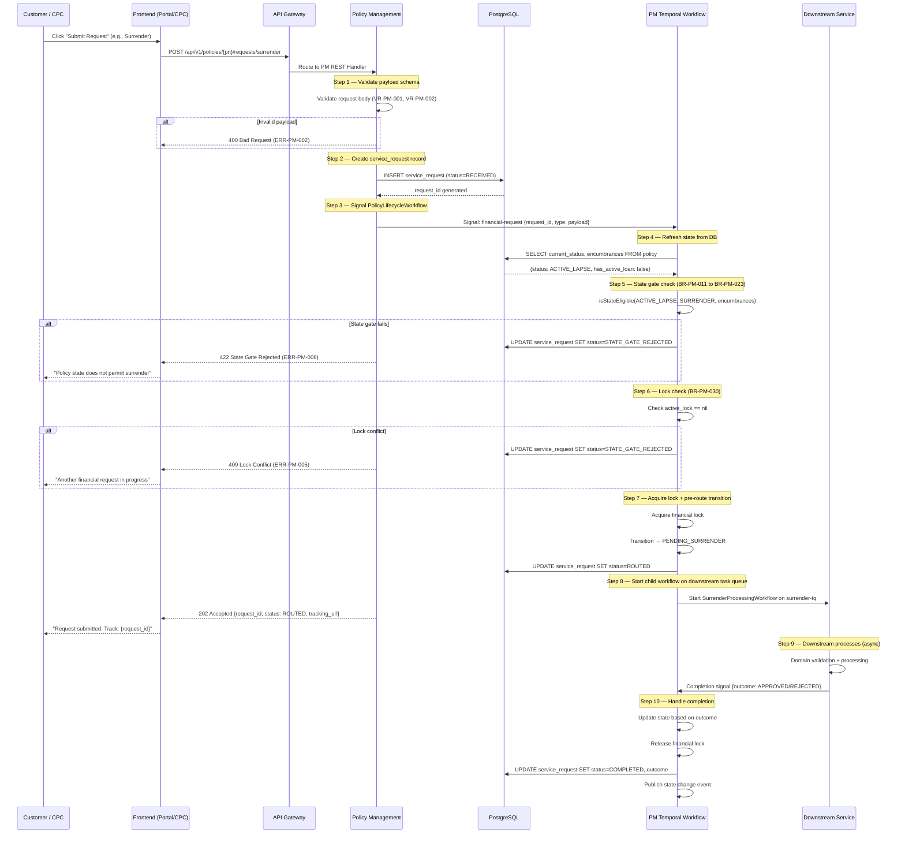
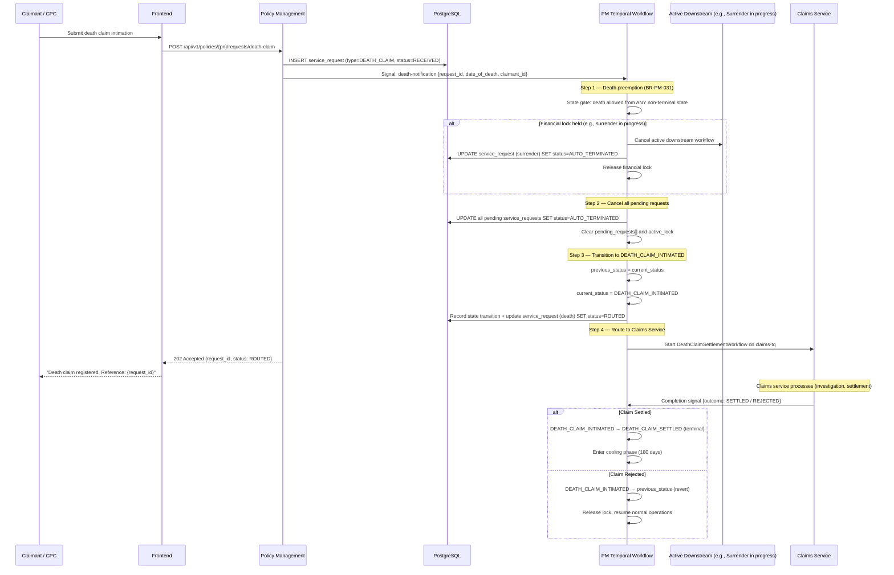
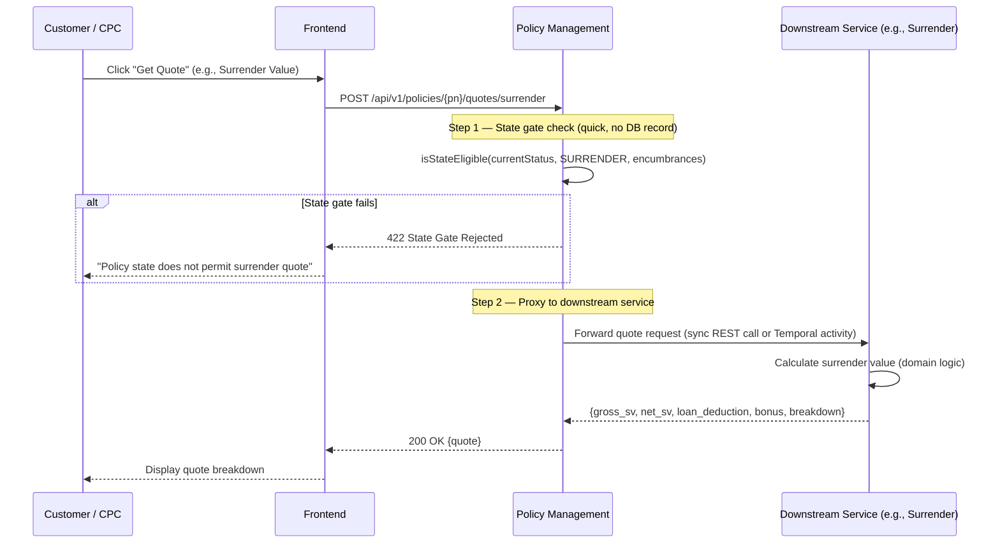
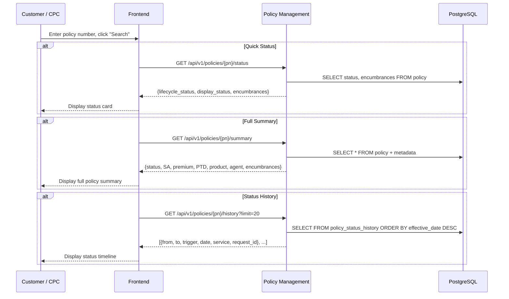
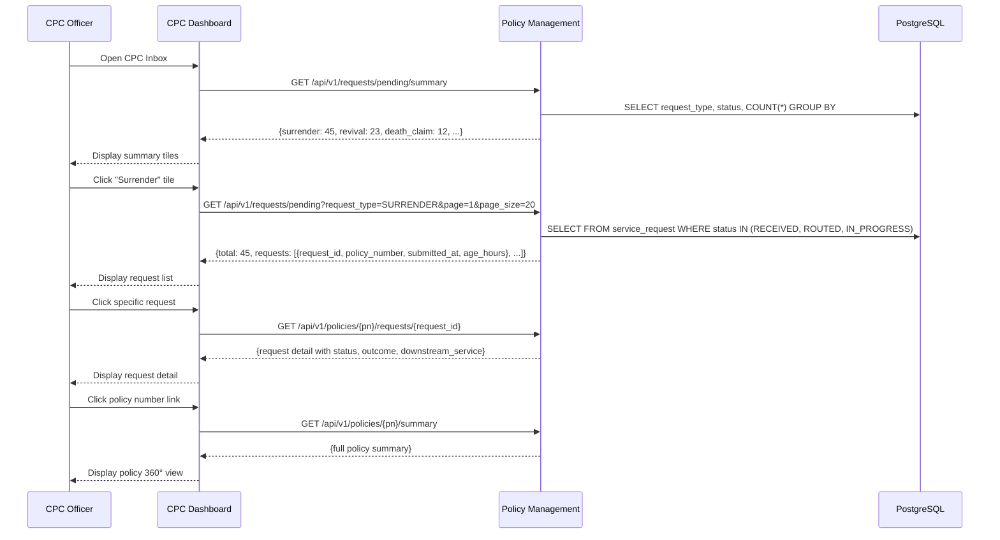
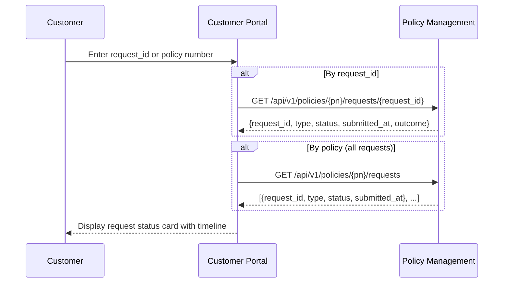
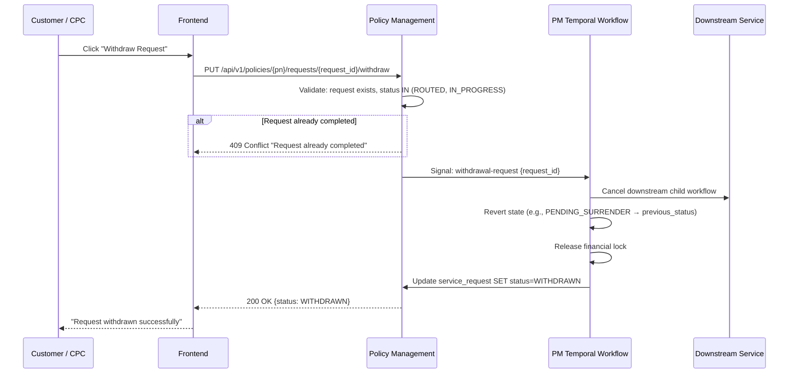
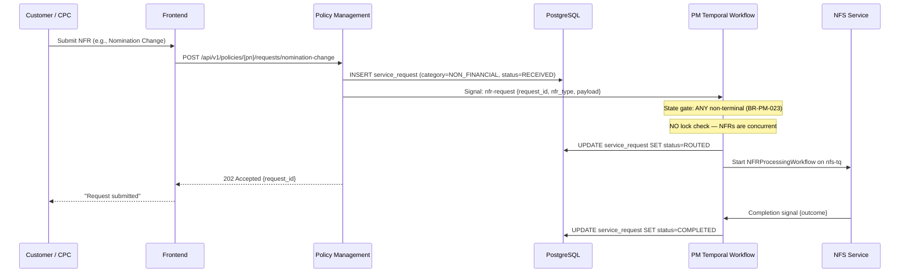
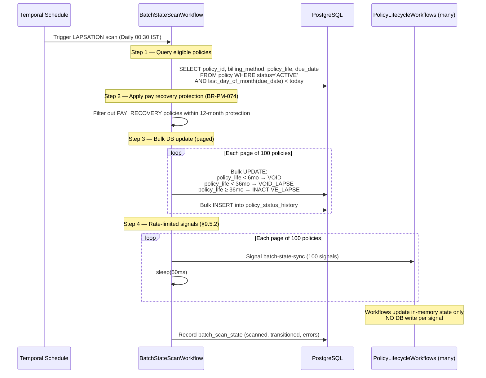

# Policy Management Orchestrator — User Journey Documentation

**Module**: Policy Management Orchestrator (PM)
**Version**: 1.0 (aligned with req_Policy_Management_Orchestrator_v4_1.md)
**Date**: March 2026
**Source**: req_Policy_Management_Orchestrator_v4_1.md (4,888 lines, 37 changelog entries)

---

## 1. Component Summary

| Component Type | Count | ID Range |
|----------------|-------|----------|
| Functional Requirements | 22 | FR-PM-001 to FR-PM-022 |
| Business Rules | 95 | BR-PM-001 to BR-PM-097 |
| Validation Rules | 31 | VR-PM-001 to VR-PM-031 |
| Error Codes | 15 | ERR-PM-001 to ERR-PM-015 |
| Signal Channels | 30 | Typed per-service |
| Query Handlers | 7 | Temporal query handlers |
| REST API Endpoints | 31 | 17 request + 3 quote + 5 lifecycle + 6 query |
| Batch Jobs | 6 | FR-PM-011 to FR-PM-015 |
| Data Entities | 9 | policy, service_request, policy_lock, etc. |
| State Gate Rules | 13 | BR-PM-011 to BR-PM-023 |
| Lifecycle States | 23 | Canonical states |
| State Transitions | 72 | Complete transition table |

---

## 2. Complexity Assessment

| Dimension | Assessment |
|-----------|-----------|
| Overall Complexity | **HIGH** |
| Estimated Journeys | 10 (4 CRITICAL, 3 HIGH, 3 MEDIUM) |
| Integration Complexity | **Very High** — orchestrates 12 downstream services |
| Temporal Workflows | 2 (PolicyLifecycleWorkflow, BatchStateScanWorkflow) |
| Unique Actor Roles | 5 (Customer, CPC Officer, Approver, System/Batch, Admin) |
| Architectural Pattern | Single entry point — all policy operations route through PM |

---

## 3. Journey Catalog

| Journey ID | Name | Actors | SLA | Priority |
|------------|------|--------|-----|----------|
| UJ-PM-001 | Submit Financial Request | Customer, CPC Officer | < 500ms routing | CRITICAL |
| UJ-PM-002 | Death Claim Intimation | Claimant, CPC Officer | Immediate routing | CRITICAL |
| UJ-PM-003 | Request Quote | Customer, CPC Officer | < 200ms | CRITICAL |
| UJ-PM-004 | Policy Status Inquiry | Customer, CPC Officer | < 200ms | CRITICAL |
| UJ-PM-005 | CPC Inbox & Request Management | CPC Officer | < 200ms | HIGH |
| UJ-PM-006 | Request Tracking | Customer | < 200ms | HIGH |
| UJ-PM-007 | Request Withdrawal | Customer, CPC Officer | < 500ms | HIGH |
| UJ-PM-008 | Submit Non-Financial Request | Customer, CPC Officer | < 500ms | MEDIUM |
| UJ-PM-009 | Batch Lapsation Processing | System (Batch) | < 2 hours | MEDIUM |
| UJ-PM-010 | Policy 360° Dashboard | CPC Officer, Admin | < 200ms | MEDIUM |

---

## 4. Detailed Journeys

---

### DETAILED JOURNEY: UJ-PM-001 — Submit Financial Request

#### Journey Overview

| Field | Detail |
|-------|--------|
| **User Goal** | Submit a financial operation on a policy (surrender, loan, revival, claim, commutation, conversion, freelook, paid-up) |
| **Entry Point** | Customer Portal, Mobile App, CPC Screen |
| **Success Criteria** | Request registered in PM, state gate passed, routed to downstream service, request_id returned |
| **Exit Points** | 202 Accepted (success), 422 State Gate Rejected, 409 Lock Conflict, 404 Policy Not Found |
| **Duration (SLA)** | < 500ms from request receipt to routing confirmation |
| **Actors** | Customer (portal/mobile), CPC Officer (CPC screen) |

#### Sequence Diagram



#### Step-by-Step Breakdown

##### Step 1: Validate Request Payload
- **Frontend Action**: User fills request form and clicks Submit
- **User Role**: Customer / CPC Officer
- **Screen**: Policy Operations → {Request Type} Form
- **API Call**: `POST /api/v1/policies/{pn}/requests/{request_type}`
- **Request**:
```json
{
  "source_channel": "CUSTOMER_PORTAL",
  "submitted_by": "user-uuid",
  "payload": {
    "disbursement_method": "NEFT",
    "bank_account_id": "uuid",
    "reason": "Financial need"
  }
}
```
- **Validation**: VR-PM-001 (request_id format), VR-PM-002 (policy exists)
- **Error Responses**: ERR-PM-002 (invalid payload), ERR-PM-003 (policy not found)
- **Components Applied**: FR-PM-021, VR-PM-001, VR-PM-002

##### Step 2: Create Service Request Record
- **API Call**: Internal — PM REST handler writes to DB
- **State Transition**: service_request created with status `RECEIVED`
- **Business Logic**: PM generates UUID `request_id`. This ID becomes the FK for all downstream domain records.
- **Components Applied**: FR-PM-021 (central registry), §8.3 (service_request entity)

##### Step 3: Signal PolicyLifecycleWorkflow
- **API Call**: Internal — Temporal SignalWorkflow
- **Business Logic**: PM sends signal to the policy's long-running workflow. Workflow ID = `plw-{policy_number}`
- **Components Applied**: FR-PM-007 (signal channels), FR-PM-003 (idempotency)

##### Step 4: Refresh State from DB
- **API Call**: Internal — Activity: `RefreshStateFromDBActivity`
- **Business Logic**: One DB read to ensure in-memory state is current. Catches batch-updated-but-not-yet-signaled states.
- **Components Applied**: §9.5.2 (database-first batch pattern edge case)

##### Step 5: State Gate Check
- **Business Logic**: `isStateEligible(currentStatus, requestType, encumbrances)`. Checks only lifecycle state — no domain rules.
- **Components Applied**: BR-PM-011 to BR-PM-023 (state gate rules), VR-PM-009 (state gate validation)
- **Error Responses**: ERR-PM-006 (state gate rejected), ERR-PM-011 (terminal state)

##### Step 6: Lock Check
- **Business Logic**: Financial requests are mutually exclusive. Only one at a time per policy.
- **Components Applied**: BR-PM-030 (financial mutual exclusion), VR-PM-011 (lock check)
- **Error Responses**: ERR-PM-005 (lock conflict)

##### Step 7: Acquire Lock + Route
- **State Transition**: Current state → Pre-route state (e.g., ACTIVE_LAPSE → PENDING_SURRENDER)
- **Business Logic**: Lock acquired, service_request updated to ROUTED, child workflow started.
- **Components Applied**: FR-PM-016 (financial lock), FR-PM-009 (routing table)

##### Step 8: Return 202 Accepted
- **Response**:
```json
{
  "request_id": "a1b2c3d4-uuid",
  "policy_number": "PLI/2026/000001",
  "request_type": "SURRENDER",
  "status": "ROUTED",
  "state_gate_status": "ACTIVE_LAPSE",
  "downstream_service": "surrender",
  "submitted_at": "2026-03-05T10:30:00Z",
  "timeout_at": "2026-04-04T10:30:00Z",
  "tracking_url": "/api/v1/policies/PLI-2026-000001/requests/a1b2c3d4-uuid"
}
```

##### Step 9: Downstream Processing (Async)
- **Business Logic**: Downstream service receives child workflow with `request_id`. Creates domain-specific records with FK to PM. Performs domain validation and processing. Signals PM with completion.
- **Components Applied**: §15.5.2 (per-service migration map)

##### Step 10: Handle Completion
- **State Transition**: Pre-route state → Final state (e.g., PENDING_SURRENDER → SURRENDERED or → previous_status on rejection)
- **Business Logic**: PM updates state, releases lock, updates service_request, publishes event.
- **Components Applied**: FR-PM-019 (completion handling), FR-PM-022 (event publication)

#### Applicable Request Types (this journey covers all)

| Request Type | Pre-Route State | Success State | Rejection State | State Gate Rule |
|---|---|---|---|---|
| Surrender | PENDING_SURRENDER | SURRENDERED | previous_status | BR-PM-011 |
| Loan | — (no pre-route) | ACTIVE (+ encumbrance) | ACTIVE | BR-PM-012 |
| Loan Repayment | — | ACTIVE / ATP | — | BR-PM-020 |
| Revival | REVIVAL_PENDING | ACTIVE | previous_lapse_status | BR-PM-013 |
| Maturity Claim | — | MATURED | ACTIVE | BR-PM-015 |
| Survival Benefit | — | ACTIVE (metadata update) | — | BR-PM-016 |
| Commutation | — | ACTIVE (SA/premium reduced) | — | BR-PM-017 |
| Conversion | — | CONVERTED (old policy) | ACTIVE | BR-PM-018 |
| FLC | — | FLC_CANCELLED | FREE_LOOK_ACTIVE | BR-PM-019 |
| Paid-Up (voluntary) | — | PAID_UP | — | BR-PM-022 |

---

### DETAILED JOURNEY: UJ-PM-002 — Death Claim Intimation

#### Journey Overview

| Field | Detail |
|-------|--------|
| **User Goal** | Intimate death of policyholder to initiate death claim process |
| **Entry Point** | CPC Screen, Customer Portal |
| **Success Criteria** | Policy transitioned to DEATH_CLAIM_INTIMATED, all pending operations cancelled, claim routed |
| **Exit Points** | 202 Accepted, 422 Terminal State |
| **Duration (SLA)** | Immediate — death preempts all other operations |
| **Actors** | Claimant (nominee/legal heir), CPC Officer |

> **Why this is a separate journey**: Death notification has unique preemption logic — it overrides
> all other operations including active financial locks (BR-PM-031). No other request type does this.

#### Sequence Diagram



#### Step-by-Step Breakdown

##### Step 1: Submit Death Intimation
- **API Call**: `POST /api/v1/policies/{pn}/requests/death-claim`
- **Request**:
```json
{
  "source_channel": "CPC",
  "submitted_by": "cpc-officer-uuid",
  "payload": {
    "customer_id": "uuid",
    "date_of_death": "2026-03-01",
    "cause_of_death": "NATURAL",
    "reported_by": "NOMINEE",
    "claimant_id": "nominee-uuid",
    "claimant_relationship": "SPOUSE"
  }
}
```
- **Components Applied**: FR-PM-021 (#5), BR-PM-014 (death claim state gate)

##### Step 2: Death Preemption
- **Business Logic**: Death overrides everything. If a surrender is in progress, PM cancels the surrender child workflow, releases the lock, and auto-terminates the surrender service_request.
- **Components Applied**: BR-PM-031 (death overrides all), BR-PM-032 (auto-termination), FR-PM-018 (death preemption)

##### Step 3: Transition to DEATH_CLAIM_INTIMATED
- **State Transition**: ANY non-terminal → DEATH_CLAIM_INTIMATED
- **Business Logic**: Previous status preserved for potential revert on rejection.
- **Components Applied**: BR-PM-004 (previous status preservation), VR-PM-026

##### Step 4: Route to Claims Service
- **Business Logic**: Child workflow started on `claims-tq`. Claims service handles investigation, benefit calculation, approval, disbursement.
- **Components Applied**: FR-PM-009 (routing table), §15.5.2 (death claims migration map)

##### Step 5: Handle Completion
- **State Transition (settled)**: DEATH_CLAIM_INTIMATED → DEATH_CLAIM_SETTLED → Enter cooling (180 days) → Workflow ends
- **State Transition (rejected)**: DEATH_CLAIM_INTIMATED → previous_status (revert)
- **Components Applied**: FR-PM-019, §9.5.1 (terminal cooling)

---

### DETAILED JOURNEY: UJ-PM-003 — Request Quote

#### Journey Overview

| Field | Detail |
|-------|--------|
| **User Goal** | Get a quote/calculation before submitting a formal request (surrender value, loan eligibility, conversion quote) |
| **Entry Point** | Customer Portal, Mobile App, CPC Screen |
| **Success Criteria** | Quote returned with calculation breakdown |
| **Exit Points** | 200 OK (quote), 422 State Gate Failed |
| **Duration (SLA)** | < 200ms |
| **Actors** | Customer, CPC Officer |

> **Key difference from UJ-PM-001**: Quotes are read-only pre-flight checks. No `service_request` record created.
> No lock acquired. No state transition. PM does a state gate check and proxies to the downstream service.

#### Sequence Diagram



#### Step-by-Step Breakdown

##### Step 1: Request Quote
- **API Calls**:
  - `POST /api/v1/policies/{pn}/quotes/surrender` — Surrender value quote
  - `POST /api/v1/policies/{pn}/quotes/loan` — Loan eligibility + amount
  - `POST /api/v1/policies/{pn}/quotes/conversion` — Conversion quote
- **Components Applied**: FR-PM-021 (#18, #19, #20)

##### Step 2: State Gate Check
- **Business Logic**: Same state gate as request submission, but no record created and no lock.
- **Components Applied**: BR-PM-011 to BR-PM-023

##### Step 3: Proxy to Downstream
- **Business Logic**: PM forwards the quote request to the downstream service. The downstream service performs domain-specific calculations and returns the result. PM passes it through to the frontend.
- **Response (surrender example)**:
```json
{
  "policy_number": "PLI/2026/000001",
  "quote_type": "SURRENDER",
  "gross_surrender_value": 125000.00,
  "bonus_accumulated": 18500.00,
  "loan_deduction": 45000.00,
  "interest_deduction": 3200.00,
  "net_surrender_value": 95300.00,
  "breakdown": {
    "base_sv_factor": 0.85,
    "premiums_paid_months": 60,
    "total_premiums_payable": 360
  },
  "valid_until": "2026-03-06T00:00:00Z",
  "note": "Quote valid for 24 hours. Domain eligibility verified by surrender service."
}
```

---

### DETAILED JOURNEY: UJ-PM-004 — Policy Status Inquiry

#### Journey Overview

| Field | Detail |
|-------|--------|
| **User Goal** | Check current status, encumbrances, and key details of a policy |
| **Entry Point** | Customer Portal, Mobile App, CPC Screen |
| **Success Criteria** | Current status with encumbrances and display status returned |
| **Exit Points** | 200 OK, 404 Policy Not Found |
| **Duration (SLA)** | < 200ms (p99) |
| **Actors** | Customer, CPC Officer |

#### Sequence Diagram



#### Step-by-Step Breakdown

##### Step 1: Quick Status Check
- **API Call**: `GET /api/v1/policies/{pn}/status`
- **Response**:
```json
{
  "policy_id": "uuid",
  "policy_number": "PLI/2026/000001",
  "lifecycle_status": "ACTIVE",
  "previous_status": "FREE_LOOK_ACTIVE",
  "encumbrances": {
    "has_active_loan": true,
    "loan_outstanding": 45000.00,
    "assignment_type": "NONE",
    "aml_hold": false,
    "dispute_flag": false
  },
  "display_status": "ACTIVE_LOAN",
  "effective_from": "2026-01-30T10:00:00Z",
  "version": 42
}
```
- **Components Applied**: FR-PM-020 (query handlers), FR-PM-021 (#26)

##### Step 2: Full Summary
- **API Call**: `GET /api/v1/policies/{pn}/summary`
- **Components Applied**: FR-PM-021 (#27), FR-PM-006 (metadata tracking)

##### Step 3: Status History
- **API Call**: `GET /api/v1/policies/{pn}/history?from_date=2025-01-01&limit=50`
- **Components Applied**: FR-PM-005 (status history), FR-PM-021 (#28)

---

### DETAILED JOURNEY: UJ-PM-005 — CPC Inbox & Request Management

#### Journey Overview

| Field | Detail |
|-------|--------|
| **User Goal** | View and manage all pending requests across policies |
| **Entry Point** | CPC Dashboard |
| **Success Criteria** | CPC officer can see pending requests, filter, and take action |
| **Exit Points** | Request list displayed |
| **Duration (SLA)** | < 200ms |
| **Actors** | CPC Officer |

#### Sequence Diagram



#### Step-by-Step Breakdown

##### Step 1: Dashboard Summary
- **API Call**: `GET /api/v1/requests/pending/summary`
- **Response**:
```json
{
  "summary": {
    "SURRENDER": { "RECEIVED": 5, "ROUTED": 32, "IN_PROGRESS": 8 },
    "REVIVAL": { "RECEIVED": 2, "ROUTED": 18, "IN_PROGRESS": 3 },
    "DEATH_CLAIM": { "ROUTED": 8, "IN_PROGRESS": 4 },
    "LOAN": { "ROUTED": 15 },
    "NON_FINANCIAL": { "ROUTED": 45, "IN_PROGRESS": 12 }
  },
  "total_pending": 152,
  "oldest_request_age_hours": 168
}
```
- **Components Applied**: FR-PM-021 (#25), §8.3 (service_request registry)

##### Step 2: Filtered Request List
- **API Call**: `GET /api/v1/requests/pending?request_type=SURRENDER&status=ROUTED&sort_by=submitted_at&page=1`
- **Components Applied**: FR-PM-021 (#24)

##### Step 3: Request Detail
- **API Call**: `GET /api/v1/policies/{pn}/requests/{request_id}`
- **Components Applied**: FR-PM-021 (#22)

---

### DETAILED JOURNEY: UJ-PM-006 — Request Tracking

#### Journey Overview

| Field | Detail |
|-------|--------|
| **User Goal** | Track the status of a previously submitted request |
| **Entry Point** | Customer Portal (using request_id or policy number) |
| **Success Criteria** | Current request status with timeline displayed |
| **Duration (SLA)** | < 200ms |
| **Actors** | Customer |

#### Sequence Diagram



#### Response (single request tracking):
```json
{
  "request_id": "a1b2c3d4-uuid",
  "policy_number": "PLI/2026/000001",
  "request_type": "REVIVAL",
  "request_category": "FINANCIAL",
  "status": "IN_PROGRESS",
  "source_channel": "CUSTOMER_PORTAL",
  "submitted_at": "2026-02-15T10:00:00Z",
  "routed_at": "2026-02-15T10:00:02Z",
  "downstream_service": "revival",
  "timeout_at": "2027-02-15T10:00:00Z",
  "completed_at": null,
  "outcome": null,
  "timeline": [
    { "event": "RECEIVED", "at": "2026-02-15T10:00:00Z" },
    { "event": "STATE_GATE_PASSED", "at": "2026-02-15T10:00:01Z" },
    { "event": "ROUTED", "at": "2026-02-15T10:00:02Z", "downstream": "revival" },
    { "event": "IN_PROGRESS", "at": "2026-02-15T10:05:00Z" }
  ]
}
```
- **Components Applied**: FR-PM-021 (#21, #22), §8.3 (service_request)

---

### DETAILED JOURNEY: UJ-PM-007 — Request Withdrawal

#### Journey Overview

| Field | Detail |
|-------|--------|
| **User Goal** | Withdraw a previously submitted request before it completes |
| **Entry Point** | Customer Portal, CPC Screen |
| **Success Criteria** | Downstream workflow cancelled, state reverted, request marked WITHDRAWN |
| **Duration (SLA)** | < 500ms |
| **Actors** | Customer, CPC Officer |

#### Sequence Diagram



- **Request**: `PUT /api/v1/policies/{pn}/requests/{request_id}/withdraw`
- **Components Applied**: FR-PM-021 (#23), SignalWithdrawalRequest, BR-PM-004 (previous status revert)

---

### DETAILED JOURNEY: UJ-PM-008 — Submit Non-Financial Request

#### Journey Overview

| Field | Detail |
|-------|--------|
| **User Goal** | Submit a non-financial operation (nomination change, BMC, assignment, address change, refund, duplicate bond) |
| **Entry Point** | Customer Portal, CPC Screen |
| **Success Criteria** | Request registered and routed to NFS service |
| **Duration (SLA)** | < 500ms |
| **Actors** | Customer, CPC Officer |

> **Key difference from UJ-PM-001**: NFRs do NOT acquire financial locks. They run concurrently with
> financial requests and with each other (BR-PM-023, FR-PM-017).

#### Sequence Diagram



- **Components Applied**: FR-PM-017 (concurrent NFR), FR-PM-021 (#12-17), BR-PM-023

---

### DETAILED JOURNEY: UJ-PM-009 — Batch Lapsation Processing

#### Journey Overview

| Field | Detail |
|-------|--------|
| **User Goal** | System automatically transitions overdue policies to lapsed states |
| **Entry Point** | Temporal Schedule (Daily 00:30 IST) |
| **Success Criteria** | All eligible policies transitioned, workflows synced |
| **Duration (SLA)** | < 2 hours for full scan |
| **Actors** | System (Batch) |

#### Sequence Diagram



- **Components Applied**: FR-PM-011 (lapsation), BR-PM-040 (grace month-end), BR-PM-070 (remission), BR-PM-074 (pay recovery protection), §9.5.2 (database-first batch pattern)

---

### DETAILED JOURNEY: UJ-PM-010 — Policy 360° Dashboard

#### Journey Overview

| Field | Detail |
|-------|--------|
| **User Goal** | Get comprehensive view of a policy: status, history, requests, encumbrances |
| **Entry Point** | CPC Screen |
| **Success Criteria** | Single-page view with all policy information |
| **Actors** | CPC Officer, Admin |

#### API Calls (composed on frontend)

```
1. GET /api/v1/policies/{pn}/summary          → Status, SA, premium, PTD, product
2. GET /api/v1/policies/{pn}/history?limit=10  → Recent state transitions
3. GET /api/v1/policies/{pn}/requests          → All requests (active + historical)
4. GET /api/v1/policies/{pn}/state-gate/surrender → Pre-flight: can surrender?
5. GET /api/v1/policies/{pn}/state-gate/loan      → Pre-flight: can take loan?
6. GET /api/v1/policies/{pn}/state-gate/revival    → Pre-flight: can revive?
```

The frontend calls these in parallel and composes the 360° view. State gate pre-flights determine which action buttons to enable/disable.

- **Components Applied**: FR-PM-020, FR-PM-021 (#26-29), §7.2 (state gate rules)

---

## 5. Hidden / Supporting APIs

### 5.1 Lookup APIs

| API ID | Endpoint | Purpose | Used In |
|--------|----------|---------|---------|
| LU-PM-001 | `GET /api/v1/lookups/request-types` | List available request types for dropdown | UJ-PM-001 form |
| LU-PM-002 | `GET /api/v1/lookups/source-channels` | List source channels (CPC, Portal, Mobile) | UJ-PM-001 form |
| LU-PM-003 | `GET /api/v1/lookups/disbursement-methods` | NEFT, Cheque, Cash, MO | UJ-PM-001 (surrender, claim) |
| LU-PM-004 | `GET /api/v1/lookups/nfr-types` | List NFR sub-types | UJ-PM-008 form |
| LU-PM-005 | `GET /api/v1/lookups/lifecycle-states` | List all 23 states with descriptions | UJ-PM-010 dashboard |
| LU-PM-006 | `GET /api/v1/lookups/products` | PLI/RPLI product codes | Quote forms |

### 5.2 Pre-Validation APIs

| API ID | Endpoint | Purpose | Used In |
|--------|----------|---------|---------|
| PV-PM-001 | `GET /api/v1/policies/{pn}/state-gate/{request_type}` | Pre-flight state gate check | UJ-PM-001 (before form display) |
| PV-PM-002 | `GET /api/v1/policies/{pn}/status` | Quick status check before action | All journeys |
| PV-PM-003 | `GET /api/v1/policies/{pn}/requests?status=ROUTED,IN_PROGRESS` | Check for active requests before new submission | UJ-PM-001 |

### 5.3 Calculation / Quote APIs

| API ID | Endpoint | Purpose | Used In |
|--------|----------|---------|---------|
| CA-PM-001 | `POST /api/v1/policies/{pn}/quotes/surrender` | Surrender value calculation (proxied) | UJ-PM-003 |
| CA-PM-002 | `POST /api/v1/policies/{pn}/quotes/loan` | Loan eligibility + amount (proxied) | UJ-PM-003 |
| CA-PM-003 | `POST /api/v1/policies/{pn}/quotes/conversion` | Conversion quote (proxied) | UJ-PM-003 |

### 5.4 Workflow / Status Tracking APIs

| API ID | Endpoint | Purpose | Used In |
|--------|----------|---------|---------|
| WF-PM-001 | `GET /api/v1/policies/{pn}/requests/{request_id}` | Track single request | UJ-PM-006 |
| WF-PM-002 | `GET /api/v1/policies/{pn}/requests` | All requests for policy | UJ-PM-006, UJ-PM-010 |
| WF-PM-003 | `GET /api/v1/requests/pending` | CPC inbox | UJ-PM-005 |
| WF-PM-004 | `GET /api/v1/requests/pending/summary` | Dashboard counts | UJ-PM-005 |

### 5.5 Bulk / Dashboard APIs

| API ID | Endpoint | Purpose | Used In |
|--------|----------|---------|---------|
| BK-PM-001 | `GET /api/v1/policies/batch-status` | Bulk status lookup (multiple policies) | Reports, batch screens |
| BK-PM-002 | `GET /api/v1/policies/dashboard/metrics` | Aggregate metrics (policies by state, requests by type) | Admin dashboard |

### 5.6 Hidden API Summary

| Category | Count | Examples |
|----------|-------|----------|
| Lookup/Reference | 6 | Request types, channels, disbursement methods, NFR types, states, products |
| Pre-Validation | 3 | State gate, status check, active request check |
| Calculation/Quote | 3 | Surrender quote, loan quote, conversion quote |
| Workflow/Status | 4 | Request tracking, policy requests, CPC inbox, dashboard counts |
| Bulk/Dashboard | 2 | Batch status, aggregate metrics |
| **Total Hidden** | **18** | |

---

## 6. Complete API Inventory

### 6.1 API Catalog

| API # | Method | Endpoint | Type | Journeys | Components |
|-------|--------|----------|------|----------|------------|
| 1 | POST | `/api/v1/policies/{pn}/requests/surrender` | Core | UJ-PM-001 | FR-PM-021, BR-PM-011, VR-PM-009 |
| 2 | POST | `/api/v1/policies/{pn}/requests/loan` | Core | UJ-PM-001 | FR-PM-021, BR-PM-012, VR-PM-010 |
| 3 | POST | `/api/v1/policies/{pn}/requests/loan-repayment` | Core | UJ-PM-001 | FR-PM-021, BR-PM-020 |
| 4 | POST | `/api/v1/policies/{pn}/requests/revival` | Core | UJ-PM-001 | FR-PM-021, BR-PM-013 |
| 5 | POST | `/api/v1/policies/{pn}/requests/death-claim` | Core | UJ-PM-002 | FR-PM-021, BR-PM-014, BR-PM-031 |
| 6 | POST | `/api/v1/policies/{pn}/requests/maturity-claim` | Core | UJ-PM-001 | FR-PM-021, BR-PM-015 |
| 7 | POST | `/api/v1/policies/{pn}/requests/survival-benefit` | Core | UJ-PM-001 | FR-PM-021, BR-PM-016 |
| 8 | POST | `/api/v1/policies/{pn}/requests/commutation` | Core | UJ-PM-001 | FR-PM-021, BR-PM-017 |
| 9 | POST | `/api/v1/policies/{pn}/requests/conversion` | Core | UJ-PM-001 | FR-PM-021, BR-PM-018 |
| 10 | POST | `/api/v1/policies/{pn}/requests/freelook` | Core | UJ-PM-001 | FR-PM-021, BR-PM-019 |
| 11 | POST | `/api/v1/policies/{pn}/requests/paid-up` | Core | UJ-PM-001 | FR-PM-021, BR-PM-022 |
| 12-17 | POST | `/api/v1/policies/{pn}/requests/{nfr-type}` | Core | UJ-PM-008 | FR-PM-021, BR-PM-023, FR-PM-017 |
| 18 | POST | `/api/v1/policies/{pn}/quotes/surrender` | Quote | UJ-PM-003 | FR-PM-021, BR-PM-011 |
| 19 | POST | `/api/v1/policies/{pn}/quotes/loan` | Quote | UJ-PM-003 | FR-PM-021, BR-PM-012 |
| 20 | POST | `/api/v1/policies/{pn}/quotes/conversion` | Quote | UJ-PM-003 | FR-PM-021, BR-PM-018 |
| 21 | GET | `/api/v1/policies/{pn}/requests` | Lifecycle | UJ-PM-006, UJ-PM-010 | FR-PM-021, §8.3 |
| 22 | GET | `/api/v1/policies/{pn}/requests/{id}` | Lifecycle | UJ-PM-006 | FR-PM-021, §8.3 |
| 23 | PUT | `/api/v1/policies/{pn}/requests/{id}/withdraw` | Lifecycle | UJ-PM-007 | FR-PM-021, BR-PM-004 |
| 24 | GET | `/api/v1/requests/pending` | Lifecycle | UJ-PM-005 | FR-PM-021, §8.3 |
| 25 | GET | `/api/v1/requests/pending/summary` | Lifecycle | UJ-PM-005 | FR-PM-021, §8.3 |
| 26 | GET | `/api/v1/policies/{pn}/status` | Query | UJ-PM-004, UJ-PM-010 | FR-PM-020, FR-PM-021 |
| 27 | GET | `/api/v1/policies/{pn}/summary` | Query | UJ-PM-004, UJ-PM-010 | FR-PM-020, FR-PM-021 |
| 28 | GET | `/api/v1/policies/{pn}/history` | Query | UJ-PM-004, UJ-PM-010 | FR-PM-005, FR-PM-021 |
| 29 | GET | `/api/v1/policies/{pn}/state-gate/{type}` | Pre-flight | UJ-PM-003, UJ-PM-010 | FR-PM-021, §7.2 |
| 30 | GET | `/api/v1/policies/batch-status` | Bulk | UJ-PM-010 | FR-PM-021 |
| 31 | GET | `/api/v1/policies/dashboard/metrics` | Bulk | UJ-PM-010 | FR-PM-021 |
| 32-37 | GET | `/api/v1/lookups/{type}` | Lookup | All forms | — |

### 6.2 API Count Summary

| Category | Count |
|----------|-------|
| Request Submission (Core) | 17 |
| Quote/Pre-flight | 3 |
| Request Lifecycle | 5 |
| Policy Query | 6 |
| Lookup/Reference | 6 |
| **Total** | **37** |

---

## 7. Component Traceability Matrix

| Component | Journeys Mapped | Coverage |
|-----------|----------------|----------|
| FR-PM-001 to FR-PM-003 (Workflow lifecycle) | UJ-PM-001, UJ-PM-009 | ✅ 100% |
| FR-PM-004 to FR-PM-006 (State management) | UJ-PM-004, UJ-PM-010 | ✅ 100% |
| FR-PM-007 to FR-PM-010 (Routing/orchestration) | UJ-PM-001, UJ-PM-002, UJ-PM-008 | ✅ 100% |
| FR-PM-011 to FR-PM-015 (Batch jobs) | UJ-PM-009 | ✅ 100% |
| FR-PM-016 to FR-PM-018 (Locking/concurrency) | UJ-PM-001, UJ-PM-002, UJ-PM-007, UJ-PM-008 | ✅ 100% |
| FR-PM-019 (Completion handling) | UJ-PM-001, UJ-PM-002 | ✅ 100% |
| FR-PM-020 to FR-PM-021 (Query/REST) | ALL journeys | ✅ 100% |
| FR-PM-022 (Event publication) | UJ-PM-001, UJ-PM-002, UJ-PM-009 | ✅ 100% |
| BR-PM-011 to BR-PM-023 (State gate) | UJ-PM-001, UJ-PM-002, UJ-PM-003, UJ-PM-008 | ✅ 100% |
| BR-PM-030 to BR-PM-033 (Conflict detection) | UJ-PM-001, UJ-PM-002 | ✅ 100% |
| BR-PM-040 to BR-PM-045 (Time-based) | UJ-PM-009 | ✅ 100% |
| BR-PM-074 (Pay recovery protection) | UJ-PM-009 | ✅ 100% |
| VR-PM-001 to VR-PM-012 (Validations) | UJ-PM-001, UJ-PM-002 | ✅ 100% |
| ERR-PM-001 to ERR-PM-015 (Error codes) | UJ-PM-001, UJ-PM-002, UJ-PM-007 | ✅ 100% |
| §8.3 service_request (Central registry) | UJ-PM-001, UJ-PM-002, UJ-PM-005, UJ-PM-006, UJ-PM-007, UJ-PM-008 | ✅ 100% |
| §9.5.1 (Terminal cooling) | UJ-PM-002 (death claim settlement) | ✅ 100% |
| §9.5.2 (Batch signaling) | UJ-PM-009 | ✅ 100% |

---

## 8. Phased Implementation Plan

| Phase | APIs | Priority | Scope |
|-------|------|----------|-------|
| **Phase 1 (MVP)** | #26 (status), #27 (summary), #28 (history), #29 (state-gate), #1-10 (financial requests), #5 (death claim), #21-22 (request tracking) | CRITICAL | Core request flow + query + tracking |
| **Phase 2** | #18-20 (quotes), #23 (withdrawal), #24-25 (CPC inbox), #12-17 (NFRs), #30-31 (bulk/dashboard) | HIGH | Quotes, CPC operations, NFRs |
| **Phase 3** | #32-37 (lookups), UJ-PM-009 (batch), UJ-PM-010 (360° dashboard composition) | MEDIUM | Supporting APIs, batch, dashboard |

| Phase | APIs | Sprints | Features | Risk |
|-------|------|---------|----------|------|
| Phase 1 (MVP) | 22 | 4-5 | Core operations + tracking | Moderate |
| Phase 2 | 10 | 2-3 | Quotes + CPC + NFR | Low |
| Phase 3 | 5 + batch | 2-3 | Lookups + dashboard | Low |
| **Total** | **37** | **8-11** | **Full coverage** | Progressive |

---

*Generated using insurance-api-flow-designer skill.*
*Source: req_Policy_Management_Orchestrator_v4_1.md (v4.1, March 2026)*
